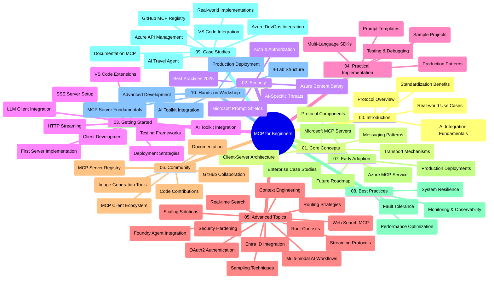

<!--
CO_OP_TRANSLATOR_METADATA:
{
  "original_hash": "719117a0a5f34ade7b5dfb61ee06fb13",
  "translation_date": "2025-09-26T18:29:25+00:00",
  "source_file": "study_guide.md",
  "language_code": "th"
}
-->
# คู่มือการศึกษา Model Context Protocol (MCP) สำหรับผู้เริ่มต้น

คู่มือการศึกษานี้ให้ภาพรวมของโครงสร้างและเนื้อหาในคลังข้อมูลสำหรับหลักสูตร "Model Context Protocol (MCP) สำหรับผู้เริ่มต้น" ใช้คู่มือนี้เพื่อสำรวจคลังข้อมูลอย่างมีประสิทธิภาพและใช้ประโยชน์จากทรัพยากรที่มีอยู่ให้มากที่สุด

## ภาพรวมของคลังข้อมูล

Model Context Protocol (MCP) เป็นกรอบมาตรฐานสำหรับการโต้ตอบระหว่างโมเดล AI และแอปพลิเคชันของลูกค้า MCP ถูกสร้างขึ้นครั้งแรกโดย Anthropic และปัจจุบันได้รับการดูแลโดยชุมชน MCP ผ่านองค์กร GitHub อย่างเป็นทางการ คลังข้อมูลนี้มีหลักสูตรที่ครอบคลุมพร้อมตัวอย่างโค้ดใน C#, Java, JavaScript, Python และ TypeScript ซึ่งออกแบบมาสำหรับนักพัฒนา AI สถาปนิกระบบ และวิศวกรซอฟต์แวร์

## แผนภาพหลักสูตร

## โครงสร้างคลังข้อมูล

คลังข้อมูลนี้แบ่งออกเป็นสิบส่วนหลัก โดยแต่ละส่วนมุ่งเน้นไปที่แง่มุมต่าง ๆ ของ MCP:

1. **บทนำ (00-Introduction/)**
   - ภาพรวมของ Model Context Protocol
   - เหตุผลที่การสร้างมาตรฐานมีความสำคัญในกระบวนการ AI
   - กรณีการใช้งานและประโยชน์ในทางปฏิบัติ

2. **แนวคิดหลัก (01-CoreConcepts/)**
   - สถาปัตยกรรมแบบไคลเอนต์-เซิร์ฟเวอร์
   - องค์ประกอบสำคัญของโปรโตคอล
   - รูปแบบการส่งข้อความใน MCP

3. **ความปลอดภัย (02-Security/)**
   - ภัยคุกคามด้านความปลอดภัยในระบบที่ใช้ MCP
   - แนวทางปฏิบัติที่ดีที่สุดในการรักษาความปลอดภัย
   - กลยุทธ์การตรวจสอบสิทธิ์และการอนุญาต
   - **เอกสารความปลอดภัยที่ครอบคลุม**:
     - MCP Security Best Practices 2025
     - Azure Content Safety Implementation Guide
     - MCP Security Controls and Techniques
     - MCP Best Practices Quick Reference
   - **หัวข้อสำคัญด้านความปลอดภัย**:
     - การโจมตีด้วยการฉีดคำสั่งและการปนเปื้อนเครื่องมือ
     - การแย่งชิงเซสชันและปัญหาการมอบหมายที่สับสน
     - ช่องโหว่ในการส่งผ่านโทเค็น
     - การอนุญาตที่มากเกินไปและการควบคุมการเข้าถึง
     - ความปลอดภัยในห่วงโซ่อุปทานสำหรับส่วนประกอบ AI
     - การผสาน Microsoft Prompt Shields

4. **เริ่มต้นใช้งาน (03-GettingStarted/)**
   - การตั้งค่าและการกำหนดค่าของสภาพแวดล้อม
   - การสร้างเซิร์ฟเวอร์และไคลเอนต์ MCP เบื้องต้น
   - การผสานรวมกับแอปพลิเคชันที่มีอยู่
   - รวมถึงส่วนต่าง ๆ เช่น:
     - การสร้างเซิร์ฟเวอร์ครั้งแรก
     - การพัฒนาไคลเอนต์
     - การผสานไคลเอนต์ LLM
     - การผสาน VS Code
     - เซิร์ฟเวอร์ Server-Sent Events (SSE)
     - การสตรีม HTTP
     - การผสาน AI Toolkit
     - กลยุทธ์การทดสอบ
     - แนวทางการปรับใช้

5. **การใช้งานในทางปฏิบัติ (04-PracticalImplementation/)**
   - การใช้ SDK ในภาษาการเขียนโปรแกรมต่าง ๆ
   - เทคนิคการดีบัก ทดสอบ และตรวจสอบ
   - การสร้างเทมเพลตคำสั่งและเวิร์กโฟลว์ที่นำกลับมาใช้ใหม่ได้
   - โครงการตัวอย่างพร้อมตัวอย่างการใช้งาน

6. **หัวข้อขั้นสูง (05-AdvancedTopics/)**
   - เทคนิคการออกแบบบริบท
   - การผสาน Foundry agent
   - เวิร์กโฟลว์ AI แบบหลายรูปแบบ
   - การสาธิตการตรวจสอบสิทธิ์ OAuth2
   - ความสามารถในการค้นหาแบบเรียลไทม์
   - การสตรีมแบบเรียลไทม์
   - การใช้งานบริบทหลัก
   - กลยุทธ์การกำหนดเส้นทาง
   - เทคนิคการสุ่มตัวอย่าง
   - วิธีการปรับขนาด
   - การพิจารณาด้านความปลอดภัย
   - การผสานความปลอดภัย Entra ID
   - การผสานการค้นหาเว็บ

7. **การมีส่วนร่วมของชุมชน (06-CommunityContributions/)**
   - วิธีการมีส่วนร่วมในโค้ดและเอกสาร
   - การทำงานร่วมกันผ่าน GitHub
   - การปรับปรุงและข้อเสนอแนะที่ขับเคลื่อนโดยชุมชน
   - การใช้ MCP ไคลเอนต์ต่าง ๆ (Claude Desktop, Cline, VSCode)
   - การทำงานกับเซิร์ฟเวอร์ MCP ยอดนิยม รวมถึงการสร้างภาพ

8. **บทเรียนจากการใช้งานในช่วงแรก (07-LessonsfromEarlyAdoption/)**
   - การใช้งานจริงและเรื่องราวความสำเร็จ
   - การสร้างและปรับใช้โซลูชันที่ใช้ MCP
   - แนวโน้มและแผนงานในอนาคต
   - **Microsoft MCP Servers Guide**: คู่มือที่ครอบคลุมสำหรับเซิร์ฟเวอร์ MCP ของ Microsoft ที่พร้อมใช้งาน 10 เซิร์ฟเวอร์ รวมถึง:
     - Microsoft Learn Docs MCP Server
     - Azure MCP Server (ตัวเชื่อมต่อเฉพาะ 15+)
     - GitHub MCP Server
     - Azure DevOps MCP Server
     - MarkItDown MCP Server
     - SQL Server MCP Server
     - Playwright MCP Server
     - Dev Box MCP Server
     - Azure AI Foundry MCP Server
     - Microsoft 365 Agents Toolkit MCP Server

9. **แนวทางปฏิบัติที่ดีที่สุด (08-BestPractices/)**
   - การปรับแต่งประสิทธิภาพและการเพิ่มประสิทธิภาพ
   - การออกแบบระบบ MCP ที่ทนต่อข้อผิดพลาด
   - กลยุทธ์การทดสอบและความยืดหยุ่น

10. **กรณีศึกษา (09-CaseStudy/)**
    - **กรณีศึกษาที่ครอบคลุมเจ็ดกรณี** แสดงให้เห็นถึงความหลากหลายของ MCP ในสถานการณ์ต่าง ๆ:
    - **Azure AI Travel Agents**: การจัดการหลายตัวแทนด้วย Azure OpenAI และ AI Search
    - **Azure DevOps Integration**: การทำงานอัตโนมัติของกระบวนการเวิร์กโฟลว์ด้วยการอัปเดตข้อมูล YouTube
    - **การดึงเอกสารแบบเรียลไทม์**: ไคลเอนต์คอนโซล Python พร้อมการสตรีม HTTP
    - **ตัวสร้างแผนการศึกษาแบบโต้ตอบ**: แอปเว็บ Chainlit พร้อม AI เชิงสนทนา
    - **เอกสารในตัวแก้ไข**: การผสาน VS Code กับเวิร์กโฟลว์ GitHub Copilot
    - **การจัดการ API ของ Azure**: การผสาน API ระดับองค์กรกับการสร้างเซิร์ฟเวอร์ MCP
    - **GitHub MCP Registry**: การพัฒนาและแพลตฟอร์มการผสานตัวแทน
    - ตัวอย่างการใช้งานที่ครอบคลุมการผสานระดับองค์กร ผลผลิตของนักพัฒนา และการพัฒนาในระบบนิเวศ

11. **เวิร์กช็อปแบบลงมือทำ (10-StreamliningAIWorkflowsBuildingAnMCPServerWithAIToolkit/)**
    - เวิร์กช็อปแบบลงมือทำที่ครอบคลุมการผสาน MCP กับ AI Toolkit
    - การสร้างแอปพลิเคชันอัจฉริยะที่เชื่อมโยงโมเดล AI กับเครื่องมือในโลกจริง
    - โมดูลเชิงปฏิบัติที่ครอบคลุมพื้นฐาน การพัฒนาเซิร์ฟเวอร์แบบกำหนดเอง และกลยุทธ์การปรับใช้ในระดับการผลิต
    - **โครงสร้างห้องปฏิบัติการ**:
      - ห้องปฏิบัติการ 1: พื้นฐานเซิร์ฟเวอร์ MCP
      - ห้องปฏิบัติการ 2: การพัฒนาเซิร์ฟเวอร์ MCP ขั้นสูง
      - ห้องปฏิบัติการ 3: การผสาน AI Toolkit
      - ห้องปฏิบัติการ 4: การปรับใช้และการปรับขนาดในระดับการผลิต
    - วิธีการเรียนรู้แบบห้องปฏิบัติการพร้อมคำแนะนำทีละขั้นตอน

## ทรัพยากรเพิ่มเติม

คลังข้อมูลนี้มีทรัพยากรสนับสนุน:

- **โฟลเดอร์ภาพ**: มีแผนภาพและภาพประกอบที่ใช้ในหลักสูตร
- **การแปล**: รองรับหลายภาษา พร้อมการแปลเอกสารอัตโนมัติ
- **ทรัพยากร MCP อย่างเป็นทางการ**:
  - [MCP Documentation](https://modelcontextprotocol.io/)
  - [MCP Specification](https://spec.modelcontextprotocol.io/)
  - [MCP GitHub Repository](https://github.com/modelcontextprotocol)

## วิธีการใช้คลังข้อมูลนี้

1. **การเรียนรู้แบบลำดับขั้น**: ทำตามบทต่าง ๆ ตามลำดับ (00 ถึง 10) เพื่อประสบการณ์การเรียนรู้ที่มีโครงสร้าง
2. **มุ่งเน้นตามภาษา**: หากคุณสนใจภาษาโปรแกรมเฉพาะ ให้สำรวจไดเรกทอรีตัวอย่างสำหรับการใช้งานในภาษาที่คุณต้องการ
3. **การใช้งานในทางปฏิบัติ**: เริ่มต้นที่ส่วน "Getting Started" เพื่อตั้งค่าสภาพแวดล้อมและสร้างเซิร์ฟเวอร์และไคลเอนต์ MCP ครั้งแรกของคุณ
4. **การสำรวจขั้นสูง**: เมื่อคุณคุ้นเคยกับพื้นฐานแล้ว ให้เจาะลึกหัวข้อขั้นสูงเพื่อขยายความรู้ของคุณ
5. **การมีส่วนร่วมของชุมชน**: เข้าร่วมชุมชน MCP ผ่านการสนทนาใน GitHub และช่องทาง Discord เพื่อเชื่อมต่อกับผู้เชี่ยวชาญและนักพัฒนาคนอื่น ๆ

## MCP ไคลเอนต์และเครื่องมือ

หลักสูตรนี้ครอบคลุม MCP ไคลเอนต์และเครื่องมือหลากหลาย:

1. **ไคลเอนต์อย่างเป็นทางการ**:
   - Visual Studio Code 
   - MCP ใน Visual Studio Code
   - Claude Desktop
   - Claude ใน VSCode 
   - Claude API

2. **ไคลเอนต์ชุมชน**:
   - Cline (แบบเทอร์มินัล)
   - Cursor (ตัวแก้ไขโค้ด)
   - ChatMCP
   - Windsurf

3. **เครื่องมือจัดการ MCP**:
   - MCP CLI
   - MCP Manager
   - MCP Linker
   - MCP Router

## เซิร์ฟเวอร์ MCP ยอดนิยม

คลังข้อมูลนี้แนะนำเซิร์ฟเวอร์ MCP หลากหลาย รวมถึง:

1. **เซิร์ฟเวอร์ MCP ของ Microsoft อย่างเป็นทางการ**:
   - Microsoft Learn Docs MCP Server
   - Azure MCP Server (ตัวเชื่อมต่อเฉพาะ 15+)
   - GitHub MCP Server
   - Azure DevOps MCP Server
   - MarkItDown MCP Server
   - SQL Server MCP Server
   - Playwright MCP Server
   - Dev Box MCP Server
   - Azure AI Foundry MCP Server
   - Microsoft 365 Agents Toolkit MCP Server

2. **เซิร์ฟเวอร์อ้างอิงอย่างเป็นทางการ**:
   - Filesystem
   - Fetch
   - Memory
   - Sequential Thinking

3. **การสร้างภาพ**:
   - Azure OpenAI DALL-E 3
   - Stable Diffusion WebUI
   - Replicate

4. **เครื่องมือพัฒนา**:
   - Git MCP
   - Terminal Control
   - Code Assistant

5. **เซิร์ฟเวอร์เฉพาะทาง**:
   - Salesforce
   - Microsoft Teams
   - Jira & Confluence

## การมีส่วนร่วม

คลังข้อมูลนี้ยินดีต้อนรับการมีส่วนร่วมจากชุมชน ดูส่วน Community Contributions เพื่อคำแนะนำเกี่ยวกับวิธีการมีส่วนร่วมในระบบนิเวศ MCP อย่างมีประสิทธิภาพ

## บันทึกการเปลี่ยนแปลง

| วันที่ | การเปลี่ยนแปลง |
|-------|----------------|
| 26 กันยายน 2025 | - เพิ่มกรณีศึกษา GitHub MCP Registry ในส่วน 09-CaseStudy - อัปเดตกรณีศึกษาให้สะท้อนกรณีศึกษาที่ครอบคลุมเจ็ดกรณี - เพิ่มรายละเอียดกรณีศึกษาด้วยข้อมูลการใช้งานเฉพาะ - อัปเดตแผนภาพหลักสูตรให้รวม GitHub MCP Registry - ปรับโครงสร้างคู่มือการศึกษาให้สะท้อนการมุ่งเน้นการพัฒนาระบบนิเวศ |
| 18 กรกฎาคม 2025 | - อัปเดตโครงสร้างคลังข้อมูลให้รวม Microsoft MCP Servers Guide - เพิ่มรายการเซิร์ฟเวอร์ MCP ของ Microsoft ที่พร้อมใช้งาน 10 เซิร์ฟเวอร์ - เพิ่มส่วนเซิร์ฟเวอร์ MCP ยอดนิยมด้วยเซิร์ฟเวอร์ MCP ของ Microsoft อย่างเป็นทางการ - อัปเดตส่วนกรณีศึกษาด้วยตัวอย่างไฟล์จริง - เพิ่มรายละเอียดโครงสร้างห้องปฏิบัติการสำหรับเวิร์กช็อปแบบลงมือทำ |
| 16 กรกฎาคม 2025 | - อัปเดตโครงสร้างคลังข้อมูลให้สะท้อนเนื้อหาปัจจุบัน - เพิ่มส่วน MCP Clients and Tools - เพิ่มส่วนเซิร์ฟเวอร์ MCP ยอดนิยม - อัปเดตแผนภาพหลักสูตรด้วยหัวข้อปัจจุบันทั้งหมด - เพิ่มส่วนหัวข้อขั้นสูงด้วยพื้นที่เฉพาะทั้งหมด - อัปเดตกรณีศึกษาให้สะท้อนตัวอย่างจริง - ชี้แจงต้นกำเนิด MCP ว่าถูกสร้างโดย Anthropic |
| 11 มิถุนายน 2025 | - สร้างคู่มือการศึกษาเบื้องต้น - เพิ่มแผนภาพหลักสูตร - ร่างโครงสร้างคลังข้อมูล - รวมโครงการตัวอย่างและทรัพยากรเพิ่มเติม |

---

*คู่มือการศึกษานี้ได้รับการอัปเดตเมื่อวันที่ 26 กันยายน 2025 และให้ภาพรวมของคลังข้อมูล ณ วันที่ดังกล่าว เนื้อหาคลังข้อมูลอาจมีการอัปเดตหลังจากวันที่นี้*

---

