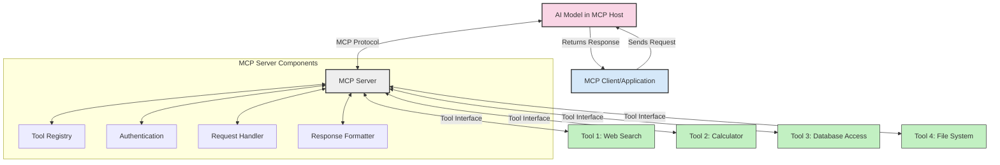
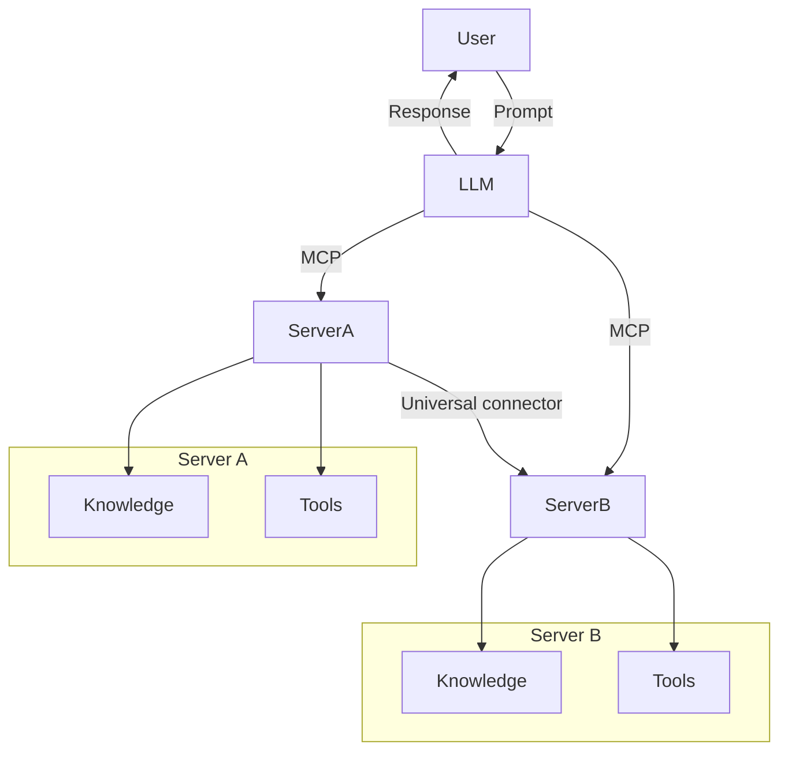

<!--
CO_OP_TRANSLATOR_METADATA:
{
  "original_hash": "1d88dee994dcbb3fa52c271d0c0817b5",
  "translation_date": "2025-05-20T22:09:38+00:00",
  "source_file": "00-Introduction/README.md",
  "language_code": "tl"
}
-->
# Panimula sa Model Context Protocol (MCP): Bakit Mahalaga Ito para sa Scalable AI Applications

Malaking hakbang ang generative AI applications dahil madalas nitong pinapayagan ang user na makipag-ugnayan gamit ang natural na wika. Ngunit habang lumalalim ang oras at resources na inilalagay sa mga ganitong apps, gusto mong masiguro na madali mong maidaragdag ang mga functionality at resources sa paraang madaling palawakin, kaya nitong suportahan ang higit sa isang model na ginagamit, at kayang hawakan ang iba't ibang detalye ng mga modelo. Sa madaling salita, madali lang magsimula ng Gen AI apps, pero habang lumalaki at nagiging komplikado, kailangan mo nang magtakda ng architecture at malamang kailangan mo ng standard para matiyak na consistent ang pagkakagawa ng mga apps mo. Dito pumapasok ang MCP para ayusin ang mga bagay at magbigay ng standard.

---

## **🔍 Ano ang Model Context Protocol (MCP)?**

Ang **Model Context Protocol (MCP)** ay isang **open, standardized interface** na nagpapahintulot sa Large Language Models (LLMs) na makipag-ugnayan nang maayos sa mga external tools, APIs, at data sources. Nagbibigay ito ng consistent na architecture para mapalawak ang kakayahan ng AI models lampas sa kanilang training data, kaya mas matalino, scalable, at responsive ang mga AI system.

---

## **🎯 Bakit Mahalaga ang Standardization sa AI**

Habang lumalalim ang generative AI applications, mahalaga ang pag-adopt ng mga standard na nagsisiguro ng **scalability, extensibility**, at **maintainability**. Tinatalakay ng MCP ang mga pangangailangang ito sa pamamagitan ng:

- Pagsasama-sama ng model-tool integrations
- Pagbawas ng mga marupok at one-off na custom solutions
- Pagpapahintulot na sabay-sabay na gumamit ng maraming modelo sa isang ecosystem

---

## **📚 Mga Layunin sa Pagkatuto**

Pagkatapos basahin ito, magagawa mong:

- I-define ang **Model Context Protocol (MCP)** at ang mga gamit nito
- Maunawaan kung paano ni-standardize ng MCP ang komunikasyon mula model papuntang tool
- Matukoy ang mga pangunahing bahagi ng MCP architecture
- Suriin ang mga totoong aplikasyon ng MCP sa enterprise at development contexts

---

## **💡 Bakit Isang Game-Changer ang Model Context Protocol (MCP)**

### **🔗 Nilulutas ng MCP ang Fragmentation sa AI Interactions**

Bago ang MCP, ang integrasyon ng mga modelo sa tools ay nangangailangan ng:

- Custom code para sa bawat tool-model pair
- Hindi standardized na APIs para sa bawat vendor
- Madalas na pagkasira dahil sa updates
- Mahinang scalability kapag dumadami ang tools

### **✅ Mga Benepisyo ng MCP Standardization**

| **Benepisyo**             | **Deskripsyon**                                                               |
|---------------------------|-------------------------------------------------------------------------------|
| Interoperability          | Ang LLMs ay gumagana nang maayos kasama ang tools mula sa iba't ibang vendor |
| Consistency               | Pare-parehong behavior sa iba't ibang platforms at tools                     |
| Reusability               | Ang tools na ginawa minsan ay magagamit sa iba't ibang proyekto at sistema    |
| Accelerated Development   | Pinapabilis ang development gamit ang standardized, plug-and-play interfaces |

---

## **🧱 Pangkalahatang Overview ng MCP Architecture**

Ang MCP ay sumusunod sa **client-server model**, kung saan:

- **MCP Hosts** ang nagpapatakbo ng AI models
- **MCP Clients** ang nagpapadala ng mga request
- **MCP Servers** ang nagse-serve ng context, tools, at capabilities

### **Pangunahing Bahagi:**

- **Resources** – Static o dynamic na data para sa mga modelo  
- **Prompts** – Predefined workflows para sa guided generation  
- **Tools** – Mga executable functions tulad ng search, calculations  
- **Sampling** – Agentic behavior gamit ang recursive interactions

---

## Paano Gumagana ang MCP Servers

Ang mga MCP server ay gumagana sa mga sumusunod na paraan:

- **Daloy ng Request**:  
    1. Nagpapadala ang MCP Client ng request sa AI Model na tumatakbo sa MCP Host.  
    2. Nakikilala ng AI Model kung kailangang gumamit ng external tools o data.  
    3. Nakikipag-ugnayan ang model sa MCP Server gamit ang standardized protocol.

- **Functionality ng MCP Server**:  
    - Tool Registry: Nagtatala ng mga available na tools at kanilang kakayahan.  
    - Authentication: Tinitiyak ang permiso para ma-access ang mga tools.  
    - Request Handler: Pinoproseso ang mga tool requests mula sa model.  
    - Response Formatter: Inaayos ang output ng tool sa format na maiintindihan ng model.

- **Pagpapatupad ng Tool**:  
    - Ipinapasa ng server ang mga request sa tamang external tools  
    - Pinapatakbo ng tools ang kanilang mga espesyal na function (search, calculation, database queries, atbp.)  
    - Ibinabalik ang resulta sa model sa consistent na format.

- **Pagkumpleto ng Tugon**:  
    - Isinasama ng AI model ang output ng tool sa kanyang sagot.  
    - Ipinapadala ang panghuling sagot pabalik sa client application.

## 👨‍💻 Paano Gumawa ng MCP Server (May Mga Halimbawa)

Pinapayagan ka ng MCP servers na palawakin ang kakayahan ng LLMs sa pamamagitan ng pagbibigay ng data at functionality.

Handa ka na bang subukan? Narito ang mga halimbawa ng paggawa ng simpleng MCP server sa iba't ibang wika:

- **Python Example**: https://github.com/modelcontextprotocol/python-sdk

- **TypeScript Example**: https://github.com/modelcontextprotocol/typescript-sdk

- **Java Example**: https://github.com/modelcontextprotocol/java-sdk

- **C#/.NET Example**: https://github.com/modelcontextprotocol/csharp-sdk

## 🌍 Mga Totoong Gamit ng MCP

Pinapalawak ng MCP ang saklaw ng aplikasyon sa pamamagitan ng pagpapalawak ng kakayahan ng AI:

| **Aplikasyon**             | **Deskripsyon**                                                                |
|---------------------------|--------------------------------------------------------------------------------|
| Enterprise Data Integration | Ikokonekta ang LLMs sa databases, CRMs, o internal tools                      |
| Agentic AI Systems         | Pinapagana ang autonomous agents gamit ang access sa tools at workflows ng desisyon |
| Multi-modal Applications   | Pinagsasama ang text, image, at audio tools sa iisang unified AI app           |
| Real-time Data Integration | Nagdadala ng live data sa AI interactions para sa mas tumpak at kasalukuyang output |

### 🧠 MCP = Universal Standard para sa AI Interactions

Ang Model Context Protocol (MCP) ay nagsisilbing universal standard para sa AI interactions, tulad ng kung paano ni-standardize ng USB-C ang physical connections ng mga devices. Sa mundo ng AI, nagbibigay ang MCP ng consistent na interface na nagpapahintulot sa mga modelo (clients) na makipag-integrate nang maayos sa mga external tools at data providers (servers). Tinatanggal nito ang pangangailangan para sa iba’t ibang custom protocols para sa bawat API o data source.

Sa ilalim ng MCP, ang isang MCP-compatible tool (tinatawag na MCP server) ay sumusunod sa iisang standard. Maaari nitong ipakita ang mga tools o aksyon na inaalok nito at ipatupad ang mga ito kapag hiniling ng AI agent. Ang mga AI agent platform na sumusuporta sa MCP ay kayang tuklasin ang mga available na tools mula sa mga server at tawagin ang mga ito gamit ang standard protocol na ito.

### 💡 Pinapadali ang access sa kaalaman

Bukod sa pag-aalok ng mga tools, pinapadali rin ng MCP ang access sa kaalaman. Pinapayagan nito ang mga aplikasyon na magbigay ng konteksto sa mga large language models (LLMs) sa pamamagitan ng pag-link sa iba't ibang data sources. Halimbawa, ang isang MCP server ay maaaring kumatawan sa dokumento ng kumpanya, na nagpapahintulot sa mga agent na kunin ang mga kaugnay na impormasyon kapag kailangan. Ang isa pang server ay maaaring magpatakbo ng mga partikular na aksyon tulad ng pagpapadala ng email o pag-update ng mga rekord. Para sa agent, ito ay mga tool lang na magagamit niya—ang ilan ay nagbabalik ng data (knowledge context), habang ang iba ay gumagawa ng mga aksyon. Epektibong pinamamahalaan ng MCP ang pareho.

Kapag kumonekta ang agent sa isang MCP server, awtomatiko nitong nalalaman ang mga available na kakayahan at data ng server sa pamamagitan ng standard na format. Pinapahintulutan ng standardisasyong ito ang dynamic na availability ng tools. Halimbawa, kapag nagdagdag ka ng bagong MCP server sa sistema ng agent, agad itong magagamit nang hindi na kailangang baguhin pa ang mga tagubilin sa agent.

Ang ganitong tuloy-tuloy na integrasyon ay naaayon sa daloy na ipinapakita sa mermaid diagram, kung saan nagbibigay ang mga server ng parehong tools at kaalaman, na nagsisiguro ng seamless na pagtutulungan sa pagitan ng mga sistema.

### 👉 Halimbawa: Scalable Agent Solution

## 🔐 Praktikal na Mga Benepisyo ng MCP

Narito ang mga praktikal na benepisyo ng paggamit ng MCP:

- **Bagong impormasyon**: Nakaka-access ang mga modelo ng pinakabagong impormasyon lampas sa kanilang training data  
- **Pagpapalawak ng Kakayahan**: Nagagamit ng mga modelo ang mga espesyal na tools para sa mga gawain na hindi sila sinanay  
- **Pagbawas ng Hallucinations**: Nagbibigay ng factual grounding ang mga external data sources  
- **Privacy**: Mananatili ang sensitibong data sa ligtas na kapaligiran sa halip na isama sa prompts

## 📌 Mahahalagang Punto

Narito ang mga mahahalagang punto sa paggamit ng MCP:

- **MCP** ang nag-standardize kung paano nakikipag-ugnayan ang AI models sa mga tools at data  
- Pinapalaganap ang **extensibility, consistency, at interoperability**  
- Tinutulungan ng MCP na **pabilisin ang development, pagandahin ang reliability, at palawakin ang kakayahan ng model**  
- Ang client-server architecture ay **nagbibigay daan sa flexible at extensible na AI applications**

## 🧠 Ehersisyo

Isipin ang isang AI application na gusto mong gawin.

- Anong **external tools o data** ang makakatulong para mapalawak ang kakayahan nito?  
- Paano makakatulong ang MCP para maging **mas simple at mas maaasahan** ang integrasyon?

## Karagdagang Resources

- [MCP GitHub Repository](https://github.com/modelcontextprotocol)

## Ano ang susunod

Susunod: [Chapter 1: Core Concepts](/01-CoreConcepts/README.md)

**Paunawa**:  
Ang dokumentong ito ay isinalin gamit ang AI translation service na [Co-op Translator](https://github.com/Azure/co-op-translator). Bagamat nagsusumikap kami para sa katumpakan, pakatandaan na ang mga awtomatikong pagsasalin ay maaaring maglaman ng mga pagkakamali o di-tumpak na impormasyon. Ang orihinal na dokumento sa orihinal nitong wika ang dapat ituring na pangunahing sanggunian. Para sa mahahalagang impormasyon, inirerekomenda ang propesyonal na pagsasalin ng tao. Hindi kami mananagot sa anumang hindi pagkakaunawaan o maling interpretasyon na maaaring magmula sa paggamit ng pagsasaling ito.