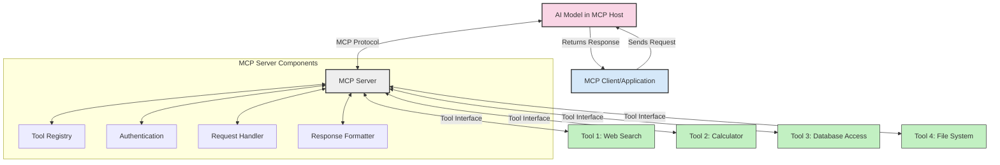
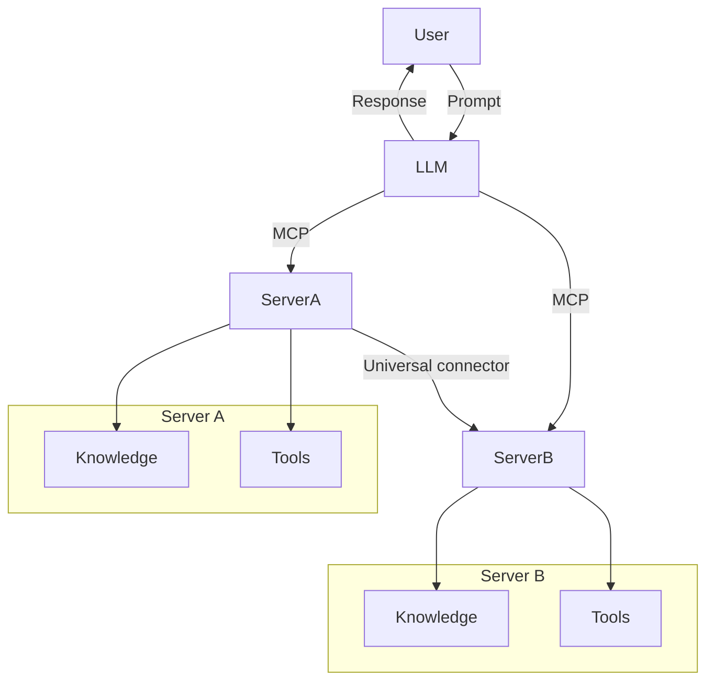

<!--
CO_OP_TRANSLATOR_METADATA:
{
  "original_hash": "02301140adbd807ecf0f17720fa307bc",
  "translation_date": "2025-05-17T06:06:46+00:00",
  "source_file": "00-Introduction/README.md",
  "language_code": "tl"
}
-->
# Panimula sa Model Context Protocol (MCP): Bakit Mahalaga Ito para sa Mga Scalable na Aplikasyon ng AI

Ang mga generative na aplikasyon ng AI ay isang malaking hakbang pasulong dahil madalas na pinapayagan nila ang gumagamit na makipag-ugnayan sa app gamit ang natural na wika. Gayunpaman, habang mas maraming oras at mapagkukunan ang inilalaan sa mga ganitong app, nais mong siguraduhin na maaari mong madaling isama ang mga functionality at mapagkukunan sa paraang madali itong palawigin, na ang iyong app ay maaaring magamit ng higit sa isang modelong ginagamit, at ang mga detalye nito. Sa madaling salita, ang pagbuo ng mga Gen AI app ay madaling simulan ngunit habang ito ay lumalaki at nagiging mas kumplikado, kailangan mong magsimulang tukuyin ang isang arkitektura at malamang na kailangan mong umasa sa isang pamantayan upang matiyak na ang iyong mga app ay itinayo sa isang pare-parehong paraan. Dito pumapasok ang MCP upang ayusin ang mga bagay, upang magbigay ng isang pamantayan.

---

## **🔍 Ano ang Model Context Protocol (MCP)?**

Ang **Model Context Protocol (MCP)** ay isang **bukas, standardized na interface** na nagpapahintulot sa mga Large Language Models (LLMs) na makipag-ugnayan nang walang putol sa mga panlabas na tool, API, at mapagkukunan ng data. Nagbibigay ito ng isang pare-parehong arkitektura upang mapahusay ang functionality ng AI model na lampas sa kanilang training data, na nagbibigay-daan sa mas matalinong, scalable, at mas tumutugon na mga sistema ng AI.

---

## **🎯 Bakit Mahalaga ang Standardization sa AI**

Habang nagiging mas kumplikado ang mga generative na aplikasyon ng AI, mahalagang magpatibay ng mga pamantayan na tinitiyak ang **scalability, extensibility**, at **maintainability**. Tinatalakay ng MCP ang mga pangangailangang ito sa pamamagitan ng:

- Pag-iisa ng mga integrasyon ng modelo at tool
- Pagbabawas ng mga marupok, one-off na custom na solusyon
- Pagpapahintulot sa maraming modelo na mag-coexist sa loob ng isang ecosystem

---

## **📚 Mga Layunin sa Pagkatuto**

Sa pagtatapos ng artikulong ito, magagawa mong:

- Tukuyin ang **Model Context Protocol (MCP)** at ang mga gamit nito
- Maunawaan kung paano isinasaayos ng MCP ang komunikasyon ng modelo at tool
- Tukuyin ang mga pangunahing bahagi ng arkitektura ng MCP
- Tuklasin ang mga aplikasyon ng MCP sa totoong mundo sa mga konteksto ng negosyo at pag-unlad

---

## **💡 Bakit Isang Game-Changer ang Model Context Protocol (MCP)**

### **🔗 Nilulutas ng MCP ang Fragmentation sa Mga Interaksiyon ng AI**

Bago ang MCP, ang pagsasama ng mga modelo sa mga tool ay nangangailangan ng:

- Custom na code para sa bawat pares ng tool-model
- Non-standard na API para sa bawat vendor
- Madalas na pagkasira dahil sa mga update
- Mahinang scalability sa mas maraming tool

### **✅ Mga Benepisyo ng MCP Standardization**

| **Benepisyo**              | **Paglalarawan**                                                                |
|--------------------------|--------------------------------------------------------------------------------|
| Interoperability         | Ang mga LLM ay gumagana nang walang putol sa mga tool sa iba't ibang vendor                       |
| Consistency              | Pare-parehong pag-uugali sa mga platform at tool                                    |
| Reusability              | Ang mga tool na ginawa minsan ay maaaring gamitin sa mga proyekto at sistema                       |
| Accelerated Development  | Bawasan ang oras ng pag-unlad sa pamamagitan ng paggamit ng standardized, plug-and-play na mga interface                |

---

## **🧱 Pangkalahatang-ideya ng Mataas na Antas ng Arkitektura ng MCP**

Ang MCP ay sumusunod sa isang **client-server model**, kung saan:

- Ang mga **MCP Hosts** ay nagpapatakbo ng mga AI model
- Ang mga **MCP Clients** ay nagsisimula ng mga kahilingan
- Ang mga **MCP Servers** ay naglilingkod ng konteksto, mga tool, at mga kakayahan

### **Mga Pangunahing Bahagi:**

- **Resources** – Static o dynamic na data para sa mga modelo  
- **Prompts** – Predefined na mga workflow para sa guided generation  
- **Tools** – Mga executable na function tulad ng search, kalkulasyon  
- **Sampling** – Agentic na pag-uugali sa pamamagitan ng recursive na mga interaksiyon

---

## Paano Gumagana ang MCP Servers

Gumagana ang mga MCP server sa sumusunod na paraan:

- **Request Flow**: 
    1. Ang MCP Client ay nagpapadala ng kahilingan sa AI Model na tumatakbo sa isang MCP Host.
    2. Natutukoy ng AI Model kung kailan nito kailangan ng mga panlabas na tool o data.
    3. Nakikipag-ugnayan ang modelo sa MCP Server gamit ang standardized na protocol.

- **Functionality ng MCP Server**:
    - Tool Registry: Nagpapanatili ng katalogo ng mga available na tool at kanilang mga kakayahan.
    - Authentication: Sinusuri ang mga pahintulot para sa pag-access ng tool.
    - Request Handler: Nagpoproseso ng mga papasok na kahilingan ng tool mula sa modelo.
    - Response Formatter: Nagsasaayos ng mga output ng tool sa isang format na maaring maunawaan ng modelo.

- **Tool Execution**: 
    - Ang server ay nag-reroute ng mga kahilingan sa angkop na mga panlabas na tool
    - Ang mga tool ay nagsasagawa ng kanilang mga espesyal na function (search, kalkulasyon, mga query sa database, atbp.)
    - Ang mga resulta ay ibinabalik sa modelo sa isang pare-parehong format.

- **Response Completion**: 
    - Isinasama ng AI model ang mga output ng tool sa tugon nito.
    - Ang pinal na tugon ay ibinabalik sa client application.

## 👨‍💻 Paano Bumuo ng MCP Server (Gamit ang mga Halimbawa)

Ang mga MCP server ay nagpapahintulot sa iyo na palawigin ang mga kakayahan ng LLM sa pamamagitan ng pagbibigay ng data at functionality.

Handa nang subukan ito? Narito ang mga halimbawa ng paglikha ng isang simpleng MCP server sa iba't ibang wika:

- **Halimbawa sa Python**: https://github.com/modelcontextprotocol/python-sdk

- **Halimbawa sa TypeScript**: https://github.com/modelcontextprotocol/typescript-sdk

- **Halimbawa sa Java**: https://github.com/modelcontextprotocol/java-sdk

- **Halimbawa sa C#/.NET**: https://github.com/modelcontextprotocol/csharp-sdk

## 🌍 Mga Gamit ng MCP sa Totoong Mundo

Ang MCP ay nagbibigay-daan sa malawak na hanay ng mga aplikasyon sa pamamagitan ng pagpapalawig ng mga kakayahan ng AI:

| **Aplikasyon**              | **Paglalarawan**                                                                |
|------------------------------|--------------------------------------------------------------------------------|
| Enterprise Data Integration  | Ikonekta ang mga LLM sa mga database, CRM, o panloob na mga tool                             |
| Agentic AI Systems           | Paganahin ang mga autonomous agent na may access sa tool at mga workflow ng paggawa ng desisyon        |
| Multi-modal Applications     | Pagsamahin ang text, imahe, at audio na mga tool sa loob ng isang pinag-isang AI app            |
| Real-time Data Integration   | Dalhin ang live na data sa mga interaksiyon ng AI para sa mas tumpak, kasalukuyang mga output        |

### 🧠 MCP = Universal Standard para sa Mga Interaksiyon ng AI

Ang Model Context Protocol (MCP) ay kumikilos bilang isang unibersal na pamantayan para sa mga interaksiyon ng AI, katulad ng kung paano nag-standardize ang USB-C ng mga pisikal na koneksyon para sa mga device. Sa mundo ng AI, ang MCP ay nagbibigay ng isang pare-parehong interface, na nagpapahintulot sa mga modelo (mga kliyente) na mag-integrate nang walang putol sa mga panlabas na tool at tagapagbigay ng data (mga server). Inaalis nito ang pangangailangan para sa iba't ibang, custom na mga protocol para sa bawat API o mapagkukunan ng data.

Sa ilalim ng MCP, ang isang tool na tugma sa MCP (tinukoy bilang isang MCP server) ay sumusunod sa isang pinag-isang pamantayan. Ang mga server na ito ay maaaring ilista ang mga tool o aksyon na kanilang inaalok at isakatuparan ang mga aksyon na iyon kapag hiniling ng isang AI agent. Ang mga platform ng AI agent na sumusuporta sa MCP ay may kakayahang tuklasin ang mga available na tool mula sa mga server at i-invoke ang mga ito sa pamamagitan ng standard na protocol na ito.

### 💡 Pinadadali ang access sa kaalaman

Higit pa sa pag-aalok ng mga tool, pinadadali rin ng MCP ang access sa kaalaman. Pinapayagan nito ang mga aplikasyon na magbigay ng konteksto sa mga malalaking modelo ng wika (LLMs) sa pamamagitan ng pag-uugnay sa kanila sa iba't ibang mapagkukunan ng data. Halimbawa, ang isang MCP server ay maaaring kumatawan sa isang repositoryo ng dokumento ng kumpanya, na nagpapahintulot sa mga ahente na makuha ang may-katuturang impormasyon kapag kinakailangan. Ang isa pang server ay maaaring humawak ng mga tiyak na aksyon tulad ng pagpapadala ng mga email o pag-update ng mga talaan. Mula sa pananaw ng ahente, ang mga ito ay simpleng mga tool na maaari nitong gamitin—ang ilang mga tool ay nagbabalik ng data (knowledge context), habang ang iba ay nagsasagawa ng mga aksyon. Mahusay na pinangangasiwaan ng MCP ang pareho.

Ang isang ahente na kumokonekta sa isang MCP server ay awtomatikong natututo ng mga magagamit na kakayahan ng server at naa-access na data sa pamamagitan ng isang standard na format. Ang standardisasyon na ito ay nagbibigay-daan sa dynamic na availability ng tool. Halimbawa, ang pagdaragdag ng bagong MCP server sa sistema ng isang ahente ay agad na nagiging magagamit ang mga function nito nang hindi nangangailangan ng karagdagang pag-customize ng mga tagubilin ng ahente.

Ang pinasimpleng integrasyon na ito ay naaayon sa daloy na inilalarawan sa mermaid diagram, kung saan ang mga server ay nagbibigay ng parehong mga tool at kaalaman, na tinitiyak ang walang putol na pakikipagtulungan sa mga sistema.

### 👉 Halimbawa: Scalable Agent Solution

## 🔐 Praktikal na Benepisyo ng MCP

Narito ang ilang praktikal na benepisyo sa paggamit ng MCP:

- **Freshness**: Maaaring ma-access ng mga modelo ang napapanahong impormasyon na lampas sa kanilang training data
- **Capability Extension**: Maaaring gamitin ng mga modelo ang mga espesyal na tool para sa mga gawain na hindi nila sinanay
- **Reduced Hallucinations**: Ang mga panlabas na mapagkukunan ng data ay nagbibigay ng factual grounding
- **Privacy**: Ang sensitibong data ay maaaring manatili sa loob ng mga secure na kapaligiran sa halip na mai-embed sa mga prompt

## 📌 Mga Pangunahing Puntos

Ang sumusunod ay mga pangunahing puntos para sa paggamit ng MCP:

- Ang **MCP** ay nag-standardize kung paano nakikipag-ugnayan ang mga modelo ng AI sa mga tool at data
- Isinusulong ang **extensibility, consistency, at interoperability**
- Ang MCP ay tumutulong na **bawasan ang oras ng pag-unlad, mapabuti ang pagiging maaasahan, at palawigin ang mga kakayahan ng modelo**
- Ang client-server architecture ay **nagbibigay-daan sa flexible, extensible na mga aplikasyon ng AI**

## 🧠 Ehersisyo

Isipin ang isang aplikasyon ng AI na interesado kang itayo.

- Aling **panlabas na mga tool o data** ang maaaring magpahusay sa mga kakayahan nito?
- Paano maaaring gawing **mas simple at mas maaasahan** ng MCP ang integrasyon?

## Karagdagang Mga Mapagkukunan

- [MCP GitHub Repository](https://github.com/modelcontextprotocol)

## Ano ang susunod

Susunod: [Kabanata 1: Mga Pangunahing Konsepto](/01-CoreConcepts/README.md)

**Paunawa**:  
Ang dokumentong ito ay isinalin gamit ang AI na serbisyo sa pagsasalin [Co-op Translator](https://github.com/Azure/co-op-translator). Bagama't sinisikap naming maging tumpak, mangyaring tandaan na ang awtomatikong pagsasalin ay maaaring maglaman ng mga error o hindi pagkaka-tugma. Ang orihinal na dokumento sa kanyang katutubong wika ang dapat ituring na mapagkakatiwalaang pinagmulan. Para sa mahalagang impormasyon, inirerekomenda ang propesyonal na pagsasalin ng tao. Kami ay hindi mananagot sa anumang hindi pagkakaintindihan o maling interpretasyon na dulot ng paggamit ng pagsasaling ito.