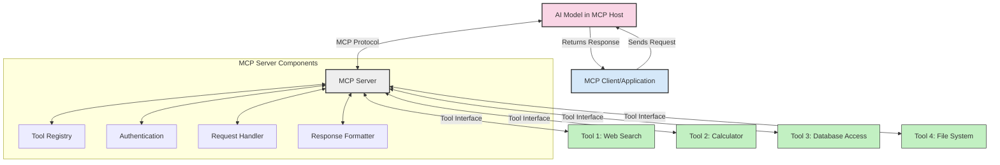
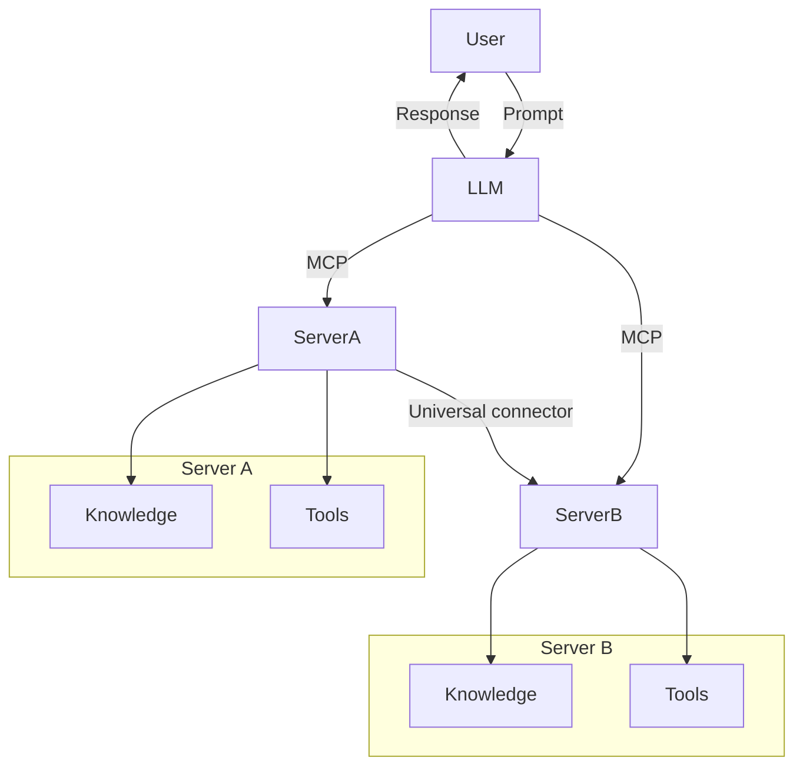
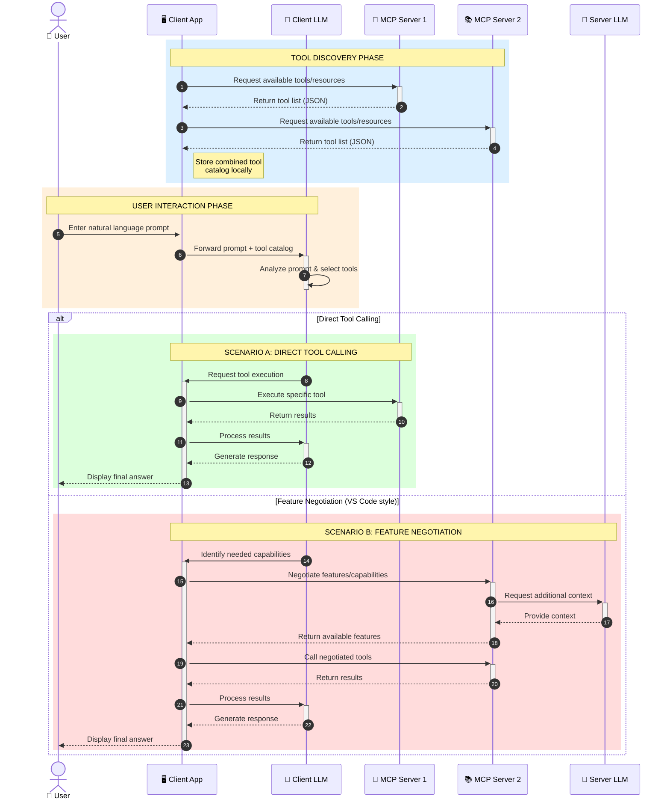

<!--
CO_OP_TRANSLATOR_METADATA:
{
  "original_hash": "25a94c681cf43612ff394d8cf78a74de",
  "translation_date": "2025-05-27T16:10:10+00:00",
  "source_file": "00-Introduction/README.md",
  "language_code": "tl"
}
-->
# Panimula sa Model Context Protocol (MCP): Bakit Mahalaga Ito para sa Scalable na AI Applications

Ang mga generative AI application ay isang malaking hakbang pasulong dahil madalas nilang pinapayagan ang user na makipag-ugnayan sa app gamit ang natural na wika. Ngunit habang lumalago ang oras at resources na inilalagay sa mga ganitong app, gusto mong matiyak na madali mong maidaragdag ang mga functionality at resources sa paraang madaling mapalawak, kaya kaya ng iyong app na suportahan ang higit sa isang model na ginagamit, at mapangasiwaan ang iba't ibang komplikasyon ng mga model. Sa madaling salita, madali lang magsimula ng Gen AI apps, pero habang lumalaki at nagiging mas kumplikado, kailangan mo nang magsimula ng pagbuo ng architecture at malamang kailangan mong umasa sa isang standard para matiyak na consistent ang pagkakagawa ng iyong mga app. Dito pumapasok ang MCP para ayusin ang mga bagay-bagay at magbigay ng standard.

---

## **🔍 Ano ang Model Context Protocol (MCP)?**

Ang **Model Context Protocol (MCP)** ay isang **open, standardized interface** na nagpapahintulot sa Large Language Models (LLMs) na makipag-ugnayan nang maayos sa mga external tools, APIs, at data sources. Nagbibigay ito ng consistent na arkitektura para mapalawak ang functionality ng AI model lampas sa kanilang training data, na nagreresulta sa mas matalino, scalable, at mas mabilis na AI systems.

---

## **🎯 Bakit Mahalaga ang Standardization sa AI**

Habang nagiging mas kumplikado ang generative AI applications, mahalagang magpatupad ng mga standard na nagsisiguro ng **scalability, extensibility**, at **maintainability**. Nilulutas ng MCP ang mga pangangailangang ito sa pamamagitan ng:

- Pagsasama-sama ng model-tool integrations
- Pagbawas ng mga marupok at one-off na custom solutions
- Pagpapahintulot sa maraming model na sabay-sabay na gumana sa isang ecosystem

---

## **📚 Mga Layunin sa Pagkatuto**

Pagkatapos basahin ang artikulong ito, magagawa mong:

- I-define ang **Model Context Protocol (MCP)** at ang mga gamit nito
- Maunawaan kung paano pinapantay-pantay ng MCP ang komunikasyon ng model sa tool
- Matukoy ang mga pangunahing bahagi ng MCP architecture
- Suriin ang mga totoong aplikasyon ng MCP sa larangan ng enterprise at development

---

## **💡 Bakit Game-Changer ang Model Context Protocol (MCP)**

### **🔗 Nilulutas ng MCP ang Fragmentation sa AI Interactions**

Bago ang MCP, ang pagsasama ng mga model sa tools ay nangangailangan ng:

- Custom na code para sa bawat tool-model pair
- Hindi standard na APIs para sa bawat vendor
- Madalas na pagkasira dahil sa mga update
- Mahirap palawakin habang dumarami ang mga tools

### **✅ Mga Benepisyo ng MCP Standardization**

| **Benepisyo**            | **Paglalarawan**                                                               |
|--------------------------|--------------------------------------------------------------------------------|
| Interoperability         | Maayos na pagtutulungan ng LLMs sa mga tools mula sa iba't ibang vendor        |
| Consistency              | Pare-parehong behavior sa lahat ng platforms at tools                         |
| Reusability              | Mga tools na nagawa isang beses ay maaaring gamitin sa iba't ibang proyekto    |
| Accelerated Development  | Mas mabilis na development gamit ang standardized, plug-and-play interfaces    |

---

## **🧱 Pangkalahatang Overview ng MCP Architecture**

Ang MCP ay sumusunod sa **client-server model**, kung saan:

- **MCP Hosts** ang nagpapatakbo ng AI models
- **MCP Clients** ang nagpapadala ng mga request
- **MCP Servers** ang nagbibigay ng context, tools, at capabilities

### **Mga Pangunahing Bahagi:**

- **Resources** – Static o dynamic na data para sa mga model  
- **Prompts** – Predefined workflows para sa guided generation  
- **Tools** – Mga executable functions tulad ng search, calculations  
- **Sampling** – Agentic na kilos sa pamamagitan ng recursive interactions

---

## Paano Gumagana ang MCP Servers

Ang MCP servers ay gumagana sa mga sumusunod na paraan:

- **Daloy ng Request**:  
    1. Ang MCP Client ay nagpapadala ng request sa AI Model na tumatakbo sa isang MCP Host.  
    2. Nakikilala ng AI Model kung kailan ito kailangan ng external tools o data.  
    3. Nakikipag-ugnayan ang model sa MCP Server gamit ang standardized protocol.

- **Mga Gawain ng MCP Server**:  
    - Tool Registry: Nangangalaga ng katalogo ng mga available na tools at kanilang kakayahan.  
    - Authentication: Tinitiyak ang mga permiso para sa pag-access ng tools.  
    - Request Handler: Pinoproseso ang mga papasok na tool requests mula sa model.  
    - Response Formatter: Inaayos ang output ng tool sa format na maiintindihan ng model.

- **Pagpapatupad ng Tool**:  
    - Ipinapasa ng server ang mga request sa tamang external tools  
    - Isinasagawa ng tools ang kanilang mga espesyal na function (search, calculation, database queries, atbp.)  
    - Ibinabalik ang mga resulta sa model sa consistent na format.

- **Pagtatapos ng Tugon**:  
    - Isinasama ng AI model ang output ng tool sa kanyang sagot.  
    - Ipinapadala ang final na sagot pabalik sa client application.

## 👨‍💻 Paano Gumawa ng MCP Server (May Mga Halimbawa)

Pinapayagan ka ng MCP servers na palawakin ang kakayahan ng LLM sa pamamagitan ng pagbibigay ng data at functionality.

Handa ka na bang subukan? Narito ang mga halimbawa ng paggawa ng simpleng MCP server sa iba't ibang lengguwahe:

- **Python Example**: https://github.com/modelcontextprotocol/python-sdk

- **TypeScript Example**: https://github.com/modelcontextprotocol/typescript-sdk

- **Java Example**: https://github.com/modelcontextprotocol/java-sdk

- **C#/.NET Example**: https://github.com/modelcontextprotocol/csharp-sdk

## 🌍 Mga Totoong Gamit ng MCP

Pinapalawak ng MCP ang mga aplikasyon sa AI sa pamamagitan ng pagpapalawak ng kakayahan nito:

| **Aplikasyon**             | **Paglalarawan**                                                               |
|----------------------------|--------------------------------------------------------------------------------|
| Enterprise Data Integration | Pagkonekta ng LLMs sa databases, CRMs, o internal tools                       |
| Agentic AI Systems          | Pagbibigay-daan sa autonomous agents na may access sa tools at workflows ng decision-making |
| Multi-modal Applications    | Pagsasama ng text, image, at audio tools sa isang unified AI app               |
| Real-time Data Integration  | Pagdadala ng live data sa AI interactions para sa mas tumpak at napapanahong output |

### 🧠 MCP = Universal Standard para sa AI Interactions

Ang Model Context Protocol (MCP) ay nagsisilbing universal standard para sa AI interactions, katulad ng kung paano pinantay-pantay ng USB-C ang physical connections para sa mga device. Sa mundo ng AI, nagbibigay ang MCP ng consistent interface, na nagpapahintulot sa mga model (clients) na makipag-integrate nang maayos sa mga external tools at data providers (servers). Nilalayo nito ang pangangailangan para sa iba’t ibang custom protocols para sa bawat API o data source.

Sa ilalim ng MCP, ang isang MCP-compatible tool (tinatawag na MCP server) ay sumusunod sa iisang standard. Maaaring ilista ng mga server na ito ang mga tools o actions na inaalok nila at isagawa ang mga ito kapag hiniling ng AI agent. Ang mga AI agent platforms na sumusuporta sa MCP ay may kakayahang tuklasin ang mga available na tools mula sa mga server at tawagan ang mga ito gamit ang standard protocol na ito.

### 💡 Nagpapadali ng Access sa Kaalaman

Higit pa sa pagbibigay ng tools, pinapadali rin ng MCP ang access sa kaalaman. Pinapayagan nito ang mga aplikasyon na magbigay ng context sa mga large language models (LLMs) sa pamamagitan ng pagkonekta sa kanila sa iba't ibang data sources. Halimbawa, maaaring kumatawan ang isang MCP server sa document repository ng isang kumpanya, na nagpapahintulot sa mga agent na kumuha ng kaugnay na impormasyon kapag kinakailangan. Ang isa pang server naman ay maaaring magpatakbo ng mga partikular na aksyon tulad ng pagpapadala ng email o pag-update ng mga tala. Para sa agent, ito ay mga tools lamang na maaaring gamitin—ang ilan ay nagbabalik ng data (knowledge context), habang ang iba ay nagsasagawa ng mga aksyon. Epektibong pinamamahalaan ng MCP pareho ang mga ito.

Ang isang agent na kumokonekta sa MCP server ay awtomatikong natututo tungkol sa mga kakayahan at data na accessible mula sa server sa pamamagitan ng isang standard na format. Ang standardization na ito ay nagpapahintulot sa dynamic na availability ng tools. Halimbawa, kapag nagdagdag ka ng bagong MCP server sa system ng agent, agad nitong nagagamit ang mga function nito nang hindi na kailangan pang baguhin ang mga tagubilin ng agent.

Ang maayos na integrasyon na ito ay tumutugma sa daloy na ipinakita sa mermaid diagram, kung saan nagbibigay ang mga server ng parehong tools at kaalaman, na nagsisiguro ng tuloy-tuloy na pagtutulungan sa pagitan ng mga sistema.

### 👉 Halimbawa: Scalable Agent Solution

### 🔄 Advanced MCP Scenarios kasama ang Client-Side LLM Integration

Lampas sa basic na MCP architecture, may mga advanced na senaryo kung saan parehong may LLM ang client at server, na nagpapahintulot ng mas sopistikadong interaksyon:

## 🔐 Praktikal na Mga Benepisyo ng MCP

Narito ang mga praktikal na benepisyo ng paggamit ng MCP:

- **Kabaguhan**: Nakakakuha ang mga model ng pinakabagong impormasyon lampas sa kanilang training data  
- **Pagpapalawak ng Kakayahan**: Nagagamit ng mga model ang mga specialized tools para sa mga task na hindi sila sinanay  
- **Pagbawas ng Hallucinations**: Nagbibigay ng factual grounding ang external data sources  
- **Privacy**: Mananatiling ligtas ang sensitibong data sa secure na environment sa halip na isama sa mga prompt

## 📌 Mga Pangunahing Punto

Narito ang mga pangunahing puntos sa paggamit ng MCP:

- Ang **MCP** ay nag-standardize kung paano nakikipag-ugnayan ang AI models sa mga tools at data  
- Itinataguyod ang **extensibility, consistency, at interoperability**  
- Tinutulungan ng MCP na **pabilisin ang development, pagbutihin ang reliability, at palawakin ang kakayahan ng model**  
- Ang client-server architecture ay **nagbibigay daan sa flexible at extensible na AI applications**

## 🧠 Ehersisyo

Isipin ang isang AI application na nais mong gawin.

- Anong mga **external tools o data** ang makakapagpalakas ng kakayahan nito?  
- Paano makakatulong ang MCP para gawing **mas simple at mas maaasahan** ang integration?

## Karagdagang Resources

- [MCP GitHub Repository](https://github.com/modelcontextprotocol)

## Ano ang Susunod

Susunod: [Chapter 1: Core Concepts](/01-CoreConcepts/README.md)

**Pagsasalin ng Teks to Tagalog (tl):**

**Paalala:**  
Ang dokumentong ito ay isinalin gamit ang AI translation service na [Co-op Translator](https://github.com/Azure/co-op-translator). Bagamat nagsusumikap kami para sa katumpakan, pakatandaan na ang mga awtomatikong pagsasalin ay maaaring maglaman ng mga pagkakamali o hindi tumpak na impormasyon. Ang orihinal na dokumento sa orihinal nitong wika ang dapat ituring na pangunahing sanggunian. Para sa mahahalagang impormasyon, inirerekomenda ang propesyonal na pagsasalin ng tao. Hindi kami mananagot sa anumang hindi pagkakaunawaan o maling interpretasyon na maaaring magmula sa paggamit ng pagsasaling ito.