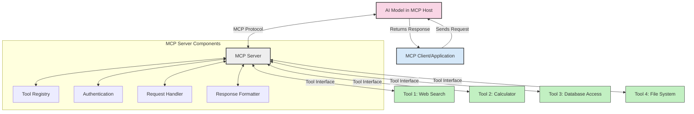
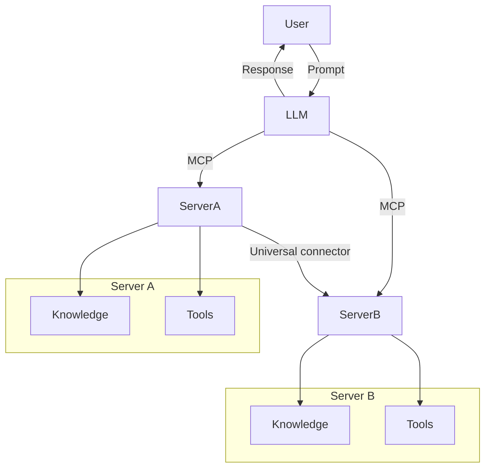

<!--
CO_OP_TRANSLATOR_METADATA:
{
  "original_hash": "cf84f987e1b771d2201408e110dfd2db",
  "translation_date": "2025-05-20T17:47:58+00:00",
  "source_file": "00-Introduction/README.md",
  "language_code": "tl"
}
-->
# Panimula sa Model Context Protocol (MCP): Bakit Mahalaga Ito para sa Scalable na AI Applications

Malaking hakbang ang mga generative AI applications dahil madalas nilang pinapayagan ang user na makipag-ugnayan sa app gamit ang natural na wika. Ngunit habang lumalago ang oras at resources na inilalagay sa mga ganitong apps, gusto mong masigurong madali mong maidaragdag ang mga functionalities at resources sa paraang madaling palawakin, kaya nitong suportahan ang paggamit ng higit sa isang model, at ang mga detalye nito. Sa madaling salita, madali lang magsimula ng Gen AI apps pero habang lumalaki at nagiging komplikado, kailangan mo nang magtakda ng arkitektura at malamang kailangan mong umasa sa isang standard para masigurong consistent ang pagkakagawa ng iyong mga app. Dito pumapasok ang MCP para ayusin ang mga bagay-bagay at magbigay ng standard.

---

## **🔍 Ano ang Model Context Protocol (MCP)?**

Ang **Model Context Protocol (MCP)** ay isang **open, standardized interface** na nagpapahintulot sa Large Language Models (LLMs) na makipag-ugnayan nang maayos sa mga external tools, APIs, at data sources. Nagbibigay ito ng consistent na arkitektura para mapalawak ang kakayahan ng AI models lampas sa kanilang training data, na nagreresulta sa mas matalino, scalable, at mas responsive na AI systems.

---

## **🎯 Bakit Mahalaga ang Standardization sa AI**

Habang nagiging mas kumplikado ang generative AI applications, mahalagang mag-adopt ng mga standard na nagsisiguro ng **scalability, extensibility**, at **maintainability**. Tinatalakay ng MCP ang mga pangangailangang ito sa pamamagitan ng:

- Pagsasama-sama ng model-tool integrations
- Pagbawas ng mga marupok at one-off na custom solutions
- Pagbibigay-daan para sabay-sabay na gumana ang maraming models sa isang ecosystem

---

## **📚 Mga Layunin sa Pagkatuto**

Sa pagtatapos ng artikulong ito, magagawa mong:

- Ilarawan ang **Model Context Protocol (MCP)** at ang mga gamit nito
- Maunawaan kung paano ni-standardize ng MCP ang komunikasyon mula model papuntang tool
- Tukuyin ang mga pangunahing bahagi ng MCP architecture
- Suriin ang mga totoong aplikasyon ng MCP sa enterprise at development na konteksto

---

## **💡 Bakit Game-Changer ang Model Context Protocol (MCP)**

### **🔗 Nilulutas ng MCP ang Fragmentation sa AI Interactions**

Bago ang MCP, ang pag-integrate ng mga modelo sa mga tool ay nangangailangan ng:

- Custom code para sa bawat tool-model na pares
- Hindi standardized na APIs para sa bawat vendor
- Madalas na pagkasira dahil sa updates
- Mahirap palawakin kapag dumami ang tools

### **✅ Mga Benepisyo ng MCP Standardization**

| **Benepisyo**            | **Paglalarawan**                                                               |
|--------------------------|--------------------------------------------------------------------------------|
| Interoperability         | Maayos na pagtutulungan ng LLMs at tools mula sa iba't ibang vendors           |
| Consistency              | Pare-parehong pag-uugali sa iba't ibang platform at tools                      |
| Reusability              | Mga tool na ginawa minsan ay pwedeng gamitin sa iba't ibang proyekto at sistema|
| Accelerated Development  | Mas mabilis na development gamit ang standardized, plug-and-play interfaces    |

---

## **🧱 Pangkalahatang-ideya ng MCP Architecture**

Ang MCP ay sumusunod sa **client-server model**, kung saan:

- **MCP Hosts** ang nagpapatakbo ng AI models
- **MCP Clients** ang nagsisimula ng mga request
- **MCP Servers** ang nagsisilbi ng context, tools, at capabilities

### **Mga Pangunahing Bahagi:**

- **Resources** – Static o dynamic na data para sa mga modelo  
- **Prompts** – Mga predefined workflows para sa guided generation  
- **Tools** – Mga executable functions tulad ng search, calculations  
- **Sampling** – Agentic behavior sa pamamagitan ng recursive interactions

---

## Paano Gumagana ang MCP Servers

Ang mga MCP server ay gumagana sa sumusunod na paraan:

- **Daloy ng Request**:  
    1. Nagpapadala ang MCP Client ng request sa AI Model na tumatakbo sa MCP Host.  
    2. Nakikita ng AI Model kung kailan kailangan nito ng external tools o data.  
    3. Nakikipag-ugnayan ang model sa MCP Server gamit ang standardized protocol.

- **Functionality ng MCP Server**:  
    - Tool Registry: Nagtatago ng katalogo ng mga available na tools at ang kanilang kakayahan.  
    - Authentication: Sinisiguro ang mga permiso para ma-access ang tools.  
    - Request Handler: Pinoproseso ang mga papasok na tool requests mula sa model.  
    - Response Formatter: Inaayos ang output ng tools sa format na maiintindihan ng model.

- **Pagpapatupad ng Tool**:  
    - Ipinapasa ng server ang mga request sa tamang external tools  
    - Pinapatakbo ng tools ang kanilang mga espesyal na function (search, calculation, database queries, atbp.)  
    - Ibinabalik ang resulta sa model sa consistent na format.

- **Pagkumpleto ng Tugon**:  
    - Isinasama ng AI model ang mga output ng tool sa kanyang sagot.  
    - Ipinapadala ang huling tugon pabalik sa client application.

## 👨‍💻 Paano Gumawa ng MCP Server (May Mga Halimbawa)

Pinapayagan ng MCP servers na mapalawak ang kakayahan ng LLM sa pamamagitan ng pagbibigay ng data at functionality.

Handa ka na bang subukan? Narito ang mga halimbawa ng paggawa ng simpleng MCP server sa iba't ibang wika:

- **Python Example**: https://github.com/modelcontextprotocol/python-sdk

- **TypeScript Example**: https://github.com/modelcontextprotocol/typescript-sdk

- **Java Example**: https://github.com/modelcontextprotocol/java-sdk

- **C#/.NET Example**: https://github.com/modelcontextprotocol/csharp-sdk

## 🌍 Mga Totoong Gamit ng MCP

Pinapagana ng MCP ang malawak na saklaw ng aplikasyon sa pagpapalawak ng kakayahan ng AI:

| **Aplikasyon**              | **Paglalarawan**                                                               |
|----------------------------|--------------------------------------------------------------------------------|
| Enterprise Data Integration | Pagkonekta ng LLMs sa databases, CRMs, o internal tools                        |
| Agentic AI Systems          | Pagbibigay-daan sa autonomous agents na may access sa tools at decision workflows|
| Multi-modal Applications    | Pagsasama ng text, image, at audio tools sa isang unified AI app               |
| Real-time Data Integration  | Pagdadala ng live data sa AI interactions para sa mas tumpak at kasalukuyang output|

### 🧠 MCP = Universal Standard para sa AI Interactions

Ang Model Context Protocol (MCP) ay nagsisilbing universal standard para sa AI interactions, tulad ng pagkaka-standardize ng USB-C sa mga physical connection ng devices. Sa mundo ng AI, nagbibigay ang MCP ng consistent interface na nagpapahintulot sa mga modelo (clients) na makipag-integrate nang maayos sa mga external tools at data providers (servers). Tinatanggal nito ang pangangailangan para sa iba’t ibang custom protocols para sa bawat API o data source.

Sa ilalim ng MCP, ang isang MCP-compatible tool (tinatawag na MCP server) ay sumusunod sa iisang standard. Maaari nilang ilista ang mga tools o actions na kanilang inaalok at isagawa ang mga ito kapag hiniling ng AI agent. Ang mga AI agent platform na sumusuporta sa MCP ay kayang tuklasin ang mga available na tools mula sa servers at tawagin ang mga ito gamit ang standard protocol na ito.

### 💡 Pinadadali ang access sa kaalaman

Bukod sa pagbibigay ng tools, pinadadali rin ng MCP ang access sa kaalaman. Pinapayagan nito ang mga aplikasyon na magbigay ng context sa large language models (LLMs) sa pamamagitan ng pagkonekta sa iba't ibang data sources. Halimbawa, ang isang MCP server ay maaaring kumatawan sa document repository ng isang kumpanya, na nagpapahintulot sa mga agent na kumuha ng relevant na impormasyon kapag kailangan. Ang isa pang server naman ay maaaring mag-handle ng mga partikular na aksyon tulad ng pagpapadala ng email o pag-update ng mga record. Para sa agent, ito ay mga tool lang na pwedeng gamitin—ang iba ay nagbabalik ng data (knowledge context), habang ang iba ay gumagawa ng mga aksyon. Epektibong pinamamahalaan ng MCP ang pareho.

Kapag kumonekta ang isang agent sa MCP server, awtomatiko nitong nalalaman ang mga kakayahan at accessible na data ng server sa pamamagitan ng standard na format. Pinapahintulutan ng standardization na ito ang dynamic na availability ng mga tool. Halimbawa, kapag nagdagdag ng bagong MCP server sa sistema ng agent, agad nang magagamit ang mga function nito nang hindi na kailangang baguhin pa ang mga tagubilin sa agent.

Ang ganitong maayos na integration ay tumutugma sa daloy na ipinapakita sa mermaid diagram, kung saan nagbibigay ang mga server ng parehong tools at kaalaman, na nagsisiguro ng tuloy-tuloy na pagtutulungan sa mga sistema.

### 👉 Halimbawa: Scalable Agent Solution

## 🔐 Praktikal na Mga Benepisyo ng MCP

Narito ang mga praktikal na benepisyo ng paggamit ng MCP:

- **Freshness**: Maaaring makuha ng mga modelo ang pinakabagong impormasyon lampas sa kanilang training data  
- **Capability Extension**: Magagamit ng mga modelo ang mga specialized na tool para sa mga task na hindi nila natutunan  
- **Reduced hallucinations**: Nagbibigay ng factual grounding ang mga external data sources  
- **Privacy**: Ang sensitibong data ay nananatili sa secure na environment sa halip na isama sa prompts

## 📌 Mga Pangunahing Punto

Narito ang mga pangunahing punto sa paggamit ng MCP:

- Ni-standardize ng **MCP** kung paano nakikipag-ugnayan ang AI models sa tools at data  
- Pinapalaganap ang **extensibility, consistency, at interoperability**  
- Tinutulungan ng MCP na **pabilisin ang development, pagbutihin ang reliability, at palawakin ang kakayahan ng model**  
- Pinapayagan ng client-server architecture ang **flexible, extensible na AI applications**

## 🧠 Ehersisyo

Isipin ang isang AI application na gusto mong gawin.

- Anong mga **external tools o data** ang makakapagpahusay ng kakayahan nito?  
- Paano makakatulong ang MCP para maging **mas simple at mas maaasahan** ang integration?

## Karagdagang Resources

- [MCP GitHub Repository](https://github.com/modelcontextprotocol)

## Ano ang Susunod

Susunod: [Chapter 1: Core Concepts](/01-CoreConcepts/README.md)

**Paalala**:  
Ang dokumentong ito ay isinalin gamit ang AI translation service na [Co-op Translator](https://github.com/Azure/co-op-translator). Bagamat nagsusumikap kami para sa katumpakan, pakatandaan na ang mga awtomatikong pagsasalin ay maaaring maglaman ng mga pagkakamali o di-tumpak na impormasyon. Ang orihinal na dokumento sa kanyang sariling wika ang dapat ituring na pangunahing sanggunian. Para sa mahahalagang impormasyon, inirerekomenda ang propesyonal na pagsasalin ng tao. Hindi kami mananagot sa anumang hindi pagkakaunawaan o maling interpretasyon na maaaring magmula sa paggamit ng pagsasaling ito.