```mermaid
---
title: Advanced MCP Scenarios with Client-Server LLM Integration
description: A sequence diagram showing the detailed interaction flow between user, client application, client LLM, multiple MCP servers, and server LLM, illustrating tool discovery, user interaction, direct tool calling, and feature negotiation phases
---
sequenceDiagram
    autonumber
    actor User as 👤 User
    participant ClientApp as 🖥️ Client App
    participant ClientLLM as 🧠 Client LLM
    participant Server1 as 🔧 MCP Server 1
    participant Server2 as 📚 MCP Server 2
    participant ServerLLM as 🤖 Server LLM
    
    %% Discovery Phase
    rect rgb(220, 240, 255)
        Note over ClientApp, Server2: TOOL DISCOVERY PHASE
        ClientApp->>+Server1: Request available tools/resources
        Server1-->>-ClientApp: Return tool list (JSON)
        ClientApp->>+Server2: Request available tools/resources
        Server2-->>-ClientApp: Return tool list (JSON)
        Note right of ClientApp: Store combined tool<br/>catalog locally
    end
    
    %% User Interaction
    rect rgb(255, 240, 220)
        Note over User, ClientLLM: USER INTERACTION PHASE
        User->>+ClientApp: Enter natural language prompt
        ClientApp->>+ClientLLM: Forward prompt + tool catalog
        ClientLLM->>-ClientLLM: Analyze prompt & select tools
    end
    
    %% Scenario A: Direct Tool Calling
    alt Direct Tool Calling
        rect rgb(220, 255, 220)
            Note over ClientApp, Server1: SCENARIO A: DIRECT TOOL CALLING
            ClientLLM->>+ClientApp: Request tool execution
            ClientApp->>+Server1: Execute specific tool
            Server1-->>-ClientApp: Return results
            ClientApp->>+ClientLLM: Process results
            ClientLLM-->>-ClientApp: Generate response
            ClientApp-->>-User: Display final answer
        end
    
    %% Scenario B: Feature Negotiation (VS Code style)
    else Feature Negotiation (VS Code style)
        rect rgb(255, 220, 220)
            Note over ClientApp, ServerLLM: SCENARIO B: FEATURE NEGOTIATION
            ClientLLM->>+ClientApp: Identify needed capabilities
            ClientApp->>+Server2: Negotiate features/capabilities
            Server2->>+ServerLLM: Request additional context
            ServerLLM-->>-Server2: Provide context
            Server2-->>-ClientApp: Return available features
            ClientApp->>+Server2: Call negotiated tools
            Server2-->>-ClientApp: Return results
            ClientApp->>+ClientLLM: Process results
            ClientLLM-->>-ClientApp: Generate response
            ClientApp-->>-User: Display final answer
        end
    end
```

<!--
CO_OP_TRANSLATOR_METADATA:
{
  "original_hash": "0df1ee78a6dd8300f3a040ca5b411c2e",
  "translation_date": "2025-08-18T18:30:55+00:00",
  "source_file": "00-Introduction/README.md",
  "language_code": "tl"
}
-->
# Panimula sa Model Context Protocol (MCP): Bakit Ito Mahalaga para sa Scalable AI Applications

_(I-click ang larawan sa itaas upang panoorin ang video ng araling ito)_

Ang mga generative AI applications ay isang malaking hakbang pasulong dahil madalas nilang pinapayagan ang user na makipag-ugnayan sa app gamit ang natural na wika. Gayunpaman, habang mas maraming oras at resources ang inilalagay sa ganitong mga app, nais mong tiyakin na madali mong maisasama ang mga functionality at resources sa paraang madaling palawakin, na ang iyong app ay maaaring gumana sa higit sa isang modelong ginagamit, at kayang hawakan ang iba't ibang intricacies ng mga modelo. Sa madaling salita, madaling magsimula sa paggawa ng Gen AI apps, ngunit habang lumalaki at nagiging mas kumplikado ang mga ito, kailangan mong magsimulang magtakda ng arkitektura at malamang na kakailanganin mong umasa sa isang pamantayan upang matiyak na ang iyong mga app ay binuo sa isang pare-parehong paraan. Dito pumapasok ang MCP upang mag-organisa ng mga bagay at magbigay ng pamantayan.

---

## **🔍 Ano ang Model Context Protocol (MCP)?**

Ang **Model Context Protocol (MCP)** ay isang **bukas at standardisadong interface** na nagpapahintulot sa Large Language Models (LLMs) na makipag-ugnayan nang maayos sa mga panlabas na tools, APIs, at data sources. Nagbibigay ito ng isang pare-parehong arkitektura upang mapahusay ang functionality ng AI models lampas sa kanilang training data, na nagreresulta sa mas matalino, scalable, at mas tumutugong AI systems.

---

## **🎯 Bakit Mahalaga ang Standardisasyon sa AI**

Habang nagiging mas kumplikado ang mga generative AI applications, mahalagang gumamit ng mga pamantayan na nagsisiguro ng **scalability, extensibility, maintainability,** at **pag-iwas sa vendor lock-in.** Ang MCP ay tumutugon sa mga pangangailangang ito sa pamamagitan ng:

- Pag-iisa ng mga integration ng modelo at tool  
- Pagbabawas ng mga marupok at one-off na custom solutions  
- Pagpapahintulot sa maraming modelo mula sa iba't ibang vendor na magkasamang gumana sa isang ecosystem  

**Note:** Bagama't ipinakikilala ng MCP ang sarili bilang isang bukas na pamantayan, walang plano na gawing standardisado ang MCP sa pamamagitan ng anumang umiiral na standards bodies tulad ng IEEE, IETF, W3C, ISO, o iba pang standards body.

---

## **📚 Mga Layunin sa Pagkatuto**

Sa pagtatapos ng artikulong ito, magagawa mong:

- Tukuyin ang **Model Context Protocol (MCP)** at ang mga use case nito  
- Maunawaan kung paano standardisado ng MCP ang komunikasyon sa pagitan ng modelo at tool  
- Kilalanin ang mga pangunahing bahagi ng arkitektura ng MCP  
- Tuklasin ang mga totoong aplikasyon ng MCP sa mga enterprise at development contexts  

---

## **💡 Bakit Isang Game-Changer ang Model Context Protocol (MCP)**

### **🔗 Nilulutas ng MCP ang Fragmentation sa AI Interactions**

Bago ang MCP, ang pag-integrate ng mga modelo sa mga tool ay nangangailangan ng:

- Custom na code para sa bawat pares ng tool at modelo  
- Non-standard na APIs para sa bawat vendor  
- Madalas na pagkasira dahil sa mga update  
- Mahinang scalability sa mas maraming tools  

### **✅ Mga Benepisyo ng MCP Standardisasyon**

| **Benepisyo**              | **Paglalarawan**                                                                |
|----------------------------|--------------------------------------------------------------------------------|
| Interoperability           | Ang mga LLM ay gumagana nang maayos sa mga tool mula sa iba't ibang vendor     |
| Consistency                | Pare-parehong pag-uugali sa iba't ibang platform at tool                       |
| Reusability                | Ang mga tool na ginawa nang isang beses ay maaaring gamitin sa iba't ibang proyekto at sistema |
| Accelerated Development    | Nabawasan ang oras ng development sa paggamit ng standardisadong, plug-and-play na interfaces |

---

## **🧱 Pangkalahatang-ideya ng High-Level MCP Architecture**

Ang MCP ay sumusunod sa isang **client-server model**, kung saan:

- Ang **MCP Hosts** ang nagpapatakbo ng AI models  
- Ang **MCP Clients** ang nagpapasimula ng mga request  
- Ang **MCP Servers** ang nagbibigay ng context, tools, at capabilities  

### **Mga Pangunahing Bahagi:**

- **Resources** – Static o dynamic na data para sa mga modelo  
- **Prompts** – Mga predefined na workflow para sa guided generation  
- **Tools** – Mga executable function tulad ng search, calculations  
- **Sampling** – Agentic behavior sa pamamagitan ng recursive interactions  

---

## Paano Gumagana ang MCP Servers

Ang mga MCP server ay gumagana sa sumusunod na paraan:

- **Daloy ng Request**:
    1. Ang isang request ay sinisimulan ng isang end user o software na kumikilos sa kanilang ngalan.  
    2. Ang **MCP Client** ay nagpapadala ng request sa isang **MCP Host**, na namamahala sa AI Model runtime.  
    3. Natatanggap ng **AI Model** ang user prompt at maaaring humiling ng access sa mga panlabas na tool o data sa pamamagitan ng isa o higit pang tool calls.  
    4. Ang **MCP Host**, hindi ang modelo mismo, ang nakikipag-ugnayan sa angkop na **MCP Server(s)** gamit ang standardisadong protocol.  
- **Functionality ng MCP Host**:
    - **Tool Registry**: Pinapanatili ang katalogo ng mga available na tool at ang kanilang mga kakayahan.  
    - **Authentication**: Sini-siguro ang mga pahintulot para sa access sa tool.  
    - **Request Handler**: Pinoproseso ang mga papasok na tool request mula sa modelo.  
    - **Response Formatter**: Istraktura ng mga output ng tool sa format na maiintindihan ng modelo.  
- **Pagpapatupad ng MCP Server**:
    - Ang **MCP Host** ay nagre-route ng mga tool calls sa isa o higit pang **MCP Servers**, na bawat isa ay nag-e-expose ng mga specialized na function (hal., search, calculations, database queries).  
    - Ang **MCP Servers** ay nagsasagawa ng kani-kanilang mga operasyon at ibinabalik ang mga resulta sa **MCP Host** sa isang pare-parehong format.  
    - Ang **MCP Host** ay nagfo-format at nagre-relay ng mga resultang ito sa **AI Model**.  
- **Pagkumpleto ng Tugon**:
    - Isinasama ng **AI Model** ang mga output ng tool sa isang panghuling tugon.  
    - Ang **MCP Host** ay ipinapadala ang tugon pabalik sa **MCP Client**, na naghahatid nito sa end user o tumatawag na software.  

## 👨‍💻 Paano Gumawa ng MCP Server (May Mga Halimbawa)

Ang mga MCP server ay nagbibigay-daan sa iyo na palawakin ang kakayahan ng LLM sa pamamagitan ng pagbibigay ng data at functionality.

Handa ka na bang subukan? Narito ang mga SDK na partikular sa wika at/o stack na may mga halimbawa ng paggawa ng simpleng MCP servers sa iba't ibang wika/stack:

- **Python SDK**: https://github.com/modelcontextprotocol/python-sdk  
- **TypeScript SDK**: https://github.com/modelcontextprotocol/typescript-sdk  
- **Java SDK**: https://github.com/modelcontextprotocol/java-sdk  
- **C#/.NET SDK**: https://github.com/modelcontextprotocol/csharp-sdk  

---

## 🌍 Mga Totoong Aplikasyon ng MCP

Ang MCP ay nagbibigay-daan sa malawak na hanay ng mga aplikasyon sa pamamagitan ng pagpapalawak ng kakayahan ng AI:

| **Aplikasyon**              | **Paglalarawan**                                                                |
|-----------------------------|--------------------------------------------------------------------------------|
| Enterprise Data Integration | Ikonekta ang LLMs sa mga database, CRMs, o internal tools                      |
| Agentic AI Systems          | Paganahin ang mga autonomous agents na may access sa tool at workflows ng desisyon |
| Multi-modal Applications    | Pagsamahin ang text, image, at audio tools sa isang unified AI app             |
| Real-time Data Integration  | Dalhin ang live data sa AI interactions para sa mas tumpak at kasalukuyang outputs |

### 🧠 MCP = Universal Standard para sa AI Interactions

Ang Model Context Protocol (MCP) ay kumikilos bilang isang universal standard para sa AI interactions, tulad ng kung paano standardisado ng USB-C ang mga physical connections para sa mga device. Sa mundo ng AI, nagbibigay ang MCP ng isang pare-parehong interface, na nagpapahintulot sa mga modelo (clients) na ma-integrate nang maayos sa mga panlabas na tool at data providers (servers). Inaalis nito ang pangangailangan para sa magkakaibang, custom na protocols para sa bawat API o data source.

Sa ilalim ng MCP, ang isang MCP-compatible na tool (tinatawag na MCP server) ay sumusunod sa isang unified standard. Ang mga server na ito ay maaaring maglista ng mga tool o aksyon na kanilang inaalok at isagawa ang mga aksyong iyon kapag hiniling ng isang AI agent. Ang mga AI agent platform na sumusuporta sa MCP ay may kakayahang matuklasan ang mga available na tool mula sa mga server at gamitin ang mga ito sa pamamagitan ng standard na protocol na ito.

### 💡 Pinapadali ang Access sa Kaalaman

Bukod sa pag-aalok ng mga tool, pinapadali rin ng MCP ang access sa kaalaman. Pinapayagan nito ang mga application na magbigay ng context sa mga large language models (LLMs) sa pamamagitan ng pag-link sa kanila sa iba't ibang data sources. Halimbawa, ang isang MCP server ay maaaring kumatawan sa repository ng dokumento ng isang kumpanya, na nagpapahintulot sa mga agent na kunin ang may kaugnayang impormasyon kapag kinakailangan. Ang isa pang server ay maaaring humawak ng mga partikular na aksyon tulad ng pagpapadala ng mga email o pag-update ng mga talaan. Mula sa pananaw ng agent, ang mga ito ay simpleng mga tool na maaari nitong gamitin—ang ilan ay nagbabalik ng data (knowledge context), habang ang iba ay nagsasagawa ng mga aksyon. Pinamamahalaan ng MCP ang pareho nang mahusay.

Ang isang agent na kumokonekta sa isang MCP server ay awtomatikong natututo ng mga available na kakayahan at accessible na data ng server sa pamamagitan ng isang standard na format. Ang standardisasyong ito ay nagbibigay-daan sa dynamic na availability ng tool. Halimbawa, ang pagdaragdag ng bagong MCP server sa sistema ng agent ay agad na nagiging magagamit ang mga function nito nang walang karagdagang customization ng mga tagubilin ng agent.

Ang streamlined na integration na ito ay naaayon sa daloy na inilalarawan sa sumusunod na diagram, kung saan ang mga server ay nagbibigay ng parehong tools at kaalaman, na tinitiyak ang maayos na kolaborasyon sa mga sistema.

### 👉 Halimbawa: Scalable Agent Solution

### 🔄 Advanced na MCP Scenarios na may Client-Side LLM Integration

Bukod sa pangunahing arkitektura ng MCP, may mga advanced na scenario kung saan parehong may LLM ang client at server, na nagbibigay-daan sa mas sopistikadong interaksyon. Sa sumusunod na diagram, ang **Client App** ay maaaring isang IDE na may iba't ibang MCP tools na available para sa paggamit ng LLM:

---

## 🔐 Mga Praktikal na Benepisyo ng MCP

Narito ang mga praktikal na benepisyo ng paggamit ng MCP:

- **Freshness**: Maaaring ma-access ng mga modelo ang pinakabagong impormasyon lampas sa kanilang training data  
- **Capability Extension**: Maaaring gamitin ng mga modelo ang mga specialized na tool para sa mga gawain na hindi sila sinanay para gawin  
- **Reduced Hallucinations**: Ang mga panlabas na data sources ay nagbibigay ng factual grounding  
- **Privacy**: Ang sensitibong data ay maaaring manatili sa loob ng secure na mga environment sa halip na maisama sa prompts  

---

## 📌 Mga Pangunahing Punto

Narito ang mga pangunahing punto sa paggamit ng MCP:

- Ang **MCP** ay nag-standardize kung paano nakikipag-ugnayan ang mga AI models sa mga tool at data  
- Pinapalaganap nito ang **extensibility, consistency, at interoperability**  
- Ang MCP ay tumutulong na **bawasan ang oras ng development, mapabuti ang reliability, at mapalawak ang kakayahan ng modelo**  
- Ang client-server architecture ay nagbibigay-daan sa **flexible at extensible na AI applications**  

---

## 🧠 Ehersisyo

Mag-isip ng isang AI application na nais mong buuin.

- Aling **mga panlabas na tool o data** ang maaaring magpalawak ng kakayahan nito?  
- Paano maaaring gawing **mas simple at maaasahan** ng MCP ang integration?  

---

## Karagdagang Resources

- [MCP GitHub Repository](https://github.com/modelcontextprotocol)

---

## Ano ang Susunod

Susunod: [Kabanata 1: Mga Pangunahing Konsepto](../01-CoreConcepts/README.md)

**Paunawa**:  
Ang dokumentong ito ay isinalin gamit ang AI translation service na [Co-op Translator](https://github.com/Azure/co-op-translator). Bagama't sinisikap naming maging tumpak, pakitandaan na ang mga awtomatikong pagsasalin ay maaaring maglaman ng mga pagkakamali o hindi pagkakatugma. Ang orihinal na dokumento sa kanyang orihinal na wika ang dapat ituring na opisyal na sanggunian. Para sa mahalagang impormasyon, inirerekomenda ang propesyonal na pagsasalin ng tao. Hindi kami mananagot sa anumang hindi pagkakaunawaan o maling interpretasyon na maaaring magmula sa paggamit ng pagsasaling ito.