```mermaid
---
title: Advanced MCP Scenarios with Client-Server LLM Integration
description: A sequence diagram showing the detailed interaction flow between user, client application, client LLM, multiple MCP servers, and server LLM, illustrating tool discovery, user interaction, direct tool calling, and feature negotiation phases
---
sequenceDiagram
    autonumber
    actor User as 👤 User
    participant ClientApp as 🖥️ Client App
    participant ClientLLM as 🧠 Client LLM
    participant Server1 as 🔧 MCP Server 1
    participant Server2 as 📚 MCP Server 2
    participant ServerLLM as 🤖 Server LLM
    
    %% Discovery Phase
    rect rgb(220, 240, 255)
        Note over ClientApp, Server2: TOOL DISCOVERY PHASE
        ClientApp->>+Server1: Request available tools/resources
        Server1-->>-ClientApp: Return tool list (JSON)
        ClientApp->>+Server2: Request available tools/resources
        Server2-->>-ClientApp: Return tool list (JSON)
        Note right of ClientApp: Store combined tool<br/>catalog locally
    end
    
    %% User Interaction
    rect rgb(255, 240, 220)
        Note over User, ClientLLM: USER INTERACTION PHASE
        User->>+ClientApp: Enter natural language prompt
        ClientApp->>+ClientLLM: Forward prompt + tool catalog
        ClientLLM->>-ClientLLM: Analyze prompt & select tools
    end
    
    %% Scenario A: Direct Tool Calling
    alt Direct Tool Calling
        rect rgb(220, 255, 220)
            Note over ClientApp, Server1: SCENARIO A: DIRECT TOOL CALLING
            ClientLLM->>+ClientApp: Request tool execution
            ClientApp->>+Server1: Execute specific tool
            Server1-->>-ClientApp: Return results
            ClientApp->>+ClientLLM: Process results
            ClientLLM-->>-ClientApp: Generate response
            ClientApp-->>-User: Display final answer
        end
    
    %% Scenario B: Feature Negotiation (VS Code style)
    else Feature Negotiation (VS Code style)
        rect rgb(255, 220, 220)
            Note over ClientApp, ServerLLM: SCENARIO B: FEATURE NEGOTIATION
            ClientLLM->>+ClientApp: Identify needed capabilities
            ClientApp->>+Server2: Negotiate features/capabilities
            Server2->>+ServerLLM: Request additional context
            ServerLLM-->>-Server2: Provide context
            Server2-->>-ClientApp: Return available features
            ClientApp->>+Server2: Call negotiated tools
            Server2-->>-ClientApp: Return results
            ClientApp->>+ClientLLM: Process results
            ClientLLM-->>-ClientApp: Generate response
            ClientApp-->>-User: Display final answer
        end
    end
```

<!--
CO_OP_TRANSLATOR_METADATA:
{
  "original_hash": "105c2ddbb77bc38f7e9df009e1b06e45",
  "translation_date": "2025-07-13T15:37:02+00:00",
  "source_file": "00-Introduction/README.md",
  "language_code": "tl"
}
-->
# Panimula sa Model Context Protocol (MCP): Bakit Mahalaga Ito para sa Mga Scalable na AI Application

Ang mga generative AI application ay isang malaking hakbang pasulong dahil madalas nitong pinapayagan ang gumagamit na makipag-ugnayan sa app gamit ang natural na wika. Ngunit habang mas maraming oras at resources ang inilalagay sa mga ganitong app, nais mong matiyak na madali mong maipapasok ang mga functionality at resources sa paraang madaling mapalawak, kaya ang iyong app ay kayang suportahan ang higit sa isang modelong ginagamit, at kayang hawakan ang iba't ibang detalye ng mga modelo. Sa madaling salita, madali lang magsimula ng Gen AI apps, pero habang lumalaki at nagiging mas kumplikado, kailangan mo nang magtakda ng arkitektura at malamang ay kailangan mong umasa sa isang standard para matiyak na ang iyong mga app ay ginagawa nang pare-pareho. Dito pumapasok ang MCP para ayusin ang mga bagay at magbigay ng standard.

---

## **🔍 Ano ang Model Context Protocol (MCP)?**

Ang **Model Context Protocol (MCP)** ay isang **bukas at standardized na interface** na nagpapahintulot sa Large Language Models (LLMs) na makipag-ugnayan nang maayos sa mga external na tools, APIs, at mga pinagkukunan ng data. Nagbibigay ito ng pare-parehong arkitektura upang mapalawak ang kakayahan ng AI model lampas sa kanilang training data, na nagreresulta sa mas matalino, scalable, at mas responsive na mga AI system.

---

## **🎯 Bakit Mahalaga ang Standardization sa AI**

Habang nagiging mas kumplikado ang mga generative AI application, mahalagang magpatupad ng mga standard na nagsisiguro ng **scalability, extensibility**, at **maintainability**. Tinugunan ng MCP ang mga pangangailangang ito sa pamamagitan ng:

- Pagsasama-sama ng model-tool integrations
- Pagbawas ng mga madaling masira at one-off na custom solutions
- Pagpapahintulot na magkasabay na gumana ang maraming modelo sa iisang ecosystem

---

## **📚 Mga Layunin sa Pagkatuto**

Sa pagtatapos ng artikulong ito, magagawa mong:

- Ilarawan ang **Model Context Protocol (MCP)** at ang mga gamit nito
- Maunawaan kung paano pinapantay-pantay ng MCP ang komunikasyon mula modelo papunta sa tool
- Tukuyin ang mga pangunahing bahagi ng MCP architecture
- Suriin ang mga totoong aplikasyon ng MCP sa mga enterprise at development na konteksto

---

## **💡 Bakit Isang Game-Changer ang Model Context Protocol (MCP)**

### **🔗 Nilulutas ng MCP ang Fragmentation sa AI Interactions**

Bago ang MCP, ang pagsasama ng mga modelo sa mga tool ay nangangailangan ng:

- Custom na code para sa bawat tool-model na pares
- Hindi standardized na mga API para sa bawat vendor
- Madalas na pagkasira dahil sa mga update
- Mahirap i-scale kapag dumami ang mga tool

### **✅ Mga Benepisyo ng MCP Standardization**

| **Benepisyo**            | **Paglalarawan**                                                               |
|--------------------------|--------------------------------------------------------------------------------|
| Interoperability         | Gumagana nang maayos ang LLMs sa mga tool mula sa iba't ibang vendor           |
| Consistency              | Pare-parehong kilos sa iba't ibang platform at tool                            |
| Reusability              | Ang mga tool na ginawa minsan ay magagamit sa iba't ibang proyekto at sistema  |
| Pinaigting na Pag-unlad  | Pinapabilis ang development gamit ang standardized, plug-and-play na interface |

---

## **🧱 Pangkalahatang-ideya ng MCP Architecture**

Ang MCP ay sumusunod sa **client-server model**, kung saan:

- **MCP Hosts** ang nagpapatakbo ng AI models
- **MCP Clients** ang nagpapasimula ng mga request
- **MCP Servers** ang nagbibigay ng context, tools, at kakayahan

### **Pangunahing Bahagi:**

- **Resources** – Static o dynamic na data para sa mga modelo  
- **Prompts** – Mga paunang itinakdang workflow para sa guided generation  
- **Tools** – Mga executable na function tulad ng search, kalkulasyon  
- **Sampling** – Agentic na kilos sa pamamagitan ng recursive na interaksyon

---

## Paano Gumagana ang MCP Servers

Ang mga MCP server ay gumagana sa mga sumusunod na paraan:

- **Daloy ng Request**:  
    1. Nagpapadala ang MCP Client ng request sa AI Model na tumatakbo sa MCP Host.  
    2. Nakikilala ng AI Model kung kailan kailangan nito ng external na tools o data.  
    3. Nakikipag-ugnayan ang modelo sa MCP Server gamit ang standardized na protocol.

- **Mga Gawain ng MCP Server**:  
    - Tool Registry: Nagtatala ng katalogo ng mga available na tool at kanilang kakayahan.  
    - Authentication: Sinusuri ang mga permiso para sa pag-access ng tool.  
    - Request Handler: Pinoproseso ang mga papasok na request ng tool mula sa modelo.  
    - Response Formatter: Inaayos ang output ng tool sa format na maiintindihan ng modelo.

- **Pagpapatakbo ng Tool**:  
    - Ipinapasa ng server ang mga request sa tamang external na tool  
    - Pinapatakbo ng mga tool ang kanilang mga espesyal na function (search, kalkulasyon, database queries, atbp.)  
    - Ibinabalik ang mga resulta sa modelo sa pare-parehong format.

- **Pagkumpleto ng Tugon**:  
    - Isinasama ng AI model ang output ng tool sa kanyang sagot.  
    - Ipinapadala ang huling sagot pabalik sa client application.

## 👨‍💻 Paano Gumawa ng MCP Server (May Mga Halimbawa)

Pinapayagan ng MCP servers na mapalawak mo ang kakayahan ng LLM sa pamamagitan ng pagbibigay ng data at functionality.

Handa ka na bang subukan? Narito ang mga halimbawa ng paggawa ng simpleng MCP server sa iba't ibang wika:

- **Python Example**: https://github.com/modelcontextprotocol/python-sdk

- **TypeScript Example**: https://github.com/modelcontextprotocol/typescript-sdk

- **Java Example**: https://github.com/modelcontextprotocol/java-sdk

- **C#/.NET Example**: https://github.com/modelcontextprotocol/csharp-sdk

## 🌍 Mga Totoong Gamit ng MCP

Pinapahintulutan ng MCP ang malawak na hanay ng mga aplikasyon sa pagpapalawak ng kakayahan ng AI:

| **Aplikasyon**             | **Paglalarawan**                                                               |
|----------------------------|--------------------------------------------------------------------------------|
| Enterprise Data Integration | Pagkonekta ng LLMs sa mga database, CRM, o internal na tool                   |
| Agentic AI Systems          | Pagbibigay-daan sa mga autonomous agent na may access sa tool at workflows ng desisyon |
| Multi-modal Applications    | Pagsasama ng text, image, at audio tools sa iisang unified AI app              |
| Real-time Data Integration  | Pagdadala ng live data sa AI interactions para sa mas tumpak at napapanahong output |

### 🧠 MCP = Universal Standard para sa AI Interactions

Ang Model Context Protocol (MCP) ay nagsisilbing universal standard para sa AI interactions, katulad ng kung paano pinantay-pantay ng USB-C ang mga physical connection para sa mga device. Sa mundo ng AI, nagbibigay ang MCP ng pare-parehong interface, na nagpapahintulot sa mga modelo (clients) na makipag-integrate nang maayos sa mga external na tool at data provider (servers). Nilalayo nito ang pangangailangan para sa iba't ibang custom na protocol para sa bawat API o pinagkukunan ng data.

Sa ilalim ng MCP, ang isang MCP-compatible na tool (tinatawag na MCP server) ay sumusunod sa isang pinag-isang standard. Maaaring ilista ng mga server na ito ang mga tool o aksyon na kanilang inaalok at isagawa ang mga ito kapag hiniling ng AI agent. Ang mga AI agent platform na sumusuporta sa MCP ay kayang tuklasin ang mga available na tool mula sa mga server at tawagan ang mga ito gamit ang standard na protocol na ito.

### 💡 Pinapadali ang access sa kaalaman

Bukod sa pagbibigay ng mga tool, pinapadali rin ng MCP ang access sa kaalaman. Pinapayagan nito ang mga aplikasyon na magbigay ng konteksto sa mga large language model (LLMs) sa pamamagitan ng pag-link sa kanila sa iba't ibang pinagkukunan ng data. Halimbawa, maaaring kumatawan ang isang MCP server sa repositoryo ng dokumento ng isang kumpanya, na nagpapahintulot sa mga agent na kumuha ng kaugnay na impormasyon kapag kinakailangan. Ang isa pang server ay maaaring humawak ng mga partikular na aksyon tulad ng pagpapadala ng email o pag-update ng mga rekord. Mula sa pananaw ng agent, ito ay mga tool lamang na maaaring gamitin—ang ilan ay nagbabalik ng data (knowledge context), habang ang iba ay nagsasagawa ng mga aksyon. Epektibong pinamamahalaan ng MCP ang pareho.

Kapag kumonekta ang isang agent sa isang MCP server, awtomatiko nitong nalalaman ang mga kakayahan at data na maaring ma-access ng server sa pamamagitan ng isang standard na format. Pinapahintulutan ng standardisasyong ito ang dynamic na availability ng mga tool. Halimbawa, kapag nagdagdag ka ng bagong MCP server sa sistema ng agent, agad nang magagamit ang mga function nito nang hindi na kailangan pang baguhin ang mga tagubilin ng agent.

Ang ganitong maayos na integrasyon ay tumutugma sa daloy na ipinapakita sa mermaid diagram, kung saan nagbibigay ang mga server ng parehong mga tool at kaalaman, na nagsisiguro ng tuloy-tuloy na pagtutulungan sa pagitan ng mga sistema.

### 👉 Halimbawa: Scalable Agent Solution

### 🔄 Mga Advanced na Senaryo ng MCP na may Client-Side LLM Integration

Bukod sa pangunahing MCP architecture, may mga advanced na senaryo kung saan parehong may LLM ang client at server, na nagpapahintulot ng mas sopistikadong interaksyon:

## 🔐 Praktikal na Mga Benepisyo ng MCP

Narito ang mga praktikal na benepisyo ng paggamit ng MCP:

- **Kabaguhan**: Maaaring ma-access ng mga modelo ang pinakabagong impormasyon lampas sa kanilang training data  
- **Pagpapalawak ng Kakayahan**: Maaaring gamitin ng mga modelo ang mga espesyal na tool para sa mga gawain na hindi nila natutunan  
- **Pagbawas ng Hallucinations**: Nagbibigay ang mga external na pinagkukunan ng data ng factual na batayan  
- **Privacy**: Ang sensitibong data ay maaaring manatili sa mga secure na kapaligiran sa halip na isama sa mga prompt

## 📌 Mahahalagang Punto

Narito ang mga mahahalagang punto sa paggamit ng MCP:

- Ang **MCP** ay nag-standardize kung paano nakikipag-ugnayan ang mga AI model sa mga tool at data  
- Pinapalaganap ang **extensibility, consistency, at interoperability**  
- Tinutulungan ng MCP na **pabilisin ang development, pagbutihin ang pagiging maaasahan, at palawakin ang kakayahan ng modelo**  
- Ang client-server architecture ay **nagbibigay-daan sa flexible at extensible na mga AI application**

## 🧠 Ehersisyo

Isipin ang isang AI application na nais mong gawin.

- Anong mga **external na tool o data** ang makakapagpalawak ng kakayahan nito?  
- Paano makakatulong ang MCP upang gawing **mas simple at mas maaasahan** ang integrasyon?

## Karagdagang Resources

- [MCP GitHub Repository](https://github.com/modelcontextprotocol)

## Ano ang susunod

Susunod: [Chapter 1: Core Concepts](../01-CoreConcepts/README.md)

**Paalala**:  
Ang dokumentong ito ay isinalin gamit ang AI translation service na [Co-op Translator](https://github.com/Azure/co-op-translator). Bagamat nagsusumikap kami para sa katumpakan, pakatandaan na ang mga awtomatikong pagsasalin ay maaaring maglaman ng mga pagkakamali o di-tumpak na impormasyon. Ang orihinal na dokumento sa orihinal nitong wika ang dapat ituring na pangunahing sanggunian. Para sa mahahalagang impormasyon, inirerekomenda ang propesyonal na pagsasalin ng tao. Hindi kami mananagot sa anumang hindi pagkakaunawaan o maling interpretasyon na maaaring magmula sa paggamit ng pagsasaling ito.