<!--
CO_OP_TRANSLATOR_METADATA:
{
  "original_hash": "1446979020432f512c883848d7eca144",
  "translation_date": "2025-05-29T21:52:18+00:00",
  "source_file": "00-Introduction/README.md",
  "language_code": "tl"
}
-->
# Panimula sa Model Context Protocol (MCP): Bakit Mahalaga Ito para sa Scalable AI Applications

Ang mga generative AI applications ay isang malaking hakbang pasulong dahil madalas nitong pinapayagan ang user na makipag-ugnayan sa app gamit ang natural na wika. Ngunit habang mas maraming oras at resources ang inilalagay sa mga ganitong app, gusto mong siguraduhin na madali mong maidadagdag ang mga functionalities at resources sa paraang madaling mapalawak, kaya kayang suportahan ng app ang higit sa isang model na ginagamit, at kaya nitong hawakan ang iba't ibang detalye ng mga modelo. Sa madaling salita, madali lang simulan ang paggawa ng Gen AI apps, pero habang lumalaki at nagiging mas komplikado, kailangan mo nang magtakda ng arkitektura at malamang kailangan mong umasa sa isang standard para matiyak na consistent ang pagkakagawa ng mga app mo. Dito pumapasok ang MCP para ayusin ang mga bagay at magbigay ng isang standard.

---

## **🔍 Ano ang Model Context Protocol (MCP)?**

Ang **Model Context Protocol (MCP)** ay isang **open, standardized interface** na nagpapahintulot sa Large Language Models (LLMs) na makipag-ugnayan nang maayos sa mga external tools, APIs, at data sources. Nagbibigay ito ng consistent na arkitektura para mapalawak ang kakayahan ng AI model lampas sa kanilang training data, na nagreresulta sa mas matalino, scalable, at mas mabilis tumugon na mga AI system.

---

## **🎯 Bakit Mahalaga ang Standardization sa AI**

Habang lumalalim ang generative AI applications, mahalaga ang paggamit ng mga standard na nagsisiguro ng **scalability, extensibility**, at **maintainability**. Nilalapatan ng MCP ang mga pangangailangang ito sa pamamagitan ng:

- Pagsasama-sama ng model-tool integrations
- Pagbawas ng mga marupok at one-off na custom solutions
- Pagbibigay-daan sa maraming modelo na sabay-sabay na gumana sa iisang ecosystem

---

## **📚 Mga Layunin sa Pagkatuto**

Sa pagtatapos ng artikulong ito, kaya mo nang:

- Ilarawan ang **Model Context Protocol (MCP)** at ang mga gamit nito
- Maunawaan kung paano sinistandardize ng MCP ang komunikasyon ng model-to-tool
- Tukuyin ang mga pangunahing bahagi ng MCP architecture
- Suriin ang mga totoong aplikasyon ng MCP sa mga enterprise at development na konteksto

---

## **💡 Bakit Ang Model Context Protocol (MCP) ay Isang Game-Changer**

### **🔗 Nilulutas ng MCP ang Fragmentation sa AI Interactions**

Bago dumating ang MCP, ang pagsasama ng mga modelo sa tools ay nangangailangan ng:

- Custom na code para sa bawat tool-model pair
- Hindi standardized na APIs para sa bawat vendor
- Madalas na pagkaantala dahil sa mga update
- Mahirap i-scale kapag dumami ang mga tools

### **✅ Mga Benepisyo ng MCP Standardization**

| **Benepisyo**            | **Paglalarawan**                                                                |
|--------------------------|--------------------------------------------------------------------------------|
| Interoperability         | Gumagana ang LLMs nang maayos sa mga tools mula sa iba't ibang vendor          |
| Consistency              | Pare-parehong pag-uugali sa lahat ng platforms at tools                        |
| Reusability              | Isang beses lang ginagawa ang mga tools pero magagamit sa iba't ibang proyekto |
| Accelerated Development  | Mas mabilis ang development gamit ang standardized, plug-and-play interfaces   |

---

## **🧱 Pangkalahatang Overview ng MCP Architecture**

Ang MCP ay sumusunod sa **client-server model**, kung saan:

- **MCP Hosts** ang nagpapatakbo ng AI models
- **MCP Clients** ang nagpapasimula ng mga request
- **MCP Servers** ang nagbibigay ng context, tools, at capabilities

### **Pangunahing Bahagi:**

- **Resources** – Static o dynamic na data para sa mga modelo  
- **Prompts** – Mga predefined na workflows para sa guided generation  
- **Tools** – Mga executable na function tulad ng search, calculations  
- **Sampling** – Agentic na pag-uugali gamit ang recursive interactions

---

## Paano Gumagana ang MCP Servers

Ang MCP servers ay gumagana sa mga sumusunod na paraan:

- **Daloy ng Request**:  
    1. Ang MCP Client ay nagpapadala ng request sa AI Model na tumatakbo sa MCP Host.  
    2. Nakikita ng AI Model kung kailan kailangan nito ng external tools o data.  
    3. Nakikipag-ugnayan ang model sa MCP Server gamit ang standardized protocol.

- **Mga Gawain ng MCP Server**:  
    - Tool Registry: Nagtatala ng mga available na tools at kanilang kakayahan.  
    - Authentication: Sinisigurong may pahintulot ang user para ma-access ang tools.  
    - Request Handler: Pinoproseso ang mga tool requests mula sa model.  
    - Response Formatter: Inaayos ang output ng tools sa format na maiintindihan ng model.

- **Pagpapatakbo ng Tool**:  
    - Ipinapasa ng server ang mga request sa tamang external tools  
    - Pinapatakbo ng tools ang kanilang specialized na gawain (search, calculation, database queries, atbp.)  
    - Ibinabalik ang resulta sa model sa consistent na format.

- **Pagtatapos ng Tugon**:  
    - Isinasama ng AI model ang output ng tools sa kanyang sagot.  
    - Ipinapadala ang final na sagot pabalik sa client application.

## 👨‍💻 Paano Gumawa ng MCP Server (Mga Halimbawa)

Pinapayagan ng MCP servers na mapalawak ang kakayahan ng LLM sa pamamagitan ng pagbibigay ng data at functionality.

Handa ka na bang subukan? Narito ang mga halimbawa ng paggawa ng simpleng MCP server sa iba't ibang wika:

- **Python Example**: https://github.com/modelcontextprotocol/python-sdk

- **TypeScript Example**: https://github.com/modelcontextprotocol/typescript-sdk

- **Java Example**: https://github.com/modelcontextprotocol/java-sdk

- **C#/.NET Example**: https://github.com/modelcontextprotocol/csharp-sdk

## 🌍 Mga Totoong Gamit ng MCP

Pinapagana ng MCP ang malawak na hanay ng mga aplikasyon sa pagpapalawak ng kakayahan ng AI:

| **Aplikasyon**               | **Paglalarawan**                                                                |
|-----------------------------|--------------------------------------------------------------------------------|
| Enterprise Data Integration  | Ikonekta ang LLMs sa mga database, CRM, o internal tools                       |
| Agentic AI Systems           | Payagan ang mga autonomous agents na may access sa tools at decision workflows |
| Multi-modal Applications     | Pagsamahin ang text, image, at audio tools sa isang unified AI app             |
| Real-time Data Integration   | Magdala ng live data sa AI interactions para sa mas tumpak at napapanahong output |

### 🧠 MCP = Universal Standard para sa AI Interactions

Ang Model Context Protocol (MCP) ay nagsisilbing universal standard para sa AI interactions, katulad ng USB-C na nag-standardize ng physical connections ng mga devices. Sa mundo ng AI, nagbibigay ang MCP ng consistent na interface na nagpapahintulot sa mga modelo (clients) na makipag-integrate nang maayos sa mga external tools at data providers (servers). Inaalis nito ang pangangailangan sa magkakaibang custom protocols para sa bawat API o data source.

Sa ilalim ng MCP, ang isang MCP-compatible tool (tinatawag na MCP server) ay sumusunod sa iisang standard. Maaaring ipakita ng mga server na ito ang mga tools o actions na kanilang inaalok at isagawa ang mga ito kapag inutusan ng AI agent. Ang mga AI agent platform na sumusuporta sa MCP ay kayang tuklasin ang mga available na tools mula sa mga server at tawagan ang mga ito gamit ang standard protocol na ito.

### 💡 Pinapadali ang access sa kaalaman

Bukod sa pagbibigay ng tools, pinapadali rin ng MCP ang access sa kaalaman. Pinapayagan nito ang mga aplikasyon na magbigay ng konteksto sa mga LLM sa pamamagitan ng pag-link sa iba't ibang data sources. Halimbawa, maaaring kumatawan ang isang MCP server sa repository ng mga dokumento ng isang kumpanya, na nagpapahintulot sa mga agent na kumuha ng kaugnay na impormasyon kapag kailangan. Ang isa pang server ay maaaring mag-handle ng mga partikular na aksyon tulad ng pagpapadala ng email o pag-update ng mga talaan. Mula sa pananaw ng agent, mga tool lang ang mga ito na maaari nitong gamitin—ang ilan ay nagbabalik ng data (knowledge context), habang ang iba ay nagsasagawa ng mga aksyon. Epektibong pinamamahalaan ng MCP pareho.

Kapag kumonekta ang isang agent sa MCP server, awtomatiko nitong nalalaman ang mga kakayahan at accessible na data ng server sa pamamagitan ng isang standard na format. Pinapahintulutan ng standardization na ito ang dynamic na availability ng mga tool. Halimbawa, kapag nagdagdag ng bagong MCP server sa sistema ng agent, agad nang nagagamit ang mga function nito nang hindi na kailangan pang baguhin ang mga tagubilin ng agent.

Ang ganitong maayos na integrasyon ay naaayon sa daloy na ipinapakita sa mermaid diagram, kung saan nagbibigay ang mga server ng parehong tools at kaalaman, na nagsisiguro ng seamless na pagtutulungan sa pagitan ng mga sistema.

### 👉 Halimbawa: Scalable Agent Solution

### 🔄 Advanced na MCP Scenarios na may Client-Side LLM Integration

Bukod sa basic MCP architecture, may mga advanced na scenario kung saan parehong may LLM ang client at server, na nagpapahintulot ng mas komplikadong interaksyon:

```mermaid
---
title: Advanced MCP Scenarios with Client-Server LLM Integration
description: A sequence diagram showing the detailed interaction flow between user, client application, client LLM, multiple MCP servers, and server LLM, illustrating tool discovery, user interaction, direct tool calling, and feature negotiation phases
---
sequenceDiagram
    autonumber
    actor User as 👤 User
    participant ClientApp as 🖥️ Client App
    participant ClientLLM as 🧠 Client LLM
    participant Server1 as 🔧 MCP Server 1
    participant Server2 as 📚 MCP Server 2
    participant ServerLLM as 🤖 Server LLM
    
    %% Discovery Phase
    rect rgb(220, 240, 255)
        Note over ClientApp, Server2: TOOL DISCOVERY PHASE
        ClientApp->>+Server1: Request available tools/resources
        Server1-->>-ClientApp: Return tool list (JSON)
        ClientApp->>+Server2: Request available tools/resources
        Server2-->>-ClientApp: Return tool list (JSON)
        Note right of ClientApp: Store combined tool<br/>catalog locally
    end
    
    %% User Interaction
    rect rgb(255, 240, 220)
        Note over User, ClientLLM: USER INTERACTION PHASE
        User->>+ClientApp: Enter natural language prompt
        ClientApp->>+ClientLLM: Forward prompt + tool catalog
        ClientLLM->>-ClientLLM: Analyze prompt & select tools
    end
    
    %% Scenario A: Direct Tool Calling
    alt Direct Tool Calling
        rect rgb(220, 255, 220)
            Note over ClientApp, Server1: SCENARIO A: DIRECT TOOL CALLING
            ClientLLM->>+ClientApp: Request tool execution
            ClientApp->>+Server1: Execute specific tool
            Server1-->>-ClientApp: Return results
            ClientApp->>+ClientLLM: Process results
            ClientLLM-->>-ClientApp: Generate response
            ClientApp-->>-User: Display final answer
        end
    
    %% Scenario B: Feature Negotiation (VS Code style)
    else Feature Negotiation (VS Code style)
        rect rgb(255, 220, 220)
            Note over ClientApp, ServerLLM: SCENARIO B: FEATURE NEGOTIATION
            ClientLLM->>+ClientApp: Identify needed capabilities
            ClientApp->>+Server2: Negotiate features/capabilities
            Server2->>+ServerLLM: Request additional context
            ServerLLM-->>-Server2: Provide context
            Server2-->>-ClientApp: Return available features
            ClientApp->>+Server2: Call negotiated tools
            Server2-->>-ClientApp: Return results
            ClientApp->>+ClientLLM: Process results
            ClientLLM-->>-ClientApp: Generate response
            ClientApp-->>-User: Display final answer
        end
    end
```

## 🔐 Praktikal na Benepisyo ng MCP

Narito ang mga praktikal na benepisyo ng paggamit ng MCP:

- **Freshness**: Nakakakuha ang mga modelo ng updated na impormasyon lampas sa training data nila  
- **Capability Extension**: Nagagamit ng mga modelo ang mga specialized na tools para sa mga gawain na hindi nila sinanay  
- **Reduced Hallucinations**: Nagbibigay ng factual grounding ang mga external data sources  
- **Privacy**: Nanatili ang sensitibong data sa ligtas na kapaligiran sa halip na isama sa mga prompt

## 📌 Mahahalagang Punto

Narito ang mahahalagang punto sa paggamit ng MCP:

- Sinistandardize ng **MCP** kung paano nakikipag-ugnayan ang AI models sa mga tools at data  
- Pinapalaganap ang **extensibility, consistency, at interoperability**  
- Tinutulungan ng MCP na **pabilisin ang development, pataasin ang reliability, at palawakin ang kakayahan ng modelo**  
- Ang client-server architecture ay **nagbibigay-daan sa flexible at extensible na AI applications**

## 🧠 Ehersisyo

Isipin ang isang AI application na gusto mong buuin.

- Anong mga **external tools o data** ang makakapagpahusay sa kakayahan nito?  
- Paano mapapadali at mapapaganda ng MCP ang integrasyon?

## Karagdagang Resources

- [MCP GitHub Repository](https://github.com/modelcontextprotocol)

## Ano ang susunod

Susunod: [Chapter 1: Core Concepts](/01-CoreConcepts/README.md)

**Pagsasalin ng Paunawa**:  
Ang dokumentong ito ay isinalin gamit ang AI translation service na [Co-op Translator](https://github.com/Azure/co-op-translator). Bagamat nagsusumikap kami para sa katumpakan, pakatandaan na ang mga awtomatikong pagsasalin ay maaaring maglaman ng mga pagkakamali o di-tumpak na impormasyon. Ang orihinal na dokumento sa orihinal nitong wika ang dapat ituring na pinakapinagkakatiwalaang sanggunian. Para sa mahahalagang impormasyon, inirerekomenda ang propesyonal na pagsasalin ng tao. Hindi kami mananagot sa anumang maling pagkakaunawa o maling interpretasyon na maaaring magmula sa paggamit ng pagsasaling ito.