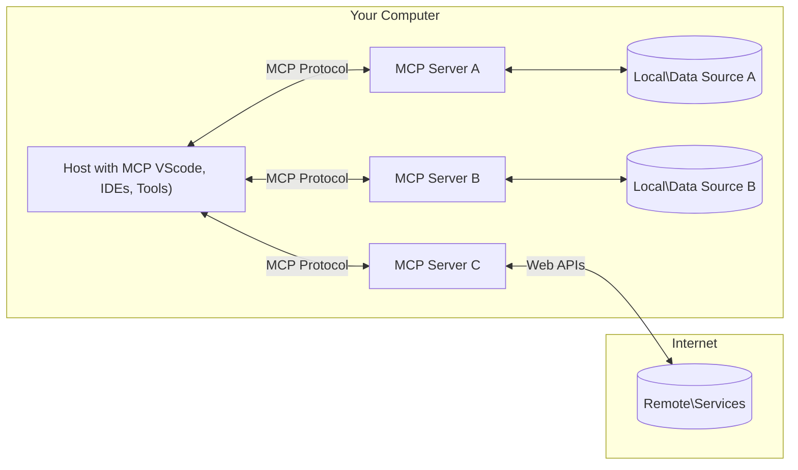

<!--
CO_OP_TRANSLATOR_METADATA:
{
  "original_hash": "b3b4a6ad10c3c0edbf7fa7cfa0ec496b",
  "translation_date": "2025-07-02T07:27:20+00:00",
  "source_file": "01-CoreConcepts/README.md",
  "language_code": "tl"
}
-->
# 📖 Mga Pangunahing Konsepto ng MCP Core: Pagsasanay sa Model Context Protocol para sa Integrasyon ng AI

Ang [Model Context Protocol (MCP)](https://github.com/modelcontextprotocol) ay isang makapangyarihan at standardisadong balangkas na nag-o-optimize ng komunikasyon sa pagitan ng Large Language Models (LLMs) at mga panlabas na kasangkapan, aplikasyon, at pinagkukunan ng datos. Ang gabay na ito na naka-optimize para sa SEO ay maglalakad sa iyo sa mga pangunahing konsepto ng MCP, upang matiyak na mauunawaan mo ang client-server na arkitektura nito, mahahalagang bahagi, mekanismo ng komunikasyon, at mga pinakamahusay na praktis sa pagpapatupad.

## Pangkalahatang Pagsusuri

Tinutuklas ng araling ito ang pundamental na arkitektura at mga bahagi na bumubuo sa ekosistem ng Model Context Protocol (MCP). Matututuhan mo ang tungkol sa client-server na arkitektura, mga pangunahing bahagi, at mga mekanismo ng komunikasyon na nagpapatakbo sa mga interaksyon ng MCP.

## 👩‍🎓 Mga Pangunahing Layunin sa Pagkatuto

Sa pagtatapos ng araling ito, ikaw ay:

- Mauunawaan ang client-server na arkitektura ng MCP.
- Matutukoy ang mga tungkulin at responsibilidad ng Hosts, Clients, at Servers.
- Masusuri ang mga pangunahing katangian na nagpapaluwag sa MCP bilang isang layer ng integrasyon.
- Malalaman kung paano dumadaloy ang impormasyon sa loob ng ekosistem ng MCP.
- Makakakuha ng praktikal na kaalaman sa pamamagitan ng mga halimbawa ng code sa .NET, Java, Python, at JavaScript.

## 🔎 Arkitektura ng MCP: Mas Malalim na Pagsilip

Ang ekosistem ng MCP ay nakabatay sa isang client-server na modelo. Ang modular na istrukturang ito ay nagpapahintulot sa mga aplikasyon ng AI na makipag-ugnayan sa mga kasangkapan, database, API, at mga kontekstwal na yaman nang mahusay. Hatiin natin ang arkitekturang ito sa mga pangunahing bahagi nito.

Sa pinaka-ugat, sumusunod ang MCP sa isang client-server na arkitektura kung saan ang isang host na aplikasyon ay maaaring kumonekta sa maraming server:



- **MCP Hosts**: Mga programa tulad ng VSCode, Claude Desktop, IDEs, o mga AI tools na nais kumuha ng datos gamit ang MCP
- **MCP Clients**: Mga client ng protocol na nagpapanatili ng 1:1 na koneksyon sa mga server
- **MCP Servers**: Magagaan na mga programa na naglalantad ng partikular na kakayahan gamit ang standardisadong Model Context Protocol
- **Local Data Sources**: Mga file, database, at serbisyo sa iyong computer na maaaring ma-access nang ligtas ng mga MCP server
- **Remote Services**: Mga panlabas na sistema na makukuha sa internet na maaaring makonektahan ng mga MCP server sa pamamagitan ng mga API.

Ang MCP Protocol ay isang patuloy na umuunlad na standard; makikita mo ang pinakabagong mga update sa [protocol specification](https://modelcontextprotocol.io/specification/2025-06-18/)

### 1. Hosts

Sa Model Context Protocol (MCP), ang mga Hosts ay may mahalagang papel bilang pangunahing interface kung saan nakikipag-ugnayan ang mga gumagamit sa protocol. Ang mga Hosts ay mga aplikasyon o kapaligiran na nagsisimula ng koneksyon sa MCP servers upang ma-access ang datos, kasangkapan, at mga prompt. Halimbawa ng mga Hosts ay mga integrated development environments (IDEs) tulad ng Visual Studio Code, mga AI tools tulad ng Claude Desktop, o mga custom-built na agent na dinisenyo para sa partikular na gawain.

**Ang mga Hosts** ay mga aplikasyon ng LLM na nagsisimula ng koneksyon. Sila ay:

- Nagpapatupad o nakikipag-ugnayan sa mga AI model upang makabuo ng mga tugon.
- Nagsisimula ng koneksyon sa MCP servers.
- Namamahala sa daloy ng pag-uusap at user interface.
- Kinokontrol ang mga pahintulot at mga panuntunan sa seguridad.
- Humahawak ng pahintulot ng gumagamit para sa pagbabahagi ng datos at pagpapatupad ng mga kasangkapan.

### 2. Clients

Ang mga Clients ay mahahalagang bahagi na nagpapadali ng interaksyon sa pagitan ng Hosts at MCP servers. Gumaganap ang Clients bilang mga tagapamagitan, na nagbibigay-daan sa mga Hosts na ma-access at magamit ang mga functionality na ibinibigay ng MCP servers. Mahalaga ang kanilang papel upang matiyak ang maayos na komunikasyon at epektibong palitan ng datos sa loob ng arkitektura ng MCP.

**Ang mga Clients** ay mga connector sa loob ng host na aplikasyon. Sila ay:

- Nagpapadala ng mga kahilingan sa mga server kasama ang mga prompt o tagubilin.
- Nakikipag-ayos ng mga kakayahan sa mga server.
- Namamahala ng mga kahilingan sa pagpapatupad ng kasangkapan mula sa mga modelo.
- Nagpoproseso at nagpapakita ng mga tugon sa mga gumagamit.

### 3. Servers

Ang mga Servers ay responsable sa paghawak ng mga kahilingan mula sa MCP clients at pagbibigay ng angkop na mga tugon. Pinamamahalaan nila ang iba't ibang operasyon tulad ng pagkuha ng datos, pagpapatupad ng mga kasangkapan, at pagbuo ng mga prompt. Tinitiyak ng mga server na ang komunikasyon sa pagitan ng clients at Hosts ay epektibo at maaasahan, pinananatili ang integridad ng proseso ng interaksyon.

**Ang mga Servers** ay mga serbisyo na nagbibigay ng konteksto at kakayahan. Sila ay:

- Nagrerehistro ng mga magagamit na tampok (mga yaman, prompt, kasangkapan)
- Tumanggap at nagpapatupad ng mga tawag sa kasangkapan mula sa client
- Nagbibigay ng kontekstwal na impormasyon upang mapabuti ang mga tugon ng modelo
- Nagbabalik ng mga resulta pabalik sa client
- Nagpapanatili ng estado sa mga interaksyon kung kinakailangan

Maaaring gawin ng kahit sino ang mga server upang palawakin ang kakayahan ng modelo gamit ang espesyal na functionality.

### 4. Mga Tampok ng Server

Ang mga server sa Model Context Protocol (MCP) ay nagbibigay ng mga pundamental na bloke ng gusali na nagpapahintulot sa masiglang interaksyon sa pagitan ng mga client, host, at mga language model. Ang mga tampok na ito ay idinisenyo upang palakasin ang kakayahan ng MCP sa pamamagitan ng pag-aalok ng istrukturadong konteksto, mga kasangkapan, at mga prompt.

Maaaring mag-alok ang mga MCP server ng alinman sa mga sumusunod na tampok:

#### 📑 Mga Yaman (Resources)

Ang mga yaman sa Model Context Protocol (MCP) ay sumasaklaw sa iba't ibang uri ng konteksto at datos na maaaring gamitin ng mga gumagamit o AI models. Kasama dito ang:

- **Kontekstwal na Datos**: Impormasyon at konteksto na maaaring gamitin ng mga gumagamit o AI models para sa paggawa ng desisyon at pagsasagawa ng mga gawain.
- **Mga Knowledge Base at Repositori ng Dokumento**: Koleksyon ng istrukturado at hindi istrukturadong datos, tulad ng mga artikulo, manwal, at mga papel na pananaliksik, na nagbibigay ng mahahalagang kaalaman at impormasyon.
- **Mga Lokal na File at Database**: Datos na nakaimbak nang lokal sa mga aparato o sa loob ng mga database, na maaaring ma-access para sa pagproseso at pagsusuri.
- **Mga API at Web Services**: Mga panlabas na interface at serbisyo na nag-aalok ng karagdagang datos at mga functionality, na nagpapahintulot ng integrasyon sa iba't ibang online na yaman at kasangkapan.

Halimbawa ng isang yaman ay maaaring isang database schema o isang file na maaaring ma-access tulad nito:

```text
file://log.txt
database://schema
```

### 🤖 Mga Prompt

Kasama sa mga prompt sa Model Context Protocol (MCP) ang iba't ibang pre-defined na template at mga pattern ng interaksyon na idinisenyo upang gawing mas madali ang mga workflow ng gumagamit at pagbutihin ang komunikasyon. Kasama dito ang:

- **Mga Templadong Mensahe at Workflow**: Mga paunang istrukturadong mensahe at proseso na gumagabay sa mga gumagamit sa mga partikular na gawain at interaksyon.
- **Pre-defined na Mga Pattern ng Interaksyon**: Standardisadong mga sunod-sunod ng aksyon at tugon na nagpapadali ng tuloy-tuloy at epektibong komunikasyon.
- **Mga Espesyal na Template ng Usapan**: Mga nako-customize na template na iniakma para sa mga partikular na uri ng pag-uusap, na tinitiyak na ang mga interaksyon ay may kaugnayan at angkop sa konteksto.

Ganito ang hitsura ng isang prompt template:

```markdown
Generate a product slogan based on the following {{product}} with the following {{keywords}}
```

#### ⛏️ Mga Kasangkapan (Tools)

Ang mga kasangkapan sa Model Context Protocol (MCP) ay mga function na maaaring ipatupad ng AI model upang gawin ang mga partikular na gawain. Ang mga kasangkapang ito ay idinisenyo upang palakasin ang kakayahan ng AI model sa pamamagitan ng pagbibigay ng istrukturado at maaasahang mga operasyon. Ang mga pangunahing aspeto ay:

- **Mga Function na maaaring ipatupad ng AI model**: Ang mga kasangkapan ay mga executable na function na maaaring tawagin ng AI model upang isagawa ang iba't ibang gawain.
- **Natanging Pangalan at Deskripsyon**: Bawat kasangkapan ay may kakaibang pangalan at detalyadong paglalarawan na nagpapaliwanag ng layunin at functionality nito.
- **Mga Parameter at Output**: Tumanggap ang mga kasangkapan ng partikular na mga parameter at nagbabalik ng istrukturadong output, na tinitiyak ang pare-pareho at inaasahang resulta.
- **Mga Hiwa-hiwalay na Function**: Gumaganap ang mga kasangkapan ng hiwa-hiwalay na mga function tulad ng web searches, kalkulasyon, at mga query sa database.

Ganito ang hitsura ng isang halimbawa ng kasangkapan:

```typescript
server.tool(
  "GetProducts",
  {
    pageSize: z.string().optional(),
    pageCount: z.string().optional()
  }, () => {
    // return results from API
  }
)
```

## Mga Tampok ng Client

Sa Model Context Protocol (MCP), nag-aalok ang mga client ng ilang pangunahing tampok sa mga server, na nagpapahusay sa pangkalahatang functionality at interaksyon sa loob ng protocol. Isa sa mga kilalang tampok ay ang Sampling.

### 👉 Sampling

- **Mga Agentic Behavior na Inumpisahan ng Server**: Pinapayagan ng mga client ang mga server na magsimula ng partikular na mga aksyon o kilos nang awtonomo, na nagpapalawak sa dinamiko ng sistema.
- **Recursive na Interaksyon sa LLM**: Pinapayagan ng tampok na ito ang recursive na interaksyon sa mga malalaking language model (LLMs), na nagbibigay-daan sa mas kumplikado at paulit-ulit na pagproseso ng mga gawain.
- **Paghingi ng Karagdagang Model Completions**: Maaaring humiling ang mga server ng karagdagang mga kompletong tugon mula sa modelo, upang matiyak na ang mga sagot ay malawak at angkop sa konteksto.

## Daloy ng Impormasyon sa MCP

Ang Model Context Protocol (MCP) ay nagtatakda ng istrukturadong daloy ng impormasyon sa pagitan ng mga host, client, server, at modelo. Ang pag-unawa sa daloy na ito ay tumutulong upang linawin kung paano pinoproseso ang mga kahilingan ng gumagamit at kung paano isinasama ang mga panlabas na kasangkapan at datos sa mga tugon ng modelo.

- **Nagsisimula ang Host ng Koneksyon**  
  Ang host na aplikasyon (tulad ng IDE o chat interface) ay nagtatatag ng koneksyon sa MCP server, karaniwan gamit ang STDIO, WebSocket, o iba pang suportadong transport.

- **Pag-uusap tungkol sa Kakayahan**  
  Nagpapalitan ng impormasyon ang client (na naka-embed sa host) at ang server tungkol sa kanilang mga suportadong tampok, kasangkapan, yaman, at bersyon ng protocol. Tinitiyak nito na parehong nauunawaan ng dalawang panig kung ano ang mga kakayahang magagamit sa session.

- **Kahilingan ng Gumagamit**  
  Nakikipag-ugnayan ang gumagamit sa host (halimbawa, naglalagay ng prompt o utos). Kinokolekta ng host ang input na ito at ipinapasa ito sa client para sa pagproseso.

- **Paggamit ng Yaman o Kasangkapan**  
  - Maaaring humiling ang client ng karagdagang konteksto o yaman mula sa server (tulad ng mga file, entry sa database, o mga artikulo sa knowledge base) upang pagyamanin ang pag-unawa ng modelo.
  - Kung matutukoy ng modelo na kailangan ang isang kasangkapan (halimbawa, upang kumuha ng datos, magsagawa ng kalkulasyon, o tumawag sa API), nagpapadala ang client ng kahilingan para sa paggamit ng kasangkapan sa server, na tinutukoy ang pangalan ng kasangkapan at mga parameter.

- **Pagpapatupad ng Server**  
  Tinatanggap ng server ang kahilingan para sa yaman o kasangkapan, isinasagawa ang kinakailangang operasyon (tulad ng pagpapatakbo ng function, pag-query sa database, o pagkuha ng file), at ibinabalik ang mga resulta sa client sa isang istrukturadong format.

- **Pagbuo ng Tugon**  
  Pinagsasama ng client ang mga tugon ng server (datos ng yaman, output ng kasangkapan, atbp.) sa kasalukuyang interaksyon ng modelo. Ginagamit ng modelo ang impormasyong ito upang makabuo ng komprehensibo at kontekstwal na angkop na tugon.

- **Pagpapakita ng Resulta**  
  Natatanggap ng host ang panghuling output mula sa client at ipinapakita ito sa gumagamit, kadalasan kasama ang parehong teksto na nilikha ng modelo at anumang resulta mula sa pagpapatupad ng kasangkapan o pagtingin sa yaman.

Pinapahintulutan ng daloy na ito ang MCP na suportahan ang mga advanced, interactive, at kontekstwal na AI na aplikasyon sa pamamagitan ng walang putol na pagkonekta ng mga modelo sa mga panlabas na kasangkapan at pinagkukunan ng datos.

## Mga Detalye ng Protocol

Ang MCP (Model Context Protocol) ay nakabatay sa [JSON-RPC 2.0](https://www.jsonrpc.org/), na nagbibigay ng standardisadong, language-agnostic na format ng mensahe para sa komunikasyon sa pagitan ng mga host, client, at server. Ang pundasyong ito ay nagpapahintulot ng maaasahan, istrukturado, at pinalawak na interaksyon sa iba't ibang plataporma at mga programming language.

### Mga Pangunahing Tampok ng Protocol

Pinalalawak ng MCP ang JSON-RPC 2.0 gamit ang mga karagdagang konbensyon para sa pagtawag ng kasangkapan, pag-access ng yaman, at pamamahala ng prompt. Sinusuportahan nito ang maraming transport layer (STDIO, WebSocket, SSE) at nagpapahintulot ng ligtas, pinalawak, at language-agnostic na komunikasyon sa pagitan ng mga bahagi.

#### 🧢 Base Protocol

- **JSON-RPC Message Format**: Lahat ng kahilingan at tugon ay gumagamit ng JSON-RPC 2.0 na espesipikasyon, na tinitiyak ang pare-parehong istruktura para sa mga tawag sa method, parameter, resulta, at paghawak ng error.
- **Stateful Connections**: Pinananatili ng mga session ng MCP ang estado sa maraming kahilingan, sinusuportahan ang tuloy-tuloy na pag-uusap, pag-ipon ng konteksto, at pamamahala ng yaman.
- **Capability Negotiation**: Sa pagsisimula ng koneksyon, nagpapalitan ng impormasyon ang mga client at server tungkol sa mga suportadong tampok, bersyon ng protocol, mga magagamit na kasangkapan, at yaman. Tinitiyak nito na parehong nauunawaan ng dalawang panig ang kakayahan ng isa't isa at maaaring mag-adjust nang naaayon.

#### ➕ Karagdagang Mga Utility

Narito ang ilan pang mga utility at extension ng protocol na ibinibigay ng MCP upang pagandahin ang karanasan ng developer at pahintulutan ang mga advanced na senaryo:

- **Mga Opsyon sa Configuration**: Pinapayagan ng MCP ang dynamic na pagsasaayos ng mga parameter ng session, tulad ng mga pahintulot sa kasangkapan, pag-access sa yaman, at mga setting ng modelo, na iniangkop sa bawat interaksyon.
- **Pagsubaybay ng Progreso**: Ang mga mahahabang operasyon ay maaaring mag-ulat ng mga update sa progreso, na nagpapahintulot ng mas mabilis na tugon ng user interface at mas magandang karanasan ng gumagamit sa mga kumplikadong gawain.
- **Pagkansela ng Kahilingan**: Maaaring kanselahin ng mga client ang mga kasalukuyang kahilingan, na nagbibigay-daan sa mga gumagamit na ihinto ang mga operasyong hindi na kailangan o matagal nang tumatagal.
- **Pag-uulat ng Error**: Ang mga standardisadong mensahe ng error at mga code ay tumutulong sa pag-diagnose ng mga problema, maayos na paghawak ng pagkabigo, at pagbibigay ng kapaki-pakinabang na feedback sa mga gumagamit at developer.
- **Pag-log**: Parehong client at server ay maaaring maglabas ng istrukturadong log para sa auditing, debugging, at pagmamanman ng mga interaksyon ng protocol.

Sa pamamagitan ng paggamit ng mga tampok ng protocol na ito, tinitiyak ng MCP ang matibay, ligtas, at flexible na komunikasyon sa pagitan ng mga language model at mga panlabas na kasangkapan o pinagkukunan ng datos.

### 🔐 Mga Pagsasaalang-alang sa Seguridad

Dapat sumunod ang mga implementasyon ng MCP sa ilang pangunahing prinsipyo ng seguridad upang matiyak ang ligtas at mapagkakatiwalaang mga interaksyon:

- **Pahintulot at Kontrol ng Gumagamit**: Dapat magbigay ang mga gumagamit ng malinaw na pahintulot bago ma-access ang anumang datos o maisagawa ang

**Pahayag ng Pagwawaksi**:  
Ang dokumentong ito ay isinalin gamit ang AI translation service na [Co-op Translator](https://github.com/Azure/co-op-translator). Bagamat nagsusumikap kami na maging tumpak, pakatandaan na ang mga awtomatikong pagsasalin ay maaaring maglaman ng mga pagkakamali o di-katumpakan. Ang orihinal na dokumento sa orihinal nitong wika ang dapat ituring na opisyal na sanggunian. Para sa mahahalagang impormasyon, inirerekomenda ang propesyonal na pagsasalin ng tao. Hindi kami mananagot sa anumang hindi pagkakaunawaan o maling interpretasyon na maaaring magmula sa paggamit ng pagsasaling ito.