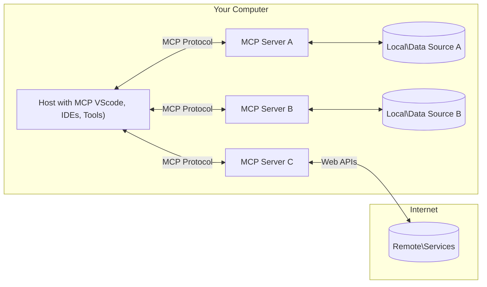

<!--
CO_OP_TRANSLATOR_METADATA:
{
  "original_hash": "355b12a5970c5c9e6db0bee970c751ba",
  "translation_date": "2025-07-13T16:15:12+00:00",
  "source_file": "01-CoreConcepts/README.md",
  "language_code": "tl"
}
-->
# 📖 Mga Pangunahing Konsepto ng MCP Core: Pagsasanay sa Model Context Protocol para sa AI Integration

Ang [Model Context Protocol (MCP)](https://github.com/modelcontextprotocol) ay isang makapangyarihan at standardisadong balangkas na nag-ooptimize ng komunikasyon sa pagitan ng Large Language Models (LLMs) at mga panlabas na kasangkapan, aplikasyon, at pinagkukunan ng datos. Ang gabay na ito na SEO-optimized ay maglalakad sa iyo sa mga pangunahing konsepto ng MCP, tinitiyak na mauunawaan mo ang client-server architecture nito, mahahalagang bahagi, mekanismo ng komunikasyon, at mga pinakamahusay na kasanayan sa pagpapatupad.

## Pangkalahatang-ideya

Tinutuklas ng araling ito ang pundamental na arkitektura at mga bahagi na bumubuo sa Model Context Protocol (MCP) ecosystem. Malalaman mo ang tungkol sa client-server architecture, mga pangunahing bahagi, at mga mekanismo ng komunikasyon na nagpapatakbo sa mga interaksyon ng MCP.

## 👩‍🎓 Mga Pangunahing Layunin sa Pagkatuto

Sa pagtatapos ng araling ito, ikaw ay:

- Mauunawaan ang MCP client-server architecture.
- Matutukoy ang mga papel at responsibilidad ng Hosts, Clients, at Servers.
- Masusuri ang mga pangunahing katangian na nagpapalawak ng MCP bilang isang flexible na integration layer.
- Malalaman kung paano dumadaloy ang impormasyon sa loob ng MCP ecosystem.
- Makakakuha ng praktikal na kaalaman sa pamamagitan ng mga halimbawa ng code sa .NET, Java, Python, at JavaScript.

## 🔎 MCP Architecture: Mas Malalim na Pagsilip

Ang MCP ecosystem ay nakabatay sa client-server model. Ang modular na estrukturang ito ay nagpapahintulot sa mga AI application na makipag-ugnayan sa mga kasangkapan, database, API, at mga contextual na resources nang epektibo. Hatiin natin ang arkitekturang ito sa mga pangunahing bahagi nito.

Sa pinakapuso, sumusunod ang MCP sa client-server architecture kung saan ang isang host application ay maaaring kumonekta sa maraming server:



- **MCP Hosts**: Mga programa tulad ng VSCode, Claude Desktop, IDEs, o mga AI tool na nais kumuha ng datos gamit ang MCP
- **MCP Clients**: Mga protocol client na nagpapanatili ng 1:1 na koneksyon sa mga server
- **MCP Servers**: Magagaan na mga programa na bawat isa ay naglalabas ng partikular na kakayahan gamit ang standardisadong Model Context Protocol
- **Local Data Sources**: Mga file, database, at serbisyo sa iyong computer na maaaring ma-access nang ligtas ng MCP servers
- **Remote Services**: Mga panlabas na sistema na makukuha sa internet na maaaring konektahan ng MCP servers sa pamamagitan ng mga API.

Ang MCP Protocol ay isang umuusbong na standard; makikita mo ang pinakabagong mga update sa [protocol specification](https://modelcontextprotocol.io/specification/2025-06-18/)

### 1. Hosts

Sa Model Context Protocol (MCP), mahalaga ang papel ng Hosts bilang pangunahing interface kung saan nakikipag-ugnayan ang mga gumagamit sa protocol. Ang Hosts ay mga aplikasyon o kapaligiran na nagsisimula ng koneksyon sa MCP servers upang ma-access ang datos, mga kasangkapan, at mga prompt. Halimbawa ng Hosts ay mga integrated development environments (IDEs) tulad ng Visual Studio Code, mga AI tool tulad ng Claude Desktop, o mga custom-built na ahente na ginawa para sa partikular na mga gawain.

**Hosts** ay mga LLM application na nagsisimula ng koneksyon. Sila ay:

- Nagpapatakbo o nakikipag-ugnayan sa mga AI model upang makabuo ng mga sagot.
- Nagsisimula ng koneksyon sa MCP servers.
- Namamahala sa daloy ng pag-uusap at user interface.
- Kumokontrol sa mga pahintulot at mga limitasyon sa seguridad.
- Humahawak ng pahintulot ng gumagamit para sa pagbabahagi ng datos at pagpapatakbo ng mga kasangkapan.

### 2. Clients

Ang Clients ay mahahalagang bahagi na nagpapadali ng interaksyon sa pagitan ng Hosts at MCP servers. Ang Clients ay nagsisilbing tagapamagitan, na nagpapahintulot sa Hosts na ma-access at magamit ang mga functionality na ibinibigay ng MCP servers. Mahalaga ang kanilang papel upang matiyak ang maayos na komunikasyon at epektibong palitan ng datos sa loob ng MCP architecture.

**Clients** ay mga konektor sa loob ng host application. Sila ay:

- Nagpapadala ng mga kahilingan sa mga server kasama ang mga prompt/instruction.
- Nakikipag-ayos ng mga kakayahan sa mga server.
- Namamahala sa mga kahilingan para sa pagpapatakbo ng mga kasangkapan mula sa mga modelo.
- Nagpoproseso at nagpapakita ng mga sagot sa mga gumagamit.

### 3. Servers

Ang Servers ang responsable sa paghawak ng mga kahilingan mula sa MCP clients at pagbibigay ng angkop na mga tugon. Pinamamahalaan nila ang iba't ibang operasyon tulad ng pagkuha ng datos, pagpapatakbo ng mga kasangkapan, at pagbuo ng mga prompt. Tinitiyak ng Servers na ang komunikasyon sa pagitan ng clients at Hosts ay epektibo at maaasahan, pinananatili ang integridad ng proseso ng interaksyon.

**Servers** ay mga serbisyo na nagbibigay ng konteksto at kakayahan. Sila ay:

- Nagpaparehistro ng mga available na tampok (resources, prompts, tools)
- Tumanggap at nagpapatupad ng mga tool call mula sa client
- Nagbibigay ng contextual na impormasyon upang mapabuti ang mga sagot ng modelo
- Nagbabalik ng mga output pabalik sa client
- Nagpapanatili ng estado sa mga interaksyon kung kinakailangan

Maaaring gawin ng sinuman ang mga server upang palawakin ang kakayahan ng modelo gamit ang espesyal na functionality.

### 4. Mga Tampok ng Server

Ang mga server sa Model Context Protocol (MCP) ay nagbibigay ng mga pundamental na bahagi na nagpapahintulot ng masiglang interaksyon sa pagitan ng clients, hosts, at mga language model. Ang mga tampok na ito ay idinisenyo upang palawakin ang kakayahan ng MCP sa pamamagitan ng pagbibigay ng istrukturadong konteksto, mga kasangkapan, at mga prompt.

Maaaring mag-alok ang MCP servers ng alinman sa mga sumusunod na tampok:

#### 📑 Resources

Ang mga Resources sa Model Context Protocol (MCP) ay sumasaklaw sa iba't ibang uri ng konteksto at datos na maaaring gamitin ng mga gumagamit o AI models. Kabilang dito ang:

- **Contextual Data**: Impormasyon at konteksto na maaaring gamitin ng mga gumagamit o AI models para sa paggawa ng desisyon at pagsasagawa ng mga gawain.
- **Knowledge Bases at Document Repositories**: Mga koleksyon ng istrukturado at hindi istrukturadong datos, tulad ng mga artikulo, manwal, at mga research paper, na nagbibigay ng mahahalagang kaalaman at impormasyon.
- **Local Files at Databases**: Datos na nakaimbak lokal sa mga device o sa loob ng mga database, na maaaring ma-access para sa pagproseso at pagsusuri.
- **APIs at Web Services**: Mga panlabas na interface at serbisyo na nag-aalok ng karagdagang datos at functionality, na nagpapahintulot ng integrasyon sa iba't ibang online na resources at kasangkapan.

Isang halimbawa ng resource ay maaaring isang database schema o isang file na maaaring ma-access tulad nito:

```text
file://log.txt
database://schema
```

### 🤖 Prompts

Ang mga Prompts sa Model Context Protocol (MCP) ay kinabibilangan ng iba't ibang pre-defined na mga template at pattern ng interaksyon na idinisenyo upang mapadali ang workflow ng gumagamit at mapabuti ang komunikasyon. Kabilang dito ang:

- **Templated Messages at Workflows**: Mga pre-istrukturadong mensahe at proseso na gumagabay sa mga gumagamit sa partikular na mga gawain at interaksyon.
- **Pre-defined Interaction Patterns**: Standardisadong mga sunod-sunod na aksyon at tugon na nagpapadali ng pare-pareho at epektibong komunikasyon.
- **Specialized Conversation Templates**: Mga naiaangkop na template na ginawa para sa partikular na uri ng pag-uusap, na tinitiyak ang kaugnayan at angkop na konteksto.

Ang isang prompt template ay maaaring ganito ang hitsura:

```markdown
Generate a product slogan based on the following {{product}} with the following {{keywords}}
```

#### ⛏️ Tools

Ang mga Tools sa Model Context Protocol (MCP) ay mga function na maaaring patakbuhin ng AI model upang magsagawa ng partikular na mga gawain. Ang mga kasangkapang ito ay idinisenyo upang palawakin ang kakayahan ng AI model sa pamamagitan ng pagbibigay ng istrukturado at maaasahang operasyon. Mahahalagang aspeto nito ay:

- **Mga Function na maaaring patakbuhin ng AI model**: Ang mga tools ay mga executable na function na maaaring tawagin ng AI model upang isagawa ang iba't ibang gawain.
- **Natanging Pangalan at Deskripsyon**: Bawat tool ay may natatanging pangalan at detalyadong paglalarawan na nagpapaliwanag ng layunin at functionality nito.
- **Mga Parameter at Output**: Tumanggap ang mga tools ng partikular na mga parameter at nagbabalik ng istrukturadong output, na tinitiyak ang pare-pareho at inaasahang resulta.
- **Mga Discrete na Function**: Ang mga tools ay nagsasagawa ng mga discrete na function tulad ng web searches, kalkulasyon, at mga query sa database.

Isang halimbawa ng tool ay maaaring ganito ang hitsura:

```typescript
server.tool(
  "GetProducts",
  {
    pageSize: z.string().optional(),
    pageCount: z.string().optional()
  }, () => {
    // return results from API
  }
)
```

## Mga Tampok ng Client

Sa Model Context Protocol (MCP), nag-aalok ang mga client ng ilang mahahalagang tampok sa mga server, na nagpapalawak ng kabuuang functionality at interaksyon sa loob ng protocol. Isa sa mga kapansin-pansing tampok ay ang Sampling.

### 👉 Sampling

- **Server-Initiated Agentic Behaviors**: Pinapahintulutan ng mga client ang mga server na magsimula ng partikular na mga aksyon o pag-uugali nang autonomously, na nagpapalawak ng dynamic na kakayahan ng sistema.
- **Recursive LLM Interactions**: Pinapayagan ng tampok na ito ang recursive na interaksyon sa mga malalaking language model (LLMs), na nagpapahintulot ng mas kumplikado at paulit-ulit na pagproseso ng mga gawain.
- **Paghingi ng Karagdagang Model Completions**: Maaaring humiling ang mga server ng karagdagang mga completion mula sa modelo, na tinitiyak na ang mga sagot ay masusing at may kaugnayan sa konteksto.

## Daloy ng Impormasyon sa MCP

Ang Model Context Protocol (MCP) ay nagtatakda ng istrukturadong daloy ng impormasyon sa pagitan ng hosts, clients, servers, at mga modelo. Ang pag-unawa sa daloy na ito ay nakakatulong upang linawin kung paano pinoproseso ang mga kahilingan ng gumagamit at kung paano isinasama ang mga panlabas na kasangkapan at datos sa mga sagot ng modelo.

- **Host Nagsisimula ng Koneksyon**  
  Ang host application (tulad ng isang IDE o chat interface) ay nagtatatag ng koneksyon sa isang MCP server, karaniwang sa pamamagitan ng STDIO, WebSocket, o iba pang suportadong transport.

- **Negosasyon ng Kakayahan**  
  Ang client (na naka-embed sa host) at ang server ay nagpapalitan ng impormasyon tungkol sa kanilang mga suportadong tampok, kasangkapan, resources, at mga bersyon ng protocol. Tinitiyak nito na pareho nilang nauunawaan kung anong mga kakayahan ang available para sa session.

- **Kahilingan ng Gumagamit**  
  Nakikipag-ugnayan ang gumagamit sa host (hal., naglalagay ng prompt o utos). Kinokolekta ng host ang input na ito at ipinapasa ito sa client para sa pagproseso.

- **Paggamit ng Resource o Tool**  
  - Maaaring humiling ang client ng karagdagang konteksto o resources mula sa server (tulad ng mga file, entry sa database, o mga artikulo sa knowledge base) upang mapayaman ang pag-unawa ng modelo.
  - Kung natukoy ng modelo na kailangan ang isang tool (hal., para kumuha ng datos, magsagawa ng kalkulasyon, o tumawag ng API), nagpapadala ang client ng kahilingan para sa tool invocation sa server, na tinutukoy ang pangalan ng tool at mga parameter.

- **Pagpapatupad ng Server**  
  Tinatanggap ng server ang kahilingan para sa resource o tool, isinasagawa ang kinakailangang operasyon (tulad ng pagpapatakbo ng function, pag-query sa database, o pagkuha ng file), at ibinabalik ang mga resulta sa client sa isang istrukturadong format.

- **Pagbuo ng Tugon**  
  Isinasama ng client ang mga tugon ng server (datos ng resource, output ng tool, atbp.) sa kasalukuyang interaksyon ng modelo. Ginagamit ng modelo ang impormasyong ito upang makabuo ng komprehensibo at kontekstwal na angkop na sagot.

- **Pagpapakita ng Resulta**  
  Tinatanggap ng host ang panghuling output mula sa client at ipinapakita ito sa gumagamit, kadalasan ay kasama ang parehong teksto na nilikha ng modelo at anumang resulta mula sa pagpapatakbo ng mga tool o pagtingin sa mga resource.

Pinapahintulutan ng daloy na ito ang MCP na suportahan ang mga advanced, interactive, at context-aware na AI application sa pamamagitan ng seamless na pagkonekta ng mga modelo sa mga panlabas na kasangkapan at pinagkukunan ng datos.

## Detalye ng Protocol

Ang MCP (Model Context Protocol) ay nakabatay sa [JSON-RPC 2.0](https://www.jsonrpc.org/), na nagbibigay ng standardisadong, language-agnostic na format ng mensahe para sa komunikasyon sa pagitan ng hosts, clients, at servers. Ang pundasyong ito ay nagpapahintulot ng maaasahan, istrukturado, at extensible na interaksyon sa iba't ibang platform at programming languages.

### Mga Pangunahing Tampok ng Protocol

Pinalalawak ng MCP ang JSON-RPC 2.0 gamit ang karagdagang mga convention para sa tool invocation, resource access, at prompt management. Sinusuportahan nito ang maraming transport layer (STDIO, WebSocket, SSE) at nagpapahintulot ng secure, extensible, at language-agnostic na komunikasyon sa pagitan ng mga bahagi.

#### 🧢 Base Protocol

- **JSON-RPC Message Format**: Lahat ng kahilingan at tugon ay gumagamit ng JSON-RPC 2.0 specification, na tinitiyak ang pare-parehong istruktura para sa mga method call, parameter, resulta, at paghawak ng error.
- **Stateful Connections**: Pinapanatili ng MCP sessions ang estado sa maraming kahilingan, sumusuporta sa tuloy-tuloy na pag-uusap, pag-ipon ng konteksto, at pamamahala ng resources.
- **Capability Negotiation**: Sa pagsisimula ng koneksyon, nagpapalitan ang clients at servers ng impormasyon tungkol sa mga suportadong tampok, bersyon ng protocol, mga available na tool, at resources. Tinitiyak nito na nauunawaan ng magkabilang panig ang kakayahan ng isa't isa at maaaring mag-adjust nang naaayon.

#### ➕ Karagdagang Utilities

Narito ang ilang karagdagang utilities at extension ng protocol na ibinibigay ng MCP upang mapabuti ang karanasan ng developer at payagan ang mga advanced na senaryo:

- **Configuration Options**: Pinapayagan ng MCP ang dynamic na configuration ng mga parameter ng session, tulad ng mga pahintulot sa tool, access sa resource, at mga setting ng modelo, na iniangkop sa bawat interaksyon.
- **Progress Tracking**: Maaaring mag-ulat ang mga long-running na operasyon ng mga update sa progreso, na nagpapahintulot ng responsive na user interface at mas magandang karanasan ng gumagamit sa mga kumplikadong gawain.
- **Request Cancellation**: Maaaring kanselahin ng mga client ang mga kahilingan na kasalukuyang isinasagawa, na nagbibigay-daan sa mga gumagamit na itigil ang mga operasyong hindi na kailangan o masyadong matagal.
- **Error Reporting**: Standardisadong mga mensahe at code ng error ang tumutulong sa pag-diagnose ng mga isyu, maayos na paghawak ng mga pagkabigo, at pagbibigay ng actionable na feedback sa mga gumagamit at developer.
- **Logging**: Parehong clients at servers ay maaaring maglabas ng istrukturadong mga log para sa auditing, debugging, at pagmamanman ng mga interaksyon sa protocol.

Sa pamamagitan ng paggamit ng mga tampok na ito ng protocol, tinitiyak ng MCP ang matatag, ligtas, at flexible na komunikasyon sa pagitan ng mga language model at mga panlabas na kasangkapan o pinagkukunan ng datos.

### 🔐 Mga Pagsasaalang-alang sa Seguridad

Dapat sumunod ang mga implementasyon ng MCP sa ilang mahahalagang prinsipyo ng seguridad upang matiyak ang ligtas at mapagkakatiwalaang mga interaksyon:

- **Pahintulot at Kontrol ng Gumagamit**: Dapat magbigay ang mga gumagamit ng malinaw na pahintulot bago ma-access ang anumang datos o maisagawa ang mga operasyon. Dapat may malinaw silang kontrol kung anong datos ang ibabahagi at kung aling mga aksyon ang pinapayagan, na sinusuportahan ng madaling gamitin na interface para sa pagsusuri at pag-apruba ng mga aktibidad.

- **Pribadong Datos**: Ang datos ng gumagamit ay dapat ilantad lamang sa malinaw na pahintulot at dapat protektahan ng angkop na mga kontrol sa access. Dapat pangalagaan ng mga implementasyon ng MCP laban sa hindi awtorisadong transmisyon ng datos at tiyakin na nananatili ang privacy sa lahat ng interaksyon.

- **Kaligtasan ng Tool**: Bago tumawag ng anumang tool, kinakailangan ang malinaw na pahintulot ng gumagamit. Dapat malinaw sa mga gumagamit ang functionality ng bawat tool, at dapat ipatupad ang matibay na mga hangganan sa seguridad upang maiwasan ang hindi sinasadyang o hindi ligtas na pagpapatakbo ng tool.

Sa pagsunod sa mga prinsipyong
Kasama sa MCP ang ilang mga built-in na konsepto at mekanismo para sa pamamahala ng seguridad at awtorisasyon sa buong protocol:

1. **Kontrol sa Pahintulot ng Tool**:  
  Maaaring tukuyin ng mga kliyente kung aling mga tool ang pinapayagan gamitin ng isang modelo sa isang session. Tinitiyak nito na tanging mga tool na malinaw na pinahintulutan lamang ang maa-access, na nagpapababa ng panganib ng hindi sinasadyang o delikadong operasyon. Maaaring i-configure ang mga pahintulot nang dinamiko batay sa mga kagustuhan ng gumagamit, mga patakaran ng organisasyon, o konteksto ng interaksyon.

2. **Pagpapatunay ng Katauhan**:  
  Maaaring hingin ng mga server ang pagpapatunay ng katauhan bago payagan ang pag-access sa mga tool, resources, o sensitibong operasyon. Maaaring kabilang dito ang API keys, OAuth tokens, o iba pang mga scheme ng pagpapatunay. Tinitiyak ng tamang pagpapatunay na tanging mga pinagkakatiwalaang kliyente at gumagamit lamang ang makakagamit ng mga kakayahan sa server.

3. **Pagpapatunay**:  
  Ipinapatupad ang pagpapatunay ng mga parameter para sa lahat ng pagtawag sa tool. Bawat tool ay nagtatakda ng inaasahang mga uri, format, at mga limitasyon para sa mga parameter nito, at sinusuri ng server ang mga papasok na kahilingan ayon dito. Pinipigilan nito ang mga maling anyo o malisyosong input na makarating sa mga implementasyon ng tool at tumutulong mapanatili ang integridad ng mga operasyon.

4. **Paglimita ng Rate**:  
  Upang maiwasan ang pang-aabuso at matiyak ang patas na paggamit ng mga resources ng server, maaaring magpatupad ang mga MCP server ng paglimita ng rate para sa mga pagtawag sa tool at pag-access sa resources. Maaaring ipatupad ang mga limitasyon sa bawat gumagamit, bawat session, o sa pangkalahatan, at tumutulong ito na maprotektahan laban sa denial-of-service attacks o labis na paggamit ng resources.

Sa pamamagitan ng pagsasama-sama ng mga mekanismong ito, nagbibigay ang MCP ng isang ligtas na pundasyon para sa pagsasama ng mga language model sa mga panlabas na tool at pinagkukunan ng datos, habang binibigyan ang mga gumagamit at developer ng masusing kontrol sa pag-access at paggamit.

## Mga Mensahe ng Protocol

Gumagamit ang komunikasyon ng MCP ng mga istrukturadong mensahe sa JSON upang mapadali ang malinaw at maaasahang interaksyon sa pagitan ng mga kliyente, server, at mga modelo. Kabilang sa mga pangunahing uri ng mensahe ang:

- **Client Request**  
  Ipinapadala mula sa kliyente papunta sa server, karaniwang naglalaman ang mensaheng ito ng:
  - Prompt o utos ng gumagamit
  - Kasaysayan ng pag-uusap para sa konteksto
  - Konfigurasyon at mga pahintulot ng tool
  - Anumang karagdagang metadata o impormasyon ng session

- **Model Response**  
  Ibinabalik ng modelo (sa pamamagitan ng kliyente), naglalaman ang mensaheng ito ng:
  - Nabuong teksto o kompletong sagot batay sa prompt at konteksto
  - Opsyonal na mga tagubilin para sa pagtawag ng tool kung napagpasyahan ng modelo na kailangang gamitin ang isang tool
  - Mga sanggunian sa mga resources o karagdagang konteksto kung kinakailangan

- **Tool Request**  
  Ipinapadala mula sa kliyente papunta sa server kapag kailangang patakbuhin ang isang tool. Kasama sa mensaheng ito ang:
  - Pangalan ng tool na tatawagin
  - Mga parameter na kinakailangan ng tool (sinusuri laban sa schema ng tool)
  - Impormasyon sa konteksto o mga identifier para sa pagsubaybay ng kahilingan

- **Tool Response**  
  Ibinabalik ng server pagkatapos patakbuhin ang tool. Nagbibigay ang mensaheng ito ng:
  - Mga resulta ng pagpapatakbo ng tool (istrukturadong datos o nilalaman)
  - Anumang mga error o impormasyon sa status kung nabigo ang pagtawag sa tool
  - Opsyonal, karagdagang metadata o mga log na may kaugnayan sa pagpapatupad

Tinitiyak ng mga istrukturadong mensaheng ito na bawat hakbang sa MCP workflow ay malinaw, masusubaybayan, at maaaring palawakin, na sumusuporta sa mga advanced na senaryo tulad ng multi-turn na pag-uusap, pagsasama-sama ng mga tool, at matibay na paghawak ng error.

## Mga Pangunahing Punto

- Gumagamit ang MCP ng client-server na arkitektura upang ikonekta ang mga modelo sa mga panlabas na kakayahan
- Binubuo ang ecosystem ng mga kliyente, host, server, tool, at pinagkukunan ng datos
- Maaaring maganap ang komunikasyon sa pamamagitan ng STDIO, SSE, o WebSockets
- Ang mga tool ang pangunahing yunit ng functionality na ipinapakita sa mga modelo
- Tinitiyak ng mga istrukturadong protocol ng komunikasyon ang pare-parehong interaksyon

## Ehersisyo

Disenyo ng isang simpleng MCP tool na magiging kapaki-pakinabang sa iyong larangan. Tukuyin:
1. Ano ang magiging pangalan ng tool
2. Anong mga parameter ang tatanggapin nito
3. Anong output ang ibibigay nito
4. Paano maaaring gamitin ng isang modelo ang tool na ito upang lutasin ang mga problema ng gumagamit


---

## Ano ang susunod

Susunod: [Chapter 2: Security](../02-Security/README.md)

**Paalala**:  
Ang dokumentong ito ay isinalin gamit ang AI translation service na [Co-op Translator](https://github.com/Azure/co-op-translator). Bagamat nagsusumikap kami para sa katumpakan, pakatandaan na ang mga awtomatikong pagsasalin ay maaaring maglaman ng mga pagkakamali o di-tumpak na impormasyon. Ang orihinal na dokumento sa orihinal nitong wika ang dapat ituring na pangunahing sanggunian. Para sa mahahalagang impormasyon, inirerekomenda ang propesyonal na pagsasalin ng tao. Hindi kami mananagot sa anumang hindi pagkakaunawaan o maling interpretasyon na maaaring magmula sa paggamit ng pagsasaling ito.