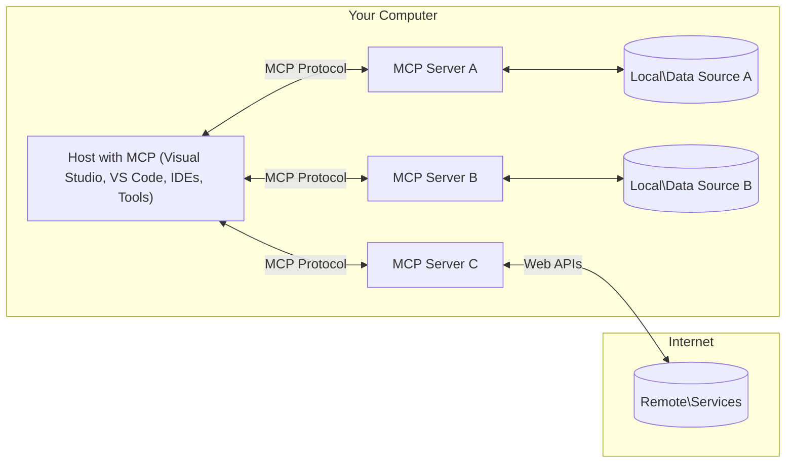

<!--
CO_OP_TRANSLATOR_METADATA:
{
  "original_hash": "904b59de1de9264801242d90a42cdd9d",
  "translation_date": "2025-09-05T11:21:38+00:00",
  "source_file": "01-CoreConcepts/README.md",
  "language_code": "tl"
}
-->
# MCP Core Concepts: Pag-master sa Model Context Protocol para sa AI Integration

[](https://youtu.be/earDzWGtE84)

_(I-click ang imahe sa itaas para mapanood ang video ng araling ito)_

Ang [Model Context Protocol (MCP)](https://github.com/modelcontextprotocol) ay isang makapangyarihang, standardized na framework na nag-o-optimize ng komunikasyon sa pagitan ng Large Language Models (LLMs) at mga external na tools, applications, at data sources.  
Ang gabay na ito ay magpapaliwanag sa mga pangunahing konsepto ng MCP. Matututuhan mo ang tungkol sa client-server architecture nito, mahahalagang bahagi, mekanika ng komunikasyon, at mga pinakamahusay na kasanayan sa implementasyon.

- **Explicit User Consent**: Ang lahat ng pag-access sa data at operasyon ay nangangailangan ng malinaw na pahintulot mula sa user bago ito isagawa. Dapat malinaw na maunawaan ng user kung anong data ang maa-access at kung anong aksyon ang gagawin, na may detalyadong kontrol sa mga pahintulot at awtorisasyon.

- **Proteksyon sa Privacy ng Data**: Ang data ng user ay maipapakita lamang sa pamamagitan ng malinaw na pahintulot at dapat protektahan ng matibay na access controls sa buong lifecycle ng interaksyon. Ang mga implementasyon ay dapat pigilan ang hindi awtorisadong transmisyon ng data at panatilihin ang mahigpit na hangganan ng privacy.

- **Kaligtasan sa Pagpapatakbo ng Tool**: Ang bawat pag-invoke ng tool ay nangangailangan ng malinaw na pahintulot mula sa user na may malinaw na pag-unawa sa functionality ng tool, mga parameter, at posibleng epekto. Ang matibay na hangganan ng seguridad ay dapat pigilan ang hindi sinasadya, hindi ligtas, o malisyosong pagpapatakbo ng tool.

- **Transport Layer Security**: Ang lahat ng mga channel ng komunikasyon ay dapat gumamit ng angkop na encryption at authentication mechanisms. Ang mga remote na koneksyon ay dapat magpatupad ng secure na transport protocols at tamang pamamahala ng credentials.

#### Mga Alituntunin sa Implementasyon:

- **Permission Management**: Magpatupad ng fine-grained na permission systems na nagbibigay-daan sa mga user na kontrolin kung aling mga server, tools, at resources ang maa-access  
- **Authentication & Authorization**: Gumamit ng secure na authentication methods (OAuth, API keys) na may tamang pamamahala ng token at expiration  
- **Input Validation**: I-validate ang lahat ng parameters at data inputs ayon sa mga defined schemas upang maiwasan ang injection attacks  
- **Audit Logging**: Panatilihin ang komprehensibong logs ng lahat ng operasyon para sa security monitoring at compliance  

## Overview

Ang araling ito ay nag-eexplore sa fundamental architecture at mga bahagi na bumubuo sa Model Context Protocol (MCP) ecosystem. Matututuhan mo ang tungkol sa client-server architecture, mga pangunahing bahagi, at mga mekanismo ng komunikasyon na nagpapagana sa MCP interactions.

## Mga Pangunahing Layunin sa Pagkatuto

Sa pagtatapos ng araling ito, ikaw ay:

- Maiintindihan ang MCP client-server architecture.  
- Matutukoy ang mga tungkulin at responsibilidad ng Hosts, Clients, at Servers.  
- Ma-analyze ang mga pangunahing tampok na nagpapagana sa MCP bilang flexible integration layer.  
- Matututuhan kung paano dumadaloy ang impormasyon sa loob ng MCP ecosystem.  
- Makakakuha ng praktikal na kaalaman sa pamamagitan ng mga halimbawa ng code sa .NET, Java, Python, at JavaScript.

## MCP Architecture: Mas Malalim na Pagsusuri

Ang MCP ecosystem ay nakabatay sa client-server model. Ang modular na istrukturang ito ay nagbibigay-daan sa mga AI applications na makipag-ugnayan sa tools, databases, APIs, at contextual resources nang epektibo. Tingnan natin ang arkitektura na ito sa mga pangunahing bahagi nito.

Sa pinakapundasyon nito, sinusunod ng MCP ang client-server architecture kung saan ang host application ay maaaring kumonekta sa maraming servers:



- **MCP Hosts**: Mga programa tulad ng VSCode, Claude Desktop, IDEs, o AI tools na nais mag-access ng data sa pamamagitan ng MCP  
- **MCP Clients**: Protocol clients na nagpapanatili ng 1:1 na koneksyon sa mga servers  
- **MCP Servers**: Mga magagaan na programa na nag-e-expose ng partikular na kakayahan sa pamamagitan ng standardized Model Context Protocol  
- **Local Data Sources**: Mga file, databases, at serbisyo ng iyong computer na maaaring ma-access ng MCP servers nang ligtas  
- **Remote Services**: Mga external na sistema na available sa internet na maaaring kumonekta ang MCP servers sa pamamagitan ng APIs  

Ang MCP Protocol ay isang evolving standard na gumagamit ng date-based versioning (YYYY-MM-DD format). Ang kasalukuyang protocol version ay **2025-06-18**. Makikita mo ang pinakabagong updates sa [protocol specification](https://modelcontextprotocol.io/specification/2025-06-18/)

### 1. Hosts

Sa Model Context Protocol (MCP), ang **Hosts** ay mga AI applications na nagsisilbing pangunahing interface kung saan nakikipag-ugnayan ang mga user sa protocol. Ang Hosts ay nagko-coordinate at nagma-manage ng mga koneksyon sa maraming MCP servers sa pamamagitan ng paglikha ng dedicated MCP clients para sa bawat koneksyon sa server. Mga halimbawa ng Hosts:

- **AI Applications**: Claude Desktop, Visual Studio Code, Claude Code  
- **Development Environments**: IDEs at mga code editor na may MCP integration  
- **Custom Applications**: Mga purpose-built na AI agents at tools  

Ang **Hosts** ay mga application na nagko-coordinate ng AI model interactions. Sila ay:

- **Nag-o-orchestrate ng AI Models**: Nagpapatakbo o nakikipag-ugnayan sa LLMs upang makabuo ng mga sagot at mag-coordinate ng AI workflows  
- **Nagma-manage ng Client Connections**: Lumilikha at nagpapanatili ng isang MCP client para sa bawat koneksyon sa MCP server  
- **Nagko-control ng User Interface**: Nagha-handle ng conversation flow, user interactions, at presentation ng sagot  
- **Nagpapatupad ng Seguridad**: Nagko-control ng permissions, security constraints, at authentication  
- **Nagha-handle ng User Consent**: Nagma-manage ng pahintulot ng user para sa data sharing at tool execution  

### 2. Clients

Ang **Clients** ay mahahalagang bahagi na nagpapanatili ng dedicated one-to-one connections sa pagitan ng Hosts at MCP servers. Ang bawat MCP client ay ini-instantiate ng Host upang kumonekta sa isang partikular na MCP server, na tinitiyak ang organisado at ligtas na mga channel ng komunikasyon. Ang maraming clients ay nagbibigay-daan sa Hosts na kumonekta sa maraming servers nang sabay-sabay.

Ang **Clients** ay mga connector components sa loob ng host application. Sila ay:

- **Protocol Communication**: Nagpapadala ng JSON-RPC 2.0 requests sa servers na may prompts at instructions  
- **Capability Negotiation**: Nakikipag-ayos sa mga suportadong tampok at protocol versions sa servers sa panahon ng initialization  
- **Tool Execution**: Nagma-manage ng tool execution requests mula sa models at nagpo-proseso ng mga sagot  
- **Real-time Updates**: Nagha-handle ng notifications at real-time updates mula sa servers  
- **Response Processing**: Nagpo-proseso at nagfo-format ng server responses para maipakita sa mga user  

### 3. Servers

Ang **Servers** ay mga programa na nagbibigay ng context, tools, at kakayahan sa MCP clients. Maaari silang magpatakbo nang lokal (sa parehong makina ng Host) o remote (sa mga external na platform), at responsable sa pag-handle ng client requests at pagbibigay ng structured responses. Ang Servers ay nag-e-expose ng partikular na functionality sa pamamagitan ng standardized Model Context Protocol.

Ang **Servers** ay mga serbisyo na nagbibigay ng context at kakayahan. Sila ay:

- **Feature Registration**: Nagre-register at nag-e-expose ng available primitives (resources, prompts, tools) sa clients  
- **Request Processing**: Tumanggap at magpatakbo ng tool calls, resource requests, at prompt requests mula sa clients  
- **Context Provision**: Nagbibigay ng contextual information at data upang mapahusay ang model responses  
- **State Management**: Nagpapanatili ng session state at nagha-handle ng stateful interactions kung kinakailangan  
- **Real-time Notifications**: Nagpapadala ng notifications tungkol sa capability changes at updates sa mga konektadong clients  

Ang Servers ay maaaring i-develop ng sinuman upang palawakin ang kakayahan ng model sa pamamagitan ng specialized functionality, at sinusuportahan nila ang parehong lokal at remote deployment scenarios.

### 4. Server Primitives

Ang Servers sa Model Context Protocol (MCP) ay nagbibigay ng tatlong pangunahing **primitives** na tumutukoy sa mga fundamental building blocks para sa mas mayamang interaksyon sa pagitan ng clients, hosts, at language models. Ang mga primitives na ito ay nagtatakda ng mga uri ng contextual information at actions na available sa protocol.

Ang MCP servers ay maaaring mag-expose ng anumang kombinasyon ng sumusunod na tatlong pangunahing primitives:

#### Resources

Ang **Resources** ay mga data sources na nagbibigay ng contextual information sa AI applications. Sila ay kumakatawan sa static o dynamic na content na maaaring mapahusay ang pag-unawa at paggawa ng desisyon ng model:

- **Contextual Data**: Structured na impormasyon at context para sa AI model consumption  
- **Knowledge Bases**: Mga repository ng dokumento, artikulo, manuals, at research papers  
- **Local Data Sources**: Mga file, databases, at impormasyon ng lokal na sistema  
- **External Data**: Mga API responses, web services, at remote system data  
- **Dynamic Content**: Real-time na data na nag-a-update batay sa external conditions  

Ang Resources ay kinikilala sa pamamagitan ng URIs at sinusuportahan ang discovery sa `resources/list` at retrieval sa `resources/read` methods:

```text
file://documents/project-spec.md
database://production/users/schema
api://weather/current
```

#### Prompts

Ang **Prompts** ay mga reusable templates na tumutulong sa pag-structure ng interaksyon sa language models. Sila ay nagbibigay ng standardized interaction patterns at templated workflows:

- **Template-based Interactions**: Pre-structured na mga mensahe at conversation starters  
- **Workflow Templates**: Standardized na mga sequence para sa karaniwang tasks at interaksyon  
- **Few-shot Examples**: Mga halimbawa-based na templates para sa model instruction  
- **System Prompts**: Foundational prompts na tumutukoy sa model behavior at context  
- **Dynamic Templates**: Parameterized prompts na umaangkop sa partikular na contexts  

Ang Prompts ay sumusuporta sa variable substitution at maaaring ma-discover sa `prompts/list` at ma-retrieve gamit ang `prompts/get`:

```markdown
Generate a {{task_type}} for {{product}} targeting {{audience}} with the following requirements: {{requirements}}
```

#### Tools

Ang **Tools** ay mga executable functions na maaaring i-invoke ng AI models upang magsagawa ng partikular na aksyon. Sila ay kumakatawan sa "verbs" ng MCP ecosystem, na nagbibigay-daan sa models na makipag-ugnayan sa external systems:

- **Executable Functions**: Discrete na operasyon na maaaring i-invoke ng models na may partikular na parameters  
- **External System Integration**: Mga API calls, database queries, file operations, calculations  
- **Unique Identity**: Ang bawat tool ay may distinct na pangalan, deskripsyon, at parameter schema  
- **Structured I/O**: Ang Tools ay tumatanggap ng validated parameters at nagbabalik ng structured, typed responses  
- **Action Capabilities**: Nagbibigay-daan sa models na magsagawa ng real-world actions at mag-retrieve ng live data  

Ang Tools ay tinutukoy gamit ang JSON Schema para sa parameter validation at na-discover sa `tools/list` at na-execute sa pamamagitan ng `tools/call`:

```typescript
server.tool(
  "search_products", 
  {
    query: z.string().describe("Search query for products"),
    category: z.string().optional().describe("Product category filter"),
    max_results: z.number().default(10).describe("Maximum results to return")
  }, 
  async (params) => {
    // Execute search and return structured results
    return await productService.search(params);
  }
);
```

## Client Primitives

Sa Model Context Protocol (MCP), ang **clients** ay maaaring mag-expose ng primitives na nagbibigay-daan sa servers na humiling ng karagdagang kakayahan mula sa host application. Ang mga client-side primitives na ito ay nagbibigay-daan sa mas mayamang, mas interactive na server implementations na maaaring ma-access ang AI model capabilities at user interactions.

### Sampling

Ang **Sampling** ay nagbibigay-daan sa servers na humiling ng language model completions mula sa AI application ng client. Ang primitive na ito ay nagbibigay-daan sa servers na ma-access ang LLM capabilities nang hindi kinakailangang mag-embed ng sarili nilang model dependencies:

- **Model-Independent Access**: Ang Servers ay maaaring humiling ng completions nang hindi kasama ang LLM SDKs o pamamahala ng model access  
- **Server-Initiated AI**: Nagbibigay-daan sa servers na autonomously makabuo ng content gamit ang AI model ng client  
- **Recursive LLM Interactions**: Sinusuportahan ang mga kumplikadong senaryo kung saan kailangan ng servers ng AI assistance para sa pagproseso  
- **Dynamic Content Generation**: Nagbibigay-daan sa servers na lumikha ng contextual responses gamit ang model ng host  

Ang Sampling ay sinisimulan sa pamamagitan ng `sampling/complete` method, kung saan ang servers ay nagpapadala ng completion requests sa clients.

### Elicitation  

Ang **Elicitation** ay nagbibigay-daan sa servers na humiling ng karagdagang impormasyon o kumpirmasyon mula sa users sa pamamagitan ng client interface:

- **User Input Requests**: Ang Servers ay maaaring humiling ng karagdagang impormasyon kung kinakailangan para sa tool execution  
- **Confirmation Dialogs**: Humiling ng kumpirmasyon mula sa user para sa sensitibo o impactful na operasyon  
- **Interactive Workflows**: Nagbibigay-daan sa servers na lumikha ng step-by-step na user interactions  
- **Dynamic Parameter Collection**: Mangolekta ng nawawala o optional na parameters sa panahon ng tool execution  

Ang Elicitation requests ay ginagawa gamit ang `elicitation/request` method upang mangolekta ng user input sa pamamagitan ng interface ng client.

### Logging

Ang **Logging** ay nagbibigay-daan sa servers na magpadala ng structured log messages sa clients para sa debugging, monitoring, at operational visibility:

- **Debugging Support**: Nagbibigay-daan sa servers na magbigay ng detalyadong execution logs para sa troubleshooting  
- **Operational Monitoring**: Magpadala ng status updates at performance metrics sa clients  
- **Error Reporting**: Magbigay ng detalyadong error context at diagnostic information  
- **Audit Trails**: Lumikha ng komprehensibong logs ng server operations at decisions  

Ang Logging messages ay ipinapadala sa clients upang magbigay ng transparency sa server operations at mapadali ang debugging.

## Daloy ng Impormasyon sa MCP

Ang Model Context Protocol (MCP) ay tumutukoy sa structured flow ng impormasyon sa pagitan ng hosts, clients, servers, at models. Ang pag-unawa sa daloy na ito ay nakakatulong upang maipaliwanag kung paano napoproseso ang mga user requests at kung paano naisasama ang external tools at data sa model responses.

- **Host Initiates Connection**  
  Ang host application (tulad ng IDE o chat interface) ay nagtatatag ng koneksyon sa MCP server, karaniwang sa pamamagitan ng STDIO, WebSocket, o iba pang suportadong transport.

- **Capability Negotiation**  
  Ang client (na naka-embed sa host) at ang server ay nagpapalitan ng impormasyon tungkol sa kanilang mga suportadong tampok, tools, resources, at protocol versions. Tinitiyak nito na nauunawaan ng parehong panig kung anong kakayahan ang available para sa session.

- **User Request**  
  Ang user ay nakikipag-ugnayan sa host (hal., naglalagay ng prompt o command). Kinokolekta ng host ang input na ito at ipinapasa ito sa client para sa pagproseso.

- **Resource o Tool Use**  
  - Ang client ay maaaring humiling ng karagdagang context o resources mula sa server (tulad ng mga file, database entries, o knowledge base articles) upang mapahusay ang pag-unawa ng model.  
  - Kung matukoy ng model na kailangan ng tool (hal., upang kumuha ng data, magsagawa ng kalkulasyon, o tumawag ng API), ang client ay nagpapadala ng tool invocation request sa server, na tinutukoy ang pangalan ng tool at mga parameter.

- **Server Execution**  
  Ang server ay tumatanggap ng resource o tool request, isinasagawa ang kinakailangang operasyon (tulad ng pagpapatakbo ng function, pag-query sa database, o pagkuha ng file), at ibinabalik ang mga resulta sa client sa structured na format.

- **Response Generation**  
  Ang client ay isinama ang mga sagot ng server (resource data, tool outputs, atbp.) sa patuloy na model interaction. Ginagamit ng model ang impormasyong ito upang makabuo ng komprehensibo at contextually relevant na sagot.

- **Result Presentation**  
  Ang host ay tumatanggap ng final output mula sa client at ipinapakita ito sa user, kadalasang kasama ang parehong generated text ng model at anumang resulta mula sa tool executions o resource lookups.

Ang daloy na ito ay nagbibigay-daan sa MCP na suportahan ang advanced, interactive, at context-aware na AI applications sa pamamagitan ng seamless na koneksyon ng models sa external tools at data sources.

## Protocol Architecture & Layers

Ang MCP ay binubuo ng dalawang distinct na architectural layers na nagtutulungan upang magbigay ng kumpletong communication framework:

### Data Layer

Ang **Data Layer** ay nag-iimplement ng core MCP protocol gamit ang **JSON-RPC 2.0** bilang pundasyon nito. Ang layer na ito ay tumutukoy sa message structure, semantics, at interaction patterns:

#### Core Components:
- **JSON-RPC 2.0 Protocol**: Ang lahat ng komunikasyon ay gumagamit ng standardized na JSON-RPC 2.0 message format para sa method calls, responses, at notifications  
- **Lifecycle Management**: Pinangangasiwaan ang initialization ng koneksyon, capability negotiation, at pagtatapos ng session sa pagitan ng mga kliyente at server  
- **Server Primitives**: Pinapahintulutan ang mga server na magbigay ng pangunahing functionality gamit ang mga tools, resources, at prompts  
- **Client Primitives**: Pinapahintulutan ang mga server na humiling ng sampling mula sa LLMs, mag-elicitate ng input mula sa user, at magpadala ng log messages  
- **Real-time Notifications**: Sinusuportahan ang asynchronous notifications para sa dynamic updates nang hindi kinakailangang mag-poll  

#### Mga Pangunahing Tampok:

- **Protocol Version Negotiation**: Gumagamit ng date-based versioning (YYYY-MM-DD) upang matiyak ang compatibility  
- **Capability Discovery**: Nagpapalitan ng impormasyon tungkol sa mga suportadong tampok ang mga kliyente at server sa panahon ng initialization  
- **Stateful Sessions**: Pinapanatili ang estado ng koneksyon sa maraming interaksyon para sa continuity ng konteksto  

### Transport Layer

Ang **Transport Layer** ang namamahala sa mga communication channel, message framing, at authentication sa pagitan ng mga MCP participants:

#### Mga Sinusuportahang Transport Mechanisms:

1. **STDIO Transport**:
   - Gumagamit ng standard input/output streams para sa direktang komunikasyon ng proseso  
   - Optimal para sa mga lokal na proseso sa parehong makina na walang network overhead  
   - Karaniwang ginagamit para sa lokal na MCP server implementations  

2. **Streamable HTTP Transport**:
   - Gumagamit ng HTTP POST para sa mga mensahe mula sa kliyente patungo sa server  
   - Opsyonal na Server-Sent Events (SSE) para sa streaming mula sa server patungo sa kliyente  
   - Pinapahintulutan ang komunikasyon sa remote server sa mga network  
   - Sinusuportahan ang standard HTTP authentication (bearer tokens, API keys, custom headers)  
   - Inirerekomenda ng MCP ang OAuth para sa secure na token-based authentication  

#### Transport Abstraction:

Ang transport layer ay nag-aabstrak ng mga detalye ng komunikasyon mula sa data layer, na nagbibigay-daan sa parehong JSON-RPC 2.0 message format sa lahat ng transport mechanisms. Ang abstraction na ito ay nagbibigay-daan sa mga application na madaling lumipat sa pagitan ng lokal at remote na mga server.

### Mga Pagsasaalang-alang sa Seguridad

Ang mga MCP implementation ay dapat sumunod sa ilang mahahalagang prinsipyo ng seguridad upang matiyak ang ligtas, mapagkakatiwalaan, at secure na interaksyon sa lahat ng protocol operations:

- **Pahintulot at Kontrol ng User**: Ang mga user ay dapat magbigay ng malinaw na pahintulot bago ma-access ang anumang data o maisagawa ang anumang operasyon. Dapat silang magkaroon ng malinaw na kontrol sa kung anong data ang ibinabahagi at kung aling mga aksyon ang pinahihintulutan, na sinusuportahan ng intuitive na user interfaces para sa pagsusuri at pag-apruba ng mga aktibidad.

- **Pagkapribado ng Data**: Ang data ng user ay dapat lamang ma-expose sa malinaw na pahintulot at dapat protektahan ng naaangkop na access controls. Ang mga MCP implementation ay dapat mag-ingat laban sa hindi awtorisadong pagpapadala ng data at tiyakin na ang privacy ay pinapanatili sa lahat ng interaksyon.

- **Kaligtasan ng Tool**: Bago gamitin ang anumang tool, kinakailangan ang malinaw na pahintulot ng user. Dapat magkaroon ng malinaw na pag-unawa ang mga user sa functionality ng bawat tool, at dapat ipatupad ang matibay na security boundaries upang maiwasan ang hindi sinasadya o hindi ligtas na paggamit ng tool.

Sa pagsunod sa mga prinsipyo ng seguridad na ito, tinitiyak ng MCP na ang tiwala, privacy, at kaligtasan ng user ay pinapanatili sa lahat ng protocol interactions habang nagbibigay-daan sa makapangyarihang AI integrations.

## Mga Halimbawa ng Code: Mga Pangunahing Komponent

Narito ang mga halimbawa ng code sa ilang sikat na programming languages na nagpapakita kung paano i-implement ang mga pangunahing MCP server components at tools.

### Halimbawa sa .NET: Paglikha ng Simpleng MCP Server na may Tools

Narito ang isang praktikal na halimbawa ng .NET code na nagpapakita kung paano i-implement ang isang simpleng MCP server na may custom tools. Ipinapakita ng halimbawang ito kung paano mag-define at mag-register ng tools, mag-handle ng requests, at mag-connect sa server gamit ang Model Context Protocol.

```csharp
using System;
using System.Threading.Tasks;
using ModelContextProtocol.Server;
using ModelContextProtocol.Server.Transport;
using ModelContextProtocol.Server.Tools;

public class WeatherServer
{
    public static async Task Main(string[] args)
    {
        // Create an MCP server
        var server = new McpServer(
            name: "Weather MCP Server",
            version: "1.0.0"
        );
        
        // Register our custom weather tool
        server.AddTool<string, WeatherData>("weatherTool", 
            description: "Gets current weather for a location",
            execute: async (location) => {
                // Call weather API (simplified)
                var weatherData = await GetWeatherDataAsync(location);
                return weatherData;
            });
        
        // Connect the server using stdio transport
        var transport = new StdioServerTransport();
        await server.ConnectAsync(transport);
        
        Console.WriteLine("Weather MCP Server started");
        
        // Keep the server running until process is terminated
        await Task.Delay(-1);
    }
    
    private static async Task<WeatherData> GetWeatherDataAsync(string location)
    {
        // This would normally call a weather API
        // Simplified for demonstration
        await Task.Delay(100); // Simulate API call
        return new WeatherData { 
            Temperature = 72.5,
            Conditions = "Sunny",
            Location = location
        };
    }
}

public class WeatherData
{
    public double Temperature { get; set; }
    public string Conditions { get; set; }
    public string Location { get; set; }
}
```

### Halimbawa sa Java: Mga Komponent ng MCP Server

Ipinapakita ng halimbawang ito ang parehong MCP server at tool registration tulad ng halimbawa sa .NET sa itaas, ngunit naka-implement sa Java.

```java
import io.modelcontextprotocol.server.McpServer;
import io.modelcontextprotocol.server.McpToolDefinition;
import io.modelcontextprotocol.server.transport.StdioServerTransport;
import io.modelcontextprotocol.server.tool.ToolExecutionContext;
import io.modelcontextprotocol.server.tool.ToolResponse;

public class WeatherMcpServer {
    public static void main(String[] args) throws Exception {
        // Create an MCP server
        McpServer server = McpServer.builder()
            .name("Weather MCP Server")
            .version("1.0.0")
            .build();
            
        // Register a weather tool
        server.registerTool(McpToolDefinition.builder("weatherTool")
            .description("Gets current weather for a location")
            .parameter("location", String.class)
            .execute((ToolExecutionContext ctx) -> {
                String location = ctx.getParameter("location", String.class);
                
                // Get weather data (simplified)
                WeatherData data = getWeatherData(location);
                
                // Return formatted response
                return ToolResponse.content(
                    String.format("Temperature: %.1f°F, Conditions: %s, Location: %s", 
                    data.getTemperature(), 
                    data.getConditions(), 
                    data.getLocation())
                );
            })
            .build());
        
        // Connect the server using stdio transport
        try (StdioServerTransport transport = new StdioServerTransport()) {
            server.connect(transport);
            System.out.println("Weather MCP Server started");
            // Keep server running until process is terminated
            Thread.currentThread().join();
        }
    }
    
    private static WeatherData getWeatherData(String location) {
        // Implementation would call a weather API
        // Simplified for example purposes
        return new WeatherData(72.5, "Sunny", location);
    }
}

class WeatherData {
    private double temperature;
    private String conditions;
    private String location;
    
    public WeatherData(double temperature, String conditions, String location) {
        this.temperature = temperature;
        this.conditions = conditions;
        this.location = location;
    }
    
    public double getTemperature() {
        return temperature;
    }
    
    public String getConditions() {
        return conditions;
    }
    
    public String getLocation() {
        return location;
    }
}
```

### Halimbawa sa Python: Pagbuo ng MCP Server

Ginagamit ng halimbawang ito ang fastmcp, kaya tiyaking i-install ito muna:

```python
pip install fastmcp
```  
Halimbawa ng Code:

```python
#!/usr/bin/env python3
import asyncio
from fastmcp import FastMCP
from fastmcp.transports.stdio import serve_stdio

# Create a FastMCP server
mcp = FastMCP(
    name="Weather MCP Server",
    version="1.0.0"
)

@mcp.tool()
def get_weather(location: str) -> dict:
    """Gets current weather for a location."""
    return {
        "temperature": 72.5,
        "conditions": "Sunny",
        "location": location
    }

# Alternative approach using a class
class WeatherTools:
    @mcp.tool()
    def forecast(self, location: str, days: int = 1) -> dict:
        """Gets weather forecast for a location for the specified number of days."""
        return {
            "location": location,
            "forecast": [
                {"day": i+1, "temperature": 70 + i, "conditions": "Partly Cloudy"}
                for i in range(days)
            ]
        }

# Register class tools
weather_tools = WeatherTools()

# Start the server
if __name__ == "__main__":
    asyncio.run(serve_stdio(mcp))
```

### Halimbawa sa JavaScript: Paglikha ng MCP Server

Ipinapakita ng halimbawang ito ang paglikha ng MCP server sa JavaScript at kung paano mag-register ng dalawang tools na may kaugnayan sa panahon.

```javascript
// Using the official Model Context Protocol SDK
import { McpServer } from "@modelcontextprotocol/sdk/server/mcp.js";
import { StdioServerTransport } from "@modelcontextprotocol/sdk/server/stdio.js";
import { z } from "zod"; // For parameter validation

// Create an MCP server
const server = new McpServer({
  name: "Weather MCP Server",
  version: "1.0.0"
});

// Define a weather tool
server.tool(
  "weatherTool",
  {
    location: z.string().describe("The location to get weather for")
  },
  async ({ location }) => {
    // This would normally call a weather API
    // Simplified for demonstration
    const weatherData = await getWeatherData(location);
    
    return {
      content: [
        { 
          type: "text", 
          text: `Temperature: ${weatherData.temperature}°F, Conditions: ${weatherData.conditions}, Location: ${weatherData.location}` 
        }
      ]
    };
  }
);

// Define a forecast tool
server.tool(
  "forecastTool",
  {
    location: z.string(),
    days: z.number().default(3).describe("Number of days for forecast")
  },
  async ({ location, days }) => {
    // This would normally call a weather API
    // Simplified for demonstration
    const forecast = await getForecastData(location, days);
    
    return {
      content: [
        { 
          type: "text", 
          text: `${days}-day forecast for ${location}: ${JSON.stringify(forecast)}` 
        }
      ]
    };
  }
);

// Helper functions
async function getWeatherData(location) {
  // Simulate API call
  return {
    temperature: 72.5,
    conditions: "Sunny",
    location: location
  };
}

async function getForecastData(location, days) {
  // Simulate API call
  return Array.from({ length: days }, (_, i) => ({
    day: i + 1,
    temperature: 70 + Math.floor(Math.random() * 10),
    conditions: i % 2 === 0 ? "Sunny" : "Partly Cloudy"
  }));
}

// Connect the server using stdio transport
const transport = new StdioServerTransport();
server.connect(transport).catch(console.error);

console.log("Weather MCP Server started");
```

Ipinapakita ng halimbawang ito sa JavaScript kung paano gumawa ng MCP client na kumokonekta sa server, nagpapadala ng prompt, at nagpoproseso ng response kabilang ang anumang tool calls na ginawa.

## Seguridad at Awtorisasyon

Ang MCP ay may kasamang ilang built-in na konsepto at mekanismo para sa pamamahala ng seguridad at awtorisasyon sa buong protocol:

1. **Tool Permission Control**:  
   Ang mga kliyente ay maaaring mag-specify kung aling tools ang pinapayagan ng model na gamitin sa panahon ng session. Tinitiyak nito na ang mga tool na may malinaw na awtorisasyon lamang ang maa-access, na binabawasan ang panganib ng hindi sinasadya o hindi ligtas na operasyon. Ang mga pahintulot ay maaaring i-configure nang dynamic batay sa mga preference ng user, mga patakaran ng organisasyon, o konteksto ng interaksyon.

2. **Authentication**:  
   Ang mga server ay maaaring mangailangan ng authentication bago magbigay ng access sa mga tools, resources, o sensitibong operasyon. Maaaring kabilang dito ang API keys, OAuth tokens, o iba pang authentication schemes. Ang tamang authentication ay tinitiyak na ang mga trusted clients at users lamang ang maaaring mag-invoke ng server-side capabilities.

3. **Validation**:  
   Ang validation ng parameter ay ipinatutupad para sa lahat ng tool invocations. Ang bawat tool ay nagde-define ng mga inaasahang uri, format, at constraints para sa mga parameter nito, at ang server ay nagva-validate ng mga incoming requests nang naaayon. Pinipigilan nito ang mga maling format o malisyosong input na maabot ang mga tool implementation at tumutulong sa pagpapanatili ng integridad ng mga operasyon.

4. **Rate Limiting**:  
   Upang maiwasan ang abuso at matiyak ang patas na paggamit ng mga server resources, maaaring mag-implement ang MCP servers ng rate limiting para sa tool calls at resource access. Ang mga rate limit ay maaaring i-apply per user, per session, o globally, at tumutulong sa pagprotekta laban sa denial-of-service attacks o labis na paggamit ng resources.

Sa pamamagitan ng pagsasama-sama ng mga mekanismong ito, nagbibigay ang MCP ng secure na pundasyon para sa pag-integrate ng language models sa mga external tools at data sources, habang binibigyan ang mga user at developer ng fine-grained control sa access at paggamit.

## Mga Mensahe ng Protocol at Daloy ng Komunikasyon

Ang komunikasyon ng MCP ay gumagamit ng structured **JSON-RPC 2.0** messages upang mapadali ang malinaw at maaasahang interaksyon sa pagitan ng mga host, kliyente, at server. Ang protocol ay nagde-define ng mga partikular na pattern ng mensahe para sa iba't ibang uri ng operasyon:

### Mga Pangunahing Uri ng Mensahe:

#### **Mga Mensahe ng Initialization**
- **`initialize` Request**: Nagtatatag ng koneksyon at nagne-negosasyon ng protocol version at capabilities  
- **`initialize` Response**: Kinukumpirma ang mga suportadong tampok at impormasyon ng server  
- **`notifications/initialized`**: Nagpapahiwatig na ang initialization ay kumpleto at ang session ay handa na  

#### **Mga Mensahe ng Discovery**
- **`tools/list` Request**: Natutuklasan ang mga available na tools mula sa server  
- **`resources/list` Request**: Naglilista ng mga available na resources (data sources)  
- **`prompts/list` Request**: Kinukuha ang mga available na prompt templates  

#### **Mga Mensahe ng Execution**  
- **`tools/call` Request**: Nag-e-execute ng partikular na tool gamit ang mga ibinigay na parameter  
- **`resources/read` Request**: Kinukuha ang nilalaman mula sa partikular na resource  
- **`prompts/get` Request**: Kinukuha ang prompt template na may opsyonal na mga parameter  

#### **Mga Mensahe sa Client-side**
- **`sampling/complete` Request**: Humihiling ang server ng LLM completion mula sa kliyente  
- **`elicitation/request`**: Humihiling ang server ng input mula sa user gamit ang client interface  
- **Logging Messages**: Nagpapadala ang server ng structured log messages sa kliyente  

#### **Mga Notification Messages**
- **`notifications/tools/list_changed`**: Inaabisuhan ng server ang kliyente tungkol sa mga pagbabago sa tools  
- **`notifications/resources/list_changed`**: Inaabisuhan ng server ang kliyente tungkol sa mga pagbabago sa resources  
- **`notifications/prompts/list_changed`**: Inaabisuhan ng server ang kliyente tungkol sa mga pagbabago sa prompts  

### Estruktura ng Mensahe:

Ang lahat ng MCP messages ay sumusunod sa JSON-RPC 2.0 format na may:  
- **Request Messages**: Kasama ang `id`, `method`, at opsyonal na `params`  
- **Response Messages**: Kasama ang `id` at alinman sa `result` o `error`  
- **Notification Messages**: Kasama ang `method` at opsyonal na `params` (walang `id` o response na inaasahan)  

Ang structured na komunikasyon na ito ay tinitiyak ang maaasahan, traceable, at extensible na interaksyon na sumusuporta sa mga advanced na senaryo tulad ng real-time updates, tool chaining, at robust error handling.

## Mga Pangunahing Puntos

- **Arkitektura**: Gumagamit ang MCP ng client-server architecture kung saan ang mga host ang namamahala sa maraming koneksyon ng kliyente sa mga server  
- **Mga Kalahok**: Ang ecosystem ay binubuo ng mga host (AI applications), kliyente (protocol connectors), at server (capability providers)  
- **Transport Mechanisms**: Sinusuportahan ang komunikasyon gamit ang STDIO (lokal) at Streamable HTTP na may opsyonal na SSE (remote)  
- **Core Primitives**: Ang mga server ay nag-e-expose ng tools (mga executable functions), resources (data sources), at prompts (templates)  
- **Client Primitives**: Ang mga server ay maaaring humiling ng sampling (LLM completions), elicitation (user input), at logging mula sa mga kliyente  
- **Protocol Foundation**: Naka-base sa JSON-RPC 2.0 na may date-based versioning (kasalukuyan: 2025-06-18)  
- **Real-time Capabilities**: Sinusuportahan ang notifications para sa dynamic updates at real-time synchronization  
- **Seguridad Una**: Ang malinaw na pahintulot ng user, proteksyon ng data privacy, at secure na transport ay mga pangunahing kinakailangan  

## Ehersisyo

Magdisenyo ng simpleng MCP tool na magiging kapaki-pakinabang sa iyong domain. Tukuyin:  
1. Ano ang pangalan ng tool  
2. Anong mga parameter ang tatanggapin nito  
3. Anong output ang ibabalik nito  
4. Paano maaaring gamitin ng isang model ang tool na ito upang malutas ang mga problema ng user  

---

## Ano ang susunod

Susunod: [Chapter 2: Security](../02-Security/README.md)

---

**Paunawa**:  
Ang dokumentong ito ay isinalin gamit ang AI translation service na [Co-op Translator](https://github.com/Azure/co-op-translator). Bagama't sinisikap naming maging tumpak, pakitandaan na ang mga awtomatikong pagsasalin ay maaaring maglaman ng mga pagkakamali o hindi pagkakatugma. Ang orihinal na dokumento sa kanyang katutubong wika ang dapat ituring na opisyal na sanggunian. Para sa mahalagang impormasyon, inirerekomenda ang propesyonal na pagsasalin ng tao. Hindi kami mananagot sa anumang hindi pagkakaunawaan o maling interpretasyon na dulot ng paggamit ng pagsasaling ito.