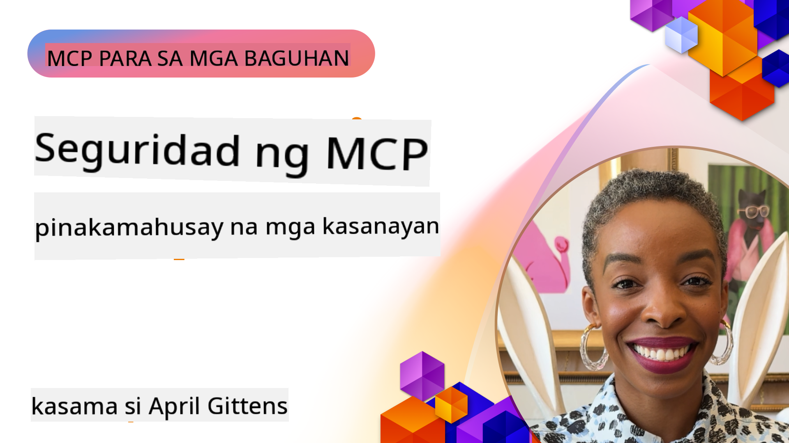

<!--
CO_OP_TRANSLATOR_METADATA:
{
  "original_hash": "1c767a35642f753127dc08545c25a290",
  "translation_date": "2025-08-18T18:19:55+00:00",
  "source_file": "02-Security/README.md",
  "language_code": "tl"
}
-->
# MCP Security: Komprehensibong Proteksyon para sa mga AI System

_(I-click ang larawan sa itaas upang panoorin ang video ng araling ito)_

Ang seguridad ay mahalaga sa disenyo ng AI system, kaya't inuuna natin ito bilang pangalawang seksyon. Ito ay naaayon sa prinsipyo ng Microsoft na **Secure by Design** mula sa [Secure Future Initiative](https://www.microsoft.com/security/blog/2025/04/17/microsofts-secure-by-design-journey-one-year-of-success/).

Ang Model Context Protocol (MCP) ay nagdadala ng makapangyarihang kakayahan sa mga AI-driven na aplikasyon ngunit nagdadala rin ng mga natatanging hamon sa seguridad na lampas sa tradisyunal na mga panganib sa software. Ang mga MCP system ay nahaharap sa parehong mga kilalang isyu sa seguridad (secure coding, least privilege, supply chain security) at mga bagong banta na partikular sa AI tulad ng prompt injection, tool poisoning, session hijacking, confused deputy attacks, token passthrough vulnerabilities, at dynamic capability modification.

Tatalakayin ng araling ito ang mga pinakamahalagang panganib sa seguridad sa mga implementasyon ng MCP—saklaw ang authentication, authorization, labis na mga pahintulot, indirect prompt injection, session security, confused deputy problems, token management, at supply chain vulnerabilities. Matututuhan mo ang mga praktikal na kontrol at pinakamahusay na mga kasanayan upang mabawasan ang mga panganib na ito habang ginagamit ang mga solusyon ng Microsoft tulad ng Prompt Shields, Azure Content Safety, at GitHub Advanced Security upang palakasin ang iyong MCP deployment.

## Mga Layunin sa Pagkatuto

Sa pagtatapos ng araling ito, magagawa mong:

- **Kilalanin ang mga Banta na Partikular sa MCP**: Tukuyin ang mga natatanging panganib sa seguridad sa mga MCP system kabilang ang prompt injection, tool poisoning, labis na mga pahintulot, session hijacking, confused deputy problems, token passthrough vulnerabilities, at mga panganib sa supply chain
- **Magpatupad ng Mga Kontrol sa Seguridad**: Maglapat ng epektibong mitigasyon kabilang ang matibay na authentication, least privilege access, secure token management, session security controls, at supply chain verification
- **Gamitin ang Microsoft Security Solutions**: Unawain at i-deploy ang Microsoft Prompt Shields, Azure Content Safety, at GitHub Advanced Security para sa proteksyon ng MCP workload
- **I-validate ang Seguridad ng Tool**: Kilalanin ang kahalagahan ng pag-validate ng metadata ng tool, pagmamanman ng mga dynamic na pagbabago, at pagtatanggol laban sa indirect prompt injection attacks
- **Isama ang Mga Pinakamahusay na Kasanayan**: Pagsamahin ang mga itinatag na pundasyon ng seguridad (secure coding, server hardening, zero trust) sa mga kontrol na partikular sa MCP para sa komprehensibong proteksyon

# Arkitektura at Mga Kontrol sa Seguridad ng MCP

Ang mga modernong implementasyon ng MCP ay nangangailangan ng layered na mga diskarte sa seguridad na tumutugon sa parehong tradisyunal na seguridad ng software at mga banta na partikular sa AI. Ang mabilis na pag-unlad ng MCP specification ay patuloy na nagpapabuti ng mga kontrol sa seguridad nito, na nagbibigay-daan sa mas mahusay na integrasyon sa mga arkitektura ng seguridad ng enterprise at mga itinatag na pinakamahusay na kasanayan.

Ayon sa pananaliksik mula sa [Microsoft Digital Defense Report](https://aka.ms/mddr), **98% ng mga naiulat na paglabag ay maiiwasan sa pamamagitan ng matibay na hygiene sa seguridad**. Ang pinaka-epektibong estratehiya sa proteksyon ay ang pagsasama ng mga pundasyon ng seguridad sa mga kontrol na partikular sa MCP—ang mga napatunayang baseline na hakbang sa seguridad ay nananatiling pinaka-epektibo sa pagbabawas ng kabuuang panganib sa seguridad.

## Kasalukuyang Kalagayan ng Seguridad

> **Note:** Ang impormasyong ito ay sumasalamin sa mga pamantayan ng seguridad ng MCP noong **Agosto 18, 2025**. Ang MCP protocol ay patuloy na mabilis na umuunlad, at ang mga hinaharap na implementasyon ay maaaring magpakilala ng mga bagong pattern ng authentication at pinahusay na mga kontrol. Palaging sumangguni sa kasalukuyang [MCP Specification](https://spec.modelcontextprotocol.io/), [MCP GitHub repository](https://github.com/modelcontextprotocol), at [security best practices documentation](https://modelcontextprotocol.io/specification/2025-06-18/basic/security_best_practices) para sa pinakabagong gabay.

### Ebolusyon ng MCP Authentication

Ang MCP specification ay malaki ang naging pagbabago sa diskarte nito sa authentication at authorization:

- **Orihinal na Diskarte**: Ang mga naunang specification ay nangangailangan ng mga developer na magpatupad ng custom authentication servers, kung saan ang mga MCP server ay kumikilos bilang OAuth 2.0 Authorization Servers na direktang namamahala sa user authentication
- **Kasalukuyang Pamantayan (2025-06-18)**: Ang na-update na specification ay nagpapahintulot sa mga MCP server na i-delegate ang authentication sa mga external identity provider (tulad ng Microsoft Entra ID), na nagpapabuti sa seguridad at nagpapababa ng pagiging kumplikado ng implementasyon
- **Transport Layer Security**: Pinahusay na suporta para sa mga secure na mekanismo ng transportasyon na may tamang mga pattern ng authentication para sa parehong lokal (STDIO) at remote (Streamable HTTP) na koneksyon

## Seguridad sa Authentication at Authorization

### Mga Hamon sa Kasalukuyang Seguridad

Ang mga modernong implementasyon ng MCP ay nahaharap sa ilang hamon sa authentication at authorization:

### Mga Panganib at Banta

- **Misconfigured Authorization Logic**: Ang maling implementasyon ng authorization sa mga MCP server ay maaaring maglantad ng sensitibong data at maling magpatupad ng mga access control
- **OAuth Token Compromise**: Ang pagnanakaw ng token mula sa lokal na MCP server ay nagbibigay-daan sa mga attacker na magpanggap bilang mga server at ma-access ang mga downstream service
- **Token Passthrough Vulnerabilities**: Ang hindi tamang paghawak ng token ay lumilikha ng mga bypass sa mga kontrol sa seguridad at mga puwang sa accountability
- **Labis na Pahintulot**: Ang mga over-privileged na MCP server ay lumalabag sa prinsipyo ng least privilege at nagpapalawak ng mga attack surface

#### Token Passthrough: Isang Kritikal na Anti-Pattern

**Ang token passthrough ay tahasang ipinagbabawal** sa kasalukuyang MCP authorization specification dahil sa matinding implikasyon sa seguridad:

##### Pag-iwas sa Mga Kontrol sa Seguridad
- Ang mga MCP server at downstream API ay nagpapatupad ng mahahalagang kontrol sa seguridad (rate limiting, request validation, traffic monitoring) na umaasa sa tamang token validation
- Ang direktang paggamit ng client-to-API token ay binabalewala ang mga mahahalagang proteksyon na ito, na nagpapahina sa arkitektura ng seguridad

##### Mga Hamon sa Accountability at Audit  
- Ang mga MCP server ay hindi makakakilala sa pagitan ng mga client na gumagamit ng upstream-issued tokens, na sinisira ang mga audit trail
- Ang mga log ng downstream resource server ay nagpapakita ng maling pinagmulan ng request sa halip na ang aktwal na mga MCP server na tagapamagitan
- Ang pagsisiyasat sa insidente at pag-audit ng pagsunod ay nagiging mas mahirap

##### Mga Panganib sa Data Exfiltration
- Ang mga hindi na-validate na token claim ay nagbibigay-daan sa mga malisyosong aktor na may ninakaw na token na gamitin ang mga MCP server bilang proxy para sa data exfiltration
- Ang mga paglabag sa trust boundary ay nagpapahintulot sa mga hindi awtorisadong pattern ng pag-access na binabalewala ang mga nilalayong kontrol sa seguridad

##### Multi-Service Attack Vectors
- Ang mga nakompromisong token na tinatanggap ng maraming serbisyo ay nagbibigay-daan sa lateral movement sa mga konektadong sistema
- Ang mga trust assumption sa pagitan ng mga serbisyo ay maaaring masira kapag ang pinagmulan ng token ay hindi ma-verify

### Mga Kontrol sa Seguridad at Mitigasyon

**Mga Kritikal na Pangangailangan sa Seguridad:**

> **MANDATORY**: Ang mga MCP server **HINDI DAPAT** tumanggap ng anumang token na hindi tahasang inisyu para sa MCP server

#### Mga Kontrol sa Authentication at Authorization

- **Masusing Pagsusuri ng Authorization**: Magsagawa ng komprehensibong audit ng authorization logic ng MCP server upang matiyak na tanging mga intended na user at client lamang ang maaaring ma-access ang sensitibong mga resource
  - **Gabay sa Implementasyon**: [Azure API Management bilang Authentication Gateway para sa MCP Servers](https://techcommunity.microsoft.com/blog/integrationsonazureblog/azure-api-management-your-auth-gateway-for-mcp-servers/4402690)
  - **Identity Integration**: [Paggamit ng Microsoft Entra ID para sa Authentication ng MCP Server](https://den.dev/blog/mcp-server-auth-entra-id-session/)

- **Secure Token Management**: Magpatupad ng [mga pinakamahusay na kasanayan ng Microsoft sa token validation at lifecycle](https://learn.microsoft.com/en-us/entra/identity-platform/access-tokens)
  - I-validate na ang mga token audience claim ay tumutugma sa identity ng MCP server
  - Magpatupad ng tamang token rotation at expiration policies
  - Pigilan ang token replay attacks at hindi awtorisadong paggamit

- **Protektadong Imbakan ng Token**: Siguraduhing naka-encrypt ang token storage parehong sa pahinga at sa transit
  - **Pinakamahusay na Kasanayan**: [Mga Alituntunin sa Secure Token Storage at Encryption](https://youtu.be/uRdX37EcCwg?si=6fSChs1G4glwXRy2)

#### Implementasyon ng Access Control

- **Prinsipyo ng Least Privilege**: Bigyan ang mga MCP server ng minimum na pahintulot na kinakailangan lamang para sa intended functionality
  - Regular na pagsusuri at pag-update ng mga pahintulot upang maiwasan ang privilege creep
  - **Dokumentasyon ng Microsoft**: [Secure Least-Privileged Access](https://learn.microsoft.com/entra/identity-platform/secure-least-privileged-access)

- **Role-Based Access Control (RBAC)**: Magpatupad ng fine-grained na role assignments
  - I-scope ang mga role nang mahigpit sa mga partikular na resource at aksyon
  - Iwasan ang malawak o hindi kinakailangang mga pahintulot na nagpapalawak ng mga attack surface

- **Patuloy na Pagsubaybay sa Pahintulot**: Magpatupad ng tuloy-tuloy na pag-audit at pagsubaybay sa access
  - Subaybayan ang mga pattern ng paggamit ng pahintulot para sa mga anomalya
  - Agad na ayusin ang labis o hindi nagagamit na mga pribilehiyo
- **Secure Session Generation**: Gumamit ng cryptographically secure, non-deterministic session IDs na ginawa gamit ang secure random number generators  
- **User-Specific Binding**: Itali ang session IDs sa user-specific na impormasyon gamit ang mga format tulad ng `<user_id>:<session_id>` upang maiwasan ang cross-user session abuse  
- **Session Lifecycle Management**: Magpatupad ng tamang expiration, rotation, at invalidation upang mabawasan ang mga vulnerability windows  
- **Transport Security**: Obligatoryong HTTPS para sa lahat ng komunikasyon upang maiwasan ang interception ng session ID  

### Confused Deputy Problem  

Ang **confused deputy problem** ay nangyayari kapag ang MCP servers ay kumikilos bilang authentication proxies sa pagitan ng mga kliyente at third-party services, na nagbubukas ng pagkakataon para sa authorization bypass gamit ang static client ID exploitation.  

#### **Attack Mechanics & Risks**  

- **Cookie-based Consent Bypass**: Ang nakaraang user authentication ay lumilikha ng consent cookies na maaaring gamitin ng mga attacker sa pamamagitan ng malicious authorization requests na may crafted redirect URIs  
- **Authorization Code Theft**: Ang umiiral na consent cookies ay maaaring magdulot sa authorization servers na laktawan ang consent screens, na nagre-redirect ng mga code sa mga endpoint na kontrolado ng attacker  
- **Unauthorized API Access**: Ang mga ninakaw na authorization codes ay nagbibigay-daan sa token exchange at user impersonation nang walang explicit na pahintulot  

#### **Mitigation Strategies**  

**Mandatory Controls:**  
- **Explicit Consent Requirements**: Ang MCP proxy servers na gumagamit ng static client IDs **DAPAT** kumuha ng user consent para sa bawat dynamically registered client  
- **OAuth 2.1 Security Implementation**: Sundin ang kasalukuyang OAuth security best practices kabilang ang PKCE (Proof Key for Code Exchange) para sa lahat ng authorization requests  
- **Strict Client Validation**: Magpatupad ng mahigpit na validation ng redirect URIs at client identifiers upang maiwasan ang exploitation  

### Token Passthrough Vulnerabilities  

Ang **Token passthrough** ay isang explicit anti-pattern kung saan ang MCP servers ay tumatanggap ng client tokens nang walang tamang validation at ipinapasa ang mga ito sa downstream APIs, na lumalabag sa MCP authorization specifications.  

#### **Security Implications**  

- **Control Circumvention**: Ang direktang paggamit ng client-to-API token ay nilalaktawan ang mahahalagang rate limiting, validation, at monitoring controls  
- **Audit Trail Corruption**: Ang mga token na inisyu upstream ay nagpapahirap sa client identification, na sumisira sa kakayahan para sa incident investigation  
- **Proxy-based Data Exfiltration**: Ang mga unvalidated tokens ay nagbibigay-daan sa mga malicious actor na gamitin ang servers bilang proxies para sa unauthorized data access  
- **Trust Boundary Violations**: Ang mga trust assumptions ng downstream services ay maaaring masira kapag ang pinagmulan ng token ay hindi ma-verify  
- **Multi-service Attack Expansion**: Ang mga compromised tokens na tinatanggap sa maraming serbisyo ay nagbibigay-daan sa lateral movement  

#### **Required Security Controls**  

**Non-negotiable Requirements:**  
- **Token Validation**: Ang MCP servers **DAPAT HINDI** tumanggap ng tokens na hindi explicit na inisyu para sa MCP server  
- **Audience Verification**: Palaging i-validate ang token audience claims na tumutugma sa identity ng MCP server  
- **Proper Token Lifecycle**: Magpatupad ng short-lived access tokens na may secure rotation practices  

## Supply Chain Security para sa AI Systems  

Ang seguridad ng supply chain ay umunlad mula sa tradisyunal na software dependencies upang saklawin ang buong AI ecosystem. Ang modernong MCP implementations ay dapat na masusing i-verify at i-monitor ang lahat ng AI-related components, dahil ang bawat isa ay nagdadala ng potensyal na vulnerabilities na maaaring mag-kompromiso sa integridad ng sistema.  

### Expanded AI Supply Chain Components  

**Tradisyunal na Software Dependencies:**  
- Open-source libraries at frameworks  
- Container images at base systems  
- Development tools at build pipelines  
- Infrastructure components at services  

**AI-Specific Supply Chain Elements:**  
- **Foundation Models**: Pre-trained models mula sa iba't ibang provider na nangangailangan ng provenance verification  
- **Embedding Services**: External vectorization at semantic search services  
- **Context Providers**: Mga data sources, knowledge bases, at document repositories  
- **Third-party APIs**: External AI services, ML pipelines, at data processing endpoints  
- **Model Artifacts**: Weights, configurations, at fine-tuned model variants  
- **Training Data Sources**: Mga datasets na ginamit para sa model training at fine-tuning  

### Comprehensive Supply Chain Security Strategy  

#### **Component Verification & Trust**  
- **Provenance Validation**: I-verify ang pinagmulan, licensing, at integridad ng lahat ng AI components bago ang integration  
- **Security Assessment**: Magsagawa ng vulnerability scans at security reviews para sa models, data sources, at AI services  
- **Reputation Analysis**: Suriin ang security track record at practices ng AI service providers  
- **Compliance Verification**: Siguraduhin na ang lahat ng components ay tumutugma sa organizational security at regulatory requirements  

#### **Secure Deployment Pipelines**  
- **Automated CI/CD Security**: Isama ang security scanning sa buong automated deployment pipelines  
- **Artifact Integrity**: Magpatupad ng cryptographic verification para sa lahat ng deployed artifacts (code, models, configurations)  
- **Staged Deployment**: Gumamit ng progressive deployment strategies na may security validation sa bawat stage  
- **Trusted Artifact Repositories**: Mag-deploy lamang mula sa verified, secure artifact registries at repositories  

#### **Continuous Monitoring & Response**  
- **Dependency Scanning**: Patuloy na vulnerability monitoring para sa lahat ng software at AI component dependencies  
- **Model Monitoring**: Patuloy na pagsusuri ng model behavior, performance drift, at security anomalies  
- **Service Health Tracking**: I-monitor ang external AI services para sa availability, security incidents, at policy changes  
- **Threat Intelligence Integration**: Isama ang threat feeds na partikular sa AI at ML security risks  

#### **Access Control & Least Privilege**  
- **Component-level Permissions**: Limitahan ang access sa models, data, at services batay sa business necessity  
- **Service Account Management**: Magpatupad ng dedicated service accounts na may minimal required permissions  
- **Network Segmentation**: Ihiwalay ang AI components at limitahan ang network access sa pagitan ng mga serbisyo  
- **API Gateway Controls**: Gumamit ng centralized API gateways upang kontrolin at i-monitor ang access sa external AI services  

#### **Incident Response & Recovery**  
- **Rapid Response Procedures**: Itinatag na proseso para sa pag-patch o pagpapalit ng compromised AI components  
- **Credential Rotation**: Automated systems para sa pag-rotate ng secrets, API keys, at service credentials  
- **Rollback Capabilities**: Kakayahang mabilis na ibalik sa nakaraang known-good versions ng AI components  
- **Supply Chain Breach Recovery**: Mga partikular na proseso para sa pagtugon sa upstream AI service compromises  

### Microsoft Security Tools & Integration  

**GitHub Advanced Security** nagbibigay ng komprehensibong proteksyon sa supply chain kabilang ang:  
- **Secret Scanning**: Automated detection ng credentials, API keys, at tokens sa repositories  
- **Dependency Scanning**: Vulnerability assessment para sa open-source dependencies at libraries  
- **CodeQL Analysis**: Static code analysis para sa security vulnerabilities at coding issues  
- **Supply Chain Insights**: Visibility sa dependency health at security status  

**Azure DevOps & Azure Repos Integration:**  
- Seamless security scanning integration sa Microsoft development platforms  
- Automated security checks sa Azure Pipelines para sa AI workloads  
- Policy enforcement para sa secure AI component deployment  

**Microsoft Internal Practices:**  
Ang Microsoft ay nagpapatupad ng malawak na supply chain security practices sa lahat ng produkto. Alamin ang mga proven approaches sa [The Journey to Secure the Software Supply Chain at Microsoft](https://devblogs.microsoft.com/engineering-at-microsoft/the-journey-to-secure-the-software-supply-chain-at-microsoft/).  

## Foundation Security Best Practices  

Ang MCP implementations ay nagmamana at bumubuo sa umiiral na security posture ng iyong organisasyon. Ang pagpapalakas ng foundational security practices ay makabuluhang nagpapahusay sa kabuuang seguridad ng AI systems at MCP deployments.  

### Core Security Fundamentals  

#### **Secure Development Practices**  
- **OWASP Compliance**: Protektahan laban sa [OWASP Top 10](https://owasp.org/www-project-top-ten/) web application vulnerabilities  
- **AI-Specific Protections**: Magpatupad ng controls para sa [OWASP Top 10 for LLMs](https://genai.owasp.org/download/43299/?tmstv=1731900559)  
- **Secure Secrets Management**: Gumamit ng dedicated vaults para sa tokens, API keys, at sensitive configuration data  
- **End-to-End Encryption**: Magpatupad ng secure communications sa lahat ng application components at data flows  
- **Input Validation**: Mahigpit na validation ng lahat ng user inputs, API parameters, at data sources  

#### **Infrastructure Hardening**  
- **Multi-Factor Authentication**: Obligatoryong MFA para sa lahat ng administrative at service accounts  
- **Patch Management**: Automated, timely patching para sa operating systems, frameworks, at dependencies  
- **Identity Provider Integration**: Centralized identity management gamit ang enterprise identity providers (Microsoft Entra ID, Active Directory)  
- **Network Segmentation**: Logical isolation ng MCP components upang limitahan ang lateral movement potential  
- **Principle of Least Privilege**: Minimal required permissions para sa lahat ng system components at accounts  

#### **Security Monitoring & Detection**  
- **Comprehensive Logging**: Detalyadong logging ng AI application activities, kabilang ang MCP client-server interactions  
- **SIEM Integration**: Centralized security information and event management para sa anomaly detection  
- **Behavioral Analytics**: AI-powered monitoring upang matukoy ang hindi pangkaraniwang patterns sa system at user behavior  
- **Threat Intelligence**: Integration ng external threat feeds at indicators of compromise (IOCs)  
- **Incident Response**: Well-defined procedures para sa security incident detection, response, at recovery  

#### **Zero Trust Architecture**  
- **Never Trust, Always Verify**: Patuloy na verification ng users, devices, at network connections  
- **Micro-Segmentation**: Granular network controls na nag-i-isolate sa bawat workload at serbisyo  
- **Identity-Centric Security**: Security policies batay sa verified identities sa halip na network location  
- **Continuous Risk Assessment**: Dynamic security posture evaluation batay sa kasalukuyang context at behavior  
- **Conditional Access**: Access controls na umaangkop batay sa risk factors, lokasyon, at device trust  

### Enterprise Integration Patterns  

#### **Microsoft Security Ecosystem Integration**  
- **Microsoft Defender for Cloud**: Comprehensive cloud security posture management  
- **Azure Sentinel**: Cloud-native SIEM at SOAR capabilities para sa AI workload protection  
- **Microsoft Entra ID**: Enterprise identity at access management na may conditional access policies  
- **Azure Key Vault**: Centralized secrets management na may hardware security module (HSM) backing  
- **Microsoft Purview**: Data governance at compliance para sa AI data sources at workflows  

#### **Compliance & Governance**  
- **Regulatory Alignment**: Siguraduhin na ang MCP implementations ay tumutugma sa industry-specific compliance requirements (GDPR, HIPAA, SOC 2)  
- **Data Classification**: Tamang categorization at handling ng sensitive data na pinoproseso ng AI systems  
- **Audit Trails**: Komprehensibong logging para sa regulatory compliance at forensic investigation  
- **Privacy Controls**: Pagpapatupad ng privacy-by-design principles sa AI system architecture  
- **Change Management**: Pormal na proseso para sa security reviews ng AI system modifications  

Ang mga foundational practices na ito ay lumilikha ng matibay na security baseline na nagpapahusay sa bisa ng MCP-specific security controls at nagbibigay ng komprehensibong proteksyon para sa AI-driven applications.  

## Key Security Takeaways  

- **Layered Security Approach**: Pagsamahin ang foundational security practices (secure coding, least privilege, supply chain verification, continuous monitoring) sa AI-specific controls para sa komprehensibong proteksyon  

- **AI-Specific Threat Landscape**: Ang MCP systems ay humaharap sa natatanging panganib kabilang ang prompt injection, tool poisoning, session hijacking, confused deputy problems, token passthrough vulnerabilities, at excessive permissions na nangangailangan ng specialized mitigations  

- **Authentication & Authorization Excellence**: Magpatupad ng matibay na authentication gamit ang external identity providers (Microsoft Entra ID), ipatupad ang tamang token validation, at huwag kailanman tanggapin ang tokens na hindi explicit na inisyu para sa iyong MCP server  

- **AI Attack Prevention**: I-deploy ang Microsoft Prompt Shields at Azure Content Safety upang ipagtanggol laban sa indirect prompt injection at tool poisoning attacks, habang nagva-validate ng tool metadata at nagmo-monitor para sa dynamic changes  

- **Session & Transport Security**: Gumamit ng cryptographically secure, non-deterministic session IDs na nakatali sa user identities, magpatupad ng tamang session lifecycle management, at huwag kailanman gamitin ang sessions para sa authentication  

- **OAuth Security Best Practices**: Iwasan ang confused deputy attacks sa pamamagitan ng explicit user consent para sa dynamically registered clients, tamang OAuth 2.1 implementation na may PKCE, at mahigpit na redirect URI validation  

- **Token Security Principles**: Iwasan ang token passthrough anti-patterns, i-validate ang token audience claims, magpatupad ng short-lived tokens na may secure rotation, at panatilihin ang malinaw na trust boundaries  

- **Comprehensive Supply Chain Security**: Tratuhin ang lahat ng AI ecosystem components (models, embeddings, context providers, external APIs) na may parehong security rigor tulad ng tradisyunal na software dependencies  

- **Continuous Evolution**: Manatiling updated sa mabilis na pag-unlad ng MCP specifications, mag-ambag sa security community standards, at panatilihin ang adaptive security postures habang ang protocol ay nag-mature  

- **Microsoft Security Integration**: Gamitin ang komprehensibong security ecosystem ng Microsoft (Prompt Shields, Azure Content Safety, GitHub Advanced Security, Entra ID) para sa mas pinahusay na MCP deployment protection  

## Comprehensive Resources  

### **Official MCP Security Documentation**  
- [MCP Specification (Current: 2025-06-18)](https://spec.modelcontextprotocol.io/specification/2025-06-18/)  
- [MCP Security Best Practices](https://modelcontextprotocol.io/specification/2025-06-18/basic/security_best_practices)  
- [MCP Authorization Specification](https://modelcontextprotocol.io/specification/2025-06-18/basic/authorization)  
- [MCP GitHub Repository](https://github.com/modelcontextprotocol)  

### **Security Standards & Best Practices**  
- [OAuth 2.0 Security Best Practices (RFC 9700)](https://datatracker.ietf.org/doc/html/rfc9700)  
- [OWASP Top 10 Web Application Security](https://owasp.org/www-project-top-ten/)  
- [OWASP Top 10 for Large Language Models](https://genai.owasp.org/download/43299/?tmstv=1731900559)  
- [Microsoft Digital Defense Report](https://aka.ms/mddr)  

### **AI Security Research & Analysis**  
- [Prompt Injection in MCP (Simon Willison)](https://simonwillison.net/2025/Apr/9/mcp-prompt-injection/)  
- [Tool Poisoning Attacks (Invariant Labs)](https://invariantlabs.ai/blog/mcp-security-notification-tool-poisoning-attacks)  
- [MCP Security Research Briefing (Wiz Security)](https://www.wiz.io/blog/mcp-security-research-briefing#remote-servers-22)  
### **Microsoft Security Solutions**
- [Microsoft Prompt Shields Documentation](https://learn.microsoft.com/azure/ai-services/content-safety/concepts/jailbreak-detection)
- [Azure Content Safety Service](https://learn.microsoft.com/azure/ai-services/content-safety/)
- [Microsoft Entra ID Security](https://learn.microsoft.com/entra/identity-platform/secure-least-privileged-access)
- [Azure Token Management Best Practices](https://learn.microsoft.com/entra/identity-platform/access-tokens)
- [GitHub Advanced Security](https://github.com/security/advanced-security)

### **Mga Gabay sa Implementasyon at Tutorial**
- [Azure API Management bilang MCP Authentication Gateway](https://techcommunity.microsoft.com/blog/integrationsonazureblog/azure-api-management-your-auth-gateway-for-mcp-servers/4402690)
- [Microsoft Entra ID Authentication gamit ang MCP Servers](https://den.dev/blog/mcp-server-auth-entra-id-session/)
- [Secure Token Storage and Encryption (Video)](https://youtu.be/uRdX37EcCwg?si=6fSChs1G4glwXRy2)

### **DevOps at Seguridad ng Supply Chain**
- [Azure DevOps Security](https://azure.microsoft.com/products/devops)
- [Azure Repos Security](https://azure.microsoft.com/products/devops/repos/)
- [Microsoft Supply Chain Security Journey](https://devblogs.microsoft.com/engineering-at-microsoft/the-journey-to-secure-the-software-supply-chain-at-microsoft/)

## **Karagdagang Dokumentasyon sa Seguridad**

Para sa mas detalyadong gabay sa seguridad, tingnan ang mga espesyal na dokumento sa seksyong ito:

- **[MCP Security Best Practices 2025](./mcp-security-best-practices-2025.md)** - Kumpletong mga pinakamahusay na kasanayan sa seguridad para sa mga implementasyon ng MCP  
- **[Azure Content Safety Implementation](./azure-content-safety-implementation.md)** - Mga praktikal na halimbawa ng implementasyon para sa integrasyon ng Azure Content Safety  
- **[MCP Security Controls 2025](./mcp-security-controls-2025.md)** - Pinakabagong mga kontrol at teknolohiya sa seguridad para sa mga deployment ng MCP  
- **[MCP Best Practices Quick Reference](./mcp-best-practices.md)** - Mabilisang gabay sa mahahalagang kasanayan sa seguridad ng MCP  

---

## Ano ang Susunod

Susunod: [Kabanata 3: Pagsisimula](../03-GettingStarted/README.md)

**Paunawa**:  
Ang dokumentong ito ay isinalin gamit ang AI translation service na [Co-op Translator](https://github.com/Azure/co-op-translator). Bagama't sinisikap naming maging tumpak, pakitandaan na ang mga awtomatikong pagsasalin ay maaaring maglaman ng mga pagkakamali o hindi pagkakatugma. Ang orihinal na dokumento sa kanyang orihinal na wika ang dapat ituring na opisyal na sanggunian. Para sa mahalagang impormasyon, inirerekomenda ang propesyonal na pagsasalin ng tao. Hindi kami mananagot sa anumang hindi pagkakaunawaan o maling interpretasyon na maaaring magmula sa paggamit ng pagsasaling ito.