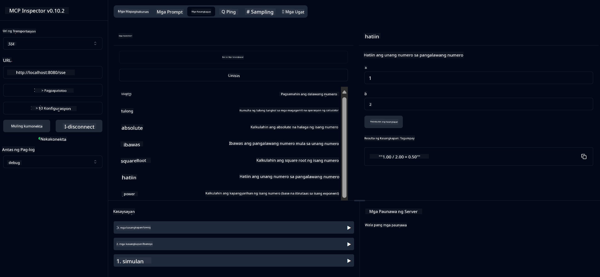
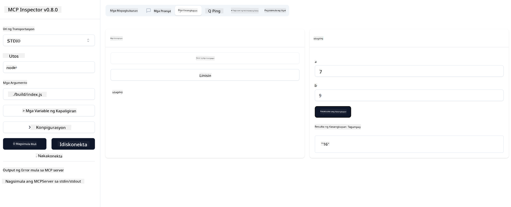

<!--
CO_OP_TRANSLATOR_METADATA:
{
  "original_hash": "ec11ee93f31fdadd94facd3e3d22f9e6",
  "translation_date": "2025-09-09T22:06:05+00:00",
  "source_file": "03-GettingStarted/01-first-server/README.md",
  "language_code": "tl"
}
-->
# Pagsisimula sa MCP

Maligayang pagdating sa iyong unang hakbang sa Model Context Protocol (MCP)! Kung bago ka sa MCP o nais mong palalimin ang iyong kaalaman, ang gabay na ito ay magbibigay sa iyo ng mga mahahalagang hakbang sa pag-set up at proseso ng pag-develop. Matutuklasan mo kung paano pinapadali ng MCP ang integrasyon sa pagitan ng mga AI model at mga aplikasyon, at matututunan mo kung paano mabilis na ihanda ang iyong kapaligiran para sa paggawa at pagsubok ng mga solusyong pinapagana ng MCP.

> TLDR; Kung gumagawa ka ng AI apps, alam mo na maaari kang magdagdag ng mga tool at iba pang resources sa iyong LLM (large language model) upang gawing mas matalino ang LLM. Gayunpaman, kung ilalagay mo ang mga tool at resources na iyon sa isang server, ang app at ang kakayahan ng server ay maaaring magamit ng anumang client na may/wala mang LLM.

## Pangkalahatang-ideya

Ang araling ito ay nagbibigay ng praktikal na gabay sa pag-set up ng mga MCP environment at paggawa ng iyong unang MCP application. Matututunan mo kung paano i-set up ang mga kinakailangang tool at framework, bumuo ng mga pangunahing MCP server, lumikha ng mga host application, at subukan ang iyong mga implementasyon.

Ang Model Context Protocol (MCP) ay isang open protocol na nag-i-standardize kung paano nagbibigay ng context ang mga aplikasyon sa LLMs. Isipin ang MCP na parang USB-C port para sa mga AI application - nagbibigay ito ng standardized na paraan upang ikonekta ang mga AI model sa iba't ibang data sources at tools.

## Mga Layunin sa Pag-aaral

Sa pagtatapos ng araling ito, magagawa mo ang sumusunod:

- Mag-set up ng development environment para sa MCP gamit ang C#, Java, Python, TypeScript, at Rust
- Bumuo at mag-deploy ng mga pangunahing MCP server na may custom na features (resources, prompts, at tools)
- Lumikha ng mga host application na kumokonekta sa MCP servers
- Subukan at i-debug ang mga implementasyon ng MCP

## Pag-set Up ng Iyong MCP Environment

Bago ka magsimulang magtrabaho sa MCP, mahalagang ihanda ang iyong development environment at maunawaan ang pangunahing workflow. Ang seksyong ito ay gagabay sa iyo sa mga paunang hakbang sa pag-set up upang masigurado ang maayos na pagsisimula sa MCP.

### Mga Kinakailangan

Bago sumabak sa MCP development, tiyakin na mayroon ka ng mga sumusunod:

- **Development Environment**: Para sa napiling programming language (C#, Java, Python, TypeScript, o Rust)
- **IDE/Editor**: Visual Studio, Visual Studio Code, IntelliJ, Eclipse, PyCharm, o anumang modernong code editor
- **Package Managers**: NuGet, Maven/Gradle, pip, npm/yarn, o Cargo
- **API Keys**: Para sa anumang AI services na balak mong gamitin sa iyong host applications

## Pangunahing Estruktura ng MCP Server

Ang isang MCP server ay karaniwang binubuo ng:

- **Server Configuration**: Pag-set up ng port, authentication, at iba pang settings
- **Resources**: Data at context na magagamit ng LLMs
- **Tools**: Mga functionality na maaaring i-invoke ng mga model
- **Prompts**: Mga template para sa pagbuo o pag-istruktura ng text

Narito ang isang simpleng halimbawa sa TypeScript:

```typescript
import { McpServer, ResourceTemplate } from "@modelcontextprotocol/sdk/server/mcp.js";
import { StdioServerTransport } from "@modelcontextprotocol/sdk/server/stdio.js";
import { z } from "zod";

// Create an MCP server
const server = new McpServer({
  name: "Demo",
  version: "1.0.0"
});

// Add an addition tool
server.tool("add",
  { a: z.number(), b: z.number() },
  async ({ a, b }) => ({
    content: [{ type: "text", text: String(a + b) }]
  })
);

// Add a dynamic greeting resource
server.resource(
  "file",
  // The 'list' parameter controls how the resource lists available files. Setting it to undefined disables listing for this resource.
  new ResourceTemplate("file://{path}", { list: undefined }),
  async (uri, { path }) => ({
    contents: [{
      uri: uri.href,
      text: `File, ${path}!`
    }]
  })
);

// Add a file resource that reads the file contents
server.resource(
  "file",
  new ResourceTemplate("file://{path}", { list: undefined }),
  async (uri, { path }) => {
    let text;
    try {
      text = await fs.readFile(path, "utf8");
    } catch (err) {
      text = `Error reading file: ${err.message}`;
    }
    return {
      contents: [{
        uri: uri.href,
        text
      }]
    };
  }
);

server.prompt(
  "review-code",
  { code: z.string() },
  ({ code }) => ({
    messages: [{
      role: "user",
      content: {
        type: "text",
        text: `Please review this code:\n\n${code}`
      }
    }]
  })
);

// Start receiving messages on stdin and sending messages on stdout
const transport = new StdioServerTransport();
await server.connect(transport);
```

Sa code na ito:

- Ini-import ang mga kinakailangang klase mula sa MCP TypeScript SDK.
- Gumagawa at nagko-configure ng bagong MCP server instance.
- Nire-register ang isang custom tool (`calculator`) na may handler function.
- Sinisimulan ang server upang makinig sa mga incoming MCP requests.

## Pagsubok at Pag-debug

Bago ka magsimulang mag-test ng iyong MCP server, mahalagang maunawaan ang mga available na tools at best practices para sa pag-debug. Ang epektibong pagsubok ay nagsisiguro na ang iyong server ay gumagana nang inaasahan at tumutulong sa mabilis na pagtukoy at pagresolba ng mga isyu. Ang sumusunod na seksyon ay naglalahad ng mga rekomendadong paraan para sa pag-validate ng iyong MCP implementation.

Nagbibigay ang MCP ng mga tools para sa pagsubok at pag-debug ng iyong mga server:

- **Inspector tool**, isang graphical interface na nagbibigay-daan sa iyo na kumonekta sa iyong server at subukan ang iyong mga tools, prompts, at resources.
- **curl**, maaari ka ring kumonekta sa iyong server gamit ang command line tool tulad ng curl o iba pang clients na maaaring gumawa at magpatakbo ng HTTP commands.

### Paggamit ng MCP Inspector

Ang [MCP Inspector](https://github.com/modelcontextprotocol/inspector) ay isang visual testing tool na tumutulong sa iyo na:

1. **Tuklasin ang Kakayahan ng Server**: Awtomatikong matukoy ang mga available na resources, tools, at prompts
2. **Subukan ang Tool Execution**: Subukan ang iba't ibang parameters at makita ang mga response nang real-time
3. **Tingnan ang Metadata ng Server**: Suriin ang impormasyon ng server, schemas, at configurations

```bash
# ex TypeScript, installing and running MCP Inspector
npx @modelcontextprotocol/inspector node build/index.js
```

Kapag pinatakbo mo ang mga command sa itaas, maglulunsad ang MCP Inspector ng lokal na web interface sa iyong browser. Makikita mo ang isang dashboard na nagpapakita ng iyong mga nakarehistrong MCP server, ang kanilang mga available na tools, resources, at prompts. Ang interface ay nagbibigay-daan sa iyo na interaktibong subukan ang tool execution, suriin ang metadata ng server, at makita ang mga real-time na response, na nagpapadali sa pag-validate at pag-debug ng iyong mga implementasyon ng MCP server.

Narito ang isang screenshot kung ano ang maaaring hitsura nito:


## Karaniwang Isyu sa Setup at Mga Solusyon

| Isyu | Posibleng Solusyon |
|------|--------------------|
| Connection refused | Tiyakin na ang server ay tumatakbo at tama ang port |
| Tool execution errors | Suriin ang parameter validation at error handling |
| Authentication failures | I-verify ang API keys at permissions |
| Schema validation errors | Siguraduhing tugma ang mga parameters sa defined schema |
| Server not starting | Suriin ang port conflicts o nawawalang dependencies |
| CORS errors | I-configure ang tamang CORS headers para sa cross-origin requests |
| Authentication issues | I-verify ang validity ng token at permissions |

## Lokal na Pag-develop

Para sa lokal na pag-develop at pagsubok, maaari mong patakbuhin ang MCP servers nang direkta sa iyong makina:

1. **Simulan ang server process**: Patakbuhin ang iyong MCP server application
2. **I-configure ang networking**: Siguraduhin na ang server ay accessible sa inaasahang port
3. **Ikonekta ang mga client**: Gumamit ng lokal na connection URLs tulad ng `http://localhost:3000`

```bash
# Example: Running a TypeScript MCP server locally
npm run start
# Server running at http://localhost:3000
```

## Paggawa ng Iyong Unang MCP Server

Napag-usapan na natin ang [Core concepts](/01-CoreConcepts/README.md) sa nakaraang aralin, ngayon ay oras na upang gamitin ang kaalamang iyon.

### Ano ang magagawa ng server

Bago tayo magsimulang magsulat ng code, balikan natin kung ano ang magagawa ng isang server:

Ang isang MCP server ay maaaring:

- Mag-access ng mga lokal na file at database
- Kumonekta sa mga remote APIs
- Mag-perform ng computations
- Mag-integrate sa iba pang tools at services
- Magbigay ng user interface para sa interaksyon

Magaling, ngayon na alam na natin kung ano ang magagawa nito, simulan na natin ang pag-code.

## Ehersisyo: Paggawa ng server

Upang makagawa ng server, sundin ang mga hakbang na ito:

- I-install ang MCP SDK.
- Gumawa ng proyekto at i-set up ang istruktura ng proyekto.
- Isulat ang server code.
- Subukan ang server.

### -1- Gumawa ng proyekto

#### TypeScript

```sh
# Create project directory and initialize npm project
mkdir calculator-server
cd calculator-server
npm init -y
```

#### Python

```sh
# Create project dir
mkdir calculator-server
cd calculator-server
# Open the folder in Visual Studio Code - Skip this if you are using a different IDE
code .
```

#### .NET

```sh
dotnet new console -n McpCalculatorServer
cd McpCalculatorServer
```

#### Java

Para sa Java, gumawa ng Spring Boot project:

```bash
curl https://start.spring.io/starter.zip \
  -d dependencies=web \
  -d javaVersion=21 \
  -d type=maven-project \
  -d groupId=com.example \
  -d artifactId=calculator-server \
  -d name=McpServer \
  -d packageName=com.microsoft.mcp.sample.server \
  -o calculator-server.zip
```

I-extract ang zip file:

```bash
unzip calculator-server.zip -d calculator-server
cd calculator-server
# optional remove the unused test
rm -rf src/test/java
```

Idagdag ang kumpletong configuration sa iyong *pom.xml* file:

```xml
<?xml version="1.0" encoding="UTF-8"?>
<project xmlns="http://maven.apache.org/POM/4.0.0"
    xmlns:xsi="http://www.w3.org/2001/XMLSchema-instance"
    xsi:schemaLocation="http://maven.apache.org/POM/4.0.0 http://maven.apache.org/xsd/maven-4.0.0.xsd">
    <modelVersion>4.0.0</modelVersion>
    
    <!-- Spring Boot parent for dependency management -->
    <parent>
        <groupId>org.springframework.boot</groupId>
        <artifactId>spring-boot-starter-parent</artifactId>
        <version>3.5.0</version>
        <relativePath />
    </parent>

    <!-- Project coordinates -->
    <groupId>com.example</groupId>
    <artifactId>calculator-server</artifactId>
    <version>0.0.1-SNAPSHOT</version>
    <name>Calculator Server</name>
    <description>Basic calculator MCP service for beginners</description>

    <!-- Properties -->
    <properties>
        <java.version>21</java.version>
        <maven.compiler.source>21</maven.compiler.source>
        <maven.compiler.target>21</maven.compiler.target>
    </properties>

    <!-- Spring AI BOM for version management -->
    <dependencyManagement>
        <dependencies>
            <dependency>
                <groupId>org.springframework.ai</groupId>
                <artifactId>spring-ai-bom</artifactId>
                <version>1.0.0-SNAPSHOT</version>
                <type>pom</type>
                <scope>import</scope>
            </dependency>
        </dependencies>
    </dependencyManagement>

    <!-- Dependencies -->
    <dependencies>
        <dependency>
            <groupId>org.springframework.ai</groupId>
            <artifactId>spring-ai-starter-mcp-server-webflux</artifactId>
        </dependency>
        <dependency>
            <groupId>org.springframework.boot</groupId>
            <artifactId>spring-boot-starter-actuator</artifactId>
        </dependency>
        <dependency>
         <groupId>org.springframework.boot</groupId>
         <artifactId>spring-boot-starter-test</artifactId>
         <scope>test</scope>
      </dependency>
    </dependencies>

    <!-- Build configuration -->
    <build>
        <plugins>
            <plugin>
                <groupId>org.springframework.boot</groupId>
                <artifactId>spring-boot-maven-plugin</artifactId>
            </plugin>
            <plugin>
                <groupId>org.apache.maven.plugins</groupId>
                <artifactId>maven-compiler-plugin</artifactId>
                <configuration>
                    <release>21</release>
                </configuration>
            </plugin>
        </plugins>
    </build>

    <!-- Repositories for Spring AI snapshots -->
    <repositories>
        <repository>
            <id>spring-milestones</id>
            <name>Spring Milestones</name>
            <url>https://repo.spring.io/milestone</url>
            <snapshots>
                <enabled>false</enabled>
            </snapshots>
        </repository>
        <repository>
            <id>spring-snapshots</id>
            <name>Spring Snapshots</name>
            <url>https://repo.spring.io/snapshot</url>
            <releases>
                <enabled>false</enabled>
            </releases>
        </repository>
    </repositories>
</project>
```

#### Rust

```sh
mkdir calculator-server
cd calculator-server
cargo init
```

### -2- Magdagdag ng dependencies

Ngayon na nagawa mo na ang iyong proyekto, magdagdag ng dependencies:

#### TypeScript

```sh
# If not already installed, install TypeScript globally
npm install typescript -g

# Install the MCP SDK and Zod for schema validation
npm install @modelcontextprotocol/sdk zod
npm install -D @types/node typescript
```

#### Python

```sh
# Create a virtual env and install dependencies
python -m venv venv
venv\Scripts\activate
pip install "mcp[cli]"
```

#### Java

```bash
cd calculator-server
./mvnw clean install -DskipTests
```

#### Rust

```sh
cargo add rmcp --features server,transport-io
cargo add serde
cargo add tokio --features rt-multi-thread
```

### -3- Gumawa ng mga file ng proyekto

#### TypeScript

Buksan ang *package.json* file at palitan ang nilalaman nito upang masigurado na maaari mong i-build at patakbuhin ang server:

```json
{
  "name": "calculator-server",
  "version": "1.0.0",
  "main": "index.js",
  "type": "module",
  "scripts": {
    "start": "tsc && node ./build/index.js",
    "build": "tsc && node ./build/index.js"
  },
  "keywords": [],
  "author": "",
  "license": "ISC",
  "description": "A simple calculator server using Model Context Protocol",
  "dependencies": {
    "@modelcontextprotocol/sdk": "^1.16.0",
    "zod": "^3.25.76"
  },
  "devDependencies": {
    "@types/node": "^24.0.14",
    "typescript": "^5.8.3"
  }
}
```

Gumawa ng *tsconfig.json* na may ganitong nilalaman:

```json
{
  "compilerOptions": {
    "target": "ES2022",
    "module": "Node16",
    "moduleResolution": "Node16",
    "outDir": "./build",
    "rootDir": "./src",
    "strict": true,
    "esModuleInterop": true,
    "skipLibCheck": true,
    "forceConsistentCasingInFileNames": true
  },
  "include": ["src/**/*"],
  "exclude": ["node_modules"]
}
```

Gumawa ng direktoryo para sa iyong source code:

```sh
mkdir src
touch src/index.ts
```

#### Python

Gumawa ng file na *server.py*

```sh
touch server.py
```

#### .NET

I-install ang mga kinakailangang NuGet packages:

```sh
dotnet add package ModelContextProtocol --prerelease
dotnet add package Microsoft.Extensions.Hosting
```

#### Java

Para sa mga Java Spring Boot projects, awtomatikong nalilikha ang istruktura ng proyekto.

#### Rust

Para sa Rust, awtomatikong nalilikha ang *src/main.rs* file kapag pinatakbo mo ang `cargo init`. Buksan ang file at tanggalin ang default na code.

### -4- Gumawa ng server code

#### TypeScript

Gumawa ng file na *index.ts* at idagdag ang sumusunod na code:

```typescript
import { McpServer, ResourceTemplate } from "@modelcontextprotocol/sdk/server/mcp.js";
import { StdioServerTransport } from "@modelcontextprotocol/sdk/server/stdio.js";
import { z } from "zod";
 
// Create an MCP server
const server = new McpServer({
  name: "Calculator MCP Server",
  version: "1.0.0"
});
```

Ngayon mayroon ka nang server, ngunit hindi pa ito gumagawa ng marami. Ayusin natin ito.

#### Python

```python
# server.py
from mcp.server.fastmcp import FastMCP

# Create an MCP server
mcp = FastMCP("Demo")
```

#### .NET

```csharp
using Microsoft.Extensions.DependencyInjection;
using Microsoft.Extensions.Hosting;
using Microsoft.Extensions.Logging;
using ModelContextProtocol.Server;
using System.ComponentModel;

var builder = Host.CreateApplicationBuilder(args);
builder.Logging.AddConsole(consoleLogOptions =>
{
    // Configure all logs to go to stderr
    consoleLogOptions.LogToStandardErrorThreshold = LogLevel.Trace;
});

builder.Services
    .AddMcpServer()
    .WithStdioServerTransport()
    .WithToolsFromAssembly();
await builder.Build().RunAsync();

// add features
```

#### Java

Para sa Java, gumawa ng mga core server components. Una, i-modify ang main application class:

*src/main/java/com/microsoft/mcp/sample/server/McpServerApplication.java*:

```java
package com.microsoft.mcp.sample.server;

import org.springframework.ai.tool.ToolCallbackProvider;
import org.springframework.ai.tool.method.MethodToolCallbackProvider;
import org.springframework.boot.SpringApplication;
import org.springframework.boot.autoconfigure.SpringBootApplication;
import org.springframework.context.annotation.Bean;
import com.microsoft.mcp.sample.server.service.CalculatorService;

@SpringBootApplication
public class McpServerApplication {

    public static void main(String[] args) {
        SpringApplication.run(McpServerApplication.class, args);
    }
    
    @Bean
    public ToolCallbackProvider calculatorTools(CalculatorService calculator) {
        return MethodToolCallbackProvider.builder().toolObjects(calculator).build();
    }
}
```

Gumawa ng calculator service *src/main/java/com/microsoft/mcp/sample/server/service/CalculatorService.java*:

```java
package com.microsoft.mcp.sample.server.service;

import org.springframework.ai.tool.annotation.Tool;
import org.springframework.stereotype.Service;

/**
 * Service for basic calculator operations.
 * This service provides simple calculator functionality through MCP.
 */
@Service
public class CalculatorService {

    /**
     * Add two numbers
     * @param a The first number
     * @param b The second number
     * @return The sum of the two numbers
     */
    @Tool(description = "Add two numbers together")
    public String add(double a, double b) {
        double result = a + b;
        return formatResult(a, "+", b, result);
    }

    /**
     * Subtract one number from another
     * @param a The number to subtract from
     * @param b The number to subtract
     * @return The result of the subtraction
     */
    @Tool(description = "Subtract the second number from the first number")
    public String subtract(double a, double b) {
        double result = a - b;
        return formatResult(a, "-", b, result);
    }

    /**
     * Multiply two numbers
     * @param a The first number
     * @param b The second number
     * @return The product of the two numbers
     */
    @Tool(description = "Multiply two numbers together")
    public String multiply(double a, double b) {
        double result = a * b;
        return formatResult(a, "*", b, result);
    }

    /**
     * Divide one number by another
     * @param a The numerator
     * @param b The denominator
     * @return The result of the division
     */
    @Tool(description = "Divide the first number by the second number")
    public String divide(double a, double b) {
        if (b == 0) {
            return "Error: Cannot divide by zero";
        }
        double result = a / b;
        return formatResult(a, "/", b, result);
    }

    /**
     * Calculate the power of a number
     * @param base The base number
     * @param exponent The exponent
     * @return The result of raising the base to the exponent
     */
    @Tool(description = "Calculate the power of a number (base raised to an exponent)")
    public String power(double base, double exponent) {
        double result = Math.pow(base, exponent);
        return formatResult(base, "^", exponent, result);
    }

    /**
     * Calculate the square root of a number
     * @param number The number to find the square root of
     * @return The square root of the number
     */
    @Tool(description = "Calculate the square root of a number")
    public String squareRoot(double number) {
        if (number < 0) {
            return "Error: Cannot calculate square root of a negative number";
        }
        double result = Math.sqrt(number);
        return String.format("√%.2f = %.2f", number, result);
    }

    /**
     * Calculate the modulus (remainder) of division
     * @param a The dividend
     * @param b The divisor
     * @return The remainder of the division
     */
    @Tool(description = "Calculate the remainder when one number is divided by another")
    public String modulus(double a, double b) {
        if (b == 0) {
            return "Error: Cannot divide by zero";
        }
        double result = a % b;
        return formatResult(a, "%", b, result);
    }

    /**
     * Calculate the absolute value of a number
     * @param number The number to find the absolute value of
     * @return The absolute value of the number
     */
    @Tool(description = "Calculate the absolute value of a number")
    public String absolute(double number) {
        double result = Math.abs(number);
        return String.format("|%.2f| = %.2f", number, result);
    }

    /**
     * Get help about available calculator operations
     * @return Information about available operations
     */
    @Tool(description = "Get help about available calculator operations")
    public String help() {
        return "Basic Calculator MCP Service\n\n" +
               "Available operations:\n" +
               "1. add(a, b) - Adds two numbers\n" +
               "2. subtract(a, b) - Subtracts the second number from the first\n" +
               "3. multiply(a, b) - Multiplies two numbers\n" +
               "4. divide(a, b) - Divides the first number by the second\n" +
               "5. power(base, exponent) - Raises a number to a power\n" +
               "6. squareRoot(number) - Calculates the square root\n" + 
               "7. modulus(a, b) - Calculates the remainder of division\n" +
               "8. absolute(number) - Calculates the absolute value\n\n" +
               "Example usage: add(5, 3) will return 5 + 3 = 8";
    }

    /**
     * Format the result of a calculation
     */
    private String formatResult(double a, String operator, double b, double result) {
        return String.format("%.2f %s %.2f = %.2f", a, operator, b, result);
    }
}
```

**Opsyonal na mga component para sa production-ready service:**

Gumawa ng startup configuration *src/main/java/com/microsoft/mcp/sample/server/config/StartupConfig.java*:

```java
package com.microsoft.mcp.sample.server.config;

import org.springframework.boot.CommandLineRunner;
import org.springframework.context.annotation.Bean;
import org.springframework.context.annotation.Configuration;

@Configuration
public class StartupConfig {
    
    @Bean
    public CommandLineRunner startupInfo() {
        return args -> {
            System.out.println("\n" + "=".repeat(60));
            System.out.println("Calculator MCP Server is starting...");
            System.out.println("SSE endpoint: http://localhost:8080/sse");
            System.out.println("Health check: http://localhost:8080/actuator/health");
            System.out.println("=".repeat(60) + "\n");
        };
    }
}
```

Gumawa ng health controller *src/main/java/com/microsoft/mcp/sample/server/controller/HealthController.java*:

```java
package com.microsoft.mcp.sample.server.controller;

import org.springframework.http.ResponseEntity;
import org.springframework.web.bind.annotation.GetMapping;
import org.springframework.web.bind.annotation.RestController;
import java.time.LocalDateTime;
import java.util.HashMap;
import java.util.Map;

@RestController
public class HealthController {
    
    @GetMapping("/health")
    public ResponseEntity<Map<String, Object>> healthCheck() {
        Map<String, Object> response = new HashMap<>();
        response.put("status", "UP");
        response.put("timestamp", LocalDateTime.now().toString());
        response.put("service", "Calculator MCP Server");
        return ResponseEntity.ok(response);
    }
}
```

Gumawa ng exception handler *src/main/java/com/microsoft/mcp/sample/server/exception/GlobalExceptionHandler.java*:

```java
package com.microsoft.mcp.sample.server.exception;

import org.springframework.http.HttpStatus;
import org.springframework.http.ResponseEntity;
import org.springframework.web.bind.annotation.ExceptionHandler;
import org.springframework.web.bind.annotation.RestControllerAdvice;

@RestControllerAdvice
public class GlobalExceptionHandler {

    @ExceptionHandler(IllegalArgumentException.class)
    public ResponseEntity<ErrorResponse> handleIllegalArgumentException(IllegalArgumentException ex) {
        ErrorResponse error = new ErrorResponse(
            "Invalid_Input", 
            "Invalid input parameter: " + ex.getMessage());
        return new ResponseEntity<>(error, HttpStatus.BAD_REQUEST);
    }

    public static class ErrorResponse {
        private String code;
        private String message;

        public ErrorResponse(String code, String message) {
            this.code = code;
            this.message = message;
        }

        // Getters
        public String getCode() { return code; }
        public String getMessage() { return message; }
    }
}
```

Gumawa ng custom banner *src/main/resources/banner.txt*:

```text
_____      _            _       _             
 / ____|    | |          | |     | |            
| |     __ _| | ___ _   _| | __ _| |_ ___  _ __ 
| |    / _` | |/ __| | | | |/ _` | __/ _ \| '__|
| |___| (_| | | (__| |_| | | (_| | || (_) | |   
 \_____\__,_|_|\___|\__,_|_|\__,_|\__\___/|_|   
                                                
Calculator MCP Server v1.0
Spring Boot MCP Application
```

#### Rust

Idagdag ang sumusunod na code sa itaas ng *src/main.rs* file. Ini-import nito ang mga kinakailangang libraries at modules para sa iyong MCP server.

```rust
use rmcp::{
    handler::server::{router::tool::ToolRouter, tool::Parameters},
    model::{ServerCapabilities, ServerInfo},
    schemars, tool, tool_handler, tool_router,
    transport::stdio,
    ServerHandler, ServiceExt,
};
use std::error::Error;
```

Ang calculator server ay magiging simple lamang na maaaring magdagdag ng dalawang numero. Gumawa ng struct para i-represent ang calculator request.

```rust
#[derive(Debug, serde::Deserialize, schemars::JsonSchema)]
pub struct CalculatorRequest {
    pub a: f64,
    pub b: f64,
}
```

Susunod, gumawa ng struct para i-represent ang calculator server. Ang struct na ito ay maglalaman ng tool router, na ginagamit para mag-register ng tools.

```rust
#[derive(Debug, Clone)]
pub struct Calculator {
    tool_router: ToolRouter<Self>,
}
```

Ngayon, maaari nating i-implement ang `Calculator` struct upang gumawa ng bagong instance ng server at i-implement ang server handler para magbigay ng impormasyon tungkol sa server.

```rust
#[tool_router]
impl Calculator {
    pub fn new() -> Self {
        Self {
            tool_router: Self::tool_router(),
        }
    }
}

#[tool_handler]
impl ServerHandler for Calculator {
    fn get_info(&self) -> ServerInfo {
        ServerInfo {
            instructions: Some("A simple calculator tool".into()),
            capabilities: ServerCapabilities::builder().enable_tools().build(),
            ..Default::default()
        }
    }
}
```

Sa wakas, kailangan nating i-implement ang main function upang simulan ang server. Ang function na ito ay gagawa ng instance ng `Calculator` struct at ise-serve ito gamit ang standard input/output.

```rust
#[tokio::main]
async fn main() -> Result<(), Box<dyn Error>> {
    let service = Calculator::new().serve(stdio()).await?;
    service.waiting().await?;
    Ok(())
}
```

Ang server ay naka-set up na upang magbigay ng pangunahing impormasyon tungkol sa sarili nito. Susunod, magdadagdag tayo ng tool para sa pag-add ng mga numero.

### -5- Pagdaragdag ng tool at resource

Magdagdag ng tool at resource sa pamamagitan ng pagdaragdag ng sumusunod na code:

#### TypeScript

```typescript
server.tool(
  "add",
  { a: z.number(), b: z.number() },
  async ({ a, b }) => ({
    content: [{ type: "text", text: String(a + b) }]
  })
);

server.resource(
  "greeting",
  new ResourceTemplate("greeting://{name}", { list: undefined }),
  async (uri, { name }) => ({
    contents: [{
      uri: uri.href,
      text: `Hello, ${name}!`
    }]
  })
);
```

Ang iyong tool ay tumatanggap ng parameters `a` at `b` at nagpapatakbo ng function na gumagawa ng response na ganito:

```typescript
{
  contents: [{
    type: "text", content: "some content"
  }]
}
```

Ang iyong resource ay ina-access gamit ang string na "greeting" at tumatanggap ng parameter `name` at gumagawa ng response na katulad ng tool:

```typescript
{
  uri: "<href>",
  text: "a text"
}
```

#### Python

```python
# Add an addition tool
@mcp.tool()
def add(a: int, b: int) -> int:
    """Add two numbers"""
    return a + b


# Add a dynamic greeting resource
@mcp.resource("greeting://{name}")
def get_greeting(name: str) -> str:
    """Get a personalized greeting"""
    return f"Hello, {name}!"
```

Sa code na ito:

- Nag-define ng tool na `add` na tumatanggap ng parameters `a` at `p`, parehong integers.
- Gumawa ng resource na tinatawag na `greeting` na tumatanggap ng parameter `name`.

#### .NET

Idagdag ito sa iyong Program.cs file:

```csharp
[McpServerToolType]
public static class CalculatorTool
{
    [McpServerTool, Description("Adds two numbers")]
    public static string Add(int a, int b) => $"Sum {a + b}";
}
```

#### Java

Ang mga tools ay nagawa na sa nakaraang hakbang.

#### Rust

Magdagdag ng bagong tool sa loob ng `impl Calculator` block:

```rust
#[tool(description = "Adds a and b")]
async fn add(
    &self,
    Parameters(CalculatorRequest { a, b }): Parameters<CalculatorRequest>,
) -> String {
    (a + b).to_string()
}
```

### -6- Panghuling code

Idagdag ang huling code na kailangan upang masimulan ang server:

#### TypeScript

```typescript
// Start receiving messages on stdin and sending messages on stdout
const transport = new StdioServerTransport();
await server.connect(transport);
```

Narito ang buong code:

```typescript
// index.ts
import { McpServer, ResourceTemplate } from "@modelcontextprotocol/sdk/server/mcp.js";
import { StdioServerTransport } from "@modelcontextprotocol/sdk/server/stdio.js";
import { z } from "zod";

// Create an MCP server
const server = new McpServer({
  name: "Calculator MCP Server",
  version: "1.0.0"
});

// Add an addition tool
server.tool(
  "add",
  { a: z.number(), b: z.number() },
  async ({ a, b }) => ({
    content: [{ type: "text", text: String(a + b) }]
  })
);

// Add a dynamic greeting resource
server.resource(
  "greeting",
  new ResourceTemplate("greeting://{name}", { list: undefined }),
  async (uri, { name }) => ({
    contents: [{
      uri: uri.href,
      text: `Hello, ${name}!`
    }]
  })
);

// Start receiving messages on stdin and sending messages on stdout
const transport = new StdioServerTransport();
server.connect(transport);
```

#### Python

```python
# server.py
from mcp.server.fastmcp import FastMCP

# Create an MCP server
mcp = FastMCP("Demo")


# Add an addition tool
@mcp.tool()
def add(a: int, b: int) -> int:
    """Add two numbers"""
    return a + b


# Add a dynamic greeting resource
@mcp.resource("greeting://{name}")
def get_greeting(name: str) -> str:
    """Get a personalized greeting"""
    return f"Hello, {name}!"

# Main execution block - this is required to run the server
if __name__ == "__main__":
    mcp.run()
```

#### .NET

Gumawa ng Program.cs file na may ganitong nilalaman:

```csharp
using Microsoft.Extensions.DependencyInjection;
using Microsoft.Extensions.Hosting;
using Microsoft.Extensions.Logging;
using ModelContextProtocol.Server;
using System.ComponentModel;

var builder = Host.CreateApplicationBuilder(args);
builder.Logging.AddConsole(consoleLogOptions =>
{
    // Configure all logs to go to stderr
    consoleLogOptions.LogToStandardErrorThreshold = LogLevel.Trace;
});

builder.Services
    .AddMcpServer()
    .WithStdioServerTransport()
    .WithToolsFromAssembly();
await builder.Build().RunAsync();

[McpServerToolType]
public static class CalculatorTool
{
    [McpServerTool, Description("Adds two numbers")]
    public static string Add(int a, int b) => $"Sum {a + b}";
}
```

#### Java

Ang iyong kumpletong main application class ay dapat ganito:

```java
// McpServerApplication.java
package com.microsoft.mcp.sample.server;

import org.springframework.ai.tool.ToolCallbackProvider;
import org.springframework.ai.tool.method.MethodToolCallbackProvider;
import org.springframework.boot.SpringApplication;
import org.springframework.boot.autoconfigure.SpringBootApplication;
import org.springframework.context.annotation.Bean;
import com.microsoft.mcp.sample.server.service.CalculatorService;

@SpringBootApplication
public class McpServerApplication {

    public static void main(String[] args) {
        SpringApplication.run(McpServerApplication.class, args);
    }
    
    @Bean
    public ToolCallbackProvider calculatorTools(CalculatorService calculator) {
        return MethodToolCallbackProvider.builder().toolObjects(calculator).build();
    }
}
```

#### Rust

Ang panghuling code para sa Rust server ay dapat ganito:

```rust
use rmcp::{
    ServerHandler, ServiceExt,
    handler::server::{router::tool::ToolRouter, tool::Parameters},
    model::{ServerCapabilities, ServerInfo},
    schemars, tool, tool_handler, tool_router,
    transport::stdio,
};
use std::error::Error;

#[derive(Debug, serde::Deserialize, schemars::JsonSchema)]
pub struct CalculatorRequest {
    pub a: f64,
    pub b: f64,
}

#[derive(Debug, Clone)]
pub struct Calculator {
    tool_router: ToolRouter<Self>,
}

#[tool_router]
impl Calculator {
    pub fn new() -> Self {
        Self {
            tool_router: Self::tool_router(),
        }
    }
    
    #[tool(description = "Adds a and b")]
    async fn add(
        &self,
        Parameters(CalculatorRequest { a, b }): Parameters<CalculatorRequest>,
    ) -> String {
        (a + b).to_string()
    }
}

#[tool_handler]
impl ServerHandler for Calculator {
    fn get_info(&self) -> ServerInfo {
        ServerInfo {
            instructions: Some("A simple calculator tool".into()),
            capabilities: ServerCapabilities::builder().enable_tools().build(),
            ..Default::default()
        }
    }
}

#[tokio::main]
async fn main() -> Result<(), Box<dyn Error>> {
    let service = Calculator::new().serve(stdio()).await?;
    service.waiting().await?;
    Ok(())
}
```

### -7- Subukan ang server

Simulan ang server gamit ang sumusunod na command:

#### TypeScript

```sh
npm run build
```

#### Python

```sh
mcp run server.py
```

> Upang magamit ang MCP Inspector, gamitin ang `mcp dev server.py` na awtomatikong naglulunsad ng Inspector at nagbibigay ng kinakailangang proxy session token. Kung gumagamit ng `mcp run server.py`, kailangan mong manu-manong simulan ang Inspector at i-configure ang koneksyon.

#### .NET

Siguraduhing nasa iyong project directory ka:

```sh
cd McpCalculatorServer
dotnet run
```

#### Java

```bash
./mvnw clean install -DskipTests
java -jar target/calculator-server-0.0.1-SNAPSHOT.jar
```

#### Rust

Patakbuhin ang mga sumusunod na command upang i-format at patakbuhin ang server:

```sh
cargo fmt
cargo run
```

### -8- Patakbuhin gamit ang inspector

Ang inspector ay isang mahusay na tool na maaaring magpatakbo ng iyong server at magbigay-daan sa iyo na makipag-ugnayan dito upang masubukan kung gumagana ito. Simulan natin ito:

> [!NOTE]
> Maaaring magmukhang iba ang "command" field dahil naglalaman ito ng command para sa pagpapatakbo ng server gamit ang iyong specific runtime.

#### TypeScript

```sh
npx @modelcontextprotocol/inspector node build/index.js
```

o idagdag ito sa iyong *package.json* tulad nito: `"inspector": "npx @modelcontextprotocol/inspector node build/index.js"` at pagkatapos ay patakbuhin ang `npm run inspector`

Ang Python ay gumagamit ng Node.js tool na tinatawag na inspector. Posibleng tawagin ang tool na iyon tulad nito:

```sh
mcp dev server.py
```

Gayunpaman, hindi nito na-implement ang lahat ng methods na available sa tool kaya inirerekomendang patakbuhin ang Node.js tool nang direkta tulad ng nasa ibaba:

```sh
npx @modelcontextprotocol/inspector mcp run server.py
```

Kung gumagamit ka ng tool o IDE na nagbibigay-daan sa iyo na i-configure ang mga command at arguments para sa pagpapatakbo ng mga script, 
siguraduhing i-set ang `python` sa `Command` field at `server.py` bilang `Arguments`. Tinitiyak nito na tama ang pagpapatakbo ng script.

#### .NET

Siguraduhing nasa iyong project directory ka:

```sh
cd McpCalculatorServer
npx @modelcontextprotocol/inspector dotnet run
```

#### Java

Siguraduhing tumatakbo ang iyong calculator server
Pagkatapos patakbuhin ang inspector:

```cmd
npx @modelcontextprotocol/inspector
```

Sa inspector web interface:

1. Piliin ang "SSE" bilang transport type
2. I-set ang URL sa: `http://localhost:8080/sse`
3. I-click ang "Connect"


**Ikaw ay konektado na sa server**
**Natapos na ang seksyon ng pagsubok sa Java server**

Ang susunod na seksyon ay tungkol sa pakikipag-ugnayan sa server.

Makikita mo ang sumusunod na user interface:


1. Kumonekta sa server sa pamamagitan ng pagpili sa button na Connect  
   Kapag nakakonekta ka na sa server, makikita mo ang sumusunod:

   

1. Piliin ang "Tools" at "listTools", makikita mo ang "Add" na lilitaw, piliin ang "Add" at punan ang mga halaga ng parameter.

   Makikita mo ang sumusunod na tugon, ibig sabihin, isang resulta mula sa "add" tool:

   

Binabati kita, nagawa mong lumikha at patakbuhin ang iyong unang server!

#### Rust

Upang patakbuhin ang Rust server gamit ang MCP Inspector CLI, gamitin ang sumusunod na command:

```sh
npx @modelcontextprotocol/inspector cargo run --cli --method tools/call --tool-name add --tool-arg a=1 b=2
```

### Opisyal na SDKs

Nagbibigay ang MCP ng mga opisyal na SDKs para sa iba't ibang wika:

- [C# SDK](https://github.com/modelcontextprotocol/csharp-sdk) - Pinapanatili sa pakikipagtulungan sa Microsoft  
- [Java SDK](https://github.com/modelcontextprotocol/java-sdk) - Pinapanatili sa pakikipagtulungan sa Spring AI  
- [TypeScript SDK](https://github.com/modelcontextprotocol/typescript-sdk) - Ang opisyal na implementasyon ng TypeScript  
- [Python SDK](https://github.com/modelcontextprotocol/python-sdk) - Ang opisyal na implementasyon ng Python  
- [Kotlin SDK](https://github.com/modelcontextprotocol/kotlin-sdk) - Ang opisyal na implementasyon ng Kotlin  
- [Swift SDK](https://github.com/modelcontextprotocol/swift-sdk) - Pinapanatili sa pakikipagtulungan sa Loopwork AI  
- [Rust SDK](https://github.com/modelcontextprotocol/rust-sdk) - Ang opisyal na implementasyon ng Rust  

## Mahahalagang Punto

- Ang pag-set up ng MCP development environment ay madali gamit ang mga language-specific SDKs  
- Ang paggawa ng MCP servers ay nangangailangan ng paglikha at pagrehistro ng mga tools na may malinaw na schemas  
- Ang pagsubok at pag-debug ay mahalaga para sa maaasahang MCP implementations  

## Mga Halimbawa

- [Java Calculator](../samples/java/calculator/README.md)  
- [.Net Calculator](../../../../03-GettingStarted/samples/csharp)  
- [JavaScript Calculator](../samples/javascript/README.md)  
- [TypeScript Calculator](../samples/typescript/README.md)  
- [Python Calculator](../../../../03-GettingStarted/samples/python)  
- [Rust Calculator](../../../../03-GettingStarted/samples/rust)  

## Gawain

Lumikha ng simpleng MCP server gamit ang tool na iyong napili:

1. I-implement ang tool sa iyong paboritong wika (.NET, Java, Python, TypeScript, o Rust).  
2. Tukuyin ang mga input parameters at return values.  
3. Patakbuhin ang inspector tool upang matiyak na gumagana ang server nang maayos.  
4. Subukan ang implementasyon gamit ang iba't ibang inputs.  

## Solusyon

[Solusyon](./solution/README.md)

## Karagdagang Mga Mapagkukunan

- [Gumawa ng Agents gamit ang Model Context Protocol sa Azure](https://learn.microsoft.com/azure/developer/ai/intro-agents-mcp)  
- [Remote MCP gamit ang Azure Container Apps (Node.js/TypeScript/JavaScript)](https://learn.microsoft.com/samples/azure-samples/mcp-container-ts/mcp-container-ts/)  
- [.NET OpenAI MCP Agent](https://learn.microsoft.com/samples/azure-samples/openai-mcp-agent-dotnet/openai-mcp-agent-dotnet/)  

## Ano ang susunod

Susunod: [Pagkuha ng Simula sa MCP Clients](../02-client/README.md)

---

**Paunawa**:  
Ang dokumentong ito ay isinalin gamit ang AI translation service na [Co-op Translator](https://github.com/Azure/co-op-translator). Bagama't sinisikap naming maging tumpak, pakitandaan na ang mga awtomatikong pagsasalin ay maaaring maglaman ng mga pagkakamali o hindi pagkakatugma. Ang orihinal na dokumento sa kanyang katutubong wika ang dapat ituring na opisyal na sanggunian. Para sa mahalagang impormasyon, inirerekomenda ang propesyonal na pagsasalin ng tao. Hindi kami mananagot sa anumang hindi pagkakaunawaan o maling interpretasyon na maaaring magmula sa paggamit ng pagsasaling ito.