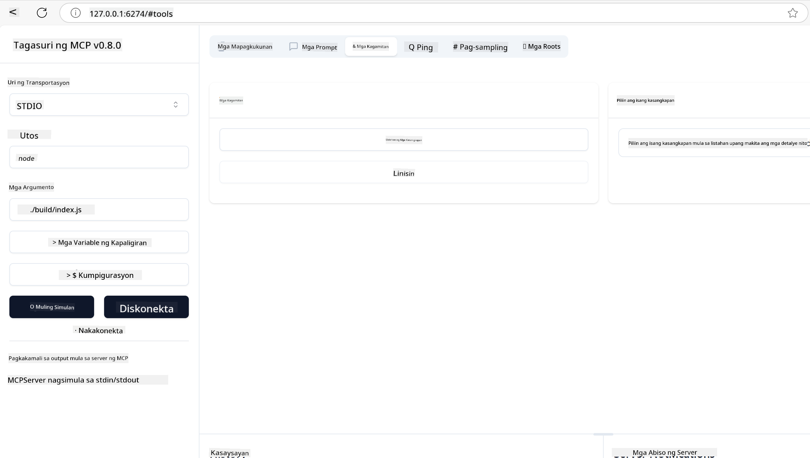
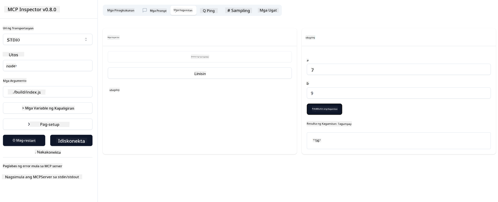

<!--
CO_OP_TRANSLATOR_METADATA:
{
  "original_hash": "5331ffd328a54b90f76706c52b673e27",
  "translation_date": "2025-05-17T08:48:26+00:00",
  "source_file": "03-GettingStarted/01-first-server/README.md",
  "language_code": "tl"
}
-->
# Pagsisimula sa MCP

Maligayang pagdating sa iyong unang hakbang sa Model Context Protocol (MCP)! Kung bago ka sa MCP o nais mong palalimin ang iyong pag-unawa, ang gabay na ito ay maglalakad sa iyo sa mahahalagang setup at proseso ng pag-develop. Matutuklasan mo kung paano pinapadali ng MCP ang tuloy-tuloy na integrasyon sa pagitan ng mga AI model at aplikasyon, at matutunan kung paano mabilis na ihanda ang iyong kapaligiran para sa paggawa at pagsubok ng mga solusyon na pinapatakbo ng MCP.

> TLDR; Kung gumagawa ka ng mga AI app, alam mo na maaari kang magdagdag ng mga tool at iba pang mapagkukunan sa iyong LLM (malaking modelo ng wika), upang gawing mas matalino ang LLM. Gayunpaman, kung ilalagay mo ang mga tool at mapagkukunang iyon sa isang server, ang app at kakayahan ng server ay magagamit ng anumang kliyente na may/ walang LLM.

## Pangkalahatang-ideya

Ang araling ito ay nagbibigay ng praktikal na gabay sa pag-set up ng mga kapaligiran ng MCP at paggawa ng iyong unang mga aplikasyon ng MCP. Matutunan mo kung paano i-set up ang mga kinakailangang tool at framework, bumuo ng mga pangunahing MCP server, lumikha ng mga host application, at subukan ang iyong mga implementasyon.

Ang Model Context Protocol (MCP) ay isang bukas na protocol na nag-i-standardize kung paano nagbibigay ng konteksto ang mga aplikasyon sa mga LLM. Isipin ang MCP tulad ng isang USB-C port para sa mga AI application - nagbibigay ito ng isang standardized na paraan upang ikonekta ang mga AI model sa iba't ibang mapagkukunan ng data at mga tool.

## Mga Layunin sa Pagkatuto

Sa pagtatapos ng araling ito, magagawa mong:

- Mag-set up ng mga kapaligiran sa pag-develop para sa MCP sa C#, Java, Python, TypeScript, at JavaScript
- Bumuo at mag-deploy ng mga pangunahing MCP server na may mga custom na tampok (mga mapagkukunan, mga prompt, at mga tool)
- Lumikha ng mga host application na kumokonekta sa mga MCP server
- Subukan at i-debug ang mga implementasyon ng MCP

## Pag-set Up ng Iyong MCP Environment

Bago ka magsimulang magtrabaho sa MCP, mahalagang ihanda ang iyong kapaligiran sa pag-develop at maunawaan ang pangunahing workflow. Ang seksyong ito ay gagabay sa iyo sa mga paunang hakbang ng pag-setup upang matiyak ang maayos na simula sa MCP.

### Mga Kinakailangan

Bago sumabak sa pag-develop ng MCP, tiyaking mayroon ka ng:

- **Development Environment**: Para sa napiling wika (C#, Java, Python, TypeScript, o JavaScript)
- **IDE/Editor**: Visual Studio, Visual Studio Code, IntelliJ, Eclipse, PyCharm, o anumang modernong code editor
- **Package Managers**: NuGet, Maven/Gradle, pip, o npm/yarn
- **API Keys**: Para sa anumang AI services na balak mong gamitin sa iyong mga host application

## Pangunahing Istruktura ng MCP Server

Karaniwang kasama sa isang MCP server ang:

- **Server Configuration**: Setup ng port, authentication, at iba pang setting
- **Resources**: Data at konteksto na magagamit sa mga LLM
- **Tools**: Functionality na maaaring tawagin ng mga model
- **Prompts**: Mga template para sa pagbuo o pag-istruktura ng teksto

Narito ang isang pinasimpleng halimbawa sa TypeScript:

```typescript
import { Server, Tool, Resource } from "@modelcontextprotocol/typescript-server-sdk";

// Create a new MCP server
const server = new Server({
  port: 3000,
  name: "Example MCP Server",
  version: "1.0.0"
});

// Register a tool
server.registerTool({
  name: "calculator",
  description: "Performs basic calculations",
  parameters: {
    expression: {
      type: "string",
      description: "The math expression to evaluate"
    }
  },
  handler: async (params) => {
    const result = eval(params.expression);
    return { result };
  }
});

// Start the server
server.start();
```

Sa naunang code, ginawa natin ang mga sumusunod:

- Inimport ang mga kinakailangang klase mula sa MCP TypeScript SDK.
- Lumikha at nag-configure ng bagong MCP server instance.
- Nagrehistro ng custom na tool (`calculator`) na may handler function.
- Sinimulan ang server para makinig sa mga papasok na kahilingan ng MCP.

## Pagsubok at Pag-debug

Bago ka magsimula sa pagsubok ng iyong MCP server, mahalagang maunawaan ang mga magagamit na tool at pinakamahusay na kasanayan para sa pag-debug. Ang epektibong pagsubok ay tinitiyak na ang iyong server ay kumikilos ayon sa inaasahan at tumutulong sa iyo na mabilis na matukoy at malutas ang mga isyu. Ang sumusunod na seksyon ay nagbabalangkas ng mga inirerekomendang pamamaraan para sa pagpapatunay ng iyong implementasyon ng MCP.

Nagbibigay ang MCP ng mga tool upang matulungan kang subukan at i-debug ang iyong mga server:

- **Inspector tool**, ang graphical interface na ito ay nagbibigay-daan sa iyo na kumonekta sa iyong server at subukan ang iyong mga tool, prompt, at mapagkukunan.
- **curl**, maaari ka ring kumonekta sa iyong server gamit ang isang command line tool tulad ng curl o iba pang mga kliyente na maaaring lumikha at magpatakbo ng mga HTTP command.

### Paggamit ng MCP Inspector

Ang [MCP Inspector](https://github.com/modelcontextprotocol/inspector) ay isang visual testing tool na tumutulong sa iyo na:

1. **Tuklasin ang mga Kakayahan ng Server**: Awtomatikong tukuyin ang mga magagamit na mapagkukunan, tool, at prompt
2. **Subukan ang Pagpapatupad ng Tool**: Subukan ang iba't ibang parameter at tingnan ang mga tugon sa real-time
3. **Tingnan ang Metadata ng Server**: Suriin ang impormasyon ng server, mga schema, at mga configuration

```bash
# ex TypeScript, installing and running MCP Inspector
npx @modelcontextprotocol/inspector node build/index.js
```

Kapag pinatakbo mo ang mga utos sa itaas, ang MCP Inspector ay maglulunsad ng isang lokal na web interface sa iyong browser. Maaari mong asahan na makakita ng isang dashboard na nagpapakita ng iyong mga nakarehistrong MCP server, kanilang mga magagamit na tool, mapagkukunan, at mga prompt. Ang interface ay nagbibigay-daan sa iyo na interactive na subukan ang pagpapatupad ng tool, suriin ang metadata ng server, at tingnan ang mga tugon sa real-time, na nagpapadali sa pagpapatunay at pag-debug ng iyong mga implementasyon ng MCP server.

Narito ang screenshot kung ano ang maaaring itsura nito:



## Mga Karaniwang Isyu sa Setup at mga Solusyon

| Isyu | Posibleng Solusyon |
|------|--------------------|
| Connection refused | Tiyakin kung ang server ay tumatakbo at tama ang port |
| Mga error sa pagpapatupad ng tool | Suriin ang validation ng parameter at paghawak ng error |
| Mga pagkabigo sa authentication | I-verify ang mga API key at mga pahintulot |
| Mga error sa pag-validate ng schema | Tiyakin na ang mga parameter ay tumutugma sa tinukoy na schema |
| Hindi nagsisimula ang server | Suriin ang mga conflict sa port o nawawalang dependencies |
| Mga error sa CORS | I-configure ang tamang CORS headers para sa cross-origin requests |
| Mga isyu sa authentication | I-verify ang bisa ng token at mga pahintulot |

## Lokal na Pag-develop

Para sa lokal na pag-develop at pagsubok, maaari mong patakbuhin ang mga MCP server nang direkta sa iyong makina:

1. **Simulan ang proseso ng server**: Patakbuhin ang iyong MCP server application
2. **I-configure ang networking**: Tiyakin na ang server ay accessible sa inaasahang port
3. **Ikonekta ang mga kliyente**: Gumamit ng mga lokal na koneksyon na URL tulad ng `http://localhost:3000`

```bash
# Example: Running a TypeScript MCP server locally
npm run start
# Server running at http://localhost:3000
```

## Pagbuo ng iyong unang MCP Server

Tinalakay na natin ang [Mga Core na Konsepto](/01-CoreConcepts/README.md) sa isang nakaraang aralin, ngayon ay oras na para ilapat ang kaalamang iyon.

### Ano ang kayang gawin ng isang server

Bago tayo magsimula sa pagsusulat ng code, ipaalala lang natin sa ating sarili kung ano ang kayang gawin ng isang server:

Ang isang MCP server ay maaaring halimbawa:

- Mag-access ng mga lokal na file at database
- Kumonekta sa mga remote na API
- Magsagawa ng mga komputasyon
- Mag-integrate sa iba pang mga tool at serbisyo
- Magbigay ng user interface para sa interaksyon

Magaling, ngayong alam na natin kung ano ang kaya nitong gawin para sa atin, magsimula na tayong mag-code.

## Ehersisyo: Paglikha ng isang server

Upang lumikha ng isang server, kailangan mong sundin ang mga hakbang na ito:

- I-install ang MCP SDK.
- Lumikha ng proyekto at i-set up ang istruktura ng proyekto.
- Isulat ang code ng server.
- Subukan ang server.

### -1- I-install ang SDK

Ito ay bahagyang nag-iiba depende sa iyong napiling runtime, kaya pumili ng isa sa mga runtime sa ibaba:

Generative AI ay maaaring lumikha ng teksto, mga larawan, at kahit na code.

### -2- Lumikha ng proyekto

Ngayon na na-install mo na ang iyong SDK, gawin natin ang susunod na proyekto:

### -3- Lumikha ng mga file ng proyekto

### -4- Lumikha ng code ng server

### -5- Magdagdag ng isang tool at isang mapagkukunan

Magdagdag ng isang tool at isang mapagkukunan sa pamamagitan ng pagdaragdag ng sumusunod na code:

### -6 Pangwakas na code

Idagdag natin ang huling code na kailangan natin upang masimulan ang server:

### -7- Subukan ang server

Simulan ang server gamit ang sumusunod na command:

### -8- Patakbuhin gamit ang inspector

Ang inspector ay isang mahusay na tool na maaaring magpatakbo ng iyong server at nagbibigay-daan sa iyo na makipag-ugnayan dito upang masubukan mo kung ito ay gumagana. Simulan natin ito:

> [!NOTE]
> Maaaring magmukhang iba ito sa "command" field dahil naglalaman ito ng command para sa pagpapatakbo ng isang server gamit ang iyong tiyak na runtime/

Makikita mo ang sumusunod na user interface:


1. Kumonekta sa server sa pamamagitan ng pagpili ng Connect button. 
   Kapag nakakonekta ka na sa server, makikita mo na ngayon ang sumusunod:

   

1. Piliin ang "Tools" at "listTools", makikita mo dapat na lumabas ang "Add", piliin ang "Add" at punan ang mga halaga ng parameter.

   Makikita mo ang sumusunod na tugon, i.e isang resulta mula sa "add" tool:

   

Congrats, nagawa mong lumikha at patakbuhin ang iyong unang server!

### Opisyal na mga SDK

Nagbibigay ang MCP ng opisyal na mga SDK para sa maraming wika:
- [C# SDK](https://github.com/modelcontextprotocol/csharp-sdk) - Pinapanatili sa pakikipagtulungan sa Microsoft
- [Java SDK](https://github.com/modelcontextprotocol/java-sdk) - Pinapanatili sa pakikipagtulungan sa Spring AI
- [TypeScript SDK](https://github.com/modelcontextprotocol/typescript-sdk) - Ang opisyal na implementasyon ng TypeScript
- [Python SDK](https://github.com/modelcontextprotocol/python-sdk) - Ang opisyal na implementasyon ng Python
- [Kotlin SDK](https://github.com/modelcontextprotocol/kotlin-sdk) - Ang opisyal na implementasyon ng Kotlin
- [Swift SDK](https://github.com/modelcontextprotocol/swift-sdk) - Pinapanatili sa pakikipagtulungan sa Loopwork AI
- [Rust SDK](https://github.com/modelcontextprotocol/rust-sdk) - Ang opisyal na implementasyon ng Rust

## Mga Pangunahing Kaisipan

- Ang pag-set up ng isang MCP development environment ay direkta sa mga language-specific SDK
- Ang pagbuo ng mga MCP server ay nagsasangkot ng paglikha at pagrerehistro ng mga tool na may malinaw na mga schema
- Ang pagsubok at pag-debug ay mahalaga para sa maaasahang mga implementasyon ng MCP

## Mga Halimbawa

- [Java Calculator](../samples/java/calculator/README.md)
- [.Net Calculator](../../../../03-GettingStarted/samples/csharp)
- [JavaScript Calculator](../samples/javascript/README.md)
- [TypeScript Calculator](../samples/typescript/README.md)
- [Python Calculator](../../../../03-GettingStarted/samples/python)

## Takdang Aralin

Lumikha ng simpleng MCP server na may tool na iyong napili:
1. Ipatupad ang tool sa iyong gustong wika (.NET, Java, Python, o JavaScript).
2. Tukuyin ang mga input parameter at mga return value.
3. Patakbuhin ang inspector tool upang matiyak na gumagana ang server ayon sa nilalayon.
4. Subukan ang implementasyon gamit ang iba't ibang input.

## Solusyon

[Solusyon](./solution/README.md)

## Karagdagang Mapagkukunan

- [MCP GitHub Repository](https://github.com/microsoft/mcp-for-beginners)

## Ano ang susunod

Susunod: [Pagsisimula sa MCP Clients](/03-GettingStarted/02-client/README.md)

**Paunawa**:  
Ang dokumentong ito ay isinalin gamit ang AI translation service na [Co-op Translator](https://github.com/Azure/co-op-translator). Bagamat sinisikap namin ang pagiging tumpak, pakatandaan na ang mga awtomatikong pagsasalin ay maaaring maglaman ng mga pagkakamali o hindi pagkakatugma. Ang orihinal na dokumento sa kanyang katutubong wika ang dapat ituring na mapagkakatiwalaang sanggunian. Para sa mahahalagang impormasyon, inirerekomenda ang propesyonal na pagsasalin ng tao. Kami ay hindi mananagot para sa anumang hindi pagkakaintindihan o maling interpretasyon na dulot ng paggamit ng pagsasaling ito.