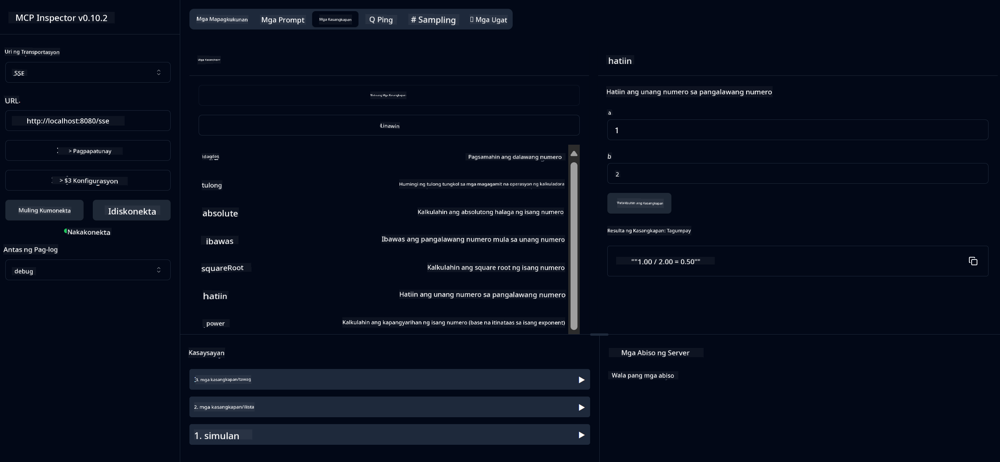

<!--
CO_OP_TRANSLATOR_METADATA:
{
  "original_hash": "ed9cab32cc67c12d8969b407aa47100a",
  "translation_date": "2025-07-13T17:55:52+00:00",
  "source_file": "03-GettingStarted/01-first-server/solution/java/README.md",
  "language_code": "tl"
}
-->
# Basic Calculator MCP Service

Ang serbisyong ito ay nagbibigay ng mga pangunahing operasyon ng calculator gamit ang Model Context Protocol (MCP) sa pamamagitan ng Spring Boot na may WebFlux transport. Ito ay idinisenyo bilang isang simpleng halimbawa para sa mga nagsisimula na gustong matuto tungkol sa mga implementasyon ng MCP.

Para sa karagdagang impormasyon, tingnan ang [MCP Server Boot Starter](https://docs.spring.io/spring-ai/reference/api/mcp/mcp-server-boot-starter-docs.html) na dokumentasyon ng sanggunian.


## Paggamit ng Serbisyo

Ipinapakita ng serbisyo ang mga sumusunod na API endpoints sa pamamagitan ng MCP protocol:

- `add(a, b)`: Magdagdag ng dalawang numero
- `subtract(a, b)`: Ibawas ang pangalawang numero mula sa una
- `multiply(a, b)`: Imultiply ang dalawang numero
- `divide(a, b)`: Hatiin ang unang numero sa pangalawa (may pagsusuri sa zero)
- `power(base, exponent)`: Kalkulahin ang kapangyarihan ng isang numero
- `squareRoot(number)`: Kalkulahin ang square root (may pagsusuri sa negatibong numero)
- `modulus(a, b)`: Kalkulahin ang natitirang bahagi kapag hinati
- `absolute(number)`: Kalkulahin ang absolute value

## Mga Dependencies

Kinakailangan ng proyekto ang mga sumusunod na pangunahing dependencies:

```xml
<dependency>
    <groupId>org.springframework.ai</groupId>
    <artifactId>spring-ai-starter-mcp-server-webflux</artifactId>
</dependency>
```

## Pagbuo ng Proyekto

I-build ang proyekto gamit ang Maven:
```bash
./mvnw clean install -DskipTests
```

## Pagpapatakbo ng Server

### Paggamit ng Java

```bash
java -jar target/calculator-server-0.0.1-SNAPSHOT.jar
```

### Paggamit ng MCP Inspector

Ang MCP Inspector ay isang kapaki-pakinabang na tool para makipag-ugnayan sa mga MCP services. Para gamitin ito sa calculator service na ito:

1. **I-install at patakbuhin ang MCP Inspector** sa isang bagong terminal window:
   ```bash
   npx @modelcontextprotocol/inspector
   ```

2. **Buksan ang web UI** sa pamamagitan ng pag-click sa URL na ipinapakita ng app (karaniwang http://localhost:6274)

3. **I-configure ang koneksyon**:
   - Itakda ang transport type sa "SSE"
   - Itakda ang URL sa SSE endpoint ng tumatakbong server: `http://localhost:8080/sse`
   - I-click ang "Connect"

4. **Gamitin ang mga tools**:
   - I-click ang "List Tools" para makita ang mga available na operasyon ng calculator
   - Piliin ang isang tool at i-click ang "Run Tool" para isagawa ang operasyon



**Paalala**:  
Ang dokumentong ito ay isinalin gamit ang AI translation service na [Co-op Translator](https://github.com/Azure/co-op-translator). Bagamat nagsusumikap kami para sa katumpakan, pakatandaan na ang mga awtomatikong pagsasalin ay maaaring maglaman ng mga pagkakamali o di-tumpak na impormasyon. Ang orihinal na dokumento sa orihinal nitong wika ang dapat ituring na pangunahing sanggunian. Para sa mahahalagang impormasyon, inirerekomenda ang propesyonal na pagsasalin ng tao. Hindi kami mananagot sa anumang hindi pagkakaunawaan o maling interpretasyon na maaaring magmula sa paggamit ng pagsasaling ito.