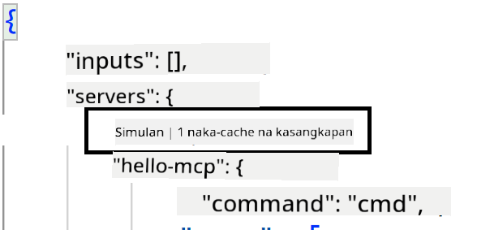
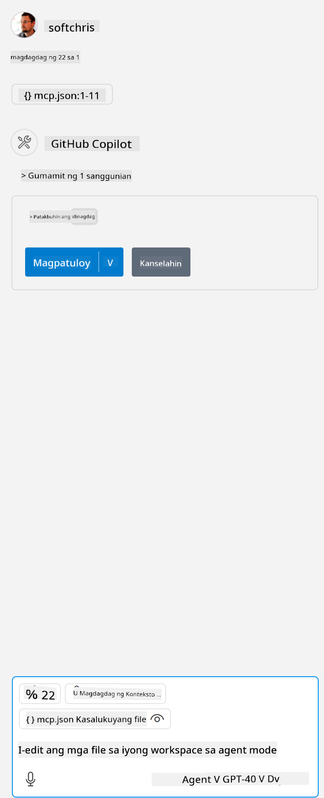

<!--
CO_OP_TRANSLATOR_METADATA:
{
  "original_hash": "c37fabfbc0dcbc9a4afb6d17e7d3be9f",
  "translation_date": "2025-05-17T11:13:17+00:00",
  "source_file": "03-GettingStarted/04-vscode/README.md",
  "language_code": "tl"
}
-->
Pag-usapan pa natin kung paano natin ginagamit ang visual interface sa mga susunod na seksyon.

## Paglapit

Narito kung paano natin dapat lapitan ito sa mataas na antas:

- I-configure ang isang file upang mahanap ang ating MCP Server.
- I-start/I-konekta sa nasabing server upang makita ang listahan ng mga kakayahan nito.
- Gamitin ang mga kakayahang iyon sa pamamagitan ng chat interface ng GitHub Copilot.

Magaling, ngayong naiintindihan na natin ang daloy, subukan nating gumamit ng isang MCP Server sa pamamagitan ng Visual Studio Code sa pamamagitan ng isang pagsasanay.

## Pagsasanay: Paggamit ng server

Sa pagsasanay na ito, i-configure natin ang Visual Studio Code upang mahanap ang iyong MCP server upang magamit ito mula sa chat interface ng GitHub Copilot.

### -0- Prestep, paganahin ang pagtuklas ng MCP Server

Maaaring kailanganin mong paganahin ang pagtuklas ng MCP Servers.

1. Pumunta sa `File -> Preferences -> Settings` in Visual Studio Code.

1. Search for "MCP" and enable `chat.mcp.discovery.enabled` sa settings.json file.

### -1- Gumawa ng config file

Magsimula sa pamamagitan ng paglikha ng config file sa iyong project root, kakailanganin mo ng isang file na tinatawag na MCP.json at ilagay ito sa isang folder na tinatawag na .vscode. Dapat itong magmukhang ganito:

```text
.vscode
|-- mcp.json
```

Susunod, tingnan natin kung paano magdagdag ng entry para sa server.

### -2- I-configure ang isang server

Idagdag ang sumusunod na nilalaman sa *mcp.json*:

```json
{
    "inputs": [],
    "servers": {
       "hello-mcp": {
           "command": "cmd",
           "args": [
               "/c", "node", "<absolute path>\\build\\index.js"
           ]
       }
    }
}
```

Narito ang isang simpleng halimbawa kung paano simulan ang isang server na nakasulat sa Node.js, para sa ibang mga runtime ituro ang tamang command para simulan ang server gamit ang `command` and `args`.

### -3- I-start ang server

Ngayon na nagdagdag ka ng entry, simulan natin ang server:

1. Hanapin ang iyong entry sa *mcp.json* at siguraduhing makita ang "play" icon:

    

1. I-click ang "play" icon, dapat mong makita ang tools icon sa GitHub Copilot chat na nadaragdagan ang bilang ng magagamit na tools. Kung i-click mo ang nasabing tools icon, makikita mo ang listahan ng mga nakarehistrong tools. Maaari mong i-check/uncheck ang bawat tool depende kung gusto mong gamitin ito ng GitHub Copilot bilang konteksto:

  

1. Upang patakbuhin ang isang tool, mag-type ng prompt na alam mong tutugma sa paglalarawan ng isa sa iyong mga tool, halimbawa ng prompt tulad nito "add 22 to 1":

  

  Dapat mong makita ang tugon na nagsasabing 23.

## Takdang-Aralin

Subukang magdagdag ng entry para sa server sa iyong *mcp.json* file at siguraduhing kaya mong simulan/itigil ang server. Siguraduhin din na kaya mong makipag-ugnayan sa mga tools sa iyong server sa pamamagitan ng chat interface ng GitHub Copilot.

## Solusyon

[Solusyon](./solution/README.md)

## Mahahalagang Punto

Ang mga mahahalagang punto mula sa kabanatang ito ay ang mga sumusunod:

- Ang Visual Studio Code ay isang mahusay na client na nagpapahintulot sa iyo na gamitin ang ilang MCP Servers at ang kanilang mga tools.
- Ang chat interface ng GitHub Copilot ay kung paano ka makikipag-ugnayan sa mga server.
- Maaari mong i-prompt ang user para sa mga input tulad ng API keys na maaaring ipadala sa MCP Server kapag kino-configure ang entry ng server sa *mcp.json* file.

## Mga Halimbawa

- [Java Calculator](../samples/java/calculator/README.md)
- [.Net Calculator](../../../../03-GettingStarted/samples/csharp)
- [JavaScript Calculator](../samples/javascript/README.md)
- [TypeScript Calculator](../samples/typescript/README.md)
- [Python Calculator](../../../../03-GettingStarted/samples/python)

## Karagdagang Mapagkukunan

- [Visual Studio docs](https://code.visualstudio.com/docs/copilot/chat/mcp-servers)

## Ano'ng Susunod

- Susunod: [Paglikha ng SSE Server](/03-GettingStarted/05-sse-server/README.md)

**Pagtatatuwa**:  
Ang dokumentong ito ay isinalin gamit ang AI translation service na [Co-op Translator](https://github.com/Azure/co-op-translator). Habang sinisikap naming maging tumpak, mangyaring tandaan na ang mga awtomatikong pagsasalin ay maaaring maglaman ng mga pagkakamali o hindi pagkakatumpak. Ang orihinal na dokumento sa kanyang katutubong wika ay dapat ituring na mapagkakatiwalaang pinagmulan. Para sa mahahalagang impormasyon, inirerekomenda ang propesyonal na pagsasalin ng tao. Hindi kami mananagot para sa anumang hindi pagkakaintindihan o maling interpretasyon na dulot ng paggamit ng pagsasaling ito.