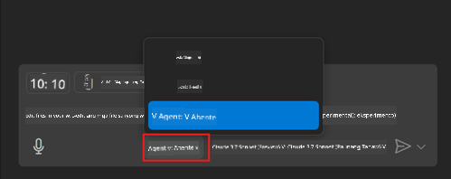
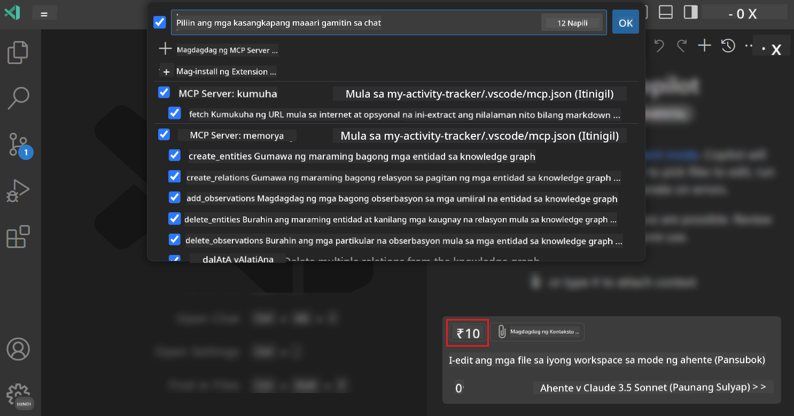
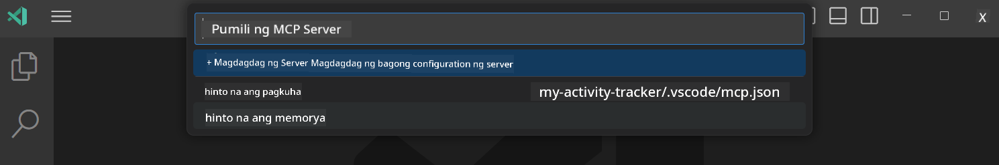
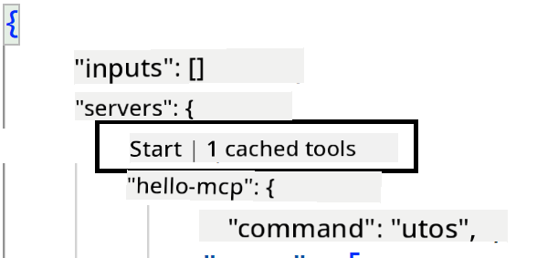
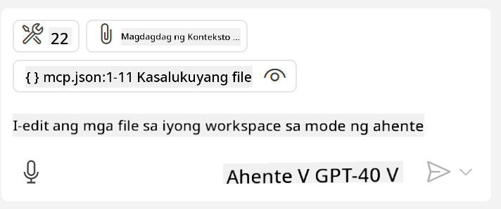

<!--
CO_OP_TRANSLATOR_METADATA:
{
  "original_hash": "d940b5e0af75e3a3a4d1c3179120d1d9",
  "translation_date": "2025-08-26T18:07:44+00:00",
  "source_file": "03-GettingStarted/04-vscode/README.md",
  "language_code": "tl"
}
-->
# Paggamit ng server mula sa GitHub Copilot Agent mode

Ang Visual Studio Code at GitHub Copilot ay maaaring kumilos bilang isang client at gumamit ng MCP Server. Bakit natin gugustuhing gawin ito? Dahil ang anumang mga tampok na mayroon ang MCP Server ay maaari nang magamit mula sa loob ng iyong IDE. Isipin na idagdag mo, halimbawa, ang MCP server ng GitHub, magbibigay ito ng kakayahang kontrolin ang GitHub gamit ang mga prompt sa halip na mag-type ng mga partikular na command sa terminal. O isipin ang anumang bagay na maaaring mapabuti ang iyong karanasan bilang developer na kontrolado lahat gamit ang natural na wika. Ngayon nakikita mo na ang benepisyo, tama?

## Pangkalahatang-ideya

Saklaw ng araling ito kung paano gamitin ang Visual Studio Code at ang Agent mode ng GitHub Copilot bilang client para sa iyong MCP Server.

## Mga Layunin sa Pag-aaral

Sa pagtatapos ng araling ito, magagawa mo ang sumusunod:

- Gumamit ng MCP Server sa pamamagitan ng Visual Studio Code.
- Patakbuhin ang mga kakayahan tulad ng mga tool gamit ang GitHub Copilot.
- I-configure ang Visual Studio Code upang mahanap at pamahalaan ang iyong MCP Server.

## Paggamit

Maaari mong kontrolin ang iyong MCP server sa dalawang paraan:

- User interface, ipapakita kung paano ito ginagawa sa mga susunod na bahagi ng kabanatang ito.
- Terminal, posible ang kontrolin ang mga bagay mula sa terminal gamit ang `code` executable:

  Upang magdagdag ng MCP server sa iyong user profile, gamitin ang --add-mcp command line option, at ibigay ang JSON server configuration sa anyo ng {\"name\":\"server-name\",\"command\":...}.

  ```
  code --add-mcp "{\"name\":\"my-server\",\"command\": \"uvx\",\"args\": [\"mcp-server-fetch\"]}"
  ```

### Mga Screenshot





Pag-usapan natin nang mas detalyado kung paano gamitin ang visual interface sa mga susunod na seksyon.

## Diskarte

Narito kung paano natin dapat lapitan ito sa mataas na antas:

- Mag-configure ng file upang mahanap ang ating MCP Server.
- I-start/Ikonekta ang server upang maipakita ang mga kakayahan nito.
- Gamitin ang mga kakayahan nito sa pamamagitan ng GitHub Copilot Chat interface.

Magaling, ngayong naiintindihan na natin ang daloy, subukan nating gumamit ng MCP Server sa pamamagitan ng Visual Studio Code sa isang ehersisyo.

## Ehersisyo: Paggamit ng server

Sa ehersisyong ito, iko-configure natin ang Visual Studio Code upang mahanap ang iyong MCP server upang magamit ito mula sa GitHub Copilot Chat interface.

### -0- Prestep, paganahin ang MCP Server discovery

Maaaring kailanganin mong paganahin ang discovery ng MCP Servers.

1. Pumunta sa `File -> Preferences -> Settings` sa Visual Studio Code.

1. Hanapin ang "MCP" at paganahin ang `chat.mcp.discovery.enabled` sa settings.json file.

### -1- Gumawa ng config file

Simulan sa paggawa ng config file sa root ng iyong proyekto, kakailanganin mo ng file na tinatawag na MCP.json at ilagay ito sa isang folder na tinatawag na .vscode. Dapat itong magmukhang ganito:

```text
.vscode
|-- mcp.json
```

Susunod, tingnan natin kung paano magdagdag ng entry ng server.

### -2- I-configure ang server

Idagdag ang sumusunod na nilalaman sa *mcp.json*:

```json
{
    "inputs": [],
    "servers": {
       "hello-mcp": {
           "command": "node",
           "args": [
               "build/index.js"
           ]
       }
    }
}
```

Narito ang isang simpleng halimbawa kung paano magsimula ng server na isinulat sa Node.js, para sa ibang mga runtime, ituro ang tamang command para sa pagsisimula ng server gamit ang `command` at `args`.

### -3- I-start ang server

Ngayong naidagdag mo na ang entry, simulan ang server:

1. Hanapin ang iyong entry sa *mcp.json* at tiyaking makita ang "play" icon:

    

1. I-click ang "play" icon, dapat mong makita ang tools icon sa GitHub Copilot Chat na nadagdagan ang bilang ng mga available na tool. Kung i-click mo ang tools icon, makikita mo ang listahan ng mga nakarehistrong tool. Maaari mong i-check/uncheck ang bawat tool depende kung gusto mong gamitin ito ng GitHub Copilot bilang context:

  

1. Upang patakbuhin ang isang tool, mag-type ng prompt na alam mong tumutugma sa deskripsyon ng isa sa iyong mga tool, halimbawa isang prompt na ganito "add 22 to 1":

  

  Dapat kang makakita ng sagot na nagsasabing 23.

## Takdang-Aralin

Subukang magdagdag ng entry ng server sa iyong *mcp.json* file at tiyaking ma-start/stop mo ang server. Siguraduhin ding makipag-ugnayan sa mga tool sa iyong server sa pamamagitan ng GitHub Copilot Chat interface.

## Solusyon

[Solusyon](./solution/README.md)

## Mga Pangunahing Puntos

Ang mga pangunahing puntos mula sa kabanatang ito ay ang sumusunod:

- Ang Visual Studio Code ay isang mahusay na client na nagbibigay-daan sa iyong gamitin ang iba't ibang MCP Servers at ang kanilang mga tool.
- Ang GitHub Copilot Chat interface ang paraan kung paano ka nakikipag-ugnayan sa mga server.
- Maaari kang mag-prompt sa user para sa mga input tulad ng API keys na maaaring ipasa sa MCP Server kapag kino-configure ang server entry sa *mcp.json* file.

## Mga Halimbawa

- [Java Calculator](../samples/java/calculator/README.md)
- [.Net Calculator](../../../../03-GettingStarted/samples/csharp)
- [JavaScript Calculator](../samples/javascript/README.md)
- [TypeScript Calculator](../samples/typescript/README.md)
- [Python Calculator](../../../../03-GettingStarted/samples/python)

## Karagdagang Mga Mapagkukunan

- [Visual Studio docs](https://code.visualstudio.com/docs/copilot/chat/mcp-servers)

## Ano'ng Susunod

- Susunod: [Paglikha ng stdio Server](../05-stdio-server/README.md)

---

**Paunawa**:  
Ang dokumentong ito ay isinalin gamit ang AI translation service na [Co-op Translator](https://github.com/Azure/co-op-translator). Bagama't sinisikap naming maging tumpak, tandaan na ang mga awtomatikong pagsasalin ay maaaring maglaman ng mga pagkakamali o hindi pagkakatugma. Ang orihinal na dokumento sa kanyang katutubong wika ang dapat ituring na opisyal na sanggunian. Para sa mahalagang impormasyon, inirerekomenda ang propesyonal na pagsasalin ng tao. Hindi kami mananagot sa anumang hindi pagkakaunawaan o maling interpretasyon na maaaring magmula sa paggamit ng pagsasaling ito.