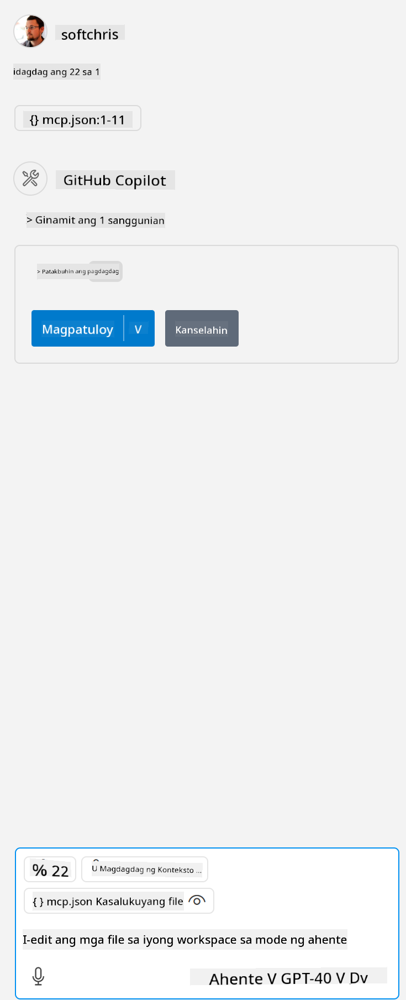

<!--
CO_OP_TRANSLATOR_METADATA:
{
  "original_hash": "5ef8f5821c1a04f7b1fc4f15098ecab8",
  "translation_date": "2025-07-13T19:44:53+00:00",
  "source_file": "03-GettingStarted/04-vscode/solution/README.md",
  "language_code": "tl"
}
-->
Ito ay tumutukoy sa pagpapatakbo ng isang utos tulad ng: `node build/index.js`.

- Baguhin ang entry ng server upang tumugma sa lokasyon ng iyong server file o kung ano ang kinakailangan upang simulan ang iyong server depende sa iyong napiling runtime at lokasyon ng server.

## Gamitin ang mga tampok sa server

- I-click ang icon na `play`, kapag naidagdag mo na ang *mcp.json* sa *./vscode* na folder,

    Pansinin ang pagbabago ng icon ng tooling na nagpapakita ng pagdami ng mga magagamit na tool. Ang icon ng tooling ay matatagpuan sa itaas mismo ng chat field sa GitHub Copilot.

## Patakbuhin ang isang tool

- Mag-type ng prompt sa iyong chat window na tumutugma sa paglalarawan ng iyong tool. Halimbawa, upang patakbuhin ang tool na `add` mag-type ng isang bagay tulad ng "add 3 to 20".

    Makikita mo ang isang tool na ipinapakita sa itaas ng chat text box na nagsasabing piliin ito upang patakbuhin ang tool tulad ng nasa larawan:

    

    Ang pagpili sa tool ay dapat magbigay ng numerikong resulta na nagsasabing "23" kung ang iyong prompt ay tulad ng nabanggit namin kanina.

**Paalala**:  
Ang dokumentong ito ay isinalin gamit ang AI translation service na [Co-op Translator](https://github.com/Azure/co-op-translator). Bagamat nagsusumikap kami para sa katumpakan, pakatandaan na ang mga awtomatikong pagsasalin ay maaaring maglaman ng mga pagkakamali o di-tumpak na impormasyon. Ang orihinal na dokumento sa orihinal nitong wika ang dapat ituring na pangunahing sanggunian. Para sa mahahalagang impormasyon, inirerekomenda ang propesyonal na pagsasalin ng tao. Hindi kami mananagot sa anumang hindi pagkakaunawaan o maling interpretasyon na maaaring magmula sa paggamit ng pagsasaling ito.