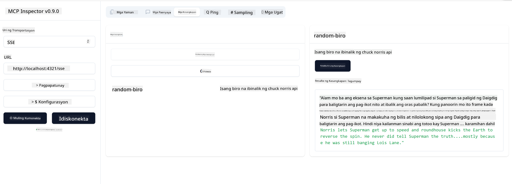

<!--
CO_OP_TRANSLATOR_METADATA:
{
  "original_hash": "6b1152afb5d4cb9a4175044694fd02ca",
  "translation_date": "2025-07-17T08:25:08+00:00",
  "source_file": "03-GettingStarted/05-sse-server/README.md",
  "language_code": "tl"
}
-->
# SSE Server

Ang SSE (Server Sent Events) ay isang standard para sa streaming mula server papunta sa client, na nagpapahintulot sa mga server na magpadala ng real-time na updates sa mga client gamit ang HTTP. Napaka-kapaki-pakinabang ito para sa mga aplikasyon na nangangailangan ng live na updates, tulad ng mga chat application, notifications, o real-time na data feeds. Bukod dito, maaaring gamitin ang iyong server ng maraming client nang sabay-sabay dahil ito ay tumatakbo sa isang server na maaaring nasa cloud halimbawa.

## Pangkalahatang-ideya

Tinuturo sa araling ito kung paano gumawa at gumamit ng SSE Servers.

## Mga Layunin sa Pagkatuto

Sa pagtatapos ng araling ito, magagawa mong:

- Gumawa ng SSE Server.
- I-debug ang SSE Server gamit ang Inspector.
- Gumamit ng SSE Server gamit ang Visual Studio Code.

## SSE, paano ito gumagana

Ang SSE ay isa sa dalawang suportadong uri ng transport. Nakita mo na ang una, ang stdio, sa mga naunang aralin. Ang pagkakaiba ay ang mga sumusunod:

- Kailangan mong pangasiwaan ang dalawang bagay sa SSE; ang koneksyon at mga mensahe.
- Dahil ang server na ito ay maaaring tumakbo kahit saan, kailangan itong maipakita sa paraan ng paggamit mo ng mga tools tulad ng Inspector at Visual Studio Code. Ibig sabihin nito, sa halip na ituro kung paano simulan ang server, ituturo mo ang endpoint kung saan maaaring mag-establish ng koneksyon. Tingnan ang halimbawa ng code sa ibaba:

### TypeScript

```typescript
app.get("/sse", async (_: Request, res: Response) => {
    const transport = new SSEServerTransport('/messages', res);
    transports[transport.sessionId] = transport;
    res.on("close", () => {
        delete transports[transport.sessionId];
    });
    await server.connect(transport);
});

app.post("/messages", async (req: Request, res: Response) => {
    const sessionId = req.query.sessionId as string;
    const transport = transports[sessionId];
    if (transport) {
        await transport.handlePostMessage(req, res);
    } else {
        res.status(400).send('No transport found for sessionId');
    }
});
```

Sa code sa itaas:

- Ang `/sse` ay naka-set bilang ruta. Kapag may request papunta sa rutang ito, isang bagong transport instance ang nilikha at ang server ay *kumokonekta* gamit ang transport na ito.
- Ang `/messages` naman ay ruta na humahawak sa mga papasok na mensahe.

### Python

```python
mcp = FastMCP("My App")

@mcp.tool()
def add(a: int, b: int) -> int:
    """Add two numbers"""
    return a + b

# Mount the SSE server to the existing ASGI server
app = Starlette(
    routes=[
        Mount('/', app=mcp.sse_app()),
    ]
)

```

Sa code sa itaas:

- Gumawa tayo ng instance ng ASGI server (gamit ang Starlette partikular) at in-mount ang default na ruta `/`.

  Ang nangyayari sa likod ng eksena ay ang mga ruta na `/sse` at `/messages` ay naka-set up para pangasiwaan ang mga koneksyon at mga mensahe. Ang iba pang bahagi ng app, tulad ng pagdagdag ng mga features tulad ng tools, ay ginagawa tulad ng sa stdio servers.

### .NET    

```csharp
    var builder = WebApplication.CreateBuilder(args);
    builder.Services
        .AddMcpServer()
        .WithTools<Tools>();


    builder.Services.AddHttpClient();

    var app = builder.Build();

    app.MapMcp();
    ```

    May dalawang paraan na tumutulong sa atin mula sa isang web server papunta sa web server na sumusuporta sa SSE at ito ay:

    - `AddMcpServer`, ang method na ito ay nagdadagdag ng mga kakayahan.
    - `MapMcp`, ito ay nagdadagdag ng mga ruta tulad ng `/SSE` at `/messages`.

Ngayon na may ideya na tayo tungkol sa SSE, gawin natin ang isang SSE server.

## Ehersisyo: Paggawa ng SSE Server

Para gumawa ng server, kailangan nating tandaan ang dalawang bagay:

- Kailangan nating gumamit ng web server para i-expose ang mga endpoints para sa koneksyon at mga mensahe.
- Gawin ang server tulad ng dati gamit ang mga tools, resources, at prompts na ginamit natin sa stdio.

### -1- Gumawa ng server instance

Para gumawa ng server, gagamitin natin ang parehong mga uri tulad ng sa stdio. Ngunit para sa transport, kailangan nating piliin ang SSE.

### TypeScript

```typescript
import { Request, Response } from "express";
import express from "express";
import { McpServer } from "@modelcontextprotocol/sdk/server/mcp.js";
import { SSEServerTransport } from "@modelcontextprotocol/sdk/server/sse.js";

const server = new McpServer({
  name: "example-server",
  version: "1.0.0"
});

const app = express();

const transports: {[sessionId: string]: SSEServerTransport} = {};
```

Sa code sa itaas:

- Nakagawa tayo ng server instance.
- Nag-define ng app gamit ang web framework na express.
- Gumawa ng variable na transports na gagamitin para i-store ang mga papasok na koneksyon.

### Python

```python
from starlette.applications import Starlette
from starlette.routing import Mount, Host
from mcp.server.fastmcp import FastMCP


mcp = FastMCP("My App")
```

Sa code sa itaas:

- In-import natin ang mga libraries na kakailanganin gamit ang Starlette (isang ASGI framework).
- Gumawa ng MCP server instance na `mcp`.

### .NET

```csharp
var builder = WebApplication.CreateBuilder(args);
builder.Services
    .AddMcpServer();


builder.Services.AddHttpClient();

var app = builder.Build();

// TODO: add routes 
```

Sa puntong ito, nagawa na natin:

- Gumawa ng web app
- Nagdagdag ng suporta para sa MCP features gamit ang `AddMcpServer`.

Susunod, idagdag natin ang mga kinakailangang ruta.

### -2- Magdagdag ng mga ruta

Idagdag natin ang mga ruta na humahawak sa koneksyon at mga papasok na mensahe:

### TypeScript

```typescript
app.get("/sse", async (_: Request, res: Response) => {
  const transport = new SSEServerTransport('/messages', res);
  transports[transport.sessionId] = transport;
  res.on("close", () => {
    delete transports[transport.sessionId];
  });
  await server.connect(transport);
});

app.post("/messages", async (req: Request, res: Response) => {
  const sessionId = req.query.sessionId as string;
  const transport = transports[sessionId];
  if (transport) {
    await transport.handlePostMessage(req, res);
  } else {
    res.status(400).send('No transport found for sessionId');
  }
});

app.listen(3001);
```

Sa code sa itaas, na-define natin:

- Isang `/sse` na ruta na nag-iinstantiate ng transport na uri SSE at tinatawag ang `connect` sa MCP server.
- Isang `/messages` na ruta na humahawak sa mga papasok na mensahe.

### Python

```python
app = Starlette(
    routes=[
        Mount('/', app=mcp.sse_app()),
    ]
)
```

Sa code sa itaas:

- Gumawa tayo ng ASGI app instance gamit ang Starlette framework. Kasama dito ay ipinasa natin ang `mcp.sse_app()` sa listahan ng mga ruta nito. Ito ay nagmo-mount ng `/sse` at `/messages` na ruta sa app instance.

### .NET

```csharp
var builder = WebApplication.CreateBuilder(args);
builder.Services
    .AddMcpServer();

builder.Services.AddHttpClient();

var app = builder.Build();

app.MapMcp();
```

Nagdagdag tayo ng isang linya ng code sa dulo `add.MapMcp()` ibig sabihin nito ay mayroon na tayong mga ruta `/SSE` at `/messages`.

Susunod, idagdag natin ang mga kakayahan sa server.

### -3- Pagdaragdag ng mga kakayahan ng server

Ngayon na na-define na natin ang lahat ng SSE specific, idagdag natin ang mga kakayahan ng server tulad ng tools, prompts, at resources.

### TypeScript

```typescript
server.tool("random-joke", "A joke returned by the chuck norris api", {},
  async () => {
    const response = await fetch("https://api.chucknorris.io/jokes/random");
    const data = await response.json();

    return {
      content: [
        {
          type: "text",
          text: data.value
        }
      ]
    };
  }
);
```

Ganito mo maaaring idagdag ang isang tool halimbawa. Ang tool na ito ay gumagawa ng tool na tinatawag na "random-joke" na tumatawag sa Chuck Norris API at nagbabalik ng JSON response.

### Python

```python
@mcp.tool()
def add(a: int, b: int) -> int:
    """Add two numbers"""
    return a + b
```

Ngayon ay may isang tool na ang iyong server.

### TypeScript

```typescript
// server-sse.ts
import { Request, Response } from "express";
import express from "express";
import { McpServer } from "@modelcontextprotocol/sdk/server/mcp.js";
import { SSEServerTransport } from "@modelcontextprotocol/sdk/server/sse.js";

// Create an MCP server
const server = new McpServer({
  name: "example-server",
  version: "1.0.0",
});

const app = express();

const transports: { [sessionId: string]: SSEServerTransport } = {};

app.get("/sse", async (_: Request, res: Response) => {
  const transport = new SSEServerTransport("/messages", res);
  transports[transport.sessionId] = transport;
  res.on("close", () => {
    delete transports[transport.sessionId];
  });
  await server.connect(transport);
});

app.post("/messages", async (req: Request, res: Response) => {
  const sessionId = req.query.sessionId as string;
  const transport = transports[sessionId];
  if (transport) {
    await transport.handlePostMessage(req, res);
  } else {
    res.status(400).send("No transport found for sessionId");
  }
});

server.tool("random-joke", "A joke returned by the chuck norris api", {}, async () => {
  const response = await fetch("https://api.chucknorris.io/jokes/random");
  const data = await response.json();

  return {
    content: [
      {
        type: "text",
        text: data.value,
      },
    ],
  };
});

app.listen(3001);
```

### Python

```python
from starlette.applications import Starlette
from starlette.routing import Mount, Host
from mcp.server.fastmcp import FastMCP


mcp = FastMCP("My App")

@mcp.tool()
def add(a: int, b: int) -> int:
    """Add two numbers"""
    return a + b

# Mount the SSE server to the existing ASGI server
app = Starlette(
    routes=[
        Mount('/', app=mcp.sse_app()),
    ]
)
```

### .NET

1. Gumawa muna tayo ng ilang tools, para dito gagawa tayo ng file na *Tools.cs* na may sumusunod na nilalaman:

  ```csharp
  using System.ComponentModel;
  using System.Text.Json;
  using ModelContextProtocol.Server;

  namespace server;

  [McpServerToolType]
  public sealed class Tools
  {

      public Tools()
      {
      
      }

      [McpServerTool, Description("Add two numbers together.")]
      public async Task<string> AddNumbers(
          [Description("The first number")] int a,
          [Description("The second number")] int b)
      {
          return (a + b).ToString();
      }

  }
  ```

  Dito ay nagdagdag tayo ng mga sumusunod:

  - Gumawa ng klase na `Tools` na may decorator na `McpServerToolType`.
  - Nag-define ng tool na `AddNumbers` sa pamamagitan ng pagdekorasyon ng method gamit ang `McpServerTool`. Nagbigay din tayo ng mga parameters at implementasyon.

1. Gamitin natin ang `Tools` class na ginawa natin:

  ```csharp
  var builder = WebApplication.CreateBuilder(args);
  builder.Services
      .AddMcpServer()
      .WithTools<Tools>();


  builder.Services.AddHttpClient();

  var app = builder.Build();

  app.MapMcp();
  ```

  Nagdagdag tayo ng tawag sa `WithTools` na nagsasaad na ang `Tools` ang klase na naglalaman ng mga tools. Tapos na tayo, handa na.

Magaling, may server na tayo gamit ang SSE, subukan natin ito.

## Ehersisyo: Pag-debug ng SSE Server gamit ang Inspector

Ang Inspector ay isang mahusay na tool na nakita natin sa naunang aralin [Creating your first server](/03-GettingStarted/01-first-server/README.md). Tingnan natin kung magagamit din natin ang Inspector dito:

### -1- Pagpapatakbo ng inspector

Para patakbuhin ang inspector, kailangan mo munang patakbuhin ang SSE server, kaya gawin muna natin iyon:

1. Patakbuhin ang server 

    ### TypeScript

    ```sh
    tsx && node ./build/server-sse.ts
    ```

    ### Python

    ```sh
    uvicorn server:app
    ```

    Pansinin kung paano natin ginagamit ang executable na `uvicorn` na na-install nang i-type natin ang `pip install "mcp[cli]"`. Ang pag-type ng `server:app` ay nangangahulugang sinusubukan nating patakbuhin ang file na `server.py` at ito ay may Starlette instance na tinatawag na `app`.

    ### .NET

    ```sh
    dotnet run
    ```

    Dapat magsimula na ang server. Para makipag-interface dito, kailangan mo ng bagong terminal.

1. Patakbuhin ang inspector

    > ![NOTE]
    > Patakbuhin ito sa hiwalay na terminal window mula sa pinapatakbuhan ng server. Tandaan din, kailangan mong i-adjust ang command sa ibaba para umangkop sa URL kung saan tumatakbo ang iyong server.

    ```sh
    npx @modelcontextprotocol/inspector --cli http://localhost:8000/sse --method tools/list
    ```

    Ang pagpapatakbo ng inspector ay pareho sa lahat ng runtimes. Pansinin kung paano sa halip na magpasa ng path sa server at command para simulan ang server, ipinapasa natin ang URL kung saan tumatakbo ang server at tinutukoy din ang ruta na `/sse`.

### -2- Pagsubok sa tool

Ikonekta ang server sa pamamagitan ng pagpili ng SSE sa droplist at punan ang url field kung saan tumatakbo ang iyong server, halimbawa http:localhost:4321/sse. Ngayon i-click ang "Connect" button. Tulad ng dati, piliin ang list tools, pumili ng tool at magbigay ng input values. Makikita mo ang resulta tulad ng nasa ibaba:



Magaling, kaya mong gamitin ang inspector, tingnan natin kung paano gamitin ang Visual Studio Code.

## Takdang-Aralin

Subukang palawakin ang iyong server gamit ang mas maraming kakayahan. Tingnan ang [pahina na ito](https://api.chucknorris.io/) para, halimbawa, magdagdag ng tool na tumatawag ng API. Ikaw ang magdedesisyon kung ano ang itsura ng server. Mag-enjoy :)

## Solusyon

[Solusyon](./solution/README.md) Narito ang posibleng solusyon na may gumaganang code.

## Mahahalagang Punto

Ang mga mahahalagang punto mula sa kabanatang ito ay ang mga sumusunod:

- Ang SSE ang pangalawang suportadong transport kasunod ng stdio.
- Para suportahan ang SSE, kailangan mong pamahalaan ang mga papasok na koneksyon at mga mensahe gamit ang web framework.
- Maaari mong gamitin ang parehong Inspector at Visual Studio Code para gamitin ang SSE server, tulad ng sa stdio servers. Pansinin ang kaunting pagkakaiba sa pagitan ng stdio at SSE. Para sa SSE, kailangan mong patakbuhin ang server nang hiwalay bago patakbuhin ang iyong inspector tool. Para sa inspector tool, may mga pagkakaiba rin sa kailangan mong tukuyin ang URL.

## Mga Halimbawa

- [Java Calculator](../samples/java/calculator/README.md)
- [.Net Calculator](../../../../03-GettingStarted/samples/csharp)
- [JavaScript Calculator](../samples/javascript/README.md)
- [TypeScript Calculator](../samples/typescript/README.md)
- [Python Calculator](../../../../03-GettingStarted/samples/python)

## Karagdagang Mga Mapagkukunan

- [SSE](https://developer.mozilla.org/en-US/docs/Web/API/Server-sent_events)

## Ano ang Susunod

- Susunod: [HTTP Streaming with MCP (Streamable HTTP)](../06-http-streaming/README.md)

**Paalala**:  
Ang dokumentong ito ay isinalin gamit ang AI translation service na [Co-op Translator](https://github.com/Azure/co-op-translator). Bagamat nagsusumikap kami para sa katumpakan, pakatandaan na ang mga awtomatikong pagsasalin ay maaaring maglaman ng mga pagkakamali o di-tumpak na impormasyon. Ang orihinal na dokumento sa orihinal nitong wika ang dapat ituring na pangunahing sanggunian. Para sa mahahalagang impormasyon, inirerekomenda ang propesyonal na pagsasalin ng tao. Hindi kami mananagot sa anumang hindi pagkakaunawaan o maling interpretasyon na maaaring magmula sa paggamit ng pagsasaling ito.