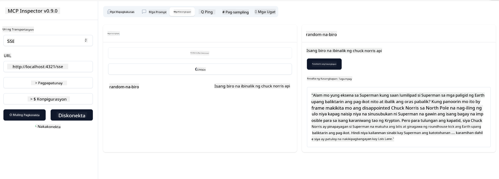

<!--
CO_OP_TRANSLATOR_METADATA:
{
  "original_hash": "0a8086dc4bf89448f83e7936db972c42",
  "translation_date": "2025-05-17T11:40:50+00:00",
  "source_file": "03-GettingStarted/05-sse-server/README.md",
  "language_code": "tl"
}
-->
Ngayon na alam na natin ang kaunti pa tungkol sa SSE, gumawa tayo ng SSE server sa susunod.

## Ehersisyo: Paglikha ng SSE Server

Upang lumikha ng ating server, kailangan nating tandaan ang dalawang bagay:

- Kailangan nating gumamit ng web server upang ilantad ang mga endpoint para sa koneksyon at mga mensahe.
- Itayo ang ating server tulad ng karaniwang ginagawa natin gamit ang mga tool, mapagkukunan, at mga prompt kapag gumagamit tayo ng stdio.

### -1- Gumawa ng instance ng server

Upang lumikha ng ating server, gagamitin natin ang parehong mga uri tulad ng sa stdio. Gayunpaman, para sa transportasyon, kailangan nating piliin ang SSE.

Magdagdag tayo ng mga kinakailangang ruta sa susunod.

### -2- Magdagdag ng mga ruta

Magdagdag tayo ng mga ruta na hahawak sa koneksyon at mga papasok na mensahe:

Magdagdag tayo ng mga kakayahan sa server sa susunod.

### -3- Pagdaragdag ng mga kakayahan ng server

Ngayon na mayroon na tayong lahat ng partikular sa SSE na natukoy, magdagdag tayo ng mga kakayahan ng server tulad ng mga tool, prompt, at mapagkukunan.

Ang iyong buong code ay dapat magmukhang ganito:

Magaling, mayroon na tayong server gamit ang SSE, subukan natin ito sa susunod.

## Ehersisyo: Pag-debug ng SSE Server gamit ang Inspector

Ang Inspector ay isang mahusay na tool na nakita natin sa nakaraang aralin [Paglikha ng iyong unang server](/03-GettingStarted/01-first-server/README.md). Tingnan natin kung magagamit natin ang Inspector kahit dito:

### -1- Pagpapatakbo ng inspector

Upang patakbuhin ang inspector, kailangan mo munang may tumatakbong SSE server, kaya gawin natin iyon sa susunod:

1. Patakbuhin ang server

1. Patakbuhin ang inspector

    > ![NOTE]
    > Patakbuhin ito sa isang hiwalay na terminal window kaysa sa tumatakbong server. Tandaan din, kailangan mong ayusin ang command sa ibaba upang magkasya sa URL kung saan tumatakbo ang iyong server.

    ```sh
    npx @modelcontextprotocol/inspector --cli http://localhost:8000/sse --method tools/list
    ```

    Ang pagpapatakbo ng inspector ay mukhang pareho sa lahat ng runtime. Pansinin kung paano sa halip na magpasa ng landas sa ating server at isang utos para sa pagsisimula ng server ay ipinapasa natin ang URL kung saan tumatakbo ang server at tinutukoy din natin ang `/sse` na ruta.

### -2- Pagsubok sa tool

Ikonekta ang server sa pamamagitan ng pagpili ng SSE sa dropdown list at punan ang field ng url kung saan tumatakbo ang iyong server, halimbawa http:localhost:4321/sse. Ngayon, i-click ang "Connect" na button. Tulad ng dati, piliin na ilista ang mga tool, pumili ng tool at magbigay ng input values. Makikita mo ang resulta tulad ng nasa ibaba:



Magaling, nagawa mong makipagtulungan sa inspector, tingnan natin kung paano natin magagamit ang Visual Studio Code sa susunod.

## Takdang Aralin

Subukan na palawakin ang iyong server na may higit pang mga kakayahan. Tingnan ang [pahinang ito](https://api.chucknorris.io/) upang halimbawa ay magdagdag ng tool na tumatawag sa isang API, ikaw ang magpasya kung ano ang magiging hitsura ng server. Mag-enjoy :)

## Solusyon

[Solusyon](./solution/README.md) Narito ang isang posibleng solusyon na may gumaganang code.

## Pangunahing Mga Takeaway

Ang mga takeaway mula sa kabanatang ito ay ang mga sumusunod:

- Ang SSE ay ang pangalawang sinusuportahang transportasyon kasunod ng stdio.
- Upang suportahan ang SSE, kailangan mong pamahalaan ang mga papasok na koneksyon at mensahe gamit ang isang web framework.
- Maaari mong gamitin ang parehong Inspector at Visual Studio Code upang gamitin ang SSE server, katulad ng stdio servers. Pansinin kung paano ito bahagyang naiiba sa pagitan ng stdio at SSE. Para sa SSE, kailangan mong i-start up ang server nang hiwalay at pagkatapos ay patakbuhin ang iyong inspector tool. Para sa inspector tool, mayroon ding ilang pagkakaiba na kailangan mong tukuyin ang URL.

## Mga Halimbawa

- [Java Calculator](../samples/java/calculator/README.md)
- [.Net Calculator](../../../../03-GettingStarted/samples/csharp)
- [JavaScript Calculator](../samples/javascript/README.md)
- [TypeScript Calculator](../samples/typescript/README.md)
- [Python Calculator](../../../../03-GettingStarted/samples/python)

## Karagdagang Mga Mapagkukunan

- [SSE](https://developer.mozilla.org/en-US/docs/Web/API/Server-sent_events)

## Ano'ng Susunod

- Susunod: [Pagsisimula sa AI Toolkit para sa VSCode](/03-GettingStarted/06-aitk/README.md)

**Paunawa**:  
Ang dokumentong ito ay isinalin gamit ang AI translation service na [Co-op Translator](https://github.com/Azure/co-op-translator). Bagaman pinagsisikapan namin ang kawastuhan, mangyaring tandaan na ang mga awtomatikong pagsasalin ay maaaring maglaman ng mga pagkakamali o hindi pagkakatugma. Ang orihinal na dokumento sa kanyang katutubong wika ay dapat ituring na ang mapagkakatiwalaang pinagmulan. Para sa mahalagang impormasyon, inirerekomenda ang propesyonal na pagsasalin ng tao. Hindi kami mananagot para sa anumang hindi pagkakaintindihan o maling interpretasyon na nagmumula sa paggamit ng pagsasaling ito.