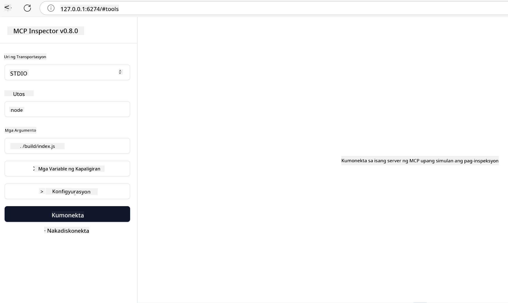

<!--
CO_OP_TRANSLATOR_METADATA:
{
  "original_hash": "717f34718a773f6cf52d8445e40a96bf",
  "translation_date": "2025-05-17T12:46:26+00:00",
  "source_file": "03-GettingStarted/07-testing/README.md",
  "language_code": "tl"
}
-->
## Pagsusuri at Pag-debug

Bago mo simulan ang pagsusuri ng iyong MCP server, mahalagang maunawaan ang mga magagamit na tools at pinakamahusay na mga kasanayan para sa pag-debug. Ang epektibong pagsusuri ay nagsisiguro na ang iyong server ay gumagana ayon sa inaasahan at tumutulong sa iyo na mabilis na matukoy at malutas ang mga isyu. Ang sumusunod na seksyon ay naglalarawan ng mga inirerekomendang pamamaraan para sa pag-validate ng iyong MCP implementation.

## Pangkalahatang-ideya

Sinasaklaw ng araling ito kung paano pumili ng tamang pamamaraan ng pagsusuri at ang pinaka-epektibong tool para sa pagsusuri.

## Mga Layunin sa Pagkatuto

Sa pagtatapos ng araling ito, magagawa mong:

- Ilarawan ang iba't ibang pamamaraan para sa pagsusuri.
- Gumamit ng iba't ibang tools upang epektibong masuri ang iyong code.

## Pagsusuri ng MCP Servers

Nagbibigay ang MCP ng mga tools upang matulungan kang masuri at i-debug ang iyong mga server:

- **MCP Inspector**: Isang command line tool na maaaring patakbuhin bilang isang CLI tool at bilang isang visual tool.
- **Manual na pagsusuri**: Maaari mong gamitin ang isang tool tulad ng curl upang magpatakbo ng mga web requests, ngunit anumang tool na may kakayahang magpatakbo ng HTTP ay pwede.
- **Unit testing**: Posible na gamitin ang iyong paboritong testing framework upang masuri ang mga tampok ng parehong server at client.

### Paggamit ng MCP Inspector

Naipaliwanag na namin ang paggamit ng tool na ito sa mga nakaraang aralin ngunit pag-usapan natin ito ng kaunti sa mataas na antas. Ito ay isang tool na binuo sa Node.js at maaari mong gamitin ito sa pamamagitan ng pagtawag sa `npx` executable na magda-download at mag-iinstall ng tool mismo pansamantala at lilinisin ang sarili nito kapag natapos na ang iyong request.

Ang [MCP Inspector](https://github.com/modelcontextprotocol/inspector) ay tumutulong sa iyo na:

- **Tuklasin ang Kakayahan ng Server**: Awtomatikong matukoy ang magagamit na mga resources, tools, at prompts
- **Subukan ang Pagpapatakbo ng Tool**: Subukan ang iba't ibang mga parameter at tingnan ang mga tugon sa real-time
- **Tingnan ang Metadata ng Server**: Suriin ang impormasyon ng server, schemas, at configurations

Ang karaniwang pagpapatakbo ng tool ay ganito:

```bash
npx @modelcontextprotocol/inspector node build/index.js
```

Sinisimulan ng command sa itaas ang MCP at ang visual na interface nito at inilulunsad ang isang lokal na web interface sa iyong browser. Maaari mong asahan na makakita ng dashboard na nagpapakita ng iyong mga nakarehistrong MCP server, kanilang mga magagamit na tools, resources, at prompts. Ang interface ay nagbibigay-daan sa iyo na interaktibong masuri ang pagpapatakbo ng tool, suriin ang metadata ng server, at tingnan ang mga tugon sa real-time, na nagpapadali sa pag-validate at pag-debug ng iyong mga MCP server implementations.

Ganito ang maaaring hitsura nito: 

Maaari mo ring patakbuhin ang tool na ito sa mode na CLI kung saan magdadagdag ka ng `--cli` na attribute. Narito ang isang halimbawa ng pagpapatakbo ng tool sa "CLI" mode na naglilista ng lahat ng mga tools sa server:

```sh
npx @modelcontextprotocol/inspector --cli node build/index.js --method tools/list
```

### Manual na Pagsusuri

Bukod sa pagpapatakbo ng inspector tool upang masuri ang kakayahan ng server, isa pang katulad na pamamaraan ay ang pagpapatakbo ng isang client na may kakayahang gumamit ng HTTP tulad ng halimbawa curl.

Sa curl, maaari mong direktang masuri ang MCP servers gamit ang HTTP requests:

```bash
# Example: Test server metadata
curl http://localhost:3000/v1/metadata

# Example: Execute a tool
curl -X POST http://localhost:3000/v1/tools/execute \
  -H "Content-Type: application/json" \
  -d '{"name": "calculator", "parameters": {"expression": "2+2"}}'
```

Tulad ng makikita mo sa itaas na paggamit ng curl, gumagamit ka ng POST request upang magpatakbo ng isang tool gamit ang isang payload na binubuo ng pangalan ng tool at ng mga parameter nito. Gamitin ang pamamaraan na pinaka-angkop para sa iyo. Ang mga CLI tools sa pangkalahatan ay mas mabilis gamitin at nagagawang scripted na maaaring maging kapaki-pakinabang sa isang CI/CD environment.

### Unit Testing

Lumikha ng mga unit tests para sa iyong mga tools at resources upang matiyak na gumagana ang mga ito ayon sa inaasahan. Narito ang ilang halimbawa ng testing code.

```python
import pytest

from mcp.server.fastmcp import FastMCP
from mcp.shared.memory import (
    create_connected_server_and_client_session as create_session,
)

# Mark the whole module for async tests
pytestmark = pytest.mark.anyio


async def test_list_tools_cursor_parameter():
    """Test that the cursor parameter is accepted for list_tools.

    Note: FastMCP doesn't currently implement pagination, so this test
    only verifies that the cursor parameter is accepted by the client.
    """

 server = FastMCP("test")

    # Create a couple of test tools
    @server.tool(name="test_tool_1")
    async def test_tool_1() -> str:
        """First test tool"""
        return "Result 1"

    @server.tool(name="test_tool_2")
    async def test_tool_2() -> str:
        """Second test tool"""
        return "Result 2"

    async with create_session(server._mcp_server) as client_session:
        # Test without cursor parameter (omitted)
        result1 = await client_session.list_tools()
        assert len(result1.tools) == 2

        # Test with cursor=None
        result2 = await client_session.list_tools(cursor=None)
        assert len(result2.tools) == 2

        # Test with cursor as string
        result3 = await client_session.list_tools(cursor="some_cursor_value")
        assert len(result3.tools) == 2

        # Test with empty string cursor
        result4 = await client_session.list_tools(cursor="")
        assert len(result4.tools) == 2
    
```

Ang naunang code ay ginagawa ang mga sumusunod:

- Gumagamit ng pytest framework na nagbibigay-daan sa iyo na lumikha ng mga tests bilang mga function at gumamit ng assert statements.
- Lumilikha ng isang MCP Server na may dalawang magkaibang tools.
- Gumagamit ng `assert` statement upang suriin na ang ilang mga kondisyon ay natutupad.

Tingnan ang [buong file dito](https://github.com/modelcontextprotocol/python-sdk/blob/main/tests/client/test_list_methods_cursor.py)

Dahil sa nasa itaas na file, maaari mong masuri ang iyong sariling server upang matiyak na ang mga kakayahan ay nalilikha ayon sa nararapat.

Ang lahat ng pangunahing SDKs ay may katulad na mga seksyon ng pagsusuri kaya maaari mong i-adjust sa iyong napiling runtime.

## Mga Halimbawa

- [Java Calculator](../samples/java/calculator/README.md)
- [.Net Calculator](../../../../03-GettingStarted/samples/csharp)
- [JavaScript Calculator](../samples/javascript/README.md)
- [TypeScript Calculator](../samples/typescript/README.md)
- [Python Calculator](../../../../03-GettingStarted/samples/python)

## Karagdagang Resources

- [Python SDK](https://github.com/modelcontextprotocol/python-sdk)

## Ano ang Susunod

- Susunod: [Deployment](/03-GettingStarted/08-deployment/README.md)

**Pagtatatuwa**:
Ang dokumentong ito ay isinalin gamit ang AI na serbisyo sa pagsasalin [Co-op Translator](https://github.com/Azure/co-op-translator). Bagaman nagsusumikap kami para sa kawastuhan, pakitandaan na ang awtomatikong pagsasalin ay maaaring maglaman ng mga pagkakamali o hindi tumpak na impormasyon. Ang orihinal na dokumento sa kanyang katutubong wika ay dapat ituring na awtoritatibong pinagmulan. Para sa kritikal na impormasyon, inirerekomenda ang propesyonal na pagsasalin ng tao. Kami ay hindi mananagot para sa anumang hindi pagkakaintindihan o maling interpretasyon na nagmumula sa paggamit ng pagsasaling ito.