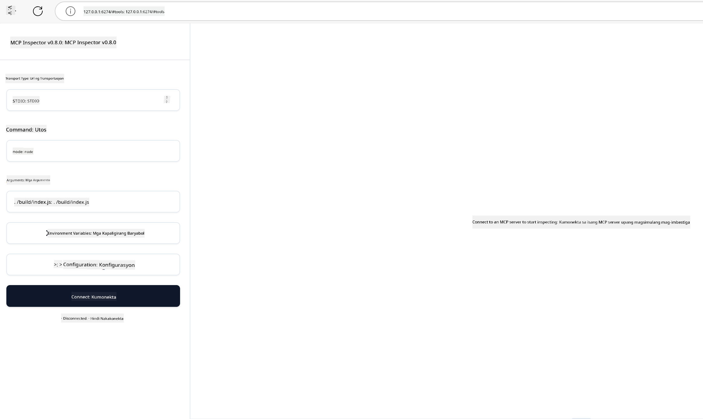

<!--
CO_OP_TRANSLATOR_METADATA:
{
  "original_hash": "4e34e34e84f013e73c7eaa6d09884756",
  "translation_date": "2025-07-13T22:02:45+00:00",
  "source_file": "03-GettingStarted/08-testing/README.md",
  "language_code": "tl"
}
-->
## Testing at Pag-debug

Bago ka magsimulang mag-test ng iyong MCP server, mahalagang maintindihan ang mga available na tools at mga pinakamahusay na paraan para mag-debug. Ang epektibong testing ay nagsisiguro na ang iyong server ay gumagana ayon sa inaasahan at tumutulong sa mabilis na pagtukoy at pag-aayos ng mga isyu. Ang sumusunod na seksyon ay naglalahad ng mga inirerekomendang pamamaraan para sa pag-validate ng iyong MCP implementation.

## Pangkalahatang-ideya

Tinutukoy ng araling ito kung paano pumili ng tamang paraan ng testing at ang pinakaepektibong testing tool.

## Mga Layunin sa Pagkatuto

Sa pagtatapos ng araling ito, magagawa mong:

- Ilarawan ang iba't ibang pamamaraan para sa testing.
- Gumamit ng iba't ibang tools upang epektibong matest ang iyong code.

## Pagsusuri ng MCP Servers

Nagbibigay ang MCP ng mga tools upang matulungan kang mag-test at mag-debug ng iyong mga server:

- **MCP Inspector**: Isang command line tool na maaaring patakbuhin bilang CLI tool o bilang visual tool.
- **Manwal na testing**: Maaari kang gumamit ng tool tulad ng curl para magpadala ng web requests, ngunit anumang tool na kayang magpatakbo ng HTTP ay pwede.
- **Unit testing**: Posible ring gamitin ang paborito mong testing framework para subukan ang mga features ng parehong server at client.

### Paggamit ng MCP Inspector

Nailarawan na namin ang paggamit ng tool na ito sa mga naunang aralin ngunit pag-usapan natin ito nang bahagya sa mataas na antas. Ito ay isang tool na ginawa gamit ang Node.js at magagamit mo ito sa pamamagitan ng pagtawag sa `npx` executable na magda-download at mag-iinstall ng tool nang pansamantala at lilinisin ang sarili kapag natapos na ang iyong request.

Ang [MCP Inspector](https://github.com/modelcontextprotocol/inspector) ay tumutulong sa iyo na:

- **Matuklasan ang Kakayahan ng Server**: Awtomatikong tuklasin ang mga available na resources, tools, at prompts
- **Subukan ang Pagpapatakbo ng Tool**: Subukan ang iba't ibang parameters at tingnan ang mga tugon nang real-time
- **Tingnan ang Metadata ng Server**: Suriin ang impormasyon ng server, mga schema, at mga configuration

Ganito ang karaniwang hitsura ng pagpapatakbo ng tool:

```bash
npx @modelcontextprotocol/inspector node build/index.js
```

Ang utos sa itaas ay nagsisimula ng MCP at ang visual interface nito at nagbubukas ng lokal na web interface sa iyong browser. Makikita mo ang dashboard na nagpapakita ng iyong mga rehistradong MCP servers, ang kanilang mga available na tools, resources, at prompts. Pinapayagan ka ng interface na ito na interaktibong subukan ang pagpapatakbo ng mga tool, suriin ang metadata ng server, at tingnan ang mga tugon nang real-time, na nagpapadali sa pag-validate at pag-debug ng iyong mga MCP server implementations.

Ganito ang maaaring itsura nito: 

Maaari mo ring patakbuhin ang tool na ito sa CLI mode kung saan idinadagdag mo ang `--cli` na attribute. Narito ang halimbawa ng pagpapatakbo ng tool sa "CLI" mode na naglilista ng lahat ng tools sa server:

```sh
npx @modelcontextprotocol/inspector --cli node build/index.js --method tools/list
```

### Manwal na Testing

Bukod sa pagpapatakbo ng inspector tool para subukan ang kakayahan ng server, isa pang katulad na paraan ay ang pagpapatakbo ng client na kayang gumamit ng HTTP tulad ng curl.

Sa curl, maaari mong direktang subukan ang MCP servers gamit ang HTTP requests:

```bash
# Example: Test server metadata
curl http://localhost:3000/v1/metadata

# Example: Execute a tool
curl -X POST http://localhost:3000/v1/tools/execute \
  -H "Content-Type: application/json" \
  -d '{"name": "calculator", "parameters": {"expression": "2+2"}}'
```

Tulad ng makikita sa paggamit ng curl sa itaas, gumagamit ka ng POST request para tawagin ang isang tool gamit ang payload na binubuo ng pangalan ng tool at mga parameters nito. Piliin ang paraan na pinakaangkop sa iyo. Karaniwan, mas mabilis gamitin ang mga CLI tools at madali rin silang gawing script na kapaki-pakinabang sa CI/CD na kapaligiran.

### Unit Testing

Gumawa ng unit tests para sa iyong mga tools at resources upang matiyak na gumagana ang mga ito ayon sa inaasahan. Narito ang ilang halimbawa ng testing code.

```python
import pytest

from mcp.server.fastmcp import FastMCP
from mcp.shared.memory import (
    create_connected_server_and_client_session as create_session,
)

# Mark the whole module for async tests
pytestmark = pytest.mark.anyio


async def test_list_tools_cursor_parameter():
    """Test that the cursor parameter is accepted for list_tools.

    Note: FastMCP doesn't currently implement pagination, so this test
    only verifies that the cursor parameter is accepted by the client.
    """

 server = FastMCP("test")

    # Create a couple of test tools
    @server.tool(name="test_tool_1")
    async def test_tool_1() -> str:
        """First test tool"""
        return "Result 1"

    @server.tool(name="test_tool_2")
    async def test_tool_2() -> str:
        """Second test tool"""
        return "Result 2"

    async with create_session(server._mcp_server) as client_session:
        # Test without cursor parameter (omitted)
        result1 = await client_session.list_tools()
        assert len(result1.tools) == 2

        # Test with cursor=None
        result2 = await client_session.list_tools(cursor=None)
        assert len(result2.tools) == 2

        # Test with cursor as string
        result3 = await client_session.list_tools(cursor="some_cursor_value")
        assert len(result3.tools) == 2

        # Test with empty string cursor
        result4 = await client_session.list_tools(cursor="")
        assert len(result4.tools) == 2
    
```

Ang code sa itaas ay:

- Gumagamit ng pytest framework na nagpapahintulot sa iyo na gumawa ng mga tests bilang mga function at gumamit ng assert statements.
- Lumilikha ng MCP Server na may dalawang magkaibang tools.
- Gumagamit ng `assert` statement upang suriin kung natutugunan ang ilang mga kondisyon.

Tingnan ang [buong file dito](https://github.com/modelcontextprotocol/python-sdk/blob/main/tests/client/test_list_methods_cursor.py)

Sa pamamagitan ng file na ito, maaari mong subukan ang sarili mong server upang matiyak na ang mga kakayahan ay nalilikha ayon sa dapat.

Lahat ng pangunahing SDK ay may katulad na mga seksyon para sa testing kaya maaari mong i-adjust ito sa iyong piniling runtime.

## Mga Halimbawa

- [Java Calculator](../samples/java/calculator/README.md)
- [.Net Calculator](../../../../03-GettingStarted/samples/csharp)
- [JavaScript Calculator](../samples/javascript/README.md)
- [TypeScript Calculator](../samples/typescript/README.md)
- [Python Calculator](../../../../03-GettingStarted/samples/python)

## Karagdagang Mga Mapagkukunan

- [Python SDK](https://github.com/modelcontextprotocol/python-sdk)

## Ano ang Susunod

- Susunod: [Deployment](../09-deployment/README.md)

**Paalala**:  
Ang dokumentong ito ay isinalin gamit ang AI translation service na [Co-op Translator](https://github.com/Azure/co-op-translator). Bagamat nagsusumikap kami para sa katumpakan, pakatandaan na ang mga awtomatikong pagsasalin ay maaaring maglaman ng mga pagkakamali o di-tumpak na impormasyon. Ang orihinal na dokumento sa orihinal nitong wika ang dapat ituring na pangunahing sanggunian. Para sa mahahalagang impormasyon, inirerekomenda ang propesyonal na pagsasalin ng tao. Hindi kami mananagot sa anumang hindi pagkakaunawaan o maling interpretasyon na maaaring magmula sa paggamit ng pagsasaling ito.