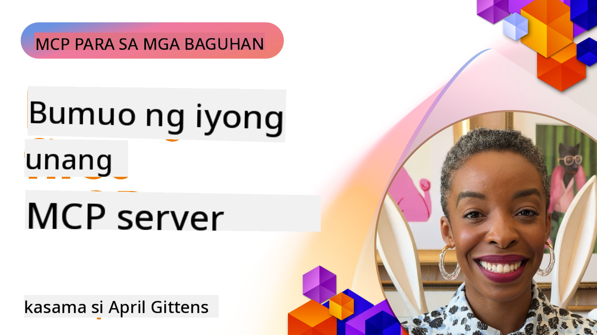

<!--
CO_OP_TRANSLATOR_METADATA:
{
  "original_hash": "858362ce0118de3fec0f9114bf396101",
  "translation_date": "2025-08-18T18:22:41+00:00",
  "source_file": "03-GettingStarted/README.md",
  "language_code": "tl"
}
-->
## Pagsisimula  

_(I-click ang imahe sa itaas upang mapanood ang video ng araling ito)_

Ang seksyong ito ay binubuo ng ilang mga aralin:

- **1 Ang iyong unang server**, sa unang araling ito, matututunan mo kung paano gumawa ng iyong unang server at suriin ito gamit ang inspector tool, isang mahalagang paraan upang subukan at i-debug ang iyong server, [sa aralin](01-first-server/README.md)

- **2 Client**, sa araling ito, matututunan mo kung paano magsulat ng client na maaaring kumonekta sa iyong server, [sa aralin](02-client/README.md)

- **3 Client na may LLM**, isang mas mahusay na paraan ng pagsulat ng client ay sa pamamagitan ng pagdaragdag ng LLM upang ito ay makipag-"negotiate" sa iyong server kung ano ang gagawin, [sa aralin](03-llm-client/README.md)

- **4 Paggamit ng server sa GitHub Copilot Agent mode sa Visual Studio Code**. Dito, tatalakayin natin ang pagpapatakbo ng MCP Server mula sa loob ng Visual Studio Code, [sa aralin](04-vscode/README.md)

- **5 Paggamit mula sa SSE (Server Sent Events)** Ang SSE ay isang pamantayan para sa server-to-client streaming, na nagbibigay-daan sa mga server na mag-push ng real-time na updates sa mga client gamit ang HTTP [sa aralin](05-sse-server/README.md)

- **6 HTTP Streaming gamit ang MCP (Streamable HTTP)**. Matutunan ang modernong HTTP streaming, progress notifications, at kung paano magpatupad ng scalable, real-time MCP servers at clients gamit ang Streamable HTTP. [sa aralin](06-http-streaming/README.md)

- **7 Paggamit ng AI Toolkit para sa VSCode** upang gamitin at subukan ang iyong MCP Clients at Servers [sa aralin](07-aitk/README.md)

- **8 Pagsusuri**. Dito, magpo-focus tayo kung paano masusubukan ang iyong server at client sa iba't ibang paraan, [sa aralin](08-testing/README.md)

- **9 Deployment**. Ang kabanatang ito ay tatalakayin ang iba't ibang paraan ng pag-deploy ng iyong MCP solutions, [sa aralin](09-deployment/README.md)

Ang Model Context Protocol (MCP) ay isang open protocol na nag-i-standardize kung paano nagbibigay ng context ang mga application sa LLMs. Isipin ang MCP na parang USB-C port para sa AI applications - nagbibigay ito ng standardized na paraan upang ikonekta ang AI models sa iba't ibang data sources at tools.

## Mga Layunin sa Pag-aaral

Sa pagtatapos ng araling ito, magagawa mo ang sumusunod:

- Mag-set up ng development environments para sa MCP gamit ang C#, Java, Python, TypeScript, at JavaScript
- Bumuo at mag-deploy ng mga basic MCP servers na may custom na features (resources, prompts, at tools)
- Gumawa ng host applications na kumokonekta sa MCP servers
- Subukan at i-debug ang mga MCP implementations
- Maunawaan ang mga karaniwang hamon sa setup at ang kanilang mga solusyon
- Ikonekta ang iyong MCP implementations sa mga sikat na LLM services

## Pag-set Up ng Iyong MCP Environment

Bago ka magsimula sa MCP, mahalagang ihanda ang iyong development environment at maunawaan ang basic workflow. Ang seksyong ito ay gagabay sa iyo sa mga unang hakbang ng setup upang masigurado ang maayos na simula sa MCP.

### Mga Kinakailangan

Bago sumabak sa MCP development, siguraduhing mayroon ka ng mga sumusunod:

- **Development Environment**: Para sa napiling programming language (C#, Java, Python, TypeScript, o JavaScript)
- **IDE/Editor**: Visual Studio, Visual Studio Code, IntelliJ, Eclipse, PyCharm, o anumang modernong code editor
- **Package Managers**: NuGet, Maven/Gradle, pip, o npm/yarn
- **API Keys**: Para sa anumang AI services na balak mong gamitin sa iyong host applications

### Opisyal na SDKs

Sa mga susunod na kabanata, makikita mo ang mga solusyon na ginawa gamit ang Python, TypeScript, Java, at .NET. Narito ang lahat ng opisyal na suportadong SDKs.

Ang MCP ay nagbibigay ng opisyal na SDKs para sa iba't ibang programming languages:
- [C# SDK](https://github.com/modelcontextprotocol/csharp-sdk) - Pinapanatili sa pakikipagtulungan sa Microsoft
- [Java SDK](https://github.com/modelcontextprotocol/java-sdk) - Pinapanatili sa pakikipagtulungan sa Spring AI
- [TypeScript SDK](https://github.com/modelcontextprotocol/typescript-sdk) - Ang opisyal na TypeScript implementation
- [Python SDK](https://github.com/modelcontextprotocol/python-sdk) - Ang opisyal na Python implementation
- [Kotlin SDK](https://github.com/modelcontextprotocol/kotlin-sdk) - Ang opisyal na Kotlin implementation
- [Swift SDK](https://github.com/modelcontextprotocol/swift-sdk) - Pinapanatili sa pakikipagtulungan sa Loopwork AI
- [Rust SDK](https://github.com/modelcontextprotocol/rust-sdk) - Ang opisyal na Rust implementation

## Mahahalagang Puntos

- Ang pag-set up ng MCP development environment ay simple gamit ang language-specific SDKs
- Ang paggawa ng MCP servers ay nangangailangan ng paglikha at pagrehistro ng tools na may malinaw na schemas
- Ang MCP clients ay kumokonekta sa servers at models upang magamit ang mas pinalawak na kakayahan
- Ang pagsusuri at pag-debug ay mahalaga para sa maaasahang MCP implementations
- Ang mga opsyon sa deployment ay mula sa lokal na development hanggang sa cloud-based solutions

## Pagsasanay

Mayroon kaming set ng mga sample na sumusuporta sa mga exercises na makikita mo sa lahat ng kabanata sa seksyong ito. Bukod dito, ang bawat kabanata ay may kani-kaniyang exercises at assignments.

- [Java Calculator](./samples/java/calculator/README.md)
- [.Net Calculator](../../../03-GettingStarted/samples/csharp)
- [JavaScript Calculator](./samples/javascript/README.md)
- [TypeScript Calculator](./samples/typescript/README.md)
- [Python Calculator](../../../03-GettingStarted/samples/python)

## Karagdagang Resources

- [Bumuo ng Agents gamit ang Model Context Protocol sa Azure](https://learn.microsoft.com/azure/developer/ai/intro-agents-mcp)
- [Remote MCP gamit ang Azure Container Apps (Node.js/TypeScript/JavaScript)](https://learn.microsoft.com/samples/azure-samples/mcp-container-ts/mcp-container-ts/)
- [.NET OpenAI MCP Agent](https://learn.microsoft.com/samples/azure-samples/openai-mcp-agent-dotnet/openai-mcp-agent-dotnet/)

## Ano ang susunod

Susunod: [Paglikha ng iyong unang MCP Server](01-first-server/README.md)

**Paunawa**:  
Ang dokumentong ito ay isinalin gamit ang AI translation service na [Co-op Translator](https://github.com/Azure/co-op-translator). Bagama't sinisikap naming maging tumpak, pakitandaan na ang mga awtomatikong pagsasalin ay maaaring maglaman ng mga pagkakamali o hindi pagkakatugma. Ang orihinal na dokumento sa kanyang katutubong wika ang dapat ituring na opisyal na sanggunian. Para sa mahalagang impormasyon, inirerekomenda ang propesyonal na pagsasalin ng tao. Hindi kami mananagot sa anumang hindi pagkakaunawaan o maling interpretasyon na maaaring magmula sa paggamit ng pagsasaling ito.