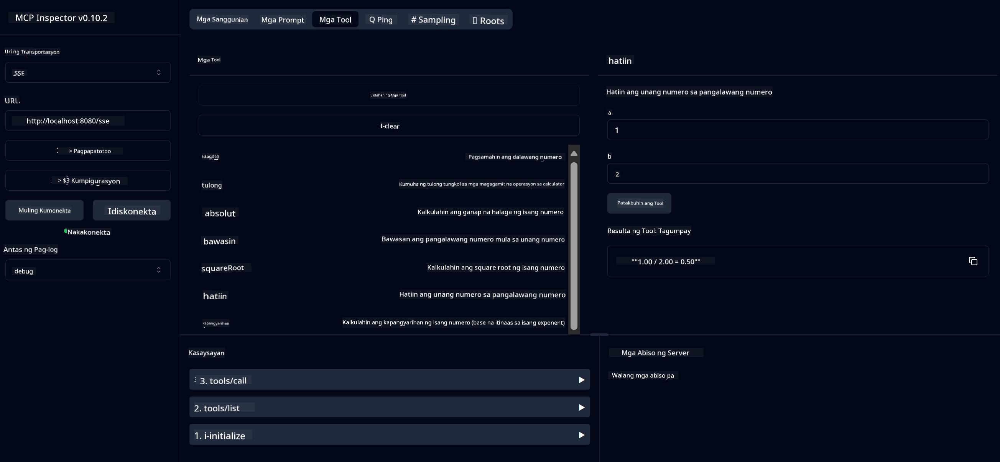

<!--
CO_OP_TRANSLATOR_METADATA:
{
  "original_hash": "13231e9951b68efd9df8c56bd5cdb27e",
  "translation_date": "2025-05-17T13:15:42+00:00",
  "source_file": "03-GettingStarted/samples/java/calculator/README.md",
  "language_code": "tl"
}
-->
# Basic Calculator MCP Service

Ang serbisyong ito ay nagbibigay ng mga pangunahing operasyon ng calculator sa pamamagitan ng Model Context Protocol (MCP) gamit ang Spring Boot na may WebFlux transport. Ito ay idinisenyo bilang isang simpleng halimbawa para sa mga baguhan na nag-aaral tungkol sa mga implementasyon ng MCP.

Para sa karagdagang impormasyon, tingnan ang [MCP Server Boot Starter](https://docs.spring.io/spring-ai/reference/api/mcp/mcp-server-boot-starter-docs.html) reference documentation.

## Pangkalahatang-ideya

Ipinapakita ng serbisyong ito:
- Suporta para sa SSE (Server-Sent Events)
- Awtomatikong pagpaparehistro ng tool gamit ang Spring AI's `@Tool` annotation
- Mga pangunahing calculator na function:
  - Pagdaragdag, pagbabawas, pagpaparami, paghahati
  - Pagkalkula ng power at square root
  - Modulus (remainder) at absolute value
  - Help function para sa mga paglalarawan ng operasyon

## Mga Tampok

Ang serbisyong calculator na ito ay nag-aalok ng mga sumusunod na kakayahan:

1. **Pangunahing Arithmetic Operations**:
   - Pagdaragdag ng dalawang numero
   - Pagbabawas ng isang numero mula sa isa pa
   - Pagpaparami ng dalawang numero
   - Paghahati ng isang numero sa isa pa (may check para sa zero division)

2. **Advanced Operations**:
   - Pagkalkula ng power (pagtaas ng base sa exponent)
   - Pagkalkula ng square root (may check para sa negatibong numero)
   - Pagkalkula ng modulus (remainder)
   - Pagkalkula ng absolute value

3. **Help System**:
   - Nakapaloob na help function na nagpapaliwanag ng lahat ng available na operasyon

## Paggamit ng Serbisyo

Ang serbisyo ay naglalantad ng mga sumusunod na API endpoints sa pamamagitan ng MCP protocol:

- `add(a, b)`: Magdagdag ng dalawang numero
- `subtract(a, b)`: Bawasan ang pangalawang numero mula sa una
- `multiply(a, b)`: Paramihin ang dalawang numero
- `divide(a, b)`: Hatiin ang unang numero sa pangalawa (may check para sa zero)
- `power(base, exponent)`: Kalkulahin ang power ng isang numero
- `squareRoot(number)`: Kalkulahin ang square root (may check para sa negatibong numero)
- `modulus(a, b)`: Kalkulahin ang remainder kapag naghahati
- `absolute(number)`: Kalkulahin ang absolute value
- `help()`: Kumuha ng impormasyon tungkol sa mga available na operasyon

## Test Client

Kasama ang isang simpleng test client sa `com.microsoft.mcp.sample.client` package. Ipinapakita ng `SampleCalculatorClient` class ang mga available na operasyon ng serbisyong calculator.

## Paggamit ng LangChain4j Client

Kasama sa proyekto ang isang LangChain4j example client sa `com.microsoft.mcp.sample.client.LangChain4jClient` na nagpapakita kung paano i-integrate ang serbisyong calculator sa LangChain4j at GitHub models:

### Mga Kinakailangan

1. **GitHub Token Setup**:
   
   Para magamit ang mga AI models ng GitHub (tulad ng phi-4), kailangan mo ng GitHub personal access token:

   a. Pumunta sa mga setting ng iyong GitHub account: https://github.com/settings/tokens
   
   b. I-click ang "Generate new token" → "Generate new token (classic)"
   
   c. Bigyan ang iyong token ng isang deskriptibong pangalan
   
   d. Piliin ang mga sumusunod na scopes:
      - `repo` (Buong kontrol ng mga pribadong repository)
      - `read:org` (Basahin ang org at team membership, basahin ang mga org project)
      - `gist` (Lumikha ng gists)
      - `user:email` (I-access ang mga email address ng user (read-only))
   
   e. I-click ang "Generate token" at kopyahin ang iyong bagong token
   
   f. Itakda ito bilang isang environment variable:
      
      Sa Windows:
      ```
      set GITHUB_TOKEN=your-github-token
      ```
      
      Sa macOS/Linux:
      ```bash
      export GITHUB_TOKEN=your-github-token
      ```

   g. Para sa permanenteng setup, idagdag ito sa iyong environment variables sa pamamagitan ng mga setting ng sistema

2. Idagdag ang LangChain4j GitHub dependency sa iyong proyekto (kasama na sa pom.xml):
   ```xml
   <dependency>
       <groupId>dev.langchain4j</groupId>
       <artifactId>langchain4j-github</artifactId>
       <version>${langchain4j.version}</version>
   </dependency>
   ```

3. Siguraduhin na ang calculator server ay tumatakbo sa `localhost:8080`

### Pagpapatakbo ng LangChain4j Client

Ang halimbawa na ito ay nagpapakita:
- Pagkonekta sa calculator MCP server sa pamamagitan ng SSE transport
- Paggamit ng LangChain4j para lumikha ng isang chat bot na gumagamit ng mga operasyon ng calculator
- Pag-integrate sa GitHub AI models (ngayon ay gumagamit ng phi-4 model)

Ang client ay nagpapadala ng mga sumusunod na sample na query para ipakita ang functionality:
1. Pagkalkula ng kabuuan ng dalawang numero
2. Paghahanap ng square root ng isang numero
3. Pagkuha ng impormasyon tungkol sa mga available na operasyon ng calculator

Patakbuhin ang halimbawa at tingnan ang console output para makita kung paano ginagamit ng AI model ang mga calculator tools para tumugon sa mga query.

### Konfigurasyon ng GitHub Model

Ang LangChain4j client ay nakakonfigurasyon upang gamitin ang phi-4 model ng GitHub na may mga sumusunod na setting:

```java
ChatLanguageModel model = GitHubChatModel.builder()
    .apiKey(System.getenv("GITHUB_TOKEN"))
    .timeout(Duration.ofSeconds(60))
    .modelName("phi-4")
    .logRequests(true)
    .logResponses(true)
    .build();
```

Para gamitin ang iba't ibang GitHub models, palitan lamang ang `modelName` parameter sa ibang suportadong model (hal. "claude-3-haiku-20240307", "llama-3-70b-8192", etc.).

## Mga Depende

Ang proyekto ay nangangailangan ng mga sumusunod na pangunahing depende:

```xml
<!-- For MCP Server -->
<dependency>
    <groupId>org.springframework.ai</groupId>
    <artifactId>spring-ai-starter-mcp-server-webflux</artifactId>
</dependency>

<!-- For LangChain4j integration -->
<dependency>
    <groupId>dev.langchain4j</groupId>
    <artifactId>langchain4j-mcp</artifactId>
    <version>${langchain4j.version}</version>
</dependency>

<!-- For GitHub models support -->
<dependency>
    <groupId>dev.langchain4j</groupId>
    <artifactId>langchain4j-github</artifactId>
    <version>${langchain4j.version}</version>
</dependency>
```

## Pagbuo ng Proyekto

Buuin ang proyekto gamit ang Maven:
```bash
./mvnw clean install -DskipTests
```

## Pagpapatakbo ng Server

### Gamit ang Java

```bash
java -jar target/calculator-server-0.0.1-SNAPSHOT.jar
```

### Gamit ang MCP Inspector

Ang MCP Inspector ay isang kapaki-pakinabang na tool para sa pakikipag-ugnayan sa mga MCP services. Upang gamitin ito sa serbisyong calculator na ito:

1. **I-install at patakbuhin ang MCP Inspector** sa isang bagong terminal window:
   ```bash
   npx @modelcontextprotocol/inspector
   ```

2. **I-access ang web UI** sa pamamagitan ng pag-click sa URL na ipinapakita ng app (karaniwan ay http://localhost:6274)

3. **I-configure ang koneksyon**:
   - Itakda ang uri ng transport sa "SSE"
   - Itakda ang URL sa iyong tumatakbong server's SSE endpoint: `http://localhost:8080/sse`
   - I-click ang "Connect"

4. **Gamitin ang mga tools**:
   - I-click ang "List Tools" para makita ang mga available na operasyon ng calculator
   - Piliin ang isang tool at i-click ang "Run Tool" para isagawa ang isang operasyon



### Gamit ang Docker

Kasama sa proyekto ang isang Dockerfile para sa containerized deployment:

1. **Buuin ang Docker image**:
   ```bash
   docker build -t calculator-mcp-service .
   ```

2. **Patakbuhin ang Docker container**:
   ```bash
   docker run -p 8080:8080 calculator-mcp-service
   ```

Ito ay:
- Bubuo ng isang multi-stage Docker image gamit ang Maven 3.9.9 at Eclipse Temurin 24 JDK
- Lilikha ng isang optimized container image
- I-expose ang serbisyo sa port 8080
- Simulan ang MCP calculator service sa loob ng container

Maaari mong i-access ang serbisyo sa `http://localhost:8080` kapag ang container ay tumatakbo na.

## Pag-troubleshoot

### Mga Karaniwang Isyu sa GitHub Token

1. **Token Permission Issues**: Kung nakakuha ka ng 403 Forbidden error, i-check na ang iyong token ay may tamang mga permiso ayon sa mga kinakailangan.

2. **Token Not Found**: Kung nakakuha ka ng "No API key found" error, siguraduhin na ang GITHUB_TOKEN environment variable ay tama ang pagkakaset.

3. **Rate Limiting**: May mga rate limit ang GitHub API. Kung nakakaranas ka ng rate limit error (status code 429), maghintay ng ilang minuto bago subukang muli.

4. **Token Expiration**: Ang mga GitHub tokens ay maaaring mag-expire. Kung nakatanggap ka ng authentication errors matapos ang ilang panahon, bumuo ng bagong token at i-update ang iyong environment variable.

Kung kailangan mo ng karagdagang tulong, tingnan ang [LangChain4j documentation](https://github.com/langchain4j/langchain4j) o [GitHub API documentation](https://docs.github.com/en/rest).

**Pagtatatuwa**:
Ang dokumentong ito ay isinalin gamit ang AI translation service [Co-op Translator](https://github.com/Azure/co-op-translator). Bagama't nagsusumikap kami para sa katumpakan, mangyaring tandaan na ang mga awtomatikong pagsasalin ay maaaring maglaman ng mga error o hindi pagkaka-tugma. Ang orihinal na dokumento sa sariling wika nito ay dapat ituring na mapagkakatiwalaang pinagmulan. Para sa kritikal na impormasyon, inirerekomenda ang propesyonal na pagsasalin ng tao. Hindi kami mananagot para sa anumang hindi pagkakaintindihan o maling interpretasyon na dulot ng paggamit ng pagsasaling ito.