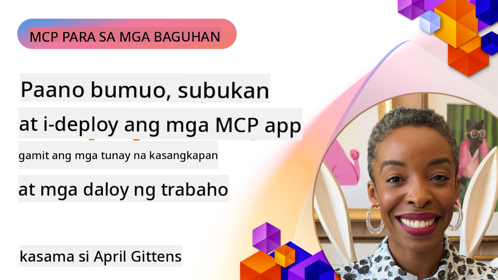

<!--
CO_OP_TRANSLATOR_METADATA:
{
  "original_hash": "83efa75a69bc831277263a6f1ae53669",
  "translation_date": "2025-08-18T18:12:53+00:00",
  "source_file": "04-PracticalImplementation/README.md",
  "language_code": "tl"
}
-->
# Praktikal na Implementasyon

[](https://youtu.be/vCN9-mKBDfQ)

_(I-click ang larawan sa itaas upang panoorin ang video ng araling ito)_

Ang praktikal na implementasyon ang nagpapakita ng tunay na kapangyarihan ng Model Context Protocol (MCP). Bagama't mahalaga ang pag-unawa sa teorya at arkitektura ng MCP, ang tunay na halaga nito ay lumalabas kapag naipapatupad mo ang mga konseptong ito upang bumuo, subukan, at i-deploy ang mga solusyon na tumutugon sa mga totoong problema. Ang kabanatang ito ay nag-uugnay sa pagitan ng kaalamang konseptwal at aktwal na pag-develop, na gagabay sa iyo sa proseso ng pagbibigay-buhay sa mga MCP-based na aplikasyon.

Kung ikaw man ay nagde-develop ng mga intelligent assistants, nag-iintegrate ng AI sa mga workflow ng negosyo, o bumubuo ng mga custom na tool para sa pagproseso ng data, ang MCP ay nagbibigay ng flexible na pundasyon. Ang disenyo nitong hindi nakadepende sa wika at ang mga opisyal na SDK para sa mga sikat na programming language ay ginagawa itong madaling ma-access ng iba't ibang uri ng developer. Sa pamamagitan ng paggamit ng mga SDK na ito, maaari kang mabilis na mag-prototype, mag-iterate, at mag-scale ng iyong mga solusyon sa iba't ibang platform at kapaligiran.

Sa mga sumusunod na seksyon, makakakita ka ng mga praktikal na halimbawa, sample code, at mga estratehiya sa pag-deploy na nagpapakita kung paano i-implement ang MCP sa C#, Java gamit ang Spring, TypeScript, JavaScript, at Python. Matututuhan mo rin kung paano mag-debug at mag-test ng mga MCP server, mag-manage ng mga API, at mag-deploy ng mga solusyon sa cloud gamit ang Azure. Ang mga hands-on na resources na ito ay idinisenyo upang pabilisin ang iyong pagkatuto at tulungan kang magtayo ng matibay at production-ready na MCP applications nang may kumpiyansa.

## Pangkalahatang-ideya

Ang araling ito ay nakatuon sa mga praktikal na aspeto ng implementasyon ng MCP sa iba't ibang programming language. Tatalakayin natin kung paano gamitin ang mga MCP SDK sa C#, Java gamit ang Spring, TypeScript, JavaScript, at Python upang bumuo ng matibay na aplikasyon, mag-debug at mag-test ng mga MCP server, at lumikha ng mga reusable na resources, prompts, at tools.

## Mga Layunin sa Pagkatuto

Sa pagtatapos ng araling ito, magagawa mo ang sumusunod:

- Mag-implement ng mga MCP solution gamit ang mga opisyal na SDK sa iba't ibang programming language
- Sistematikong mag-debug at mag-test ng mga MCP server
- Lumikha at gumamit ng mga feature ng server (Resources, Prompts, at Tools)
- Magdisenyo ng epektibong MCP workflows para sa mga komplikadong gawain
- I-optimize ang mga implementasyon ng MCP para sa performance at reliability

## Mga Opisyal na Resource ng SDK

Ang Model Context Protocol ay nag-aalok ng mga opisyal na SDK para sa iba't ibang wika:

- [C# SDK](https://github.com/modelcontextprotocol/csharp-sdk)
- [Java gamit ang Spring SDK](https://github.com/modelcontextprotocol/java-sdk) **Tandaan:** nangangailangan ng dependency sa [Project Reactor](https://projectreactor.io). (Tingnan ang [discussion issue 246](https://github.com/orgs/modelcontextprotocol/discussions/246).)
- [TypeScript SDK](https://github.com/modelcontextprotocol/typescript-sdk)
- [Python SDK](https://github.com/modelcontextprotocol/python-sdk)
- [Kotlin SDK](https://github.com/modelcontextprotocol/kotlin-sdk)

## Paggamit ng MCP SDKs

Ang seksyong ito ay nagbibigay ng mga praktikal na halimbawa ng implementasyon ng MCP sa iba't ibang programming language. Makikita mo ang mga sample code sa direktoryong `samples` na nakaayos ayon sa wika.

### Mga Available na Sample

Ang repository ay naglalaman ng [mga sample na implementasyon](../../../04-PracticalImplementation/samples) sa mga sumusunod na wika:

- [C#](./samples/csharp/README.md)
- [Java gamit ang Spring](./samples/java/containerapp/README.md)
- [TypeScript](./samples/typescript/README.md)
- [JavaScript](./samples/javascript/README.md)
- [Python](./samples/python/README.md)

Ang bawat sample ay nagpapakita ng mga pangunahing konsepto ng MCP at mga pattern ng implementasyon para sa partikular na wika at ecosystem.

## Mga Pangunahing Feature ng Server

Ang mga MCP server ay maaaring mag-implement ng anumang kombinasyon ng mga feature na ito:

### Resources

Ang mga resource ay nagbibigay ng konteksto at data na maaaring gamitin ng user o AI model:

- Mga repositoryo ng dokumento
- Mga knowledge base
- Mga structured data source
- Mga file system

### Prompts

Ang mga prompt ay mga templated na mensahe at workflow para sa mga user:

- Mga pre-defined na template ng pag-uusap
- Mga guided na pattern ng interaksyon
- Mga espesyal na istruktura ng diyalogo

### Tools

Ang mga tool ay mga function na maaaring i-execute ng AI model:

- Mga utility para sa pagproseso ng data
- Mga integration ng external na API
- Mga kakayahan sa computation
- Mga functionality sa paghahanap

## Mga Sample na Implementasyon: Implementasyon sa C#

Ang opisyal na repository ng C# SDK ay naglalaman ng ilang sample na implementasyon na nagpapakita ng iba't ibang aspeto ng MCP:

- **Basic MCP Client**: Simpleng halimbawa kung paano gumawa ng MCP client at tumawag ng mga tool
- **Basic MCP Server**: Minimal na implementasyon ng server na may basic na tool registration
- **Advanced MCP Server**: Full-featured na server na may tool registration, authentication, at error handling
- **ASP.NET Integration**: Mga halimbawa ng integration sa ASP.NET Core
- **Tool Implementation Patterns**: Iba't ibang pattern para sa pag-implement ng mga tool na may iba't ibang antas ng komplikasyon

Ang MCP C# SDK ay nasa preview at maaaring magbago ang mga API. Patuloy naming ia-update ang blog na ito habang nagbabago ang SDK.

### Mga Pangunahing Feature

- [C# MCP Nuget ModelContextProtocol](https://www.nuget.org/packages/ModelContextProtocol)
- Paggawa ng iyong [unang MCP Server](https://devblogs.microsoft.com/dotnet/build-a-model-context-protocol-mcp-server-in-csharp/).

Para sa kumpletong mga sample ng implementasyon sa C#, bisitahin ang [opisyal na repository ng mga sample ng C# SDK](https://github.com/modelcontextprotocol/csharp-sdk)

## Sample na Implementasyon: Implementasyon sa Java gamit ang Spring

Ang Java gamit ang Spring SDK ay nag-aalok ng matibay na mga opsyon sa implementasyon ng MCP na may mga enterprise-grade na feature.

### Mga Pangunahing Feature

- Integration sa Spring Framework
- Malakas na type safety
- Suporta sa reactive programming
- Komprehensibong error handling

Para sa kumpletong sample ng implementasyon sa Java gamit ang Spring, tingnan ang [Java gamit ang Spring sample](samples/java/containerapp/README.md) sa direktoryo ng mga sample.

## Sample na Implementasyon: Implementasyon sa JavaScript

Ang JavaScript SDK ay nagbibigay ng magaan at flexible na paraan ng implementasyon ng MCP.

### Mga Pangunahing Feature

- Suporta sa Node.js at browser
- Promise-based na API
- Madaling integration sa Express at iba pang framework
- Suporta sa WebSocket para sa streaming

Para sa kumpletong sample ng implementasyon sa JavaScript, tingnan ang [JavaScript sample](samples/javascript/README.md) sa direktoryo ng mga sample.

## Sample na Implementasyon: Implementasyon sa Python

Ang Python SDK ay nag-aalok ng Pythonic na paraan ng implementasyon ng MCP na may mahusay na integration sa mga ML framework.

### Mga Pangunahing Feature

- Suporta sa Async/await gamit ang asyncio
- Integration sa FastAPI
- Simpleng tool registration
- Native na integration sa mga sikat na ML library

Para sa kumpletong sample ng implementasyon sa Python, tingnan ang [Python sample](samples/python/README.md) sa direktoryo ng mga sample.

## Pamamahala ng API

Ang Azure API Management ay isang mahusay na sagot kung paano natin maseseguro ang mga MCP Server. Ang ideya ay maglagay ng Azure API Management instance sa harap ng iyong MCP Server at hayaan itong mag-handle ng mga feature na malamang na kailangan mo tulad ng:

- rate limiting
- token management
- monitoring
- load balancing
- security

### Azure Sample

Narito ang isang Azure Sample na gumagawa nito, i.e [paglikha ng MCP Server at pagseseguro nito gamit ang Azure API Management](https://github.com/Azure-Samples/remote-mcp-apim-functions-python).

Tingnan kung paano nangyayari ang authorization flow sa larawan sa ibaba:


Sa larawang ito, ang sumusunod ang nangyayari:

- Ang Authentication/Authorization ay nagaganap gamit ang Microsoft Entra.
- Ang Azure API Management ay gumaganap bilang gateway at gumagamit ng mga polisiya upang idirekta at i-manage ang traffic.
- Ang Azure Monitor ay naglo-log ng lahat ng request para sa karagdagang pagsusuri.

#### Authorization Flow

Tingnan natin ang authorization flow nang mas detalyado:


#### MCP Authorization Specification

Alamin ang higit pa tungkol sa [MCP Authorization specification](https://modelcontextprotocol.io/specification/2025-03-26/basic/authorization#2-10-third-party-authorization-flow)

## Pag-deploy ng Remote MCP Server sa Azure

Tingnan natin kung paano i-deploy ang sample na nabanggit kanina:

1. I-clone ang repo

    ```bash
    git clone https://github.com/Azure-Samples/remote-mcp-apim-functions-python.git
    cd remote-mcp-apim-functions-python
    ```

1. Irehistro ang `Microsoft.App` resource provider.

   - Kung gumagamit ka ng Azure CLI, patakbuhin ang `az provider register --namespace Microsoft.App --wait`.
   - Kung gumagamit ka ng Azure PowerShell, patakbuhin ang `Register-AzResourceProvider -ProviderNamespace Microsoft.App`. Pagkatapos, patakbuhin ang `(Get-AzResourceProvider -ProviderNamespace Microsoft.App).RegistrationState` pagkatapos ng ilang sandali upang suriin kung tapos na ang rehistrasyon.

1. Patakbuhin ang [azd](https://aka.ms/azd) command na ito upang i-provision ang api management service, function app (kasama ang code) at lahat ng iba pang kinakailangang Azure resources

    ```shell
    azd up
    ```

    Ang command na ito ay dapat mag-deploy ng lahat ng cloud resources sa Azure

### Pagsubok ng Iyong Server gamit ang MCP Inspector

1. Sa isang **bagong terminal window**, i-install at patakbuhin ang MCP Inspector

    ```shell
    npx @modelcontextprotocol/inspector
    ```

    Dapat kang makakita ng interface na katulad nito:

    

1. CTRL click upang i-load ang MCP Inspector web app mula sa URL na ipinapakita ng app (hal. [http://127.0.0.1:6274/#resources](http://127.0.0.1:6274/#resources))
1. Itakda ang transport type sa `SSE`
1. Itakda ang URL sa iyong tumatakbong API Management SSE endpoint na ipinapakita pagkatapos ng `azd up` at **Connect**:

    ```shell
    https://<apim-servicename-from-azd-output>.azure-api.net/mcp/sse
    ```

1. **List Tools**. I-click ang isang tool at **Run Tool**.  

Kung gumana ang lahat ng hakbang, dapat ka nang konektado sa MCP server at nagamit mo na ang isang tool.

## MCP Servers para sa Azure

[Remote-mcp-functions](https://github.com/Azure-Samples/remote-mcp-functions-dotnet): Ang set ng mga repository na ito ay mga quickstart template para sa pagbuo at pag-deploy ng custom na remote MCP (Model Context Protocol) servers gamit ang Azure Functions sa Python, C# .NET, o Node/TypeScript.

Ang mga sample ay nagbibigay ng kumpletong solusyon na nagpapahintulot sa mga developer na:

- Bumuo at magpatakbo nang lokal: Mag-develop at mag-debug ng MCP server sa lokal na makina
- Mag-deploy sa Azure: Madaling mag-deploy sa cloud gamit ang simpleng `azd up` na command
- Kumonekta mula sa mga kliyente: Kumonekta sa MCP server mula sa iba't ibang kliyente kabilang ang VS Code's Copilot agent mode at ang MCP Inspector tool

### Mga Pangunahing Feature

- Security by design: Ang MCP server ay secured gamit ang mga key at HTTPS
- Mga opsyon sa authentication: Sinusuportahan ang OAuth gamit ang built-in na auth at/o API Management
- Network isolation: Pinapayagan ang network isolation gamit ang Azure Virtual Networks (VNET)
- Serverless architecture: Gumagamit ng Azure Functions para sa scalable, event-driven na execution
- Lokal na pag-develop: Komprehensibong suporta sa lokal na pag-develop at pag-debug
- Simpleng deployment: Streamlined na proseso ng deployment sa Azure

Ang repository ay naglalaman ng lahat ng kinakailangang configuration files, source code, at infrastructure definitions upang mabilis na makapagsimula sa isang production-ready na implementasyon ng MCP server.

- [Azure Remote MCP Functions Python](https://github.com/Azure-Samples/remote-mcp-functions-python) - Sample na implementasyon ng MCP gamit ang Azure Functions sa Python

- [Azure Remote MCP Functions .NET](https://github.com/Azure-Samples/remote-mcp-functions-dotnet) - Sample na implementasyon ng MCP gamit ang Azure Functions sa C# .NET

- [Azure Remote MCP Functions Node/Typescript](https://github.com/Azure-Samples/remote-mcp-functions-typescript) - Sample na implementasyon ng MCP gamit ang Azure Functions sa Node/TypeScript.

## Mahahalagang Punto

- Ang mga MCP SDK ay nagbibigay ng mga language-specific na tool para sa implementasyon ng matibay na MCP solutions
- Ang proseso ng pag-debug at pag-test ay mahalaga para sa maaasahang MCP applications
- Ang mga reusable na prompt template ay nagbibigay-daan sa pare-parehong AI interactions
- Ang maayos na disenyo ng workflows ay maaaring mag-orchestrate ng mga komplikadong gawain gamit ang maraming tool
- Ang implementasyon ng MCP solutions ay nangangailangan ng konsiderasyon sa seguridad, performance, at error handling

## Ehersisyo

Magdisenyo ng praktikal na MCP workflow na tumutugon sa isang totoong problema sa iyong larangan:

1. Tukuyin ang 3-4 na tool na magiging kapaki-pakinabang para sa paglutas ng problemang ito
2. Gumawa ng workflow diagram na nagpapakita kung paano mag-iinteract ang mga tool na ito
3. Mag-implement ng isang basic na bersyon ng isa sa mga tool gamit ang iyong paboritong wika
4. Gumawa ng prompt template na makakatulong sa modelong epektibong magamit ang iyong tool

## Karagdagang Resources

---

Susunod: [Mga Advanced na Paksa](../05-AdvancedTopics/README.md)

**Paunawa**:  
Ang dokumentong ito ay isinalin gamit ang AI translation service na [Co-op Translator](https://github.com/Azure/co-op-translator). Bagama't sinisikap naming maging tumpak, pakitandaan na ang mga awtomatikong pagsasalin ay maaaring maglaman ng mga pagkakamali o hindi pagkakatugma. Ang orihinal na dokumento sa kanyang katutubong wika ang dapat ituring na opisyal na sanggunian. Para sa mahalagang impormasyon, inirerekomenda ang propesyonal na pagsasalin ng tao. Hindi kami mananagot sa anumang hindi pagkakaunawaan o maling interpretasyon na dulot ng paggamit ng pagsasaling ito.