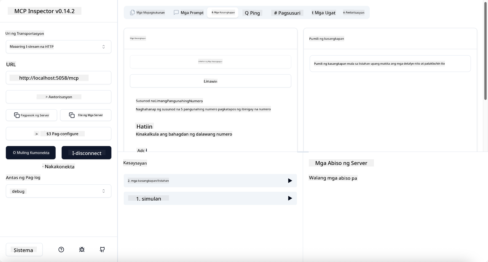
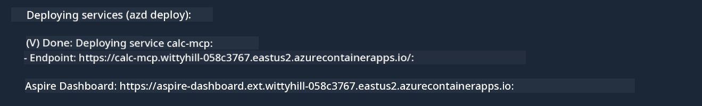

<!--
CO_OP_TRANSLATOR_METADATA:
{
  "original_hash": "0bc7bd48f55f1565f1d95ccb2c16f728",
  "translation_date": "2025-07-13T23:08:49+00:00",
  "source_file": "04-PracticalImplementation/samples/csharp/README.md",
  "language_code": "tl"
}
-->
# Sample

Ipinapakita ng naunang halimbawa kung paano gamitin ang lokal na .NET project gamit ang `stdio` na uri. At kung paano patakbuhin ang server nang lokal sa isang container. Ito ay magandang solusyon sa maraming sitwasyon. Gayunpaman, maaaring maging kapaki-pakinabang na patakbuhin ang server nang remote, tulad sa isang cloud environment. Dito pumapasok ang `http` na uri.

Tumingin sa solusyon sa folder na `04-PracticalImplementation`, maaaring mukhang mas kumplikado ito kaysa sa nauna. Pero sa totoo lang, hindi naman. Kung titignan mo nang mabuti ang project na `src/Calculator`, makikita mo na halos pareho lang ang code sa naunang halimbawa. Ang tanging pagkakaiba ay gumagamit tayo ng ibang library na `ModelContextProtocol.AspNetCore` para hawakan ang mga HTTP request. At binago natin ang method na `IsPrime` upang maging private, para ipakita na maaari kang magkaroon ng private methods sa iyong code. Ang natitirang bahagi ng code ay pareho pa rin.

Ang iba pang mga proyekto ay mula sa [.NET Aspire](https://learn.microsoft.com/dotnet/aspire/get-started/aspire-overview). Ang pagkakaroon ng .NET Aspire sa solusyon ay nagpapabuti sa karanasan ng developer habang nagde-develop at nagte-test at tumutulong sa observability. Hindi ito kinakailangan para patakbuhin ang server, pero magandang praktis na isama ito sa iyong solusyon.

## Simulan ang server nang lokal

1. Mula sa VS Code (na may C# DevKit extension), pumunta sa direktoryong `04-PracticalImplementation/samples/csharp`.
1. Patakbuhin ang sumusunod na utos para simulan ang server:

   ```bash
    dotnet watch run --project ./src/AppHost
   ```

1. Kapag nagbukas ang web browser ng .NET Aspire dashboard, tandaan ang `http` URL. Dapat ito ay parang `http://localhost:5058/`.

   

## Subukan ang Streamable HTTP gamit ang MCP Inspector

Kung mayroon kang Node.js 22.7.5 pataas, maaari mong gamitin ang MCP Inspector para subukan ang iyong server.

Simulan ang server at patakbuhin ang sumusunod na utos sa terminal:

```bash
npx @modelcontextprotocol/inspector http://localhost:5058
```



- Piliin ang `Streamable HTTP` bilang Transport type.
- Sa Url field, ilagay ang URL ng server na naitala kanina, at idagdag ang `/mcp`. Dapat ito ay `http` (hindi `https`) na parang `http://localhost:5058/mcp`.
- Piliin ang Connect button.

Maganda sa Inspector na nagbibigay ito ng malinaw na visibility sa mga nangyayari.

- Subukang ilista ang mga available na tools
- Subukan ang ilan sa mga ito, dapat gumana ito tulad ng dati.

## Subukan ang MCP Server gamit ang GitHub Copilot Chat sa VS Code

Para gamitin ang Streamable HTTP transport sa GitHub Copilot Chat, palitan ang configuration ng `calc-mcp` server na ginawa kanina upang maging ganito:

```jsonc
// .vscode/mcp.json
{
  "servers": {
    "calc-mcp": {
      "type": "http",
      "url": "http://localhost:5058/mcp"
    }
  }
}
```

Gumawa ng ilang pagsubok:

- Magtanong ng "3 prime numbers after 6780". Pansinin kung paano gagamitin ni Copilot ang bagong tools na `NextFivePrimeNumbers` at ibabalik lamang ang unang 3 prime numbers.
- Magtanong ng "7 prime numbers after 111", para makita kung ano ang mangyayari.
- Magtanong ng "John has 24 lollies and wants to distribute them all to his 3 kids. How many lollies does each kid have?", para makita kung ano ang mangyayari.

## I-deploy ang server sa Azure

I-deploy natin ang server sa Azure para mas maraming tao ang makagamit nito.

Mula sa terminal, pumunta sa folder na `04-PracticalImplementation/samples/csharp` at patakbuhin ang sumusunod na utos:

```bash
azd up
```

Kapag natapos na ang deployment, makakakita ka ng mensahe na ganito:



Kunin ang URL at gamitin ito sa MCP Inspector at sa GitHub Copilot Chat.

```jsonc
// .vscode/mcp.json
{
  "servers": {
    "calc-mcp": {
      "type": "http",
      "url": "https://calc-mcp.gentleriver-3977fbcf.australiaeast.azurecontainerapps.io/mcp"
    }
  }
}
```

## Ano ang susunod?

Sinubukan natin ang iba't ibang uri ng transport at mga testing tools. Ipinadala rin natin ang iyong MCP server sa Azure. Pero paano kung kailangan ng server natin na ma-access ang mga private na resources? Halimbawa, isang database o isang private API? Sa susunod na kabanata, titingnan natin kung paano natin mapapabuti ang seguridad ng ating server.

**Paalala**:  
Ang dokumentong ito ay isinalin gamit ang AI translation service na [Co-op Translator](https://github.com/Azure/co-op-translator). Bagamat nagsusumikap kami para sa katumpakan, pakatandaan na ang mga awtomatikong pagsasalin ay maaaring maglaman ng mga pagkakamali o di-tumpak na impormasyon. Ang orihinal na dokumento sa kanyang sariling wika ang dapat ituring na pangunahing sanggunian. Para sa mahahalagang impormasyon, inirerekomenda ang propesyonal na pagsasalin ng tao. Hindi kami mananagot sa anumang hindi pagkakaunawaan o maling interpretasyon na maaaring magmula sa paggamit ng pagsasaling ito.