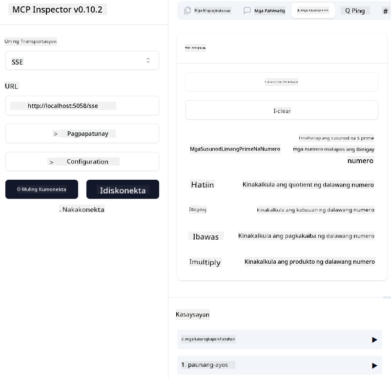
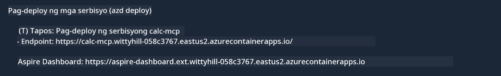

<!--
CO_OP_TRANSLATOR_METADATA:
{
  "original_hash": "5020a3e1a1c7f30c00f9e37f1fa208e3",
  "translation_date": "2025-05-17T14:11:06+00:00",
  "source_file": "04-PracticalImplementation/samples/csharp/README.md",
  "language_code": "tl"
}
-->
# Sample

Ipinapakita ng nakaraang halimbawa kung paano gamitin ang lokal na .NET na proyekto sa uri ng `sdio`. At kung paano patakbuhin ang server nang lokal sa isang container. Ito ay magandang solusyon sa maraming sitwasyon. Gayunpaman, maaaring maging kapaki-pakinabang na patakbuhin ang server nang malayo, tulad sa isang cloud environment. Dito papasok ang uri ng `http`.

Kapag tiningnan ang solusyon sa folder na `04-PracticalImplementation`, maaaring mukhang mas kumplikado ito kaysa sa naunang halimbawa. Pero sa katotohanan, hindi ito ganoon. Kung titingnan mong mabuti ang proyekto `src/mcpserver/mcpserver.csproj`, makikita mo na halos pareho lang ang code sa naunang halimbawa. Ang tanging pagkakaiba ay gumagamit tayo ng ibang library `ModelContextProtocol.AspNetCore` para i-handle ang mga HTTP requests. At binago natin ang method na `IsPrime` para gawing pribado, para ipakita lang na maaari kang magkaroon ng mga pribadong method sa iyong code. Ang natitirang bahagi ng code ay pareho lang ng dati.

Ang ibang mga proyekto ay mula sa [.NET Aspire](https://learn.microsoft.com/dotnet/aspire/get-started/aspire-overview). Ang pagkakaroon ng .NET Aspire sa solusyon ay magpapabuti sa karanasan ng developer habang nagde-develop at nagte-test at makakatulong sa observability. Hindi ito kinakailangan para patakbuhin ang server, pero magandang practice na isama ito sa iyong solusyon.

## Simulan ang server nang lokal

1. Mula sa VS Code (kasama ang C# DevKit extension), buksan ang solusyon `04-PracticalImplementation\samples\csharp\src\Calculator-chap4.sln`.
2. Pindutin ang `F5` para simulan ang server. Dapat itong magbukas ng web browser kasama ang .NET Aspire dashboard.

o

1. Mula sa terminal, mag-navigate sa folder na `04-PracticalImplementation\samples\csharp\src`
2. I-execute ang sumusunod na command para simulan ang server:
   ```bash
    dotnet run --project .\AppHost
   ```

3. Mula sa Dashboard, tandaan ang URL na `http`. Dapat itong maging katulad ng `http://localhost:5058/`.

## Test `SSE` kasama ang ModelContext Protocol Inspector.

Kung mayroon kang Node.js 22.7.5 at mas mataas, maaari mong gamitin ang ModelContext Protocol Inspector para i-test ang iyong server.

Simulan ang server at patakbuhin ang sumusunod na command sa terminal:

```bash
npx @modelcontextprotocol/inspector@latest
```



- Piliin ang `SSE` as the Transport type. SSE stand for Server-Sent Events. 
- In the Url field, enter the URL of the server noted earlier,and append `/sse`. Dapat itong maging `http` (hindi `https`) something like `http://localhost:5058/sse`.
- select the Connect button.

A nice thing about the Inspector is that it provide a nice visibility on what is happening.

- Try listing the availables tools
- Try some of them, it should works just like before.


## Test `SSE` with Github Copilot Chat in VS Code

To use the `SSE` transport with Github Copilot Chat, change the configuration of the `mcp-calc` server na ginawa dati para magmukhang ganito:

```json
"mcp-calc": {
    "type": "sse",
    "url": "http://localhost:5058/sse"
}
```

Gumawa ng ilang tests:
- Humingi ng 3 prime numbers pagkatapos ng 6780. Pansinin kung paano gagamitin ng Copilot ang bagong tools `NextFivePrimeNumbers` at ibabalik lamang ang unang 3 prime numbers.
- Humingi ng 7 prime numbers pagkatapos ng 111, para makita kung ano ang mangyayari.

# I-deploy ang server sa Azure

I-deploy natin ang server sa Azure para magamit ito ng mas maraming tao.

Mula sa terminal, mag-navigate sa folder na `04-PracticalImplementation\samples\csharp\src` at patakbuhin ang sumusunod na command:

```bash
azd init
```

Ito ay lilikha ng ilang mga file nang lokal para i-save ang configuration ng mga Azure resources, at ang iyong Infrastructure as code (IaC).

Pagkatapos, patakbuhin ang sumusunod na command para i-deploy ang server sa Azure:

```bash
azd up
```

Kapag natapos ang deployment, dapat kang makakita ng mensahe na ganito:



Mag-navigate sa Aspire dashboard at tandaan ang `HTTP` URL para gamitin ito sa MCP Inspector at sa Github Copilot Chat.

## Ano ang susunod?

Sinubukan natin ang iba't ibang transport types, at testing tools at na-deploy din natin ang MCP server sa Azure. Pero paano kung kailangan ng ating server na ma-access ang mga pribadong resources? Halimbawa, isang database o isang pribadong API? Sa susunod na kabanata, makikita natin kung paano natin mapapabuti ang seguridad ng ating server.

**Paunawa**:  
Ang dokumentong ito ay isinalin gamit ang AI translation service [Co-op Translator](https://github.com/Azure/co-op-translator). Bagama't sinisikap naming maging tama, pakitandaan na ang mga awtomatikong pagsasalin ay maaaring maglaman ng mga error o hindi pagkakatumpak. Ang orihinal na dokumento sa kanyang katutubong wika ang dapat ituring na mapagkakatiwalaang mapagkukunan. Para sa mahalagang impormasyon, inirerekomenda ang propesyonal na pagsasalin ng tao. Hindi kami mananagot para sa anumang hindi pagkakaintindihan o maling interpretasyon na dulot ng paggamit ng pagsasaling ito.