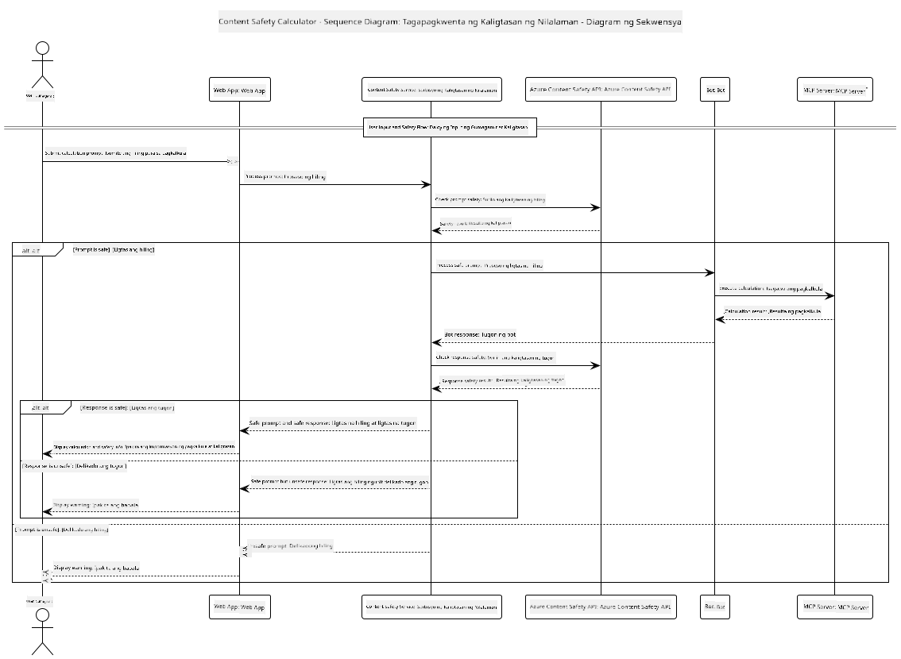

<!--
CO_OP_TRANSLATOR_METADATA:
{
  "original_hash": "e5ea5e7582f70008ea9bec3b3820f20a",
  "translation_date": "2025-07-13T23:18:52+00:00",
  "source_file": "04-PracticalImplementation/samples/java/containerapp/README.md",
  "language_code": "tl"
}
-->
## System Architecture

Ipinapakita ng proyektong ito ang isang web application na gumagamit ng content safety checking bago ipasa ang mga user prompt sa isang calculator service gamit ang Model Context Protocol (MCP).



### Paano Ito Gumagana

1. **User Input**: Naglalagay ang user ng calculation prompt sa web interface  
2. **Content Safety Screening (Input)**: Sinusuri ang prompt gamit ang Azure Content Safety API  
3. **Safety Decision (Input)**:  
   - Kung ligtas ang nilalaman (severity < 2 sa lahat ng kategorya), ipinapasa ito sa calculator  
   - Kung may flag na posibleng mapanganib ang nilalaman, hihinto ang proseso at magbibigay ng babala  
4. **Calculator Integration**: Pinoproseso ng LangChain4j ang ligtas na nilalaman at nakikipag-ugnayan sa MCP calculator server  
5. **Content Safety Screening (Output)**: Sinusuri ng Azure Content Safety API ang sagot ng bot  
6. **Safety Decision (Output)**:  
   - Kung ligtas ang sagot ng bot, ipapakita ito sa user  
   - Kung may flag na posibleng mapanganib ang sagot, papalitan ito ng babala  
7. **Response**: Ipinapakita ang mga resulta (kung ligtas) sa user kasama ang parehong safety analyses

## Using Model Context Protocol (MCP) with Calculator Services

Ipinapakita ng proyektong ito kung paano gamitin ang Model Context Protocol (MCP) para tawagan ang calculator MCP services mula sa LangChain4j. Gumagamit ito ng lokal na MCP server na tumatakbo sa port 8080 para magbigay ng mga operasyon ng calculator.

### Setting up Azure Content Safety Service

Bago gamitin ang mga content safety feature, kailangan mong gumawa ng Azure Content Safety service resource:

1. Mag-sign in sa [Azure Portal](https://portal.azure.com)  
2. I-click ang "Create a resource" at hanapin ang "Content Safety"  
3. Piliin ang "Content Safety" at i-click ang "Create"  
4. Ilagay ang natatanging pangalan para sa iyong resource  
5. Piliin ang iyong subscription at resource group (o gumawa ng bago)  
6. Pumili ng suportadong rehiyon (tingnan ang [Region availability](https://azure.microsoft.com/en-us/global-infrastructure/services/?products=cognitive-services) para sa detalye)  
7. Piliin ang angkop na pricing tier  
8. I-click ang "Create" para i-deploy ang resource  
9. Kapag tapos na ang deployment, i-click ang "Go to resource"  
10. Sa kaliwang pane, sa ilalim ng "Resource Management", piliin ang "Keys and Endpoint"  
11. Kopyahin ang alinman sa mga keys at ang endpoint URL para gamitin sa susunod na hakbang

### Configuring Environment Variables

I-set ang `GITHUB_TOKEN` environment variable para sa authentication ng GitHub models:  
```sh
export GITHUB_TOKEN=<your_github_token>
```

Para sa content safety features, i-set ang:  
```sh
export CONTENT_SAFETY_ENDPOINT=<your_content_safety_endpoint>
export CONTENT_SAFETY_KEY=<your_content_safety_key>
```

Ginagamit ng application ang mga environment variables na ito para mag-authenticate sa Azure Content Safety service. Kung hindi ito naka-set, gagamit ang application ng placeholder values para sa demo, ngunit hindi gagana nang maayos ang content safety features.

### Starting the Calculator MCP Server

Bago patakbuhin ang client, kailangan mong simulan ang calculator MCP server sa SSE mode sa localhost:8080.

## Project Description

Ipinapakita ng proyektong ito ang integrasyon ng Model Context Protocol (MCP) sa LangChain4j para tawagan ang mga calculator services. Pangunahing tampok nito ang:

- Paggamit ng MCP para kumonekta sa calculator service para sa mga basic math operations  
- Dual-layer content safety checking sa parehong user prompts at sagot ng bot  
- Integrasyon sa GitHub's gpt-4.1-nano model gamit ang LangChain4j  
- Paggamit ng Server-Sent Events (SSE) para sa MCP transport

## Content Safety Integration

Kasama sa proyekto ang komprehensibong content safety features upang matiyak na parehong ligtas ang mga input ng user at mga sagot ng sistema mula sa mapanganib na nilalaman:

1. **Input Screening**: Sinusuri ang lahat ng user prompt para sa mga mapanganib na kategorya tulad ng hate speech, karahasan, self-harm, at sekswal na nilalaman bago iproseso.  

2. **Output Screening**: Kahit na gumagamit ng posibleng uncensored na mga modelo, sinusuri ng sistema ang lahat ng generated na sagot gamit ang parehong content safety filters bago ipakita sa user.

Tinitiyak ng dual-layer na ito na nananatiling ligtas ang sistema anuman ang AI model na ginagamit, pinoprotektahan ang mga user mula sa mapanganib na input at posibleng problemadong AI-generated na output.

## Web Client

Kasama sa application ang isang madaling gamitin na web interface na nagpapahintulot sa mga user na makipag-ugnayan sa Content Safety Calculator system:

### Web Interface Features

- Simple at madaling gamitin na form para maglagay ng calculation prompts  
- Dual-layer content safety validation (input at output)  
- Real-time na feedback tungkol sa kaligtasan ng prompt at sagot  
- Color-coded na mga indicator ng kaligtasan para madaling maintindihan  
- Malinis at responsive na disenyo na gumagana sa iba't ibang device  
- Mga halimbawa ng ligtas na prompt bilang gabay sa mga user

### Using the Web Client

1. Simulan ang application:  
   ```sh
   mvn spring-boot:run
   ```

2. Buksan ang browser at pumunta sa `http://localhost:8087`

3. Maglagay ng calculation prompt sa ibinigay na text area (halimbawa, "Calculate the sum of 24.5 and 17.3")

4. I-click ang "Submit" para iproseso ang iyong kahilingan

5. Tingnan ang mga resulta, na maglalaman ng:  
   - Content safety analysis ng iyong prompt  
   - Ang kalkuladong resulta (kung ligtas ang prompt)  
   - Content safety analysis ng sagot ng bot  
   - Anumang safety warnings kung may flag sa input o output

Awtomatikong pinangangasiwaan ng web client ang parehong proseso ng content safety verification, na tinitiyak na ligtas at angkop ang lahat ng interaksyon anuman ang AI model na ginagamit.

**Paalala**:  
Ang dokumentong ito ay isinalin gamit ang AI translation service na [Co-op Translator](https://github.com/Azure/co-op-translator). Bagamat nagsusumikap kami para sa katumpakan, pakatandaan na ang mga awtomatikong pagsasalin ay maaaring maglaman ng mga pagkakamali o di-tumpak na impormasyon. Ang orihinal na dokumento sa orihinal nitong wika ang dapat ituring na pangunahing sanggunian. Para sa mahahalagang impormasyon, inirerekomenda ang propesyonal na pagsasalin ng tao. Hindi kami mananagot sa anumang hindi pagkakaunawaan o maling interpretasyon na maaaring magmula sa paggamit ng pagsasaling ito.