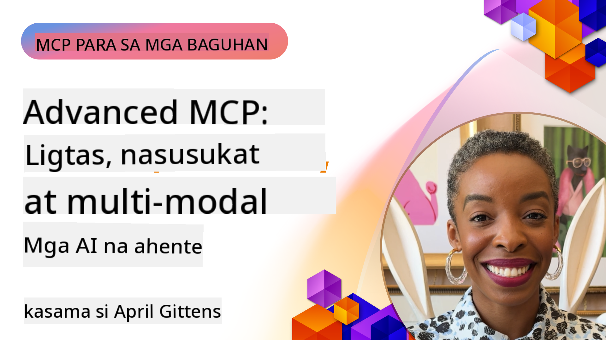

<!--
CO_OP_TRANSLATOR_METADATA:
{
  "original_hash": "d204bc94ea6027d06a703b21b711ca57",
  "translation_date": "2025-08-18T18:16:19+00:00",
  "source_file": "05-AdvancedTopics/README.md",
  "language_code": "tl"
}
-->
# Mga Advanced na Paksa sa MCP

_(I-click ang imahe sa itaas upang mapanood ang video ng araling ito)_

Ang kabanatang ito ay tumatalakay sa serye ng mga advanced na paksa sa pagpapatupad ng Model Context Protocol (MCP), kabilang ang multi-modal integration, scalability, mga pinakamahusay na kasanayan sa seguridad, at enterprise integration. Ang mga paksang ito ay mahalaga para sa pagbuo ng matibay at handang produksyon na mga aplikasyon ng MCP na maaaring matugunan ang mga pangangailangan ng modernong AI systems.

## Pangkalahatang-ideya

Ang araling ito ay sumisiyasat sa mga advanced na konsepto sa pagpapatupad ng Model Context Protocol, na nakatuon sa multi-modal integration, scalability, mga pinakamahusay na kasanayan sa seguridad, at enterprise integration. Ang mga paksang ito ay mahalaga para sa pagbuo ng mga MCP application na handa para sa produksyon at kayang tugunan ang mga kumplikadong pangangailangan sa mga enterprise environment.

## Mga Layunin sa Pag-aaral

Sa pagtatapos ng araling ito, magagawa mo ang sumusunod:

- Magpatupad ng mga multi-modal na kakayahan sa loob ng mga MCP framework
- Magdisenyo ng scalable na mga arkitektura ng MCP para sa mga high-demand na sitwasyon
- Mag-aplay ng mga pinakamahusay na kasanayan sa seguridad na naaayon sa mga prinsipyo ng seguridad ng MCP
- Isama ang MCP sa mga enterprise AI systems at frameworks
- I-optimize ang performance at reliability sa mga production environment

## Mga Aralin at Halimbawang Proyekto

| Link | Pamagat | Deskripsyon |
|------|---------|-------------|
| [5.1 Integration with Azure](./mcp-integration/README.md) | Integrate with Azure | Matutunan kung paano isama ang iyong MCP Server sa Azure |
| [5.2 Multi modal sample](./mcp-multi-modality/README.md) | MCP Multi modal samples | Mga halimbawa para sa audio, imahe, at multi-modal na tugon |
| [5.3 MCP OAuth2 sample](../../../05-AdvancedTopics/mcp-oauth2-demo) | MCP OAuth2 Demo | Minimal na Spring Boot app na nagpapakita ng OAuth2 sa MCP, bilang Authorization at Resource Server. Nagpapakita ng secure na token issuance, protektadong endpoints, Azure Container Apps deployment, at API Management integration. |
| [5.4 Root Contexts](./mcp-root-contexts/README.md) | Root contexts | Matutunan ang higit pa tungkol sa root context at kung paano ito ipatupad |
| [5.5 Routing](./mcp-routing/README.md) | Routing | Matutunan ang iba't ibang uri ng routing |
| [5.6 Sampling](./mcp-sampling/README.md) | Sampling | Matutunan kung paano magtrabaho gamit ang sampling |
| [5.7 Scaling](./mcp-scaling/README.md) | Scaling | Matutunan ang tungkol sa scaling |
| [5.8 Security](./mcp-security/README.md) | Security | Siguraduhin ang seguridad ng iyong MCP Server |
| [5.9 Web Search sample](./web-search-mcp/README.md) | Web Search MCP | Python MCP server at client na isinama sa SerpAPI para sa real-time na web, balita, paghahanap ng produkto, at Q&A. Nagpapakita ng multi-tool orchestration, external API integration, at matibay na error handling. |
| [5.10 Realtime Streaming](./mcp-realtimestreaming/README.md) | Streaming | Ang real-time na data streaming ay naging mahalaga sa mundo ng data-driven ngayon, kung saan ang mga negosyo at aplikasyon ay nangangailangan ng agarang access sa impormasyon upang makagawa ng napapanahong desisyon. |
| [5.11 Realtime Web Search](./mcp-realtimesearch/README.md) | Web Search | Ang real-time na web search kung paano binabago ng MCP ang real-time na web search sa pamamagitan ng pagbibigay ng standardized na paraan sa context management sa mga AI models, search engines, at applications. |
| [5.12 Entra ID Authentication for Model Context Protocol Servers](./mcp-security-entra/README.md) | Entra ID Authentication | Ang Microsoft Entra ID ay nagbibigay ng matibay na cloud-based na solusyon sa identity at access management, na tumutulong upang matiyak na tanging mga awtorisadong user at aplikasyon lamang ang maaaring makipag-ugnayan sa iyong MCP server. |
| [5.13 Azure AI Foundry Agent Integration](./mcp-foundry-agent-integration/README.md) | Azure AI Foundry Integration | Matutunan kung paano isama ang Model Context Protocol servers sa Azure AI Foundry agents, na nagbibigay-daan sa makapangyarihang tool orchestration at enterprise AI capabilities na may standardized external data source connections. |
| [5.14 Context Engineering](./mcp-contextengineering/README.md) | Context Engineering | Ang hinaharap na oportunidad ng context engineering techniques para sa MCP servers, kabilang ang context optimization, dynamic context management, at mga estratehiya para sa epektibong prompt engineering sa loob ng MCP frameworks. |

## Karagdagang Sanggunian

Para sa pinaka-up-to-date na impormasyon sa mga advanced na paksa ng MCP, bisitahin ang:
- [MCP Documentation](https://modelcontextprotocol.io/)
- [MCP Specification](https://spec.modelcontextprotocol.io/)
- [GitHub Repository](https://github.com/modelcontextprotocol)

## Mga Pangunahing Puntos

- Ang mga multi-modal na pagpapatupad ng MCP ay nagpapalawak ng kakayahan ng AI lampas sa text processing
- Ang scalability ay mahalaga para sa mga enterprise deployment at maaaring matugunan sa pamamagitan ng horizontal at vertical scaling
- Ang komprehensibong mga hakbang sa seguridad ay nagpoprotekta sa data at tinitiyak ang tamang access control
- Ang enterprise integration sa mga platform tulad ng Azure OpenAI at Microsoft AI Foundry ay nagpapahusay sa kakayahan ng MCP
- Ang mga advanced na pagpapatupad ng MCP ay nakikinabang mula sa optimized na arkitektura at maingat na pamamahala ng resources

## Ehersisyo

Magdisenyo ng isang enterprise-grade na MCP implementation para sa isang partikular na use case:

1. Tukuyin ang mga multi-modal na pangangailangan para sa iyong use case
2. I-outline ang mga kontrol sa seguridad na kinakailangan upang maprotektahan ang sensitibong data
3. Magdisenyo ng scalable na arkitektura na kayang tumugon sa iba't ibang load
4. Magplano ng mga integration points sa mga enterprise AI systems
5. Idokumento ang mga potensyal na bottleneck sa performance at mga estratehiya sa pagmitiga

## Karagdagang Mga Mapagkukunan

- [Azure OpenAI Documentation](https://learn.microsoft.com/en-us/azure/ai-services/openai/)
- [Microsoft AI Foundry Documentation](https://learn.microsoft.com/en-us/ai-services/)

---

## Ano ang susunod

- [5.1 MCP Integration](./mcp-integration/README.md)

**Paunawa**:  
Ang dokumentong ito ay isinalin gamit ang AI translation service na [Co-op Translator](https://github.com/Azure/co-op-translator). Bagama't sinisikap naming maging tumpak, pakitandaan na ang mga awtomatikong pagsasalin ay maaaring maglaman ng mga pagkakamali o hindi pagkakatugma. Ang orihinal na dokumento sa kanyang orihinal na wika ang dapat ituring na opisyal na sanggunian. Para sa mahalagang impormasyon, inirerekomenda ang propesyonal na pagsasalin ng tao. Hindi kami mananagot sa anumang hindi pagkakaunawaan o maling interpretasyon na maaaring magmula sa paggamit ng pagsasaling ito.