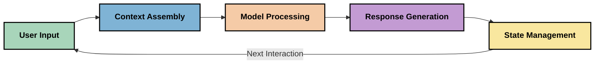
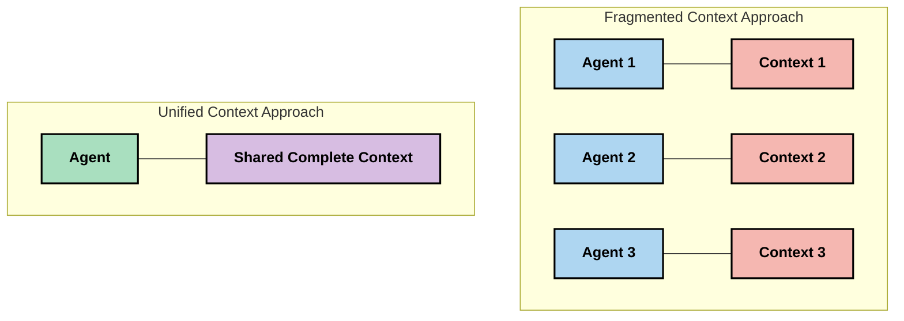
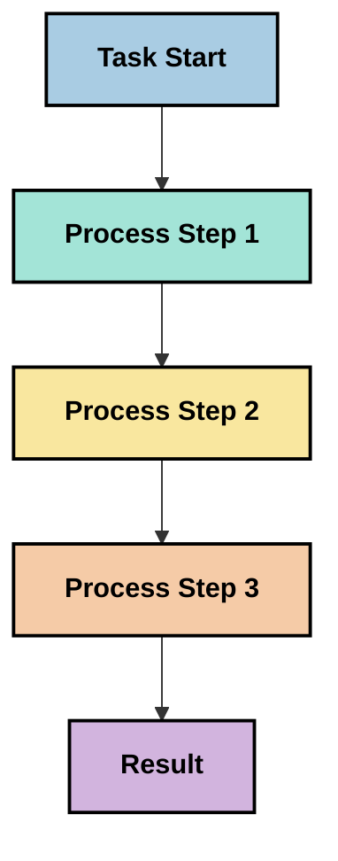
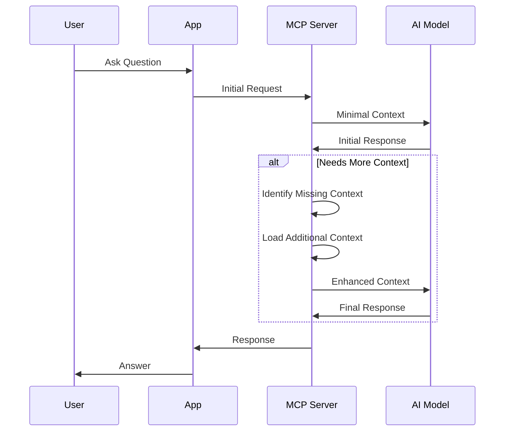
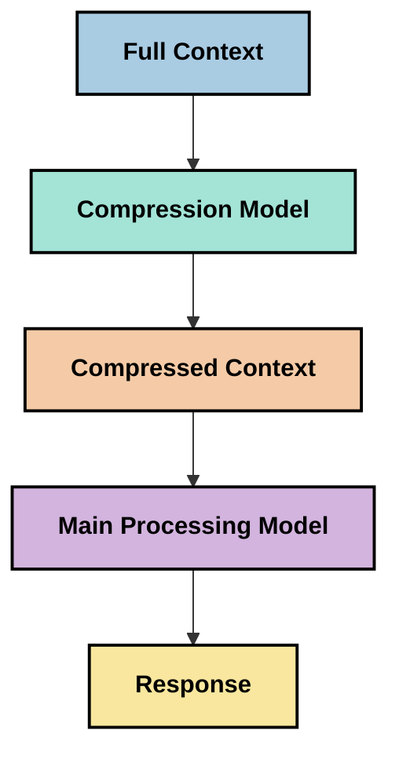

<!--
CO_OP_TRANSLATOR_METADATA:
{
  "original_hash": "5762e8e74dd99d8b7dbb31e69a82561e",
  "translation_date": "2025-07-17T08:43:35+00:00",
  "source_file": "05-AdvancedTopics/mcp-contextengineering/README.md",
  "language_code": "tl"
}
-->
# Context Engineering: Isang Umuusbong na Konsepto sa MCP Ecosystem

## Pangkalahatang-ideya

Ang context engineering ay isang umuusbong na konsepto sa larangan ng AI na sumusuri kung paano inaayos, ipinapadala, at pinananatili ang impormasyon sa mga interaksyon sa pagitan ng mga kliyente at AI services. Habang umuunlad ang Model Context Protocol (MCP) ecosystem, nagiging mas mahalaga ang pag-unawa kung paano epektibong pamahalaan ang konteksto. Ipinapakilala ng modyul na ito ang konsepto ng context engineering at tinatalakay ang mga posibleng aplikasyon nito sa mga implementasyon ng MCP.

## Mga Layunin sa Pagkatuto

Sa pagtatapos ng modyul na ito, magagawa mong:

- Maunawaan ang umuusbong na konsepto ng context engineering at ang posibleng papel nito sa mga aplikasyon ng MCP
- Tukuyin ang mga pangunahing hamon sa pamamahala ng konteksto na tinutugunan ng disenyo ng MCP protocol
- Suriin ang mga teknik para mapabuti ang performance ng modelo sa pamamagitan ng mas mahusay na paghawak ng konteksto
- Isaalang-alang ang mga pamamaraan para sukatin at suriin ang bisa ng konteksto
- Ipatupad ang mga umuusbong na konseptong ito upang mapabuti ang karanasan sa AI gamit ang MCP framework

## Panimula sa Context Engineering

Ang context engineering ay isang umuusbong na konsepto na nakatuon sa sinadyang disenyo at pamamahala ng daloy ng impormasyon sa pagitan ng mga gumagamit, aplikasyon, at mga AI model. Hindi tulad ng mga naitatag na larangan tulad ng prompt engineering, ang context engineering ay patuloy pang binubuo ng mga practitioner habang nilulutas nila ang mga natatanging hamon ng pagbibigay sa mga AI model ng tamang impormasyon sa tamang oras.

Habang umuunlad ang mga malalaking language model (LLMs), lalong naging malinaw ang kahalagahan ng konteksto. Ang kalidad, kaugnayan, at estruktura ng konteksto na ibinibigay natin ay direktang nakakaapekto sa output ng modelo. Sinusuri ng context engineering ang ugnayang ito at naghahanap ng mga prinsipyo para sa epektibong pamamahala ng konteksto.

> "Sa 2025, napakatalino na ng mga modelo. Ngunit kahit ang pinakamatalinong tao ay hindi magagawa nang epektibo ang kanilang trabaho nang walang konteksto ng kung ano ang hinihiling sa kanila... Ang 'context engineering' ang susunod na antas ng prompt engineering. Ito ay tungkol sa paggawa nito nang awtomatiko sa isang dinamikong sistema." — Walden Yan, Cognition AI

Maaaring saklawin ng context engineering ang mga sumusunod:

1. **Pagpili ng Konteksto**: Pagtukoy kung anong impormasyon ang mahalaga para sa isang gawain
2. **Pag-aayos ng Konteksto**: Pag-oorganisa ng impormasyon upang mapataas ang pagkaunawa ng modelo
3. **Paghahatid ng Konteksto**: Pag-optimize kung paano at kailan ipinapadala ang impormasyon sa mga modelo
4. **Pagpapanatili ng Konteksto**: Pamamahala sa estado at pagbabago ng konteksto sa paglipas ng panahon
5. **Pagsusuri ng Konteksto**: Pagsukat at pagpapabuti ng bisa ng konteksto

Ang mga larangang ito ay partikular na mahalaga sa MCP ecosystem, na nagbibigay ng isang standard na paraan para sa mga aplikasyon na magbigay ng konteksto sa mga LLM.

## Ang Perspektibo ng Paglalakbay ng Konteksto

Isang paraan upang mailarawan ang context engineering ay ang pagsubaybay sa paglalakbay ng impormasyon sa loob ng isang MCP system:



### Mga Pangunahing Yugto sa Paglalakbay ng Konteksto:

1. **Input ng Gumagamit**: Raw na impormasyon mula sa gumagamit (teksto, larawan, dokumento)
2. **Pagsasama-sama ng Konteksto**: Pagsasama ng input ng gumagamit sa konteksto ng sistema, kasaysayan ng pag-uusap, at iba pang nakuha na impormasyon
3. **Pagproseso ng Modelo**: Pinoproseso ng AI model ang pinagsamang konteksto
4. **Pagbuo ng Tugon**: Gumagawa ang modelo ng output base sa ibinigay na konteksto
5. **Pamamahala ng Estado**: Ina-update ng sistema ang internal na estado base sa interaksyon

Ipinapakita ng perspektibong ito ang dinamiko ng konteksto sa mga AI system at nagtataas ng mahahalagang tanong kung paano pinakamahusay na pamahalaan ang impormasyon sa bawat yugto.

## Mga Umuusbong na Prinsipyo sa Context Engineering

Habang nabubuo ang larangan ng context engineering, may ilang paunang prinsipyo na lumilitaw mula sa mga practitioner. Ang mga prinsipyong ito ay maaaring makatulong sa pagpili ng mga implementasyon sa MCP:

### Prinsipyo 1: Ibahagi ang Konteksto nang Buo

Dapat ibahagi nang buo ang konteksto sa lahat ng bahagi ng sistema sa halip na hatiin ito sa iba't ibang ahente o proseso. Kapag nahahati ang konteksto, maaaring magka-konflik ang mga desisyon sa iba't ibang bahagi ng sistema.



Sa mga aplikasyon ng MCP, ito ay nagmumungkahi ng pagdisenyo ng mga sistema kung saan dumadaloy nang tuloy-tuloy ang konteksto sa buong pipeline sa halip na hatiin.

### Prinsipyo 2: Kilalanin na ang mga Aksyon ay Nagdadala ng Implicit na Desisyon

Bawat aksyon na ginagawa ng modelo ay naglalaman ng implicit na mga desisyon kung paano i-interpret ang konteksto. Kapag maraming bahagi ang kumikilos sa magkakaibang konteksto, maaaring magka-konflik ang mga implicit na desisyong ito, na nagreresulta sa hindi magkakatugmang kinalabasan.

Mahalaga ang prinsipyong ito para sa mga aplikasyon ng MCP:
- Mas mainam ang linear na pagproseso ng mga komplikadong gawain kaysa sa parallel na pagpapatupad na may hati-hating konteksto
- Siguraduhing lahat ng punto ng desisyon ay may access sa parehong impormasyon ng konteksto
- Disenyuhin ang mga sistema kung saan nakikita ng mga susunod na hakbang ang buong konteksto ng mga naunang desisyon

### Prinsipyo 3: Timbangin ang Lalim ng Konteksto at ang Limitasyon ng Window

Habang humahaba ang mga pag-uusap at proseso, napupuno ang context window. Sinusuri ng epektibong context engineering ang mga paraan upang pamahalaan ang tensyon sa pagitan ng kumpletong konteksto at mga teknikal na limitasyon.

Ilan sa mga posibleng paraan na sinusubukan ay:
- Pag-compress ng konteksto na pinananatili ang mahalagang impormasyon habang binabawasan ang paggamit ng token
- Progressive loading ng konteksto base sa kaugnayan sa kasalukuyang pangangailangan
- Pagbubuod ng mga naunang interaksyon habang pinapanatili ang mga mahahalagang desisyon at katotohanan

## Mga Hamon sa Konteksto at Disenyo ng MCP Protocol

Dinisenyo ang Model Context Protocol (MCP) na may kamalayan sa mga natatanging hamon ng pamamahala ng konteksto. Ang pag-unawa sa mga hamong ito ay nakakatulong ipaliwanag ang mga pangunahing aspeto ng disenyo ng MCP protocol:

### Hamon 1: Limitasyon ng Context Window

Karamihan sa mga AI model ay may fixed na laki ng context window, na naglilimita kung gaano karaming impormasyon ang kanilang mapoproseso nang sabay-sabay.

**Tugon ng MCP Design:**  
- Sinusuportahan ng protocol ang istrukturadong, resource-based na konteksto na maaaring epektibong i-refer  
- Maaaring i-paginate at i-load nang paunti-unti ang mga resources

### Hamon 2: Pagtukoy ng Kaugnayan

Mahirap tukuyin kung aling impormasyon ang pinaka-kaugnay na isasama sa konteksto.

**Tugon ng MCP Design:**  
- May flexible na mga tool para sa dynamic na pagkuha ng impormasyon base sa pangangailangan  
- Ang mga structured prompt ay nagpapahintulot ng consistent na organisasyon ng konteksto

### Hamon 3: Pagpapanatili ng Konteksto

Ang pamamahala ng estado sa mga interaksyon ay nangangailangan ng maingat na pagsubaybay sa konteksto.

**Tugon ng MCP Design:**  
- Standardisadong session management  
- Malinaw na tinukoy na mga pattern ng interaksyon para sa ebolusyon ng konteksto

### Hamon 4: Multi-Modal na Konteksto

Iba't ibang uri ng data (teksto, larawan, istrukturadong data) ay nangangailangan ng iba't ibang paghawak.

**Tugon ng MCP Design:**  
- Dinisenyo ang protocol para tanggapin ang iba't ibang uri ng nilalaman  
- Standardisadong representasyon ng multi-modal na impormasyon

### Hamon 5: Seguridad at Privacy

Madalas naglalaman ang konteksto ng sensitibong impormasyon na kailangang protektahan.

**Tugon ng MCP Design:**  
- Malinaw na hangganan sa pagitan ng responsibilidad ng kliyente at server  
- Mga opsyon sa lokal na pagproseso upang mabawasan ang exposure ng data

Ang pag-unawa sa mga hamong ito at kung paano ito tinutugunan ng MCP ay nagbibigay ng pundasyon para sa pag-explore ng mas advanced na mga teknik sa context engineering.

## Mga Umuusbong na Paraan sa Context Engineering

Habang umuunlad ang larangan ng context engineering, may ilang promising na paraan na lumilitaw. Ito ay mga kasalukuyang ideya at hindi pa ganap na best practices, at malamang na magbabago habang nadaragdagan ang karanasan sa mga implementasyon ng MCP.

### 1. Single-Threaded Linear Processing

Kabaligtaran ng multi-agent architectures na naghahati ng konteksto, natuklasan ng ilang practitioner na mas consistent ang resulta ng single-threaded linear processing. Ito ay tumutugma sa prinsipyo ng pagpapanatili ng iisang konteksto.



Bagamat maaaring mukhang hindi kasing epektibo ng parallel processing, madalas itong nagreresulta sa mas coherent at maaasahang output dahil bawat hakbang ay nakabatay sa kumpletong pagkaunawa ng mga naunang desisyon.

### 2. Paghiwa-hiwalay at Pag-prioritize ng Konteksto

Paghahati ng malalaking konteksto sa mga piraso na madaling pamahalaan at pagpili ng pinakamahalaga.

```python
# Conceptual Example: Context Chunking and Prioritization
def process_with_chunked_context(documents, query):
    # 1. Break documents into smaller chunks
    chunks = chunk_documents(documents)
    
    # 2. Calculate relevance scores for each chunk
    scored_chunks = [(chunk, calculate_relevance(chunk, query)) for chunk in chunks]
    
    # 3. Sort chunks by relevance score
    sorted_chunks = sorted(scored_chunks, key=lambda x: x[1], reverse=True)
    
    # 4. Use the most relevant chunks as context
    context = create_context_from_chunks([chunk for chunk, score in sorted_chunks[:5]])
    
    # 5. Process with the prioritized context
    return generate_response(context, query)
```

Ipinapakita ng konseptong ito kung paano natin maaaring hatiin ang malalaking dokumento sa mga piraso at piliin lamang ang pinaka-kaugnay para sa konteksto. Nakakatulong ito upang makapasok sa limitasyon ng context window habang nagagamit ang malalaking knowledge base.

### 3. Progressive Context Loading

Pag-load ng konteksto nang paunti-unti ayon sa pangangailangan sa halip na sabay-sabay.



Nagsisimula ang progressive context loading sa minimal na konteksto at lumalawak lamang kapag kinakailangan. Malaki ang naitutulong nito sa pagbabawas ng token usage para sa mga simpleng tanong habang nananatili ang kakayahang sagutin ang mga komplikadong tanong.

### 4. Pag-compress at Pagbubuod ng Konteksto

Pagbawas ng laki ng konteksto habang pinapanatili ang mahalagang impormasyon.



Nakatuon ang context compression sa:  
- Pagtanggal ng mga redundant na impormasyon  
- Pagbubuod ng mahahabang nilalaman  
- Pagkuha ng mga pangunahing katotohanan at detalye  
- Pagpapanatili ng kritikal na elemento ng konteksto  
- Pag-optimize para sa token efficiency

Mahalaga ito lalo na sa pagpapanatili ng mahahabang pag-uusap sa loob ng context window o sa epektibong pagproseso ng malalaking dokumento. May ilang practitioner na gumagamit ng espesyal na mga modelo para sa context compression at pagbubuod ng kasaysayan ng pag-uusap.

## Mga Isinasaalang-alang sa Exploratory Context Engineering

Habang ini-explore ang umuusbong na larangan ng context engineering, may ilang bagay na dapat tandaan kapag nagtatrabaho sa mga implementasyon ng MCP. Hindi ito mga preskriptibong best practice kundi mga lugar ng paggalugad na maaaring magdala ng pagbuti sa iyong partikular na kaso.

### Isaalang-alang ang Iyong Mga Layunin sa Konteksto

Bago magpatupad ng komplikadong solusyon sa pamamahala ng konteksto, malinaw na tukuyin kung ano ang nais mong makamit:  
- Anong partikular na impormasyon ang kailangan ng modelo para magtagumpay?  
- Aling impormasyon ang mahalaga at alin ang pangsuporta?  
- Ano ang mga limitasyon mo sa performance (latency, token limits, gastos)?

### Suriin ang Mga Layered na Paraan ng Konteksto

May ilang practitioner na nagtatagumpay sa pag-aayos ng konteksto sa mga konseptwal na layer:  
- **Core Layer**: Mahahalagang impormasyon na palaging kailangan ng modelo  
- **Situational Layer**: Konteksto na partikular sa kasalukuyang interaksyon  
- **Supporting Layer**: Karagdagang impormasyon na maaaring makatulong  
- **Fallback Layer**: Impormasyon na ginagamit lamang kapag kinakailangan

### Siyasatin ang Mga Estratehiya sa Pagkuha

Ang bisa ng iyong konteksto ay madalas nakadepende sa paraan ng pagkuha ng impormasyon:  
- Semantic search at embeddings para sa paghahanap ng konseptwal na kaugnayan  
- Keyword-based search para sa tiyak na mga detalye  
- Hybrid na paraan na pinagsasama ang iba't ibang retrieval methods  
- Metadata filtering para paliitin ang saklaw base sa kategorya, petsa, o pinagmulan

### Subukan ang Coherence ng Konteksto

Maaaring makaapekto sa pagkaunawa ng modelo ang estruktura at daloy ng iyong konteksto:  
- Pagsasama-sama ng magkakaugnay na impormasyon  
- Paggamit ng consistent na format at organisasyon  
- Pagpapanatili ng lohikal o kronolohikal na pagkakasunod-sunod kung angkop  
- Pag-iwas sa magkasalungat na impormasyon

### Timbangin ang Mga Tradeoff ng Multi-Agent Architectures

Bagamat popular ang multi-agent architectures sa maraming AI framework, may mga mahahalagang hamon ito sa pamamahala ng konteksto:  
- Ang pagkakahati-hati ng konteksto ay maaaring magdulot ng hindi magkakatugmang desisyon sa mga ahente  
- Ang parallel processing ay maaaring magpasok ng mga conflict na mahirap ayusin  
- Ang overhead sa komunikasyon sa pagitan ng mga ahente ay maaaring pumigil sa pagbuti ng performance  
- Kailangan ng komplikadong pamamahala ng estado para mapanatili ang coherence

Sa maraming kaso, ang single-agent na pamamaraan na may komprehensibong pamamahala ng konteksto ay maaaring maghatid ng mas maaasahang resulta kaysa sa maraming specialized agents na may hati-hating konteksto.

### Bumuo ng Mga Pamamaraan sa Pagsusuri

Para mapabuti ang context engineering sa paglipas ng panahon, isaalang-alang kung paano mo susukatin ang tagumpay:  
- A/B testing ng iba't ibang estruktura ng konteksto  
- Pagsubaybay sa paggamit ng token at oras ng tugon  
- Pagtatala ng kasiyahan ng gumagamit at rate ng pagkumpleto ng gawain  
- Pagsusuri kung kailan at bakit nabibigo ang mga estratehiya sa konteksto

Ang mga isinasaalang-alang na ito ay mga aktibong larangan ng paggalugad sa context engineering. Habang lumalago ang larangan, malamang na lilitaw ang mas tiyak na mga pattern at praktis.

## Pagsusukat ng Bisa ng Konteksto: Isang Nagbabagong Balangkas

Habang lumilitaw ang context engineering bilang isang konsepto, nagsisimula nang tuklasin ng mga practitioner kung paano natin masusukat ang bisa nito. Wala pang ganap na balangkas, ngunit may iba't ibang metric na isinasaalang-alang na maaaring gabayan ang mga susunod na gawain.

### Mga Posibleng Dimensyon ng Pagsusukat

#### 1. Mga Pagsasaalang-alang sa Input Efficiency

- **Ratio ng Konteksto sa Tugon**: Gaano karaming konteksto ang kailangan kumpara sa laki ng tugon?  
- **Paggamit ng Token**: Anong porsyento ng mga token sa konteksto ang tila nakaapekto sa tugon?  
- **Pagbawas ng Konteksto**: Gaano kaepektibo ang pag-compress ng raw na impormasyon?

#### 2. Mga Pagsasaalang-alang sa Performance

- **Epekto sa Latency**: Paano naaapektuhan ng pamamahala ng konteksto ang oras ng tugon?  
- **Token Economy**: Na-o-optimize ba natin nang maayos ang paggamit ng token?  
- **Precision ng Retrieval**: Gaano kaugnay ang nakuha na impormasyon?  
- **Paggamit ng Resources**: Anong mga computational resources ang kailangan?

#### 3. Mga Pagsasaalang-alang sa Kalidad

- **Kaugnayan ng Tugon**: Gaano kahusay na tinutugunan ng tugon ang tanong?  
- **Katumpakan ng Katotohanan**: Pinapabuti ba ng pamamahala ng konteksto ang factual accuracy?  
- **Konsistensi**: Pare-pareho ba ang mga tugon sa magkakatulad na tanong?  
- **Rate ng Hallucination**: Nababawasan ba ng mas mahusay na konteksto ang mga hallucination ng modelo?

#### 4. Mga Pagsasaalang-alang sa Karanasan ng Gumagamit

- **Rate ng Follow-up**: Gaano kadalas kailangan ng mga gumagamit ng paglilinaw
- [Model Context Protocol Website](https://modelcontextprotocol.io/)
- [Model Context Protocol Specification](https://github.com/modelcontextprotocol/modelcontextprotocol)
- [MCP Documentation](https://modelcontextprotocol.io/docs)
- [MCP C# SDK](https://github.com/modelcontextprotocol/csharp-sdk)
- [MCP Python SDK](https://github.com/modelcontextprotocol/python-sdk)
- [MCP TypeScript SDK](https://github.com/modelcontextprotocol/typescript-sdk)
- [MCP Inspector](https://github.com/modelcontextprotocol/inspector) - Visual na tool para sa pagsusuri ng MCP servers

### Mga Artikulo sa Context Engineering
- [Don't Build Multi-Agents: Principles of Context Engineering](https://cognition.ai/blog/dont-build-multi-agents) - Mga pananaw ni Walden Yan tungkol sa mga prinsipyo ng context engineering
- [A Practical Guide to Building Agents](https://cdn.openai.com/business-guides-and-resources/a-practical-guide-to-building-agents.pdf) - Gabay ng OpenAI sa epektibong disenyo ng mga agent
- [Building Effective Agents](https://www.anthropic.com/engineering/building-effective-agents) - Paraan ng Anthropic sa pagbuo ng mga agent

### Kaugnay na Pananaliksik
- [Dynamic Retrieval Augmentation for Large Language Models](https://arxiv.org/abs/2310.01487) - Pananaliksik tungkol sa mga dynamic retrieval na pamamaraan
- [Lost in the Middle: How Language Models Use Long Contexts](https://arxiv.org/abs/2307.03172) - Mahalaga na pananaliksik tungkol sa mga pattern ng pagproseso ng konteksto
- [Hierarchical Text-Conditioned Image Generation with CLIP Latents](https://arxiv.org/abs/2204.06125) - Papel ng DALL-E 2 na may mga pananaw sa pag-aayos ng konteksto
- [Exploring the Role of Context in Large Language Model Architectures](https://aclanthology.org/2023.findings-emnlp.124/) - Pinakabagong pananaliksik tungkol sa paghawak ng konteksto
- [Multi-Agent Collaboration: A Survey](https://arxiv.org/abs/2304.03442) - Pananaliksik tungkol sa mga multi-agent system at ang kanilang mga hamon

### Karagdagang Mga Mapagkukunan
- [Context Window Optimization Techniques](https://learn.microsoft.com/en-us/azure/ai-services/openai/concepts/context-window)
- [Advanced RAG Techniques](https://www.microsoft.com/en-us/research/blog/retrieval-augmented-generation-rag-and-frontier-models/)
- [Semantic Kernel Documentation](https://github.com/microsoft/semantic-kernel)
- [AI Toolkit for Context Management](https://github.com/microsoft/aitoolkit)

## Ano ang Susunod
- [6. Community Contributions](../../06-CommunityContributions/README.md)

**Paalala**:  
Ang dokumentong ito ay isinalin gamit ang AI translation service na [Co-op Translator](https://github.com/Azure/co-op-translator). Bagamat nagsusumikap kami para sa katumpakan, pakatandaan na ang mga awtomatikong pagsasalin ay maaaring maglaman ng mga pagkakamali o di-tumpak na impormasyon. Ang orihinal na dokumento sa orihinal nitong wika ang dapat ituring na pangunahing sanggunian. Para sa mahahalagang impormasyon, inirerekomenda ang propesyonal na pagsasalin ng tao. Hindi kami mananagot sa anumang hindi pagkakaunawaan o maling interpretasyon na maaaring magmula sa paggamit ng pagsasaling ito.