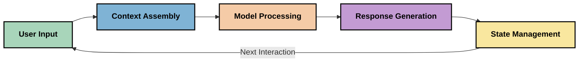
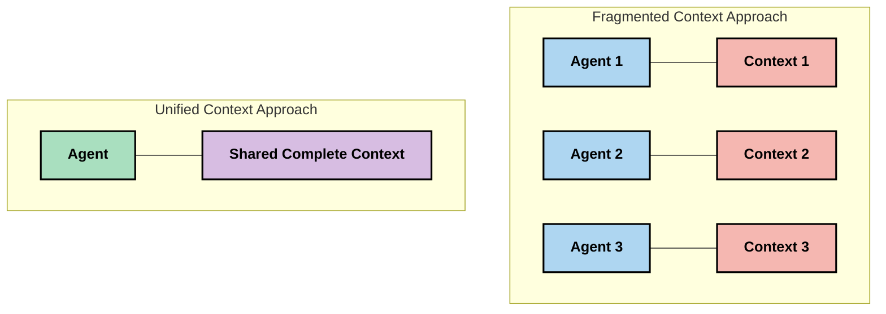
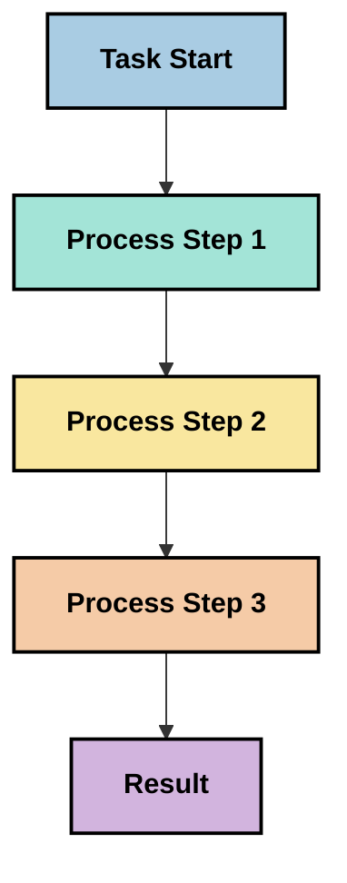
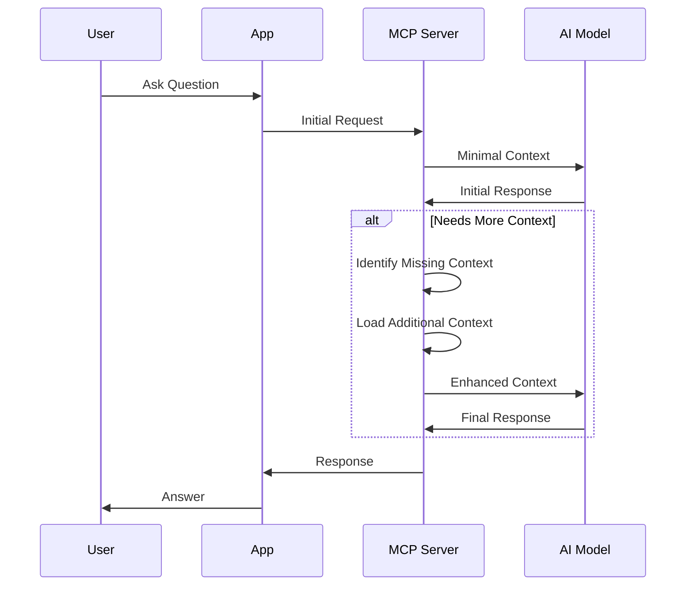
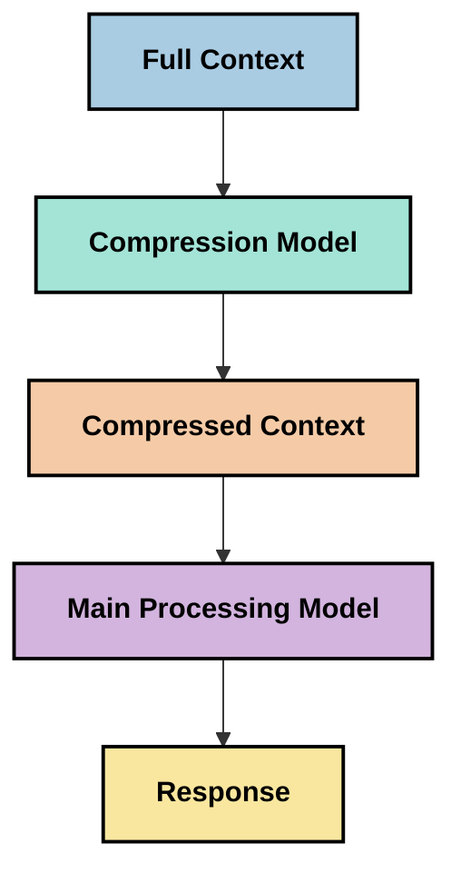

<!--
CO_OP_TRANSLATOR_METADATA:
{
  "original_hash": "fd169ca3071b81b5ee282e194bc823df",
  "translation_date": "2025-09-15T20:53:39+00:00",
  "source_file": "05-AdvancedTopics/mcp-contextengineering/README.md",
  "language_code": "tl"
}
-->
# Context Engineering: Isang Umuusbong na Konsepto sa MCP Ecosystem

## Pangkalahatang-ideya

Ang context engineering ay isang umuusbong na konsepto sa larangan ng AI na tumutukoy kung paano istruktura, ihatid, at panatilihin ang impormasyon sa mga interaksyon sa pagitan ng mga kliyente at AI services. Habang patuloy na umuunlad ang Model Context Protocol (MCP) ecosystem, nagiging mas mahalaga ang pag-unawa sa epektibong pamamahala ng konteksto. Ang module na ito ay nagpapakilala sa konsepto ng context engineering at sinisiyasat ang mga potensyal na aplikasyon nito sa mga implementasyon ng MCP.

## Mga Layunin sa Pag-aaral

Sa pagtatapos ng module na ito, magagawa mong:

- Maunawaan ang umuusbong na konsepto ng context engineering at ang potensyal na papel nito sa mga aplikasyon ng MCP
- Tukuyin ang mga pangunahing hamon sa pamamahala ng konteksto na tinutugunan ng disenyo ng MCP protocol
- Siyasatin ang mga teknik para mapabuti ang performance ng modelo sa pamamagitan ng mas mahusay na pamamahala ng konteksto
- Isaalang-alang ang mga paraan upang sukatin at suriin ang pagiging epektibo ng konteksto
- I-apply ang mga umuusbong na konsepto upang mapabuti ang karanasan sa AI sa pamamagitan ng MCP framework

## Panimula sa Context Engineering

Ang context engineering ay nakatuon sa sinadyang disenyo at pamamahala ng daloy ng impormasyon sa pagitan ng mga user, aplikasyon, at AI models. Hindi tulad ng mga kilalang larangan tulad ng prompt engineering, ang context engineering ay kasalukuyang binubuo ng mga practitioner habang nilulutas nila ang mga natatanging hamon ng pagbibigay sa AI models ng tamang impormasyon sa tamang oras.

Habang umuunlad ang mga large language models (LLMs), nagiging mas malinaw ang kahalagahan ng konteksto. Ang kalidad, kaugnayan, at istruktura ng konteksto na ibinibigay natin ay direktang nakakaapekto sa mga output ng modelo. Ang context engineering ay nagsisiyasat sa relasyong ito at naghahanap ng mga prinsipyo para sa epektibong pamamahala ng konteksto.

> "Sa 2025, ang mga modelo ay sobrang matalino. Ngunit kahit ang pinakamatalinong tao ay hindi magagawang gawin ang kanilang trabaho nang epektibo nang walang konteksto ng kung ano ang hinihingi sa kanila... Ang 'context engineering' ang susunod na antas ng prompt engineering. Ito ay tungkol sa paggawa nito nang awtomatiko sa isang dynamic na sistema." — Walden Yan, Cognition AI

Ang context engineering ay maaaring sumaklaw sa:

1. **Pagpili ng Konteksto**: Pagpapasya kung anong impormasyon ang may kaugnayan para sa isang partikular na gawain
2. **Pag-istruktura ng Konteksto**: Pag-aayos ng impormasyon upang ma-maximize ang pag-unawa ng modelo
3. **Paghahatid ng Konteksto**: Pag-optimize kung paano at kailan ipinapadala ang impormasyon sa mga modelo
4. **Pagpapanatili ng Konteksto**: Pamamahala sa estado at ebolusyon ng konteksto sa paglipas ng panahon
5. **Pagsusuri ng Konteksto**: Pagsukat at pagpapabuti ng pagiging epektibo ng konteksto

Ang mga larangang ito ay partikular na mahalaga sa MCP ecosystem, na nagbibigay ng standardized na paraan para sa mga aplikasyon na magbigay ng konteksto sa LLMs.

## Ang Perspektibo ng Context Journey

Isang paraan upang mailarawan ang context engineering ay ang pagsubaybay sa paglalakbay ng impormasyon sa isang MCP system:



### Mga Pangunahing Yugto sa Context Journey:

1. **Input ng User**: Raw na impormasyon mula sa user (text, images, documents)
2. **Pagbuo ng Konteksto**: Pagsasama ng input ng user sa konteksto ng sistema, kasaysayan ng pag-uusap, at iba pang nakuha na impormasyon
3. **Pagproseso ng Modelo**: Pinoproseso ng AI model ang nabuo na konteksto
4. **Pagbuo ng Tugon**: Gumagawa ang modelo ng mga output batay sa ibinigay na konteksto
5. **Pamamahala ng Estado**: Ina-update ng sistema ang internal na estado nito batay sa interaksyon

Ang perspektibong ito ay nagha-highlight sa dynamic na kalikasan ng konteksto sa mga AI system at nagbubukas ng mahahalagang tanong tungkol sa kung paano pinakamahusay na pamahalaan ang impormasyon sa bawat yugto.

## Umuusbong na Prinsipyo sa Context Engineering

Habang nabubuo ang larangan ng context engineering, may ilang maagang prinsipyo na lumilitaw mula sa mga practitioner. Ang mga prinsipyong ito ay maaaring makatulong sa paghubog ng mga pagpipilian sa implementasyon ng MCP:

### Prinsipyo 1: Ibahagi ang Konteksto nang Buo

Ang konteksto ay dapat ibahagi nang buo sa pagitan ng lahat ng bahagi ng sistema sa halip na hatiin sa iba't ibang ahente o proseso. Kapag ang konteksto ay fragmented, ang mga desisyon na ginawa sa isang bahagi ng sistema ay maaaring sumalungat sa mga desisyon sa ibang bahagi.



Sa mga aplikasyon ng MCP, ito ay nagmumungkahi ng disenyo ng mga sistema kung saan ang konteksto ay dumadaloy nang seamless sa buong pipeline sa halip na compartmentalized.

### Prinsipyo 2: Kilalanin na Ang Mga Aksyon ay May Kasamang Implicit na Desisyon

Ang bawat aksyon na ginagawa ng modelo ay naglalaman ng implicit na desisyon tungkol sa kung paano i-interpret ang konteksto. Kapag ang maraming bahagi ay kumikilos sa iba't ibang konteksto, ang mga implicit na desisyon na ito ay maaaring magkasalungat, na nagreresulta sa hindi pare-parehong mga resulta.

Ang prinsipyong ito ay may mahalagang implikasyon para sa mga aplikasyon ng MCP:
- Mas paboran ang linear na pagproseso ng mga kumplikadong gawain kaysa parallel execution na may fragmented na konteksto
- Siguraduhin na ang lahat ng mga decision point ay may access sa parehong impormasyon ng konteksto
- Magdisenyo ng mga sistema kung saan ang mga susunod na hakbang ay maaaring makita ang buong konteksto ng mga naunang desisyon

### Prinsipyo 3: Balansehin ang Lalim ng Konteksto sa Mga Limitasyon ng Window

Habang tumatagal ang mga pag-uusap at proseso, ang mga context window ay sa huli ay umaapaw. Ang epektibong context engineering ay nagsisiyasat ng mga paraan upang pamahalaan ang tensyon sa pagitan ng komprehensibong konteksto at mga teknikal na limitasyon.

Mga potensyal na paraan na sinisiyasat ay kinabibilangan ng:
- Context compression na pinapanatili ang mahalagang impormasyon habang binabawasan ang paggamit ng token
- Progressive loading ng konteksto batay sa kaugnayan sa kasalukuyang pangangailangan
- Pagbubuod ng mga nakaraang interaksyon habang pinapanatili ang mahahalagang desisyon at katotohanan

## Mga Hamon sa Konteksto at Disenyo ng MCP Protocol

Ang Model Context Protocol (MCP) ay idinisenyo na may kamalayan sa mga natatanging hamon ng pamamahala ng konteksto. Ang pag-unawa sa mga hamon na ito ay tumutulong sa pagpapaliwanag ng mga pangunahing aspeto ng disenyo ng MCP protocol:

### Hamon 1: Mga Limitasyon ng Context Window
Ang karamihan sa mga AI model ay may fixed na laki ng context window, na nililimitahan kung gaano karaming impormasyon ang kaya nilang iproseso nang sabay-sabay.

**Tugon ng Disenyo ng MCP:** 
- Sinusuportahan ng protocol ang structured, resource-based na konteksto na maaaring i-refer nang epektibo
- Ang mga resource ay maaaring i-paginate at i-load nang progresibo

### Hamon 2: Pagpapasya sa Kaugnayan
Ang pagpapasya kung aling impormasyon ang pinaka-kaugnayan na isama sa konteksto ay mahirap.

**Tugon ng Disenyo ng MCP:**
- Flexible na tooling na nagpapahintulot sa dynamic na retrieval ng impormasyon batay sa pangangailangan
- Structured prompts na nagbibigay-daan sa consistent na organisasyon ng konteksto

### Hamon 3: Pagpapanatili ng Konteksto
Ang pamamahala ng estado sa mga interaksyon ay nangangailangan ng maingat na pagsubaybay sa konteksto.

**Tugon ng Disenyo ng MCP:**
- Standardized na session management
- Malinaw na tinukoy na mga pattern ng interaksyon para sa ebolusyon ng konteksto

### Hamon 4: Multi-Modal na Konteksto
Ang iba't ibang uri ng data (text, images, structured data) ay nangangailangan ng iba't ibang paraan ng paghawak.

**Tugon ng Disenyo ng MCP:**
- Ang disenyo ng protocol ay tumatanggap ng iba't ibang uri ng content
- Standardized na representasyon ng multi-modal na impormasyon

### Hamon 5: Seguridad at Privacy
Ang konteksto ay madalas na naglalaman ng sensitibong impormasyon na kailangang protektahan.

**Tugon ng Disenyo ng MCP:**
- Malinaw na hangganan sa pagitan ng mga responsibilidad ng client at server
- Mga opsyon para sa lokal na pagproseso upang mabawasan ang exposure ng data

Ang pag-unawa sa mga hamon na ito at kung paano tinutugunan ng MCP ang mga ito ay nagbibigay ng pundasyon para sa pagsisiyasat ng mas advanced na teknik sa context engineering.

## Umuusbong na Mga Paraan sa Context Engineering

Habang nabubuo ang larangan ng context engineering, may ilang promising na paraan na lumilitaw. Ang mga ito ay kumakatawan sa kasalukuyang pag-iisip sa halip na mga itinatag na pinakamahusay na kasanayan, at malamang na mag-evolve habang nakakakuha tayo ng mas maraming karanasan sa mga implementasyon ng MCP.

### 1. Single-Threaded Linear Processing

Sa halip na multi-agent architectures na nagdi-distribute ng konteksto, natuklasan ng ilang practitioner na ang single-threaded linear processing ay nagbubunga ng mas consistent na resulta. Ito ay naaayon sa prinsipyo ng pagpapanatili ng unified na konteksto.



Bagama't ang approach na ito ay maaaring mukhang mas mabagal kaysa sa parallel processing, madalas itong nagbubunga ng mas coherent at maaasahang resulta dahil ang bawat hakbang ay nakabatay sa kumpletong pag-unawa sa mga naunang desisyon.

### 2. Context Chunking at Prioritization

Pagbabahagi ng malalaking konteksto sa mas maliit na bahagi at pag-prioritize kung ano ang pinaka-mahalaga.

```python
# Conceptual Example: Context Chunking and Prioritization
def process_with_chunked_context(documents, query):
    # 1. Break documents into smaller chunks
    chunks = chunk_documents(documents)
    
    # 2. Calculate relevance scores for each chunk
    scored_chunks = [(chunk, calculate_relevance(chunk, query)) for chunk in chunks]
    
    # 3. Sort chunks by relevance score
    sorted_chunks = sorted(scored_chunks, key=lambda x: x[1], reverse=True)
    
    # 4. Use the most relevant chunks as context
    context = create_context_from_chunks([chunk for chunk, score in sorted_chunks[:5]])
    
    # 5. Process with the prioritized context
    return generate_response(context, query)
```

Ang konsepto sa itaas ay naglalarawan kung paano natin maaaring hatiin ang malalaking dokumento sa mas maliit na bahagi at piliin lamang ang pinaka-kaugnayan na bahagi para sa konteksto. Ang approach na ito ay makakatulong sa pagtrabaho sa mga limitasyon ng context window habang ginagamit pa rin ang malalaking knowledge bases.

### 3. Progressive Context Loading

Pag-load ng konteksto nang progresibo ayon sa pangangailangan sa halip na sabay-sabay.



Ang progressive context loading ay nagsisimula sa minimal na konteksto at lumalawak lamang kapag kinakailangan. Ito ay maaaring makabuluhang bawasan ang paggamit ng token para sa mga simpleng query habang pinapanatili ang kakayahang hawakan ang mga kumplikadong tanong.

### 4. Context Compression at Summarization

Pagbabawas ng laki ng konteksto habang pinapanatili ang mahalagang impormasyon.



Ang context compression ay nakatuon sa:
- Pag-aalis ng redundant na impormasyon
- Pagbubuod ng mahahabang content
- Pagkuha ng mahahalagang katotohanan at detalye
- Pagpapanatili ng mahahalagang elemento ng konteksto
- Pag-optimize para sa token efficiency

Ang approach na ito ay partikular na mahalaga para sa pagpapanatili ng mahabang pag-uusap sa loob ng context windows o para sa epektibong pagproseso ng malalaking dokumento. Ang ilang practitioner ay gumagamit ng mga specialized na modelo partikular para sa context compression at summarization ng kasaysayan ng pag-uusap.

## Mga Pagsasaalang-alang sa Exploratory Context Engineering

Habang sinisiyasat ang umuusbong na larangan ng context engineering, may ilang mga pagsasaalang-alang na mahalaga sa pag-iimplementa ng MCP. Ang mga ito ay hindi prescriptive na pinakamahusay na kasanayan ngunit mga lugar ng pagsisiyasat na maaaring magbunga ng mga pagpapabuti sa iyong partikular na use case.

### Isaalang-alang ang Iyong Mga Layunin sa Konteksto

Bago magpatupad ng mga kumplikadong solusyon sa pamamahala ng konteksto, malinaw na tukuyin kung ano ang nais mong makamit:
- Anong partikular na impormasyon ang kailangan ng modelo upang magtagumpay?
- Aling impormasyon ang mahalaga kumpara sa supplementary?
- Ano ang iyong mga performance constraints (latency, token limits, gastos)?

### Siyasatin ang Layered Context Approaches

Ang ilang practitioner ay nakakakita ng tagumpay sa konteksto na inayos sa conceptual layers:
- **Core Layer**: Mahalagang impormasyon na palaging kailangan ng modelo
- **Situational Layer**: Konteksto na partikular sa kasalukuyang interaksyon
- **Supporting Layer**: Karagdagang impormasyon na maaaring makatulong
- **Fallback Layer**: Impormasyon na ina-access lamang kapag kinakailangan

### Imbestigahan ang Mga Retrieval Strategies

Ang pagiging epektibo ng iyong konteksto ay madalas na nakasalalay sa kung paano mo kinukuha ang impormasyon:
- Semantic search at embeddings para sa paghahanap ng conceptually relevant na impormasyon
- Keyword-based search para sa partikular na factual na detalye
- Hybrid approaches na pinagsasama ang maraming retrieval methods
- Metadata filtering upang paliitin ang saklaw batay sa mga kategorya, petsa, o pinagmulan

### Mag-eksperimento sa Context Coherence

Ang istruktura at daloy ng iyong konteksto ay maaaring makaapekto sa pag-unawa ng modelo:
- Pag-group ng magkakaugnay na impormasyon
- Paggamit ng consistent na formatting at organisasyon
- Pagpapanatili ng logical o chronological na pagkakasunod-sunod kung naaangkop
- Pag-iwas sa magkasalungat na impormasyon

### Timbangin ang Tradeoffs ng Multi-Agent Architectures

Bagama't ang multi-agent architectures ay popular sa maraming AI frameworks, may mga makabuluhang hamon ito para sa pamamahala ng konteksto:
- Ang fragmentation ng konteksto ay maaaring magresulta sa hindi pare-parehong desisyon sa pagitan ng mga ahente
- Ang parallel processing ay maaaring magpakilala ng mga salungatan na mahirap i-reconcile
- Ang communication overhead sa pagitan ng mga ahente ay maaaring mag-offset ng performance gains
- Ang complex na pamamahala ng estado ay kinakailangan upang mapanatili ang coherence

Sa maraming kaso, ang single-agent approach na may komprehensibong pamamahala ng konteksto ay maaaring magbunga ng mas maaasahang resulta kaysa sa maraming specialized na ahente na may fragmented na konteksto.

### Bumuo ng Mga Paraan ng Pagsusuri

Upang mapabuti ang context engineering sa paglipas ng panahon, isaalang-alang kung paano mo susukatin ang tagumpay:
- A/B testing ng iba't ibang istruktura ng konteksto
- Pagsubaybay sa paggamit ng token at response times
- Pagsubaybay sa kasiyahan ng user at task completion rates
- Pagsusuri kung kailan at bakit nabigo ang mga estratehiya sa konteksto

Ang mga pagsasaalang-alang na ito ay kumakatawan sa mga aktibong lugar ng pagsisiyasat sa larangan ng context engineering. Habang nag-mature ang larangan, mas tiyak na mga pattern at kasanayan ang malamang na lilitaw.

## Pagsukat ng Pagiging Epektibo ng Konteksto: Isang Umuusbong na Framework

Habang umuusbong ang context engineering bilang isang konsepto, sinisimulan ng mga practitioner na siyasatin kung paano natin maaaring sukatin ang pagiging epektibo nito. Walang itinatag na framework ang umiiral pa, ngunit iba't ibang mga sukatan ang isinasaalang-alang na maaaring makatulong sa paggabay sa hinaharap na gawain.

### Mga Potensyal na Dimensyon ng Pagsukat

#### 1. Mga Pagsasaalang-alang sa Input Efficiency

- **Context-to-Response Ratio**: Gaano karaming konteksto ang kailangan kumpara sa laki ng tugon?
- **Token Utilization**: Anong porsyento ng ibinigay na mga token ng konteksto ang tila nakakaapekto sa tugon?
- **Context Reduction**: Gaano kabisa ang pag-compress ng raw na impormasyon?

#### 2. Mga Pagsasaalang-alang sa Performance

- **Latency Impact**: Paano nakakaapekto ang pamamahala ng konteksto sa response time?
- **Token Economy**: Na-optimize ba natin ang paggamit ng token nang epektibo?
- **Retrieval Precision**: Gaano kaugnayan ang nakuha na impormasyon?
- **Resource Utilization**: Anong computational resources ang kinakailangan?

#### 3. Mga Pagsasaalang-alang sa Kalidad

- **Response Relevance**: Gaano kahusay ang tugon sa query?
- **Factual Accuracy**: Pinapabuti ba ng pamamahala ng konteksto ang factual correctness?
- **Consistency**: Pare-pareho ba ang mga tugon sa magkatulad na query?
- **Hallucination Rate**: Nabawasan ba ang hallucinations ng modelo sa mas mahusay na konteksto?

#### 4. Mga Pagsasaalang-alang sa Karanasan ng User

- **Follow-up Rate**: Gaano kadalas kailangan ng user ng karagdagang paglilinaw?
- **
- [Model Context Protocol Website](https://modelcontextprotocol.io/)
- [Model Context Protocol Specification](https://github.com/modelcontextprotocol/modelcontextprotocol)
- [MCP Documentation](https://modelcontextprotocol.io/docs)
- [MCP C# SDK](https://github.com/modelcontextprotocol/csharp-sdk)
- [MCP Python SDK](https://github.com/modelcontextprotocol/python-sdk)
- [MCP TypeScript SDK](https://github.com/modelcontextprotocol/typescript-sdk)
- [MCP Inspector](https://github.com/modelcontextprotocol/inspector) - Visual na tool para sa pagsusuri ng MCP servers

### Mga Artikulo Tungkol sa Context Engineering
- [Huwag Gumawa ng Multi-Agents: Mga Prinsipyo ng Context Engineering](https://cognition.ai/blog/dont-build-multi-agents) - Mga pananaw ni Walden Yan sa mga prinsipyo ng context engineering
- [Praktikal na Gabay sa Paggawa ng Agents](https://cdn.openai.com/business-guides-and-resources/a-practical-guide-to-building-agents.pdf) - Gabay ng OpenAI sa epektibong disenyo ng agents
- [Paggawa ng Epektibong Agents](https://www.anthropic.com/engineering/building-effective-agents) - Diskarte ng Anthropic sa pag-develop ng agents

### Kaugnay na Pananaliksik
- [Dynamic Retrieval Augmentation para sa Malalaking Language Models](https://arxiv.org/abs/2310.01487) - Pananaliksik tungkol sa mga dynamic retrieval na pamamaraan
- [Lost in the Middle: Paano Ginagamit ng Language Models ang Mahahabang Contexts](https://arxiv.org/abs/2307.03172) - Mahalagang pananaliksik tungkol sa mga pattern ng pagproseso ng context
- [Hierarchical Text-Conditioned Image Generation gamit ang CLIP Latents](https://arxiv.org/abs/2204.06125) - Papel ng DALL-E 2 na may mga pananaw sa pag-istruktura ng context
- [Paggalugad sa Papel ng Context sa Arkitektura ng Malalaking Language Models](https://aclanthology.org/2023.findings-emnlp.124/) - Kamakailang pananaliksik tungkol sa paghawak ng context
- [Multi-Agent Collaboration: Isang Survey](https://arxiv.org/abs/2304.03442) - Pananaliksik tungkol sa mga sistema ng multi-agent at ang kanilang mga hamon

### Karagdagang Mga Mapagkukunan
- [Mga Teknik sa Pag-optimize ng Context Window](https://learn.microsoft.com/en-us/azure/ai-services/openai/concepts/context-window)
- [Advanced RAG Techniques](https://www.microsoft.com/en-us/research/blog/retrieval-augmented-generation-rag-and-frontier-models/)
- [Semantic Kernel Documentation](https://github.com/microsoft/semantic-kernel)
- [AI Toolkit para sa Context Management](https://github.com/microsoft/aitoolkit)

## Ano ang susunod 

- [5.15 MCP Custom Transport](../mcp-transport/README.md)

---

**Paunawa**:  
Ang dokumentong ito ay isinalin gamit ang AI translation service na [Co-op Translator](https://github.com/Azure/co-op-translator). Bagama't sinisikap naming maging tumpak, tandaan na ang mga awtomatikong pagsasalin ay maaaring maglaman ng mga pagkakamali o hindi pagkakatugma. Ang orihinal na dokumento sa kanyang katutubong wika ang dapat ituring na opisyal na sanggunian. Para sa mahalagang impormasyon, inirerekomenda ang propesyonal na pagsasalin ng tao. Hindi kami mananagot sa anumang hindi pagkakaunawaan o maling interpretasyon na maaaring magmula sa paggamit ng pagsasaling ito.