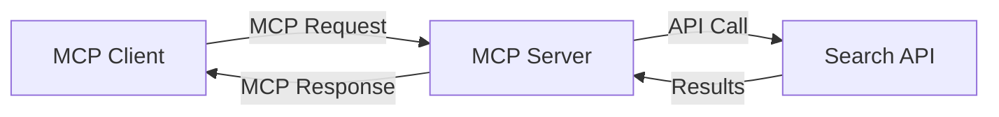
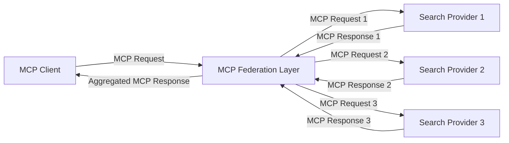
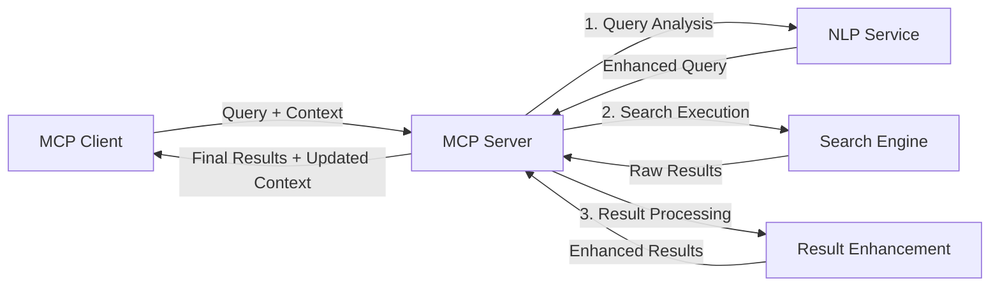

<!--
CO_OP_TRANSLATOR_METADATA:
{
  "original_hash": "eb12652eb7bd17f2193b835a344425c6",
  "translation_date": "2025-06-26T14:15:13+00:00",
  "source_file": "05-AdvancedTopics/mcp-realtimesearch/README.md",
  "language_code": "tl"
}
-->
## Code Examples Disclaimer

> **Important Note**: Ipinapakita ng mga halimbawa ng code sa ibaba ang pagsasama ng Model Context Protocol (MCP) sa web search functionality. Bagaman sinusunod nila ang mga pattern at istruktura ng opisyal na MCP SDKs, pinaikli ang mga ito para sa layuning pang-edukasyon.
> 
> Ipinapakita ng mga halimbawa na ito:
> 
> 1. **Python Implementation**: Isang FastMCP server implementation na nagbibigay ng web search tool at kumokonekta sa isang external na search API. Ipinapakita ng halimbawang ito ang tamang pamamahala ng lifespan, paghawak ng context, at implementasyon ng tool na sumusunod sa mga pattern ng [opisyal na MCP Python SDK](https://github.com/modelcontextprotocol/python-sdk). Ginagamit ng server ang inirerekomendang Streamable HTTP transport na pumalit sa mas lumang SSE transport para sa production deployments.
> 
> 2. **JavaScript Implementation**: Isang TypeScript/JavaScript implementation gamit ang FastMCP pattern mula sa [opisyal na MCP TypeScript SDK](https://github.com/modelcontextprotocol/typescript-sdk) para gumawa ng search server na may tamang tool definitions at client connections. Sinusunod nito ang pinakabagong inirerekomendang mga pattern para sa session management at pagpapanatili ng context.
> 
> Nangangailangan ang mga halimbawang ito ng karagdagang error handling, authentication, at partikular na API integration code para sa production use. Ang mga search API endpoints na ipinakita (`https://api.search-service.example/search`) ay mga placeholder at kailangang palitan ng aktwal na search service endpoints.
> 
> Para sa kumpletong detalye ng implementasyon at pinakabagong mga pamamaraan, mangyaring tingnan ang [opisyal na MCP specification](https://spec.modelcontextprotocol.io/) at dokumentasyon ng SDK.

## Core Concepts

### The Model Context Protocol (MCP) Framework

Sa pinaka-pundasyon nito, nagbibigay ang Model Context Protocol ng standardized na paraan para sa palitan ng context sa pagitan ng AI models, applications, at services. Sa real-time web search, mahalaga ang framework na ito para makalikha ng magkakaugnay at maraming turn na search experiences. Kasama sa mga pangunahing bahagi nito ang:

1. **Client-Server Architecture**: Nagtatakda ang MCP ng malinaw na paghahati sa pagitan ng search clients (mga humihiling) at search servers (mga nagbibigay), na nagpapahintulot ng flexible na deployment models.

2. **JSON-RPC Communication**: Ginagamit ng protocol ang JSON-RPC para sa pagpapalitan ng mga mensahe, kaya compatible ito sa mga web technologies at madaling ipatupad sa iba't ibang platform.

3. **Context Management**: Nagtatakda ang MCP ng mga istrukturadong pamamaraan para sa pagpapanatili, pag-update, at paggamit ng search context sa maraming interaksyon.

4. **Tool Definitions**: Ang mga kakayahan sa paghahanap ay inilalantad bilang standardized na mga tool na may malinaw na mga parameter at return values.

5. **Streaming Support**: Sinusuportahan ng protocol ang streaming ng mga resulta, na mahalaga para sa real-time search kung saan maaaring dumarating nang paunti-unti ang mga resulta.

### Web Search Integration Patterns

Kapag isinama ang MCP sa web search, lumilitaw ang ilang mga pattern:

#### 1. Direct Search Provider Integration

Sa pattern na ito, direktang nakikipag-ugnayan ang MCP server sa isa o higit pang search APIs, isinasalin ang mga MCP request sa mga API-specific na tawag at ini-format ang mga resulta bilang mga MCP response.

#### 2. Federated Search with Context Preservation

Ipinapamahagi ng pattern na ito ang mga search query sa maraming MCP-compatible na search providers, na maaaring may espesyalisasyon sa iba't ibang uri ng nilalaman o kakayahan sa paghahanap, habang pinapanatili ang iisang context.

#### 3. Context-Enhanced Search Chain

Hinahati sa maraming yugto ang proseso ng paghahanap sa pattern na ito, kung saan pinayayaman ang context sa bawat hakbang, na nagreresulta sa unti-unting mas nauugnay na mga resulta.

### Search Context Components

Sa MCP-based web search, karaniwang kasama sa context ang:

- **Query History**: Mga naunang search query sa session
- **User Preferences**: Wika, rehiyon, mga setting ng safe search
- **Interaction History**: Aling mga resulta ang na-click, oras na ginugol sa mga resulta
- **Search Parameters**: Mga filter, ayos ng sort, at iba pang mga modifier ng paghahanap
- **Domain Knowledge**: Espesipikong konteksto ng paksa na may kaugnayan sa paghahanap
- **Temporal Context**: Mga salik ng kaugnayan base sa oras
- **Source Preferences**: Mga pinagkakatiwalaan o paboritong pinagmumulan ng impormasyon

## Use Cases and Applications

### Research and Information Gathering

Pinapalakas ng MCP ang mga workflow ng pananaliksik sa pamamagitan ng:

- Pagpapanatili ng research context sa mga search session
- Pagpapahintulot ng mas sopistikado at kontekstwal na mga query
- Pagsuporta sa multi-source search federation
- Pagpapadali ng pagkuha ng kaalaman mula sa mga resulta ng paghahanap

### Real-Time News and Trend Monitoring

Nagbibigay ang MCP-powered search ng mga benepisyo para sa pagmo-monitor ng balita:

- Halos real-time na pagtuklas ng mga umuusbong na balita
- Kontekstwal na pagsasala ng may kaugnayang impormasyon
- Pagsubaybay sa mga paksa at entidad mula sa maraming pinagmumulan
- Personalized na mga alerto ng balita base sa user context

### AI-Augmented Browsing and Research

Lumilikha ang MCP ng mga bagong posibilidad para sa AI-augmented browsing:

- Kontekstwal na mga mungkahi sa paghahanap base sa kasalukuyang aktibidad sa browser
- Seamless na pagsasama ng web search sa mga LLM-powered na assistant
- Maramihang turn na pag-refine ng paghahanap na may pinananatiling context
- Pinahusay na fact-checking at pag-verify ng impormasyon

## Future Trends and Innovations

### Evolution of MCP in Web Search

Sa hinaharap, inaasahan nating lalago ang MCP upang tugunan ang:

- **Multimodal Search**: Pagsasama ng text, larawan, audio, at video search na may pinananatiling context
- **Decentralized Search**: Pagsuporta sa distributed at federated na mga search ecosystem
- **Search Privacy**: Mga mekanismo ng privacy-preserving search na may awareness sa context
- **Query Understanding**: Malalim na semantic parsing ng natural language search queries

### Potential Advancements in Technology

Mga umuusbong na teknolohiya na huhubog sa hinaharap ng MCP search:

1. **Neural Search Architectures**: Mga embedding-based na search system na na-optimize para sa MCP
2. **Personalized Search Context**: Pag-aaral ng mga indibidwal na pattern ng paghahanap ng user sa paglipas ng panahon
3. **Knowledge Graph Integration**: Kontekstwal na paghahanap na pinahusay ng domain-specific knowledge graphs
4. **Cross-Modal Context**: Pagpapanatili ng context sa iba't ibang modality ng paghahanap

## Hands-On Exercises

### Exercise 1: Setting Up a Basic MCP Search Pipeline

Sa pagsasanay na ito, matututuhan mo kung paano:

- I-configure ang isang basic MCP search environment
- I-implement ang context handlers para sa web search
- Subukan at i-validate ang pagpapanatili ng context sa mga search iteration

### Exercise 2: Building a Research Assistant with MCP Search

Gumawa ng isang kumpletong aplikasyon na:

- Nagpoproseso ng natural language research questions
- Gumagawa ng context-aware web searches
- Nagsasama-sama ng impormasyon mula sa maraming pinagmumulan
- Nagpapakita ng organisadong mga resulta ng pananaliksik

### Exercise 3: Implementing Multi-Source Search Federation with MCP

Isang advanced na pagsasanay na sumasaklaw sa:

- Context-aware na pagpapadala ng query sa maraming search engine
- Pag-rank at pag-aggregate ng mga resulta
- Contextual deduplication ng mga resulta ng paghahanap
- Pag-handle ng source-specific metadata

## Additional Resources

- [Model Context Protocol Specification](https://spec.modelcontextprotocol.io/) - Opisyal na MCP specification at detalyadong dokumentasyon ng protocol
- [Model Context Protocol Documentation](https://modelcontextprotocol.io/) - Detalyadong tutorial at gabay sa implementasyon
- [MCP Python SDK](https://github.com/modelcontextprotocol/python-sdk) - Opisyal na Python implementation ng MCP protocol
- [MCP TypeScript SDK](https://github.com/modelcontextprotocol/typescript-sdk) - Opisyal na TypeScript implementation ng MCP protocol
- [MCP Reference Servers](https://github.com/modelcontextprotocol/servers) - Mga reference implementation ng MCP servers
- [Bing Web Search API Documentation](https://learn.microsoft.com/en-us/bing/search-apis/bing-web-search/overview) - Web search API ng Microsoft
- [Google Custom Search JSON API](https://developers.google.com/custom-search/v1/overview) - Programmable search engine ng Google
- [SerpAPI Documentation](https://serpapi.com/search-api) - Search engine results page API
- [Meilisearch Documentation](https://www.meilisearch.com/docs) - Open-source search engine
- [Elasticsearch Documentation](https://www.elastic.co/guide/index.html) - Distributed search at analytics engine
- [LangChain Documentation](https://python.langchain.com/docs/get_started/introduction) - Pagbuo ng mga aplikasyon gamit ang LLMs

## Learning Outcomes

Sa pagtatapos ng module na ito, magagawa mong:

- Maunawaan ang mga pundasyon ng real-time web search at ang mga hamon nito
- Ipaliwanag kung paano pinapalakas ng Model Context Protocol (MCP) ang kakayahan ng real-time web search
- Mag-implementa ng MCP-based na mga solusyon sa paghahanap gamit ang mga kilalang framework at API
- Magdisenyo at mag-deploy ng scalable at high-performance na mga arkitektura ng paghahanap gamit ang MCP
- I-apply ang mga konsepto ng MCP sa iba't ibang use case kabilang ang semantic search, research assistance, at AI-augmented browsing
- Suriin ang mga umuusbong na trend at mga bagong inobasyon sa MCP-based na teknolohiya sa paghahanap

### Trust and Safety Considerations

Kapag nag-implementa ng MCP-based na web search solutions, tandaan ang mga mahahalagang prinsipyo mula sa MCP specification:

1. **User Consent and Control**: Dapat malinaw na pumayag at maunawaan ng mga user ang lahat ng data access at operasyon. Mahalaga ito lalo na sa mga web search implementation na maaaring kumonekta sa mga external na data source.

2. **Data Privacy**: Siguraduhing maayos ang paghawak sa mga search query at resulta, lalo na kung maaaring may sensitibong impormasyon. Magpatupad ng angkop na access control para protektahan ang data ng user.

3. **Tool Safety**: Mag-implementa ng tamang authorization at validation para sa mga search tool, dahil maaari itong maging potensyal na security risk sa pamamagitan ng arbitrary code execution. Ang mga paglalarawan ng tool behavior ay dapat ituring na hindi pinagkakatiwalaan maliban kung nanggaling sa trusted server.

4. **Clear Documentation**: Magbigay ng malinaw na dokumentasyon tungkol sa kakayahan, limitasyon, at mga konsiderasyon sa seguridad ng iyong MCP-based na search implementation, alinsunod sa mga patnubay ng MCP specification.

5. **Robust Consent Flows**: Bumuo ng matibay na consent at authorization flows na malinaw na nagpapaliwanag kung ano ang ginagawa ng bawat tool bago payagan ang paggamit nito, lalo na para sa mga tool na nakikipag-ugnayan sa mga external web resources.

Para sa kumpletong detalye tungkol sa seguridad at trust considerations ng MCP, tingnan ang [opisyal na dokumentasyon](https://modelcontextprotocol.io/specification/2025-03-26#security-and-trust-%26-safety).

## What's next 

- [5.11 Entra ID Authentication for Model Context Protocol Servers](../mcp-security-entra/README.md)

**Pahayag ng Pagsuway**:  
Ang dokumentong ito ay isinalin gamit ang AI translation service na [Co-op Translator](https://github.com/Azure/co-op-translator). Bagamat nagsusumikap kami para sa katumpakan, pakatandaan na ang mga awtomatikong pagsasalin ay maaaring maglaman ng mga pagkakamali o kamalian. Ang orihinal na dokumento sa orihinal nitong wika ang dapat ituring na pangunahing sanggunian. Para sa mahahalagang impormasyon, inirerekomenda ang propesyonal na pagsasalin ng tao. Hindi kami mananagot sa anumang hindi pagkakaunawaan o maling interpretasyon na maaaring magmula sa paggamit ng pagsasaling ito.