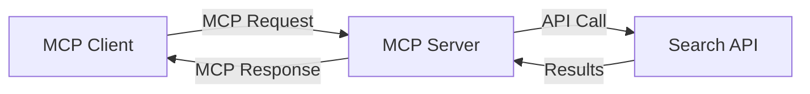
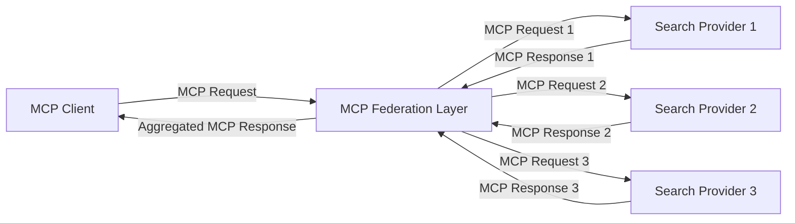
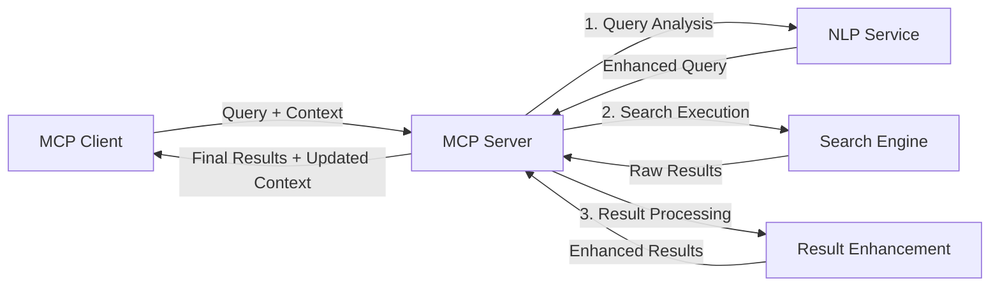

<!--
CO_OP_TRANSLATOR_METADATA:
{
  "original_hash": "eb12652eb7bd17f2193b835a344425c6",
  "translation_date": "2025-07-14T01:13:19+00:00",
  "source_file": "05-AdvancedTopics/mcp-realtimesearch/README.md",
  "language_code": "tl"
}
-->
## Paunawa sa Mga Halimbawa ng Code

> **Mahalagang Paalala**: Ang mga halimbawa ng code sa ibaba ay nagpapakita ng integrasyon ng Model Context Protocol (MCP) sa web search functionality. Bagaman sumusunod ang mga ito sa mga pattern at istruktura ng opisyal na MCP SDKs, pinasimple ang mga ito para sa layuning pang-edukasyon.
> 
> Ipinapakita ng mga halimbawa na ito:
> 
> 1. **Implementasyon sa Python**: Isang FastMCP server implementation na nagbibigay ng web search tool at kumokonekta sa isang external search API. Ipinapakita ng halimbawang ito ang tamang pamamahala ng lifespan, paghawak ng context, at implementasyon ng tool na sumusunod sa mga pattern ng [opisyal na MCP Python SDK](https://github.com/modelcontextprotocol/python-sdk). Ginagamit ng server ang inirerekomendang Streamable HTTP transport na pumalit sa mas lumang SSE transport para sa production deployments.
> 
> 2. **Implementasyon sa JavaScript**: Isang TypeScript/JavaScript implementation gamit ang FastMCP pattern mula sa [opisyal na MCP TypeScript SDK](https://github.com/modelcontextprotocol/typescript-sdk) upang lumikha ng search server na may tamang tool definitions at client connections. Sinusunod nito ang pinakabagong inirerekomendang mga pattern para sa session management at pagpapanatili ng context.
> 
> Kailangan pa ng karagdagang error handling, authentication, at partikular na API integration code para sa production use ang mga halimbawang ito. Ang mga search API endpoints na ipinakita (`https://api.search-service.example/search`) ay mga placeholder lamang at kailangang palitan ng aktwal na mga endpoint ng search service.
> 
> Para sa kumpletong detalye ng implementasyon at pinakabagong mga pamamaraan, mangyaring sumangguni sa [opisyal na MCP specification](https://spec.modelcontextprotocol.io/) at dokumentasyon ng SDK.

## Pangunahing Konsepto

### Ang Model Context Protocol (MCP) Framework

Sa pinakapundasyon nito, ang Model Context Protocol ay nagbibigay ng isang standardized na paraan para sa mga AI models, aplikasyon, at serbisyo na magpalitan ng context. Sa real-time web search, mahalaga ang framework na ito para makalikha ng magkakaugnay at multi-turn na karanasan sa paghahanap. Kabilang sa mga pangunahing bahagi nito ang:

1. **Client-Server Architecture**: Itinataguyod ng MCP ang malinaw na paghihiwalay sa pagitan ng mga search client (nagre-request) at search server (nagbibigay), na nagpapahintulot ng flexible na deployment models.

2. **JSON-RPC Communication**: Ginagamit ng protocol ang JSON-RPC para sa pagpapalitan ng mensahe, kaya compatible ito sa mga web technologies at madaling ipatupad sa iba't ibang platform.

3. **Context Management**: Nagbibigay ang MCP ng mga istrukturadong pamamaraan para mapanatili, ma-update, at magamit ang search context sa maraming interaksyon.

4. **Tool Definitions**: Ang mga kakayahan sa paghahanap ay inilalantad bilang standardized na mga tool na may malinaw na mga parameter at return values.

5. **Streaming Support**: Sinusuportahan ng protocol ang streaming ng mga resulta, na mahalaga para sa real-time search kung saan maaaring dumarating nang paunti-unti ang mga resulta.

### Mga Pattern sa Integrasyon ng Web Search

Kapag iniintegrate ang MCP sa web search, lumilitaw ang ilang mga pattern:

#### 1. Direktang Integrasyon ng Search Provider

Sa pattern na ito, direktang nakikipag-ugnayan ang MCP server sa isa o higit pang search APIs, isinasalin ang mga MCP request sa mga API-specific na tawag at ini-format ang mga resulta bilang MCP responses.

#### 2. Federated Search na may Pagpapanatili ng Context

Ipinapamahagi ng pattern na ito ang mga search query sa maraming MCP-compatible na search provider, na maaaring may espesyalisasyon sa iba't ibang uri ng nilalaman o kakayahan sa paghahanap, habang pinananatili ang iisang context.

#### 3. Context-Enhanced Search Chain

Hinahati sa maraming yugto ang proseso ng paghahanap sa pattern na ito, kung saan pinayayaman ang context sa bawat hakbang, na nagreresulta sa unti-unting mas may kaugnayang mga resulta.

### Mga Bahagi ng Search Context

Sa MCP-based na web search, karaniwang kasama sa context ang:

- **Kasaysayan ng Query**: Mga naunang search query sa session
- **Mga Kagustuhan ng User**: Wika, rehiyon, mga setting ng safe search
- **Kasaysayan ng Interaksyon**: Aling mga resulta ang na-click, oras na ginugol sa mga resulta
- **Mga Parameter ng Paghahanap**: Mga filter, ayos ng sort, at iba pang mga modifier ng paghahanap
- **Kaalamang Pang-domain**: Konteksto na may kaugnayan sa partikular na paksa ng paghahanap
- **Temporal na Konteksto**: Mga salik ng kaugnayan batay sa oras
- **Mga Kagustuhan sa Pinagmulan**: Mga pinagkakatiwalaan o paboritong pinagmumulan ng impormasyon

## Mga Gamit at Aplikasyon

### Pananaliksik at Pangangalap ng Impormasyon

Pinapahusay ng MCP ang mga workflow sa pananaliksik sa pamamagitan ng:

- Pagpapanatili ng konteksto ng pananaliksik sa mga session ng paghahanap
- Pagpapahintulot ng mas sopistikado at kontekstwal na mga query
- Pagsuporta sa multi-source search federation
- Pagpapadali ng pagkuha ng kaalaman mula sa mga resulta ng paghahanap

### Real-Time na Pagsubaybay ng Balita at Trend

Nagbibigay ang MCP-powered search ng mga benepisyo para sa pagsubaybay ng balita:

- Halos real-time na pagtuklas ng mga umuusbong na balita
- Kontekstwal na pagsasala ng mga may kaugnayang impormasyon
- Pagsubaybay sa mga paksa at entidad mula sa maraming pinagmulan
- Personalized na mga alerto sa balita batay sa konteksto ng user

### AI-Augmented Browsing at Pananaliksik

Lumilikha ang MCP ng mga bagong posibilidad para sa AI-augmented browsing:

- Mga kontekstwal na mungkahi sa paghahanap batay sa kasalukuyang aktibidad sa browser
- Seamless na integrasyon ng web search sa mga LLM-powered na assistant
- Multi-turn na pagpapahusay ng paghahanap na may pinananatiling konteksto
- Pinahusay na fact-checking at beripikasyon ng impormasyon

## Mga Hinaharap na Trend at Inobasyon

### Ebolusyon ng MCP sa Web Search

Sa hinaharap, inaasahan nating umunlad ang MCP upang tugunan ang:

- **Multimodal Search**: Pagsasama ng text, larawan, audio, at video search na may pinananatiling konteksto
- **Decentralized Search**: Pagsuporta sa distributed at federated na mga ecosystem ng paghahanap
- **Search Privacy**: Mga mekanismong nagpoprotekta sa privacy na may kamalayan sa konteksto ng paghahanap  
- **Query Understanding**: Malalim na semantikong pagsusuri ng mga natural na wikang query sa paghahanap  

### Mga Posibleng Pag-unlad sa Teknolohiya  

Mga umuusbong na teknolohiya na huhubog sa hinaharap ng MCP search:  

1. **Neural Search Architectures**: Mga sistema ng paghahanap na nakabase sa embedding na ini-optimize para sa MCP  
2. **Personalized Search Context**: Pag-aaral ng mga indibidwal na pattern ng paghahanap ng user sa paglipas ng panahon  
3. **Knowledge Graph Integration**: Paghahanap na may konteksto na pinahusay ng mga domain-specific knowledge graph  
4. **Cross-Modal Context**: Pagpapanatili ng konteksto sa iba't ibang modality ng paghahanap  

## Mga Hands-On na Pagsasanay  

### Pagsasanay 1: Pag-set Up ng Basic MCP Search Pipeline  

Sa pagsasanay na ito, matututuhan mo kung paano:  
- I-configure ang isang basic na MCP search environment  
- Magpatupad ng mga context handler para sa web search  
- Subukan at patunayan ang pagpapanatili ng konteksto sa bawat pag-uulit ng paghahanap  

### Pagsasanay 2: Paggawa ng Research Assistant gamit ang MCP Search  

Gumawa ng kumpletong aplikasyon na:  
- Nagpoproseso ng mga tanong sa pananaliksik gamit ang natural na wika  
- Nagsasagawa ng context-aware na web search  
- Nagsasama-sama ng impormasyon mula sa iba't ibang pinagmulan  
- Nagpapakita ng organisadong mga resulta ng pananaliksik  

### Pagsasanay 3: Pagpapatupad ng Multi-Source Search Federation gamit ang MCP  

Mas advanced na pagsasanay na sumasaklaw sa:  
- Context-aware na pagpapadala ng query sa maraming search engine  
- Pag-ranggo at pagsasama-sama ng mga resulta  
- Contextual na deduplication ng mga resulta ng paghahanap  
- Pag-handle ng source-specific metadata  

## Karagdagang Mga Mapagkukunan  

- [Model Context Protocol Specification](https://spec.modelcontextprotocol.io/) - Opisyal na MCP specification at detalyadong dokumentasyon ng protocol  
- [Model Context Protocol Documentation](https://modelcontextprotocol.io/) - Detalyadong mga tutorial at gabay sa pagpapatupad  
- [MCP Python SDK](https://github.com/modelcontextprotocol/python-sdk) - Opisyal na Python implementation ng MCP protocol  
- [MCP TypeScript SDK](https://github.com/modelcontextprotocol/typescript-sdk) - Opisyal na TypeScript implementation ng MCP protocol  
- [MCP Reference Servers](https://github.com/modelcontextprotocol/servers) - Mga reference implementation ng MCP servers  
- [Bing Web Search API Documentation](https://learn.microsoft.com/en-us/bing/search-apis/bing-web-search/overview) - Web search API ng Microsoft  
- [Google Custom Search JSON API](https://developers.google.com/custom-search/v1/overview) - Programmable search engine ng Google  
- [SerpAPI Documentation](https://serpapi.com/search-api) - API para sa search engine results page  
- [Meilisearch Documentation](https://www.meilisearch.com/docs) - Open-source na search engine  
- [Elasticsearch Documentation](https://www.elastic.co/guide/index.html) - Distributed search at analytics engine  
- [LangChain Documentation](https://python.langchain.com/docs/get_started/introduction) - Paggawa ng mga aplikasyon gamit ang LLMs  

## Mga Matututuhan  

Sa pagtatapos ng module na ito, magagawa mong:  

- Maunawaan ang mga pundasyon ng real-time web search at ang mga hamon nito  
- Ipaliwanag kung paano pinapahusay ng Model Context Protocol (MCP) ang kakayahan ng real-time web search  
- Magpatupad ng mga solusyon sa paghahanap gamit ang MCP gamit ang mga kilalang framework at API  
- Magdisenyo at mag-deploy ng scalable at high-performance na search architectures gamit ang MCP  
- I-apply ang mga konsepto ng MCP sa iba't ibang use case kabilang ang semantic search, research assistance, at AI-augmented browsing  
- Suriin ang mga umuusbong na trend at mga hinaharap na inobasyon sa teknolohiya ng MCP-based search  

### Mga Pagsasaalang-alang sa Trust at Safety  

Kapag nagpapatupad ng MCP-based web search solutions, tandaan ang mga mahahalagang prinsipyo mula sa MCP specification:  

1. **User Consent and Control**: Dapat malinaw na pumayag at maintindihan ng mga user ang lahat ng access sa data at mga operasyon. Mahalaga ito lalo na sa mga web search implementation na maaaring kumonekta sa mga panlabas na pinagmumulan ng data.  

2. **Data Privacy**: Siguraduhing maayos ang paghawak sa mga query at resulta ng paghahanap, lalo na kung maaaring may sensitibong impormasyon. Magpatupad ng angkop na access control para protektahan ang data ng user.  

3. **Tool Safety**: Magpatupad ng tamang authorization at validation para sa mga search tool, dahil maaari itong magdulot ng panganib sa seguridad sa pamamagitan ng arbitrary code execution. Ang mga paglalarawan ng behavior ng tool ay hindi dapat pagkatiwalaan maliban kung galing sa trusted server.  

4. **Clear Documentation**: Magbigay ng malinaw na dokumentasyon tungkol sa kakayahan, limitasyon, at mga pagsasaalang-alang sa seguridad ng iyong MCP-based search implementation, alinsunod sa mga gabay mula sa MCP specification.  

5. **Robust Consent Flows**: Bumuo ng matibay na proseso ng consent at authorization na malinaw na nagpapaliwanag kung ano ang ginagawa ng bawat tool bago payagan ang paggamit nito, lalo na sa mga tool na kumokonekta sa mga panlabas na web resources.  

Para sa kumpletong detalye tungkol sa seguridad at trust considerations ng MCP, tingnan ang [opisyal na dokumentasyon](https://modelcontextprotocol.io/specification/2025-03-26#security-and-trust-%26-safety).  

## Ano ang susunod  

- [5.11 Entra ID Authentication for Model Context Protocol Servers](../mcp-security-entra/README.md)

**Paalala**:  
Ang dokumentong ito ay isinalin gamit ang AI translation service na [Co-op Translator](https://github.com/Azure/co-op-translator). Bagamat nagsusumikap kami para sa katumpakan, pakatandaan na ang mga awtomatikong pagsasalin ay maaaring maglaman ng mga pagkakamali o di-tumpak na impormasyon. Ang orihinal na dokumento sa kanyang sariling wika ang dapat ituring na pangunahing sanggunian. Para sa mahahalagang impormasyon, inirerekomenda ang propesyonal na pagsasalin ng tao. Hindi kami mananagot sa anumang hindi pagkakaunawaan o maling interpretasyon na maaaring magmula sa paggamit ng pagsasaling ito.