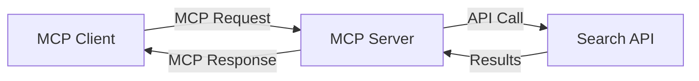
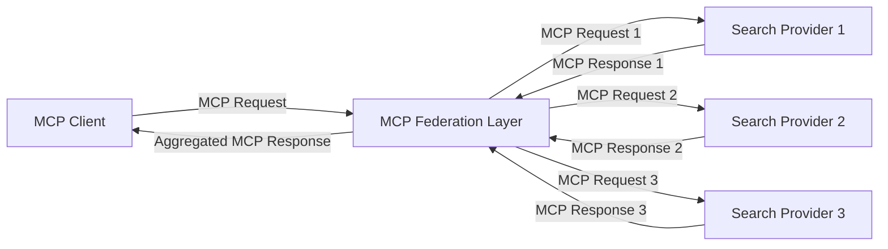
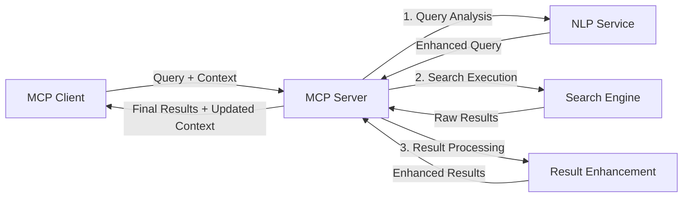

<!--
CO_OP_TRANSLATOR_METADATA:
{
  "original_hash": "16bef2c93c6a86d4ca6a8ce9e120e384",
  "translation_date": "2025-06-13T02:56:53+00:00",
  "source_file": "05-AdvancedTopics/mcp-realtimesearch/README.md",
  "language_code": "tl"
}
-->
## Code Examples Disclaimer

> **Important Note**: Ang mga code example sa ibaba ay nagpapakita ng integrasyon ng Model Context Protocol (MCP) sa web search functionality. Bagaman sumusunod ito sa mga pattern at istruktura ng opisyal na MCP SDKs, pinasimple ito para sa layuning pang-edukasyon.
> 
> Ipinapakita ng mga example na ito:
> 
> 1. **Python Implementation**: Isang FastMCP server implementation na nagbibigay ng web search tool at kumokonekta sa external search API. Ipinapakita ng example na ito ang tamang pamamahala ng lifespan, paghawak ng context, at implementasyon ng tool na sumusunod sa mga pattern ng [opisyal na MCP Python SDK](https://github.com/modelcontextprotocol/python-sdk). Ginagamit ng server ang inirerekomendang Streamable HTTP transport na pumalit sa lumang SSE transport para sa production deployments.
> 
> 2. **JavaScript Implementation**: Isang TypeScript/JavaScript implementation gamit ang FastMCP pattern mula sa [opisyal na MCP TypeScript SDK](https://github.com/modelcontextprotocol/typescript-sdk) upang gumawa ng search server na may tamang tool definitions at client connections. Sinusunod nito ang pinakabagong inirerekomendang pattern para sa session management at context preservation.
> 
> Kailangan pa ng dagdag na error handling, authentication, at espesipikong API integration code para sa production use ang mga example na ito. Ang mga search API endpoints na ipinakita (`https://api.search-service.example/search`) ay placeholder lamang at kailangang palitan ng totoong search service endpoints.
> 
> Para sa kompletong detalye ng implementasyon at pinakabagong mga pamamaraan, mangyaring tingnan ang [opisyal na MCP specification](https://spec.modelcontextprotocol.io/) at dokumentasyon ng SDK.

## Core Concepts

### The Model Context Protocol (MCP) Framework

Sa pinakapundasyon, ang Model Context Protocol ay nagbibigay ng standardisadong paraan para sa AI models, applications, at services na magpalitan ng context. Sa real-time web search, mahalaga ang framework na ito para makagawa ng magkakaugnay at multi-turn na karanasan sa paghahanap. Kabilang sa mga pangunahing bahagi nito ang:

1. **Client-Server Architecture**: Itinatag ng MCP ang malinaw na paghihiwalay sa pagitan ng search clients (nagre-request) at search servers (nagbibigay), na nagpapahintulot ng flexible na deployment models.

2. **JSON-RPC Communication**: Ginagamit ng protocol ang JSON-RPC para sa pagpapalitan ng mensahe, kaya compatible ito sa web technologies at madaling i-implement sa iba't ibang platform.

3. **Context Management**: Nagde-define ang MCP ng mga istrukturadong pamamaraan para mapanatili, ma-update, at magamit ang search context sa maraming interaksyon.

4. **Tool Definitions**: Ang mga kakayahan sa paghahanap ay inilalantad bilang standardized na mga tool na may malinaw na parameters at return values.

5. **Streaming Support**: Sinusuportahan ng protocol ang streaming ng resulta, na mahalaga sa real-time search kung saan dumarating nang paunti-unti ang mga resulta.

### Web Search Integration Patterns

Kapag ini-integrate ang MCP sa web search, lumilitaw ang ilang pattern:

#### 1. Direct Search Provider Integration

Sa pattern na ito, direktang nakikipag-interface ang MCP server sa isa o higit pang search APIs, isinasalin ang mga MCP request sa API-specific calls at ini-format ang mga resulta bilang MCP responses.

#### 2. Federated Search with Context Preservation

Ipinapamahagi ng pattern na ito ang mga search query sa maraming MCP-compatible search providers, bawat isa ay maaaring espesyalista sa iba't ibang uri ng content o search capabilities, habang pinananatili ang iisang context.

#### 3. Context-Enhanced Search Chain

Sa pattern na ito, hinahati ang proseso ng paghahanap sa maraming yugto, kung saan pinayayaman ang context sa bawat hakbang, na nagreresulta sa unti-unting mas may kaugnayang mga resulta.

### Search Context Components

Sa MCP-based web search, karaniwang kasama sa context ang:

- **Query History**: Mga naunang search query sa session
- **User Preferences**: Wika, rehiyon, safe search settings
- **Interaction History**: Aling mga resulta ang na-click, oras na ginugol sa mga resulta
- **Search Parameters**: Mga filter, sort order, at iba pang search modifiers
- **Domain Knowledge**: Kontekstong may kinalaman sa partikular na paksa ng paghahanap
- **Temporal Context**: Mga salik na batay sa oras para sa kaugnayan
- **Source Preferences**: Pinagkakatiwalaan o gustong mga pinagmumulan ng impormasyon

## Use Cases and Applications

### Research and Information Gathering

Pinapalakas ng MCP ang mga workflow sa pananaliksik sa pamamagitan ng:

- Pagpapanatili ng research context sa buong search sessions
- Pagbibigay-daan sa mas sopistikado at kontekstwal na mga query
- Pagsuporta sa multi-source search federation
- Pagtulong sa pagkuha ng kaalaman mula sa mga resulta ng paghahanap

### Real-Time News and Trend Monitoring

Nagbibigay ang MCP-powered search ng mga benepisyo para sa news monitoring:

- Halos real-time na pagtuklas ng mga bagong balita
- Kontekstwal na pagsasala ng mahalagang impormasyon
- Pagsubaybay sa mga paksa at entidad mula sa maraming pinagmulan
- Personalized na mga alerto sa balita base sa context ng user

### AI-Augmented Browsing and Research

Lumilikha ang MCP ng mga bagong posibilidad para sa AI-augmented browsing:

- Kontekstwal na mga suhestiyon sa paghahanap base sa kasalukuyang aktibidad sa browser
- Seamless na integrasyon ng web search sa LLM-powered assistants
- Multi-turn na pag-refine ng paghahanap na may pinananatiling context
- Pinahusay na fact-checking at pag-verify ng impormasyon

## Future Trends and Innovations

### Evolution of MCP in Web Search

Sa hinaharap, inaasahan nating mag-evolve ang MCP upang matugunan ang:

- **Multimodal Search**: Integrasyon ng text, imahe, audio, at video search na may pinananatiling context
- **Decentralized Search**: Pagsuporta sa distributed at federated search ecosystems
- **Search Privacy**: Mga mekanismo ng privacy-preserving search na may context awareness
- **Query Understanding**: Malalim na semantic parsing ng natural language search queries

### Potential Advancements in Technology

Mga bagong teknolohiya na huhubog sa kinabukasan ng MCP search:

1. **Neural Search Architectures**: Mga embedding-based search system na optimized para sa MCP
2. **Personalized Search Context**: Pag-aaral ng mga indibidwal na pattern ng paghahanap ng user sa paglipas ng panahon
3. **Knowledge Graph Integration**: Kontekstwal na paghahanap na pinahusay ng domain-specific knowledge graphs
4. **Cross-Modal Context**: Pagpapanatili ng context sa iba't ibang modality ng paghahanap

## Hands-On Exercises

### Exercise 1: Setting Up a Basic MCP Search Pipeline

Sa exercise na ito, matututuhan mo kung paano:
- I-configure ang isang basic MCP search environment
- I-implement ang context handlers para sa web search
- I-test at i-validate ang pagpapanatili ng context sa mga search iterations

### Exercise 2: Building a Research Assistant with MCP Search

Gumawa ng kompletong application na:
- Nagpoproseso ng mga tanong sa pananaliksik gamit ang natural na wika
- Nagsasagawa ng context-aware web searches
- Nagsasynthesize ng impormasyon mula sa maraming pinagmulan
- Nagpapakita ng organisadong mga resulta ng pananaliksik

### Exercise 3: Implementing Multi-Source Search Federation with MCP

Advanced na exercise na sumasaklaw sa:
- Context-aware na pagpapadala ng query sa maraming search engine
- Pag-rank at pag-aggregate ng mga resulta
- Contextual na deduplication ng mga resulta ng paghahanap
- Pag-handle ng source-specific metadata

## Additional Resources

- [Model Context Protocol Specification](https://spec.modelcontextprotocol.io/) - Opisyal na MCP specification at detalyadong dokumentasyon ng protocol
- [Model Context Protocol Documentation](https://modelcontextprotocol.io/) - Mga detalyadong tutorial at gabay sa implementasyon
- [MCP Python SDK](https://github.com/modelcontextprotocol/python-sdk) - Opisyal na Python implementation ng MCP protocol
- [MCP TypeScript SDK](https://github.com/modelcontextprotocol/typescript-sdk) - Opisyal na TypeScript implementation ng MCP protocol
- [MCP Reference Servers](https://github.com/modelcontextprotocol/servers) - Mga reference implementation ng MCP servers
- [Bing Web Search API Documentation](https://learn.microsoft.com/en-us/bing/search-apis/bing-web-search/overview) - Web search API ng Microsoft
- [Google Custom Search JSON API](https://developers.google.com/custom-search/v1/overview) - Programmable search engine ng Google
- [SerpAPI Documentation](https://serpapi.com/search-api) - Search engine results page API
- [Meilisearch Documentation](https://www.meilisearch.com/docs) - Open-source search engine
- [Elasticsearch Documentation](https://www.elastic.co/guide/index.html) - Distributed search at analytics engine
- [LangChain Documentation](https://python.langchain.com/docs/get_started/introduction) - Pagbuo ng mga application gamit ang LLMs

## Learning Outcomes

Sa pagtatapos ng module na ito, magagawa mong:

- Maunawaan ang mga pundasyon ng real-time web search at mga hamon nito
- Ipaliwanag kung paano pinapalakas ng Model Context Protocol (MCP) ang kakayahan ng real-time web search
- Mag-implement ng MCP-based search solutions gamit ang mga kilalang framework at API
- Magdisenyo at mag-deploy ng scalable at high-performance na search architectures gamit ang MCP
- I-apply ang mga konsepto ng MCP sa iba't ibang use case kabilang ang semantic search, research assistance, at AI-augmented browsing
- Suriin ang mga bagong trend at inobasyon sa MCP-based search technologies

### Trust and Safety Considerations

Kapag nag-iimplement ng MCP-based web search solutions, tandaan ang mga mahahalagang prinsipyo mula sa MCP specification:

1. **User Consent and Control**: Kailangang malinaw na pumayag ang mga user at maintindihan nila ang lahat ng data access at operasyon. Mahalaga ito lalo na sa web search implementations na maaaring kumonekta sa external data sources.

2. **Data Privacy**: Siguraduhing angkop ang paghawak ng mga search query at resulta, lalo na kung naglalaman ito ng sensitibong impormasyon. Magpatupad ng angkop na access controls para protektahan ang data ng user.

3. **Tool Safety**: Mag-implement ng wastong authorization at validation para sa mga search tool, dahil posibleng maging security risk ang mga ito sa arbitrary code execution. Ang mga deskripsyon ng behavior ng tool ay dapat ituring na hindi ligtas maliban kung nanggaling sa trusted server.

4. **Clear Documentation**: Magbigay ng malinaw na dokumentasyon tungkol sa kakayahan, limitasyon, at mga konsiderasyon sa seguridad ng iyong MCP-based search implementation, alinsunod sa mga patnubay ng MCP specification.

5. **Robust Consent Flows**: Bumuo ng matibay na consent at authorization flows na malinaw na nagpapaliwanag kung ano ang ginagawa ng bawat tool bago payagan itong gamitin, lalo na para sa mga tool na kumokonekta sa external web resources.

Para sa kumpletong detalye tungkol sa seguridad at trust considerations ng MCP, tingnan ang [opisyal na dokumentasyon](https://modelcontextprotocol.io/specification/2025-03-26#security-and-trust-%26-safety).

## What's next 

- [6. Community Contributions](../../06-CommunityContributions/README.md)

**Paunawa**:  
Ang dokumentong ito ay isinalin gamit ang serbisyong AI na pagsasalin [Co-op Translator](https://github.com/Azure/co-op-translator). Bagamat nagsusumikap kami para sa katumpakan, pakatandaan na ang awtomatikong pagsasalin ay maaaring maglaman ng mga pagkakamali o hindi pagkakatugma. Ang orihinal na dokumento sa orihinal nitong wika ang dapat ituring na opisyal na sanggunian. Para sa mahahalagang impormasyon, inirerekomenda ang propesyonal na pagsasalin ng tao. Hindi kami mananagot sa anumang hindi pagkakaunawaan o maling interpretasyon na maaaring magmula sa paggamit ng pagsasaling ito.