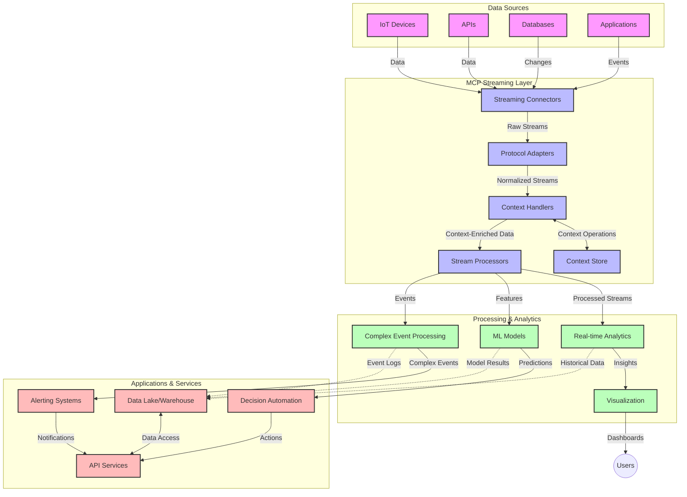

<!--
CO_OP_TRANSLATOR_METADATA:
{
  "original_hash": "68c518dbff8a3b127ed2aa934054c56c",
  "translation_date": "2025-06-11T17:25:40+00:00",
  "source_file": "05-AdvancedTopics/mcp-realtimestreaming/README.md",
  "language_code": "tl"
}
-->
# Model Context Protocol para sa Real-Time Data Streaming

## Pangkalahatang-ideya

Ang real-time data streaming ay naging mahalaga sa mundo ngayon na nakabatay sa datos, kung saan ang mga negosyo at aplikasyon ay nangangailangan ng agarang access sa impormasyon upang makagawa ng napapanahong desisyon. Ang Model Context Protocol (MCP) ay isang malaking hakbang sa pag-optimize ng mga prosesong ito ng real-time streaming, na nagpapahusay sa kahusayan ng pagproseso ng datos, pagpapanatili ng kontekstong integridad, at pagpapabuti ng kabuuang performance ng sistema.

Tinutuklas ng module na ito kung paano binabago ng MCP ang real-time data streaming sa pamamagitan ng pagbibigay ng isang standardized na paraan sa pamamahala ng konteksto sa pagitan ng mga AI model, streaming platform, at aplikasyon.

## Panimula sa Real-Time Data Streaming

Ang real-time data streaming ay isang teknolohikal na paradigma na nagpapahintulot ng tuloy-tuloy na paglilipat, pagproseso, at pagsusuri ng datos habang ito ay nabubuo, na nagbibigay-daan sa mga sistema na agad tumugon sa bagong impormasyon. Hindi tulad ng tradisyunal na batch processing na gumagana sa mga static na dataset, ang streaming ay nagpoproseso ng datos habang ito ay dumadaloy, na naghahatid ng mga insight at aksyon na may minimal na pagkaantala.

### Mga Pangunahing Konsepto ng Real-Time Data Streaming:

- **Tuloy-tuloy na Daloy ng Datos**: Ang datos ay pinoproseso bilang isang tuloy-tuloy at walang katapusang daloy ng mga pangyayari o rekord.
- **Mababang Latency sa Pagproseso**: Dinisenyo ang mga sistema upang mabawasan ang oras mula sa paglikha ng datos hanggang sa pagproseso nito.
- **Scalability**: Kailangang kayanin ng mga streaming architecture ang pabago-bagong dami at bilis ng datos.
- **Fault Tolerance**: Dapat matibay ang mga sistema laban sa mga pagkabigo upang masigurong tuloy-tuloy ang daloy ng datos.
- **Stateful Processing**: Mahalaga ang pagpapanatili ng konteksto sa pagitan ng mga pangyayari para sa makahulugang pagsusuri.

### Ang Model Context Protocol at Real-Time Streaming

Tinatalakay ng Model Context Protocol (MCP) ang ilang mahahalagang hamon sa mga real-time streaming na kapaligiran:

1. **Contextual Continuity**: Inistandardize ng MCP kung paano pinananatili ang konteksto sa mga distributed streaming na bahagi, na tinitiyak na may access ang mga AI model at processing node sa mga kaugnay na kasaysayan at kapaligiran.

2. **Efficient State Management**: Sa pamamagitan ng pagbibigay ng istrukturadong mekanismo para sa pagpapasa ng konteksto, binabawasan ng MCP ang overhead sa pamamahala ng estado sa streaming pipeline.

3. **Interoperability**: Lumilikha ang MCP ng isang karaniwang wika para sa pagbabahagi ng konteksto sa pagitan ng iba't ibang streaming teknolohiya at AI model, na nagpapahintulot ng mas flexible at extensible na mga arkitektura.

4. **Streaming-Optimized Context**: Maaaring unahin ng mga implementasyon ng MCP kung alin sa mga elemento ng konteksto ang pinaka-mahalaga para sa real-time na paggawa ng desisyon, na ina-optimize para sa performance at katumpakan.

5. **Adaptive Processing**: Sa tamang pamamahala ng konteksto gamit ang MCP, maaaring dinamiko ang pag-aayos ng mga streaming system batay sa nagbabagong kondisyon at pattern sa datos.

Sa mga modernong aplikasyon mula sa IoT sensor network hanggang sa mga financial trading platform, ang integrasyon ng MCP sa mga streaming teknolohiya ay nagpapahintulot ng mas matalino, konteksto-may malay na pagproseso na kayang tumugon nang angkop sa mga kumplikado at nagbabagong sitwasyon sa real time.

## Mga Layunin sa Pagkatuto

Sa pagtatapos ng araling ito, magagawa mong:

- Maunawaan ang mga pundasyon ng real-time data streaming at ang mga hamon nito
- Ipaliwanag kung paano pinapahusay ng Model Context Protocol (MCP) ang real-time data streaming
- Magpatupad ng MCP-based streaming solutions gamit ang mga kilalang framework tulad ng Kafka at Pulsar
- Magdisenyo at mag-deploy ng fault-tolerant at high-performance na streaming architecture gamit ang MCP
- Ilapat ang mga konsepto ng MCP sa IoT, financial trading, at AI-driven analytics na mga kaso ng paggamit
- Suriin ang mga umuusbong na trend at mga hinaharap na inobasyon sa MCP-based streaming technologies

### Kahulugan at Kahalagahan

Ang real-time data streaming ay kinabibilangan ng tuloy-tuloy na paglikha, pagproseso, at paghahatid ng datos na may minimal na latency. Hindi tulad ng batch processing kung saan kinokolekta at pinoproseso ang datos nang sabay-sabay, ang streaming data ay pinoproseso nang paunti-unti habang dumarating, na nagbibigay-daan sa agarang insight at aksyon.

Mga pangunahing katangian ng real-time data streaming:

- **Mababang Latency**: Pagproseso at pagsusuri ng datos sa loob ng millisecond hanggang segundo
- **Tuloy-tuloy na Daloy**: Hindi humihinto na daloy ng datos mula sa iba't ibang pinagmulan
- **Agarang Pagproseso**: Pagsusuri ng datos habang dumarating, hindi na kailangang hintayin ang batch
- **Event-Driven Architecture**: Pagtugon sa mga pangyayari habang nangyayari ito

### Mga Hamon sa Tradisyunal na Data Streaming

Ang tradisyunal na mga pamamaraan ng data streaming ay may ilang limitasyon:

1. **Pagkawala ng Konteksto**: Hirap sa pagpapanatili ng konteksto sa mga distributed na sistema
2. **Mga Isyu sa Scalability**: Hamon sa pag-scale para kayanin ang mataas na dami at bilis ng datos
3. **Kompleksidad sa Integrasyon**: Problema sa interoperability sa pagitan ng iba't ibang sistema
4. **Pamamahala ng Latency**: Pagtutugma ng throughput sa oras ng pagproseso
5. **Konsistensi ng Datos**: Pagtitiyak ng katumpakan at kumpletong datos sa buong stream

## Pag-unawa sa Model Context Protocol (MCP)

### Ano ang MCP?

Ang Model Context Protocol (MCP) ay isang standardized na komunikasyon na protocol na dinisenyo upang mapadali ang epektibong interaksyon sa pagitan ng mga AI model at aplikasyon. Sa konteksto ng real-time data streaming, nagbibigay ang MCP ng balangkas para sa:

- Pagpapanatili ng konteksto sa buong data pipeline
- Pag-istandardisa ng mga format ng palitan ng datos
- Pag-optimize ng paghahatid ng malalaking dataset
- Pagpapahusay ng komunikasyon mula model-to-model at model-to-application

### Mga Pangunahing Komponent at Arkitektura

Ang arkitektura ng MCP para sa real-time streaming ay binubuo ng ilang pangunahing bahagi:

1. **Context Handlers**: Namamahala at nagpapanatili ng impormasyon ng konteksto sa buong streaming pipeline
2. **Stream Processors**: Nagpoproseso ng papasok na data stream gamit ang context-aware na mga pamamaraan
3. **Protocol Adapters**: Nagko-convert sa pagitan ng iba't ibang streaming protocol habang pinananatili ang konteksto
4. **Context Store**: Epektibong nag-iimbak at kumukuha ng impormasyon ng konteksto
5. **Streaming Connectors**: Kumokonekta sa iba't ibang streaming platform (Kafka, Pulsar, Kinesis, atbp.)



### Paano Pinapabuti ng MCP ang Real-Time Data Handling

Tinutugunan ng MCP ang mga tradisyunal na hamon sa streaming sa pamamagitan ng:

- **Contextual Integrity**: Pinananatili ang ugnayan sa pagitan ng mga data point sa buong pipeline
- **Optimized Transmission**: Binabawasan ang pag-uulit sa palitan ng datos sa pamamagitan ng matalinong pamamahala ng konteksto
- **Standardized Interfaces**: Nagbibigay ng pare-parehong API para sa mga streaming component
- **Reduced Latency**: Minimina ang overhead sa pagproseso sa pamamagitan ng epektibong pamamahala ng konteksto
- **Enhanced Scalability**: Sinusuportahan ang horizontal scaling habang pinananatili ang konteksto

## Integrasyon at Implementasyon

Ang mga real-time data streaming system ay nangangailangan ng maingat na disenyo ng arkitektura at implementasyon upang mapanatili ang parehong performance at kontekstong integridad. Nagbibigay ang Model Context Protocol ng standardized na paraan para sa integrasyon ng mga AI model at streaming teknolohiya, na nagpapahintulot ng mas sopistikadong, konteksto-may malay na mga pipeline ng pagproseso.

### Pangkalahatang-ideya ng Integrasyon ng MCP sa Streaming Architecture

Ang pagpapatupad ng MCP sa mga real-time streaming na kapaligiran ay may ilang mahahalagang konsiderasyon:

1. **Context Serialization at Transport**: Nagbibigay ang MCP ng epektibong mekanismo para sa pag-encode ng impormasyon ng konteksto sa loob ng streaming data packets, na tinitiyak na ang mahalagang konteksto ay sumusunod sa datos sa buong processing pipeline. Kasama rito ang standardized na serialization format na optimized para sa streaming transport.

2. **Stateful Stream Processing**: Pinapahintulutan ng MCP ang mas matalinong stateful processing sa pamamagitan ng pagpapanatili ng pare-parehong representasyon ng konteksto sa mga processing node. Mahalaga ito sa mga distributed streaming architecture kung saan tradisyunal na mahirap ang pamamahala ng estado.

3. **Event-Time vs. Processing-Time**: Kailangang tugunan ng mga implementasyon ng MCP sa streaming system ang karaniwang hamon ng pag-kakaiba kung kailan nangyari ang mga pangyayari at kailan ito pinoproseso. Maaaring isama ng protocol ang temporal context na nagpapanatili ng semantics ng event time.

4. **Backpressure Management**: Sa pamamagitan ng pag-istandardisa ng paghawak ng konteksto, tinutulungan ng MCP na pamahalaan ang backpressure sa streaming system, na nagpapahintulot sa mga bahagi na ipahayag ang kanilang kakayahan sa pagproseso at ayusin ang daloy nang naaayon.

5. **Context Windowing at Aggregation**: Pinapadali ng MCP ang mas sopistikadong windowing operations sa pamamagitan ng pagbibigay ng istrukturadong representasyon ng temporal at relational na konteksto, na nagpapahintulot ng mas makahulugang aggregasyon sa mga event stream.

6. **Exactly-Once Processing**: Sa mga streaming system na nangangailangan ng exactly-once semantics, maaaring isama ng MCP ang processing metadata upang makatulong sa pagsubaybay at pag-verify ng status ng pagproseso sa mga distributed na bahagi.

Ang implementasyon ng MCP sa iba't ibang streaming teknolohiya ay lumilikha ng isang pinag-isang paraan ng pamamahala ng konteksto, na binabawasan ang pangangailangan para sa custom integration code habang pinapalakas ang kakayahan ng sistema na mapanatili ang makahulugang konteksto habang dumadaloy ang datos sa pipeline.

### MCP sa Iba't Ibang Data Streaming Frameworks

Maaaring isama ang MCP sa mga kilalang streaming framework kabilang ang:

#### Apache Kafka Integration

```python
from mcp_streaming import MCPKafkaConnector

# Initialize MCP Kafka connector
connector = MCPKafkaConnector(
    bootstrap_servers='localhost:9092',
    context_preservation=True
)

# Create a context-aware consumer
consumer = connector.create_consumer('input-topic')

# Process streaming data with context
for message in consumer:
    context = message.get_context()
    data = message.get_value()
    
    # Process with context awareness
    result = process_with_context(data, context)
    
    # Produce output with preserved context
    connector.produce('output-topic', result, context=context)
```

#### Apache Pulsar Implementation

```python
from mcp_streaming import MCPPulsarClient

# Initialize MCP Pulsar client
client = MCPPulsarClient('pulsar://localhost:6650')

# Subscribe with context awareness
consumer = client.subscribe('input-topic', 'subscription-name', 
                           context_enabled=True)

# Process messages with context preservation
while True:
    message = consumer.receive()
    context = message.get_context()
    
    # Process with context
    result = process_with_context(message.data(), context)
    
    # Acknowledge the message
    consumer.acknowledge(message)
    
    # Send result with preserved context
    producer = client.create_producer('output-topic')
    producer.send(result, context=context)
```

### Mga Pinakamahusay na Praktis para sa Deployment

Kapag nag-implement ng MCP para sa real-time streaming:

1. **Magdisenyo para sa Fault Tolerance**:
   - Magpatupad ng tamang paghawak ng error
   - Gumamit ng dead-letter queues para sa mga nabigong mensahe
   - Magdisenyo ng idempotent na mga processor

2. **I-optimize para sa Performance**:
   - I-configure ang angkop na laki ng buffer
   - Gumamit ng batching kung angkop
   - Magpatupad ng mga mekanismo ng backpressure

3. **Mag-monitor at Mag-obserba**:
   - Subaybayan ang mga metric ng stream processing
   - Bantayan ang propagation ng konteksto
   - Mag-set up ng mga alerto para sa mga anomalya

4. **Siguraduhin ang Seguridad ng Iyong Mga Stream**:
   - Magpatupad ng encryption para sa sensitibong datos
   - Gumamit ng authentication at authorization
   - Mag-apply ng angkop na access control

### MCP sa IoT at Edge Computing

Pinapahusay ng MCP ang IoT streaming sa pamamagitan ng:

- Pagpapanatili ng konteksto ng device sa buong processing pipeline
- Pagpapahintulot ng epektibong edge-to-cloud data streaming
- Pagsuporta sa real-time analytics sa IoT data stream
- Pagpapadali ng device-to-device communication na may konteksto

Halimbawa: Smart City Sensor Networks  
```
Sensors → Edge Gateways → MCP Stream Processors → Real-time Analytics → Automated Responses
```

### Papel sa Financial Transactions at High-Frequency Trading

Nagbibigay ang MCP ng mahahalagang benepisyo para sa financial data streaming:

- Ultra-low latency na pagproseso para sa mga trading decision
- Pagpapanatili ng konteksto ng transaksyon sa buong proseso
- Pagsuporta sa complex event processing na may kontekstong malay
- Pagtitiyak ng data consistency sa mga distributed trading system

### Pagpapahusay sa AI-Driven Data Analytics

Lumilikha ang MCP ng mga bagong posibilidad para sa streaming analytics:

- Real-time na training at inference ng modelo
- Tuloy-tuloy na pagkatuto mula sa streaming data
- Context-aware na feature extraction
- Multi-model inference pipeline na may pinanatiling konteksto

## Mga Hinaharap na Trend at Inobasyon

### Ebolusyon ng MCP sa Real-Time na Kapaligiran

Sa hinaharap, inaasahan nating lalago ang MCP upang tugunan ang:

- **Quantum Computing Integration**: Paghahanda para sa quantum-based streaming system
- **Edge-Native Processing**: Paglilipat ng mas maraming context-aware processing sa mga edge device
- **Autonomous Stream Management**: Mga self-optimizing streaming pipeline
- **Federated Streaming**: Distributed na pagproseso habang pinananatili ang privacy

### Mga Potensyal na Pag-unlad sa Teknolohiya

Mga umuusbong na teknolohiya na huhubog sa kinabukasan ng MCP streaming:

1. **AI-Optimized Streaming Protocols**: Mga custom protocol na disenyo para sa AI workloads
2. **Neuromorphic Computing Integration**: Brain-inspired computing para sa stream processing
3. **Serverless Streaming**: Event-driven, scalable streaming na walang pangangasiwa sa infrastructure
4. **Distributed Context Stores**: Global na distributed ngunit mataas ang consistency sa pamamahala ng konteksto

## Hands-On na Mga Ehersisyo

### Ehersisyo 1: Pag-set up ng Basic MCP Streaming Pipeline

Sa ehersisyong ito, matututuhan mo kung paano:

- I-configure ang basic MCP streaming environment
- Mag-implement ng context handlers para sa stream processing
- Subukan at i-validate ang pagpapanatili ng konteksto

### Ehersisyo 2: Pagbuo ng Real-Time Analytics Dashboard

Gumawa ng kompletong aplikasyon na:

- Nagsasalo ng streaming data gamit ang MCP
- Nagpoproseso ng stream habang pinapanatili ang konteksto
- Nagpapakita ng resulta sa real-time

### Ehersisyo 3: Pag-implement ng Complex Event Processing gamit ang MCP

Advanced na ehersisyo na sumasaklaw sa:

- Pag-detect ng pattern sa mga stream
- Contextual correlation sa pagitan ng maraming stream
- Pagbuo ng complex event na may pinanatiling konteksto

## Karagdagang Mga Sanggunian

- [Model Context Protocol Specification](https://github.com/microsoft/model-context-protocol) - Opisyal na MCP specification at dokumentasyon
- [Apache Kafka Documentation](https://kafka.apache.org/documentation/) - Alamin ang tungkol sa Kafka para sa stream processing
- [Apache Pulsar](https://pulsar.apache.org/) - Unified messaging at streaming platform
- [Streaming Systems: The What, Where, When, and How of Large-Scale Data Processing](https://www.oreilly.com/library/view/streaming-systems/9781491983867/) - Komprehensibong libro tungkol sa streaming architecture
- [Microsoft Azure Event Hubs](https://learn.microsoft.com/en-us/azure/event-hubs/event-hubs-about) - Managed event streaming service
- [MLflow Documentation](https://mlflow.org/docs/latest/index.html) - Para sa ML model tracking at deployment
- [Real-Time Analytics with Apache Storm](https://storm.apache.org/releases/current/index.html) - Processing framework para sa real-time computation
- [Flink ML](https://nightlies.apache.org/flink/flink-ml-docs-master/) - Machine learning library para sa Apache Flink
- [LangChain Documentation](https://python.langchain.com/docs/get_started/introduction) - Pagbuo ng aplikasyon gamit ang LLMs

## Mga Kinalabasan ng Pagkatuto

Sa pagtatapos ng module na ito, magagawa mong:

- Maunawaan ang mga pundasyon ng real-time data streaming at ang mga hamon nito
- Ipaliwanag kung paano pinapahusay ng Model Context Protocol (MCP) ang real-time data streaming
- Magpatupad ng MCP-based streaming solutions gamit ang mga kilalang framework tulad ng Kafka at Pulsar
- Magdisenyo at mag-deploy ng fault-tolerant at high-performance na streaming architecture gamit ang MCP
- Ilapat ang mga konsepto ng MCP sa IoT, financial trading, at AI-driven analytics na mga kaso ng paggamit
- Suriin ang mga umuusbong na trend at mga hinaharap na inobasyon sa MCP-based streaming technologies

## Ano ang susunod

- [6. Community Contributions](../../06-CommunityContributions/README.md)

**Pagsasabi ng Paunawa**:  
Ang dokumentong ito ay isinalin gamit ang AI translation service na [Co-op Translator](https://github.com/Azure/co-op-translator). Bagamat nagsusumikap kami na maging tumpak, pakatandaan na ang mga awtomatikong pagsasalin ay maaaring maglaman ng mga pagkakamali o hindi pagkakatugma. Ang orihinal na dokumento sa orihinal nitong wika ang dapat ituring na pangunahing sanggunian. Para sa mga mahahalagang impormasyon, inirerekomenda ang propesyonal na pagsasalin ng tao. Hindi kami mananagot sa anumang hindi pagkakaunawaan o maling interpretasyon na maaaring magmula sa paggamit ng pagsasaling ito.