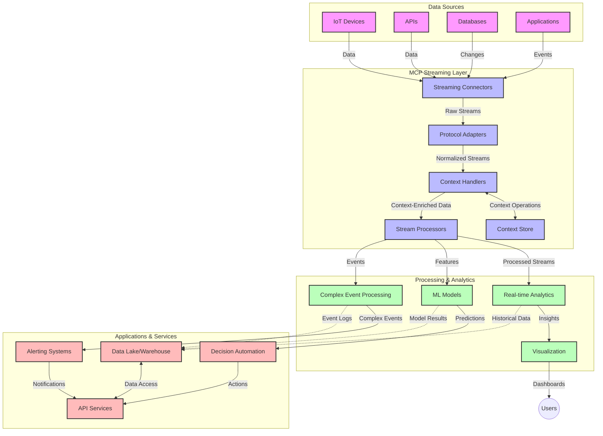

<!--
CO_OP_TRANSLATOR_METADATA:
{
  "original_hash": "195f7287638b77a549acadd96c8f981c",
  "translation_date": "2025-07-14T01:47:13+00:00",
  "source_file": "05-AdvancedTopics/mcp-realtimestreaming/README.md",
  "language_code": "tl"
}
-->
# Model Context Protocol para sa Real-Time Data Streaming

## Pangkalahatang-ideya

Ang real-time data streaming ay naging mahalaga sa mundo ngayon na pinapagana ng datos, kung saan ang mga negosyo at aplikasyon ay nangangailangan ng agarang access sa impormasyon upang makagawa ng napapanahong mga desisyon. Ang Model Context Protocol (MCP) ay isang malaking hakbang sa pagpapahusay ng mga prosesong ito ng real-time streaming, na nagpapabuti sa kahusayan ng pagproseso ng datos, pagpapanatili ng kontekstwal na integridad, at pagpapahusay ng pangkalahatang pagganap ng sistema.

Tinutuklas ng modyul na ito kung paano binabago ng MCP ang real-time data streaming sa pamamagitan ng pagbibigay ng isang standardisadong paraan ng pamamahala ng konteksto sa pagitan ng mga AI model, streaming platform, at mga aplikasyon.

## Panimula sa Real-Time Data Streaming

Ang real-time data streaming ay isang teknolohikal na paradigma na nagpapahintulot sa tuloy-tuloy na paglilipat, pagproseso, at pagsusuri ng datos habang ito ay nililikha, na nagbibigay-daan sa mga sistema na agad tumugon sa bagong impormasyon. Hindi tulad ng tradisyunal na batch processing na gumagana sa mga static na dataset, ang streaming ay nagpoproseso ng datos habang ito ay dumadaloy, na naghahatid ng mga insight at aksyon na may napakababang pagkaantala.

### Pangunahing Konsepto ng Real-Time Data Streaming:

- **Tuloy-tuloy na Daloy ng Datos**: Ang datos ay pinoproseso bilang isang tuloy-tuloy at walang katapusang daloy ng mga pangyayari o tala.
- **Mababang Latency sa Pagproseso**: Dinisenyo ang mga sistema upang mabawasan ang oras mula sa paglikha ng datos hanggang sa pagproseso nito.
- **Scalability**: Kailangang kayanin ng mga streaming architecture ang pabago-bagong dami at bilis ng datos.
- **Fault Tolerance**: Kailangang matatag ang mga sistema laban sa mga pagkabigo upang matiyak ang tuloy-tuloy na daloy ng datos.
- **Stateful Processing**: Mahalaga ang pagpapanatili ng konteksto sa pagitan ng mga pangyayari para sa makabuluhang pagsusuri.

### Ang Model Context Protocol at Real-Time Streaming

Tinatalakay ng Model Context Protocol (MCP) ang ilang mahahalagang hamon sa mga real-time streaming na kapaligiran:

1. **Pagpapatuloy ng Konteksto**: Standardisado ng MCP kung paano pinananatili ang konteksto sa mga distributed na bahagi ng streaming, na tinitiyak na ang mga AI model at processing nodes ay may access sa mahalagang kasaysayan at kontekstong pangkapaligiran.

2. **Epektibong Pamamahala ng Estado**: Sa pamamagitan ng pagbibigay ng istrukturadong mekanismo para sa transmisyon ng konteksto, nababawasan ng MCP ang overhead sa pamamahala ng estado sa mga streaming pipeline.

3. **Interoperability**: Lumilikha ang MCP ng isang karaniwang wika para sa pagbabahagi ng konteksto sa pagitan ng iba't ibang teknolohiya ng streaming at AI model, na nagpapahintulot ng mas flexible at extensible na mga arkitektura.

4. **Streaming-Optimized na Konteksto**: Maaaring unahin ng mga implementasyon ng MCP kung alin sa mga elemento ng konteksto ang pinaka-mahalaga para sa real-time na paggawa ng desisyon, na nag-o-optimize para sa parehong pagganap at katumpakan.

5. **Adaptive Processing**: Sa tamang pamamahala ng konteksto gamit ang MCP, maaaring dynamic na i-adjust ng mga streaming system ang pagproseso batay sa nagbabagong kondisyon at pattern sa datos.

Sa mga modernong aplikasyon mula sa IoT sensor networks hanggang sa mga financial trading platform, ang integrasyon ng MCP sa mga teknolohiya ng streaming ay nagpapahintulot ng mas matalino, kontekstwal na pagpoproseso na kayang tumugon nang angkop sa mga kumplikado at nagbabagong sitwasyon sa real time.

## Mga Layunin sa Pagkatuto

Sa pagtatapos ng araling ito, magagawa mong:

- Maunawaan ang mga pundasyon ng real-time data streaming at ang mga hamon nito
- Ipaliwanag kung paano pinapahusay ng Model Context Protocol (MCP) ang real-time data streaming
- Magpatupad ng mga solusyong streaming na batay sa MCP gamit ang mga kilalang framework tulad ng Kafka at Pulsar
- Magdisenyo at mag-deploy ng fault-tolerant at mataas na pagganap na mga streaming architecture gamit ang MCP
- I-apply ang mga konsepto ng MCP sa IoT, financial trading, at AI-driven analytics na mga kaso ng paggamit
- Suriin ang mga umuusbong na trend at mga hinaharap na inobasyon sa mga teknolohiyang streaming na batay sa MCP

### Kahulugan at Kahalagahan

Ang real-time data streaming ay kinabibilangan ng tuloy-tuloy na paglikha, pagproseso, at paghahatid ng datos na may napakababang latency. Hindi tulad ng batch processing na kinokolekta at pinoproseso ang datos nang pa-grupo, ang streaming data ay pinoproseso nang paunti-unti habang dumarating, na nagbibigay-daan sa agarang mga insight at aksyon.

Mga pangunahing katangian ng real-time data streaming:

- **Mababang Latency**: Pagpoproseso at pagsusuri ng datos sa loob ng millisecond hanggang segundo
- **Tuloy-tuloy na Daloy**: Hindi napuputol na mga stream ng datos mula sa iba't ibang pinagmulan
- **Agarang Pagproseso**: Pagsusuri ng datos habang dumarating, hindi sa mga batch
- **Event-Driven Architecture**: Pagtugon sa mga pangyayari habang nangyayari

### Mga Hamon sa Tradisyunal na Data Streaming

Ang mga tradisyunal na pamamaraan ng data streaming ay may ilang limitasyon:

1. **Pagkawala ng Konteksto**: Hirap sa pagpapanatili ng konteksto sa mga distributed na sistema
2. **Mga Isyu sa Scalability**: Hamon sa pag-scale upang hawakan ang mataas na dami at bilis ng datos
3. **Kumplikadong Integrasyon**: Problema sa interoperability sa pagitan ng iba't ibang sistema
4. **Pamamahala ng Latency**: Pagtutugma ng throughput at oras ng pagproseso
5. **Konsistensi ng Datos**: Pagtitiyak ng katumpakan at kumpletong datos sa buong stream

## Pag-unawa sa Model Context Protocol (MCP)

### Ano ang MCP?

Ang Model Context Protocol (MCP) ay isang standardisadong komunikasyon na protocol na idinisenyo upang mapadali ang epektibong interaksyon sa pagitan ng mga AI model at aplikasyon. Sa konteksto ng real-time data streaming, nagbibigay ang MCP ng balangkas para sa:

- Pagpapanatili ng konteksto sa buong data pipeline
- Standardisasyon ng mga format ng palitan ng datos
- Pag-optimize ng transmisyon ng malalaking dataset
- Pagpapahusay ng komunikasyon mula model-to-model at model-to-application

### Pangunahing Bahagi at Arkitektura

Ang arkitektura ng MCP para sa real-time streaming ay binubuo ng ilang mahahalagang bahagi:

1. **Context Handlers**: Namamahala at nagpapanatili ng kontekstwal na impormasyon sa buong streaming pipeline
2. **Stream Processors**: Nagpoproseso ng papasok na data stream gamit ang mga teknik na may kamalayan sa konteksto
3. **Protocol Adapters**: Nagko-convert sa pagitan ng iba't ibang streaming protocol habang pinananatili ang konteksto
4. **Context Store**: Epektibong nag-iimbak at kumukuha ng kontekstwal na impormasyon
5. **Streaming Connectors**: Kumokonekta sa iba't ibang streaming platform (Kafka, Pulsar, Kinesis, atbp.)



### Paano Pinapabuti ng MCP ang Real-Time Data Handling

Tinatalakay ng MCP ang mga tradisyunal na hamon sa streaming sa pamamagitan ng:

- **Integridad ng Konteksto**: Pinananatili ang ugnayan sa pagitan ng mga datos sa buong pipeline
- **Optimized na Transmisyon**: Binabawasan ang pag-uulit sa palitan ng datos gamit ang matalinong pamamahala ng konteksto
- **Standardisadong Interface**: Nagbibigay ng pare-parehong API para sa mga streaming component
- **Pinababang Latency**: Minimina ang overhead sa pagproseso sa pamamagitan ng epektibong pamamahala ng konteksto
- **Pinahusay na Scalability**: Sinusuportahan ang horizontal scaling habang pinananatili ang konteksto

## Integrasyon at Implementasyon

Ang mga sistema ng real-time data streaming ay nangangailangan ng maingat na disenyo ng arkitektura at implementasyon upang mapanatili ang parehong pagganap at integridad ng konteksto. Nagbibigay ang Model Context Protocol ng standardisadong paraan para sa integrasyon ng mga AI model at teknolohiya ng streaming, na nagpapahintulot ng mas sopistikadong mga pipeline ng pagpoproseso na may kamalayan sa konteksto.

### Pangkalahatang-ideya ng Integrasyon ng MCP sa Streaming Architecture

Ang pagpapatupad ng MCP sa mga real-time streaming na kapaligiran ay may ilang mahahalagang konsiderasyon:

1. **Context Serialization at Transport**: Nagbibigay ang MCP ng epektibong mekanismo para sa pag-encode ng kontekstwal na impormasyon sa loob ng mga streaming data packet, na tinitiyak na ang mahalagang konteksto ay sumusunod sa datos sa buong pipeline ng pagproseso. Kasama rito ang mga standardisadong serialization format na optimized para sa streaming transport.

2. **Stateful Stream Processing**: Pinapahintulutan ng MCP ang mas matalinong stateful processing sa pamamagitan ng pagpapanatili ng pare-parehong representasyon ng konteksto sa mga processing node. Mahalaga ito lalo na sa mga distributed streaming architecture kung saan tradisyunal na mahirap ang pamamahala ng estado.

3. **Event-Time vs. Processing-Time**: Kailangang tugunan ng mga implementasyon ng MCP sa streaming system ang karaniwang hamon ng pagkakaiba sa pagitan ng oras ng pangyayari at oras ng pagproseso. Maaaring isama ng protocol ang temporal na konteksto na nagpapanatili ng semantics ng event time.

4. **Pamamahala ng Backpressure**: Sa pamamagitan ng standardisadong pamamahala ng konteksto, tinutulungan ng MCP ang pag-manage ng backpressure sa mga streaming system, na nagpapahintulot sa mga bahagi na iparating ang kanilang kakayahan sa pagproseso at i-adjust ang daloy nang naaayon.

5. **Context Windowing at Aggregation**: Pinapadali ng MCP ang mas sopistikadong mga operasyon ng windowing sa pamamagitan ng pagbibigay ng istrukturadong representasyon ng temporal at relational na konteksto, na nagpapahintulot ng mas makabuluhang aggregation sa mga event stream.

6. **Exactly-Once Processing**: Sa mga streaming system na nangangailangan ng exactly-once semantics, maaaring isama ng MCP ang processing metadata upang makatulong sa pagsubaybay at pag-verify ng status ng pagproseso sa mga distributed na bahagi.

Ang implementasyon ng MCP sa iba't ibang teknolohiya ng streaming ay lumilikha ng isang pinag-isang paraan ng pamamahala ng konteksto, na nagpapabawas sa pangangailangan para sa custom integration code habang pinapahusay ang kakayahan ng sistema na mapanatili ang makabuluhang konteksto habang dumadaloy ang datos sa pipeline.

### MCP sa Iba't Ibang Data Streaming Framework

Ang mga halimbawang ito ay sumusunod sa kasalukuyang MCP specification na nakatuon sa isang JSON-RPC based protocol na may iba't ibang mekanismo ng transport. Ipinapakita ng code kung paano ka makakagawa ng custom transport na nag-iintegrate ng mga streaming platform tulad ng Kafka at Pulsar habang pinananatili ang buong compatibility sa MCP protocol.

Dinisenyo ang mga halimbawa upang ipakita kung paano maaaring i-integrate ang mga streaming platform sa MCP upang magbigay ng real-time na pagproseso ng datos habang pinapanatili ang kontekstwal na kamalayan na sentro sa MCP. Tinitiyak ng pamamaraang ito na ang mga sample code ay tumpak na sumasalamin sa kasalukuyang estado ng MCP specification hanggang Hunyo 2025.

Maaaring i-integrate ang MCP sa mga kilalang streaming framework kabilang ang:

#### Apache Kafka Integration

```python
import asyncio
import json
from typing import Dict, Any, Optional
from confluent_kafka import Consumer, Producer, KafkaError
from mcp.client import Client, ClientCapabilities
from mcp.core.message import JsonRpcMessage
from mcp.core.transports import Transport

# Custom transport class to bridge MCP with Kafka
class KafkaMCPTransport(Transport):
    def __init__(self, bootstrap_servers: str, input_topic: str, output_topic: str):
        self.bootstrap_servers = bootstrap_servers
        self.input_topic = input_topic
        self.output_topic = output_topic
        self.producer = Producer({'bootstrap.servers': bootstrap_servers})
        self.consumer = Consumer({
            'bootstrap.servers': bootstrap_servers,
            'group.id': 'mcp-client-group',
            'auto.offset.reset': 'earliest'
        })
        self.message_queue = asyncio.Queue()
        self.running = False
        self.consumer_task = None
        
    async def connect(self):
        """Connect to Kafka and start consuming messages"""
        self.consumer.subscribe([self.input_topic])
        self.running = True
        self.consumer_task = asyncio.create_task(self._consume_messages())
        return self
        
    async def _consume_messages(self):
        """Background task to consume messages from Kafka and queue them for processing"""
        while self.running:
            try:
                msg = self.consumer.poll(1.0)
                if msg is None:
                    await asyncio.sleep(0.1)
                    continue
                
                if msg.error():
                    if msg.error().code() == KafkaError._PARTITION_EOF:
                        continue
                    print(f"Consumer error: {msg.error()}")
                    continue
                
                # Parse the message value as JSON-RPC
                try:
                    message_str = msg.value().decode('utf-8')
                    message_data = json.loads(message_str)
                    mcp_message = JsonRpcMessage.from_dict(message_data)
                    await self.message_queue.put(mcp_message)
                except Exception as e:
                    print(f"Error parsing message: {e}")
            except Exception as e:
                print(f"Error in consumer loop: {e}")
                await asyncio.sleep(1)
    
    async def read(self) -> Optional[JsonRpcMessage]:
        """Read the next message from the queue"""
        try:
            message = await self.message_queue.get()
            return message
        except Exception as e:
            print(f"Error reading message: {e}")
            return None
    
    async def write(self, message: JsonRpcMessage) -> None:
        """Write a message to the Kafka output topic"""
        try:
            message_json = json.dumps(message.to_dict())
            self.producer.produce(
                self.output_topic,
                message_json.encode('utf-8'),
                callback=self._delivery_report
            )
            self.producer.poll(0)  # Trigger callbacks
        except Exception as e:
            print(f"Error writing message: {e}")
    
    def _delivery_report(self, err, msg):
        """Kafka producer delivery callback"""
        if err is not None:
            print(f'Message delivery failed: {err}')
        else:
            print(f'Message delivered to {msg.topic()} [{msg.partition()}]')
    
    async def close(self) -> None:
        """Close the transport"""
        self.running = False
        if self.consumer_task:
            self.consumer_task.cancel()
            try:
                await self.consumer_task
            except asyncio.CancelledError:
                pass
        self.consumer.close()
        self.producer.flush()

# Example usage of the Kafka MCP transport
async def kafka_mcp_example():
    # Create MCP client with Kafka transport
    client = Client(
        {"name": "kafka-mcp-client", "version": "1.0.0"},
        ClientCapabilities({})
    )
    
    # Create and connect the Kafka transport
    transport = KafkaMCPTransport(
        bootstrap_servers="localhost:9092",
        input_topic="mcp-responses",
        output_topic="mcp-requests"
    )
    
    await client.connect(transport)
    
    try:
        # Initialize the MCP session
        await client.initialize()
        
        # Example of executing a tool via MCP
        response = await client.execute_tool(
            "process_data",
            {
                "data": "sample data",
                "metadata": {
                    "source": "sensor-1",
                    "timestamp": "2025-06-12T10:30:00Z"
                }
            }
        )
        
        print(f"Tool execution response: {response}")
        
        # Clean shutdown
        await client.shutdown()
    finally:
        await transport.close()

# Run the example
if __name__ == "__main__":
    asyncio.run(kafka_mcp_example())
```

#### Apache Pulsar Implementation

```python
import asyncio
import json
import pulsar
from typing import Dict, Any, Optional
from mcp.core.message import JsonRpcMessage
from mcp.core.transports import Transport
from mcp.server import Server, ServerOptions
from mcp.server.tools import Tool, ToolExecutionContext, ToolMetadata

# Create a custom MCP transport that uses Pulsar
class PulsarMCPTransport(Transport):
    def __init__(self, service_url: str, request_topic: str, response_topic: str):
        self.service_url = service_url
        self.request_topic = request_topic
        self.response_topic = response_topic
        self.client = pulsar.Client(service_url)
        self.producer = self.client.create_producer(response_topic)
        self.consumer = self.client.subscribe(
            request_topic,
            "mcp-server-subscription",
            consumer_type=pulsar.ConsumerType.Shared
        )
        self.message_queue = asyncio.Queue()
        self.running = False
        self.consumer_task = None
    
    async def connect(self):
        """Connect to Pulsar and start consuming messages"""
        self.running = True
        self.consumer_task = asyncio.create_task(self._consume_messages())
        return self
    
    async def _consume_messages(self):
        """Background task to consume messages from Pulsar and queue them for processing"""
        while self.running:
            try:
                # Non-blocking receive with timeout
                msg = self.consumer.receive(timeout_millis=500)
                
                # Process the message
                try:
                    message_str = msg.data().decode('utf-8')
                    message_data = json.loads(message_str)
                    mcp_message = JsonRpcMessage.from_dict(message_data)
                    await self.message_queue.put(mcp_message)
                    
                    # Acknowledge the message
                    self.consumer.acknowledge(msg)
                except Exception as e:
                    print(f"Error processing message: {e}")
                    # Negative acknowledge if there was an error
                    self.consumer.negative_acknowledge(msg)
            except Exception as e:
                # Handle timeout or other exceptions
                await asyncio.sleep(0.1)
    
    async def read(self) -> Optional[JsonRpcMessage]:
        """Read the next message from the queue"""
        try:
            message = await self.message_queue.get()
            return message
        except Exception as e:
            print(f"Error reading message: {e}")
            return None
    
    async def write(self, message: JsonRpcMessage) -> None:
        """Write a message to the Pulsar output topic"""
        try:
            message_json = json.dumps(message.to_dict())
            self.producer.send(message_json.encode('utf-8'))
        except Exception as e:
            print(f"Error writing message: {e}")
    
    async def close(self) -> None:
        """Close the transport"""
        self.running = False
        if self.consumer_task:
            self.consumer_task.cancel()
            try:
                await self.consumer_task
            except asyncio.CancelledError:
                pass
        self.consumer.close()
        self.producer.close()
        self.client.close()

# Define a sample MCP tool that processes streaming data
@Tool(
    name="process_streaming_data",
    description="Process streaming data with context preservation",
    metadata=ToolMetadata(
        required_capabilities=["streaming"]
    )
)
async def process_streaming_data(
    ctx: ToolExecutionContext,
    data: str,
    source: str,
    priority: str = "medium"
) -> Dict[str, Any]:
    """
    Process streaming data while preserving context
    
    Args:
        ctx: Tool execution context
        data: The data to process
        source: The source of the data
        priority: Priority level (low, medium, high)
        
    Returns:
        Dict containing processed results and context information
    """
    # Example processing that leverages MCP context
    print(f"Processing data from {source} with priority {priority}")
    
    # Access conversation context from MCP
    conversation_id = ctx.conversation_id if hasattr(ctx, 'conversation_id') else "unknown"
    
    # Return results with enhanced context
    return {
        "processed_data": f"Processed: {data}",
        "context": {
            "conversation_id": conversation_id,
            "source": source,
            "priority": priority,
            "processing_timestamp": ctx.get_current_time_iso()
        }
    }

# Example MCP server implementation using Pulsar transport
async def run_mcp_server_with_pulsar():
    # Create MCP server
    server = Server(
        {"name": "pulsar-mcp-server", "version": "1.0.0"},
        ServerOptions(
            capabilities={"streaming": True}
        )
    )
    
    # Register our tool
    server.register_tool(process_streaming_data)
    
    # Create and connect Pulsar transport
    transport = PulsarMCPTransport(
        service_url="pulsar://localhost:6650",
        request_topic="mcp-requests",
        response_topic="mcp-responses"
    )
    
    try:
        # Start the server with the Pulsar transport
        await server.run(transport)
    finally:
        await transport.close()

# Run the server
if __name__ == "__main__":
    asyncio.run(run_mcp_server_with_pulsar())
```

### Mga Pinakamahusay na Praktis para sa Deployment

Kapag nagpapatupad ng MCP para sa real-time streaming:

1. **Disenyo para sa Fault Tolerance**:
   - Magpatupad ng tamang paghawak ng error
   - Gumamit ng dead-letter queues para sa mga nabigong mensahe
   - Disenyuhin ang mga processor na idempotent

2. **I-optimize para sa Pagganap**:
   - I-configure ang angkop na laki ng buffer
   - Gumamit ng batching kung naaangkop
   - Magpatupad ng mga mekanismo ng backpressure

3. **Mag-monitor at Mag-obserba**:
   - Subaybayan ang mga metric ng stream processing
   - I-monitor ang propagation ng konteksto
   - Mag-set up ng mga alerto para sa mga anomalya

4. **Siguraduhin ang Seguridad ng Iyong Mga Stream**:
   - Magpatupad ng encryption para sa sensitibong datos
   - Gumamit ng authentication at authorization
   - Mag-apply ng tamang access control

### MCP sa IoT at Edge Computing

Pinapahusay ng MCP ang IoT streaming sa pamamagitan ng:

- Pagpapanatili ng konteksto ng device sa buong pipeline ng pagproseso
- Pagpapahintulot ng epektibong edge-to-cloud data streaming
- Pagsuporta sa real-time analytics sa mga IoT data stream
- Pagpapadali ng device-to-device communication na may konteksto

Halimbawa: Smart City Sensor Networks  
```
Sensors → Edge Gateways → MCP Stream Processors → Real-time Analytics → Automated Responses
```

### Papel sa Mga Transaksyong Pinansyal at High-Frequency Trading

Nagbibigay ang MCP ng mahahalagang benepisyo para sa financial data streaming:

- Ultra-mababang latency sa pagproseso para sa mga desisyon sa trading
- Pagpapanatili ng konteksto ng transaksyon sa buong proseso
- Pagsuporta sa complex event processing na may kontekstwal na kamalayan
- Pagtitiyak ng konsistensi ng datos sa mga distributed trading system

### Pagpapahusay ng AI-Driven Data Analytics

Lumilikha ang MCP ng mga bagong posibilidad para sa streaming analytics:

- Real-time na pagsasanay at inference ng modelo
- Tuloy-tuloy na pagkatuto mula sa streaming data
- Context-aware na feature extraction
- Multi-model inference pipeline na may pinanatiling konteksto

## Mga Hinaharap na Trend at Inobasyon

### Ebolusyon ng MCP sa Real-Time na Kapaligiran

Sa hinaharap, inaasahan nating umunlad ang MCP upang tugunan ang:

- **Integrasyon ng Quantum Computing**: Paghahanda para sa quantum-based streaming system
- **Edge-Native Processing**: Paglilipat ng mas maraming kontekstwal na pagpoproseso sa mga edge device
- **Autonomous Stream Management**: Mga streaming pipeline na self-optimizing
- **Federated Streaming**: Distributed na pagproseso habang pinananatili ang privacy

### Mga Posibleng Pag-unlad sa Teknolohiya

Mga umuusbong na teknolohiya na huhubog sa hinaharap ng MCP streaming:

1. **AI-Optimized Streaming Protocols**: Mga custom na protocol na idinisenyo para sa AI workloads
2. **Neuromorphic Computing Integration**: Brain-inspired computing para sa stream processing
3. **Serverless Streaming**: Event-driven, scalable streaming na walang pangangasiwa ng imprastruktura
4. **Distributed Context Stores**: Global na distributed ngunit mataas ang konsistensi sa pamamahala ng konteksto

## Mga Hands-On na Pagsasanay

### Pagsasanay 1: Pagsasaayos ng Basic MCP Streaming Pipeline

Sa pagsasanay na ito, matututuhan mo kung paano:

- I-configure ang isang basic MCP streaming environment
- Magpatupad ng context handlers para sa stream processing
- Subukan at i-validate ang pagpapanatili ng konteksto

### Pagsasanay 2: Paggawa ng Real-Time Analytics Dashboard

Gumawa ng isang kumpletong aplikasyon na:

- Kumukuha ng streaming data gamit ang MCP
- Nagpoproseso ng stream habang pinananatili ang konteksto
- Nagpapakita ng mga resulta nang real-time

### Pagsasanay 3: Pagpapatupad ng Complex Event Processing gamit ang MCP

Advanced na pagsasanay na sumasaklaw sa:

- Pagtuklas ng pattern sa mga stream
- Kontekstwal na korelasyon sa pagitan ng maraming stream
- Pagbuo ng complex events na may pinanatiling konteksto

## Karagdagang Mga Mapagkukunan

- [Model Context Protocol Specification](https://github.com/modelcontextprotocol) - Opisyal na MCP specification at dokumentasyon
- [Apache Kafka Documentation](https://kafka.apache.org/documentation/) - Alamin ang tungkol sa Kafka para sa stream processing
- [Apache Pulsar](https://pulsar.apache.org/) - Unified messaging at streaming platform
- [Streaming Systems: The What, Where, When, and How of Large-Scale Data Processing](https://www.oreilly.com/library/view/streaming-systems/9781491983867/) - Komprehensibong libro tungkol sa streaming architecture
- [Microsoft Azure Event Hubs](https://learn.microsoft.com/azure/event-hubs/event-hubs-about) - Managed event streaming service
- [MLflow Documentation](https://mlflow.org/docs/latest/index.html) - Para sa ML model tracking at deployment
- [Real-Time Analytics with Apache Storm](https://storm.apache.org/releases/current/index.html) - Processing framework para sa real-time computation
- [Flink ML](https://nightlies.apache.org/flink/flink-ml-docs-master/) - Machine learning library para sa Apache Flink
- [LangChain Documentation](https://python.langchain.com/docs/get_started/introduction) - Paggawa ng mga aplikasyon gamit ang LLMs

## Mga Kinalabasan ng Pagkatuto

Sa pagtatapos ng m

**Paalala**:  
Ang dokumentong ito ay isinalin gamit ang AI translation service na [Co-op Translator](https://github.com/Azure/co-op-translator). Bagamat nagsusumikap kami para sa katumpakan, pakatandaan na ang mga awtomatikong pagsasalin ay maaaring maglaman ng mga pagkakamali o di-tumpak na impormasyon. Ang orihinal na dokumento sa orihinal nitong wika ang dapat ituring na pangunahing sanggunian. Para sa mahahalagang impormasyon, inirerekomenda ang propesyonal na pagsasalin ng tao. Hindi kami mananagot sa anumang hindi pagkakaunawaan o maling interpretasyon na maaaring magmula sa paggamit ng pagsasaling ito.