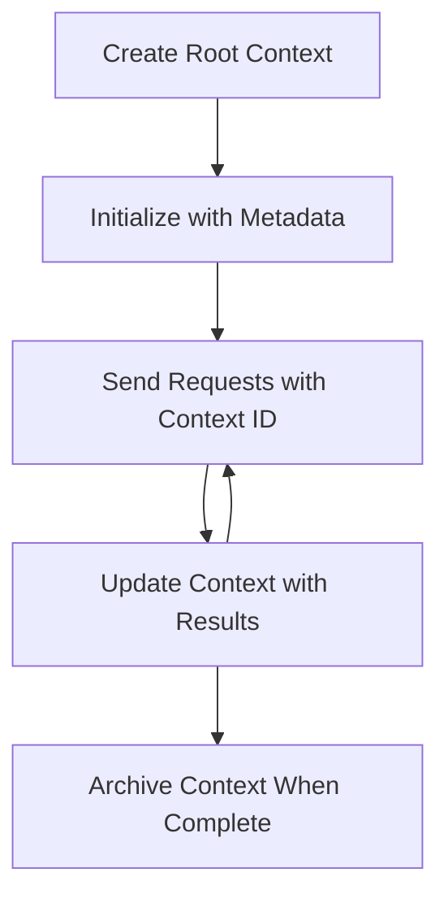

<!--
CO_OP_TRANSLATOR_METADATA:
{
  "original_hash": "ebdb86db46113f1cbd59ce4c74caaa79",
  "translation_date": "2025-07-17T08:18:40+00:00",
  "source_file": "05-AdvancedTopics/mcp-root-contexts/README.md",
  "language_code": "tl"
}
-->
# MCP Root Contexts

Ang root contexts ay isang pangunahing konsepto sa Model Context Protocol na nagbibigay ng tuloy-tuloy na layer para mapanatili ang kasaysayan ng pag-uusap at shared state sa maraming kahilingan at sesyon.

## Panimula

Sa araling ito, tatalakayin natin kung paano gumawa, mag-manage, at gumamit ng root contexts sa MCP.

## Mga Layunin sa Pagkatuto

Sa pagtatapos ng araling ito, magagawa mong:

- Maunawaan ang layunin at estruktura ng root contexts
- Gumawa at mag-manage ng root contexts gamit ang MCP client libraries
- Ipatupad ang root contexts sa .NET, Java, JavaScript, at Python na mga aplikasyon
- Gamitin ang root contexts para sa multi-turn na pag-uusap at pamamahala ng estado
- Ipatupad ang mga pinakamahusay na kasanayan sa pamamahala ng root context

## Pag-unawa sa Root Contexts

Ang root contexts ay nagsisilbing lalagyan na nagtatago ng kasaysayan at estado para sa serye ng magkakaugnay na interaksyon. Pinapahintulutan nila ang:

- **Pagpapatuloy ng Pag-uusap**: Pagpapanatili ng magkakaugnay na multi-turn na pag-uusap
- **Pamamahala ng Memorya**: Pag-iimbak at pagkuha ng impormasyon sa mga interaksyon
- **Pamamahala ng Estado**: Pagsubaybay sa progreso sa mga komplikadong workflow
- **Pagbabahagi ng Konteksto**: Pagbibigay-daan sa maraming kliyente na ma-access ang parehong estado ng pag-uusap

Sa MCP, ang mga root contexts ay may mga sumusunod na pangunahing katangian:

- Bawat root context ay may natatanging identifier.
- Maaari itong maglaman ng kasaysayan ng pag-uusap, mga kagustuhan ng user, at iba pang metadata.
- Maaari itong likhain, ma-access, at ma-archive ayon sa pangangailangan.
- Sinusuportahan nito ang masusing kontrol sa access at mga permiso.

## Lifecycle ng Root Context



## Paggamit ng Root Contexts

Narito ang isang halimbawa kung paano gumawa at mag-manage ng root contexts.

### Implementasyon sa C#

```csharp
// .NET Example: Root Context Management
using Microsoft.Mcp.Client;
using System;
using System.Threading.Tasks;
using System.Collections.Generic;

public class RootContextExample
{
    private readonly IMcpClient _client;
    private readonly IRootContextManager _contextManager;
    
    public RootContextExample(IMcpClient client, IRootContextManager contextManager)
    {
        _client = client;
        _contextManager = contextManager;
    }
    
    public async Task DemonstrateRootContextAsync()
    {
        // 1. Create a new root context
        var contextResult = await _contextManager.CreateRootContextAsync(new RootContextCreateOptions
        {
            Name = "Customer Support Session",
            Metadata = new Dictionary<string, string>
            {
                ["CustomerName"] = "Acme Corporation",
                ["PriorityLevel"] = "High",
                ["Domain"] = "Cloud Services"
            }
        });
        
        string contextId = contextResult.ContextId;
        Console.WriteLine($"Created root context with ID: {contextId}");
        
        // 2. First interaction using the context
        var response1 = await _client.SendPromptAsync(
            "I'm having issues scaling my web service deployment in the cloud.", 
            new SendPromptOptions { RootContextId = contextId }
        );
        
        Console.WriteLine($"First response: {response1.GeneratedText}");
        
        // Second interaction - the model will have access to the previous conversation
        var response2 = await _client.SendPromptAsync(
            "Yes, we're using containerized deployments with Kubernetes.", 
            new SendPromptOptions { RootContextId = contextId }
        );
        
        Console.WriteLine($"Second response: {response2.GeneratedText}");
        
        // 3. Add metadata to the context based on conversation
        await _contextManager.UpdateContextMetadataAsync(contextId, new Dictionary<string, string>
        {
            ["TechnicalEnvironment"] = "Kubernetes",
            ["IssueType"] = "Scaling"
        });
        
        // 4. Get context information
        var contextInfo = await _contextManager.GetRootContextInfoAsync(contextId);
        
        Console.WriteLine("Context Information:");
        Console.WriteLine($"- Name: {contextInfo.Name}");
        Console.WriteLine($"- Created: {contextInfo.CreatedAt}");
        Console.WriteLine($"- Messages: {contextInfo.MessageCount}");
        
        // 5. When the conversation is complete, archive the context
        await _contextManager.ArchiveRootContextAsync(contextId);
        Console.WriteLine($"Archived context {contextId}");
    }
}
```

Sa naunang code ay:

1. Nilikha ang isang root context para sa isang customer support session.
1. Nagpadala ng maraming mensahe sa loob ng kontekstong iyon, na nagpapahintulot sa modelo na mapanatili ang estado.
1. In-update ang context gamit ang mga kaugnay na metadata base sa pag-uusap.
1. Kinuha ang impormasyon ng context upang maunawaan ang kasaysayan ng pag-uusap.
1. In-archive ang context nang matapos ang pag-uusap.

## Halimbawa: Implementasyon ng Root Context para sa financial analysis

Sa halimbawang ito, gagawa tayo ng root context para sa isang financial analysis session, na nagpapakita kung paano mapanatili ang estado sa maraming interaksyon.

### Implementasyon sa Java

```java
// Java Example: Root Context Implementation
package com.example.mcp.contexts;

import com.mcp.client.McpClient;
import com.mcp.client.ContextManager;
import com.mcp.models.RootContext;
import com.mcp.models.McpResponse;

import java.util.HashMap;
import java.util.Map;
import java.util.UUID;

public class RootContextsDemo {
    private final McpClient client;
    private final ContextManager contextManager;
    
    public RootContextsDemo(String serverUrl) {
        this.client = new McpClient.Builder()
            .setServerUrl(serverUrl)
            .build();
            
        this.contextManager = new ContextManager(client);
    }
    
    public void demonstrateRootContext() throws Exception {
        // Create context metadata
        Map<String, String> metadata = new HashMap<>();
        metadata.put("projectName", "Financial Analysis");
        metadata.put("userRole", "Financial Analyst");
        metadata.put("dataSource", "Q1 2025 Financial Reports");
        
        // 1. Create a new root context
        RootContext context = contextManager.createRootContext("Financial Analysis Session", metadata);
        String contextId = context.getId();
        
        System.out.println("Created context: " + contextId);
        
        // 2. First interaction
        McpResponse response1 = client.sendPrompt(
            "Analyze the trends in Q1 financial data for our technology division",
            contextId
        );
        
        System.out.println("First response: " + response1.getGeneratedText());
        
        // 3. Update context with important information gained from response
        contextManager.addContextMetadata(contextId, 
            Map.of("identifiedTrend", "Increasing cloud infrastructure costs"));
        
        // Second interaction - using the same context
        McpResponse response2 = client.sendPrompt(
            "What's driving the increase in cloud infrastructure costs?",
            contextId
        );
        
        System.out.println("Second response: " + response2.getGeneratedText());
        
        // 4. Generate a summary of the analysis session
        McpResponse summaryResponse = client.sendPrompt(
            "Summarize our analysis of the technology division financials in 3-5 key points",
            contextId
        );
        
        // Store the summary in context metadata
        contextManager.addContextMetadata(contextId, 
            Map.of("analysisSummary", summaryResponse.getGeneratedText()));
            
        // Get updated context information
        RootContext updatedContext = contextManager.getRootContext(contextId);
        
        System.out.println("Context Information:");
        System.out.println("- Created: " + updatedContext.getCreatedAt());
        System.out.println("- Last Updated: " + updatedContext.getLastUpdatedAt());
        System.out.println("- Analysis Summary: " + 
            updatedContext.getMetadata().get("analysisSummary"));
            
        // 5. Archive context when done
        contextManager.archiveContext(contextId);
        System.out.println("Context archived");
    }
}
```

Sa naunang code ay:

1. Nilikha ang isang root context para sa financial analysis session.
2. Nagpadala ng maraming mensahe sa loob ng kontekstong iyon, na nagpapahintulot sa modelo na mapanatili ang estado.
3. In-update ang context gamit ang mga kaugnay na metadata base sa pag-uusap.
4. Nilikha ang isang buod ng analysis session at iniimbak ito sa context metadata.
5. In-archive ang context nang matapos ang pag-uusap.

## Halimbawa: Pamamahala ng Root Context

Mahalaga ang epektibong pamamahala ng root contexts para mapanatili ang kasaysayan ng pag-uusap at estado. Narito ang isang halimbawa kung paano ipatupad ang pamamahala ng root context.

### Implementasyon sa JavaScript

```javascript
// JavaScript Example: Managing MCP Root Contexts
const { McpClient, RootContextManager } = require('@mcp/client');

class ContextSession {
  constructor(serverUrl, apiKey = null) {
    // Initialize the MCP client
    this.client = new McpClient({
      serverUrl,
      apiKey
    });
    
    // Initialize context manager
    this.contextManager = new RootContextManager(this.client);
  }
  
  /**
   * Create a new conversation context
   * @param {string} sessionName - Name of the conversation session
   * @param {Object} metadata - Additional metadata for the context
   * @returns {Promise<string>} - Context ID
   */
  async createConversationContext(sessionName, metadata = {}) {
    try {
      const contextResult = await this.contextManager.createRootContext({
        name: sessionName,
        metadata: {
          ...metadata,
          createdAt: new Date().toISOString(),
          status: 'active'
        }
      });
      
      console.log(`Created root context '${sessionName}' with ID: ${contextResult.id}`);
      return contextResult.id;
    } catch (error) {
      console.error('Error creating root context:', error);
      throw error;
    }
  }
  
  /**
   * Send a message in an existing context
   * @param {string} contextId - The root context ID
   * @param {string} message - The user's message
   * @param {Object} options - Additional options
   * @returns {Promise<Object>} - Response data
   */
  async sendMessage(contextId, message, options = {}) {
    try {
      // Send the message using the specified context
      const response = await this.client.sendPrompt(message, {
        rootContextId: contextId,
        temperature: options.temperature || 0.7,
        allowedTools: options.allowedTools || []
      });
      
      // Optionally store important insights from the conversation
      if (options.storeInsights) {
        await this.storeConversationInsights(contextId, message, response.generatedText);
      }
      
      return {
        message: response.generatedText,
        toolCalls: response.toolCalls || [],
        contextId
      };
    } catch (error) {
      console.error(`Error sending message in context ${contextId}:`, error);
      throw error;
    }
  }
  
  /**
   * Store important insights from a conversation
   * @param {string} contextId - The root context ID
   * @param {string} userMessage - User's message
   * @param {string} aiResponse - AI's response
   */
  async storeConversationInsights(contextId, userMessage, aiResponse) {
    try {
      // Extract potential insights (in a real app, this would be more sophisticated)
      const combinedText = userMessage + "\n" + aiResponse;
      
      // Simple heuristic to identify potential insights
      const insightWords = ["important", "key point", "remember", "significant", "crucial"];
      
      const potentialInsights = combinedText
        .split(".")
        .filter(sentence => 
          insightWords.some(word => sentence.toLowerCase().includes(word))
        )
        .map(sentence => sentence.trim())
        .filter(sentence => sentence.length > 10);
      
      // Store insights in context metadata
      if (potentialInsights.length > 0) {
        const insights = {};
        potentialInsights.forEach((insight, index) => {
          insights[`insight_${Date.now()}_${index}`] = insight;
        });
        
        await this.contextManager.updateContextMetadata(contextId, insights);
        console.log(`Stored ${potentialInsights.length} insights in context ${contextId}`);
      }
    } catch (error) {
      console.warn('Error storing conversation insights:', error);
      // Non-critical error, so just log warning
    }
  }
  
  /**
   * Get summary information about a context
   * @param {string} contextId - The root context ID
   * @returns {Promise<Object>} - Context information
   */
  async getContextInfo(contextId) {
    try {
      const contextInfo = await this.contextManager.getContextInfo(contextId);
      
      return {
        id: contextInfo.id,
        name: contextInfo.name,
        created: new Date(contextInfo.createdAt).toLocaleString(),
        lastUpdated: new Date(contextInfo.lastUpdatedAt).toLocaleString(),
        messageCount: contextInfo.messageCount,
        metadata: contextInfo.metadata,
        status: contextInfo.status
      };
    } catch (error) {
      console.error(`Error getting context info for ${contextId}:`, error);
      throw error;
    }
  }
  
  /**
   * Generate a summary of the conversation in a context
   * @param {string} contextId - The root context ID
   * @returns {Promise<string>} - Generated summary
   */
  async generateContextSummary(contextId) {
    try {
      // Ask the model to generate a summary of the conversation so far
      const response = await this.client.sendPrompt(
        "Please summarize our conversation so far in 3-4 sentences, highlighting the main points discussed.",
        { rootContextId: contextId, temperature: 0.3 }
      );
      
      // Store the summary in context metadata
      await this.contextManager.updateContextMetadata(contextId, {
        conversationSummary: response.generatedText,
        summarizedAt: new Date().toISOString()
      });
      
      return response.generatedText;
    } catch (error) {
      console.error(`Error generating context summary for ${contextId}:`, error);
      throw error;
    }
  }
  
  /**
   * Archive a context when it's no longer needed
   * @param {string} contextId - The root context ID
   * @returns {Promise<Object>} - Result of the archive operation
   */
  async archiveContext(contextId) {
    try {
      // Generate a final summary before archiving
      const summary = await this.generateContextSummary(contextId);
      
      // Archive the context
      await this.contextManager.archiveContext(contextId);
      
      return {
        status: "archived",
        contextId,
        summary
      };
    } catch (error) {
      console.error(`Error archiving context ${contextId}:`, error);
      throw error;
    }
  }
}

// Example usage
async function demonstrateContextSession() {
  const session = new ContextSession('https://mcp-server-example.com');
  
  try {
    // 1. Create a new context for a product support conversation
    const contextId = await session.createConversationContext(
      'Product Support - Database Performance',
      {
        customer: 'Globex Corporation',
        product: 'Enterprise Database',
        severity: 'Medium',
        supportAgent: 'AI Assistant'
      }
    );
    
    // 2. First message in the conversation
    const response1 = await session.sendMessage(
      contextId,
      "I'm experiencing slow query performance on our database cluster after the latest update.",
      { storeInsights: true }
    );
    console.log('Response 1:', response1.message);
    
    // Follow-up message in the same context
    const response2 = await session.sendMessage(
      contextId,
      "Yes, we've already checked the indexes and they seem to be properly configured.",
      { storeInsights: true }
    );
    console.log('Response 2:', response2.message);
    
    // 3. Get information about the context
    const contextInfo = await session.getContextInfo(contextId);
    console.log('Context Information:', contextInfo);
    
    // 4. Generate and display conversation summary
    const summary = await session.generateContextSummary(contextId);
    console.log('Conversation Summary:', summary);
    
    // 5. Archive the context when done
    const archiveResult = await session.archiveContext(contextId);
    console.log('Archive Result:', archiveResult);
    
    // 6. Handle any errors gracefully
  } catch (error) {
    console.error('Error in context session demonstration:', error);
  }
}

demonstrateContextSession();
```

Sa naunang code ay:

1. Nilikha ang isang root context para sa pag-uusap tungkol sa suporta sa produkto gamit ang function na `createConversationContext`. Sa kasong ito, ang context ay tungkol sa mga isyu sa performance ng database.

1. Nagpadala ng maraming mensahe sa loob ng kontekstong iyon, na nagpapahintulot sa modelo na mapanatili ang estado gamit ang function na `sendMessage`. Ang mga mensaheng ipinadala ay tungkol sa mabagal na query performance at configuration ng index.

1. In-update ang context gamit ang mga kaugnay na metadata base sa pag-uusap.

1. Nilikha ang isang buod ng pag-uusap at iniimbak ito sa context metadata gamit ang function na `generateContextSummary`.

1. In-archive ang context nang matapos ang pag-uusap gamit ang function na `archiveContext`.

1. Maayos na hinawakan ang mga error upang matiyak ang katatagan.

## Root Context para sa Multi-Turn Assistance

Sa halimbawang ito, gagawa tayo ng root context para sa multi-turn assistance session, na nagpapakita kung paano mapanatili ang estado sa maraming interaksyon.

### Implementasyon sa Python

```python
# Python Example: Root Context for Multi-Turn Assistance
import asyncio
from datetime import datetime
from mcp_client import McpClient, RootContextManager

class AssistantSession:
    def __init__(self, server_url, api_key=None):
        self.client = McpClient(server_url=server_url, api_key=api_key)
        self.context_manager = RootContextManager(self.client)
    
    async def create_session(self, name, user_info=None):
        """Create a new root context for an assistant session"""
        metadata = {
            "session_type": "assistant",
            "created_at": datetime.now().isoformat(),
        }
        
        # Add user information if provided
        if user_info:
            metadata.update({f"user_{k}": v for k, v in user_info.items()})
            
        # Create the root context
        context = await self.context_manager.create_root_context(name, metadata)
        return context.id
    
    async def send_message(self, context_id, message, tools=None):
        """Send a message within a root context"""
        # Create options with context ID
        options = {
            "root_context_id": context_id
        }
        
        # Add tools if specified
        if tools:
            options["allowed_tools"] = tools
        
        # Send the prompt within the context
        response = await self.client.send_prompt(message, options)
        
        # Update context metadata with conversation progress
        await self.context_manager.update_context_metadata(
            context_id,
            {
                f"message_{datetime.now().timestamp()}": message[:50] + "...",
                "last_interaction": datetime.now().isoformat()
            }
        )
        
        return response
    
    async def get_conversation_history(self, context_id):
        """Retrieve conversation history from a context"""
        context_info = await self.context_manager.get_context_info(context_id)
        messages = await self.client.get_context_messages(context_id)
        
        return {
            "context_info": context_info,
            "messages": messages
        }
    
    async def end_session(self, context_id):
        """End an assistant session by archiving the context"""
        # Generate a summary prompt first
        summary_response = await self.client.send_prompt(
            "Please summarize our conversation and any key points or decisions made.",
            {"root_context_id": context_id}
        )
        
        # Store summary in metadata
        await self.context_manager.update_context_metadata(
            context_id,
            {
                "summary": summary_response.generated_text,
                "ended_at": datetime.now().isoformat(),
                "status": "completed"
            }
        )
        
        # Archive the context
        await self.context_manager.archive_context(context_id)
        
        return {
            "status": "completed",
            "summary": summary_response.generated_text
        }

# Example usage
async def demo_assistant_session():
    assistant = AssistantSession("https://mcp-server-example.com")
    
    # 1. Create session
    context_id = await assistant.create_session(
        "Technical Support Session",
        {"name": "Alex", "technical_level": "advanced", "product": "Cloud Services"}
    )
    print(f"Created session with context ID: {context_id}")
    
    # 2. First interaction
    response1 = await assistant.send_message(
        context_id, 
        "I'm having trouble with the auto-scaling feature in your cloud platform.",
        ["documentation_search", "diagnostic_tool"]
    )
    print(f"Response 1: {response1.generated_text}")
    
    # Second interaction in the same context
    response2 = await assistant.send_message(
        context_id,
        "Yes, I've already checked the configuration settings you mentioned, but it's still not working."
    )
    print(f"Response 2: {response2.generated_text}")
    
    # 3. Get history
    history = await assistant.get_conversation_history(context_id)
    print(f"Session has {len(history['messages'])} messages")
    
    # 4. End session
    end_result = await assistant.end_session(context_id)
    print(f"Session ended with summary: {end_result['summary']}")

if __name__ == "__main__":
    asyncio.run(demo_assistant_session())
```

Sa naunang code ay:

1. Nilikha ang isang root context para sa technical support session gamit ang function na `create_session`. Kasama sa context ang impormasyon ng user tulad ng pangalan at antas ng teknikal na kaalaman.

1. Nagpadala ng maraming mensahe sa loob ng kontekstong iyon, na nagpapahintulot sa modelo na mapanatili ang estado gamit ang function na `send_message`. Ang mga mensaheng ipinadala ay tungkol sa mga isyu sa auto-scaling feature.

1. Kinuha ang kasaysayan ng pag-uusap gamit ang function na `get_conversation_history`, na nagbibigay ng impormasyon tungkol sa context at mga mensahe.

1. Tinapos ang session sa pamamagitan ng pag-archive ng context at paglikha ng buod gamit ang function na `end_session`. Ang buod ay naglalaman ng mga mahahalagang punto mula sa pag-uusap.

## Mga Pinakamahusay na Kasanayan sa Root Context

Narito ang ilang pinakamahusay na kasanayan para sa epektibong pamamahala ng root contexts:

- **Gumawa ng Nakatuon na Contexts**: Gumawa ng hiwalay na root contexts para sa iba't ibang layunin o domain ng pag-uusap upang mapanatili ang kalinawan.

- **Magtakda ng Mga Patakaran sa Pag-expire**: Magpatupad ng mga patakaran para i-archive o tanggalin ang mga lumang context upang pamahalaan ang storage at sumunod sa mga patakaran sa pag-iingat ng data.

- **Mag-imbak ng Kaugnay na Metadata**: Gamitin ang context metadata para mag-imbak ng mahahalagang impormasyon tungkol sa pag-uusap na maaaring magamit sa hinaharap.

- **Gamitin nang Konsistent ang Context IDs**: Kapag nalikha na ang isang context, gamitin nang pare-pareho ang ID nito para sa lahat ng kaugnay na kahilingan upang mapanatili ang tuloy-tuloy na daloy.

- **Gumawa ng Mga Buod**: Kapag lumaki na ang context, isaalang-alang ang paggawa ng mga buod upang makuha ang mahahalagang impormasyon habang pinamamahalaan ang laki ng context.

- **Ipatupad ang Kontrol sa Access**: Para sa mga multi-user na sistema, ipatupad ang tamang kontrol sa access upang matiyak ang privacy at seguridad ng mga conversation contexts.

- **Harapin ang Mga Limitasyon ng Context**: Maging maalam sa mga limitasyon sa laki ng context at magpatupad ng mga estratehiya para sa napakahabang pag-uusap.

- **I-archive Kapag Tapos Na**: I-archive ang mga context kapag natapos na ang pag-uusap upang makalaya ang mga resources habang pinapanatili ang kasaysayan ng pag-uusap.

## Ano ang Susunod

- [5.5 Routing](../mcp-routing/README.md)

**Paalala**:  
Ang dokumentong ito ay isinalin gamit ang AI translation service na [Co-op Translator](https://github.com/Azure/co-op-translator). Bagamat nagsusumikap kami para sa katumpakan, pakatandaan na ang mga awtomatikong pagsasalin ay maaaring maglaman ng mga pagkakamali o di-tumpak na impormasyon. Ang orihinal na dokumento sa orihinal nitong wika ang dapat ituring na pangunahing sanggunian. Para sa mahahalagang impormasyon, inirerekomenda ang propesyonal na pagsasalin ng tao. Hindi kami mananagot sa anumang hindi pagkakaunawaan o maling interpretasyon na maaaring magmula sa paggamit ng pagsasaling ito.