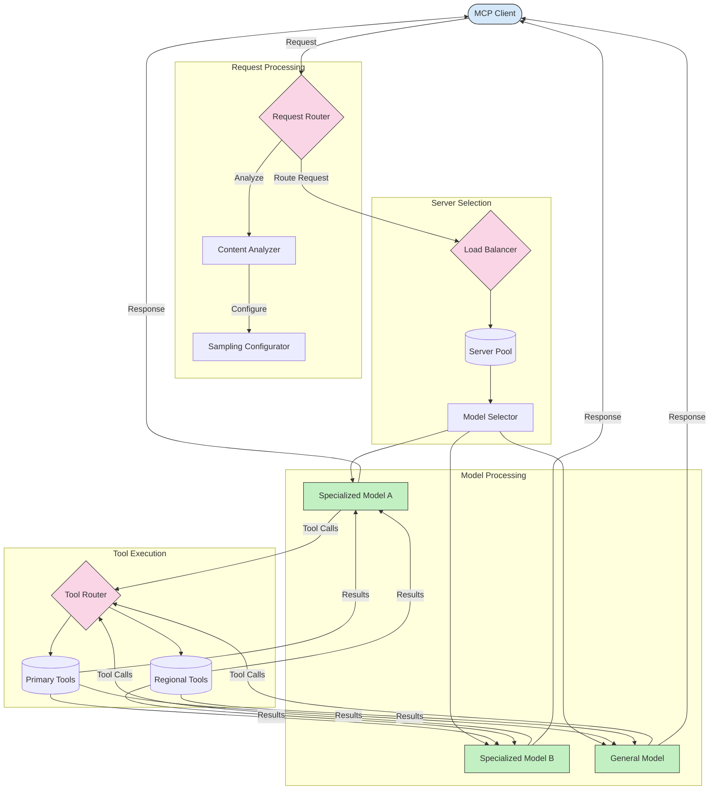

<!--
CO_OP_TRANSLATOR_METADATA:
{
  "original_hash": "af40eab7bd6ebf7e607f982a5506a5b5",
  "translation_date": "2025-07-14T02:15:32+00:00",
  "source_file": "05-AdvancedTopics/mcp-routing/README.md",
  "language_code": "tl"
}
-->
## Sampling at Arkitektura ng Routing sa MCP

Ang sampling ay isang mahalagang bahagi ng Model Context Protocol (MCP) na nagpapahintulot sa mahusay na pagproseso at pag-routing ng mga kahilingan. Kasama dito ang pagsusuri ng mga papasok na kahilingan upang matukoy ang pinakaangkop na modelo o serbisyo na hahawak sa mga ito, batay sa iba't ibang pamantayan tulad ng uri ng nilalaman, konteksto ng gumagamit, at load ng sistema.

Maaaring pagsamahin ang sampling at routing upang makabuo ng matibay na arkitektura na nag-ooptimize ng paggamit ng mga yaman at nagsisiguro ng mataas na availability. Ang proseso ng sampling ay maaaring gamitin upang iklasipika ang mga kahilingan, habang ang routing naman ang nagdidirekta sa mga ito sa angkop na mga modelo o serbisyo.

Ipinapakita sa diagram sa ibaba kung paano nagtutulungan ang sampling at routing sa isang komprehensibong arkitektura ng MCP:

## Ano ang susunod

- [5.6 Sampling](../mcp-sampling/README.md)

**Paalala**:  
Ang dokumentong ito ay isinalin gamit ang AI translation service na [Co-op Translator](https://github.com/Azure/co-op-translator). Bagamat nagsusumikap kami para sa katumpakan, pakatandaan na ang mga awtomatikong pagsasalin ay maaaring maglaman ng mga pagkakamali o di-tumpak na impormasyon. Ang orihinal na dokumento sa orihinal nitong wika ang dapat ituring na pangunahing sanggunian. Para sa mahahalagang impormasyon, inirerekomenda ang propesyonal na pagsasalin ng tao. Hindi kami mananagot sa anumang hindi pagkakaunawaan o maling interpretasyon na maaaring magmula sa paggamit ng pagsasaling ito.