<!--
CO_OP_TRANSLATOR_METADATA:
{
  "original_hash": "6e562d7e5a77c8982da4aa8f762ad1d8",
  "translation_date": "2025-07-14T03:11:35+00:00",
  "source_file": "05-AdvancedTopics/mcp-security-entra/README.md",
  "language_code": "tl"
}
-->
# Pagpapatibay ng Seguridad sa AI Workflows: Entra ID Authentication para sa Model Context Protocol Servers

## Panimula  
Ang pagpapatibay ng seguridad sa iyong Model Context Protocol (MCP) server ay kasinghalaga ng pag-lock ng pintuan ng iyong bahay. Kapag iniwan mong bukas ang iyong MCP server, nagiging bukas ito sa hindi awtorisadong pag-access, na maaaring magdulot ng mga paglabag sa seguridad. Nagbibigay ang Microsoft Entra ID ng matibay na cloud-based na solusyon para sa identity at access management, na tumutulong upang matiyak na tanging mga awtorisadong user at aplikasyon lamang ang makakagamit ng iyong MCP server. Sa bahaging ito, matututuhan mo kung paano protektahan ang iyong AI workflows gamit ang Entra ID authentication.

## Mga Layunin sa Pagkatuto  
Sa pagtatapos ng bahaging ito, magagawa mong:

- Maunawaan ang kahalagahan ng pagpapatibay ng seguridad sa MCP servers.  
- Ipaliwanag ang mga batayan ng Microsoft Entra ID at OAuth 2.0 authentication.  
- Kilalanin ang pagkakaiba ng public at confidential clients.  
- Ipatupad ang Entra ID authentication sa parehong lokal (public client) at remote (confidential client) na mga senaryo ng MCP server.  
- Ilapat ang mga pinakamahusay na kasanayan sa seguridad sa pagbuo ng AI workflows.

## Seguridad at MCP  

Tulad ng hindi mo iiwanang nakabukas ang pintuan ng iyong bahay, hindi mo rin dapat iwanang bukas ang iyong MCP server para sa kahit sino. Mahalaga ang pagpapatibay ng seguridad sa iyong AI workflows upang makabuo ng matibay, mapagkakatiwalaan, at ligtas na mga aplikasyon. Ipapakilala sa kabanatang ito kung paano gamitin ang Microsoft Entra ID upang protektahan ang iyong MCP servers, na tinitiyak na tanging mga awtorisadong user at aplikasyon lamang ang makakagamit ng iyong mga tools at data.

## Bakit Mahalaga ang Seguridad para sa MCP Servers  

Isipin na ang iyong MCP server ay may tool na maaaring magpadala ng email o mag-access ng customer database. Kapag hindi secured ang server, maaaring gamitin ito ng kahit sino, na magreresulta sa hindi awtorisadong pag-access sa data, spam, o iba pang malisyosong gawain.

Sa pamamagitan ng pagpapatupad ng authentication, tinitiyak mong bawat kahilingan sa iyong server ay na-verify, na kinukumpirma ang pagkakakilanlan ng user o aplikasyon na gumagawa ng kahilingan. Ito ang unang at pinakamahalagang hakbang sa pagpapatibay ng seguridad sa iyong AI workflows.

## Panimula sa Microsoft Entra ID  

[**Microsoft Entra ID**](https://adoption.microsoft.com/microsoft-security/entra/) ay isang cloud-based na serbisyo para sa identity at access management. Isipin mo ito bilang isang unibersal na guwardiya para sa iyong mga aplikasyon. Pinangangasiwaan nito ang komplikadong proseso ng pag-verify ng pagkakakilanlan ng user (authentication) at pagtukoy kung ano ang kanilang pinapayagang gawin (authorization).

Sa paggamit ng Entra ID, maaari mong:

- Pahintulutan ang ligtas na pag-sign in para sa mga user.  
- Protektahan ang mga API at serbisyo.  
- Pamahalaan ang mga patakaran sa access mula sa isang sentralisadong lokasyon.

Para sa MCP servers, nagbibigay ang Entra ID ng matibay at malawakang pinagkakatiwalaang solusyon upang pamahalaan kung sino ang maaaring gumamit ng kakayahan ng iyong server.

---

## Pag-unawa sa Magic: Paano Gumagana ang Entra ID Authentication  

Gumagamit ang Entra ID ng mga bukas na pamantayan tulad ng **OAuth 2.0** para sa authentication. Bagaman maaaring maging komplikado ang mga detalye, simple lang ang pangunahing konsepto at maaaring maipaliwanag gamit ang isang paghahambing.

### Isang Banayad na Panimula sa OAuth 2.0: Ang Valet Key  

Isipin ang OAuth 2.0 bilang isang valet service para sa iyong sasakyan. Kapag dumating ka sa isang restawran, hindi mo ibinibigay sa valet ang iyong master key. Sa halip, binibigay mo ang **valet key** na may limitadong pahintulot—maaari nitong paandarin ang sasakyan at i-lock ang mga pinto, pero hindi nito mabubuksan ang trunk o glove compartment.

Sa paghahambing na ito:

- **Ikaw** ang **User**.  
- **Ang iyong sasakyan** ay ang **MCP Server** na may mahahalagang tools at data.  
- Ang **Valet** ay ang **Microsoft Entra ID**.  
- Ang **Parking Attendant** ay ang **MCP Client** (ang aplikasyon na sumusubok mag-access sa server).  
- Ang **Valet Key** ay ang **Access Token**.

Ang access token ay isang secure na string ng teksto na natatanggap ng MCP client mula sa Entra ID pagkatapos mong mag-sign in. Ipinapasa ng client ang token na ito sa MCP server sa bawat kahilingan. Maaaring i-verify ng server ang token upang matiyak na lehitimo ang kahilingan at may sapat na pahintulot ang client, nang hindi kailangang hawakan ang iyong totoong kredensyal (tulad ng password).

### Ang Daloy ng Authentication  

Ganito ang proseso sa aktwal na paggamit:

```mermaid
sequenceDiagram
    actor User as 👤 User
    participant Client as ðŸ–¥ï¸ MCP Client
    participant Entra as 🔠Microsoft Entra ID
    participant Server as 🔧 MCP Server

    Client->>+User: Please sign in to continue.
    User->>+Entra: Enters credentials (username/password).
    Entra-->>Client: Here is your access token.
    User-->>-Client: (Returns to the application)

    Client->>+Server: I need to use a tool. Here is my access token.
    Server->>+Entra: Is this access token valid?
    Entra-->>-Server: Yes, it is.
    Server-->>-Client: Token is valid. Here is the result of the tool.
```



### Pagpapakilala sa Microsoft Authentication Library (MSAL)  

Bago tayo sumabak sa code, mahalagang ipakilala ang isang pangunahing bahagi na makikita mo sa mga halimbawa: ang **Microsoft Authentication Library (MSAL)**.

Ang MSAL ay isang library na ginawa ng Microsoft na nagpapadali sa mga developer na pamahalaan ang authentication. Sa halip na ikaw ang magsulat ng kumplikadong code para sa security tokens, pamamahala ng sign-ins, at pag-refresh ng sessions, inaalagaan ng MSAL ang mga ito.

Inirerekomenda ang paggamit ng MSAL dahil:

- **Ligtas ito:** Ipinapatupad nito ang mga industry-standard na protocol at pinakamahusay na kasanayan sa seguridad, na nagpapababa ng panganib ng mga kahinaan sa iyong code.  
- **Pinapadali ang Pag-develop:** Inaalis nito ang komplikasyon ng OAuth 2.0 at OpenID Connect protocols, kaya madali kang makakapagdagdag ng matibay na authentication sa iyong aplikasyon gamit ang ilang linya lang ng code.  
- **Pinananatili ito:** Aktibong inaalagaan at ina-update ng Microsoft ang MSAL upang tugunan ang mga bagong banta sa seguridad at pagbabago sa platform.

Sinusuportahan ng MSAL ang maraming wika at application frameworks, kabilang ang .NET, JavaScript/TypeScript, Python, Java, Go, at mga mobile platform tulad ng iOS at Android. Ibig sabihin, maaari mong gamitin ang pare-parehong pattern ng authentication sa buong teknolohiyang ginagamit mo.

Para matuto pa tungkol sa MSAL, maaari mong bisitahin ang opisyal na [MSAL overview documentation](https://learn.microsoft.com/entra/identity-platform/msal-overview).

---

## Pagpapatibay ng Seguridad sa Iyong MCP Server gamit ang Entra ID: Isang Hakbang-hakbang na Gabay  

Ngayon, tatalakayin natin kung paano protektahan ang isang lokal na MCP server (na nakikipag-ugnayan gamit ang `stdio`) gamit ang Entra ID. Ang halimbawang ito ay gumagamit ng **public client**, na angkop para sa mga aplikasyon na tumatakbo sa makina ng user, tulad ng desktop app o lokal na development server.

### Senaryo 1: Pagpapatibay ng Seguridad sa Lokal na MCP Server (gamit ang Public Client)  

Sa senaryong ito, titingnan natin ang isang MCP server na tumatakbo nang lokal, nakikipag-ugnayan gamit ang `stdio`, at gumagamit ng Entra ID upang i-authenticate ang user bago payagan ang access sa mga tools nito. Magkakaroon ang server ng isang tool na kumukuha ng profile information ng user mula sa Microsoft Graph API.

#### 1. Pagsasaayos ng Aplikasyon sa Entra ID  

Bago magsulat ng code, kailangan mong irehistro ang iyong aplikasyon sa Microsoft Entra ID. Ipinapaalam nito sa Entra ID ang tungkol sa iyong aplikasyon at binibigyan ito ng pahintulot na gamitin ang authentication service.

1. Pumunta sa **[Microsoft Entra portal](https://entra.microsoft.com/)**.  
2. Pumunta sa **App registrations** at i-click ang **New registration**.  
3. Bigyan ng pangalan ang iyong aplikasyon (halimbawa, "My Local MCP Server").  
4. Sa **Supported account types**, piliin ang **Accounts in this organizational directory only**.  
5. Maaari mong iwanang blangko ang **Redirect URI** para sa halimbawang ito.  
6. I-click ang **Register**.

Pagkatapos mairehistro, tandaan ang **Application (client) ID** at **Directory (tenant) ID**. Kakailanganin mo ito sa iyong code.

#### 2. Ang Code: Isang Pagsusuri  

Tingnan natin ang mga pangunahing bahagi ng code na humahawak sa authentication. Ang buong code para sa halimbawang ito ay makikita sa [Entra ID - Local - WAM](https://github.com/Azure-Samples/mcp-auth-servers/tree/main/src/entra-id-local-wam) folder ng [mcp-auth-servers GitHub repository](https://github.com/Azure-Samples/mcp-auth-servers).

**`AuthenticationService.cs`**

Ang klase na ito ang responsable sa pakikipag-ugnayan sa Entra ID.

- **`CreateAsync`**: Inilulunsad nito ang `PublicClientApplication` mula sa MSAL (Microsoft Authentication Library). Nakakonpigurang gamit ang `clientId` at `tenantId` ng iyong aplikasyon.  
- **`WithBroker`**: Pinapagana nito ang paggamit ng broker (tulad ng Windows Web Account Manager), na nagbibigay ng mas ligtas at seamless na single sign-on experience.  
- **`AcquireTokenAsync`**: Ito ang pangunahing metodo. Sinusubukan nitong kumuha ng token nang tahimik (silent) — ibig sabihin, hindi na kailangang mag-sign in muli ang user kung may valid na session na. Kapag hindi nakuha ang silent token, hihilingin nito ang user na mag-sign in nang interactive.

```csharp
// Simplified for clarity
public static async Task<AuthenticationService> CreateAsync(ILogger<AuthenticationService> logger)
{
    var msalClient = PublicClientApplicationBuilder
        .Create(_clientId) // Your Application (client) ID
        .WithAuthority(AadAuthorityAudience.AzureAdMyOrg)
        .WithTenantId(_tenantId) // Your Directory (tenant) ID
        .WithBroker(new BrokerOptions(BrokerOptions.OperatingSystems.Windows))
        .Build();

    // ... cache registration ...

    return new AuthenticationService(logger, msalClient);
}

public async Task<string> AcquireTokenAsync()
{
    try
    {
        // Try silent authentication first
        var accounts = await _msalClient.GetAccountsAsync();
        var account = accounts.FirstOrDefault();

        AuthenticationResult? result = null;

        if (account != null)
        {
            result = await _msalClient.AcquireTokenSilent(_scopes, account).ExecuteAsync();
        }
        else
        {
            // If no account, or silent fails, go interactive
            result = await _msalClient.AcquireTokenInteractive(_scopes).ExecuteAsync();
        }

        return result.AccessToken;
    }
    catch (Exception ex)
    {
        _logger.LogError(ex, "An error occurred while acquiring the token.");
        throw; // Optionally rethrow the exception for higher-level handling
    }
}
```

**`Program.cs`**

Dito isinaayos ang MCP server at isinama ang authentication service.

- **`AddSingleton<AuthenticationService>`**: Nirerehistro nito ang `AuthenticationService` sa dependency injection container, para magamit ito ng ibang bahagi ng aplikasyon (tulad ng tool natin).  
- **`GetUserDetailsFromGraph` tool**: Nangangailangan ang tool na ito ng instance ng `AuthenticationService`. Bago ito gumawa ng anumang aksyon, tinatawag nito ang `authService.AcquireTokenAsync()` para makakuha ng valid na access token. Kapag matagumpay ang authentication, ginagamit nito ang token para tawagan ang Microsoft Graph API at kunin ang detalye ng user.

```csharp
// Simplified for clarity
[McpServerTool(Name = "GetUserDetailsFromGraph")]
public static async Task<string> GetUserDetailsFromGraph(
    AuthenticationService authService)
{
    try
    {
        // This will trigger the authentication flow
        var accessToken = await authService.AcquireTokenAsync();

        // Use the token to create a GraphServiceClient
        var graphClient = new GraphServiceClient(
            new BaseBearerTokenAuthenticationProvider(new TokenProvider(authService)));

        var user = await graphClient.Me.GetAsync();

        return System.Text.Json.JsonSerializer.Serialize(user);
    }
    catch (Exception ex)
    {
        return $"Error: {ex.Message}";
    }
}
```

#### 3. Paano Ito Gumagana Nang Sama-sama  

1. Kapag sinubukang gamitin ng MCP client ang `GetUserDetailsFromGraph` tool, tinatawag muna ng tool ang `AcquireTokenAsync`.  
2. Pinapagana ng `AcquireTokenAsync` ang MSAL library upang hanapin ang valid na token.  
3. Kapag walang token na nahanap, hihilingin ng MSAL, sa pamamagitan ng broker, na mag-sign in ang user gamit ang kanilang Entra ID account.  
4. Kapag nakapag-sign in na ang user, naglalabas ang Entra ID ng access token.  
5. Natatanggap ng tool ang token at ginagamit ito para gumawa ng secure na tawag sa Microsoft Graph API.  
6. Ibinabalik ang detalye ng user sa MCP client.

Tinitiyak ng prosesong ito na tanging mga authenticated na user lamang ang makakagamit ng tool, kaya epektibong napoprotektahan ang iyong lokal na MCP server.

### Senaryo 2: Pagpapatibay ng Seguridad sa Remote MCP Server (gamit ang Confidential Client)  

Kapag ang iyong MCP server ay tumatakbo sa remote na makina (tulad ng cloud server) at nakikipag-ugnayan gamit ang protocol tulad ng HTTP Streaming, iba ang mga pangangailangan sa seguridad. Sa kasong ito, dapat kang gumamit ng **confidential client** at ang **Authorization Code Flow**. Mas ligtas ito dahil hindi kailanman naibubunyag ang mga sikreto ng aplikasyon sa browser.

Ang halimbawang ito ay gumagamit ng TypeScript-based MCP server na gumagamit ng Express.js para hawakan ang mga HTTP request.

#### 1. Pagsasaayos ng Aplikasyon sa Entra ID  

Katulad ng public client ang setup sa Entra ID, ngunit may isang mahalagang pagkakaiba: kailangan mong gumawa ng **client secret**.

1. Pumunta sa **[Microsoft Entra portal](https://entra.microsoft.com/)**.  
2. Sa iyong app registration, pumunta sa tab na **Certificates & secrets**.  
3. I-click ang **New client secret**, bigyan ito ng deskripsyon, at i-click ang **Add**.  
4. **Mahalaga:** Kopyahin agad ang secret value. Hindi mo na ito makikita muli.  
5. Kailangan mo ring i-configure ang **Redirect URI**. Pumunta sa tab na **Authentication**, i-click ang **Add a platform**, piliin ang **Web**, at ilagay ang redirect URI para sa iyong aplikasyon (halimbawa, `http://localhost:3001/auth/callback`).

> **⚠️ Importanteng Paalala sa Seguridad:** Para sa mga production na aplikasyon, mariing inirerekomenda ng Microsoft ang paggamit ng **secretless authentication** tulad ng **Managed Identity** o **Workload Identity Federation** sa halip na client secrets. Nanganganib ang client secrets na ma-expose o makompromiso. Nagbibigay ang managed identities ng mas ligtas na paraan sa pamamagitan ng pag-aalis ng pangangailangang itago ang mga kredensyal sa iyong code o configuration.  
>  
> Para sa karagdagang impormasyon tungkol sa managed identities at kung paano ito ipatupad, tingnan ang [Managed identities for Azure resources overview](https://learn.microsoft.com/entra/identity/managed-identities-azure-resources/overview).

#### 2. Ang Code: Isang Pagsusuri  

Gumagamit ang halimbawang ito ng session-based na pamamaraan. Kapag na-authenticate ang user, iniimbak ng server ang access token at refresh token sa isang session at binibigyan ang user ng session token. Ginagamit ang session token na ito sa mga susunod na kahilingan. Ang buong code para sa halimbawang ito ay makikita sa [Entra ID - Confidential client](https://github.com/Azure-Samples/mcp-auth-servers/tree/main/src/entra-id-cca-session) folder ng [mcp-auth-servers GitHub repository](https://github.com/Azure-Samples/mcp-auth-servers).

**`Server.ts`**

Itinatakda ng file na ito ang Express server at ang MCP transport layer.

- **`requireBearerAuth`**: Ito ay middleware na nagpoprotekta sa mga endpoint na `/sse` at `/message`. Sinusuri nito kung may valid na bearer token sa `Authorization` header ng kahilingan.  
- **`EntraIdServerAuthProvider`**: Isang custom na klase na nagpapatupad ng `McpServerAuthorizationProvider` interface. Responsable ito sa paghawak ng OAuth 2.0 flow.  
- **`/auth/callback`**: Ang endpoint na ito ang humahawak sa redirect mula sa Entra ID pagkatapos mag-authenticate ang user. Pinapalitan nito ang authorization code ng access token at refresh token.

```typescript
// Simplified for clarity
const app = express();
const { server } = createServer();
const provider = new EntraIdServerAuthProvider();

// Protect the SSE endpoint
app.get("/sse", requireBearerAuth({
  provider,
  requiredScopes: ["User.Read"]
}), async (req, res) => {
  // ... connect to the transport ...
});

// Protect the message endpoint
app.post("/message", requireBearerAuth({
  provider,
  requiredScopes: ["User.Read"]
}), async (req, res) => {
  // ... handle the message ...
});

// Handle the OAuth 2.0 callback
app.get("/auth/callback", (req, res) => {
  provider.handleCallback(req.query.code, req.query.state)
    .then(result => {
      // ... handle success or failure ...
    });
});
```

**`Tools.ts`**

Dito tinutukoy ang mga tools na ibinibigay ng MCP server. Katulad ng naunang halimbawa, ang `getUserDetails` tool ay kumukuha ng access token mula sa session.

```typescript
// Simplified for clarity
server.setRequestHandler(CallToolRequestSchema, async (request) => {
  const { name } = request.params;
  const context = request.params?.context as { token?: string } | undefined;
  const sessionToken = context?.token;

  if (name === ToolName.GET_USER_DETAILS) {
    if (!sessionToken) {
      throw new AuthenticationError("Authentication token is missing or invalid. Ensure the token is provided in the request context.");
    }

    // Get the Entra ID token from the session store
    const tokenData = tokenStore.getToken(sessionToken);
    const entraIdToken = tokenData.accessToken;

    const graphClient = Client.init({
      authProvider: (done) => {
        done(null, entraIdToken);
      }
    });

    const user = await graphClient.api('/me').get();

    // ... return user details ...
  }
});
```

**`auth/EntraIdServerAuthProvider.ts`**

Pinangangasiwaan ng klase na ito ang mga sumusunod:

- Pag-redirect ng user sa Entra ID sign-in page.  
- Pagpapalit ng authorization code para sa access token.  
- Pag-iimbak ng mga token sa `tokenStore`.  
- Pagre-refresh ng access token kapag ito ay nag-expire.

#### 3. Paano Ito Gumagana Nang Sama-sama  

1. Kapag unang sinubukang kumonekta ang user sa MCP server, makikita ng `requireBearerAuth` middleware na wala silang valid na session at ire-redirect sila sa Entra ID sign-in page.  
2. Mag-sign in ang user gamit ang kanilang Entra ID account.  
3. Ire-redirect ng Entra ID ang user pabalik sa `/auth/callback` endpoint kasama ang authorization code.
4. Pinagpapalitan ng server ang code para sa access token at refresh token, iniimbak ang mga ito, at lumilikha ng session token na ipinapadala sa kliyente.  
5. Maaari nang gamitin ng kliyente ang session token na ito sa `Authorization` header para sa lahat ng susunod na kahilingan sa MCP server.  
6. Kapag tinawag ang `getUserDetails` tool, ginagamit nito ang session token upang hanapin ang Entra ID access token at pagkatapos ay ginagamit ito para tawagan ang Microsoft Graph API.

Mas kumplikado ang daloy na ito kumpara sa public client flow, ngunit kinakailangan ito para sa mga internet-facing endpoints. Dahil ang mga remote MCP server ay naa-access sa pampublikong internet, kailangan nila ng mas matibay na mga hakbang sa seguridad upang maprotektahan laban sa hindi awtorisadong pag-access at posibleng mga pag-atake.

## Security Best Practices

- **Laging gumamit ng HTTPS**: I-encrypt ang komunikasyon sa pagitan ng kliyente at server upang maprotektahan ang mga token mula sa pagkaka-intercept.  
- **Magpatupad ng Role-Based Access Control (RBAC)**: Huwag lang tingnan *kung* authenticated ang user; tingnan din *ano* ang mga pahintulot nila. Maaari kang magtakda ng mga role sa Entra ID at suriin ang mga ito sa iyong MCP server.  
- **Mag-monitor at mag-audit**: I-log ang lahat ng authentication events upang madetect at matugunan ang mga kahina-hinalang aktibidad.  
- **Pangasiwaan ang rate limiting at throttling**: Nagpapatupad ang Microsoft Graph at iba pang API ng rate limiting upang maiwasan ang pang-aabuso. Mag-implementa ng exponential backoff at retry logic sa iyong MCP server upang maayos na mahawakan ang HTTP 429 (Too Many Requests) na mga tugon. Isaalang-alang ang pag-cache ng madalas na ginagamit na data upang mabawasan ang mga tawag sa API.  
- **Secure na pag-iimbak ng token**: Itago nang ligtas ang access tokens at refresh tokens. Para sa mga lokal na aplikasyon, gamitin ang secure storage mechanisms ng sistema. Para sa mga server application, isaalang-alang ang paggamit ng encrypted storage o secure key management services tulad ng Azure Key Vault.  
- **Pangasiwaan ang expiration ng token**: May limitadong buhay ang access tokens. Mag-implementa ng awtomatikong pag-refresh ng token gamit ang refresh tokens upang mapanatili ang tuloy-tuloy na karanasan ng user nang hindi na kailangang mag-re-authenticate.  
- **Isaalang-alang ang paggamit ng Azure API Management**: Bagaman ang direktang pag-implementa ng seguridad sa iyong MCP server ay nagbibigay ng mas detalyadong kontrol, ang mga API Gateway tulad ng Azure API Management ay maaaring awtomatikong pangasiwaan ang maraming isyu sa seguridad, kabilang ang authentication, authorization, rate limiting, at monitoring. Nagbibigay sila ng sentralisadong layer ng seguridad na nasa pagitan ng iyong mga kliyente at MCP server. Para sa karagdagang detalye sa paggamit ng API Gateways sa MCP, tingnan ang aming [Azure API Management Your Auth Gateway For MCP Servers](https://techcommunity.microsoft.com/blog/integrationsonazureblog/azure-api-management-your-auth-gateway-for-mcp-servers/4402690).

## Key Takeaways

- Mahalaga ang pag-secure ng iyong MCP server para maprotektahan ang iyong data at mga tool.  
- Nagbibigay ang Microsoft Entra ID ng matibay at scalable na solusyon para sa authentication at authorization.  
- Gumamit ng **public client** para sa mga lokal na aplikasyon at **confidential client** para sa mga remote server.  
- Ang **Authorization Code Flow** ang pinakaligtas na opsyon para sa mga web application.

## Exercise

1. Isipin ang isang MCP server na maaaring iyong gagawin. Ito ba ay lokal na server o remote server?  
2. Batay sa iyong sagot, gagamit ka ba ng public o confidential client?  
3. Anong permiso ang hihingin ng iyong MCP server para sa pagsasagawa ng mga aksyon laban sa Microsoft Graph?

## Hands-on Exercises

### Exercise 1: Magrehistro ng Application sa Entra ID  
Pumunta sa Microsoft Entra portal.  
Magrehistro ng bagong application para sa iyong MCP server.  
Itala ang Application (client) ID at Directory (tenant) ID.

### Exercise 2: I-secure ang Lokal na MCP Server (Public Client)  
- Sundin ang halimbawa ng code para i-integrate ang MSAL (Microsoft Authentication Library) para sa user authentication.  
- Subukan ang authentication flow sa pamamagitan ng pagtawag sa MCP tool na kumukuha ng user details mula sa Microsoft Graph.

### Exercise 3: I-secure ang Remote MCP Server (Confidential Client)  
- Magrehistro ng confidential client sa Entra ID at gumawa ng client secret.  
- I-configure ang iyong Express.js MCP server upang gamitin ang Authorization Code Flow.  
- Subukan ang mga protected endpoints at kumpirmahin ang token-based access.

### Exercise 4: Ipatupad ang Security Best Practices  
- Paganahin ang HTTPS para sa iyong lokal o remote server.  
- Magpatupad ng role-based access control (RBAC) sa iyong server logic.  
- Magdagdag ng token expiration handling at secure token storage.

## Resources

1. **MSAL Overview Documentation**  
   Alamin kung paano pinapagana ng Microsoft Authentication Library (MSAL) ang secure na pagkuha ng token sa iba't ibang platform:  
   [MSAL Overview on Microsoft Learn](https://learn.microsoft.com/en-gb/entra/msal/overview)

2. **Azure-Samples/mcp-auth-servers GitHub Repository**  
   Mga reference implementation ng MCP servers na nagpapakita ng authentication flows:  
   [Azure-Samples/mcp-auth-servers on GitHub](https://github.com/Azure-Samples/mcp-auth-servers)

3. **Managed Identities for Azure Resources Overview**  
   Unawain kung paano alisin ang mga secret gamit ang system- o user-assigned managed identities:  
   [Managed Identities Overview on Microsoft Learn](https://learn.microsoft.com/en-us/entra/identity/managed-identities-azure-resources/)

4. **Azure API Management: Your Auth Gateway for MCP Servers**  
   Malalimang pagtalakay sa paggamit ng APIM bilang secure OAuth2 gateway para sa MCP servers:  
   [Azure API Management Your Auth Gateway For MCP Servers](https://techcommunity.microsoft.com/blog/integrationsonazureblog/azure-api-management-your-auth-gateway-for-mcp-servers/4402690)

5. **Microsoft Graph Permissions Reference**  
   Komprehensibong listahan ng delegated at application permissions para sa Microsoft Graph:  
   [Microsoft Graph Permissions Reference](https://learn.microsoft.com/zh-tw/graph/permissions-reference)

## Learning Outcomes  
Pagkatapos makumpleto ang seksyong ito, magagawa mong:

- Ipaliwanag kung bakit mahalaga ang authentication para sa MCP servers at AI workflows.  
- I-set up at i-configure ang Entra ID authentication para sa parehong lokal at remote MCP server scenarios.  
- Pumili ng angkop na uri ng client (public o confidential) batay sa deployment ng iyong server.  
- Magpatupad ng secure coding practices, kabilang ang token storage at role-based authorization.  
- Matibay na maprotektahan ang iyong MCP server at mga tool mula sa hindi awtorisadong pag-access.

## What's next

- [5.13 Model Context Protocol (MCP) Integration with Azure AI Foundry](../mcp-foundry-agent-integration/README.md)

**Paalala**:  
Ang dokumentong ito ay isinalin gamit ang AI translation service na [Co-op Translator](https://github.com/Azure/co-op-translator). Bagamat nagsusumikap kami para sa katumpakan, pakatandaan na ang mga awtomatikong pagsasalin ay maaaring maglaman ng mga pagkakamali o di-tumpak na impormasyon. Ang orihinal na dokumento sa kanyang sariling wika ang dapat ituring na pangunahing sanggunian. Para sa mahahalagang impormasyon, inirerekomenda ang propesyonal na pagsasalin ng tao. Hindi kami mananagot sa anumang hindi pagkakaunawaan o maling interpretasyon na maaaring magmula sa paggamit ng pagsasaling ito.