<!--
CO_OP_TRANSLATOR_METADATA:
{
  "original_hash": "6e562d7e5a77c8982da4aa8f762ad1d8",
  "translation_date": "2025-07-02T09:46:22+00:00",
  "source_file": "05-AdvancedTopics/mcp-security-entra/README.md",
  "language_code": "tl"
}
-->
# Securing AI Workflows: Entra ID Authentication para sa Model Context Protocol Servers

## Panimula  
Ang pagsisiguro sa iyong Model Context Protocol (MCP) server ay kasinghalaga ng pagsasara ng pintuan ng iyong bahay. Kapag iniwan mong bukas ang MCP server mo, inilalagay mo sa panganib ang iyong mga kagamitan at datos mula sa mga hindi awtorisadong makaka-access, na maaaring magdulot ng mga paglabag sa seguridad. Ang Microsoft Entra ID ay nagbibigay ng matatag na cloud-based na solusyon para sa identity at access management, na tumutulong upang matiyak na tanging mga awtorisadong gumagamit at aplikasyon lamang ang maaaring makipag-ugnayan sa iyong MCP server. Sa bahaging ito, matututuhan mo kung paano protektahan ang iyong AI workflows gamit ang Entra ID authentication.

## Mga Layunin sa Pagkatuto  
Sa pagtatapos ng bahaging ito, magagawa mong:

- Maunawaan ang kahalagahan ng pagsisiguro sa MCP servers.  
- Ipaliwanag ang mga batayan ng Microsoft Entra ID at OAuth 2.0 authentication.  
- Kilalanin ang pagkakaiba ng public at confidential clients.  
- Ipatupad ang Entra ID authentication sa parehong lokal (public client) at remote (confidential client) na MCP server na mga senaryo.  
- Ilapat ang mga pinakamahusay na kasanayan sa seguridad sa pagbuo ng AI workflows.

## Seguridad at MCP  

Tulad ng hindi mo iiwanang bukas ang pintuan ng iyong bahay, hindi mo rin dapat hayaan na bukas ang iyong MCP server para sa kahit sino. Mahalaga ang pagsisiguro ng iyong AI workflows upang makabuo ng matibay, mapagkakatiwalaan, at ligtas na mga aplikasyon. Ipapakilala sa kabanatang ito kung paano gamitin ang Microsoft Entra ID upang protektahan ang iyong MCP servers, na tanging mga awtorisadong gumagamit at aplikasyon lamang ang makaka-access sa iyong mga kagamitan at datos.

## Bakit Mahalaga ang Seguridad para sa MCP Servers  

Isipin na ang iyong MCP server ay may kasangkapang nagpapadala ng email o nakakapasok sa isang customer database. Kapag hindi ito na-secure, kahit sino ay maaaring gamitin ang kasangkapang iyon, na magreresulta sa hindi awtorisadong pag-access sa datos, spam, o iba pang mapanirang gawain.

Sa pamamagitan ng pagpapatupad ng authentication, sinisiguro mong bawat kahilingan sa iyong server ay nasusuri, na pinapatunayan ang pagkakakilanlan ng gumagamit o aplikasyon na gumagawa ng kahilingan. Ito ang unang at pinakamahalagang hakbang sa pagsisiguro ng iyong AI workflows.

## Panimula sa Microsoft Entra ID  

[**Microsoft Entra ID**](https://adoption.microsoft.com/microsoft-security/entra/) ay isang cloud-based na serbisyo para sa identity at access management. Isipin mo itong isang unibersal na guwardiya para sa iyong mga aplikasyon. Pinangangasiwaan nito ang masalimuot na proseso ng pagpapatunay ng pagkakakilanlan ng gumagamit (authentication) at pagtukoy kung ano ang pinapayagan nilang gawin (authorization).

Sa paggamit ng Entra ID, maaari mong:

- Pahintulutan ang ligtas na pag-sign in ng mga gumagamit.  
- Protektahan ang mga API at serbisyo.  
- Pamahalaan ang mga patakaran sa access mula sa isang sentralisadong lokasyon.

Para sa MCP servers, nagbibigay ang Entra ID ng matibay at malawak na pinagkakatiwalaang solusyon para kontrolin kung sino ang makaka-access sa kakayahan ng iyong server.

---

## Pag-unawa sa Magic: Paano Gumagana ang Entra ID Authentication  

Gumagamit ang Entra ID ng mga bukas na pamantayan tulad ng **OAuth 2.0** para sa authentication. Bagamat maaaring maging komplikado ang mga detalye, simple ang pangunahing konsepto at maaaring maipaliwanag gamit ang isang halimbawa.

### Isang Banayad na Panimula sa OAuth 2.0: Ang Valet Key  

Isipin ang OAuth 2.0 tulad ng isang valet service para sa iyong sasakyan. Kapag dumating ka sa isang restawran, hindi mo ibibigay ang iyong master key sa valet. Sa halip, bibigyan mo siya ng **valet key** na may limitadong pahintulot—maaari nitong paandarin ang sasakyan at isara ang mga pinto, ngunit hindi nito mabubuksan ang trunk o glove compartment.

Sa halimbawa na ito:

- **Ikaw** ang **User**.  
- **Ang iyong sasakyan** ay ang **MCP Server** na may mahahalagang kagamitan at datos.  
- Ang **Valet** ay ang **Microsoft Entra ID**.  
- Ang **Parking Attendant** ay ang **MCP Client** (ang aplikasyon na sumusubok mag-access sa server).  
- Ang **Valet Key** ay ang **Access Token**.

Ang access token ay isang ligtas na string ng teksto na natatanggap ng MCP client mula sa Entra ID pagkatapos mong mag-sign in. Ipinapakita ng client ang token na ito sa MCP server sa bawat kahilingan. Maaaring beripikahin ng server ang token upang matiyak na lehitimo ang kahilingan at may sapat na pahintulot ang client, nang hindi kailangang hawakan ang iyong tunay na kredensyal (tulad ng password).

### Ang Daloy ng Authentication  

Ganito ang proseso sa praktika:



```mermaid
sequenceDiagram
    actor User as 👤 User
    participant Client as ðŸ–¥ï¸ MCP Client
    participant Entra as 🔠Microsoft Entra ID
    participant Server as 🔧 MCP Server

    Client->>+User: Please sign in to continue.
    User->>+Entra: Enters credentials (username/password).
    Entra-->>Client: Here is your access token.
    User-->>-Client: (Returns to the application)

    Client->>+Server: I need to use a tool. Here is my access token.
    Server->>+Entra: Is this access token valid?
    Entra-->>-Server: Yes, it is.
    Server-->>-Client: Token is valid. Here is the result of the tool.
```

### Pagpapakilala sa Microsoft Authentication Library (MSAL)  

Bago tayo sumabak sa code, mahalagang ipakilala ang isang pangunahing bahagi na makikita mo sa mga halimbawa: ang **Microsoft Authentication Library (MSAL)**.

Ang MSAL ay isang library na ginawa ng Microsoft na nagpapadali sa mga developer na hawakan ang authentication. Sa halip na ikaw ang magsulat ng lahat ng masalimuot na code para sa seguridad ng mga token, pamamahala ng pag-sign in, at pag-refresh ng session, ang MSAL na ang bahala sa mga ito.

Inirerekomenda ang paggamit ng MSAL dahil:

- **Ligtas ito:** Ipinapatupad nito ang mga pamantayan at pinakamahusay na kasanayan sa industriya upang mabawasan ang panganib ng kahinaan sa iyong code.  
- **Pinapadali nito ang pag-develop:** Inaalis nito ang komplikasyon ng OAuth 2.0 at OpenID Connect, kaya madali kang makakapagdagdag ng matibay na authentication sa iyong aplikasyon gamit lamang ang ilang linya ng code.  
- **Patuloy itong ina-update:** Aktibong inaalagaan at ina-update ng Microsoft ang MSAL upang tugunan ang mga bagong banta sa seguridad at pagbabago sa platform.

Sinusuportahan ng MSAL ang iba't ibang wika at application frameworks tulad ng .NET, JavaScript/TypeScript, Python, Java, Go, at mga mobile platform gaya ng iOS at Android. Ibig sabihin, maaari mong gamitin ang pare-parehong pattern ng authentication sa buong teknolohiyang ginagamit mo.

Para sa karagdagang impormasyon tungkol sa MSAL, maaari mong bisitahin ang opisyal na [MSAL overview documentation](https://learn.microsoft.com/entra/identity-platform/msal-overview).

---

## Pagsisiguro sa Iyong MCP Server gamit ang Entra ID: Isang Hakbang-hakbang na Gabay  

Ngayon, tignan natin kung paano i-secure ang isang lokal na MCP server (isang server na nakikipag-usap gamit ang `stdio`) using Entra ID. This example uses a **public client**, which is suitable for applications running on a user's machine, like a desktop app or a local development server.

### Scenario 1: Securing a Local MCP Server (with a Public Client)

In this scenario, we'll look at an MCP server that runs locally, communicates over `stdio`, and uses Entra ID to authenticate the user before allowing access to its tools. The server will have a single tool that fetches the user's profile information from the Microsoft Graph API.

#### 1. Setting Up the Application in Entra ID

Before writing any code, you need to register your application in Microsoft Entra ID. This tells Entra ID about your application and grants it permission to use the authentication service.

1. Navigate to the **[Microsoft Entra portal](https://entra.microsoft.com/)**.
2. Go to **App registrations** and click **New registration**.
3. Give your application a name (e.g., "My Local MCP Server").
4. For **Supported account types**, select **Accounts in this organizational directory only**.
5. You can leave the **Redirect URI** blank for this example.
6. Click **Register**.

Once registered, take note of the **Application (client) ID** and **Directory (tenant) ID**. You'll need these in your code.

#### 2. The Code: A Breakdown

Let's look at the key parts of the code that handle authentication. The full code for this example is available in the [Entra ID - Local - WAM](https://github.com/Azure-Samples/mcp-auth-servers/tree/main/src/entra-id-local-wam) folder of the [mcp-auth-servers GitHub repository](https://github.com/Azure-Samples/mcp-auth-servers).

**`AuthenticationService.cs`**

This class is responsible for handling the interaction with Entra ID.

- **`CreateAsync`**: This method initializes the `PublicClientApplication` from the MSAL (Microsoft Authentication Library). It's configured with your application's `clientId` and `tenantId`.
- **`WithBroker`**: This enables the use of a broker (like the Windows Web Account Manager), which provides a more secure and seamless single sign-on experience.
- **`AcquireTokenAsync`**: Ito ang pangunahing pamamaraan. Sinusubukan nitong kunin ang token nang tahimik (ibig sabihin, hindi na kailangang mag-sign in muli ang user kung may valid na session na siya). Kung hindi makakuha ng silent token, hihilingin nito ang user na mag-sign in nang interactive.

```csharp
// Simplified for clarity
public static async Task<AuthenticationService> CreateAsync(ILogger<AuthenticationService> logger)
{
    var msalClient = PublicClientApplicationBuilder
        .Create(_clientId) // Your Application (client) ID
        .WithAuthority(AadAuthorityAudience.AzureAdMyOrg)
        .WithTenantId(_tenantId) // Your Directory (tenant) ID
        .WithBroker(new BrokerOptions(BrokerOptions.OperatingSystems.Windows))
        .Build();

    // ... cache registration ...

    return new AuthenticationService(logger, msalClient);
}

public async Task<string> AcquireTokenAsync()
{
    try
    {
        // Try silent authentication first
        var accounts = await _msalClient.GetAccountsAsync();
        var account = accounts.FirstOrDefault();

        AuthenticationResult? result = null;

        if (account != null)
        {
            result = await _msalClient.AcquireTokenSilent(_scopes, account).ExecuteAsync();
        }
        else
        {
            // If no account, or silent fails, go interactive
            result = await _msalClient.AcquireTokenInteractive(_scopes).ExecuteAsync();
        }

        return result.AccessToken;
    }
    catch (Exception ex)
    {
        _logger.LogError(ex, "An error occurred while acquiring the token.");
        throw; // Optionally rethrow the exception for higher-level handling
    }
}
```

**`Program.cs`**

This is where the MCP server is set up and the authentication service is integrated.

- **`AddSingleton<AuthenticationService>`**: This registers the `AuthenticationService` with the dependency injection container, so it can be used by other parts of the application (like our tool).
- **`GetUserDetailsFromGraph` tool**: This tool requires an instance of `AuthenticationService`. Before it does anything, it calls `authService.AcquireTokenAsync()` upang makakuha ng valid na access token. Kapag matagumpay ang authentication, ginagamit nito ang token para tawagan ang Microsoft Graph API at kunin ang detalye ng user.

```csharp
// Simplified for clarity
[McpServerTool(Name = "GetUserDetailsFromGraph")]
public static async Task<string> GetUserDetailsFromGraph(
    AuthenticationService authService)
{
    try
    {
        // This will trigger the authentication flow
        var accessToken = await authService.AcquireTokenAsync();

        // Use the token to create a GraphServiceClient
        var graphClient = new GraphServiceClient(
            new BaseBearerTokenAuthenticationProvider(new TokenProvider(authService)));

        var user = await graphClient.Me.GetAsync();

        return System.Text.Json.JsonSerializer.Serialize(user);
    }
    catch (Exception ex)
    {
        return $"Error: {ex.Message}";
    }
}
```

#### 3. Paano Nagsasama-sama ang Lahat  

1. Kapag sinubukan ng MCP client gamitin ang `GetUserDetailsFromGraph` tool, the tool first calls `AcquireTokenAsync`.
2. `AcquireTokenAsync` triggers the MSAL library to check for a valid token.
3. If no token is found, MSAL, through the broker, will prompt the user to sign in with their Entra ID account.
4. Once the user signs in, Entra ID issues an access token.
5. The tool receives the token and uses it to make a secure call to the Microsoft Graph API.
6. The user's details are returned to the MCP client.

This process ensures that only authenticated users can use the tool, effectively securing your local MCP server.

### Scenario 2: Securing a Remote MCP Server (with a Confidential Client)

When your MCP server is running on a remote machine (like a cloud server) and communicates over a protocol like HTTP Streaming, the security requirements are different. In this case, you should use a **confidential client** and the **Authorization Code Flow**. This is a more secure method because the application's secrets are never exposed to the browser.

This example uses a TypeScript-based MCP server that uses Express.js to handle HTTP requests.

#### 1. Setting Up the Application in Entra ID

The setup in Entra ID is similar to the public client, but with one key difference: you need to create a **client secret**.

1. Navigate to the **[Microsoft Entra portal](https://entra.microsoft.com/)**.
2. In your app registration, go to the **Certificates & secrets** tab.
3. Click **New client secret**, give it a description, and click **Add**.
4. **Important:** Copy the secret value immediately. You will not be able to see it again.
5. You also need to configure a **Redirect URI**. Go to the **Authentication** tab, click **Add a platform**, select **Web**, and enter the redirect URI for your application (e.g., `http://localhost:3001/auth/callback`).

> **⚠️ Important Security Note:** For production applications, Microsoft strongly recommends using **secretless authentication** methods such as **Managed Identity** or **Workload Identity Federation** instead of client secrets. Client secrets pose security risks as they can be exposed or compromised. Managed identities provide a more secure approach by eliminating the need to store credentials in your code or configuration.
>
> For more information about managed identities and how to implement them, see the [Managed identities for Azure resources overview](https://learn.microsoft.com/entra/identity/managed-identities-azure-resources/overview).

#### 2. The Code: A Breakdown

This example uses a session-based approach. When the user authenticates, the server stores the access token and refresh token in a session and gives the user a session token. This session token is then used for subsequent requests. The full code for this example is available in the [Entra ID - Confidential client](https://github.com/Azure-Samples/mcp-auth-servers/tree/main/src/entra-id-cca-session) folder of the [mcp-auth-servers GitHub repository](https://github.com/Azure-Samples/mcp-auth-servers).

**`Server.ts`**

This file sets up the Express server and the MCP transport layer.

- **`requireBearerAuth`**: This is middleware that protects the `/sse` and `/message` endpoints. It checks for a valid bearer token in the `Authorization` header of the request.
- **`EntraIdServerAuthProvider`**: This is a custom class that implements the `McpServerAuthorizationProvider` interface. It's responsible for handling the OAuth 2.0 flow.
- **`/auth/callback`**: Pinangangasiwaan ng endpoint na ito ang redirect mula sa Entra ID matapos mag-authenticate ang user. Pinapalitan nito ang authorization code para sa access token at refresh token.

```typescript
// Simplified for clarity
const app = express();
const { server } = createServer();
const provider = new EntraIdServerAuthProvider();

// Protect the SSE endpoint
app.get("/sse", requireBearerAuth({
  provider,
  requiredScopes: ["User.Read"]
}), async (req, res) => {
  // ... connect to the transport ...
});

// Protect the message endpoint
app.post("/message", requireBearerAuth({
  provider,
  requiredScopes: ["User.Read"]
}), async (req, res) => {
  // ... handle the message ...
});

// Handle the OAuth 2.0 callback
app.get("/auth/callback", (req, res) => {
  provider.handleCallback(req.query.code, req.query.state)
    .then(result => {
      // ... handle success or failure ...
    });
});
```

**`Tools.ts`**

This file defines the tools that the MCP server provides. The `getUserDetails` tool ay katulad ng nasa naunang halimbawa, ngunit kinukuha nito ang access token mula sa session.

```typescript
// Simplified for clarity
server.setRequestHandler(CallToolRequestSchema, async (request) => {
  const { name } = request.params;
  const context = request.params?.context as { token?: string } | undefined;
  const sessionToken = context?.token;

  if (name === ToolName.GET_USER_DETAILS) {
    if (!sessionToken) {
      throw new AuthenticationError("Authentication token is missing or invalid. Ensure the token is provided in the request context.");
    }

    // Get the Entra ID token from the session store
    const tokenData = tokenStore.getToken(sessionToken);
    const entraIdToken = tokenData.accessToken;

    const graphClient = Client.init({
      authProvider: (done) => {
        done(null, entraIdToken);
      }
    });

    const user = await graphClient.api('/me').get();

    // ... return user details ...
  }
});
```

**`auth/EntraIdServerAuthProvider.ts`**

This class handles the logic for:

- Redirecting the user to the Entra ID sign-in page.
- Exchanging the authorization code for an access token.
- Storing the tokens in the `tokenStore`.
- Refreshing the access token when it expires.

#### 3. How It All Works Together

1. When a user first tries to connect to the MCP server, the `requireBearerAuth` middleware will see that they don't have a valid session and will redirect them to the Entra ID sign-in page.
2. The user signs in with their Entra ID account.
3. Entra ID redirects the user back to the `/auth/callback` endpoint with an authorization code.
4. The server exchanges the code for an access token and a refresh token, stores them, and creates a session token which is sent to the client.
5. The client can now use this session token in the `Authorization` header for all future requests to the MCP server.
6. When the `getUserDetails` tool ay tinatawag, ginagamit nito ang session token para hanapin ang Entra ID access token at pagkatapos ay ginagamit iyon para tawagan ang Microsoft Graph API.

Mas kumplikado ang daloy na ito kumpara sa public client flow, ngunit kinakailangan ito para sa mga endpoint na nakaharap sa internet. Dahil accessible ang remote MCP servers sa publiko, kailangan nila ng mas matibay na seguridad upang maprotektahan laban sa hindi awtorisadong pag-access at posibleng mga pag-atake.

## Mga Pinakamahusay na Kasanayan sa Seguridad  

- **Laging gumamit ng HTTPS**: I-encrypt ang komunikasyon sa pagitan ng client at server upang maprotektahan ang mga token mula sa interception.  
- **Magpatupad ng Role-Based Access Control (RBAC)**: Huwag lang suriin kung *authenticated* ang user; suriin din kung *ano* ang pinapayagan nilang gawin. Maaari kang magtakda ng mga role sa Entra ID at i-verify ito sa iyong MCP server.  
- **Mag-monitor at mag-audit**: I-log ang lahat ng authentication events para makita at matugunan ang mga kahina-hinalang aktibidad.  
- **Pangasiwaan ang rate limiting at throttling**: Nagpapatupad ang Microsoft Graph at iba pang API ng rate limiting upang maiwasan ang pang-aabuso. Mag-implement ng exponential backoff at retry logic sa iyong MCP server upang maayos na mahawakan ang HTTP 429 (Too Many Requests) responses. Isaalang-alang ang pag-cache ng madalas gamitin na datos upang mabawasan ang tawag sa API.  
- **Ligtas na pag-iimbak ng token**: Itago nang ligtas ang access tokens at refresh tokens. Para sa mga lokal na aplikasyon, gamitin ang secure storage ng sistema. Para sa mga server applications, isaalang-alang ang encrypted storage o mga secure key management services tulad ng Azure Key Vault.  
- **Pag-handle ng expiration ng token**: May limitadong buhay ang access tokens. Magpatupad ng automatic token refresh gamit ang refresh tokens para mapanatili ang tuloy-tuloy na karanasan ng user nang hindi na kailangang muling mag-authenticate.  
- **Isaalang-alang ang paggamit ng Azure API Management**: Habang ang direktang pagpapatupad ng seguridad sa iyong MCP server ay nagbibigay ng detalyadong kontrol, ang mga API Gateways tulad ng Azure API Management ay maaaring pangasiwaan ang maraming isyu sa seguridad nang awtomatiko, kabilang ang authentication, authorization, rate limiting, at monitoring. Nagbibigay sila ng sentralisadong layer ng seguridad sa pagitan ng iyong mga client at MCP servers. Para sa karagdagang detalye sa paggamit ng API Gateways sa MCP, tingnan ang aming [Azure API Management Your Auth Gateway For MCP Servers](https://techcommunity.microsoft.com/blog/integrationsonazureblog/azure-api-management-your-auth-gateway-for-mcp-servers/4402690).

## Mga Pangunahing Punto  

- Mahalaga ang pagsisiguro ng iyong MCP server upang maprotektahan ang iyong datos at mga kagamitan.  
- Nagbibigay ang Microsoft Entra ID ng matibay at scalable na solusyon para sa authentication at authorization.  
- Gumamit ng **public client** para sa mga lokal na aplikasyon at **confidential client** para sa mga remote na server.  
- Ang **Authorization Code Flow** ang pinakaligtas na opsyon para sa mga web application.

## Ehersisyo  

1. Isipin ang isang MCP server na maaaring gawin mo. Ito ba ay lokal o remote na server?  
2. Batay sa sagot mo, gagamit ka ba ng public o confidential client?  
3. Anong permiso ang hihingin ng MCP server mo para sa paggawa ng mga aksyon laban sa Microsoft Graph?

## Mga Hands-on na Ehersisyo  

### Ehersisyo 1: Magrehistro ng Aplikasyon sa Entra ID  
Pumunta sa Microsoft Entra portal.  
Magrehistro ng bagong aplikasyon para sa iyong MCP server.  
Itala ang Application (client) ID at Directory (tenant) ID.

### Ehersisyo 2: Siguraduhin ang Lokal na MCP Server (Public Client)  
- Sundan ang code example para isama ang MSAL (Microsoft Authentication Library) para sa user authentication.  
- Subukan ang authentication flow sa pamamagitan ng pagtawag sa MCP tool na kumukuha ng detalye ng user mula sa Microsoft Graph.

### Ehersisyo 3: Siguraduhin ang Remote MCP Server (Confidential Client)  
- Magrehistro ng confidential client sa Entra ID at gumawa ng client secret.  
- I-configure ang iyong Express.js MCP server upang gamitin ang Authorization Code Flow.  
- Subukan ang mga protektadong endpoint at kumpirmahin ang token-based na access.

### Ehersisyo 4: Ilapat ang Mga Pinakamahusay na Kasanayan sa Seguridad  
- Paganahin ang HTTPS para sa iyong lokal o remote server.  
- Magpatupad ng role-based access control (RBAC) sa iyong server logic.  
- Magdagdag ng token expiration handling at secure token storage.

## Mga Sanggunian  

1. **MSAL Overview Documentation**  
   Alamin kung paano pinapadali ng Microsoft Authentication Library (MSAL) ang secure na token acquisition sa iba't ibang platform:  
   [MSAL Overview on Microsoft Learn](https://learn.microsoft.com/en-gb/entra/msal/overview)

2. **Azure-Samples/mcp-auth-servers GitHub Repository**  
   Mga halimbawa ng implementasyon ng MCP servers na nagpapakita ng authentication flows:  
   [Azure-Samples/mcp-auth-servers on GitHub](https://github.com/Azure-Samples/mcp-auth-servers)

3. **Managed Identities for Azure Resources Overview**  
   Unawain kung paano alisin ang mga secret gamit ang system- o user-assigned managed identities:  
   [Managed Identities Overview on Microsoft Learn](https://learn.microsoft.com/en-us/entra/identity/managed-identities-azure-resources/)

4. **Azure API Management: Your Auth Gateway for MCP Servers**  
   Masusing pagtalakay sa paggamit ng APIM bilang secure OAuth2 gateway para sa MCP servers:  
   [Azure API Management Your Auth Gateway For MCP Servers](https://techcommunity.microsoft.com/blog/integrationsonazureblog/azure-api-management-your-auth-gateway-for-mcp-servers/4402690)

5. **Microsoft Graph Permissions Reference**  
   Komprehensibong listahan ng delegated at application permissions para sa Microsoft Graph:  
   [Microsoft Graph Permissions Reference](https://learn.microsoft.com/zh-tw/graph/permissions-reference)

## Mga Kinalabasan sa Pagkatuto  
Pagkatapos makumpleto ang bahaging ito, magagawa mong:

- Ipaliwanag kung bakit mahalaga ang authentication para sa MCP servers at AI workflows.  
- Isaayos at i-configure ang Entra ID authentication para sa parehong lokal at remote MCP server na mga senaryo.  
- Pumili ng tamang uri ng client (public o confidential) batay sa deployment ng iyong server.  
- Ipatupad ang ligtas na coding practices, kabilang ang pag-iimbak ng token at role-based authorization.  
- Protektahan nang may kumpiyansa ang iyong MCP server at mga kagamitan mula sa hindi awtorisadong pag-access.

## Ano ang Susunod  

- [5.13 Model Context Protocol (MCP) Integration with Azure AI Foundry](../mcp-foundry-agent-integration/README.md)

**Paalala:**  
Ang dokumentong ito ay isinalin gamit ang AI translation service na [Co-op Translator](https://github.com/Azure/co-op-translator). Bagamat aming pinagsisikapang maging tumpak ang pagsasalin, pakatandaan na ang mga awtomatikong pagsasalin ay maaaring maglaman ng mga pagkakamali o hindi pagkakatugma. Ang orihinal na dokumento sa orihinal nitong wika ang dapat ituring na pangunahing sanggunian. Para sa mahahalagang impormasyon, inirerekomenda ang propesyonal na pagsasalin ng tao. Hindi kami mananagot sa anumang hindi pagkakaunawaan o maling interpretasyon na maaaring magmula sa paggamit ng pagsasaling ito.