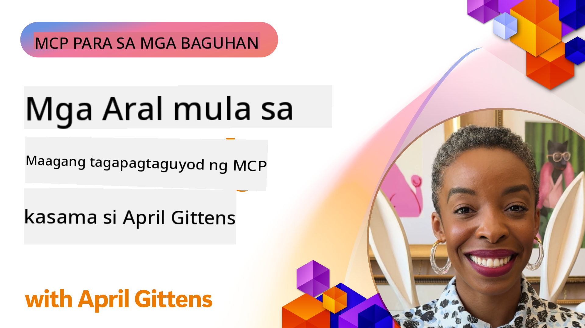

<!--
CO_OP_TRANSLATOR_METADATA:
{
  "original_hash": "41f16dac486d2086a53bc644a01cbe42",
  "translation_date": "2025-08-18T18:11:33+00:00",
  "source_file": "07-LessonsfromEarlyAdoption/README.md",
  "language_code": "tl"
}
-->
# 🌟 Mga Aral mula sa Maagang Gumagamit

[](https://youtu.be/jds7dSmNptE)

_(I-click ang larawan sa itaas upang panoorin ang video ng araling ito)_

## 🎯 Ano ang Saklaw ng Modulong Ito

Tinutuklas ng module na ito kung paano ginagamit ng mga tunay na organisasyon at developer ang Model Context Protocol (MCP) upang lutasin ang mga aktwal na hamon at magdala ng inobasyon. Sa pamamagitan ng detalyadong mga case study at praktikal na proyekto, matutuklasan mo kung paano nagbibigay ang MCP ng ligtas at scalable na AI integration na nag-uugnay sa mga language model, tool, at enterprise data.

### 📚 Tingnan ang MCP sa Aksyon

Gusto mo bang makita ang mga prinsipyong ito na inilalapat sa mga production-ready na tool? Bisitahin ang aming [**10 Microsoft MCP Servers na Nagpapabago sa Produktibidad ng mga Developer**](microsoft-mcp-servers.md), na nagpapakita ng mga tunay na Microsoft MCP server na maaari mong gamitin ngayon.

## Pangkalahatang-ideya

Tinutuklas ng araling ito kung paano ginamit ng mga maagang gumagamit ang Model Context Protocol (MCP) upang lutasin ang mga hamon sa totoong mundo at magdala ng inobasyon sa iba't ibang industriya. Sa pamamagitan ng detalyadong mga case study at praktikal na proyekto, makikita mo kung paano nagbibigay ang MCP ng standardized, secure, at scalable na AI integration—nag-uugnay sa malalaking language model, tool, at enterprise data sa isang pinag-isang balangkas. Makakakuha ka ng praktikal na karanasan sa pagdidisenyo at pagbuo ng mga solusyong nakabatay sa MCP, matututo mula sa mga napatunayang pattern ng implementasyon, at matutuklasan ang mga pinakamahusay na kasanayan para sa pag-deploy ng MCP sa mga production environment. Itinatampok din ng aralin ang mga umuusbong na trend, mga direksyon sa hinaharap, at mga open-source na mapagkukunan upang matulungan kang manatili sa unahan ng teknolohiya ng MCP at ng umuusbong nitong ecosystem.

## Mga Layunin sa Pagkatuto

- Suriin ang mga implementasyon ng MCP sa totoong mundo sa iba't ibang industriya  
- Magdisenyo at bumuo ng mga kumpletong aplikasyon na nakabatay sa MCP  
- Tuklasin ang mga umuusbong na trend at direksyon sa hinaharap sa teknolohiya ng MCP  
- Ilapat ang mga pinakamahusay na kasanayan sa aktwal na mga senaryo ng pag-develop  

## Mga Implementasyon ng MCP sa Totoong Mundo

### Case Study 1: Automation ng Enterprise Customer Support

Isang multinasyunal na korporasyon ang nagpatupad ng solusyong nakabatay sa MCP upang i-standardize ang mga AI interaction sa kanilang mga sistema ng customer support. Pinayagan sila nitong:

- Lumikha ng isang pinag-isang interface para sa maraming LLM provider  
- Panatilihin ang pare-parehong pamamahala ng prompt sa iba't ibang departamento  
- Magpatupad ng matibay na mga kontrol sa seguridad at pagsunod  
- Madaling magpalit sa pagitan ng iba't ibang AI model batay sa partikular na pangangailangan  

**Teknikal na Implementasyon:**

```python
# Python MCP server implementation for customer support
import logging
import asyncio
from modelcontextprotocol import create_server, ServerConfig
from modelcontextprotocol.server import MCPServer
from modelcontextprotocol.transports import create_http_transport
from modelcontextprotocol.resources import ResourceDefinition
from modelcontextprotocol.prompts import PromptDefinition
from modelcontextprotocol.tool import ToolDefinition

# Configure logging
logging.basicConfig(level=logging.INFO)

async def main():
    # Create server configuration
    config = ServerConfig(
        name="Enterprise Customer Support Server",
        version="1.0.0",
        description="MCP server for handling customer support inquiries"
    )
    
    # Initialize MCP server
    server = create_server(config)
    
    # Register knowledge base resources
    server.resources.register(
        ResourceDefinition(
            name="customer_kb",
            description="Customer knowledge base documentation"
        ),
        lambda params: get_customer_documentation(params)
    )
    
    # Register prompt templates
    server.prompts.register(
        PromptDefinition(
            name="support_template",
            description="Templates for customer support responses"
        ),
        lambda params: get_support_templates(params)
    )
    
    # Register support tools
    server.tools.register(
        ToolDefinition(
            name="ticketing",
            description="Create and update support tickets"
        ),
        handle_ticketing_operations
    )
    
    # Start server with HTTP transport
    transport = create_http_transport(port=8080)
    await server.run(transport)

if __name__ == "__main__":
    asyncio.run(main())
```

**Mga Resulta:** 30% na pagbawas sa gastos sa model, 45% na pagpapabuti sa pagkakapare-pareho ng tugon, at pinahusay na pagsunod sa pandaigdigang operasyon.

### Case Study 2: Healthcare Diagnostic Assistant

Isang healthcare provider ang bumuo ng MCP infrastructure upang pagsamahin ang maraming espesyalistang medical AI model habang tinitiyak na protektado ang sensitibong data ng pasyente:

- Walang putol na pagpapalit sa pagitan ng generalist at specialist na medical model  
- Mahigpit na mga kontrol sa privacy at audit trail  
- Integrasyon sa umiiral na mga sistema ng Electronic Health Record (EHR)  
- Pare-parehong prompt engineering para sa medical terminology  

**Teknikal na Implementasyon:**

```csharp
// C# MCP host application implementation in healthcare application
using Microsoft.Extensions.DependencyInjection;
using ModelContextProtocol.SDK.Client;
using ModelContextProtocol.SDK.Security;
using ModelContextProtocol.SDK.Resources;

public class DiagnosticAssistant
{
    private readonly MCPHostClient _mcpClient;
    private readonly PatientContext _patientContext;
    
    public DiagnosticAssistant(PatientContext patientContext)
    {
        _patientContext = patientContext;
        
        // Configure MCP client with healthcare-specific settings
        var clientOptions = new ClientOptions
        {
            Name = "Healthcare Diagnostic Assistant",
            Version = "1.0.0",
            Security = new SecurityOptions
            {
                Encryption = EncryptionLevel.Medical,
                AuditEnabled = true
            }
        };
        
        _mcpClient = new MCPHostClientBuilder()
            .WithOptions(clientOptions)
            .WithTransport(new HttpTransport("https://healthcare-mcp.example.org"))
            .WithAuthentication(new HIPAACompliantAuthProvider())
            .Build();
    }
    
    public async Task<DiagnosticSuggestion> GetDiagnosticAssistance(
        string symptoms, string patientHistory)
    {
        // Create request with appropriate resources and tool access
        var resourceRequest = new ResourceRequest
        {
            Name = "patient_records",
            Parameters = new Dictionary<string, object>
            {
                ["patientId"] = _patientContext.PatientId,
                ["requestingProvider"] = _patientContext.ProviderId
            }
        };
        
        // Request diagnostic assistance using appropriate prompt
        var response = await _mcpClient.SendPromptRequestAsync(
            promptName: "diagnostic_assistance",
            parameters: new Dictionary<string, object>
            {
                ["symptoms"] = symptoms,
                patientHistory = patientHistory,
                relevantGuidelines = _patientContext.GetRelevantGuidelines()
            });
            
        return DiagnosticSuggestion.FromMCPResponse(response);
    }
}
```

**Mga Resulta:** Pinahusay na mga diagnostic suggestion para sa mga doktor habang pinapanatili ang buong pagsunod sa HIPAA at makabuluhang pagbawas sa context-switching sa pagitan ng mga sistema.

### Case Study 3: Pagsusuri ng Panganib sa Serbisyong Pinansyal

Isang institusyong pinansyal ang nagpatupad ng MCP upang i-standardize ang kanilang mga proseso ng pagsusuri ng panganib sa iba't ibang departamento:

- Lumikha ng isang pinag-isang interface para sa mga model ng credit risk, fraud detection, at investment risk  
- Nagpatupad ng mahigpit na mga kontrol sa access at bersyon ng model  
- Tiniyak ang auditability ng lahat ng rekomendasyon ng AI  
- Pinanatili ang pare-parehong pag-format ng data sa magkakaibang sistema  

**Teknikal na Implementasyon:**

```java
// Java MCP server for financial risk assessment
import org.mcp.server.*;
import org.mcp.security.*;

public class FinancialRiskMCPServer {
    public static void main(String[] args) {
        // Create MCP server with financial compliance features
        MCPServer server = new MCPServerBuilder()
            .withModelProviders(
                new ModelProvider("risk-assessment-primary", new AzureOpenAIProvider()),
                new ModelProvider("risk-assessment-audit", new LocalLlamaProvider())
            )
            .withPromptTemplateDirectory("./compliance/templates")
            .withAccessControls(new SOCCompliantAccessControl())
            .withDataEncryption(EncryptionStandard.FINANCIAL_GRADE)
            .withVersionControl(true)
            .withAuditLogging(new DatabaseAuditLogger())
            .build();
            
        server.addRequestValidator(new FinancialDataValidator());
        server.addResponseFilter(new PII_RedactionFilter());
        
        server.start(9000);
        
        System.out.println("Financial Risk MCP Server running on port 9000");
    }
}
```

**Mga Resulta:** Pinahusay na pagsunod sa regulasyon, 40% na mas mabilis na deployment cycle ng model, at pinahusay na pagkakapare-pareho ng pagsusuri ng panganib sa mga departamento.

### Case Study 4: Microsoft Playwright MCP Server para sa Browser Automation

Ang Microsoft ay bumuo ng [Playwright MCP server](https://github.com/microsoft/playwright-mcp) upang paganahin ang ligtas, standardized na browser automation sa pamamagitan ng Model Context Protocol. Ang production-ready na server na ito ay nagbibigay-daan sa mga AI agent at LLM na makipag-ugnayan sa mga web browser sa isang kontrolado, auditable, at extensible na paraan—nagpapagana ng mga use case tulad ng automated web testing, data extraction, at end-to-end workflows.

> **🎯 Production Ready Tool**  
>  
> Ang case study na ito ay nagpapakita ng isang tunay na MCP server na maaari mong gamitin ngayon! Alamin ang higit pa tungkol sa Playwright MCP Server at 9 pang production-ready na Microsoft MCP server sa aming [**Microsoft MCP Servers Guide**](microsoft-mcp-servers.md#8--playwright-mcp-server).

**Pangunahing Tampok:**
- Nagbibigay ng browser automation capabilities (navigation, form filling, screenshot capture, atbp.) bilang MCP tools  
- Nagpapatupad ng mahigpit na mga kontrol sa access at sandboxing upang maiwasan ang hindi awtorisadong mga aksyon  
- Nagbibigay ng detalyadong audit logs para sa lahat ng browser interaction  
- Sinusuportahan ang integrasyon sa Azure OpenAI at iba pang LLM provider para sa agent-driven automation  
- Pinapagana ang web browsing capabilities ng GitHub Copilot's Coding Agent  

**Teknikal na Implementasyon:**

```typescript
// TypeScript: Registering Playwright browser automation tools in an MCP server
import { createServer, ToolDefinition } from 'modelcontextprotocol';
import { launch } from 'playwright';

const server = createServer({
  name: 'Playwright MCP Server',
  version: '1.0.0',
  description: 'MCP server for browser automation using Playwright'
});

// Register a tool for navigating to a URL and capturing a screenshot
server.tools.register(
  new ToolDefinition({
    name: 'navigate_and_screenshot',
    description: 'Navigate to a URL and capture a screenshot',
    parameters: {
      url: { type: 'string', description: 'The URL to visit' }
    }
  }),
  async ({ url }) => {
    const browser = await launch();
    const page = await browser.newPage();
    await page.goto(url);
    const screenshot = await page.screenshot();
    await browser.close();
    return { screenshot };
  }
);

// Start the MCP server
server.listen(8080);
```

**Mga Resulta:**

- Pinagana ang ligtas, programmatic na browser automation para sa mga AI agent at LLM  
- Nabawasan ang manu-manong pagsisikap sa testing at pinahusay ang test coverage para sa mga web application  
- Nagbigay ng reusable, extensible na framework para sa browser-based tool integration sa mga enterprise environment  
- Pinapagana ang web browsing capabilities ng GitHub Copilot  

**Mga Sanggunian:**

- [Playwright MCP Server GitHub Repository](https://github.com/microsoft/playwright-mcp)  
- [Microsoft AI and Automation Solutions](https://azure.microsoft.com/en-us/products/ai-services/)  

### Case Study 5: Azure MCP – Enterprise-Grade Model Context Protocol bilang Serbisyo

Ang Azure MCP Server ([https://aka.ms/azmcp](https://aka.ms/azmcp)) ay ang managed, enterprise-grade na implementasyon ng Model Context Protocol ng Microsoft, na idinisenyo upang magbigay ng scalable, secure, at compliant na MCP server capabilities bilang cloud service. Pinapadali ng Azure MCP ang mabilis na pag-deploy, pamamahala, at integrasyon ng mga MCP server sa Azure AI, data, at security services, na binabawasan ang operational overhead at pinapabilis ang AI adoption.

> **🎯 Production Ready Tool**  
>  
> Ito ay isang tunay na MCP server na maaari mong gamitin ngayon! Alamin ang higit pa tungkol sa Azure AI Foundry MCP Server sa aming [**Microsoft MCP Servers Guide**](microsoft-mcp-servers.md).  

- Fully managed MCP server hosting na may built-in scaling, monitoring, at security  
- Native integration sa Azure OpenAI, Azure AI Search, at iba pang Azure services  
- Enterprise authentication at authorization gamit ang Microsoft Entra ID  
- Suporta para sa custom tools, prompt templates, at resource connectors  
- Pagsunod sa enterprise security at regulatory requirements  

**Teknikal na Implementasyon:**

```yaml
# Example: Azure MCP server deployment configuration (YAML)
apiVersion: mcp.microsoft.com/v1
kind: McpServer
metadata:
  name: enterprise-mcp-server
spec:
  modelProviders:
    - name: azure-openai
      type: AzureOpenAI
      endpoint: https://<your-openai-resource>.openai.azure.com/
      apiKeySecret: <your-azure-keyvault-secret>
  tools:
    - name: document_search
      type: AzureAISearch
      endpoint: https://<your-search-resource>.search.windows.net/
      apiKeySecret: <your-azure-keyvault-secret>
  authentication:
    type: EntraID
    tenantId: <your-tenant-id>
  monitoring:
    enabled: true
    logAnalyticsWorkspace: <your-log-analytics-id>
```

**Mga Resulta:**  
- Nabawasan ang oras para sa halaga ng mga enterprise AI project sa pamamagitan ng pagbibigay ng ready-to-use, compliant MCP server platform  
- Pinadali ang integrasyon ng LLMs, tools, at enterprise data sources  
- Pinahusay ang seguridad, observability, at operational efficiency para sa mga MCP workload  
- Pinahusay ang kalidad ng code gamit ang Azure SDK best practices at kasalukuyang authentication patterns  

**Mga Sanggunian:**  
- [Azure MCP Documentation](https://aka.ms/azmcp)  
- [Azure MCP Server GitHub Repository](https://github.com/Azure/azure-mcp)  
- [Azure AI Services](https://azure.microsoft.com/en-us/products/ai-services/)  
- [Microsoft MCP Center](https://mcp.azure.com)  

### Case Study 6: NLWeb

Ang MCP (Model Context Protocol) ay isang umuusbong na protocol para sa mga Chatbot at AI assistant upang makipag-ugnayan sa mga tool. Ang bawat NLWeb instance ay isa ring MCP server, na sumusuporta sa isang pangunahing pamamaraan, ang ask, na ginagamit upang magtanong sa isang website gamit ang natural na wika. Ang ibinalik na sagot ay gumagamit ng schema.org, isang malawakang ginagamit na bokabularyo para sa paglalarawan ng web data. Sa madaling salita, ang MCP ay NLWeb kung paano ang Http ay sa HTML. Pinagsasama ng NLWeb ang mga protocol, Schema.org format, at sample code upang matulungan ang mga site na mabilis na lumikha ng mga endpoint na ito, na kapaki-pakinabang para sa parehong tao sa pamamagitan ng conversational interfaces at mga makina sa pamamagitan ng natural na agent-to-agent interaction.

Mayroong dalawang natatanging bahagi sa NLWeb:
- Isang protocol, napakasimple upang magsimula, upang makipag-ugnayan sa isang site gamit ang natural na wika at isang format, na gumagamit ng json at schema.org para sa ibinalik na sagot. Tingnan ang dokumentasyon sa REST API para sa higit pang detalye.  
- Isang tuwirang implementasyon ng (1) na gumagamit ng umiiral na markup, para sa mga site na maaaring i-abstrakto bilang mga listahan ng item (mga produkto, recipe, atraksyon, review, atbp.). Kasama ang isang hanay ng mga user interface widget, madaling makapagbigay ang mga site ng conversational interfaces sa kanilang nilalaman. Tingnan ang dokumentasyon sa Life of a chat query para sa higit pang detalye kung paano ito gumagana.  

**Mga Sanggunian:**  
- [Azure MCP Documentation](https://aka.ms/azmcp)  
- [NLWeb](https://github.com/microsoft/NlWeb)  

### Case Study 7: Azure AI Foundry MCP Server – Integrasyon ng Enterprise AI Agent

Ipinapakita ng Azure AI Foundry MCP servers kung paano magagamit ang MCP upang i-orchestrate at pamahalaan ang mga AI agent at workflow sa mga enterprise environment. Sa pamamagitan ng integrasyon ng MCP sa Azure AI Foundry, maaaring i-standardize ng mga organisasyon ang mga interaksyon ng agent, samantalahin ang workflow management ng Foundry, at tiyakin ang secure, scalable na mga deployment.

> **🎯 Production Ready Tool**  
>  
> Ito ay isang tunay na MCP server na maaari mong gamitin ngayon! Alamin ang higit pa tungkol sa Azure AI Foundry MCP Server sa aming [**Microsoft MCP Servers Guide**](microsoft-mcp-servers.md#9--azure-ai-foundry-mcp-server).  

**Pangunahing Tampok:**
- Komprehensibong access sa ecosystem ng Azure AI, kabilang ang mga model catalog at deployment management  
- Knowledge indexing gamit ang Azure AI Search para sa RAG applications  
- Mga tool sa pagsusuri para sa performance ng AI model at quality assurance  
- Integrasyon sa Azure AI Foundry Catalog at Labs para sa cutting-edge na research models  
- Mga kakayahan sa pamamahala at pagsusuri ng agent para sa production scenarios  

**Mga Resulta:**
- Mabilis na prototyping at matibay na monitoring ng AI agent workflows  
- Walang putol na integrasyon sa mga serbisyo ng Azure AI para sa advanced na mga senaryo  
- Pinag-isang interface para sa pagbuo, pag-deploy, at pag-monitor ng mga agent pipeline  
- Pinahusay na seguridad, pagsunod, at operational efficiency para sa mga enterprise  
- Pinabilis na AI adoption habang pinapanatili ang kontrol sa mga kumplikadong proseso na pinapatakbo ng agent  

**Mga Sanggunian:**  
- [Azure AI Foundry MCP Server GitHub Repository](https://github.com/azure-ai-foundry/mcp-foundry)  
- [Integrating Azure AI Agents with MCP (Microsoft Foundry Blog)](https://devblogs.microsoft.com/foundry/integrating-azure-ai-agents-mcp/)  

### Case Study 8: Foundry MCP Playground – Eksperimentasyon at Prototyping

Ang Foundry MCP Playground ay nag-aalok ng isang ready-to-use na kapaligiran para sa pag-eksperimento sa mga MCP server at integrasyon ng Azure AI Foundry. Maaaring mabilis na mag-prototype, mag-test, at mag-evaluate ng mga AI model at agent workflow ang mga developer gamit ang mga resource mula sa Azure AI Foundry Catalog at Labs. Pinapasimple ng playground ang setup, nagbibigay ng mga sample na proyekto, at sumusuporta sa collaborative development, na ginagawang madali ang pag-explore ng mga pinakamahusay na kasanayan at bagong senaryo nang may minimal na overhead. Lalo itong kapaki-pakinabang para sa mga team na naghahanap na i-validate ang mga ideya, magbahagi ng mga eksperimento, at pabilisin ang pagkatuto nang hindi nangangailangan ng kumplikadong imprastraktura. Sa pamamagitan ng pagpapababa ng hadlang sa pagpasok, nakakatulong ang playground na magtaguyod ng inobasyon at kontribusyon ng komunidad sa ecosystem ng MCP at Azure AI Foundry.

**Mga Sanggunian:**

- [Foundry MCP Playground GitHub Repository](https://github.com/azure-ai-foundry/foundry-mcp-playground)  

### Case Study 9: Microsoft Learn Docs MCP Server – AI-Powered Documentation Access

Ang Microsoft Learn Docs MCP Server ay isang cloud-hosted na serbisyo na nagbibigay sa mga AI assistant ng real-time na access sa opisyal na dokumentasyon ng Microsoft sa pamamagitan ng Model Context Protocol. Ang production-ready na server na ito ay kumokonekta sa komprehensibong Microsoft Learn ecosystem at nagbibigay-daan sa semantic search sa lahat ng opisyal na mapagkukunan ng Microsoft.
> **🎯 Handa na para sa Produksyon na Tool**
> 
> Ito ay isang tunay na MCP server na maaari mong gamitin ngayon! Alamin ang higit pa tungkol sa Microsoft Learn Docs MCP Server sa aming [**Microsoft MCP Servers Guide**](microsoft-mcp-servers.md#1--microsoft-learn-docs-mcp-server).
**Mga Pangunahing Tampok:**
- Real-time na access sa opisyal na dokumentasyon ng Microsoft, Azure docs, at Microsoft 365 documentation
- Advanced na semantic search na nauunawaan ang konteksto at layunin
- Palaging napapanahon ang impormasyon habang inilalathala ang Microsoft Learn content
- Malawak na saklaw sa Microsoft Learn, Azure documentation, at Microsoft 365 sources
- Nagbabalik ng hanggang 10 de-kalidad na content chunks na may mga pamagat ng artikulo at mga URL

**Bakit Ito Mahalaga:**
- Nilulutas ang problema ng "outdated AI knowledge" para sa mga teknolohiya ng Microsoft
- Tinitiyak na ang mga AI assistants ay may access sa pinakabagong .NET, C#, Azure, at Microsoft 365 features
- Nagbibigay ng awtoritatibo at first-party na impormasyon para sa tumpak na pagbuo ng code
- Mahalagang tool para sa mga developer na nagtatrabaho sa mabilis na umuunlad na teknolohiya ng Microsoft

**Mga Resulta:**
- Malaking pagtaas sa katumpakan ng AI-generated code para sa mga teknolohiya ng Microsoft
- Nabawasan ang oras sa paghahanap ng kasalukuyang dokumentasyon at pinakamahusay na mga kasanayan
- Pinahusay na produktibidad ng developer gamit ang context-aware na dokumentasyon
- Seamless na integrasyon sa mga development workflow nang hindi umaalis sa IDE

**Mga Sanggunian:**
- [Microsoft Learn Docs MCP Server GitHub Repository](https://github.com/MicrosoftDocs/mcp)
- [Microsoft Learn Documentation](https://learn.microsoft.com/)

## Mga Proyekto na Hands-on

### Proyekto 1: Gumawa ng Multi-Provider MCP Server

**Layunin:** Lumikha ng MCP server na maaaring mag-route ng mga request sa iba't ibang AI model providers batay sa partikular na pamantayan.

**Mga Kinakailangan:**

- Suportahan ang hindi bababa sa tatlong iba't ibang model providers (hal. OpenAI, Anthropic, local models)
- Magpatupad ng routing mechanism batay sa metadata ng request
- Gumawa ng configuration system para sa pamamahala ng provider credentials
- Magdagdag ng caching para sa pag-optimize ng performance at gastos
- Bumuo ng simpleng dashboard para sa pag-monitor ng paggamit

**Mga Hakbang sa Pagpapatupad:**

1. I-set up ang pangunahing imprastraktura ng MCP server
2. Magpatupad ng provider adapters para sa bawat AI model service
3. Gumawa ng routing logic batay sa mga attribute ng request
4. Magdagdag ng caching mechanisms para sa madalas na mga request
5. Bumuo ng monitoring dashboard
6. Subukan gamit ang iba't ibang pattern ng request

**Mga Teknolohiya:** Pumili mula sa Python (.NET/Java/Python batay sa iyong kagustuhan), Redis para sa caching, at isang simpleng web framework para sa dashboard.

### Proyekto 2: Enterprise Prompt Management System

**Layunin:** Bumuo ng MCP-based system para sa pamamahala, pag-version, at pag-deploy ng mga prompt template sa buong organisasyon.

**Mga Kinakailangan:**

- Gumawa ng centralized repository para sa mga prompt template
- Magpatupad ng versioning at approval workflows
- Bumuo ng template testing capabilities gamit ang sample inputs
- Mag-develop ng role-based access controls
- Gumawa ng API para sa template retrieval at deployment

**Mga Hakbang sa Pagpapatupad:**

1. Idisenyo ang database schema para sa template storage
2. Gumawa ng core API para sa template CRUD operations
3. Magpatupad ng versioning system
4. Bumuo ng approval workflow
5. Mag-develop ng testing framework
6. Gumawa ng simpleng web interface para sa pamamahala
7. Mag-integrate sa MCP server

**Mga Teknolohiya:** Ang iyong napiling backend framework, SQL o NoSQL database, at frontend framework para sa management interface.

### Proyekto 3: MCP-Based Content Generation Platform

**Layunin:** Bumuo ng content generation platform na gumagamit ng MCP para magbigay ng consistent na resulta sa iba't ibang uri ng content.

**Mga Kinakailangan:**

- Suportahan ang iba't ibang content formats (blog posts, social media, marketing copy)
- Magpatupad ng template-based generation na may customization options
- Gumawa ng content review at feedback system
- Subaybayan ang content performance metrics
- Suportahan ang content versioning at iteration

**Mga Hakbang sa Pagpapatupad:**

1. I-set up ang MCP client infrastructure
2. Gumawa ng mga template para sa iba't ibang uri ng content
3. Bumuo ng content generation pipeline
4. Magpatupad ng review system
5. Mag-develop ng metrics tracking system
6. Gumawa ng user interface para sa template management at content generation

**Mga Teknolohiya:** Ang iyong napiling programming language, web framework, at database system.

## Mga Direksyon sa Hinaharap para sa Teknolohiya ng MCP

### Mga Umuusbong na Trend

1. **Multi-Modal MCP**
   - Pagpapalawak ng MCP para sa standardisasyon ng interaksyon sa image, audio, at video models
   - Pag-develop ng cross-modal reasoning capabilities
   - Standardized prompt formats para sa iba't ibang modalities

2. **Federated MCP Infrastructure**
   - Distributed MCP networks na maaaring magbahagi ng resources sa iba't ibang organisasyon
   - Standardized protocols para sa secure model sharing
   - Privacy-preserving computation techniques

3. **MCP Marketplaces**
   - Ecosystems para sa pagbabahagi at monetization ng MCP templates at plugins
   - Quality assurance at certification processes
   - Integrasyon sa model marketplaces

4. **MCP para sa Edge Computing**
   - Adaptasyon ng MCP standards para sa resource-constrained edge devices
   - Optimized protocols para sa low-bandwidth environments
   - Specialized MCP implementations para sa IoT ecosystems

5. **Regulatory Frameworks**
   - Pag-develop ng MCP extensions para sa regulatory compliance
   - Standardized audit trails at explainability interfaces
   - Integrasyon sa umuusbong na AI governance frameworks

### Mga Solusyon ng MCP mula sa Microsoft

Ang Microsoft at Azure ay nag-develop ng ilang open-source repositories upang tulungan ang mga developer na magpatupad ng MCP sa iba't ibang sitwasyon:

#### Microsoft Organization

1. [playwright-mcp](https://github.com/microsoft/playwright-mcp) - Isang Playwright MCP server para sa browser automation at testing
2. [files-mcp-server](https://github.com/microsoft/files-mcp-server) - Isang OneDrive MCP server implementation para sa local testing at community contribution
3. [NLWeb](https://github.com/microsoft/NlWeb) - NLWeb ay isang koleksyon ng mga open protocols at kaugnay na open source tools. Ang pangunahing pokus nito ay ang pagtatatag ng foundational layer para sa AI Web

#### Azure-Samples Organization

1. [mcp](https://github.com/Azure-Samples/mcp) - Mga link sa samples, tools, at resources para sa pagbuo at integrasyon ng MCP servers sa Azure gamit ang iba't ibang wika
2. [mcp-auth-servers](https://github.com/Azure-Samples/mcp-auth-servers) - Reference MCP servers na nagpapakita ng authentication gamit ang kasalukuyang Model Context Protocol specification
3. [remote-mcp-functions](https://github.com/Azure-Samples/remote-mcp-functions) - Landing page para sa Remote MCP Server implementations sa Azure Functions na may mga link sa language-specific repos
4. [remote-mcp-functions-python](https://github.com/Azure-Samples/remote-mcp-functions-python) - Quickstart template para sa pagbuo at pag-deploy ng custom remote MCP servers gamit ang Azure Functions na may Python
5. [remote-mcp-functions-dotnet](https://github.com/Azure-Samples/remote-mcp-functions-dotnet) - Quickstart template para sa pagbuo at pag-deploy ng custom remote MCP servers gamit ang Azure Functions na may .NET/C#
6. [remote-mcp-functions-typescript](https://github.com/Azure-Samples/remote-mcp-functions-typescript) - Quickstart template para sa pagbuo at pag-deploy ng custom remote MCP servers gamit ang Azure Functions na may TypeScript
7. [remote-mcp-apim-functions-python](https://github.com/Azure-Samples/remote-mcp-apim-functions-python) - Azure API Management bilang AI Gateway sa Remote MCP servers gamit ang Python
8. [AI-Gateway](https://github.com/Azure-Samples/AI-Gateway) - APIM ❤️ AI experiments kabilang ang MCP capabilities, integrasyon sa Azure OpenAI at AI Foundry

Ang mga repositories na ito ay nagbibigay ng iba't ibang implementasyon, templates, at resources para sa pagtatrabaho gamit ang Model Context Protocol sa iba't ibang programming languages at Azure services. Saklaw nito ang iba't ibang use cases mula sa basic server implementations hanggang sa authentication, cloud deployment, at enterprise integration scenarios.

#### MCP Resources Directory

Ang [MCP Resources directory](https://github.com/microsoft/mcp/tree/main/Resources) sa opisyal na Microsoft MCP repository ay nagbibigay ng curated collection ng sample resources, prompt templates, at tool definitions para sa paggamit sa Model Context Protocol servers. Ang direktoryong ito ay idinisenyo upang tulungan ang mga developer na mabilis magsimula sa MCP sa pamamagitan ng pag-aalok ng reusable building blocks at best-practice examples para sa:

- **Prompt Templates:** Mga handa nang gamitin na prompt templates para sa karaniwang AI tasks at scenarios, na maaaring i-adapt para sa iyong sariling MCP server implementations.
- **Tool Definitions:** Mga halimbawa ng tool schemas at metadata para sa standardisasyon ng tool integration at invocation sa iba't ibang MCP servers.
- **Resource Samples:** Mga halimbawa ng resource definitions para sa pagkonekta sa data sources, APIs, at external services sa loob ng MCP framework.
- **Reference Implementations:** Praktikal na mga halimbawa na nagpapakita kung paano istrukturahin at ayusin ang mga resources, prompts, at tools sa mga real-world MCP projects.

Ang mga resources na ito ay nagpapabilis ng development, nagpo-promote ng standardisasyon, at tumutulong na matiyak ang pinakamahusay na mga kasanayan sa pagbuo at pag-deploy ng MCP-based solutions.

#### MCP Resources Directory

- [MCP Resources (Sample Prompts, Tools, and Resource Definitions)](https://github.com/microsoft/mcp/tree/main/Resources)

### Mga Oportunidad sa Pananaliksik

- Mga epektibong teknik sa prompt optimization sa loob ng MCP frameworks
- Mga modelo ng seguridad para sa multi-tenant MCP deployments
- Performance benchmarking sa iba't ibang MCP implementations
- Mga formal verification methods para sa MCP servers

## Konklusyon

Ang Model Context Protocol (MCP) ay mabilis na humuhubog sa hinaharap ng standardized, secure, at interoperable AI integration sa iba't ibang industriya. Sa pamamagitan ng mga case studies at hands-on projects sa araling ito, nakita mo kung paano ginagamit ng mga early adopters—kabilang ang Microsoft at Azure—ang MCP upang lutasin ang mga real-world na hamon, pabilisin ang AI adoption, at tiyakin ang compliance, seguridad, at scalability. Ang modular na approach ng MCP ay nagbibigay-daan sa mga organisasyon na ikonekta ang mga large language models, tools, at enterprise data sa isang unified, auditable framework. Habang patuloy na umuunlad ang MCP, ang pakikilahok sa komunidad, pag-explore ng open-source resources, at pag-aaplay ng pinakamahusay na mga kasanayan ay magiging susi sa pagbuo ng matatag at handa sa hinaharap na AI solutions.

## Karagdagang Resources

- [MCP Foundry GitHub Repository](https://github.com/azure-ai-foundry/mcp-foundry)
- [Foundry MCP Playground](https://github.com/azure-ai-foundry/foundry-mcp-playground)
- [Integrating Azure AI Agents with MCP (Microsoft Foundry Blog)](https://devblogs.microsoft.com/foundry/integrating-azure-ai-agents-mcp/)
- [MCP GitHub Repository (Microsoft)](https://github.com/microsoft/mcp)
- [MCP Resources Directory (Sample Prompts, Tools, and Resource Definitions)](https://github.com/microsoft/mcp/tree/main/Resources)
- [MCP Community & Documentation](https://modelcontextprotocol.io/introduction)
- [Azure MCP Documentation](https://aka.ms/azmcp)
- [Playwright MCP Server GitHub Repository](https://github.com/microsoft/playwright-mcp)
- [Files MCP Server (OneDrive)](https://github.com/microsoft/files-mcp-server)
- [Azure-Samples MCP](https://github.com/Azure-Samples/mcp)
- [MCP Auth Servers (Azure-Samples)](https://github.com/Azure-Samples/mcp-auth-servers)
- [Remote MCP Functions (Azure-Samples)](https://github.com/Azure-Samples/remote-mcp-functions)
- [Remote MCP Functions Python (Azure-Samples)](https://github.com/Azure-Samples/remote-mcp-functions-python)
- [Remote MCP Functions .NET (Azure-Samples)](https://github.com/Azure-Samples/remote-mcp-functions-dotnet)
- [Remote MCP Functions TypeScript (Azure-Samples)](https://github.com/Azure-Samples/remote-mcp-functions-typescript)
- [Remote MCP APIM Functions Python (Azure-Samples)](https://github.com/Azure-Samples/remote-mcp-apim-functions-python)
- [AI-Gateway (Azure-Samples)](https://github.com/Azure-Samples/AI-Gateway)
- [Microsoft AI and Automation Solutions](https://azure.microsoft.com/en-us/products/ai-services/)

## Mga Pagsasanay

1. Suriin ang isa sa mga case studies at magmungkahi ng alternatibong paraan ng implementasyon.
2. Pumili ng isa sa mga ideya ng proyekto at gumawa ng detalyadong teknikal na detalye.
3. Mag-research ng isang industriya na hindi saklaw ng mga case studies at balangkasin kung paano maaaring tugunan ng MCP ang mga partikular nitong hamon.
4. I-explore ang isa sa mga direksyon sa hinaharap at gumawa ng konsepto para sa bagong MCP extension upang suportahan ito.

Susunod: [Microsoft MCP Server](../07-LessonsfromEarlyAdoption/microsoft-mcp-servers.md)

**Paunawa**:  
Ang dokumentong ito ay isinalin gamit ang AI translation service na [Co-op Translator](https://github.com/Azure/co-op-translator). Bagama't sinisikap naming maging tumpak, pakitandaan na ang mga awtomatikong pagsasalin ay maaaring maglaman ng mga pagkakamali o hindi pagkakatugma. Ang orihinal na dokumento sa orihinal nitong wika ang dapat ituring na opisyal na sanggunian. Para sa mahalagang impormasyon, inirerekomenda ang propesyonal na pagsasalin ng tao. Hindi kami mananagot sa anumang hindi pagkakaunawaan o maling interpretasyon na maaaring magmula sa paggamit ng pagsasaling ito.