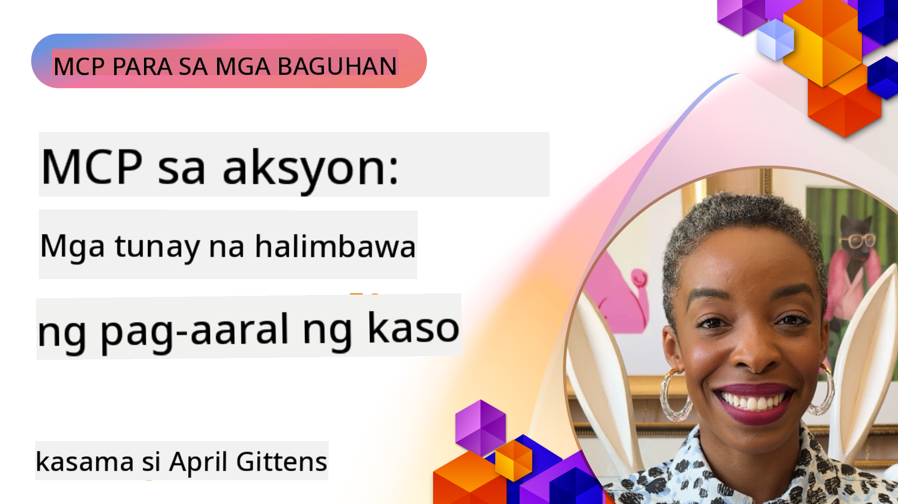

<!--
CO_OP_TRANSLATOR_METADATA:
{
  "original_hash": "1611dc5f6a2a35a789fc4c95fc5bfbe8",
  "translation_date": "2025-09-26T18:52:22+00:00",
  "source_file": "09-CaseStudy/README.md",
  "language_code": "tl"
}
-->
# MCP sa Aksyon: Mga Real-World Case Studies

_(I-click ang imahe sa itaas para mapanood ang video ng araling ito)_

Ang Model Context Protocol (MCP) ay binabago ang paraan ng pakikipag-ugnayan ng mga AI application sa data, tools, at serbisyo. Ang seksyong ito ay nagtatampok ng mga real-world case studies na nagpapakita ng praktikal na aplikasyon ng MCP sa iba't ibang enterprise scenarios.

## Pangkalahatang-ideya

Ang seksyong ito ay nagtatampok ng mga konkretong halimbawa ng mga implementasyon ng MCP, na nagpapakita kung paano ginagamit ng mga organisasyon ang protocol na ito upang malutas ang mga kumplikadong hamon sa negosyo. Sa pamamagitan ng pagsusuri sa mga case studies na ito, makakakuha ka ng mga pananaw sa versatility, scalability, at praktikal na benepisyo ng MCP sa mga real-world na sitwasyon.

## Mga Pangunahing Layunin sa Pagkatuto

Sa pag-aaral ng mga case studies na ito, ikaw ay:

- Mauunawaan kung paano maaaring gamitin ang MCP upang malutas ang mga partikular na problema sa negosyo
- Matututo tungkol sa iba't ibang pattern ng integrasyon at mga diskarte sa arkitektura
- Makikilala ang mga pinakamahusay na kasanayan sa pagpapatupad ng MCP sa mga enterprise environment
- Makakakuha ng mga pananaw sa mga hamon at solusyon na naranasan sa mga real-world na implementasyon
- Matutukoy ang mga oportunidad upang magamit ang mga katulad na pattern sa iyong sariling mga proyekto

## Mga Itinatampok na Case Studies

### 1. [Azure AI Travel Agents – Reference Implementation](./travelagentsample.md)

Ang case study na ito ay sinusuri ang komprehensibong reference solution ng Microsoft na nagpapakita kung paano bumuo ng isang multi-agent, AI-powered travel planning application gamit ang MCP, Azure OpenAI, at Azure AI Search. Ang proyekto ay nagtatampok ng:

- Multi-agent orchestration gamit ang MCP
- Enterprise data integration gamit ang Azure AI Search
- Secure, scalable architecture gamit ang Azure services
- Extensible tooling gamit ang reusable MCP components
- Conversational user experience na pinapagana ng Azure OpenAI

Ang mga detalye ng arkitektura at implementasyon ay nagbibigay ng mahahalagang pananaw sa pagbuo ng mga kumplikadong multi-agent system gamit ang MCP bilang coordination layer.

### 2. [Pag-update ng Azure DevOps Items mula sa YouTube Data](./UpdateADOItemsFromYT.md)

Ang case study na ito ay nagpapakita ng praktikal na aplikasyon ng MCP para sa pag-automate ng mga workflow process. Ipinapakita nito kung paano maaaring gamitin ang MCP tools upang:

- Mag-extract ng data mula sa mga online platform (YouTube)
- Mag-update ng work items sa Azure DevOps systems
- Lumikha ng mga repeatable automation workflows
- Mag-integrate ng data sa iba't ibang sistema

Ang halimbawang ito ay nagpapakita kung paano kahit ang mga simpleng implementasyon ng MCP ay maaaring magbigay ng makabuluhang pagtaas sa kahusayan sa pamamagitan ng pag-automate ng mga routine na gawain at pagpapabuti ng data consistency sa mga sistema.

### 3. [Real-Time Documentation Retrieval gamit ang MCP](./docs-mcp/README.md)

Ang case study na ito ay gumagabay sa iyo sa pagkonekta ng isang Python console client sa isang Model Context Protocol (MCP) server upang makuha at i-log ang real-time, context-aware na Microsoft documentation. Matutunan mo kung paano:

- Kumonekta sa isang MCP server gamit ang Python client at ang opisyal na MCP SDK
- Gumamit ng streaming HTTP clients para sa epektibo at real-time na pagkuha ng data
- Tumawag sa mga documentation tools sa server at i-log ang mga sagot direkta sa console
- Mag-integrate ng up-to-date na Microsoft documentation sa iyong workflow nang hindi umaalis sa terminal

Ang kabanata ay naglalaman ng hands-on assignment, isang minimal working code sample, at mga link sa karagdagang resources para sa mas malalim na pag-aaral. Tingnan ang buong walkthrough at code sa naka-link na kabanata upang maunawaan kung paano maaaring baguhin ng MCP ang access sa dokumentasyon at produktibidad ng developer sa mga console-based na environment.

### 4. [Interactive Study Plan Generator Web App gamit ang MCP](./docs-mcp/README.md)

Ang case study na ito ay nagpapakita kung paano bumuo ng isang interactive na web application gamit ang Chainlit at ang Model Context Protocol (MCP) upang makabuo ng personalized na study plans para sa anumang paksa. Maaaring tukuyin ng mga user ang isang subject (tulad ng "AI-900 certification") at isang study duration (hal., 8 linggo), at ang app ay magbibigay ng week-by-week na breakdown ng mga inirerekomendang content. Ang Chainlit ay nagbibigay ng conversational chat interface, na ginagawang engaging at adaptive ang karanasan.

- Conversational web app na pinapagana ng Chainlit
- Mga user-driven na prompt para sa paksa at tagal
- Week-by-week na rekomendasyon ng content gamit ang MCP
- Real-time, adaptive na mga sagot sa chat interface

Ang proyekto ay nagpapakita kung paano maaaring pagsamahin ang conversational AI at MCP upang lumikha ng dynamic, user-driven na mga educational tool sa isang modernong web environment.

### 5. [In-Editor Docs gamit ang MCP Server sa VS Code](./docs-mcp/README.md)

Ang case study na ito ay nagpapakita kung paano mo maaaring dalhin ang Microsoft Learn Docs direkta sa iyong VS Code environment gamit ang MCP server—hindi na kailangang magpalipat-lipat ng browser tabs! Makikita mo kung paano:

- Agad na maghanap at magbasa ng docs sa loob ng VS Code gamit ang MCP panel o command palette
- Mag-refer sa dokumentasyon at mag-insert ng mga link direkta sa iyong README o course markdown files
- Gumamit ng GitHub Copilot at MCP nang magkasama para sa seamless, AI-powered na dokumentasyon at code workflows
- Mag-validate at mag-enhance ng iyong dokumentasyon gamit ang real-time na feedback at Microsoft-sourced na katumpakan
- Mag-integrate ng MCP sa GitHub workflows para sa tuloy-tuloy na dokumentasyon validation

Ang implementasyon ay naglalaman ng:

- Halimbawa ng `.vscode/mcp.json` configuration para sa madaling setup
- Mga walkthrough na batay sa screenshot ng in-editor experience
- Mga tips para sa pagsasama ng Copilot at MCP para sa maximum na produktibidad

Ang senaryong ito ay perpekto para sa mga course authors, documentation writers, at developers na nais manatiling nakatuon sa kanilang editor habang nagtatrabaho gamit ang docs, Copilot, at validation tools—lahat ay pinapagana ng MCP.

### 6. [Paglikha ng APIM MCP Server](./apimsample.md)

Ang case study na ito ay nagbibigay ng step-by-step na gabay kung paano lumikha ng MCP server gamit ang Azure API Management (APIM). Sinasaklaw nito:

- Pag-set up ng MCP server sa Azure API Management
- Pag-expose ng API operations bilang MCP tools
- Pag-configure ng mga polisiya para sa rate limiting at seguridad
- Pagsubok sa MCP server gamit ang Visual Studio Code at GitHub Copilot

Ang halimbawang ito ay nagpapakita kung paano magagamit ang mga kakayahan ng Azure upang lumikha ng isang matatag na MCP server na maaaring gamitin sa iba't ibang aplikasyon, na nagpapahusay sa integrasyon ng mga AI system sa mga enterprise API.

### 7. [GitHub MCP Registry — Pagpapabilis ng Agentic Integration](https://github.com/mcp)

Ang case study na ito ay sinusuri kung paano tinutugunan ng GitHub's MCP Registry, na inilunsad noong Setyembre 2025, ang isang kritikal na hamon sa AI ecosystem: ang fragmented discovery at deployment ng Model Context Protocol (MCP) servers.

#### Pangkalahatang-ideya
Ang **MCP Registry** ay naglutas sa lumalaking problema ng scattered MCP servers sa iba't ibang repositories at registries, na dati ay nagpapabagal at nagiging error-prone ang integrasyon. Ang mga server na ito ay nagbibigay-daan sa mga AI agents na makipag-ugnayan sa mga external systems tulad ng APIs, databases, at documentation sources.

#### Problem Statement
Ang mga developer na bumubuo ng agentic workflows ay nahaharap sa ilang hamon:
- **Mahirap hanapin** ang MCP servers sa iba't ibang platform
- **Redundant na mga tanong sa setup** na nakakalat sa forums at dokumentasyon
- **Mga panganib sa seguridad** mula sa mga hindi verified at hindi trusted na sources
- **Kakulangan ng standardisasyon** sa kalidad at compatibility ng server

#### Solusyon sa Arkitektura
Ang GitHub's MCP Registry ay nag-centralize ng mga trusted MCP servers na may mga pangunahing tampok:
- **One-click install** integration sa pamamagitan ng VS Code para sa streamlined setup
- **Signal-over-noise sorting** batay sa stars, activity, at community validation
- **Direktang integrasyon** sa GitHub Copilot at iba pang MCP-compatible tools
- **Open contribution model** na nagbibigay-daan sa parehong community at enterprise partners na mag-ambag

#### Epekto sa Negosyo
Ang registry ay naghatid ng nasusukat na mga pagpapabuti:
- **Mas mabilis na onboarding** para sa mga developer gamit ang tools tulad ng Microsoft Learn MCP Server, na nag-stream ng opisyal na dokumentasyon direkta sa agents
- **Pinahusay na produktibidad** sa pamamagitan ng mga specialized servers tulad ng `github-mcp-server`, na nagbibigay-daan sa natural language GitHub automation (PR creation, CI reruns, code scanning)
- **Mas matibay na tiwala sa ecosystem** sa pamamagitan ng curated listings at transparent configuration standards

#### Strategic Value
Para sa mga practitioner na nag-specialize sa agent lifecycle management at reproducible workflows, ang MCP Registry ay nagbibigay ng:
- **Modular agent deployment** capabilities gamit ang standardized components
- **Registry-backed evaluation pipelines** para sa consistent testing at validation
- **Cross-tool interoperability** na nagbibigay-daan sa seamless integration sa iba't ibang AI platforms

Ang case study na ito ay nagpapakita na ang MCP Registry ay higit pa sa isang direktoryo—ito ay isang foundational platform para sa scalable, real-world model integration at agentic system deployment.

## Konklusyon

Ang pitong komprehensibong case studies na ito ay nagpapakita ng kahanga-hangang versatility at praktikal na aplikasyon ng Model Context Protocol sa iba't ibang real-world na sitwasyon. Mula sa mga kumplikadong multi-agent travel planning systems at enterprise API management hanggang sa streamlined documentation workflows at ang rebolusyonaryong GitHub MCP Registry, ang mga halimbawang ito ay nagpapakita kung paano nagbibigay ang MCP ng standardized, scalable na paraan upang ikonekta ang mga AI system sa mga tools, data, at serbisyo na kailangan nila upang maghatid ng exceptional na halaga.

Ang mga case studies ay sumasaklaw sa maraming dimensyon ng implementasyon ng MCP:
- **Enterprise Integration**: Azure API Management at Azure DevOps automation
- **Multi-Agent Orchestration**: Travel planning gamit ang coordinated AI agents
- **Developer Productivity**: VS Code integration at real-time na access sa dokumentasyon
- **Ecosystem Development**: GitHub's MCP Registry bilang foundational platform
- **Educational Applications**: Interactive study plan generators at conversational interfaces

Sa pag-aaral ng mga implementasyon na ito, makakakuha ka ng mahahalagang pananaw sa:
- **Mga pattern ng arkitektura** para sa iba't ibang scale at use cases
- **Mga diskarte sa implementasyon** na nagbabalanse ng functionality at maintainability
- **Mga konsiderasyon sa seguridad at scalability** para sa production deployments
- **Mga pinakamahusay na kasanayan** para sa pagbuo ng MCP server at client integration
- **Ecosystem thinking** para sa pagbuo ng interconnected AI-powered solutions

Ang mga halimbawang ito ay sama-samang nagpapakita na ang MCP ay hindi lamang isang teoretikal na framework kundi isang mature, production-ready protocol na nagbibigay-daan sa praktikal na solusyon sa mga kumplikadong hamon sa negosyo. Kung ikaw ay bumubuo ng simpleng automation tools o sopistikadong multi-agent systems, ang mga pattern at diskarte na inilalarawan dito ay nagbibigay ng solidong pundasyon para sa iyong sariling mga MCP na proyekto.

## Karagdagang Resources

- [Azure AI Travel Agents GitHub Repository](https://github.com/Azure-Samples/azure-ai-travel-agents)
- [Azure DevOps MCP Tool](https://github.com/microsoft/azure-devops-mcp)
- [Playwright MCP Tool](https://github.com/microsoft/playwright-mcp)
- [Microsoft Docs MCP Server](https://github.com/MicrosoftDocs/mcp)
- [GitHub MCP Registry — Pagpapabilis ng Agentic Integration](https://github.com/mcp)
- [MCP Community Examples](https://github.com/microsoft/mcp)

Next: Hands on Lab [Pag-streamline ng AI Workflows: Pagbuo ng MCP Server gamit ang AI Toolkit](../10-StreamliningAIWorkflowsBuildingAnMCPServerWithAIToolkit/README.md)

---

