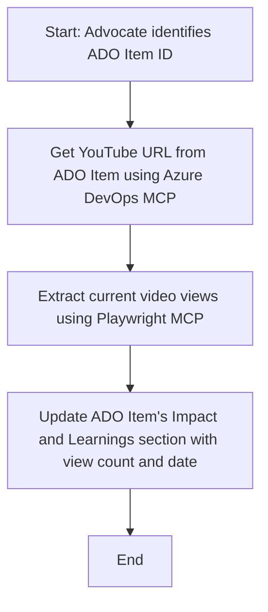

<!--
CO_OP_TRANSLATOR_METADATA:
{
  "original_hash": "14a2dfbea55ef735660a06bd6bdfe5f3",
  "translation_date": "2025-06-13T21:37:34+00:00",
  "source_file": "09-CaseStudy/UpdateADOItemsFromYT.md",
  "language_code": "tl"
}
-->
# Case Study: Pag-update ng Azure DevOps Items mula sa YouTube Data gamit ang MCP

> **Disclaimer:** May mga umiiral nang online tools at ulat na kayang i-automate ang proseso ng pag-update ng Azure DevOps items gamit ang data mula sa mga platform tulad ng YouTube. Ang sumusunod na senaryo ay ibinigay bilang halimbawa lang para ipakita kung paano magagamit ang MCP tools para sa automation at integration tasks.

## Pangkalahatang Pagsusuri

Ipinapakita sa case study na ito ang isang halimbawa kung paano magagamit ang Model Context Protocol (MCP) at ang mga tools nito upang i-automate ang proseso ng pag-update ng Azure DevOps (ADO) work items gamit ang impormasyon mula sa mga online platform gaya ng YouTube. Ang inilalarawan na senaryo ay isa lamang halimbawa ng mas malawak na kakayahan ng mga tools na ito, na maaaring iangkop sa iba pang katulad na pangangailangan sa automation.

Sa halimbawang ito, sinusubaybayan ng isang Advocate ang mga online session gamit ang ADO items, kung saan bawat item ay may kasamang YouTube video URL. Sa pamamagitan ng paggamit ng MCP tools, maaaring panatilihing updated ng Advocate ang ADO items sa pinakabagong video metrics, tulad ng bilang ng views, sa isang paulit-ulit at automated na paraan. Ang pamamaraang ito ay maaaring i-generalize sa iba pang mga kaso kung saan kailangang isama ang impormasyon mula sa online sources sa ADO o iba pang mga sistema.

## Senaryo

Ang isang Advocate ay responsable sa pagsubaybay ng epekto ng mga online session at community engagements. Bawat session ay naitatala bilang isang ADO work item sa proyektong 'DevRel', at ang work item ay may field para sa YouTube video URL. Upang maipakita nang tama ang abot ng session, kailangang i-update ng Advocate ang ADO item gamit ang kasalukuyang bilang ng video views at ang petsa kung kailan nakuha ang impormasyong ito.

## Mga Ginamit na Tools

- [Azure DevOps MCP](https://github.com/microsoft/azure-devops-mcp): Nagbibigay-daan sa programmatic access at pag-update ng ADO work items gamit ang MCP.
- [Playwright MCP](https://github.com/microsoft/playwright-mcp): Ina-automate ang browser actions para makuha ang live data mula sa mga web page, tulad ng YouTube video statistics.

## Hakbang-hakbang na Workflow

1. **Tukuyin ang ADO Item**: Simulan sa ADO work item ID (hal., 1234) sa proyektong 'DevRel'.
2. **Kunin ang YouTube URL**: Gamitin ang Azure DevOps MCP tool para makuha ang YouTube URL mula sa work item.
3. **Kunin ang Bilang ng Views**: Gamitin ang Playwright MCP tool para pumunta sa YouTube URL at kunin ang kasalukuyang bilang ng views.
4. **I-update ang ADO Item**: Isulat ang pinakabagong bilang ng views at ang petsa ng pagkuha nito sa seksyong 'Impact and Learnings' ng ADO work item gamit ang Azure DevOps MCP tool.

## Halimbawa ng Prompt

```bash
- Work with the ADO Item ID: 1234
- The project is '2025-Awesome'
- Get the YouTube URL for the ADO item
- Use Playwright to get the current views from the YouTube video
- Update the ADO item with the current video views and the updated date of the information
```

## Mermaid Flowchart



## Teknikal na Implementasyon

- **MCP Orchestration**: Pinamamahalaan ang workflow ng isang MCP server, na nag-uugnay sa paggamit ng parehong Azure DevOps MCP at Playwright MCP tools.
- **Automation**: Maaaring patakbuhin ang proseso nang manu-mano o i-schedule para tumakbo nang regular upang panatilihing updated ang mga ADO items.
- **Extensibility**: Maaaring palawakin ang parehong pattern upang i-update ang ADO items gamit ang iba pang online metrics (hal., likes, comments) o mula sa ibang platform.

## Resulta at Epekto

- **Kahusayan**: Nababawasan ang manu-manong trabaho ng mga Advocate sa pamamagitan ng pag-automate ng pagkuha at pag-update ng video metrics.
- **Katumpakan**: Tinitiyak na ang mga ADO items ay naglalaman ng pinakabagong datos mula sa mga online sources.
- **Pag-uulit**: Nagbibigay ng reusable na workflow para sa mga katulad na senaryo na may iba pang data sources o metrics.

## Mga Sanggunian

- [Azure DevOps MCP](https://github.com/microsoft/azure-devops-mcp)
- [Playwright MCP](https://github.com/microsoft/playwright-mcp)
- [Model Context Protocol (MCP)](https://modelcontextprotocol.io/)

**Paalala**:  
Ang dokumentong ito ay isinalin gamit ang AI translation service na [Co-op Translator](https://github.com/Azure/co-op-translator). Bagamat nagsusumikap kami para sa katumpakan, pakatandaan na ang awtomatikong pagsasalin ay maaaring maglaman ng mga pagkakamali o di-tumpak na impormasyon. Ang orihinal na dokumento sa kanyang orihinal na wika ang dapat ituring na pangunahing sanggunian. Para sa mahahalagang impormasyon, inirerekomenda ang propesyonal na pagsasalin ng tao. Hindi kami mananagot sa anumang hindi pagkakaunawaan o maling interpretasyon na maaaring magmula sa paggamit ng pagsasaling ito.