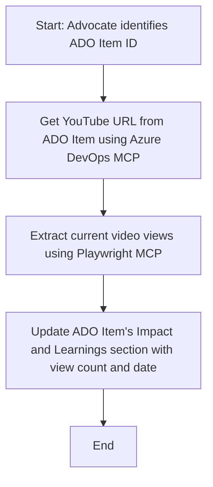

<!--
CO_OP_TRANSLATOR_METADATA:
{
  "original_hash": "14a2dfbea55ef735660a06bd6bdfe5f3",
  "translation_date": "2025-07-14T06:14:28+00:00",
  "source_file": "09-CaseStudy/UpdateADOItemsFromYT.md",
  "language_code": "tl"
}
-->
# Case Study: Pag-update ng Azure DevOps Items mula sa YouTube Data gamit ang MCP

> **Disclaimer:** May mga umiiral nang online tools at ulat na maaaring mag-automate ng proseso ng pag-update ng Azure DevOps items gamit ang data mula sa mga platform tulad ng YouTube. Ang sumusunod na senaryo ay ibinigay bilang halimbawa lamang upang ipakita kung paano maaaring gamitin ang MCP tools para sa automation at integration na mga gawain.

## Pangkalahatang-ideya

Ipinapakita ng case study na ito ang isang halimbawa kung paano maaaring gamitin ang Model Context Protocol (MCP) at ang mga tools nito upang i-automate ang proseso ng pag-update ng Azure DevOps (ADO) work items gamit ang impormasyon mula sa mga online platform, tulad ng YouTube. Ang inilalarawan na senaryo ay isa lamang halimbawa ng mas malawak na kakayahan ng mga tools na ito, na maaaring iangkop sa maraming katulad na pangangailangan sa automation.

Sa halimbawang ito, isang Advocate ang nagta-track ng mga online session gamit ang mga ADO item, kung saan bawat item ay may kasamang YouTube video URL. Sa pamamagitan ng paggamit ng MCP tools, maaaring panatilihing updated ng Advocate ang mga ADO item gamit ang pinakabagong video metrics, tulad ng bilang ng mga view, sa isang paulit-ulit at automated na paraan. Ang pamamaraang ito ay maaaring i-generalize sa iba pang mga kaso kung saan kailangang isama ang impormasyon mula sa mga online na pinagmulan sa ADO o iba pang mga sistema.

## Senaryo

Isang Advocate ang responsable sa pag-track ng epekto ng mga online session at community engagements. Bawat session ay nilalagay bilang isang ADO work item sa proyektong 'DevRel', at ang work item ay may field para sa YouTube video URL. Upang maipakita nang tama ang abot ng session, kailangang i-update ng Advocate ang ADO item gamit ang kasalukuyang bilang ng mga view ng video at ang petsa kung kailan nakuha ang impormasyong ito.

## Mga Ginamit na Tools

- [Azure DevOps MCP](https://github.com/microsoft/azure-devops-mcp): Nagbibigay-daan sa programmatic na pag-access at pag-update ng mga ADO work item gamit ang MCP.
- [Playwright MCP](https://github.com/microsoft/playwright-mcp): Nag-a-automate ng mga browser action upang makuha ang live na data mula sa mga web page, tulad ng mga istatistika ng YouTube video.

## Hakbang-hakbang na Workflow

1. **Tukuyin ang ADO Item**: Simulan sa ADO work item ID (hal., 1234) sa proyektong 'DevRel'.
2. **Kunin ang YouTube URL**: Gamitin ang Azure DevOps MCP tool upang makuha ang YouTube URL mula sa work item.
3. **Kunin ang Bilang ng View ng Video**: Gamitin ang Playwright MCP tool upang pumunta sa YouTube URL at kunin ang kasalukuyang bilang ng mga view.
4. **I-update ang ADO Item**: Isulat ang pinakabagong bilang ng view at ang petsa ng pagkuha nito sa seksyong 'Impact and Learnings' ng ADO work item gamit ang Azure DevOps MCP tool.

## Halimbawa ng Prompt

```bash
- Work with the ADO Item ID: 1234
- The project is '2025-Awesome'
- Get the YouTube URL for the ADO item
- Use Playwright to get the current views from the YouTube video
- Update the ADO item with the current video views and the updated date of the information
```

## Mermaid Flowchart



## Teknikal na Implementasyon

- **MCP Orchestration**: Ang workflow ay pinamamahalaan ng isang MCP server, na nagko-coordinate sa paggamit ng parehong Azure DevOps MCP at Playwright MCP tools.
- **Automation**: Maaaring i-trigger ang proseso nang manu-mano o i-schedule upang tumakbo sa regular na mga pagitan upang mapanatiling updated ang mga ADO item.
- **Extensibility**: Ang parehong pattern ay maaaring palawakin upang i-update ang mga ADO item gamit ang iba pang online metrics (hal., likes, comments) o mula sa ibang mga platform.

## Resulta at Epekto

- **Kahusayan**: Nababawasan ang manu-manong trabaho ng mga Advocate sa pamamagitan ng pag-automate ng pagkuha at pag-update ng video metrics.
- **Katumpakan**: Tinitiyak na ang mga ADO item ay nagpapakita ng pinakabagong data mula sa mga online na pinagmulan.
- **Paulit-ulit na Paggamit**: Nagbibigay ng reusable na workflow para sa mga katulad na senaryo na may iba pang mga pinagmulan ng data o metrics.

## Mga Sanggunian

- [Azure DevOps MCP](https://github.com/microsoft/azure-devops-mcp)
- [Playwright MCP](https://github.com/microsoft/playwright-mcp)
- [Model Context Protocol (MCP)](https://modelcontextprotocol.io/)

**Paalala**:  
Ang dokumentong ito ay isinalin gamit ang AI translation service na [Co-op Translator](https://github.com/Azure/co-op-translator). Bagamat nagsusumikap kami para sa katumpakan, pakatandaan na ang mga awtomatikong pagsasalin ay maaaring maglaman ng mga pagkakamali o di-tumpak na impormasyon. Ang orihinal na dokumento sa orihinal nitong wika ang dapat ituring na pangunahing sanggunian. Para sa mahahalagang impormasyon, inirerekomenda ang propesyonal na pagsasalin ng tao. Hindi kami mananagot sa anumang hindi pagkakaunawaan o maling interpretasyon na maaaring magmula sa paggamit ng pagsasaling ito.