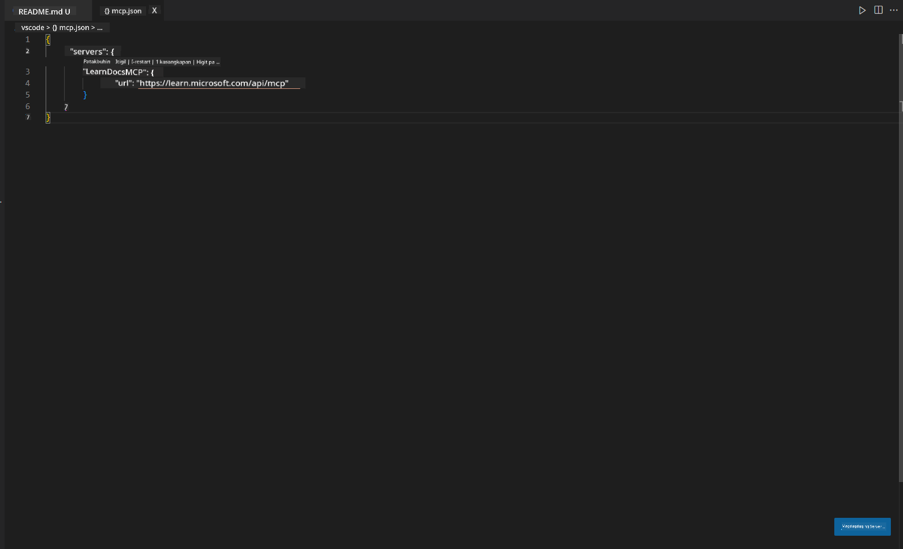
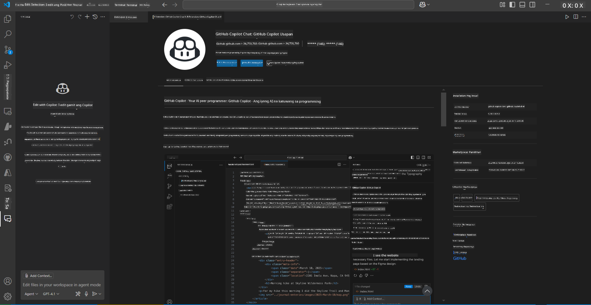
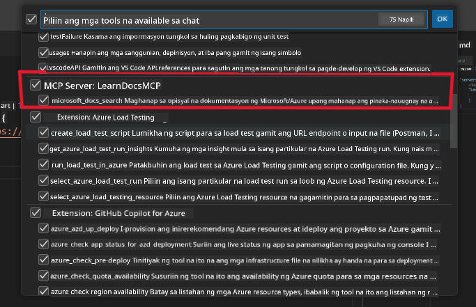
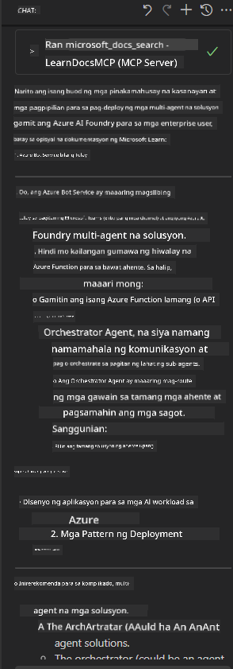

<!--
CO_OP_TRANSLATOR_METADATA:
{
  "original_hash": "db532b1ec386c9ce38c791653dc3c881",
  "translation_date": "2025-07-14T06:54:28+00:00",
  "source_file": "09-CaseStudy/docs-mcp/solution/scenario3/README.md",
  "language_code": "tl"
}
-->
# Scenario 3: Mga Dokumento sa Editor gamit ang MCP Server sa VS Code

## Pangkalahatang-ideya

Sa senaryong ito, matututuhan mo kung paano dalhin ang Microsoft Learn Docs nang direkta sa iyong Visual Studio Code gamit ang MCP server. Sa halip na palaging magpalipat-lipat ng mga tab sa browser para maghanap ng dokumentasyon, maaari mong ma-access, hanapin, at gamitin ang opisyal na mga dokumento mismo sa loob ng iyong editor. Pinapadali nito ang iyong workflow, pinananatili kang nakatuon, at nagbibigay-daan sa tuloy-tuloy na integrasyon sa mga tool tulad ng GitHub Copilot.

- Maghanap at magbasa ng mga dokumento sa loob ng VS Code nang hindi umaalis sa iyong coding environment.
- Mag-refer ng dokumentasyon at maglagay ng mga link nang direkta sa iyong README o mga file ng kurso.
- Gamitin ang GitHub Copilot at MCP nang sabay para sa isang tuloy-tuloy at AI-powered na workflow sa dokumentasyon.

## Mga Layunin sa Pagkatuto

Sa pagtatapos ng kabanatang ito, mauunawaan mo kung paano i-setup at gamitin ang MCP server sa loob ng VS Code upang mapabuti ang iyong workflow sa dokumentasyon at pag-develop. Magagawa mong:

- I-configure ang iyong workspace para gamitin ang MCP server sa paghahanap ng dokumentasyon.
- Maghanap at maglagay ng dokumentasyon nang direkta mula sa loob ng VS Code.
- Pagsamahin ang kapangyarihan ng GitHub Copilot at MCP para sa mas produktibong workflow na may tulong ng AI.

Makakatulong ang mga kasanayang ito upang manatili kang nakatuon, mapabuti ang kalidad ng dokumentasyon, at mapataas ang iyong produktibidad bilang developer o technical writer.

## Solusyon

Para makamit ang access sa dokumentasyon sa loob ng editor, susundan mo ang mga hakbang na nag-iintegrate ng MCP server sa VS Code at GitHub Copilot. Ang solusyong ito ay perpekto para sa mga may-akda ng kurso, manunulat ng dokumentasyon, at mga developer na nais manatiling nakatuon sa editor habang nagtatrabaho gamit ang mga docs at Copilot.

- Mabilis na magdagdag ng mga reference link sa README habang nagsusulat ng kurso o dokumentasyon ng proyekto.
- Gamitin ang Copilot para gumawa ng code at MCP para agad na maghanap at mag-cite ng mga kaugnay na dokumento.
- Manatiling nakatuon sa iyong editor at pataasin ang produktibidad.

### Gabay Hakbang-hakbang

Para makapagsimula, sundin ang mga hakbang na ito. Sa bawat hakbang, maaari kang magdagdag ng screenshot mula sa assets folder para ipakita nang malinaw ang proseso.

1. **Idagdag ang MCP configuration:**
   Sa root ng iyong proyekto, gumawa ng `.vscode/mcp.json` na file at ilagay ang sumusunod na configuration:
   ```json
   {
     "servers": {
       "LearnDocsMCP": {
         "url": "https://learn.microsoft.com/api/mcp"
       }
     }
   }
   ```
   Sinasabi ng configuration na ito sa VS Code kung paano kumonekta sa [`Microsoft Learn Docs MCP server`](https://github.com/MicrosoftDocs/mcp).
   
   
    
2. **Buksan ang GitHub Copilot Chat panel:**
   Kung wala ka pang naka-install na GitHub Copilot extension, pumunta sa Extensions view sa VS Code at i-install ito. Maaari mo itong i-download nang direkta mula sa [Visual Studio Code Marketplace](https://marketplace.visualstudio.com/items?itemName=GitHub.copilot-chat). Pagkatapos, buksan ang Copilot Chat panel mula sa sidebar.

   

3. **I-enable ang agent mode at i-verify ang mga tool:**
   Sa Copilot Chat panel, i-enable ang agent mode.

   

   Pagkatapos i-enable ang agent mode, tiyaking nakalista ang MCP server bilang isa sa mga available na tool. Tinitiyak nito na makaka-access ang Copilot agent sa documentation server para kunin ang mga kaugnay na impormasyon.
   
   
4. **Magsimula ng bagong chat at i-prompt ang agent:**
   Magbukas ng bagong chat sa Copilot Chat panel. Maaari mo nang i-prompt ang agent gamit ang iyong mga tanong tungkol sa dokumentasyon. Gagamitin ng agent ang MCP server para kunin at ipakita ang kaugnay na Microsoft Learn documentation nang direkta sa iyong editor.

   - *"Nagsusulat ako ng study plan para sa topic X. Babasahin ko ito sa loob ng 8 linggo, para sa bawat linggo, magmungkahi ng mga content na dapat kong pag-aralan."*

   

5. **Live Query:**

   > Kumuha tayo ng live query mula sa [#get-help](https://discord.gg/D6cRhjHWSC) section sa Azure AI Foundry Discord ([tingnan ang orihinal na mensahe](https://discord.com/channels/1113626258182504448/1385498306720829572)):
   
   *"Naghahanap ako ng sagot kung paano mag-deploy ng multi-agent solution gamit ang AI agents na ginawa sa Azure AI Foundry. Napansin ko na walang direktang deployment method, tulad ng Copilot Studio channels. Ano-ano ang iba't ibang paraan para gawin ang deployment na ito para sa mga enterprise users upang makipag-interact at matapos ang trabaho?
Maraming artikulo/blogs ang nagsasabing pwede gamitin ang Azure Bot service para dito na maaaring magsilbing tulay sa pagitan ng MS Teams at Azure AI Foundry Agents, pero gagana ba ito kung magse-setup ako ng Azure bot na kumokonekta sa Orchestrator Agent sa Azure AI Foundry gamit ang Azure function para gawin ang orchestration, o kailangan ko bang gumawa ng Azure function para sa bawat AI agent na bahagi ng multi-agent solution para gawin ang orchestration sa Bot framework? Bukas ako sa iba pang mga suhestiyon."*

   

   Sasagutin ng agent ang mga tanong gamit ang mga kaugnay na link at buod ng dokumentasyon, na maaari mong direktang ilagay sa iyong mga markdown file o gamitin bilang reference sa iyong code.
   
### Mga Halimbawang Query

Narito ang ilang halimbawa ng mga query na maaari mong subukan. Ipapakita ng mga ito kung paano nagtutulungan ang MCP server at Copilot upang magbigay ng instant at kontekstuwal na dokumentasyon at mga reference nang hindi umaalis sa VS Code:

- "Ipakita kung paano gamitin ang Azure Functions triggers."
- "Maglagay ng link sa opisyal na dokumentasyon para sa Azure Key Vault."
- "Ano ang mga best practices para sa pag-secure ng Azure resources?"
- "Maghanap ng quickstart para sa Azure AI services."

Ipinapakita ng mga query na ito kung paano nagtutulungan ang MCP server at Copilot upang magbigay ng instant at kontekstuwal na dokumentasyon at mga reference nang hindi umaalis sa VS Code.

---

**Paalala**:  
Ang dokumentong ito ay isinalin gamit ang AI translation service na [Co-op Translator](https://github.com/Azure/co-op-translator). Bagamat nagsusumikap kami para sa katumpakan, pakatandaan na ang mga awtomatikong pagsasalin ay maaaring maglaman ng mga pagkakamali o di-tumpak na impormasyon. Ang orihinal na dokumento sa kanyang sariling wika ang dapat ituring na pangunahing sanggunian. Para sa mahahalagang impormasyon, inirerekomenda ang propesyonal na pagsasalin ng tao. Hindi kami mananagot sa anumang hindi pagkakaunawaan o maling interpretasyon na maaaring magmula sa paggamit ng pagsasaling ito.