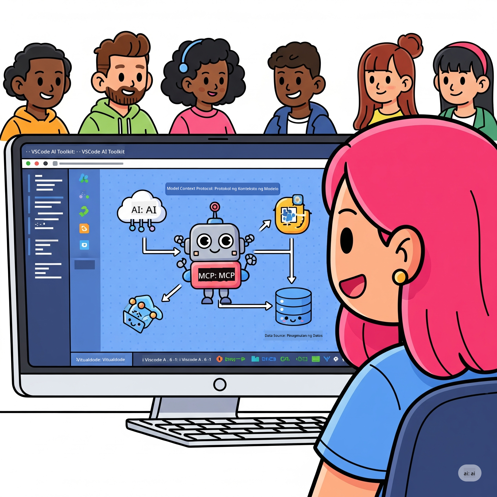
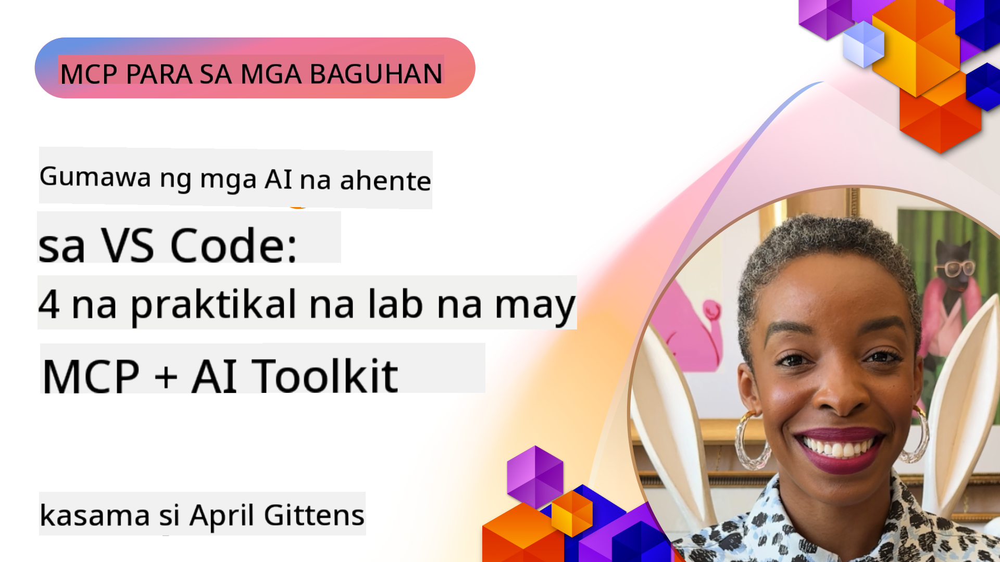

<!--
CO_OP_TRANSLATOR_METADATA:
{
  "original_hash": "1b000fd6e1b04c047578bfc5d07d54eb",
  "translation_date": "2025-08-18T18:31:39+00:00",
  "source_file": "10-StreamliningAIWorkflowsBuildingAnMCPServerWithAIToolkit/README.md",
  "language_code": "tl"
}
-->
# Pagpapadali ng AI Workflows: Pagbuo ng MCP Server gamit ang AI Toolkit

## 🎯 Pangkalahatang-ideya

_(I-click ang imahe sa itaas para mapanood ang video ng araling ito)_

Maligayang pagdating sa **Model Context Protocol (MCP) Workshop**! Ang komprehensibong hands-on workshop na ito ay pinagsasama ang dalawang makabagong teknolohiya upang baguhin ang pagbuo ng AI applications:

- **🔗 Model Context Protocol (MCP)**: Isang bukas na pamantayan para sa seamless na integrasyon ng AI tools
- **🛠️ AI Toolkit para sa Visual Studio Code (AITK)**: Ang makapangyarihang AI development extension ng Microsoft

### 🎓 Ano ang Matututunan Mo

Sa pagtatapos ng workshop na ito, magiging bihasa ka sa paggawa ng matatalinong aplikasyon na nag-uugnay sa mga AI model sa mga tunay na tool at serbisyo. Mula sa automated testing hanggang sa custom API integrations, makakakuha ka ng praktikal na kasanayan upang malutas ang mga kumplikadong hamon sa negosyo.

## 🏗️ Teknolohiyang Gamit

### 🔌 Model Context Protocol (MCP)

Ang MCP ay ang **"USB-C para sa AI"** - isang unibersal na pamantayan na nag-uugnay sa mga AI model sa mga panlabas na tool at data sources.

**✨ Pangunahing Katangian:**

- 🔄 **Standardized Integration**: Unibersal na interface para sa koneksyon ng AI tools
- 🏛️ **Flexible Architecture**: Lokal at remote na servers gamit ang stdio/SSE transport
- 🧰 **Rich Ecosystem**: Mga tool, prompts, at resources sa isang protocol
- 🔒 **Enterprise-Ready**: May built-in na seguridad at pagiging maaasahan

**🎯 Bakit Mahalaga ang MCP:**
Katulad ng USB-C na nagtanggal ng gulo sa mga cable, tinatanggal ng MCP ang pagiging komplikado ng AI integrations. Isang protocol, walang katapusang posibilidad.

### 🤖 AI Toolkit para sa Visual Studio Code (AITK)

Ang pangunahing AI development extension ng Microsoft na ginagawang AI powerhouse ang VS Code.

**🚀 Pangunahing Kakayahan:**

- 📦 **Model Catalog**: Access sa mga model mula sa Azure AI, GitHub, Hugging Face, Ollama
- ⚡ **Local Inference**: ONNX-optimized na CPU/GPU/NPU execution
- 🏗️ **Agent Builder**: Visual na pagbuo ng AI agent na may MCP integration
- 🎭 **Multi-Modal**: Suporta para sa text, vision, at structured output

**💡 Benepisyo sa Pag-develop:**

- Zero-config na model deployment
- Visual na prompt engineering
- Real-time na testing playground
- Seamless na MCP server integration

## 📚 Learning Journey

### [🚀 Module 1: Mga Pangunahing Kaalaman sa AI Toolkit](./lab1/README.md)

**Tagal**: 15 minuto

- 🛠️ I-install at i-configure ang AI Toolkit para sa VS Code
- 🗂️ Tuklasin ang Model Catalog (100+ models mula sa GitHub, ONNX, OpenAI, Anthropic, Google)
- 🎮 Masterin ang Interactive Playground para sa real-time na model testing
- 🤖 Gumawa ng iyong unang AI agent gamit ang Agent Builder
- 📊 Suriin ang performance ng model gamit ang built-in metrics (F1, relevance, similarity, coherence)
- ⚡ Matutunan ang batch processing at multi-modal support capabilities

**🎯 Layunin ng Pagkatuto**: Gumawa ng functional na AI agent na may komprehensibong kaalaman sa kakayahan ng AITK

### [🌐 Module 2: Mga Pangunahing Kaalaman sa MCP gamit ang AI Toolkit](./lab2/README.md)

**Tagal**: 20 minuto

- 🧠 Masterin ang Model Context Protocol (MCP) architecture at concepts
- 🌐 Tuklasin ang ecosystem ng MCP server ng Microsoft
- 🤖 Gumawa ng browser automation agent gamit ang Playwright MCP server
- 🔧 I-integrate ang MCP servers sa AI Toolkit Agent Builder
- 📊 I-configure at i-test ang MCP tools sa loob ng iyong agents
- 🚀 I-export at i-deploy ang MCP-powered agents para sa production use

**🎯 Layunin ng Pagkatuto**: Mag-deploy ng AI agent na pinahusay ng mga panlabas na tool gamit ang MCP

### [🔧 Module 3: Advanced MCP Development gamit ang AI Toolkit](./lab3/README.md)

**Tagal**: 20 minuto

- 💻 Gumawa ng custom MCP servers gamit ang AI Toolkit
- 🐍 I-configure at gamitin ang pinakabagong MCP Python SDK (v1.9.3)
- 🔍 I-set up at gamitin ang MCP Inspector para sa debugging
- 🛠️ Gumawa ng Weather MCP Server gamit ang professional debugging workflows
- 🧪 I-debug ang MCP servers sa parehong Agent Builder at Inspector environments

**🎯 Layunin ng Pagkatuto**: Gumawa at mag-debug ng custom MCP servers gamit ang modernong tools

### [🐙 Module 4: Praktikal na MCP Development - Custom GitHub Clone Server](./lab4/README.md)

**Tagal**: 30 minuto

- 🏗️ Gumawa ng real-world GitHub Clone MCP Server para sa development workflows
- 🔄 Mag-implement ng smart repository cloning na may validation at error handling
- 📁 Gumawa ng intelligent directory management at VS Code integration
- 🤖 Gamitin ang GitHub Copilot Agent Mode na may custom MCP tools
- 🛡️ Mag-apply ng production-ready reliability at cross-platform compatibility

**🎯 Layunin ng Pagkatuto**: Mag-deploy ng production-ready MCP server na nagpapadali sa tunay na development workflows

## 💡 Mga Aplikasyon sa Tunay na Mundo at Epekto

### 🏢 Mga Gamit sa Enterprise

#### 🔄 DevOps Automation

Baguhin ang iyong development workflow gamit ang intelligent automation:

- **Smart Repository Management**: AI-driven na pagsusuri ng code at desisyon sa merge
- **Intelligent CI/CD**: Automated na pag-optimize ng pipeline batay sa mga pagbabago sa code
- **Issue Triage**: Automatic na pag-classify at pag-assign ng mga bug

#### 🧪 Rebolusyon sa Quality Assurance

Pagandahin ang testing gamit ang AI-powered automation:

- **Intelligent Test Generation**: Gumawa ng komprehensibong test suites nang awtomatiko
- **Visual Regression Testing**: AI-powered na pag-detect ng pagbabago sa UI
- **Performance Monitoring**: Proactive na pag-identify at pag-resolba ng mga isyu

#### 📊 Intelligence sa Data Pipeline

Gumawa ng mas matatalinong data processing workflows:

- **Adaptive ETL Processes**: Self-optimizing na data transformations
- **Anomaly Detection**: Real-time na pag-monitor ng kalidad ng data
- **Intelligent Routing**: Smart na pamamahala ng daloy ng data

#### 🎧 Pagpapahusay ng Customer Experience

Lumikha ng mga natatanging interaksyon sa customer:

- **Context-Aware Support**: AI agents na may access sa kasaysayan ng customer
- **Proactive Issue Resolution**: Predictive na serbisyo sa customer
- **Multi-Channel Integration**: Unified na AI experience sa iba't ibang platform

## 🛠️ Mga Kinakailangan at Setup

### 💻 Mga Kinakailangan sa Sistema

| Component | Requirement | Notes |
|-----------|-------------|-------|
| **Operating System** | Windows 10+, macOS 10.15+, Linux | Anumang modernong OS |
| **Visual Studio Code** | Pinakabagong stable na bersyon | Kinakailangan para sa AITK |
| **Node.js** | v18.0+ at npm | Para sa MCP server development |
| **Python** | 3.10+ | Opsyonal para sa Python MCP servers |
| **Memory** | Minimum na 8GB RAM | 16GB inirerekomenda para sa lokal na models |

### 🔧 Development Environment

#### Inirerekomendang VS Code Extensions

- **AI Toolkit** (ms-windows-ai-studio.windows-ai-studio)
- **Python** (ms-python.python)
- **Python Debugger** (ms-python.debugpy)
- **GitHub Copilot** (GitHub.copilot) - Opsyonal ngunit kapaki-pakinabang

#### Opsyonal na Tools

- **uv**: Modernong Python package manager
- **MCP Inspector**: Visual debugging tool para sa MCP servers
- **Playwright**: Para sa mga halimbawa ng web automation

## 🎖️ Mga Layunin ng Pagkatuto at Landas ng Sertipikasyon

### 🏆 Checklist ng Mastery ng Kasanayan

Sa pagtatapos ng workshop na ito, makakamit mo ang mastery sa:

#### 🎯 Pangunahing Kakayahan

- [ ] **Mastery ng MCP Protocol**: Malalim na pag-unawa sa architecture at implementation patterns
- [ ] **Kakayahan sa AITK**: Ekspertong paggamit ng AI Toolkit para sa mabilis na pag-develop
- [ ] **Pagbuo ng Custom Server**: Gumawa, mag-deploy, at mag-maintain ng production MCP servers
- [ ] **Excellence sa Tool Integration**: Seamless na koneksyon ng AI sa umiiral na development workflows
- [ ] **Application ng Problem-Solving**: I-apply ang natutunang kasanayan sa tunay na hamon sa negosyo

#### 🔧 Teknikal na Kasanayan

- [ ] I-set up at i-configure ang AI Toolkit sa VS Code
- [ ] Magdisenyo at mag-implement ng custom MCP servers
- [ ] I-integrate ang GitHub Models sa MCP architecture
- [ ] Gumawa ng automated testing workflows gamit ang Playwright
- [ ] Mag-deploy ng AI agents para sa production use
- [ ] Mag-debug at mag-optimize ng performance ng MCP server

#### 🚀 Advanced na Kakayahan

- [ ] Magdisenyo ng enterprise-scale AI integrations
- [ ] Mag-implement ng security best practices para sa AI applications
- [ ] Magdisenyo ng scalable MCP server architectures
- [ ] Gumawa ng custom tool chains para sa partikular na domain
- [ ] Magturo sa iba sa AI-native development

## 📖 Karagdagang Resources

- [MCP Specification](https://modelcontextprotocol.io/docs)
- [AI Toolkit GitHub Repository](https://github.com/microsoft/vscode-ai-toolkit)
- [Sample MCP Servers Collection](https://github.com/modelcontextprotocol/servers)
- [Best Practices Guide](https://modelcontextprotocol.io/docs/best-practices)

---

**🚀 Handa ka na bang baguhin ang iyong AI development workflow?**

Gawin natin ang hinaharap ng matatalinong aplikasyon gamit ang MCP at AI Toolkit!

**Paunawa**:  
Ang dokumentong ito ay isinalin gamit ang AI translation service na [Co-op Translator](https://github.com/Azure/co-op-translator). Bagama't sinisikap naming maging tumpak, pakitandaan na ang mga awtomatikong pagsasalin ay maaaring maglaman ng mga pagkakamali o hindi pagkakatugma. Ang orihinal na dokumento sa orihinal nitong wika ang dapat ituring na opisyal na sanggunian. Para sa mahalagang impormasyon, inirerekomenda ang propesyonal na pagsasalin ng tao. Hindi kami mananagot sa anumang hindi pagkakaunawaan o maling interpretasyon na maaaring magmula sa paggamit ng pagsasaling ito.