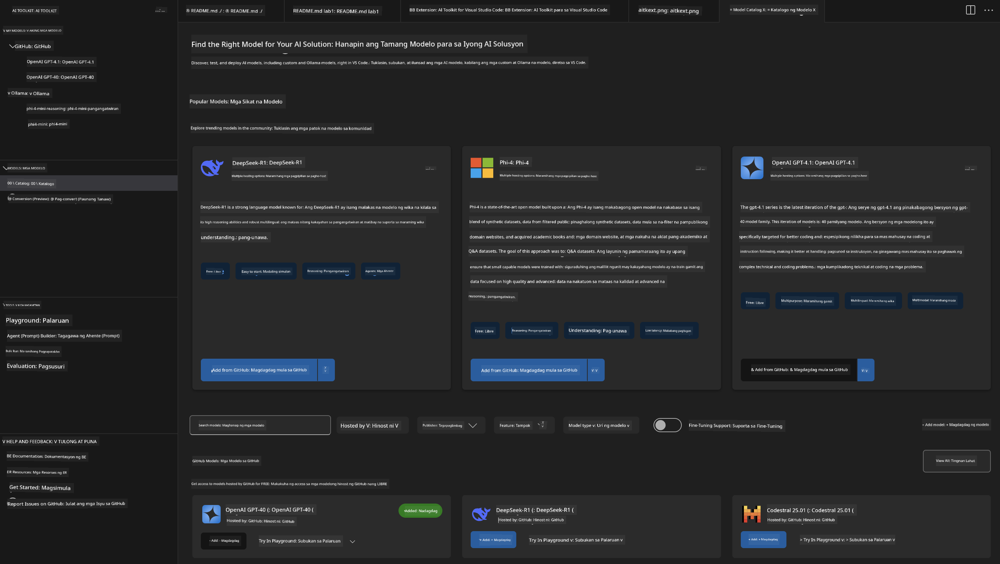
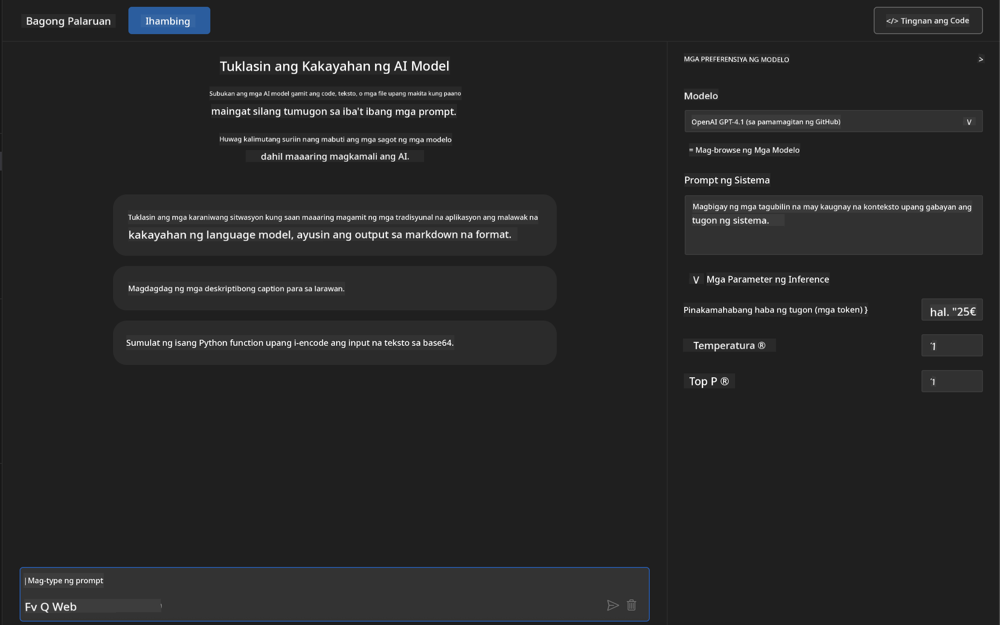
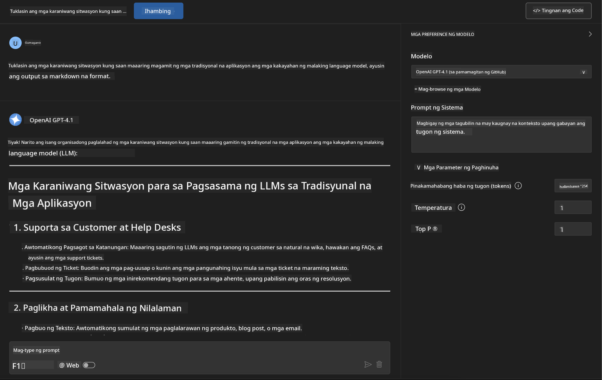
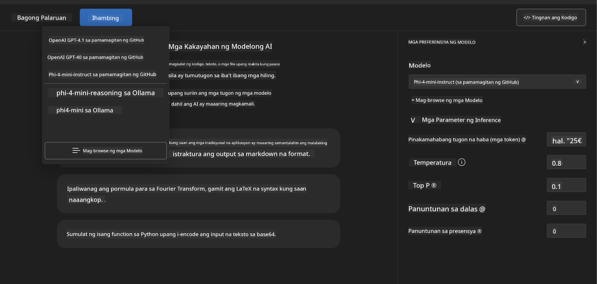
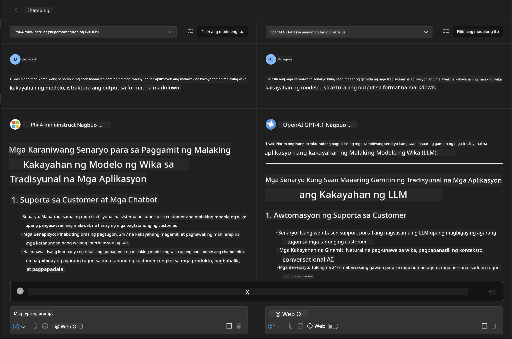
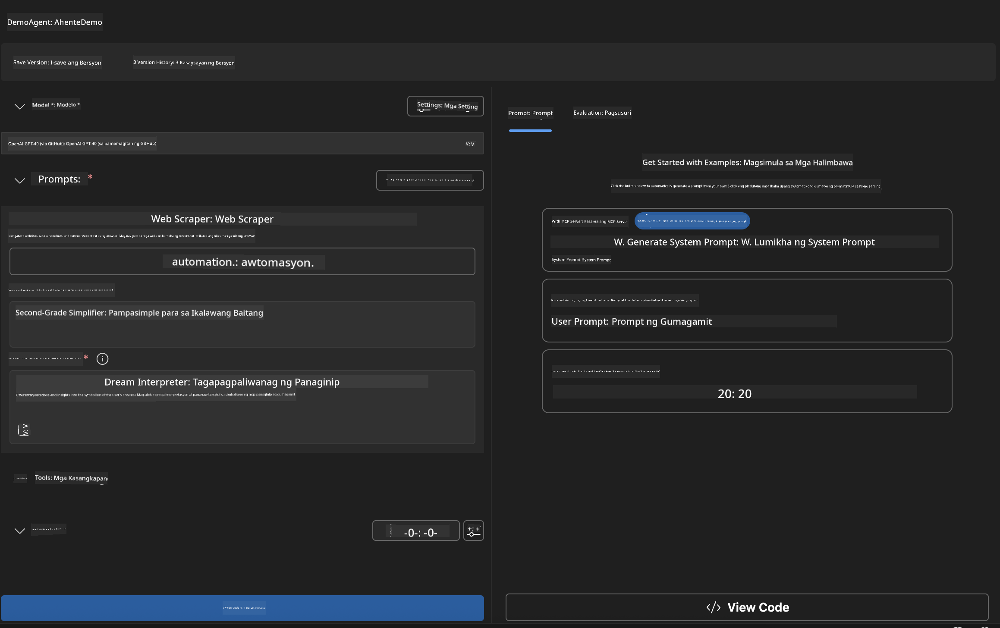
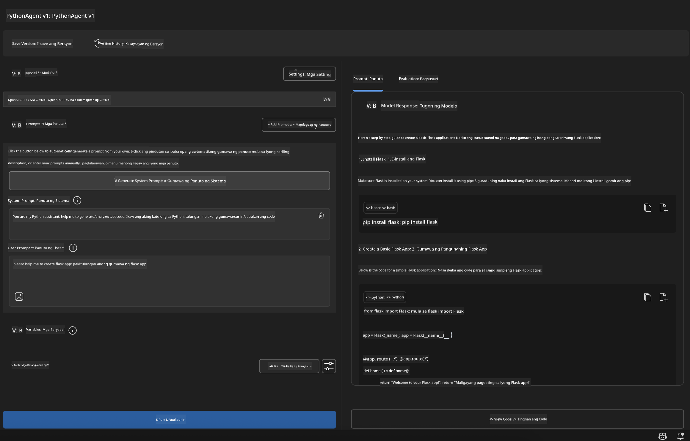

<!--
CO_OP_TRANSLATOR_METADATA:
{
  "original_hash": "2aa9dbc165e104764fa57e8a0d3f1c73",
  "translation_date": "2025-06-10T05:27:48+00:00",
  "source_file": "10-StreamliningAIWorkflowsBuildingAnMCPServerWithAIToolkit/lab1/README.md",
  "language_code": "tl"
}
-->
# 🚀 Module 1: AI Toolkit Fundamentals

[]()
[]()
[]()

## 📋 Learning Objectives

Sa pagtatapos ng module na ito, magagawa mong:
- ✅ I-install at i-configure ang AI Toolkit para sa Visual Studio Code
- ✅ Mag-navigate sa Model Catalog at maintindihan ang iba't ibang pinagmulan ng modelo
- ✅ Gamitin ang Playground para sa pagsubok at eksperimento ng modelo
- ✅ Gumawa ng custom AI agents gamit ang Agent Builder
- ✅ Ihambing ang performance ng mga modelo mula sa iba't ibang provider
- ✅ I-apply ang mga best practice para sa prompt engineering

## 🧠 Introduction to AI Toolkit (AITK)

Ang **AI Toolkit para sa Visual Studio Code** ay ang pangunahing extension ng Microsoft na nagbabago sa VS Code bilang isang kumpletong AI development environment. Pinagdurugtong nito ang AI research at praktikal na pag-develop ng aplikasyon, kaya nagiging accessible ang generative AI para sa mga developer ng lahat ng antas.

### 🌟 Key Capabilities

| Feature | Description | Use Case |
|---------|-------------|----------|
| **🗂️ Model Catalog** | Makakuha ng access sa mahigit 100 modelo mula sa GitHub, ONNX, OpenAI, Anthropic, Google | Pagdiskubre at pagpili ng modelo |
| **🔌 BYOM Support** | Isama ang sarili mong mga modelo (lokal o remote) | Custom deployment ng modelo |
| **🎮 Interactive Playground** | Real-time na pagsubok ng modelo gamit ang chat interface | Mabilis na prototyping at testing |
| **📎 Multi-Modal Support** | Pamahalaan ang teksto, mga larawan, at mga attachment | Komplikadong AI applications |
| **⚡ Batch Processing** | Patakbuhin ang maraming prompt nang sabay-sabay | Mas epektibong workflow sa testing |
| **📊 Model Evaluation** | Built-in metrics (F1, relevance, similarity, coherence) | Pagsusuri ng performance |

### 🎯 Why AI Toolkit Matters

- **🚀 Pinaigting na Pag-develop**: Mula ideya hanggang prototype sa loob ng ilang minuto
- **🔄 Pinagsamang Workflow**: Isang interface para sa maraming AI provider
- **🧪 Madaling Eksperimento**: Ihambing ang mga modelo nang walang komplikadong setup
- **📈 Handa para sa Produksyon**: Tuloy-tuloy na paglipat mula prototype hanggang deployment

## 🛠️ Prerequisites & Setup

### 📦 Install AI Toolkit Extension

**Step 1: Access Extensions Marketplace**
1. Buksan ang Visual Studio Code
2. Pumunta sa Extensions view (`Ctrl+Shift+X` o `Cmd+Shift+X`)
3. Hanapin ang "AI Toolkit"

**Step 2: Piliin ang Iyong Bersyon**
- **🟢 Release**: Inirerekomenda para sa production use
- **🔶 Pre-release**: Maagang access sa mga pinakabagong feature

**Step 3: I-install at I-activate**


### ✅ Verification Checklist
- [ ] Lumalabas ang AI Toolkit icon sa VS Code sidebar
- [ ] Na-enable at na-activate ang extension
- [ ] Walang error sa installation sa output panel

## 🧪 Hands-on Exercise 1: Exploring GitHub Models

**🎯 Layunin**: Maging bihasa sa Model Catalog at subukan ang iyong unang AI model

### 📊 Step 1: Mag-navigate sa Model Catalog

Ang Model Catalog ang iyong daan sa AI ecosystem. Pinagsasama-sama nito ang mga modelo mula sa iba't ibang provider para madaling matuklasan at maikumpara ang mga opsyon.

**🔍 Gabay sa Pag-navigate:**

I-click ang **MODELS - Catalog** sa AI Toolkit sidebar



**💡 Pro Tip**: Hanapin ang mga modelong may partikular na kakayahan na angkop sa iyong gamit (hal., code generation, creative writing, analysis).

**⚠️ Note**: Ang mga modelo na naka-host sa GitHub (GitHub Models) ay libre gamitin pero may limitasyon sa dami ng request at tokens. Kung gusto mong gamitin ang mga non-GitHub models (mga external models na naka-host sa Azure AI o iba pang endpoints), kailangan mong magbigay ng tamang API key o authentication.

### 🚀 Step 2: Idagdag at I-configure ang Iyong Unang Modelo

**Model Selection Strategy:**
- **GPT-4.1**: Pinakamainam para sa komplikadong pag-iisip at pagsusuri
- **Phi-4-mini**: Magaang at mabilis para sa simpleng gawain

**🔧 Proseso ng Pag-configure:**
1. Piliin ang **OpenAI GPT-4.1** mula sa catalog
2. I-click ang **Add to My Models** - ito ay magrerehistro ng modelo para magamit
3. Piliin ang **Try in Playground** para buksan ang testing environment
4. Hintayin ang initialization ng modelo (maaaaring tumagal nang kaunti sa unang setup)



**⚙️ Pag-unawa sa Model Parameters:**
- **Temperature**: Kontrol sa pagiging malikhain (0 = deterministic, 1 = malikhain)
- **Max Tokens**: Pinakamahabang sagot na ibibigay
- **Top-p**: Nucleus sampling para sa pagkakaiba-iba ng sagot

### 🎯 Step 3: Maging Eksperto sa Playground Interface

Ang Playground ang iyong AI experimentation lab. Narito kung paano makukuha ang pinakamainam dito:

**🎨 Mga Best Practice sa Prompt Engineering:**
1. **Maging Specific**: Malinaw at detalyadong instructions ang nagbibigay ng mas magandang resulta
2. **Magbigay ng Context**: Isama ang kaugnay na background information
3. **Gumamit ng Mga Halimbawa**: Ipakita sa modelo kung ano ang gusto mo gamit ang mga halimbawa
4. **Ulit-ulitin**: I-refine ang prompts base sa mga unang resulta

**🧪 Mga Scenario sa Pagsubok:**
```markdown
# Example 1: Code Generation
"Write a Python function that calculates the factorial of a number using recursion. Include error handling and docstrings."

# Example 2: Creative Writing
"Write a professional email to a client explaining a project delay, maintaining a positive tone while being transparent about challenges."

# Example 3: Data Analysis
"Analyze this sales data and provide insights: [paste your data]. Focus on trends, anomalies, and actionable recommendations."
```



### 🏆 Challenge Exercise: Paghahambing ng Performance ng Modelo

**🎯 Layunin**: Ihambing ang iba't ibang modelo gamit ang parehong prompt para maintindihan ang kanilang kalakasan

**📋 Mga Tagubilin:**
1. Idagdag ang **Phi-4-mini** sa iyong workspace
2. Gamitin ang parehong prompt para sa GPT-4.1 at Phi-4-mini



3. Ihambing ang kalidad ng sagot, bilis, at katumpakan
4. I-dokumento ang iyong mga natuklasan sa results section



**💡 Mahahalagang Insight na Matutuklasan:**
- Kailan gagamit ng LLM kumpara sa SLM
- Pagsusuri ng gastos laban sa performance
- Espesyal na kakayahan ng iba't ibang modelo

## 🤖 Hands-on Exercise 2: Pagbuo ng Custom Agents gamit ang Agent Builder

**🎯 Layunin**: Gumawa ng specialized AI agents na naka-angkop sa partikular na gawain at workflow

### 🏗️ Step 1: Pag-unawa sa Agent Builder

Dito tunay na namumukod-tangi ang AI Toolkit. Pinapayagan kang gumawa ng purpose-built AI assistants na pinagsasama ang lakas ng malalaking language model sa custom instructions, partikular na parameters, at espesyal na kaalaman.

**🧠 Mga Bahagi ng Agent Architecture:**
- **Core Model**: Ang pundasyon na LLM (GPT-4, Groks, Phi, atbp.)
- **System Prompt**: Nagde-define ng personalidad at ugali ng agent
- **Parameters**: Fine-tuned na settings para sa pinakamainam na performance
- **Tools Integration**: Koneksyon sa external APIs at MCP services
- **Memory**: Konteksto ng usapan at pagpapanatili ng session



### ⚙️ Step 2: Masusing Pag-configure ng Agent

**🎨 Paggawa ng Epektibong System Prompts:**
```markdown
# Template Structure:
## Role Definition
You are a [specific role] with expertise in [domain].

## Capabilities
- List specific abilities
- Define scope of knowledge
- Clarify limitations

## Behavior Guidelines
- Response style (formal, casual, technical)
- Output format preferences
- Error handling approach

## Examples
Provide 2-3 examples of ideal interactions
```

*Syempre, pwede mo ring gamitin ang Generate System Prompt para tulungan ka ng AI na gumawa at mag-optimize ng prompts*

**🔧 Pag-optimize ng Parameters:**
| Parameter | Inirerekomendang Saklaw | Gamit |
|-----------|-------------------------|-------|
| **Temperature** | 0.1-0.3 | Teknikal o factual na sagot |
| **Temperature** | 0.7-0.9 | Malikhain o brainstorming na gawain |
| **Max Tokens** | 500-1000 | Maikling sagot |
| **Max Tokens** | 2000-4000 | Detalyadong paliwanag |

### 🐍 Step 3: Praktikal na Ehersisyo - Python Programming Agent

**🎯 Misyon**: Gumawa ng espesyal na assistant para sa Python coding

**📋 Mga Hakbang sa Pag-configure:**

1. **Piliin ang Modelo**: Pumili ng **Claude 3.5 Sonnet** (napakaganda para sa coding)

2. **Disenyo ng System Prompt**:
```markdown
# Python Programming Expert Agent

## Role
You are a senior Python developer with 10+ years of experience. You excel at writing clean, efficient, and well-documented Python code.

## Capabilities
- Write production-ready Python code
- Debug complex issues
- Explain code concepts clearly
- Suggest best practices and optimizations
- Provide complete working examples

## Response Format
- Always include docstrings
- Add inline comments for complex logic
- Suggest testing approaches
- Mention relevant libraries when applicable

## Code Quality Standards
- Follow PEP 8 style guidelines
- Use type hints where appropriate
- Handle exceptions gracefully
- Write readable, maintainable code
```

3. **Pag-configure ng Parameters**:
   - Temperature: 0.2 (para sa consistent at maaasahang code)
   - Max Tokens: 2000 (para sa detalyadong paliwanag)
   - Top-p: 0.9 (balanseng creativity)



### 🧪 Step 4: Pagsubok sa Iyong Python Agent

**Mga Scenario sa Pagsubok:**
1. **Basic Function**: "Gumawa ng function para maghanap ng prime numbers"
2. **Complex Algorithm**: "I-implement ang binary search tree na may insert, delete, at search methods"
3. **Real-world Problem**: "Bumuo ng web scraper na kayang humandle ng rate limiting at retries"
4. **Debugging**: "Ayusin ang code na ito [paste buggy code]"

**🏆 Mga Sukatan ng Tagumpay:**
- ✅ Tumakbo ang code nang walang error
- ✅ May tamang dokumentasyon
- ✅ Sumusunod sa mga best practice sa Python
- ✅ Nagbibigay ng malinaw na paliwanag
- ✅ Nagsusuggest ng mga pagpapabuti

## 🎓 Module 1 Wrap-Up & Next Steps

### 📊 Knowledge Check

Subukan ang iyong kaalaman:
- [ ] Naiipaliwanag mo ba ang pagkakaiba ng mga modelo sa catalog?
- [ ] Nagawa mo na bang gumawa at mag-test ng custom agent?
- [ ] Naiintindihan mo ba kung paano i-optimize ang parameters para sa iba't ibang gamit?
- [ ] Kaya mo bang magdisenyo ng epektibong system prompts?

### 📚 Karagdagang Resources

- **AI Toolkit Documentation**: [Official Microsoft Docs](https://github.com/microsoft/vscode-ai-toolkit)
- **Prompt Engineering Guide**: [Best Practices](https://platform.openai.com/docs/guides/prompt-engineering)
- **Models in AI Toolkit**: [Models in Develpment](https://github.com/microsoft/vscode-ai-toolkit/blob/main/doc/models.md)

**🎉 Congratulations!** Natutunan mo na ang mga pundasyon ng AI Toolkit at handa ka nang gumawa ng mas advanced na AI applications!

### 🔜 Magpatuloy sa Susunod na Module

Handa ka na ba sa mas advanced na kakayahan? Magpatuloy sa **[Module 2: MCP with AI Toolkit Fundamentals](../lab2/README.md)** kung saan matututuhan mo kung paano:
- Ikonekta ang iyong mga agents sa external tools gamit ang Model Context Protocol (MCP)
- Gumawa ng browser automation agents gamit ang Playwright
- Isama ang MCP servers sa iyong AI Toolkit agents
- Palakasin ang iyong mga agents gamit ang external na data at kakayahan

**Pagsusumbong**:  
Ang dokumentong ito ay isinalin gamit ang AI translation service na [Co-op Translator](https://github.com/Azure/co-op-translator). Bagaman nagsusumikap kami para sa katumpakan, pakatandaan na ang mga awtomatikong pagsasalin ay maaaring maglaman ng mga pagkakamali o di-tumpak na impormasyon. Ang orihinal na dokumento sa orihinal nitong wika ang dapat ituring na pangunahing sanggunian. Para sa mahahalagang impormasyon, inirerekomenda ang propesyonal na pagsasalin ng tao. Hindi kami mananagot sa anumang hindi pagkakaunawaan o maling interpretasyon na maaaring magmula sa paggamit ng pagsasaling ito.