<!--
CO_OP_TRANSLATOR_METADATA:
{
  "original_hash": "a22b7dd11cd7690f99f9195877cafdc3",
  "translation_date": "2025-06-10T05:55:20+00:00",
  "source_file": "10-StreamliningAIWorkflowsBuildingAnMCPServerWithAIToolkit/lab2/README.md",
  "language_code": "tl"
}
-->
# 🌐 Module 2: MCP kasama ang AI Toolkit Fundamentals

[]()
[]()
[]()

## 📋 Mga Layunin sa Pagkatuto

Sa pagtatapos ng module na ito, magagawa mong:
- ✅ Maunawaan ang arkitektura at benepisyo ng Model Context Protocol (MCP)
- ✅ Tuklasin ang ecosystem ng Microsoft MCP server
- ✅ Isama ang mga MCP server gamit ang AI Toolkit Agent Builder
- ✅ Gumawa ng functional na browser automation agent gamit ang Playwright MCP
- ✅ I-configure at subukan ang mga MCP tools sa loob ng iyong mga agent
- ✅ I-export at i-deploy ang mga MCP-powered agents para sa production use

## 🎯 Pagpapatuloy mula sa Module 1

Sa Module 1, natutunan natin ang mga pangunahing kaalaman ng AI Toolkit at nakagawa ng ating unang Python Agent. Ngayon, **palalakasin** natin ang iyong mga agent sa pamamagitan ng pagkonekta nila sa mga external na tool at serbisyo gamit ang makabagong **Model Context Protocol (MCP)**.

Isipin ito bilang pag-upgrade mula sa simpleng calculator papunta sa isang buong computer - magkakaroon ang iyong AI agents ng kakayahan na:
- 🌐 Mag-browse at makipag-ugnayan sa mga website
- 📁 Mag-access at mag-manipula ng mga file
- 🔧 Makipag-integrate sa mga enterprise system
- 📊 Magproseso ng real-time na data mula sa mga API

## 🧠 Pag-unawa sa Model Context Protocol (MCP)

### 🔍 Ano ang MCP?

Ang Model Context Protocol (MCP) ay ang **"USB-C para sa mga AI application"** - isang makabagong open standard na nag-uugnay sa Large Language Models (LLMs) sa mga external na tool, pinagkukunan ng data, at mga serbisyo. Katulad ng USB-C na nag-alis ng kalituhan sa mga kable sa pamamagitan ng isang unibersal na konektor, nilulutas ng MCP ang komplikasyon ng AI integration gamit ang isang standardized na protocol.

### 🎯 Ang Problema na Nilulutas ng MCP

**Bago ang MCP:**
- 🔧 Custom integrations para sa bawat tool
- 🔄 Vendor lock-in gamit ang proprietary solutions  
- 🔒 Mga kahinaan sa seguridad mula sa ad-hoc na koneksyon
- ⏱️ Buwan ng development para sa mga basic integration

**Sa MCP:**
- ⚡ Plug-and-play na tool integration
- 🔄 Vendor-agnostic na arkitektura
- 🛡️ Built-in na mga best practice sa seguridad
- 🚀 Ilang minuto lang para magdagdag ng bagong kakayahan

### 🏗️ Malalimang Pagtingin sa Arkitektura ng MCP

Ang MCP ay sumusunod sa **client-server architecture** na lumilikha ng secure at scalable na ecosystem:

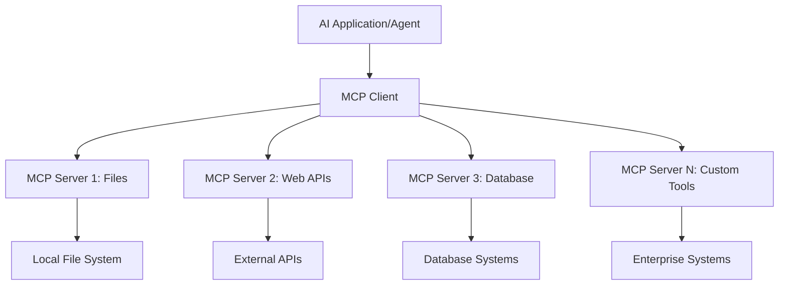

**🔧 Pangunahing Mga Bahagi:**

| Component | Papel | Mga Halimbawa |
|-----------|-------|---------------|
| **MCP Hosts** | Mga application na gumagamit ng MCP services | Claude Desktop, VS Code, AI Toolkit |
| **MCP Clients** | Protocol handlers (1:1 sa servers) | Built-in sa host applications |
| **MCP Servers** | Nagpapakita ng mga kakayahan gamit ang standard protocol | Playwright, Files, Azure, GitHub |
| **Transport Layer** | Mga paraan ng komunikasyon | stdio, HTTP, WebSockets |


## 🏢 Ecosystem ng Microsoft MCP Server

Pinangungunahan ng Microsoft ang MCP ecosystem gamit ang komprehensibong suite ng enterprise-grade servers na tumutugon sa mga totoong pangangailangan ng negosyo.

### 🌟 Mga Tampok na Microsoft MCP Servers

#### 1. ☁️ Azure MCP Server
**🔗 Repository**: [azure/azure-mcp](https://github.com/azure/azure-mcp)
**🎯 Layunin**: Komprehensibong pamamahala ng Azure resources na may AI integration

**✨ Pangunahing Katangian:**
- Declarative infrastructure provisioning
- Real-time na monitoring ng resources
- Mga rekomendasyon para sa cost optimization
- Pagsusuri sa pagsunod sa seguridad

**🚀 Mga Gamit:**
- Infrastructure-as-Code na may AI assistance
- Automated na pag-scale ng resources
- Pag-optimize ng cloud cost
- Automation ng DevOps workflow

#### 2. 📊 Microsoft Dataverse MCP
**📚 Dokumentasyon**: [Microsoft Dataverse Integration](https://go.microsoft.com/fwlink/?linkid=2320176)
**🎯 Layunin**: Natural language interface para sa business data

**✨ Pangunahing Katangian:**
- Mga natural language query sa database
- Pag-unawa sa business context
- Custom prompt templates
- Enterprise data governance

**🚀 Mga Gamit:**
- Business intelligence reporting
- Pagsusuri ng customer data
- Insights sa sales pipeline
- Compliance data queries

#### 3. 🌐 Playwright MCP Server
**🔗 Repository**: [microsoft/playwright-mcp](https://github.com/microsoft/playwright-mcp)
**🎯 Layunin**: Browser automation at web interaction capabilities

**✨ Pangunahing Katangian:**
- Cross-browser automation (Chrome, Firefox, Safari)
- Matalinong pagtukoy ng mga elemento
- Pagkuha ng screenshot at PDF generation
- Pagsubaybay ng network traffic

**🚀 Mga Gamit:**
- Automated testing workflows
- Web scraping at data extraction
- UI/UX monitoring
- Automation ng competitive analysis

#### 4. 📁 Files MCP Server
**🔗 Repository**: [microsoft/files-mcp-server](https://github.com/microsoft/files-mcp-server)
**🎯 Layunin**: Matalinong operasyon sa file system

**✨ Pangunahing Katangian:**
- Declarative file management
- Content synchronization
- Version control integration
- Metadata extraction

**🚀 Mga Gamit:**
- Pamamahala ng dokumentasyon
- Organisasyon ng code repository
- Content publishing workflows
- Pag-handle ng data pipeline files

#### 5. 📝 MarkItDown MCP Server
**🔗 Repository**: [microsoft/markitdown](https://github.com/microsoft/markitdown)
**🎯 Layunin**: Advanced na pagproseso at manipulasyon ng Markdown

**✨ Pangunahing Katangian:**
- Rich Markdown parsing
- Format conversion (MD ↔ HTML ↔ PDF)
- Pagsusuri ng istruktura ng nilalaman
- Template processing

**🚀 Mga Gamit:**
- Technical documentation workflows
- Content management systems
- Paggawa ng mga ulat
- Automation ng knowledge base

#### 6. 📈 Clarity MCP Server
**📦 Package**: [@microsoft/clarity-mcp-server](https://www.npmjs.com/package/@microsoft/clarity-mcp-server)
**🎯 Layunin**: Web analytics at mga insight sa user behavior

**✨ Pangunahing Katangian:**
- Heatmap data analysis
- User session recordings
- Performance metrics
- Conversion funnel analysis

**🚀 Mga Gamit:**
- Pag-optimize ng website
- Pananaliksik sa user experience
- A/B testing analysis
- Business intelligence dashboards

### 🌍 Ecosystem ng Komunidad

Bukod sa mga server ng Microsoft, kasama sa MCP ecosystem ang:
- **🐙 GitHub MCP**: Pamamahala ng repository at pagsusuri ng code
- **🗄️ Database MCPs**: Integrasyon ng PostgreSQL, MySQL, MongoDB
- **☁️ Cloud Provider MCPs**: Mga tool para sa AWS, GCP, Digital Ocean
- **📧 Communication MCPs**: Integrasyon ng Slack, Teams, Email

## 🛠️ Hands-On Lab: Paggawa ng Browser Automation Agent

**🎯 Layunin ng Proyekto**: Gumawa ng matalinong browser automation agent gamit ang Playwright MCP server na kayang mag-navigate sa mga website, kumuha ng impormasyon, at magsagawa ng kumplikadong web interactions.

### 🚀 Phase 1: Pagsisimula ng Agent Foundation

#### Hakbang 1: I-initialize ang Iyong Agent
1. **Buksan ang AI Toolkit Agent Builder**
2. **Gumawa ng Bagong Agent** gamit ang sumusunod na configuration:
   - **Pangalan**: `BrowserAgent`
   - **Model**: Choose GPT-4o 

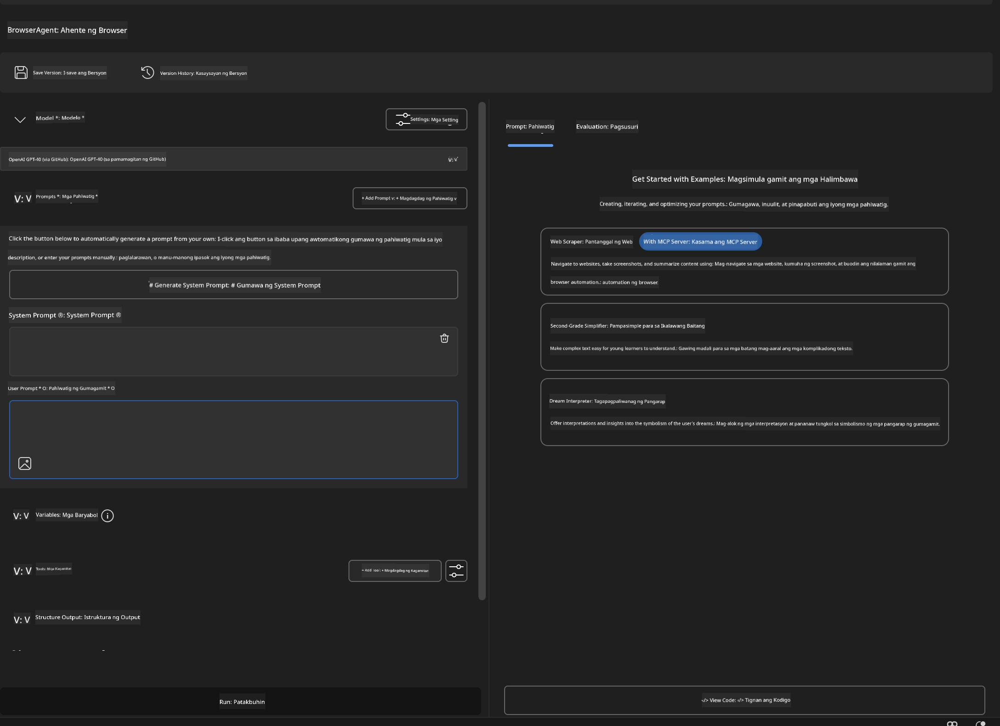


### 🔧 Phase 2: MCP Integration Workflow

#### Step 3: Add MCP Server Integration
1. **Navigate to Tools Section** in Agent Builder
2. **Click "Add Tool"** to open the integration menu
3. **Select "MCP Server"** from available options

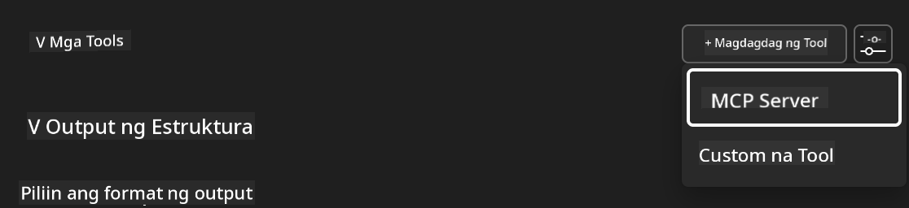

**🔍 Understanding Tool Types:**
- **Built-in Tools**: Pre-configured AI Toolkit functions
- **MCP Servers**: External service integrations
- **Custom APIs**: Your own service endpoints
- **Function Calling**: Direct model function access

#### Step 4: MCP Server Selection
1. **Choose "MCP Server"** option to proceed
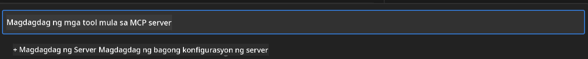

2. **Browse MCP Catalog** to explore available integrations
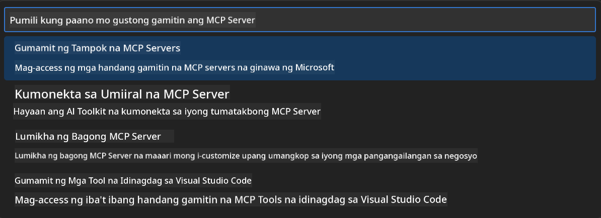


### 🎮 Phase 3: Playwright MCP Configuration

#### Step 5: Select and Configure Playwright
1. **Click "Use Featured MCP Servers"** to access Microsoft's verified servers
2. **Select "Playwright"** from the featured list
3. **Accept Default MCP ID** or customize for your environment

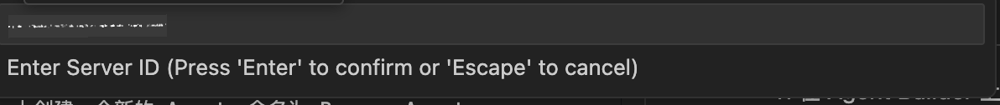

#### Step 6: Enable Playwright Capabilities
**🔑 Critical Step**: Select **ALL** available Playwright methods for maximum functionality

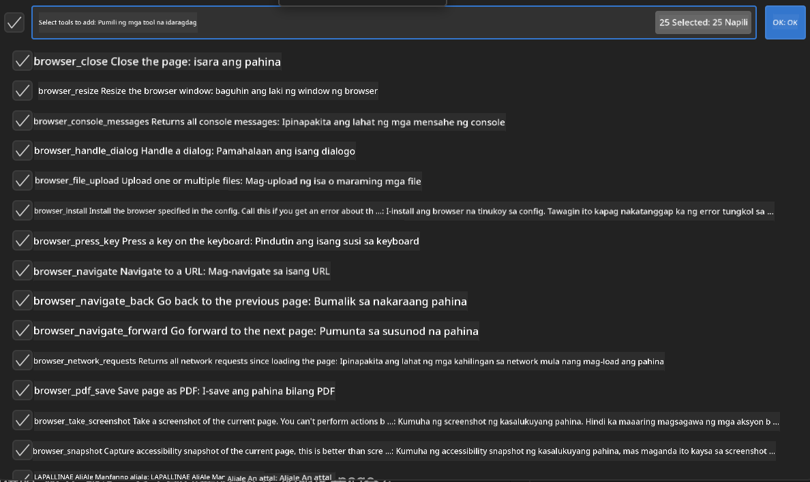

**🛠️ Essential Playwright Tools:**
- **Navigation**: `goto`, `goBack`, `goForward`, `reload`
- **Interaction**: `click`, `fill`, `press`, `hover`, `drag`
- **Extraction**: `textContent`, `innerHTML`, `getAttribute`
- **Validation**: `isVisible`, `isEnabled`, `waitForSelector`
- **Capture**: `screenshot`, `pdf`, `video`
- **Network**: `setExtraHTTPHeaders`, `route`, `waitForResponse`

#### Hakbang 7: Tiyakin ang Tagumpay ng Integrasyon
**✅ Mga Palatandaan ng Tagumpay:**
- Lahat ng tools ay lumalabas sa interface ng Agent Builder
- Walang error messages sa integration panel
- Nakikita ang Playwright server status na "Connected"


**🔧 Mga Karaniwang Problema at Solusyon:**
- **Connection Failed**: Suriin ang internet connection at firewall settings
- **Missing Tools**: Siguraduhing napili lahat ng kakayahan sa setup
- **Permission Errors**: Tiyakin na may tamang system permissions ang VS Code

### 🎯 Phase 4: Advanced Prompt Engineering

#### Hakbang 8: Gumawa ng Matalinong System Prompts
Lumikha ng mga sopistikadong prompt na ginagamit ang buong kakayahan ng Playwright:

```markdown
# Web Automation Expert System Prompt

## Core Identity
You are an advanced web automation specialist with deep expertise in browser automation, web scraping, and user experience analysis. You have access to Playwright tools for comprehensive browser control.

## Capabilities & Approach
### Navigation Strategy
- Always start with screenshots to understand page layout
- Use semantic selectors (text content, labels) when possible
- Implement wait strategies for dynamic content
- Handle single-page applications (SPAs) effectively

### Error Handling
- Retry failed operations with exponential backoff
- Provide clear error descriptions and solutions
- Suggest alternative approaches when primary methods fail
- Always capture diagnostic screenshots on errors

### Data Extraction
- Extract structured data in JSON format when possible
- Provide confidence scores for extracted information
- Validate data completeness and accuracy
- Handle pagination and infinite scroll scenarios

### Reporting
- Include step-by-step execution logs
- Provide before/after screenshots for verification
- Suggest optimizations and alternative approaches
- Document any limitations or edge cases encountered

## Ethical Guidelines
- Respect robots.txt and rate limiting
- Avoid overloading target servers
- Only extract publicly available information
- Follow website terms of service
```

#### Hakbang 9: Gumawa ng Dynamic User Prompts
Disenyuhin ang mga prompt na nagpapakita ng iba't ibang kakayahan:

**🌐 Halimbawa ng Web Analysis:**
```markdown
Navigate to github.com/kinfey and provide a comprehensive analysis including:
1. Repository structure and organization
2. Recent activity and contribution patterns  
3. Documentation quality assessment
4. Technology stack identification
5. Community engagement metrics
6. Notable projects and their purposes

Include screenshots at key steps and provide actionable insights.
```

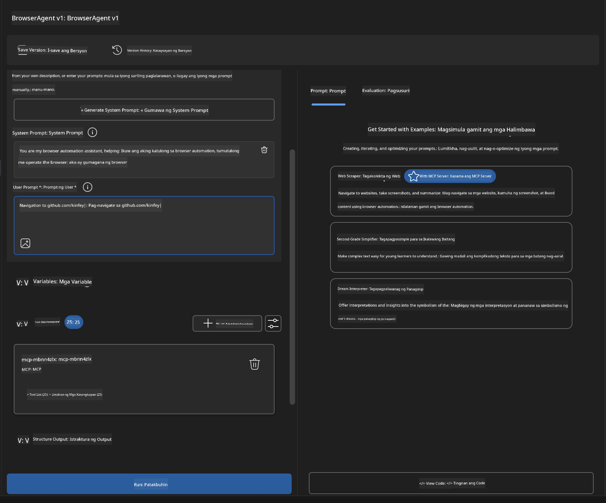

### 🚀 Phase 5: Pagsasagawa at Pagsubok

#### Hakbang 10: Patakbuhin ang Iyong Unang Automation
1. **I-click ang "Run"** para simulan ang automation sequence
2. **Subaybayan ang Real-time Execution**:
   - Awtomatikong magbubukas ang Chrome browser
   - Magna-navigate ang agent sa target na website
   - Kinukunan ng screenshot bawat pangunahing hakbang
   - Real-time na dumadaloy ang mga resulta ng pagsusuri

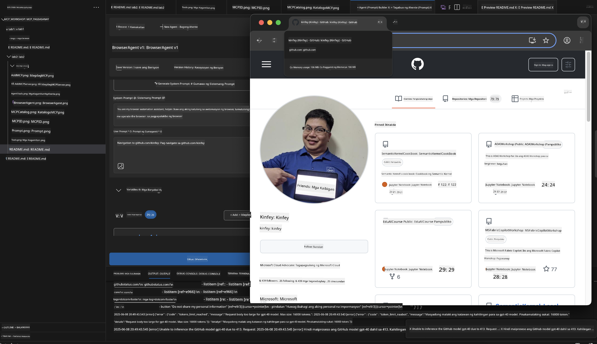

#### Hakbang 11: Suriin ang Mga Resulta at Insight
Balikan ang komprehensibong pagsusuri sa interface ng Agent Builder:

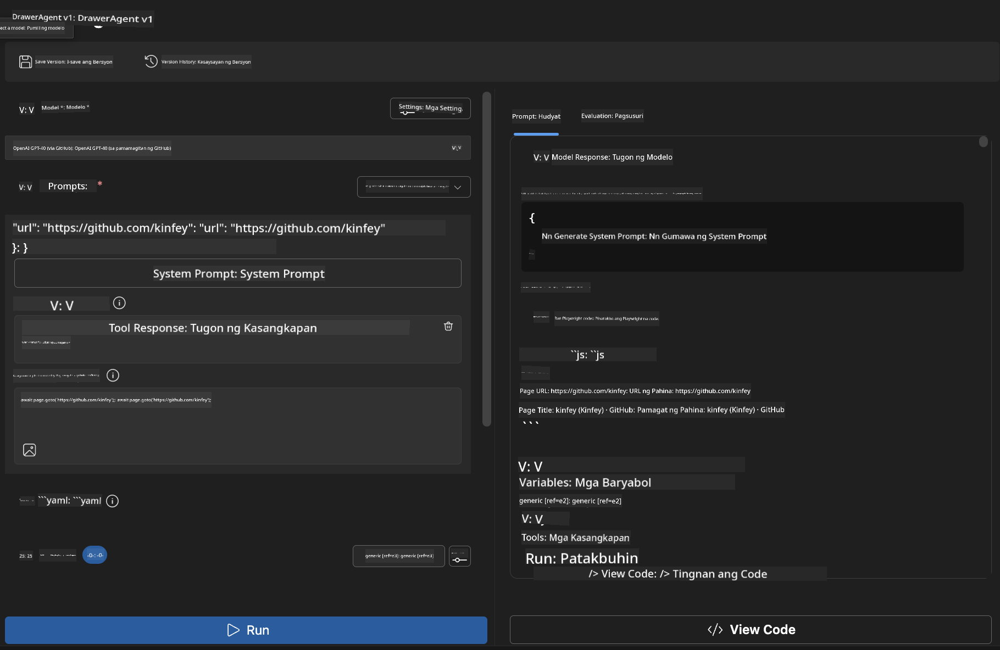

### 🌟 Phase 6: Advanced na Kakayahan at Deployment

#### Hakbang 12: I-export at I-deploy sa Production
Sinusuportahan ng Agent Builder ang iba't ibang deployment options:

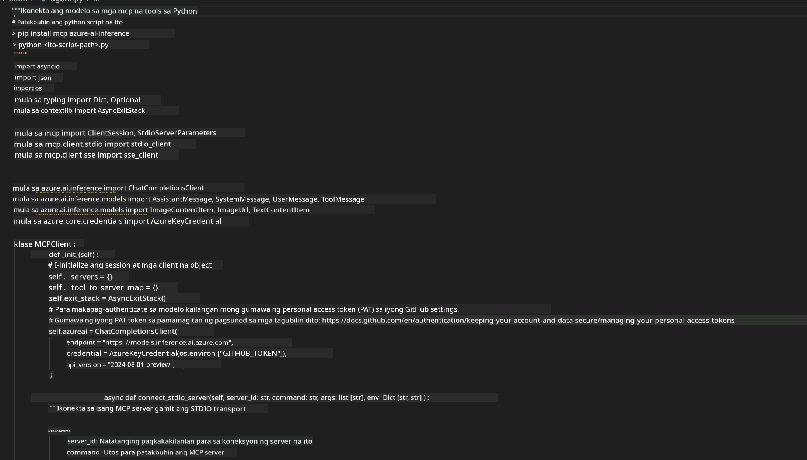

## 🎓 Buod ng Module 2 at Mga Susunod na Hakbang

### 🏆 Nakamit: MCP Integration Master

**✅ Mga Natutunang Kasanayan:**
- [ ] Pag-unawa sa arkitektura at benepisyo ng MCP
- [ ] Paggalugad sa ecosystem ng Microsoft MCP server
- [ ] Pagsasama ng Playwright MCP sa AI Toolkit
- [ ] Paggawa ng sopistikadong browser automation agents
- [ ] Advanced prompt engineering para sa web automation

### 📚 Karagdagang Mga Mapagkukunan

- **🔗 MCP Specification**: [Official Protocol Documentation](https://modelcontextprotocol.io/)
- **🛠️ Playwright API**: [Complete Method Reference](https://playwright.dev/docs/api/class-playwright)
- **🏢 Microsoft MCP Servers**: [Enterprise Integration Guide](https://github.com/microsoft/mcp-servers)
- **🌍 Community Examples**: [MCP Server Gallery](https://github.com/modelcontextprotocol/servers)

**🎉 Congratulations!** Matagumpay mong na-master ang MCP integration at ngayon ay makakagawa ka na ng production-ready AI agents na may kakayahang gumamit ng mga external tool!


### 🔜 Magpatuloy sa Susunod na Module

Handa ka na bang dalhin ang iyong MCP skills sa mas mataas na antas? Magpatuloy sa **[Module 3: Advanced MCP Development with AI Toolkit](../lab3/README.md)** kung saan matututuhan mo kung paano:
- Gumawa ng sarili mong custom MCP servers
- I-configure at gamitin ang pinakabagong MCP Python SDK
- I-set up ang MCP Inspector para sa debugging
- Masterin ang advanced MCP server development workflows
- Gumawa ng Weather MCP Server mula sa simula

**Paalala**:  
Ang dokumentong ito ay isinalin gamit ang AI translation service na [Co-op Translator](https://github.com/Azure/co-op-translator). Bagamat nagsusumikap kami para sa katumpakan, pakatandaan na ang mga awtomatikong pagsasalin ay maaaring maglaman ng mga pagkakamali o di-tumpak na impormasyon. Ang orihinal na dokumento sa kanyang likas na wika ang dapat ituring na pangunahing sanggunian. Para sa mahahalagang impormasyon, inirerekomenda ang propesyonal na pagsasalin ng tao. Hindi kami mananagot sa anumang hindi pagkakaunawaan o maling interpretasyon na maaaring magmula sa paggamit ng pagsasaling ito.