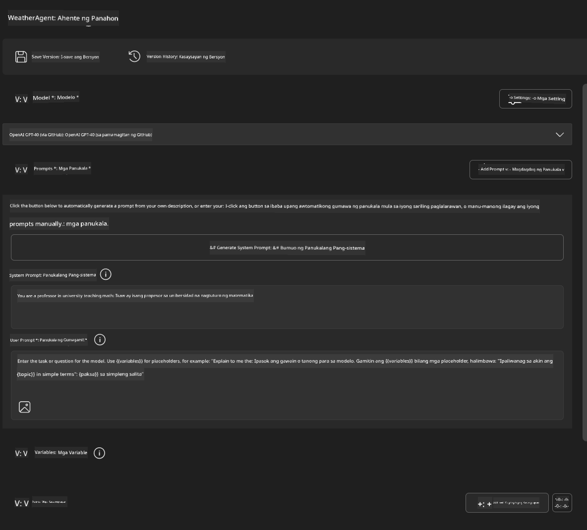
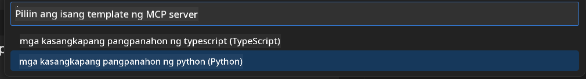
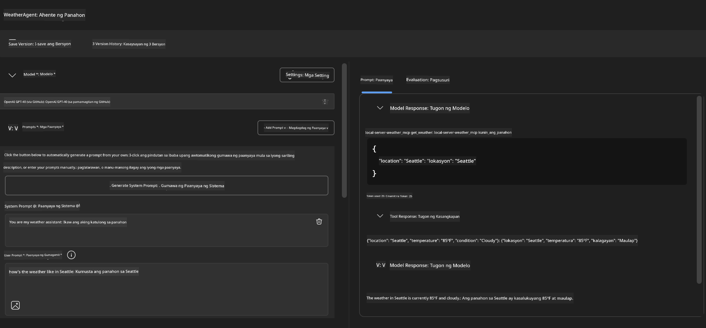
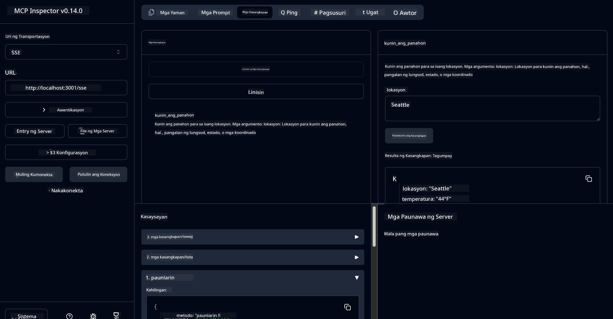

<!--
CO_OP_TRANSLATOR_METADATA:
{
  "original_hash": "dd8da3f75addcef453fe11f02a270217",
  "translation_date": "2025-06-10T06:16:36+00:00",
  "source_file": "10-StreamliningAIWorkflowsBuildingAnMCPServerWithAIToolkit/lab3/README.md",
  "language_code": "tl"
}
-->
# 🔧 Module 3: Advanced MCP Development with AI Toolkit


## 🎯 Mga Layunin sa Pagkatuto

Pagkatapos ng lab na ito, magagawa mong:

- ✅ Gumawa ng custom MCP servers gamit ang AI Toolkit
- ✅ I-configure at gamitin ang pinakabagong MCP Python SDK (v1.9.3)
- ✅ I-set up at gamitin ang MCP Inspector para sa debugging
- ✅ Mag-debug ng MCP servers sa parehong Agent Builder at Inspector na mga kapaligiran
- ✅ Maunawaan ang mga advanced na workflow sa pag-develop ng MCP server

## 📋 Mga Kinakailangan

- Natapos ang Lab 2 (MCP Fundamentals)
- VS Code na may naka-install na AI Toolkit extension
- Python 3.10+ na environment
- Node.js at npm para sa setup ng Inspector

## 🏗️ Ano ang Bubuoin Mo

Sa lab na ito, gagawa ka ng isang **Weather MCP Server** na nagpapakita ng:
- Custom MCP server implementation
- Integrasyon sa AI Toolkit Agent Builder
- Propesyonal na mga workflow sa debugging
- Mga modernong pattern sa paggamit ng MCP SDK

---

## 🔧 Pangkalahatang Paglalarawan ng Mga Pangunahing Bahagi

### 🐍 MCP Python SDK
Ang Model Context Protocol Python SDK ang pundasyon para sa paggawa ng custom MCP servers. Gagamitin mo ang bersyon 1.9.3 na may pinahusay na mga kakayahan sa debugging.

### 🔍 MCP Inspector
Isang makapangyarihang tool para sa debugging na nagbibigay ng:
- Real-time na pagmamanman ng server
- Visualization ng tool execution
- Pagsusuri ng mga network request/response
- Interactive na testing environment

---

## 📖 Hakbang-hakbang na Implementasyon

### Hakbang 1: Gumawa ng WeatherAgent sa Agent Builder

1. **Buksan ang Agent Builder** sa VS Code gamit ang AI Toolkit extension
2. **Gumawa ng bagong agent** gamit ang sumusunod na configuration:
   - Pangalan ng Agent: `WeatherAgent`



### Hakbang 2: I-initialize ang MCP Server Project

1. **Pumunta sa Tools** → **Add Tool** sa Agent Builder
2. **Piliin ang "MCP Server"** mula sa mga pagpipilian
3. **Pumili ng "Create A new MCP Server"**
4. **Piliin ang `python-weather` template**
5. **Pangalanan ang iyong server:** `weather_mcp`



### Hakbang 3: Buksan at Suriin ang Project

1. **Buksan ang na-generate na project** sa VS Code
2. **Suriin ang istruktura ng project:**
   ```
   weather_mcp/
   ├── src/
   │   ├── __init__.py
   │   └── server.py
   ├── inspector/
   │   ├── package.json
   │   └── package-lock.json
   ├── .vscode/
   │   ├── launch.json
   │   └── tasks.json
   ├── pyproject.toml
   └── README.md
   ```

### Hakbang 4: I-upgrade sa Pinakabagong MCP SDK

> **🔍 Bakit mag-upgrade?** Gusto nating gamitin ang pinakabagong MCP SDK (v1.9.3) at Inspector service (0.14.0) para sa mga bagong feature at mas mahusay na debugging.

#### 4a. I-update ang Python Dependencies

**I-edit ang `pyproject.toml`:** update [./code/weather_mcp/pyproject.toml](../../../../10-StreamliningAIWorkflowsBuildingAnMCPServerWithAIToolkit/lab3/code/weather_mcp/pyproject.toml)


#### 4b. Update Inspector Configuration

**Edit `inspector/package.json`:** update [./code/weather_mcp/inspector/package.json](../../../../10-StreamliningAIWorkflowsBuildingAnMCPServerWithAIToolkit/lab3/code/weather_mcp/inspector/package.json)

#### 4c. Update Inspector Dependencies

**Edit `inspector/package-lock.json`:** update [./code/weather_mcp/inspector/package-lock.json](../../../../10-StreamliningAIWorkflowsBuildingAnMCPServerWithAIToolkit/lab3/code/weather_mcp/inspector/package-lock.json)

> **📝 Note:** This file contains extensive dependency definitions. Below is the essential structure - the full content ensures proper dependency resolution.


> **⚡ Full Package Lock:** The complete package-lock.json contains ~3000 lines of dependency definitions. The above shows the key structure - use the provided file for complete dependency resolution.

### Step 5: Configure VS Code Debugging

*Note: Please copy the file in the specified path to replace the corresponding local file*

#### 5a. Update Launch Configuration

**Edit `.vscode/launch.json`:**

```json
{
  "version": "0.2.0",
  "configurations": [
    {
      "name": "Attach to Local MCP",
      "type": "debugpy",
      "request": "attach",
      "connect": {
        "host": "localhost",
        "port": 5678
      },
      "presentation": {
        "hidden": true
      },
      "internalConsoleOptions": "neverOpen",
      "postDebugTask": "Terminate All Tasks"
    },
    {
      "name": "Launch Inspector (Edge)",
      "type": "msedge",
      "request": "launch",
      "url": "http://localhost:6274?timeout=60000&serverUrl=http://localhost:3001/sse#tools",
      "cascadeTerminateToConfigurations": [
        "Attach to Local MCP"
      ],
      "presentation": {
        "hidden": true
      },
      "internalConsoleOptions": "neverOpen"
    },
    {
      "name": "Launch Inspector (Chrome)",
      "type": "chrome",
      "request": "launch",
      "url": "http://localhost:6274?timeout=60000&serverUrl=http://localhost:3001/sse#tools",
      "cascadeTerminateToConfigurations": [
        "Attach to Local MCP"
      ],
      "presentation": {
        "hidden": true
      },
      "internalConsoleOptions": "neverOpen"
    }
  ],
  "compounds": [
    {
      "name": "Debug in Agent Builder",
      "configurations": [
        "Attach to Local MCP"
      ],
      "preLaunchTask": "Open Agent Builder",
    },
    {
      "name": "Debug in Inspector (Edge)",
      "configurations": [
        "Launch Inspector (Edge)",
        "Attach to Local MCP"
      ],
      "preLaunchTask": "Start MCP Inspector",
      "stopAll": true
    },
    {
      "name": "Debug in Inspector (Chrome)",
      "configurations": [
        "Launch Inspector (Chrome)",
        "Attach to Local MCP"
      ],
      "preLaunchTask": "Start MCP Inspector",
      "stopAll": true
    }
  ]
}
```

**I-edit ang `.vscode/tasks.json`:**

```
{
  "version": "2.0.0",
  "tasks": [
    {
      "label": "Start MCP Server",
      "type": "shell",
      "command": "python -m debugpy --listen 127.0.0.1:5678 src/__init__.py sse",
      "isBackground": true,
      "options": {
        "cwd": "${workspaceFolder}",
        "env": {
          "PORT": "3001"
        }
      },
      "problemMatcher": {
        "pattern": [
          {
            "regexp": "^.*$",
            "file": 0,
            "location": 1,
            "message": 2
          }
        ],
        "background": {
          "activeOnStart": true,
          "beginsPattern": ".*",
          "endsPattern": "Application startup complete|running"
        }
      }
    },
    {
      "label": "Start MCP Inspector",
      "type": "shell",
      "command": "npm run dev:inspector",
      "isBackground": true,
      "options": {
        "cwd": "${workspaceFolder}/inspector",
        "env": {
          "CLIENT_PORT": "6274",
          "SERVER_PORT": "6277",
        }
      },
      "problemMatcher": {
        "pattern": [
          {
            "regexp": "^.*$",
            "file": 0,
            "location": 1,
            "message": 2
          }
        ],
        "background": {
          "activeOnStart": true,
          "beginsPattern": "Starting MCP inspector",
          "endsPattern": "Proxy server listening on port"
        }
      },
      "dependsOn": [
        "Start MCP Server"
      ]
    },
    {
      "label": "Open Agent Builder",
      "type": "shell",
      "command": "echo ${input:openAgentBuilder}",
      "presentation": {
        "reveal": "never"
      },
      "dependsOn": [
        "Start MCP Server"
      ],
    },
    {
      "label": "Terminate All Tasks",
      "command": "echo ${input:terminate}",
      "type": "shell",
      "problemMatcher": []
    }
  ],
  "inputs": [
    {
      "id": "openAgentBuilder",
      "type": "command",
      "command": "ai-mlstudio.agentBuilder",
      "args": {
        "initialMCPs": [ "local-server-weather_mcp" ],
        "triggeredFrom": "vsc-tasks"
      }
    },
    {
      "id": "terminate",
      "type": "command",
      "command": "workbench.action.tasks.terminate",
      "args": "terminateAll"
    }
  ]
}
```


---

## 🚀 Pagpapatakbo at Pagsubok ng Iyong MCP Server

### Hakbang 6: I-install ang Mga Dependencies

Pagkatapos gawin ang mga pagbabago sa configuration, patakbuhin ang mga sumusunod na command:

**I-install ang mga Python dependencies:**
```bash
uv sync
```

**I-install ang mga Inspector dependencies:**
```bash
cd inspector
npm install
```

### Hakbang 7: Mag-debug gamit ang Agent Builder

1. **Pindutin ang F5** o gamitin ang **"Debug in Agent Builder"** na configuration
2. **Piliin ang compound configuration** mula sa debug panel
3. **Maghintay hanggang magsimula ang server** at magbukas ang Agent Builder
4. **Subukan ang iyong weather MCP server** gamit ang mga natural na tanong

Input prompt tulad nito

SYSTEM_PROMPT

```
You are my weather assistant
```

USER_PROMPT

```
How's the weather like in Seattle
```



### Hakbang 8: Mag-debug gamit ang MCP Inspector

1. **Gamitin ang "Debug in Inspector"** na configuration (Edge o Chrome)
2. **Buksan ang Inspector interface** sa `http://localhost:6274`
3. **Suriin ang interactive testing environment:**
   - Tingnan ang mga available na tools
   - Subukan ang tool execution
   - I-monitor ang mga network requests
   - Mag-debug ng mga sagot ng server



---

## 🎯 Pangunahing Mga Natutunan

Sa pagtatapos ng lab na ito, nagawa mo nang:

- [x] **Gumawa ng custom MCP server** gamit ang AI Toolkit templates
- [x] **Nag-upgrade sa pinakabagong MCP SDK** (v1.9.3) para sa mas malawak na kakayahan
- [x] **Na-configure ang propesyonal na mga workflow sa debugging** para sa Agent Builder at Inspector
- [x] **Na-set up ang MCP Inspector** para sa interactive na pagsubok ng server
- [x] **Naimaster ang VS Code debugging configurations** para sa MCP development

## 🔧 Mga Advanced na Tampok na Nasubukan

| Tampok | Paglalarawan | Gamit |
|---------|-------------|----------|
| **MCP Python SDK v1.9.3** | Pinakabagong protocol implementation | Modernong pag-develop ng server |
| **MCP Inspector 0.14.0** | Interactive debugging tool | Real-time na pagsubok ng server |
| **VS Code Debugging** | Integrated development environment | Propesyonal na workflow sa debugging |
| **Agent Builder Integration** | Direktang koneksyon sa AI Toolkit | End-to-end na pagsubok ng agent |

## 📚 Karagdagang Mga Sanggunian

- [MCP Python SDK Documentation](https://modelcontextprotocol.io/docs/sdk/python)
- [AI Toolkit Extension Guide](https://code.visualstudio.com/docs/ai/ai-toolkit)
- [VS Code Debugging Documentation](https://code.visualstudio.com/docs/editor/debugging)
- [Model Context Protocol Specification](https://modelcontextprotocol.io/docs/concepts/architecture)

---

**🎉 Congrats!** Matagumpay mong natapos ang Lab 3 at ngayon ay kaya mo nang gumawa, mag-debug, at mag-deploy ng custom MCP servers gamit ang mga propesyonal na workflow sa pag-develop.

### 🔜 Magpatuloy sa Susunod na Module

Handa ka na bang gamitin ang iyong MCP skills sa isang tunay na workflow sa pag-develop? Magpatuloy sa **[Module 4: Practical MCP Development - Custom GitHub Clone Server](../lab4/README.md)** kung saan:
- Gagawa ka ng production-ready MCP server na nag-a-automate ng mga operasyon sa GitHub repository
- I-implement ang functionality ng pag-clone ng GitHub repository gamit ang MCP
- I-integrate ang custom MCP servers sa VS Code at GitHub Copilot Agent Mode
- Subukan at i-deploy ang custom MCP servers sa production environment
- Matutunan ang praktikal na automation ng workflow para sa mga developer

**Pagtatanggol**:  
Ang dokumentong ito ay isinalin gamit ang AI translation service na [Co-op Translator](https://github.com/Azure/co-op-translator). Bagamat nagsusumikap kami para sa katumpakan, mangyaring tandaan na ang mga awtomatikong pagsasalin ay maaaring maglaman ng mga pagkakamali o di-tumpak na impormasyon. Ang orihinal na dokumento sa orihinal nitong wika ang dapat ituring na pangunahing sanggunian. Para sa mahahalagang impormasyon, inirerekomenda ang propesyonal na pagsasalin ng tao. Hindi kami mananagot sa anumang hindi pagkakaunawaan o maling interpretasyon na maaaring magmula sa paggamit ng pagsasaling ito.