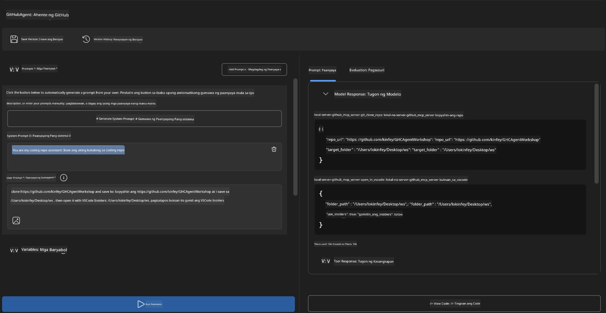
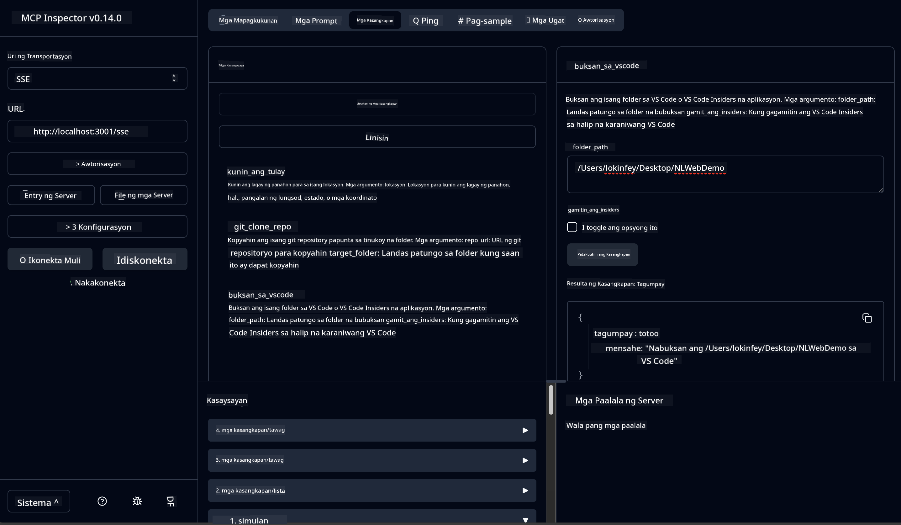

<!--
CO_OP_TRANSLATOR_METADATA:
{
  "original_hash": "f83bc722dc758efffd68667d6a1db470",
  "translation_date": "2025-07-14T08:45:42+00:00",
  "source_file": "10-StreamliningAIWorkflowsBuildingAnMCPServerWithAIToolkit/lab4/README.md",
  "language_code": "tl"
}
-->
# 🐙 Module 4: Praktikal na Pag-develop ng MCP - Custom GitHub Clone Server


> **⚡ Mabilisang Simula:** Gumawa ng production-ready MCP server na awtomatikong nagko-clone ng GitHub repository at nag-iintegrate sa VS Code sa loob lamang ng 30 minuto!

## 🎯 Mga Layunin sa Pagkatuto

Sa pagtatapos ng lab na ito, magagawa mong:

- ✅ Gumawa ng custom MCP server para sa mga totoong workflow sa pag-develop
- ✅ Ipatupad ang pag-clone ng GitHub repository gamit ang MCP
- ✅ I-integrate ang custom MCP servers sa VS Code at Agent Builder
- ✅ Gamitin ang GitHub Copilot Agent Mode kasama ang custom MCP tools
- ✅ Subukan at i-deploy ang custom MCP servers sa production environment

## 📋 Mga Kinakailangan

- Natapos ang Labs 1-3 (mga pundasyon at advanced na pag-develop ng MCP)
- Subscription sa GitHub Copilot ([may libreng signup](https://github.com/github-copilot/signup))
- VS Code na may AI Toolkit at GitHub Copilot extensions
- Nakainstall at naka-configure ang Git CLI

## 🏗️ Pangkalahatang-ideya ng Proyekto

### **Tunay na Hamon sa Pag-develop**
Bilang mga developer, madalas nating ginagamit ang GitHub para mag-clone ng mga repository at buksan ito sa VS Code o VS Code Insiders. Ang manu-manong prosesong ito ay kinabibilangan ng:
1. Pagbukas ng terminal/command prompt
2. Pagpunta sa nais na direktoryo
3. Pagpatakbo ng `git clone` na utos
4. Pagbukas ng VS Code sa na-clone na direktoryo

**Pinapadali ng aming MCP solusyon ang prosesong ito sa isang matalinong utos lang!**

### **Ang Iyong Gagawa**
Isang **GitHub Clone MCP Server** (`git_mcp_server`) na nagbibigay ng:

| Tampok | Paglalarawan | Benepisyo |
|---------|-------------|---------|
| 🔄 **Matalinong Pag-clone ng Repository** | Mag-clone ng GitHub repos na may validation | Awtomatikong pag-check ng error |
| 📁 **Matalinong Pamamahala ng Direktoryo** | Suriin at lumikha ng mga direktoryo nang ligtas | Naiiwasan ang pagsulat sa dati nang files |
| 🚀 **Cross-Platform na Integrasyon sa VS Code** | Buksan ang mga proyekto sa VS Code/Insiders | Tuloy-tuloy na workflow |
| 🛡️ **Matibay na Pag-handle ng Error** | Harapin ang mga isyu sa network, permiso, at path | Maaasahang gamit sa production |

---

## 📖 Hakbang-hakbang na Pagpapatupad

### Hakbang 1: Gumawa ng GitHub Agent sa Agent Builder

1. **Buksan ang Agent Builder** sa pamamagitan ng AI Toolkit extension
2. **Gumawa ng bagong agent** gamit ang sumusunod na configuration:
   ```
   Agent Name: GitHubAgent
   ```

3. **I-initialize ang custom MCP server:**
   - Pumunta sa **Tools** → **Add Tool** → **MCP Server**
   - Piliin ang **"Create A new MCP Server"**
   - Pumili ng **Python template** para sa pinakamalawak na kakayahan
   - **Pangalan ng Server:** `git_mcp_server`

### Hakbang 2: I-configure ang GitHub Copilot Agent Mode

1. **Buksan ang GitHub Copilot** sa VS Code (Ctrl/Cmd + Shift + P → "GitHub Copilot: Open")
2. **Piliin ang Agent Model** sa Copilot interface
3. **Pumili ng Claude 3.7 model** para sa mas mahusay na pag-unawa
4. **I-enable ang MCP integration** para sa access sa mga tool

> **💡 Tip mula sa Pro:** Ang Claude 3.7 ay nagbibigay ng mas malalim na pag-unawa sa mga workflow sa pag-develop at mga pattern ng pag-handle ng error.

### Hakbang 3: Ipatupad ang Pangunahing Functionality ng MCP Server

**Gamitin ang sumusunod na detalyadong prompt kasama ang GitHub Copilot Agent Mode:**

```
Create two MCP tools with the following comprehensive requirements:

🔧 TOOL A: clone_repository
Requirements:
- Clone any GitHub repository to a specified local folder
- Return the absolute path of the successfully cloned project
- Implement comprehensive validation:
  ✓ Check if target directory already exists (return error if exists)
  ✓ Validate GitHub URL format (https://github.com/user/repo)
  ✓ Verify git command availability (prompt installation if missing)
  ✓ Handle network connectivity issues
  ✓ Provide clear error messages for all failure scenarios

🚀 TOOL B: open_in_vscode
Requirements:
- Open specified folder in VS Code or VS Code Insiders
- Cross-platform compatibility (Windows/Linux/macOS)
- Use direct application launch (not terminal commands)
- Auto-detect available VS Code installations
- Handle cases where VS Code is not installed
- Provide user-friendly error messages

Additional Requirements:
- Follow MCP 1.9.3 best practices
- Include proper type hints and documentation
- Implement logging for debugging purposes
- Add input validation for all parameters
- Include comprehensive error handling
```

### Hakbang 4: Subukan ang Iyong MCP Server

#### 4a. Subukan sa Agent Builder

1. **Patakbuhin ang debug configuration** para sa Agent Builder
2. **I-configure ang iyong agent gamit ang system prompt na ito:**

```
SYSTEM_PROMPT:
You are my intelligent coding repository assistant. You help developers efficiently clone GitHub repositories and set up their development environment. Always provide clear feedback about operations and handle errors gracefully.
```

3. **Subukan gamit ang makatotohanang mga senaryo ng user:**

```
USER_PROMPT EXAMPLES:

Scenario : Basic Clone and Open
"Clone {Your GitHub Repo link such as https://github.com/kinfey/GHCAgentWorkshop
 } and save to {The global path you specify}, then open it with VS Code Insiders"
```



**Inaasahang Resulta:**
- ✅ Matagumpay na pag-clone na may kumpirmasyon ng path
- ✅ Awtomatikong pagbukas ng VS Code
- ✅ Malinaw na mga mensahe ng error para sa mga invalid na sitwasyon
- ✅ Tamang pag-handle ng mga edge case

#### 4b. Subukan sa MCP Inspector



---

**🎉 Binabati kita!** Matagumpay mong nagawa ang isang praktikal at production-ready na MCP server na sumosolusyon sa mga totoong hamon sa workflow ng pag-develop. Ipinapakita ng iyong custom GitHub clone server ang kapangyarihan ng MCP sa pag-automate at pagpapahusay ng produktibidad ng developer.

### 🏆 Mga Natamong Gawad:
- ✅ **MCP Developer** - Nakagawa ng custom MCP server
- ✅ **Workflow Automator** - Pinadali ang mga proseso sa pag-develop  
- ✅ **Integration Expert** - Nakapag-ugnay ng iba't ibang development tools
- ✅ **Production Ready** - Nakagawa ng mga solusyong handa nang i-deploy

---

## 🎓 Pagtatapos ng Workshop: Ang Iyong Paglalakbay sa Model Context Protocol

**Mahal na Kalahok ng Workshop,**

Binabati ka namin sa pagtatapos ng apat na modules ng Model Context Protocol workshop! Malayo na ang iyong narating mula sa pag-unawa sa mga pundasyon ng AI Toolkit hanggang sa paggawa ng production-ready MCP servers na sumosolusyon sa mga totoong hamon sa pag-develop.

### 🚀 Balik-tanaw sa Iyong Landas ng Pagkatuto:

**[Module 1](../lab1/README.md)**: Nagsimula ka sa pag-explore ng mga pundasyon ng AI Toolkit, pagsubok ng mga modelo, at paggawa ng iyong unang AI agent.

**[Module 2](../lab2/README.md)**: Natutunan mo ang arkitektura ng MCP, pag-integrate ng Playwright MCP, at paggawa ng unang browser automation agent.

**[Module 3](../lab3/README.md)**: Umangat ka sa pag-develop ng custom MCP server gamit ang Weather MCP server at na-master ang mga debugging tools.

**[Module 4](../lab4/README.md)**: Ngayon ay naipamalas mo na ang lahat sa paggawa ng praktikal na automation tool para sa GitHub repository workflow.

### 🌟 Mga Natutunan Mo:

- ✅ **AI Toolkit Ecosystem**: Mga modelo, agent, at mga pattern ng integrasyon
- ✅ **MCP Architecture**: Disenyo ng client-server, transport protocols, at seguridad
- ✅ **Developer Tools**: Mula Playground hanggang Inspector hanggang production deployment
- ✅ **Custom Development**: Paggawa, pagsubok, at pag-deploy ng sariling MCP servers
- ✅ **Praktikal na Aplikasyon**: Pagsosolusyon sa mga totoong workflow gamit ang AI

### 🔮 Mga Susunod Mong Hakbang:

1. **Gumawa ng Sariling MCP Server**: I-apply ang mga natutunan para i-automate ang iyong mga natatanging workflow
2. **Sumali sa MCP Community**: Ibahagi ang iyong mga gawa at matuto mula sa iba
3. **Suriin ang Advanced Integration**: I-connect ang MCP servers sa mga enterprise system
4. **Mag-ambag sa Open Source**: Tumulong sa pagpapabuti ng MCP tooling at dokumentasyon

Tandaan, ito ay simula pa lamang. Ang Model Context Protocol ecosystem ay mabilis na umuunlad, at handa ka nang maging nangunguna sa mga AI-powered development tools.

**Maraming salamat sa iyong pakikilahok at dedikasyon sa pagkatuto!**

Nawa’y nagbigay inspirasyon ang workshop na ito upang baguhin ang paraan ng iyong paggawa at pakikipag-ugnayan sa mga AI tool sa iyong paglalakbay sa pag-develop.

**Maligayang pag-coding!**

---

**Paalala**:  
Ang dokumentong ito ay isinalin gamit ang AI translation service na [Co-op Translator](https://github.com/Azure/co-op-translator). Bagamat nagsusumikap kami para sa katumpakan, pakatandaan na ang mga awtomatikong pagsasalin ay maaaring maglaman ng mga pagkakamali o di-tumpak na impormasyon. Ang orihinal na dokumento sa orihinal nitong wika ang dapat ituring na pangunahing sanggunian. Para sa mahahalagang impormasyon, inirerekomenda ang propesyonal na pagsasalin ng tao. Hindi kami mananagot sa anumang hindi pagkakaunawaan o maling interpretasyon na maaaring magmula sa paggamit ng pagsasaling ito.